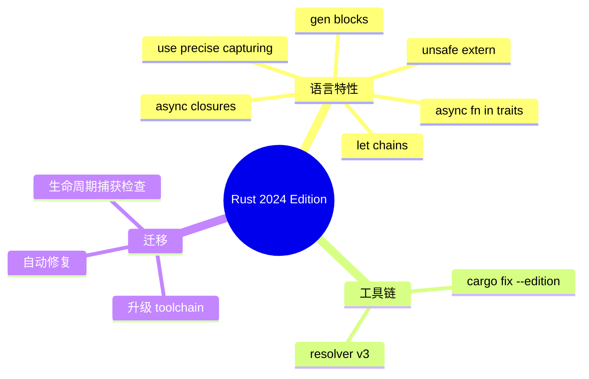

> **EN**: Rust Edition 2021 → 2024 Differences
> **Summary**: Authoritative guide to the major language, library, and toolchain differences between Rust Edition 2021 and Edition 2024, with migration paths and semantic rationale.
>
> **Rust 版本**: 1.97.0+ (Edition 2024)
> **Bloom 层级**: L2-L3
> **权威来源**: 本文件为 `concept/` 权威页。
> **A/S/P 标记**: **S** — Specification
> **前置概念**: [Editions](../../00_meta/01_terminology/01_terminology_glossary.md) · [Async/Await](../../03_advanced/01_async/01_async.md) · [Traits](../../02_intermediate/00_traits/01_traits.md) · [FFI](../../03_advanced/04_ffi/01_rust_ffi.md) · [Let Chains](../../01_foundation/04_control_flow/03_let_chains.md)
> **后置概念**: [Async Closures](../../03_advanced/01_async/07_async_closures.md) · [Unsafe Extern Blocks](../../03_advanced/04_ffi/05_unsafe_extern_blocks.md) · [Rust 1.85 Stabilized Features](../00_version_tracking/rust_1_90_stabilized.md) · [Rust 1.88 Stabilized Features](../00_version_tracking/rust_1_90_stabilized.md)

---

## 📑 目录

- [📑 目录](#-目录)
- [一、Edition 机制回顾](#一edition-机制回顾)
- [二、2024 Edition 特性总览](#二2024-edition-特性总览)
- [三、语言级变化](#三语言级变化)
  - [3.1 async fn in traits / RPITIT](#31-async-fn-in-traits--rpitit)
  - [3.2 Async closures](#32-async-closures)
  - [3.3 `unsafe extern` blocks](#33-unsafe-extern-blocks)
  - [3.4 `use<..>` precise capturing](#34-use-precise-capturing)
  - [3.5 Let chains](#35-let-chains)
  - [3.6 `gen` blocks](#36-gen-blocks)
  - [3.7 Match ergonomics reservations](#37-match-ergonomics-reservations)
  - [3.8 `unsafe` 属性语法](#38-unsafe-属性语法)
- [四、标准库与 Cargo 变化](#四标准库与-cargo-变化)
- [五、迁移指南](#五迁移指南)
- [六、反例与常见错误](#六反例与常见错误)
  - [反例 1：未升级 `extern` 块](#反例-1未升级-extern-块)
  - [反例 2：在 2021 Edition 使用 let chains](#反例-2在-2021-edition-使用-let-chains)
  - [反例 3：过度依赖默认捕获导致生命周期错误](#反例-3过度依赖默认捕获导致生命周期错误)
- [七、关键属性](#七关键属性)
- [八、思维导图](#八思维导图)
- [九、国际权威来源](#九国际权威来源)
- [十、嵌入式测验](#十嵌入式测验)
  - [测验 1：Edition 启用条件](#测验-1edition-启用条件)
  - [测验 2：`unsafe extern` 语义](#测验-2unsafe-extern-语义)
  - [测验 3：`use<..>` 用途](#测验-3use-用途)

---

## 一、Edition 机制回顾

Rust 的 **Edition** 是一种**跨 crate 的兼容性机制**：同一个 workspace 中可以混合使用 2015 / 2018 / 2021 / 2024 等不同 edition 的 crate，而编译器按每个 crate 的 `Cargo.toml` 中声明的 edition 解析源码。Edition 只引入**源码层面**的向后不兼容变化，不改变 ABI 或标准库语义。

```toml
[package]
name = "my-crate"
version = "0.1.0"
edition = "2024"
rust-version = "1.85"
```

> **Rust 2024 Edition 于 1.85.0 稳定**（2025-02-20）。要启用 2024 Edition，toolchain 必须 ≥ 1.85.0。

迁移通常只需：

```bash
rustup update stable
cargo fix --edition
```

`cargo fix` 能自动处理绝大多数机械性修改（如给 `extern` 块加 `unsafe`），无法自动处理的会给出诊断信息。

---

## 二、2024 Edition 特性总览

| 特性 | 稳定版本 | 是否需要 Edition 2024 | 主要影响 |
|:---|:---|:---|:---|
| `async fn` in traits / RPITIT | 1.75.0（基础）/ 1.85+ 默认生态 | 否，但 2024 默认捕获规则更直观 | trait 异步方法无需 `async-trait` 宏 |
| Async closures (`async || {}`) | 1.85.0 | 否，但 prelude 暴露依赖 edition | 高阶异步回调类型化 |
| `unsafe extern` blocks | 1.82.0 | 是 | `extern` 块必须显式 `unsafe` |
| `use<..>` precise capturing | 1.85.0+（随 2024） | 是 | 控制 `impl Trait` 捕获的生命周期/类型参数 |
| Let chains | 1.88.0 | 是 | `if let` / `while let` 可用 `&&` 链式组合 |
| `gen` blocks | nightly（截至 1.97） | 待定 | 生成器/迭代器语法糖 |
| Match ergonomics reservations | 1.85.0 | 是 | 部分模式默认绑定规则收紧 |
| `unsafe` attribute syntax | 1.85.0 | 是 | `#[unsafe(no_mangle)]` 等显式标注 |

> 来源：[Rust 1.85.0 Release Notes](https://blog.rust-lang.org/2025/02/20/Rust-1.85.0.html) · [Rust 1.88.0 Release Notes](https://blog.rust-lang.org/2026/01/29/Rust-1.88.0.html) · [RFC 3501 — Edition 2024](https://rust-lang.github.io/rfcs/3501-edition-2024.html)

---

## 三、语言级变化

### 3.1 async fn in traits / RPITIT

Rust 1.75 稳定了 **return-position `impl Trait` in traits (RPITIT)**，允许 trait 方法返回 `impl Trait` 或写成 `async fn`。在 2024 Edition 下，捕获规则更直观：默认不会过度捕获外部生命周期，减少“需要显式 `Captures` trait”的 workaround。

```rust
// 2024 Edition：更自然的签名
#[derive(Clone)]
struct Record;

trait DataSource {
    async fn fetch(&self, id: u64) -> Record;
    fn records(&self) -> impl Iterator<Item = Record>;
}
```

> 在 2021 Edition 中，`async fn` in trait 已经可用，但某些涉及生命周期捕获的边界需要手动标注 `use<..>` 或 `Captures` trick。2024 的捕获规则（RFC 3498）默认放宽了这些限制。

### 3.2 Async closures

`async || {}` 在 1.85 稳定，属于语言特性，不限定 edition；但 `AsyncFn`/`AsyncFnMut`/`AsyncFnOnce` trait 在 2024 Edition 的 prelude 中默认暴露，因此新代码通常无需手动 `use std::async_fn::AsyncFn;`。

```rust
use std::time::Duration;

#[tokio::main]
async fn main() {
    let f = async |x: i32| -> i32 {
        tokio::time::sleep(Duration::from_millis(10)).await;
        x * 2
    };
    let y = f(21).await;
    assert_eq!(y, 42);
}
```

详见 [Async Closures](../../03_advanced/01_async/07_async_closures.md)。

### 3.3 `unsafe extern` blocks

2024 Edition 要求 `extern` 块必须写成 `unsafe extern "C" { ... }`，因为 extern 块中的声明本质上都是不安全的 FFI 契约，旧写法 `extern "C" { ... }` 在 2024 下会产生编译错误。

```rust,compile_fail
// 2021 Edition：在 Edition 2024 下必须写成 unsafe extern
extern "C" {
    fn printf(fmt: *const c_char, ...);
}
```

```rust
use std::ffi::c_char;

// 2024 Edition
unsafe extern "C" {
    safe fn strlen(s: *const c_char) -> usize; // 单个函数可标记为 safe
    fn printf(fmt: *const c_char, ...);        // 默认 unsafe
}
```

> 2024 还引入了 `safe fn` 在 `unsafe extern` 块中的写法，用于显式声明某个 FFI 函数在 Rust 侧可以安全调用。

### 3.4 `use<..>` precise capturing

2024 Edition 允许在 `impl Trait` 返回类型中显式列出捕获的生命周期和类型参数，解决 2021 中“过度捕获”导致的借用检查器误判。

```rust
// 2024 Edition：精确捕获 'a，但不捕获 T
fn make_iter<'a, T>(slice: &'a [T]) -> impl Iterator<Item = &'a T> + use<'a, T> {
    slice.iter()
}
```

> `use<..>` 是向后兼容的显式注解；不提供时 2024 使用新的默认捕获规则，通常比 2021 更宽松。

### 3.5 Let chains

`let chains` 允许在 `if` / `while` 条件中用 `&&` 连接多个 `let` 模式与布尔表达式，绑定向右传播。

```rust
fn f(x: i32) -> Option<i32> { Some(x * 2) }

fn main() {
    let opt = Some(3);
    if let Some(x) = opt && x > 0 && let Some(y) = f(x) {
        println!("{} {}", x, y);
    }
}
```

稳定版本：**Rust 1.88.0**，仅 Edition 2024。详见 [链式 let 与 let 守卫](../../01_foundation/04_control_flow/03_let_chains.md)。

### 3.6 `gen` blocks

`gen { yield x; }` 提供原生生成器语法糖，目标是把异步/迭代器统一为更简洁的语法。截至 Rust 1.97.0 该特性仍在开发通道，未进入稳定版；示例与跟踪见 [Gen Blocks 预研](../02_preview_features/25_gen_blocks_preview.md)。

> 来源：[RFC 3513 — gen blocks](https://rust-lang.github.io/rfcs/3513-gen-blocks.html)

### 3.7 Match ergonomics reservations

2024 Edition 对部分 match ergonomics（默认引用绑定）场景做了收紧，防止隐式 `&` 模式导致的不直观借用。具体规则见 [Rust Reference — Match ergonomics](https://doc.rust-lang.org/reference/patterns.html#binding-modes)。

### 3.8 `unsafe` 属性语法

某些原本写作 `#[no_mangle]`、`#[link_section = ...]` 的属性，在 2024 Edition 下推荐/要求写成 `#[unsafe(no_mangle)]`、`#[unsafe(link_section = ...)]`，以提示这些属性会影响链接器行为、属于 unsafe 契约。

```rust
// 2024 Edition
#[unsafe(no_mangle)]
pub extern "C" fn my_entry() {}
```

---

## 四、标准库与 Cargo 变化

- **Prelude 更新**：2024 Edition prelude 默认包含 `AsyncFn*` trait 家族、`Future` 等类型，减少手动 `use`。
- **Cargo resolver**：`resolver = "3"` 与 Rust-version-aware resolver 在 2024 workspace 中默认启用，改善 feature unification 与 MSRV 解析。
- **`cargo fix --edition`**：自动迁移工具对 2024 的支持已完善，可处理 `unsafe extern`、`unsafe` 属性等机械修改。

> 来源：[Cargo Resolver 3](../../06_ecosystem/01_cargo/03_resolver_v3_public_feature_unification.md)

---

## 五、迁移指南

1. **升级 toolchain**：`rustup update stable`（≥ 1.85）。
2. **改 `Cargo.toml`**：`edition = "2024"`。
3. **运行 `cargo fix --edition`**：自动修复 `extern` 块、`unsafe` 属性等。
4. **处理生命周期捕获**：若出现“lifetime may not live long enough”新错误，检查 `impl Trait` 捕获，必要时加 `use<'a>`。
5. **测试异步 trait**：移除 `async-trait` 宏后，验证 `dyn Trait` 用法（RPITIT 仍不是 dyn-safe）。
6. **CI 同步**：更新 `rust-version`、GitHub Actions 矩阵、clippy/rustfmt 版本。

---

## 六、反例与常见错误

### 反例 1：未升级 `extern` 块

```rust,compile_fail
// 2024 Edition 下编译失败
extern "C" {
    fn c_api();
}
```

**修正**：

```rust
unsafe extern "C" {
    fn c_api();
}
```

### 反例 2：在 2021 Edition 使用 let chains

```rust,compile_fail
// edition = "2021" 下不可用
if let Some(x) = opt && x > 0 {}
```

**修正**：升级到 `edition = "2024"` 或改用嵌套 `if let`。

### 反例 3：过度依赖默认捕获导致生命周期错误

```rust,ignore
fn bad<'a, T>(slice: &'a [T]) -> impl Iterator<Item = &'a T> {
    slice.iter()
    // 2021 下可能因捕获 T 而报错；2024 默认通常通过，必要时用 + use<'a>
}
```

---

## 七、关键属性

| 属性 | 取值 / 判定 | 依据 |
|:---|:---|:---|
| 2024 Edition 稳定版本 | Rust 1.85.0 | 官方 release notes |
| 是否需要显式启用 | 是，在 `Cargo.toml` 设置 `edition = "2024"` | Cargo 文档 |
| `async fn` in trait 是否 dyn-safe | 否 | Rust Reference |
| `let chains` 是否可用 `\|\|` | 否 | RFC 2497 |
| `unsafe extern` 是否要求 2024 | 是 | RFC 3484 |

---

## 八、思维导图



---

## 九、国际权威来源

- [Rust 1.85.0 Release Notes](https://blog.rust-lang.org/2025/02/20/Rust-1.85.0.html)
- [Rust 1.88.0 Release Notes](https://blog.rust-lang.org/2026/01/29/Rust-1.88.0.html)
- [Rust Edition Guide — 2024](https://doc.rust-lang.org/edition-guide/rust-2024/index.html)
- [RFC 3501 — Edition 2024](https://rust-lang.github.io/rfcs/3501-edition-2024.html)
- [RFC 3484 — Unsafe Extern Blocks](https://rust-lang.github.io/rfcs/3484-unsafe-extern-blocks.html)
- [RFC 3498 — Lifetime Capture Rules 2024](https://rust-lang.github.io/rfcs/3498-lifetime-capture-rules-2024.html)
- [RFC 3513 — gen blocks](https://rust-lang.github.io/rfcs/3513-gen-blocks.html)
- [Rust Reference — Editions](https://doc.rust-lang.org/reference/items/extern-crates.html)

---

## 十、嵌入式测验

### 测验 1：Edition 启用条件

要启用 Rust 2024 Edition，toolchain 最低需要哪个版本？

- A. 1.75.0
- B. 1.85.0
- C. 1.88.0
- D. 1.91.0

<details>
<summary>✅ 答案</summary>

**B 正确**。Rust 2024 Edition 在 1.85.0 稳定；`let chains` 等部分特性则在 1.88.0 才稳定。

</details>

### 测验 2：`unsafe extern` 语义

以下哪项是 2024 Edition 的正确写法？

- A. `extern "C" { fn f(); }`
- B. `unsafe extern "C" { fn f(); }`
- C. `unsafe extern { fn f(); }`
- D. `extern unsafe "C" { fn f(); }`

<details>
<summary>✅ 答案</summary>

**B 正确**。2024 Edition 要求 `extern` 块前加 `unsafe`，ABI 字符串位置不变。

</details>

### 测验 3：`use<..>` 用途

`use<'a>` 在 `impl Trait` 返回类型中的作用是什么？

- A. 导入外部 crate
- B. 精确声明返回类型捕获的生命周期
- C. 标记函数为 unsafe
- D. 启用 2024 Edition

<details>
<summary>✅ 答案</summary>

**B 正确**。`use<'a>` 是 precise capturing 语法，用于显式列出 `impl Trait` 捕获的生命周期/类型参数，避免过度捕获。

</details>

---

> **过渡**: 理解 Edition 2024 的语言变化后，可进一步学习 [Async Closures](../../03_advanced/01_async/07_async_closures.md)、[Unsafe Extern Blocks](../../03_advanced/04_ffi/05_unsafe_extern_blocks.md) 与 [Let Chains](../../01_foundation/04_control_flow/03_let_chains.md) 的权威页。
