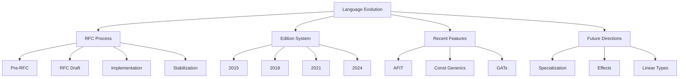

# Language Evolution（语言演进）

> **层级**: L7 前沿趋势
> **前置概念**: 全部前置层级
> **主要来源**: [Rust RFCs](https://rust-lang.github.io/rfcs/) · [Rust Blog] · [Edition Guide]

---

**变更日志**:

- v1.0 (2026-05-12): 初始版本

---

## 一、Rust 演进机制

### 1.1 RFC 流程

```text
想法 → 预 RFC 讨论 → RFC 草案 → 团队评审 → 接受/拒绝 → 实现 → 稳定化
         ↑___________________________________________________________↓
                              （反馈循环）
```

### 1.2 Edition 机制

| **Edition** | **年份** | **核心变化** |
|:---|:---|:---|
| Rust 2015 | 2015 | 初始版本 |
| Rust 2018 | 2018 | NLL, `async/await` (预留), 模块系统简化 |
| Rust 2021 | 2021 | 预lude 添加, `IntoIterator` for arrays, disjoint capture |
| Rust 2024 | 2024 | `gen` blocks, `never_type`, lifetime capture rules |

---

## 二、关键趋势

| **趋势** | **状态** | **影响** |
|:---|:---|:---|
| `async fn` in traits (AFIT) | ✅ 稳定 | 异步生态统一 |
| Const Generics | ✅ 稳定 | 类型级编程 |
| GATs | ✅ 稳定 | 关联类型泛型 |
| Specialization | 🚧 不稳定 | 泛型特化 |
| `gen` / coroutines | 🚧 演进中 | 生成器 |
| Effects / linear types | 📋 研究 | 更精确的资源跟踪 |

---

## 三、思维导图



---

## 四、知识来源

| **论断** | **来源** | **可信度** |
|:---|:---|:---|
| Edition 保证向后兼容 | [Rust Edition Guide] | ✅ |
| RFC 流程公开透明 | [Rust RFCs Repo] | ✅ |
| AFIT 2024 稳定 | [Rust Blog] | ✅ |

---

## 五、待补充

- [ ] **TODO**: 补充每个 edition 的完整变更清单
- [ ] **TODO**: 补充不稳定特性的 nightly 使用指南
