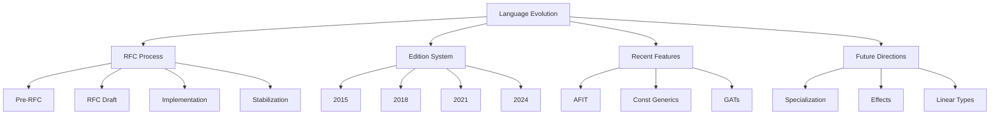
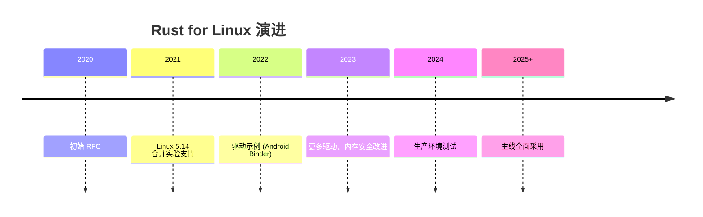

# Language Evolution（语言演进）

> **层级**: L7 前沿趋势
> **前置概念**: 全部前置层级
> **主要来源**: [Rust RFCs](https://rust-lang.github.io/rfcs/) · [Rust Blog] · [Edition Guide]

---

**变更日志**:

- v1.0 (2026-05-12): 初始版本

---

## 一、权威定义

### 1.1 Wikipedia 权威定义

> **[Wikipedia: Programming language evolution]** Programming language evolution is the process by which programming languages change over time. This can include the addition of new features, the removal of deprecated features, and changes to the language's syntax or semantics.

> **[Wikipedia: Software release life cycle]** A software release life cycle is the sum of the stages of development and maturity for a piece of computer software. Cycles range from its initial development to its eventual release, and include updated versions of the released version to help improve software or fix software bugs still present in the software.

> **[Wikipedia: Backward compatibility]** Backward compatibility is a property of a system, product, or technology that allows for interoperability with an older legacy system, or with input designed for such a system.

### 1.2 Rust 演进机制

### 1.1 RFC 流程

```text
想法 → 预 RFC 讨论 → RFC 草案 → 团队评审 → 接受/拒绝 → 实现 → 稳定化
         ↑___________________________________________________________↓
                              （反馈循环）
```

### 1.2 Edition 机制

| **Edition** | **年份** | **核心变化** |
|:---|:---|:---|
| Rust 2015 | 2015 | 初始版本 |
| Rust 2018 | 2018 | NLL, `async/await` (预留), 模块系统简化 |
| Rust 2021 | 2021 | 预lude 添加, `IntoIterator` for arrays, disjoint capture |
| Rust 2024 | 2024 | `gen` blocks, `never_type`, lifetime capture rules |

---

## 二、关键趋势

| **趋势** | **状态** | **影响** |
|:---|:---|:---|
| `async fn` in traits (AFIT) | ✅ 稳定 | 异步生态统一 |
| Const Generics | ✅ 稳定 | 类型级编程 |
| GATs | ✅ 稳定 | 关联类型泛型 |
| Specialization | 🚧 不稳定 | 泛型特化 |
| `gen` / coroutines | 🚧 演进中 | 生成器 |
| Effects / linear types | 📋 研究 | 更精确的资源跟踪 |

---

## 三、思维导图



---

## 四、与 L2-L3 的演进关联

| 演进方向 | 影响的概念层 | 关联文件 | 演进风险 |
|:---|:---|:---|:---|
| GATs 完整化 | L2 泛型 + Trait | `02_intermediate/02_generics.md`, `01_traits.md` | 类型系统复杂度 |
| Effects 系统 | L2 Trait + L3 Async | `02_intermediate/01_traits.md`, `03_advanced/02_async.md` | 学习曲线 |
| 特化 (Specialization) | L2 Trait | `02_intermediate/01_traits.md` | Coherence 破坏 |
| Const 泛型扩展 | L2 泛型 | `02_intermediate/02_generics.md` | 编译时间 |
| 异步生态统一 | L3 Async | `03_advanced/02_async.md` | 生态系统分裂 |

## 五、知识来源

| **论断** | **来源** | **可信度** |
|:---|:---|:---|
| Edition 保证向后兼容 | [Rust Edition Guide] | ✅ |
| RFC 流程公开透明 | [Rust RFCs Repo] | ✅ |
| AFIT 2024 稳定 | [Rust Blog] | ✅ |

## 三、扩展内容：关键趋势详解与演进路线图

### 3.1 Effects 系统（Effect System）

> **[研究前沿]** Effects 系统将 IO、异步、异常等副作用显式标注在类型中：

```rust
// 假想语法（非当前 Rust）
effect Async {
    async fn fetch() -> Data;
}

fn process() -> Data / Async {  // 显式标注需要 Async effect
    fetch().await
}
```

| Effect 类型 | 当前 Rust | 理想 Effects |
|:---|:---|:---|
| IO | `std::io::Result` | `fn f() -> T / IO` |
| Async | `async fn` | `fn f() -> T / Async` |
| 异常 | `Result` / `panic` | `fn f() -> T / Throws E` |
| 状态突变 | `&mut` | `fn f() -> T / State` |

### 3.2 特化 (Specialization) 完整设计

```rust
// 当前 Rust（不稳定，需 nightly）
#![feature(min_specialization)]

trait Display {
    fn display(&self);
}

// 通用实现
impl<T> Display for T {
    default fn display(&self) { println!("generic"); }
}

// 特化实现
impl Display for i32 {
    fn display(&self) { println!("i32: {}", self); }
}
```

| 维度 | 现状 | 风险 |
|:---|:---|:---|
| 语法 | `default impl` | 不稳定 |
| 一致性 | 需保证 Coherence | 重叠 impl 冲突 |
| 使用场景 | 性能优化 | 编译时间增加 |

### 3.3 Const 泛型完整化路线图

| 阶段 | 功能 | 状态 |
|:---|:---|:---|
| ✅ Rust 1.51 | 基本 const generics `N: usize` | 稳定 |
| ✅ Rust 1.79 | `where N > 0` 简单约束 | 稳定 |
| 🚧 开发中 | 常量表达式泛型 `N + 1` | nightly |
| 🚧 开发中 | `const fn` in traits | 不稳定 |
| 🔮 未来 | 依赖类型（有限形式） | 研究 |

### 3.4 Rust in Linux 内核演进



### 3.5 Edition 2024 预期变更

| 领域 | 可能变更 | 影响 |
|:---|:---|:---|
| `impl Trait` | 递归位置允许 | 简化类型标注 |
| Lifetime | 隐式 `'static` 调整 | 减少标注 |
| Match ergonomics | 继续改进 | 减少 `ref` |
| Unsafe | 更精确的 unsafe 操作标注 | 安全审计 |
| Async | 异步闭包改进 | 更易用 |

---

## 六、相关概念链接

| 概念 | 文件 | 关系 |
|:---|:---|:---|
| GATs | [`../02_intermediate/02_generics.md`](../02_intermediate/02_generics.md) | 演进影响 |
| AFIT/RPITIT | [`../03_advanced/02_async.md`](../03_advanced/02_async.md) | 演进影响 |
| Trait 系统 | [`../02_intermediate/01_traits.md`](../02_intermediate/01_traits.md) | 演进影响 |
| Effects 系统 | [`../02_intermediate/01_traits.md`](../02_intermediate/01_traits.md) | 未来方向 |
| 形式化方法 | [`../07_future/02_formal_methods.md`](../07_future/02_formal_methods.md) | 协同演进 |
| 语言对比 | [`../05_comparative/03_paradigm_matrix.md`](../05_comparative/03_paradigm_matrix.md) | 定位参考 |

---

## 五、待补充

- [ ] **TODO**: 补充每个 edition 的完整变更清单
- [ ] **TODO**: 补充不稳定特性的 nightly 使用指南
