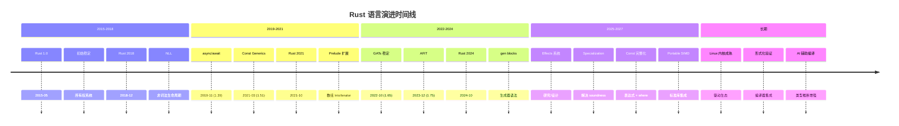
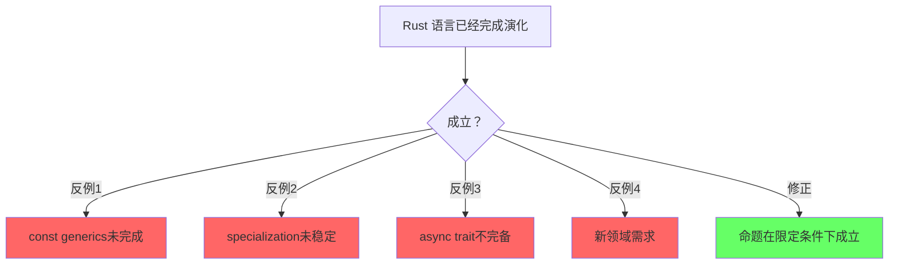
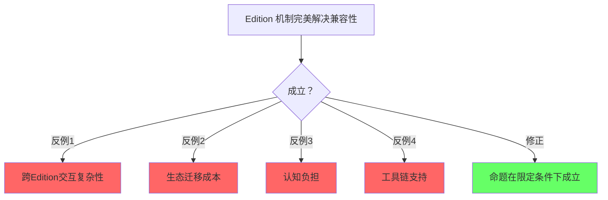
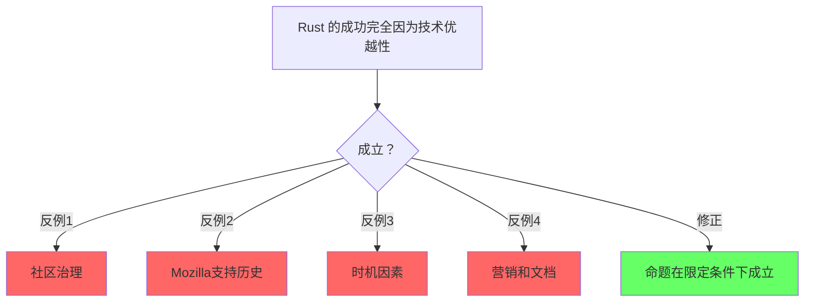

# Language Evolution（语言演进）

> **层级**: L7 前沿趋势
> **前置概念**: 全部前置层级
> **主要来源**: [Rust RFCs](https://rust-lang.github.io/rfcs/) · [Rust Blog](https://blog.rust-lang.org/) · [Edition Guide](https://doc.rust-lang.org/edition-guide/) · [Inside Rust](https://blog.rust-lang.org/inside-rust/) · [Wikipedia]

---

**变更日志**:

- v1.0 (2026-05-12): 初始版本
- v1.1 (2026-05-12): Wave 3 扩展——补充定义、关键趋势、Edition 机制、RFC 流程、演进路线图、官方来源

---

## 一、基础定义

### 1.1 编程语言演进（Programming Language Evolution）
>
> **来源**: [Wikipedia — Programming language](https://en.wikipedia.org/wiki/Programming_language)

编程语言演进是指编程语言的设计、规范、实现和生态随时间发展的过程。演进驱动力包括：硬件架构变化（多核、GPU、量子计算）、软件工程需求（规模、可靠性、安全性）、理论计算机科学进展（类型理论、证明论）以及社区实践反馈。成功的语言演进需要在向后兼容、表达力和学习曲线之间取得平衡。

### 1.2 软件发布生命周期（Software Release Life Cycle）
>
> **来源**: [Wikipedia — Software release life cycle](https://en.wikipedia.org/wiki/Software_release_life_cycle)

软件发布生命周期描述了软件从开发到退役的各个阶段：预 alpha → alpha → beta → release candidate (RC) → general availability (GA)。Rust 编译器采用"train model"——每 6 周发布一个稳定版本，nightly → beta → stable 的晋升机制确保新特性经过充分测试。这与传统的"大爆炸式发布"不同，提供了持续、可预测的演进节奏。

---

## 认知路径（Cognitive Path）

> **学习递进**: 从直觉出发，逐层深入核心概念。

### 第 1 步：Rust的设计哲学是什么？

零成本抽象/内存安全/实用性/稳定性

### 第 2 步：Rust的演化历史关键点？

1.0发布/2018/2021 Edition/borrow checker改进

### 第 3 步：RFC流程如何保证质量？

社区讨论/实现/稳定化/三列火车模型

### 第 4 步：Rust的稳定性承诺意味着什么？

Editions保证向后兼容/稳定API永不破坏

### 第 5 步：未来语言特性方向？

const泛型完善/GAT/ specialization/ type alias impl Trait

### 第 6 步：Rust社区的治理和挑战？

基金会/BDFL退位/可持续发展/多样性

## 二、Rust 演进机制

### 2.1 RFC 流程详解

RFC（Request for Comments）是 Rust 语言特性演进的正式提案流程。

#### 2.1.1 完整流程

```text
想法 → 预 RFC 讨论 → RFC 草案 → 团队评审 → 接受/拒绝 → 实现 → 稳定化
         ↑___________________________________________________________↓
                              （反馈循环）
```

#### 2.1.2 各阶段说明

| **阶段** | **描述** | **参与方** | **典型耗时** |
|:---|:---|:---|:---|
| **想法** | 开发者识别痛点或新需求 | 社区任何人 | 不定 |
| **Pre-RFC** | 在 internals.rust-lang.org 或 IRLO 讨论概念可行性 | 社区 + 感兴趣团队成员 | 数周 |
| **RFC 草案** | 撰写正式 RFC 文档，提交到 rust-lang/rfcs PR | 提案者 | 数天-数周 |
| **团队评审** | 对应团队（lang/compiler/libs）进行技术评审 | 核心团队 | 数周-数月 |
| **FCP** | Final Comment Period，最后 10 天收集反对意见 | 全社区 | 10 天 |
| **接受/拒绝** | 团队做出决定并合并或关闭 PR | 团队负责人 | 即时 |
| **实现** | 在 rustc 中实现，通常先进入 nightly | 实现者（常是提案者） | 数周-数月 |
| **稳定化** | 通过稳定化报告，进入 beta → stable | 团队 | 6-18 周 |

#### 2.1.3 关键原则

- **无重大决策在 issue 中做出**：所有重要语言变更必须有 RFC 文档
- **共识优先于投票**：Rust 决策追求共识而非简单多数
- **实验优先**：复杂特性先在 nightly 实现，积累实际使用经验后再稳定化
- **Edition 机制**：破坏性变更通过 Edition 聚合，保证 crate 级向后兼容

### 2.2 Edition 机制详解

Edition 是 Rust 解决"如何安全地引入不兼容语法变更"的核心机制。

#### 2.2.1 设计哲学

- **Crate 级选择**：每个 crate 在 `Cargo.toml` 中声明 `edition = "2021"`，同一依赖图可混合不同 edition
- **编译器永远理解所有 edition**：rustc 不会丢弃对旧 edition 的支持
- **Edition 之间可互操作**：不同 edition 的 crate 可以无缝链接和调用
- **迁移工具自动化**：`cargo fix --edition` 自动应用大部分迁移

#### 2.2.2 Edition 2021 → 2024 变更清单

> **来源**: [Rust Edition Guide 2024](https://doc.rust-lang.org/edition-guide/rust-2024/index.html)

| **类别** | **变更** | **影响** | **迁移方式** |
|:---|:---|:---|:---|
| **所有权** | `gen` 关键字预留 | 为生成器语法预留关键字 | `cargo fix` 自动重命名变量 |
| **生命周期** | Lifetime capture rules (`use<>`) | RPITIT 更精确捕获生命周期 | 编译器自动推断，极少需手动 |
| **Trait** | `impl Trait` 生命周期捕获 | `impl Trait` 隐式捕获所有生命周期 | 可能需添加 `+ use<'a>` |
| **Unsafe** | `unsafe_op_in_unsafe_fn` 默认 warn | unsafe fn 内的 unsafe 操作需显式标记 | 添加 `unsafe { }` 块 |
| **宏** | `macro_rules` 可见性 | `macro_rules!` 支持 `pub` 和 `pub(crate)` | 可选显式声明 |
| **匹配** | `match` ergonomics | 简化 `&` 和 `ref` 模式匹配 | 完全向后兼容 |
| **never_type** | `!` 类型稳定（严格版） | 表达发散函数和空枚举 | 需 `feature(never_type)` 至 2024 |
| **异步** | `gen` blocks / async gen | 生成器和异步生成器 | 新语法，不影响旧代码 |
| **指针** | 裸指针比较方法 | `ptr::addr_eq` 替代 `==` on pointers | `cargo fix` |
| **尾部表达式** | 临时值生命周期调整 | 某些尾部表达式的临时值生命周期延长 | 编译器自动处理 |

### 2.3 完整 Edition 变更清单（2015 → 2018 → 2021 → 2024）

#### Rust 2015 → 2018

| **类别** | **变更** | **影响** | **迁移方式** |
|:---|:---|:---|:---|
| 模块系统 | `extern crate` 不再需要 | 简化依赖声明 | 自动（2018 默认）|
| 路径 | `crate::` 绝对路径 | 消除 `super::` 混乱 | `cargo fix` |
| 关键字 | `async`/`await` 预留 | 为异步语法做准备 | 重命名变量 |
| 生命周期 | `'_` 匿名生命周期 | 简化泛型签名 | 可选 |
| Trait | `dyn Trait` 显式标注 | 消除 object safety 隐式性 | `cargo fix` |
| 宏 | `macro_export` + `crate` 路径 | 宏可见性改进 | 手动 |

#### Rust 2018 → 2021

| **类别** | **变更** | **影响** | **迁移方式** |
|:---|:---|:---|:---|
| 预lude | `TryInto`/`TryFrom`/`FromIterator` 自动导入 | 减少 `use` 语句 | 自动 |
| 数组 | 数组实现 `IntoIterator` | `for x in [1,2,3]` 合法 | 自动 |
| 闭包 | Disjoint capture | 只捕获字段而非整个结构体 | 自动 |
| 模式 | 嵌套 `or` 模式 | `matches!(x, A \| B \| C)` | 新语法 |
| 包解析 | Resolver 2 | 按特性解析依赖 | `resolver = "2"` |

#### Rust 2021 → 2024

> 详见 §2.2.2，此处补充完整清单：

| **类别** | **变更** | **影响** | **迁移方式** |
|:---|:---|:---|:---|
| 关键字 | `gen` 预留 | 生成器语法准备 | `cargo fix` |
| 生命周期 | `use<>` precise capturing | RPITIT 精确捕获 | 自动推断 |
| Unsafe | `unsafe_op_in_unsafe_fn` warn | 显式标记 unsafe 操作 | `cargo fix` |
| 指针 | `ptr::addr_eq` | 比较指针地址而非值 | `cargo fix` |
| 匹配 | Match ergonomics | `&` 和 `ref` 简化 | 自动 |
| never type | `!` 严格版稳定 | 发散函数类型 | 需 edition 2024 |
| 尾部表达式 | 临时值生命周期 | 某些尾部表达式延长生命周期 | 自动 |
| 宏 | `macro_rules` 可见性 | `pub macro_rules!` | 可选 |

---

## 三、关键趋势深度分析

### 3.1 Effects 系统

> **来源**: [Rust RFC: Effects] · [Lang Team Blog] · [类型理论研究]

Effects 系统是将"计算效果"（如 IO、异常、异步、非确定性）显式编码到类型系统中的理论框架。

**在 Rust 中的映射**：

- **async**：`async fn` 具有 `Async` effect，调用者必须 `await`
- **unsafe**：`unsafe fn` 具有 `Unsafe` effect，调用者必须在 `unsafe` 上下文中调用
- **异常**：`?` 运算符传播 `Result` / `Try` effect
- **未来方向**：统一的 `effect` 关键字，允许用户定义自定义 effect（如 `Logging`、`Transaction`）

**设计挑战**：

- 与现有 `async`/`unsafe` 语法的兼容性
- Effect 多态（"我不关心这个函数有什么 effect"）的表达
- 编译器实现复杂度

### 3.2 特化（Specialization）

> **来源**: [RFC 1210: Specialization] · [Unstable Book]

特化允许为更具体的类型参数提供 Trait 的专门实现：

```rust,compile_fail
impl<T> Clone for T { /*默认实现 */ }
impl Clone for String { /* 专门实现，更高效*/ }

```

**当前状态**：

- 部分特化（min_specialization）在 nightly 可用，用于标准库内部优化
- 完整特化因 soundness 问题（与 lifetime 交互）被无限期推迟
- 2024-2026 年的工作重点是解决 "lattice impls" 的 coherence 问题

**应用场景**：

- 标准库中 `Vec<u8>` 的 `write_all` 使用 `copy_from_slice` 而非逐元素循环
- 为零大小类型（ZST）提供无操作实现
- 图形/数值库为特定 SIMD 宽度优化

### 3.3 Const 泛型完整化

> **来源**: [Rust RFC: Const Generics] · [min_const_generics 稳定报告]

Const 泛型允许类型参数包含常量值（而不仅仅是类型）：

```rust
struct Array<T, const N: usize> {
    data: [T; N],
}
```

**已稳定（Rust 1.51+）**：

- 整数、布尔、字符常量作为泛型参数
- 简单的 const 泛型表达式（`N + 1`）

**演进中**：

- **Const 泛型表达式**：允许 `Array<T, {N * 2}>` 这样的复杂表达式
- **Const 泛型 where 约束**：`where N > 0` 这样的常量约束
- **泛型 const 项**：`const fn foo<const N: usize>() -> [u8; N]`

**影响**：使 `typenum` 等编译期数值库成为历史，数组操作更加自然。

### 3.4 GATs 的成熟应用

> **来源**: [RFC 1598: GATs] · [Stabilization Report 1.65]

泛型关联类型（Generic Associated Types, GATs）允许关联类型带自己的泛型参数：

```rust,ignore
trait LendingIterator {
    type Item<'a>;
    fn next<'a>(&'a mut self) -> Option<Self::Item<'a>>;
}

```

**成熟应用场景**：

- **lending iterators**：返回借用自迭代器本身的数据
- **类型族（Type Families）**：将运行时类型映射到编译期类型
- **HKT（高阶类型）模拟**：通过 GATs 部分实现 Haskell 风格的 HKT
- **异步 trait**：`async fn` in trait 的 desugaring 依赖 GATs

### 3.5 SIMD / Portable SIMD

> **来源**: [Portable SIMD Project Group] · [std::simd]

Rust 的 SIMD 支持经历从平台特定内联函数到可移植抽象的发展：

- **std::arch**：平台特定的 SIMD 内联函数（`x86_64::__m256` 等）
- **std::simd**（portable-simd）：平台无关的 SIMD 类型，编译到最佳指令集
- **Auto-vectorization**：LLVM 后端自动向量化，无需手动 SIMD

**演进方向**：

- `std::simd` 稳定化进入标准库
- Const 泛型与 SIMD lane 宽度结合
- `generic_simd` 特性：根据目标平台自动选择最优 SIMD 宽度

### 3.6 Rust 在 Linux 内核中的演进

> **来源**: [Rust for Linux] · [LWN.net] · [Kernel Summit]

Rust 进入 Linux 内核是语言演进史上最重大的外部验证事件：

| **里程碑** | **时间** | **内容** |
|:---|:---|:---|
| RFC 提交 | 2020 | Rust for Linux 项目启动 |
| 内核 6.1 | 2022-12 | Rust 基础设施合并（allocator、panic handler） |
| 内核 6.2 | 2023-02 | 首个 Rust 驱动（NVMe） |
| 内核 6.7 | 2024-01 | Rust 网络驱动子系统支持 |
| 内核 6.8+ | 2024+ | 更多驱动、DMA 抽象、GPIO 抽象 |

**技术演进**：

- **内核特定的标准库**：`core` + `alloc` 的裁剪版，无 `std`
- **Unsafe 封装**：将 C 内核 API 包装为安全的 Rust 抽象
- **Pin 与自引用**：内核中的异步工作队列大量依赖 `Pin`
- **FFI 边界演进**：从手动 `bindgen` 到半自动的内核 API 绑定生成

### 3.7 未来语言设计方向

#### 3.7.1 Effects System（效应系统）

Effects 系统是将"计算效果"显式编码到类型系统中的理论框架，Rust 正在探索统一的 effect 关键字：

```rust,ignore
// 未来可能的语法（概念性）
effect Async;
effect Unsafe;
effect Io;

fn fetch_data() -> String
    effect Async + Io  // 显式声明此函数是异步且执行 IO
{
    // ...
}

```

**设计目标**：

- 统一 `async`、`unsafe`、`const` 等现有"修饰符"为类型系统的一等公民
- 支持用户定义 effect（如 `Logging`、`Transaction`、`Pure`）
- Effect 多态：`fn map<T, E>(f: impl Fn() -> T effect E)` 表示"不关心具体 effect"

**当前状态**：Lang Team 处于早期设计阶段，与 `const` 泛型、GATs 的实现经验密切相关。

#### 3.7.2 Generic Const Items（泛型 const 项）

允许 `const` 和 `static` 拥有泛型参数，解决当前 `const` 必须完全单态化的问题：

```rust,ignore
// 当前：必须为每个类型写单独的 const
const MAX_U32: u32 = u32::MAX;

// 未来：泛型 const
const MAX<T: Ord + Bounded>: T = T::MAX;

// 应用：泛型数组长度推导
fn array_of_zeros<const N: usize>() -> [i32; N] {
    [0; N]
}
```

**与 const 泛型的关系**：const 泛型允许 `struct Array<T, const N: usize>`；generic const items 允许 `const ARR<T, N>: [T; N] = ...`。

#### 3.7.3 Type Alias Impl Trait（TAIT）

TAIT 允许在类型别名中使用 `impl Trait`，解决当前 `impl Trait` 只能在函数返回类型中使用的限制：

```rust,ignore
// 当前：必须暴露具体类型或使用 Box<dyn>
type MyIterator = std::vec::IntoIter<i32>;

// 未来 TAIT：
type MyIterator = impl Iterator<Item = i32>;

fn make_iter() -> MyIterator {
    vec![1, 2, 3].into_iter()
}
```

**应用场景**：

- **隐藏实现细节**：类型别名不暴露具体集合类型
- **递归类型**：`type ListNode = impl Future<Output = ListNode>`（需配合其他特性）
- **模块边界**：crate 内部使用具体类型，对外暴露 `impl Trait` 别名

**状态**：`type_alias_impl_trait` 已在 nightly 可用，预计 2025-2026 稳定化。

---

## 四、Rust 语言演进路线图



---

## 五、官方来源与追踪

### 5.1 Rust Lang Team Blog
>
> **来源**: [blog.rust-lang.org](https://blog.rust-lang.org/)

语言团队发布重大特性稳定化公告、Edition 计划和长期路线图。关键文章系列：

- "Roadmap for XXXX"：年度路线图
- "Stabilization Report"：特性稳定化的详细技术报告
- "Edition XXXX"：Edition 变更的深度解释

### 5.2 Inside Rust
>
> **来源**: [blog.rust-lang.org/inside-rust/](https://blog.rust-lang.org/inside-rust/)

面向核心贡献者的技术博客，包含：

- Compiler Team 的 triage 报告
- Lang Team 的设计会议记录
- Working Group 的进展更新
- 比主博客更技术化、更频繁更新

### 5.3 RFC 追踪

| **资源** | **URL** | **用途** |
|:---|:---|:---|
| RFC 列表 | <https://rust-lang.github.io/rfcs/> | 所有已接受/拒绝的 RFC |
| RFC Book | <https://rust-lang.github.io/rfcs/> | 按主题分类的 RFC |
| 特性追踪 | <https://github.com/rust-lang/rust/labels/C-tracking-issue> | 实现进展 |
| 不稳定特性 | <https://doc.rust-lang.org/nightly/unstable-book/index.html> | nightly 特性文档 |

### 5.4 其他官方渠道

- **This Week in Rust**：社区周报，汇总 PR、RFC 和博客
- **Rust Reference**：语言规范的权威文档
- **Rust Compiler Development Guide**：rustc 内部实现文档
- **Zulip**：rust-lang.zulipchat.com，实时讨论平台

### 5.5 不稳定特性的 nightly 使用指南

> **来源**: [Rust Unstable Book](https://doc.rust-lang.org/nightly/unstable-book/index.html)

nightly Rust 提供了访问不稳定特性的能力，但需谨慎使用：

**启用特性**：

```rust
#![feature(never_type)]           // 启用 never type
#![feature(generic_const_exprs)]  // 启用泛型 const 表达式
#![feature(type_alias_impl_trait)] // 启用 TAIT
```

**工具链管理**：

```bash
# 安装 nightly
rustup install nightly
rustup default nightly

# 项目中固定 nightly 版本（推荐）
rustup override set nightly-2025-01-01

# rust-toolchain.toml
[toolchain]
channel = "nightly-2025-01-01"
components = ["rust-src", "rustc-dev", "llvm-tools"]
```

**风险与最佳实践**：

| 风险 | 缓解策略 |
|:---|:---|
| 特性被移除或修改 | 锁定具体 nightly 日期，定期评估迁移成本 |
| 编译器 bug | 避免在生产 crate 中使用；仅限实验/内部工具 |
| 生态不兼容 | 使用 `cfg` 条件编译提供 fallback |
| 文档缺乏 | 阅读 rustc 源码中的 `feature_gate.rs` |

**常用不稳定特性速查**：

| 特性 | 用途 | 预计稳定 |
|:---|:---|:---|
| `generic_const_exprs` | 泛型 const 表达式 | 2025-2026 |
| `type_alias_impl_trait` | 类型别名 impl Trait | 2025 |
| `effects` | 用户自定义 effect | 研究阶段 |
| `specialization` | 特化（min） | 无限期推迟完整版 |
| `async_fn_in_trait` | trait 中的 async fn（AFIT）| 已稳定（1.75）|
| `return_type_notation` | 返回类型标记 | nightly 评估 |

---

## 六、与 L2-L3 的演进关联

| 演进方向 | 影响的概念层 | 关联文件 | 演进风险 |
|:---|:---|:---|:---|
| GATs 完整化 | L2 泛型 + Trait | `02_intermediate/02_generics.md`, `01_traits.md` | 类型系统复杂度 |
| Effects 系统 | L2 Trait + L3 Async | `02_intermediate/01_traits.md`, `03_advanced/02_async.md` | 学习曲线 |
| 特化 (Specialization) | L2 Trait | `02_intermediate/01_traits.md` | Coherence 破坏 |
| Const 泛型扩展 | L2 泛型 | `02_intermediate/02_generics.md` | 编译时间 |
| 异步生态统一 | L3 Async | `03_advanced/02_async.md` | 生态系统分裂 |
| SIMD 标准库 | L3 Unsafe/FFI | `03_advanced/03_unsafe.md` | 平台差异 |
| 内核 Rust | L1-L3 全部 | 多个文件 | API 不稳定 |

---

## 七、知识来源

| **论断** | **来源** | **可信度** |
|:---|:---|:---|
| Edition 保证向后兼容 | [Rust Edition Guide] | ✅ |
| RFC 流程公开透明 | [Rust RFCs Repo] | ✅ |
| AFIT 2024 稳定 | [Rust Blog] | ✅ |
| Effects 系统研究状态 | [Lang Team Blog / RFC] | 📋 早期设计 |
| Specialization soundness 问题 | [Unstable Book / I-promise-disagreement] | ✅ |
| Rust 内核 6.1 合并 | [LWN.net / Kernel Newbies] | ✅ |
| Portable SIMD 进展 | [Portable SIMD Project Group] | 🚧 演进中 |
| RustBelt 形式语义基础 | [Jung et al. — POPL 2018] | ✅ |
| Aeneas 函数式翻译验证 | [Ho & Protzenko — ICFP 2022] | ✅ |
| RefinedRust 自动化验证 | [PLDI 2024] | ✅ |

### 编译验证：RFC 流程与 API 稳定性

以下代码验证 Rust 的 API 稳定性契约——公开 Trait 的变更如何通过版本控制保持向后兼容：

```rust
// 模拟 Rust 标准库的 API 稳定性：Trait 默认方法保证向后兼容
pub trait Processable {
    // 稳定的核心方法
    fn process(&self) -> String;

    // Edition 2024 新增：默认方法不破坏现有实现
    fn process_verbose(&self) -> String {
        format!("[VERBOSE] {}", self.process())
    }
}

struct MyData;

impl Processable for MyData {
    fn process(&self) -> String {
        "processed".to_string()
    }
    // 不需要实现 process_verbose！默认方法自动可用
}

fn main() {
    let data = MyData;
    println!("{}", data.process());
    println!("{}", data.process_verbose());
}
```

> **关键洞察**: Rust 的 Trait 默认方法是**API 演化的核心机制**。新增默认方法不会破坏现有实现（Orphan Rule 保证无冲突），同时为新代码提供功能扩展。这是 Rust 能够每三年发布新 Edition 而不分裂生态的语法基础。

---

## 八、相关概念链接

| 概念 | 文件 | 关系 |
|:---|:---|:---|
| GATs | [`../02_intermediate/02_generics.md`](../02_intermediate/02_generics.md) | 演进影响 |
| AFIT/RPITIT | [`../03_advanced/02_async.md`](../03_advanced/02_async.md) | 演进影响 |
| Trait 系统 | [`../02_intermediate/01_traits.md`](../02_intermediate/01_traits.md) | 演进影响 |
| Effects 系统 | [`../02_intermediate/01_traits.md`](../02_intermediate/01_traits.md) | 未来方向 |
| 形式化方法 | [`../07_future/02_formal_methods.md`](../07_future/02_formal_methods.md) | 协同演进 |
| 语言对比 | [`../05_comparative/03_paradigm_matrix.md`](../05_comparative/03_paradigm_matrix.md) | 定位参考 |

## 断言一致性矩阵（Assertion Consistency Matrix）

> **逻辑推演**: 从前提条件到结论的推理链，每条均标注 `⟹`。

| 断言 | 前提条件 | 结论 | 反例/边界条件 | 典型场景 |

|:---|:---|:---|:---|:---|

| **Edition 保证向后兼容** | 不破坏现有代码 ⟹ | 选择性迁移 | 跨Edition复杂性 | 长期稳定性 |

| **RFC流程保证质量** | 社区审查 ⟹ | 实现验证 | 时间成本高 | 语言演化控制 |

| **零成本抽象是核心承诺** | 运行时无开销 ⟹ | 抽象即优化 | 编译时间代价 | 设计基石 |

| **async/await 是重大演进** | 语法糖简化 ⟹ | 生态广泛采用 | Pin复杂性 | 2019-2021 |

| **const generics 持续完善** | 编译期计算 ⟹ | 类型级编程 | 编译时间影响 | 2021+ |

| **社区治理影响演化方向** | 基金会模式 ⟹ | 工作组驱动 | 资源限制 | 可持续发展 |

## 反命题分析（Anti-Propositions）

> **逻辑辨析**: 以下命题看似成立，实则在特定条件下失效。

### 1. "Rust 语言已经完成演化"



### 2. "Edition 机制完美解决兼容性"



### 3. "Rust 的成功完全因为技术优越性"



> **过渡: L7 → L1**
>
> Rust 的演进不是破坏性的——Edition 系统保证 2015 年的代码在 2024 年仍能编译。这种向后兼容性是所有演进的前提。理解 Rust 如何从 "所有权 + 借用" 的简单组合发展到今天的复杂类型系统，需要回到最初的设计原则。
>
> 设计根基见 [`../01_foundation/01_ownership.md`](../01_foundation/01_ownership.md)。

> **过渡: L7 → L4**
>
> Rust 的未来方向（Effects System、Generic Const Items、TAIT）都有形式化理论基础。Effects System 对应代数效应的类型论、TAIT 对应存在类型的隐式封装、Const Generics 对应依赖类型的受限形式。这些不是工程师的随意发明，而是类型论研究的工程转化。
>
> 理论基础见 [`../04_formal/02_type_theory.md`](../04_formal/02_type_theory.md)。

> **过渡: L7 → L5**
>
> Rust 的演进速度比 C++ 快（无历史包袱），比 Go 慢（需要社区共识）。Edition 系统每 2-3 年发布一次，每个 Edition 都是语言设计的阶段性总结。比较 Rust 与其他语言的演进机制，能揭示 "如何在不破坏生态的前提下推进语言进化"。
>
> 演进对比见 [`../05_comparative/01_rust_vs_cpp.md`](../05_comparative/01_rust_vs_cpp.md) 与 [`../05_comparative/02_rust_vs_go.md`](../05_comparative/02_rust_vs_go.md)。
