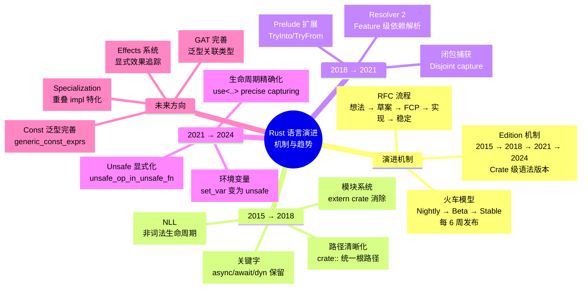
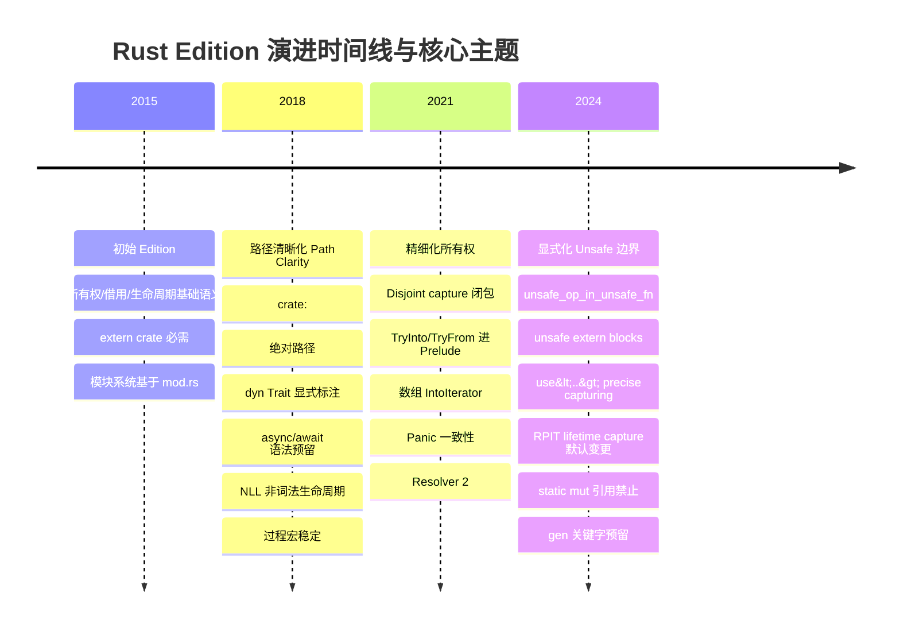
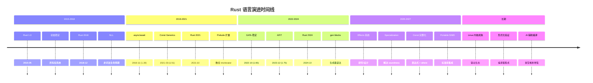
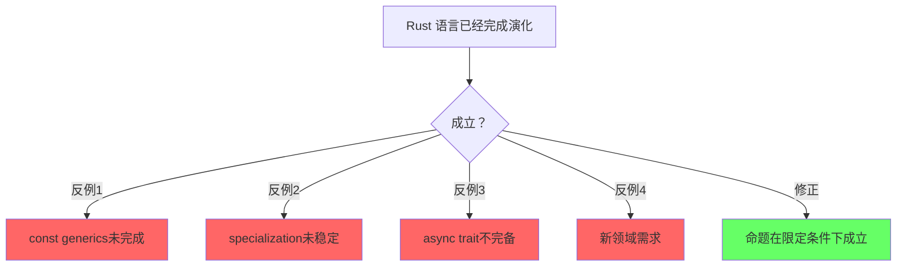
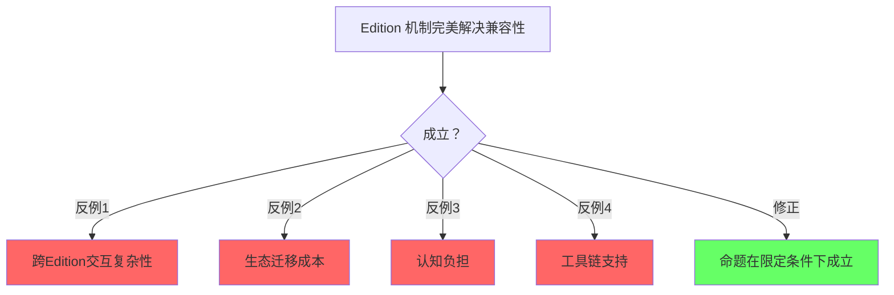
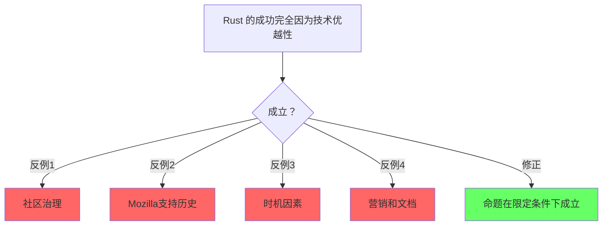

# Language Evolution（语言演进）

> **代码状态**: ✅ 含可编译示例

>
> **EN**: Language Evolution（语言演进） (Chinese)
> **Summary**: Language Evolution. Guide to 03 Evolution.
>
> **受众**: [专家]
> **内容分级**: [综述级]
> **层级**: L7 前沿趋势
> **A/S/P 标记**: **S+P** — Structure + Procedure
> **双维定位**: C×Eva — 评价语言演进方向的技术路线
> **前置概念**: 全部前置层级
> **主要来源**:
> [Rust RFCs](https://rust-lang.github.io/rfcs/) ·
> [Rust Blog](https://blog.rust-lang.org/) ·
> [Edition Guide](https://doc.rust-lang.org/edition-guide/) ·
> [Inside Rust](https://blog.rust-lang.org/inside-rust/) ·
> [Wikipedia]
> **定理链**: N/A — 描述性/综述性/导航性文档，不涉及形式化定理链
---

> ⚠️ **不稳定特性警告**: 本文件包含 `#![feature(...)]` 标注的代码示例，需要 **nightly 工具链** 编译。
>
> **使用方式**: `rustup run nightly rustc ...` 或 `cargo +nightly ...`
> **状态查询**: <https://doc.rust-lang.org/nightly/unstable-book/index.html>
> **注意**: 不稳定特性可能在后续版本中变更或移除，生产代码应避免依赖。

---
> **Bloom 层级**: 分析 → 评价
**变更日志**:

- v1.0 (2026-05-12): 初始版本$entry
- v1.1 (2026-05-12): Wave 3 扩展——补充定义、关键趋势、Edition 机制、RFC 流程、演进路线图、官方来源
- v1.2 (2026-05-14): 补充完整 Edition 变更清单（2015→2018→2021→2024）、Edition 与 rustc 版本解耦、`cargo fix --edition` 自动迁移机制、跨 Edition 代码示例、未来 Edition 方向（2027+）
- v1.4 (2026-05-26): 补充 Rust 2026 Project Goals 四大旗舰目标详解（Beyond the &、灵活编译、高阶 Rust、释放沉睡 Trait）及子目标矩阵 [来源: Web Authority Alignment Sprint]
- v1.3 (2026-05-22): 网络权威内容对齐 Batch 9：补充 Project Goals 2026 年度旗舰目标（Polonius Alpha、Safety-Critical Rust、cargo-script）、Effects 系统 `gen<yield>` 跟踪、Ferrocene ASIL B/SIL 2 认证动态
- v1.5 (2026-05-26): 权威内容对齐 R16：补充 2025H2 Project Goals 最终状态报告（Rust Blog 2026-05-18）；更新 build-std [RFC 3873](https://rust-lang.github.io/rfcs/3873.html)/3874 已合并状态、Cranelift 资金不足未完成确认 [来源: Rust Blog — Project Goals Update: April 2026]
- v1.6 (2026-05-26): 权威内容对齐 R18：补充 Project-wide LLM Policy [RFC 3936](https://rust-lang.github.io/rfcs/3936.html)（Rust 首个项目级 AI 使用政策） [来源: TWiR 650]
- v1.7 (2026-05-26): 权威内容对齐 R24：① 更新 build-std [RFC 3874](https://rust-lang.github.io/rfcs/3874.html) FCP 完成待合并；② 补充 [RFC 3962](https://rust-lang.github.io/rfcs/3962.html) Documentation interpolation（FCP 中）；③ 补充 RustWeek 2026 All Hands（Utrecht, 5.18–5.23）关键 RFC 讨论 [来源: Rust Project Goals Update; Rust Internals]
- v1.8 (2026-06-06): 权威内容对齐：① 修正 cargo-script 状态（非"已稳定"，而是稳定化推进中，Project Goals 2026 Continued，blocker 为 edition policy）；② 新建 `17_ergonomic_ref_counting_preview.md` 跟踪文档（Flagship: Higher-level Rust，Niko Matsakis + Santiago Pastorino 主导）；③ 更新 `13_unsafe_fields_preview.md`（RFC 3458 已接受 2026-02，Clippy #16767 等待 review） [来源: Rust Project Goals 2026 April Update 2026-05-18]
- v1.9 (2026-06-06): 权威内容对齐 Batch 10：① Rust Foundation Maintainer Fund 正式上线（2026-06-02）；② `rust_1_97_preview.md` 补充 1.97 稳定化候选 API（`float_algebraic` FCP 中、`core::range::RangeFull/RangeTo` FCP 完成、`RandomSource`、`PathBuf::into_string`、`Result::map_or_default`）；③ `19_security_practices.md` 补充 CVE-2026-33055/33056（Cargo tar 提取，1.94.1 已修复） [来源: Rust Blog 2026-06-02; releases.rs 2026-06-06]
- v1.10 (2026-06-06): 权威内容对齐 Batch 11：① `19_rust_for_linux.md` 补充 Debian 14 Forky MSRV 策略（Debian Stable 是 Rust for Linux 的 MSRV 基准，预计 2027 年夏季发布）；② `rust_1_97_preview.md` 补充 `new_range_remainder`（Tracking Issue #154458）、`core::alloc::Alloc`（PR #157286）、`box_vec_non_null`（PR #157273，PFCP） [来源: Inside Rust Blog 2026-03-27; releases.rs 2026-06-06]
- v1.11 (2026-06-06): 权威内容对齐 Batch 12：① `19_security_practices.md` 补充 crates.io 恶意 crate 通知政策变更（2026-02-13 起不再为每个恶意 crate 发布博客，仅发 RustSec advisory）及 2026 年恶意 crate 案例（`time_calibrator` RUSTSEC-2026-0030、`tracings` RUSTSEC-2026-0027、`rpc-check` RUSTSEC-2026-0018 等）；② `17_rust_specification_preview.md` 更新 gccrs 2026-03-18 月度报告进展（Rust-for-Linux 25%、测试用例 +347） [来源: Rust Blog 2026-02-13; rust-gcc.github.io 2026-03-18]
- v1.12 (2026-06-06): 权威内容对齐 Batch 13：`19_security_practices.md` 补充 2026-06 新 RustSec 公告——恶意 crate `exploration`（RUSTSEC-2026-0155）及生态漏洞速览（`russh` RUSTSEC-2026-0154 HIGH、`russh-cryptovec` RUSTSEC-2026-0153 HIGH、`oneringbuf` RUSTSEC-2026-0152 等） [来源: RustSec Advisory DB 2026-06-05]
- v1.13 (2026-06-06): 权威内容对齐 Batch 14：`19_rust_for_linux.md` 补充不稳定特性依赖边界最新进展——截至 LPC 2025（2025-12），Rust for Linux 仅剩 2 个不稳定特性待稳定化（`arbitrary_self_types` 和 `derive(CoercePointee)`），其他关键特性已稳定 [来源: LPC 2025 Rust for Linux 幻灯片]
- v1.14 (2026-06-06): 权威内容对齐 Batch 15：① `19_security_practices.md` 补充 TrapDoor 跨生态系统供应链攻击（2026-05-25，含 Crates.io 恶意包 `sui-move-build-helper`、`move-compiler-tools` 及 AI 配置文件污染手法）；② `rust_1_97_preview.md` 补充 Open Enums / Unnamed Enum Variants（RFC 3894，Tracking Issue #156628，2026-04-22 批准为 lang experiment） [来源: ByteIota 2026-05-25; rust-lang/rust#156628]
- v1.15 (2026-06-08): 权威内容对齐 Batch 16：① `19_security_practices.md` 补充 RustSec 2026-06-04/05 新公告——恶意 crate `logflux`（RUSTSEC-2026-0171）、`diesel` SQLite UAF（RUSTSEC-2026-0172）、`matrix-sdk-ui`/`matrix-sdk-crypto` 漏洞、PQClean 生态批量归档（7 个 `pqcrypto-*` unmaintained）；② `rust_1_97_preview.md` 补充 `VecDeque::retain_back`（PR #151973，FCP 完成） [来源: RustSec Advisory DB 2026-06-05; releases.rs 2026-06-08]
- v1.16 (2026-06-08): 权威内容对齐 Batch 17：① `05_rust_version_tracking.md` 修复稳定化 PR 编号错误（`Result::map_or_default` #156629 误标为 #156222），补充 `-Zprofile-sample-use`（#156222）和 `c-variadic`（#155942）PFCP 状态；② `06_runtime_comparison_glommio_2025.md` / `02_网络库对比选择.md` 更新 `surf` / `tide` unmaintained 状态标注（RUSTSEC-2026-0169/0170） [来源: releases.rs 2026-06-06; RustSec Advisory DB 2026-06-04]
- v1.17 (2026-06-08): 内部维护（信息平坦期）：① `04_formal/` L4 纯数学 `[教学类比]` 标注扫查完成（22/22 活跃文件已标注，2 归档文件无需标注）；② L3 概念-代码-练习循环链接补全——16 个活跃高级概念文件新增指向 `crates/` 和 `exercises/src/` 的交叉引用（并发/异步/Unsafe/宏/Pin/类型擦除/零拷贝解析/锁自由等主题）；③ `cargo check --workspace` 验证通过
- v1.18 (2026-06-08): 内部维护（信息平坦期）：补齐缺失追踪文档——① 新建 `24_cargo_semver_checks_preview.md`（cargo-semver-checks 从社区工具到 Cargo 官方集成跟踪，覆盖 ~245 lint、type-checking lints GSoC 2026、public 依赖标记集成）；② 新建 `25_aarch64_sve_sme_preview.md`（AArch64 SVE/SME 可伸缩向量扩展跟踪，RFC #3838 未接受、Tracking Issue #145052、`sve_zeroinitializer` #157110）
- v1.19 (2026-06-08): 内部维护（信息平坦期）：嵌入式互动测验试点——新建 `concept/01_foundation/23_quiz_ownership_borrowing.md`，10 道所有权/借用/生命周期互动题，采用 `<details>` 标签实现"自测-展开-核对"闭环，每题链接至对应概念文件、crate 示例和 exercises 练习；已加入 L1 README 索引
- v1.20 (2026-06-08): 内部维护（信息平坦期）：嵌入式测验扩展——① 新建 `concept/01_foundation/24_quiz_type_system.md`（类型系统 10 题，标量/复合类型、enum、模式匹配、类型转换）；② 新建 `concept/02_intermediate/23_quiz_traits_and_generics.md`（Trait/泛型 10 题，trait bound、关联类型、trait 对象、`impl Trait`）；③ 新建 `concept/01_foundation/25_quiz_error_handling.md`（错误处理 10 题，Result/Option、`?` 运算符、panic、自定义错误）；已全部加入对应层级 README 索引
- v1.21 (2026-06-08): 内部维护（信息平坦期）：L3 嵌入式测验扩展——① 新建 `concept/03_advanced/21_quiz_concurrency_async.md`（并发/异步 10 题，Send/Sync、Mutex/Arc、channel、Future/Pin、`join!`）；② 新建 `concept/03_advanced/22_quiz_unsafe.md`（Unsafe 10 题，原始指针、MaybeUninit、FFI、`unsafe_op_in_unsafe_fn`、Miri 验证）；③ 新建 `concept/03_advanced/23_quiz_macros.md`（宏系统 10 题，`macro_rules!` 重复模式、卫生性、derive/属性/函数式过程宏）；已全部加入 L3 README 索引
- v1.22 (2026-06-08): 内部维护（信息平坦期）：跨层级测验扩展——① 新建 `concept/06_ecosystem/57_quiz_toolchain.md`（工具链 10 题，Cargo 依赖解析、Clippy lint、Miri UB 检测、发布流程）；② 新建 `concept/01_foundation/26_quiz_modules_testing.md`（模块/测试 10 题，可见性、集成测试、`should_panic`）；③ 新建 `concept/04_formal/24_quiz_formal_methods.md`（形式化方法 10 题，分离逻辑、RustBelt、验证工具链对比、Tree Borrows）；已全部加入对应层级 README 索引
- v1.23 (2026-06-08): 内部维护（信息平坦期）：核心概念补全测验——① 新建 `concept/02_intermediate/24_quiz_memory_management.md`（内存管理 10 题，Box/Rc/Arc/RefCell/Cell、Weak、Deref、Drop、内部可变性）；② 新建 `concept/05_comparative/17_quiz_rust_vs_systems.md`（跨语言对比 10 题，Rust vs C/C++/Go 在内存安全、并发、错误处理、零成本抽象、嵌入式场景的对比）；③ 新建 `concept/01_foundation/27_quiz_closures_iterators.md`（闭包/迭代器 10 题，Fn/FnMut/FnOnce、move 闭包、惰性求值、适配器/消费者、fold/find/filter/map 组合）；已全部加入对应层级 README 索引
- v1.24 (2026-06-08): Phase 3 内容瘦身启动：① 从 L1-L6 各层级 README 索引中移除 13 个已归档文件链接（`01_foundation/19_numerics.md`、`02_intermediate/22_iterator_patterns.md`、L3 的 6 个归档文件、`04_formal/07_separation_logic.md` 和 `09_operational_semantics.md`、`05_comparative/16_rust_vs_ruby.md`、L6 的 2 个归档文件）；② 清理 `07_future/README.md` 中指向 `archive/01_ai_integration_original.md` 的历史链接；③ 更新 `04_formal/README.md` 核心功能描述（"可机械验证"→"形式化直觉与教学类比"），为 6 个高形式化密度文件在索引表格中追加 `[教学类比]` 标注
- v1.25 (2026-06-08): Phase 3 深度瘦身完成：① 迁移 12 个活跃层级中的"已归档-in-place"重复文件至 `concept/archive/`（L3 新增 5 个：02_async_programming、03_unsafe_rust、05_macros、08_zero_cost_abstractions、13_async_patterns；此前 L1/L2/L4/L5/L6 共 7 个）；② 归档/删除 8 个根目录级旧版索引（`00.md`/`03-07.md` 归档，`01.md` 已归档、`02.md` 0 字节占位符已删除）；③ 归档 3 个历史规划文件（`PLAN.md`、`PLAN_Semantic_Space_Wave.md`、`SUMMARY.md`）；④ 新建 `archive/ARCHIVE_INDEX.md` 统一索引；⑤ 修复 7 处指向已归档文件的活跃链接（`README.md` / `inter_layer_topology.md` / `LEARNING_MVP_PATH.md` / `53_embedded_graphics.md` / `17_quiz_rust_vs_systems.md` / `25_aarch64_sve_sme_preview.md` / `35_pattern_composition_algebra.md`），清理 `05_formal_ecosystem_tower.md` 变更日志 stray `$entry` 字符
- v1.26 (2026-06-19): 权威内容对齐 Batch 22：① 新增 §6.9 维护者成长案例（Tiffany Pek Yuan）与 §6.10 跨仓库工程工具 Josh；② 新增 §6.11 Rust Foundation 3 月董事会治理动态。详见 `05_rust_version_tracking.md` §12.14–§12.16 [来源: Inside Rust 2026-05/06]
- v1.27 (2026-06-19): 权威内容对齐 Batch 23：新增 §6.12 Leadership Council 与基金会 1–2 月治理动态（Project Priorities Budget、AI 贡献政策、代表选举）。详见 `05_rust_version_tracking.md` §12.17–§12.19 [来源: Inside Rust 2026-02/03/04]
- v1.28 (2026-06-19): 权威内容对齐 Batch 24：新增 §6.13 Rust-C++ 互操作倡议进展（从研究转向实施、WG21 长期路线、Teor 受聘推进问题空间映射）。来源：Rust Foundation Interop Initiative Update 2026
- v1.29 (2026-06-19): 权威内容对齐 Batch 25：新增 §6.14 Rust Innovation Lab 下一阶段（入选标准、rustls / Symposium 案例、基金会孵化模式）。来源：Rust Foundation Blog 2026-03-30
- v1.30 (2026-06-20): 权威内容对齐 Batch 26：新增 §6.15 OpenAI 以铂金会员身份加入 Rust Foundation 并捐赠 $600k 支持维护者、Project Goals 与 RIL；补充 RFMF 筹款渠道（GitHub Sponsors、rust-lang.org/funding）。来源：Rust Foundation 2026-06
- v1.31 (2026-06-20): 权威内容对齐 Batch 27：新增 §6.16 2026 年 Rust Foundation 会员动态（Canonical Gold、Meilisearch & Doulos Silver、OpenAI Platinum）。来源：Rust Foundation 2026-01/03/06
- v1.32 (2026-06-20): 权威内容对齐 Batch 30：新增 §6.17 Rust Foundation 加入 Datadog Open Source Program；§6.18 Walter Pearce 当选 OpenSSF Ambassador；§6.19 MWC + Talent Arena 2026；§6.20 FOSDEM 2026 Rust Devroom 回顾；§6.21 Symposium 入驻 Rust Innovation Lab；§6.22 Mainmatter 巴塞罗那 Rust 实训。来源：Rust Foundation 2026-02/03/04/05/06

---

> **后置概念**: [Rust Specification](https://www.rust-lang.org/) · [官方路线图](https://github.com/rust-lang/rust/labels/F-roadmap)
> **前置依赖**: [Rust vs C++](../05_comparative/01_rust_vs_cpp.md)
> **前置依赖**: [Toolchain](../06_ecosystem/01_toolchain.md)

## 〇、Rust 语言演进认知全景



> **认知功能**: 提供 Rust 语言演进的全景认知框架，将 RFC 流程、火车模型、Edition 机制与各阶段核心主题统一为层级化心智模型。建议作为"地图"使用：首次阅读把握整体节奏，后续按需深入特定 Edition。关键洞察：三个 Edition 的主题递进揭示了 Rust 从语法简化到语义精确的演化逻辑。[来源: 💡 原创分析]
> [来源: [Rust Reference](https://doc.rust-lang.org/reference/)]
> **认知路径**: 本 mindmap 将 Rust 演进组织为**机制层**（RFC/火车/Edition）和**内容层**（各 Edition 的核心主题）。读者可按时间轴从中心向外阅读，或按兴趣直接跳转到特定 Edition。2018 的主题是"路径清晰化"，2021 是"精细化所有权"，2024 是"显式化 Unsafe 边界"——三个 Edition 形成从"语法简化"到"语义精确"的递进。

---

## 一、基础定义
>

### 1.1 编程语言演进（Programming Language Evolution）
>
>
> **来源**: [Wikipedia — Programming language](https://en.wikipedia.org/wiki/Programming_language)

编程语言演进是指编程语言的设计、规范、实现和生态随时间发展的过程。
演进驱动力包括：硬件架构变化（多核、GPU、量子计算）、软件工程需求（规模、可靠性、安全性）、理论计算机科学进展（类型理论、证明论）以及社区实践反馈。
成功的语言演进需要在向后兼容、表达力和学习曲线之间取得平衡。

### 1.2 软件发布生命周期（Software Release Life Cycle）
>
>
> **来源**: [Wikipedia — Software release life cycle](https://en.wikipedia.org/wiki/Software_release_life_cycle)

软件发布生命周期描述了软件从开发到退役的各个阶段：预 alpha → alpha → beta → release candidate (RC) → general availability (GA)。
Rust 编译器采用"train model"——每 6 周发布一个稳定版本，nightly → beta → stable 的晋升机制确保新特性经过充分测试。
这与传统的"大爆炸式发布"不同，提供了持续、可预测的演进节奏。

---

## 认知路径（Cognitive Path）

> **学习递进**: 从直觉出发，逐层深入核心概念。

### 第 1 步：Rust的设计哲学是什么？

零成本抽象/内存安全/实用性/稳定性

### 第 2 步：Rust的演化历史关键点？

1.0发布/2018/2021 Edition/borrow checker改进

### 第 3 步：RFC流程如何保证质量？

社区讨论/实现/稳定化/三列火车模型

### 第 4 步：Rust的稳定性承诺意味着什么？

Editions保证向后兼容/稳定API永不破坏

### 第 5 步：未来语言特性方向？

const泛型完善/GAT/ specialization/ type alias impl Trait

### 第 6 步：Rust社区的治理和挑战？
>

基金会/BDFL退位/可持续发展/多样性

## 二、Rust 演进机制
>

### 2.1 RFC 流程详解
>

RFC（Request for Comments）是 Rust 语言特性演进的正式提案流程。

#### 2.1.1 完整流程

```text
想法 → 预 RFC 讨论 → RFC 草案 → 团队评审 → 接受/拒绝 → 实现 → 稳定化
         ↑___________________________________________________________↓
                              （反馈循环）
```

#### 2.1.2 各阶段说明

| **阶段** | **描述** | **参与方** | **典型耗时** |
|:---|:---|:---|:---|
| **想法** | 开发者识别痛点或新需求 | 社区任何人 | 不定 |
| **Pre-RFC** | 在 internals.rust-lang.org 或 IRLO 讨论概念可行性 | 社区 + 感兴趣团队成员 | 数周 |
| **RFC 草案** | 撰写正式 RFC 文档，提交到 rust-lang/rfcs PR | 提案者 | 数天-数周 |
| **团队评审** | 对应团队（lang/compiler/libs）进行技术评审 | 核心团队 | 数周-数月 |
| **FCP** | Final Comment Period，最后 10 天收集反对意见 | 全社区 | 10 天 |
| **接受/拒绝** | 团队做出决定并合并或关闭 PR | 团队负责人 | 即时 |
| **实现** | 在 rustc 中实现，通常先进入 nightly | 实现者（常是提案者） | 数周-数月 |
| **稳定化** | 通过稳定化报告，进入 beta → stable | 团队 | 6-18 周 |

#### 2.1.3 关键原则

- **无重大决策在 issue 中做出**：所有重要语言变更必须有 RFC 文档
- **共识优先于投票**：Rust 决策追求共识而非简单多数
- **实验优先**：复杂特性先在 nightly 实现，积累实际使用经验后再稳定化
- **Edition 机制**：破坏性变更通过 Edition 聚合，保证 crate 级向后兼容

### 2.2 Edition 机制详解

Edition 是 Rust 解决"如何安全地引入不兼容语法变更"的核心机制。Rust 采用约每 3 年发布一个新 Edition 的节奏（2015 → 2018 → 2021 → 2024），在不破坏现有 crate 的前提下，允许语言清理历史包袱、引入更优雅的语法。

#### 2.2.1 核心概念与设计哲学

**Edition 的本质**是**同一 crate 内源代码解析规则的版本**。它不同于编译器版本（`rustc 1.XX`）或 Cargo 版本，而是一种 opt-in 的语法方言开关。核心设计原则包括：

| **原则** | **说明** | **工程意义** |
|:---|:---|:---|
| **Crate 级选择** | 每个 crate 在 `Cargo.toml` 中声明 `edition = "2021"` | 同一依赖图可混合不同 edition，互不干扰 |
| **编译器永远理解所有 edition** | `rustc` 不会丢弃对旧 edition 的支持 | 2015 年的代码在 2030 年的编译器上仍可编译 |
| **Edition 之间可互操作** | 不同 edition 的 crate 可以无缝链接和调用 | ABI 兼容，仅语法解析差异 |
| **迁移工具自动化** | `cargo fix --edition` 自动应用大部分迁移 | 降低升级成本，鼓励社区跟进 |

**Bloom 层级**: 🎯 理解 → 分析

#### 2.2.2 Edition 与 rustc 版本解耦

Rust 编译器的版本（如 `rustc 1.85.0`）与 Edition（如 `2024`）是**正交的两个维度**：

```text
rustc 1.85.0 ──┬── 支持 edition = "2015"
               ├── 支持 edition = "2018"
               ├── 支持 edition = "2021"
               └── 支持 edition = "2024"（默认）
```

- **编译器版本**决定**可用特性**和**标准库 API**。例如 `rustc 1.75` 稳定了 `async fn` in trait，该特性在所有 edition 中均可用（只要编译器版本足够新）。
- **Edition**决定**语法解析规则**。例如 `dyn Trait` 在 2015 edition 中可省略 `dyn`，在 2018+ 中必须显式写出；但 `rustc 1.85` 同时支持这两种写法，取决于 crate 声明的 edition。

```toml
# Cargo.toml 中的 edition 选择
[package]
name = "my-crate"
version = "0.1.0"
edition = "2024"      # 语法解析规则版本
rust-version = "1.85" # MSRV：最低编译器版本
```

这种解耦是 Rust 稳定承诺的基石：**升级编译器不会破坏现有代码**（只要不更改 edition），而**升级 edition 是 crate 作者的主动选择**。

#### 2.2.3 `cargo fix --edition` 自动迁移机制

`cargo fix` 是 Rust 工具链内置的自动迁移工具，其核心工作流如下：

```bash
# 1. 在当前 edition 下修复所有警告（推荐先执行）
cargo fix

# 2. 检查迁移到目标 edition 的兼容性
cargo fix --edition --allow-dirty

# 3. 手动修改 Cargo.toml: edition = "2024"
# 4. 重新构建验证
cargo build
```

**自动迁移的能力边界**：

| **可自动修复** | **需手动审查** |
|:---|:---|
| 关键字冲突重命名（`async` → `r#async`） | `unsafe fn` 内 unsafe 操作的语义审查 |
| `dyn Trait` 显式标注 | `impl Trait` + `use<>` 的生命周期设计 |
| 路径系统迁移（`extern crate` 移除） | `static mut` 引用移除后的并发安全重构 |
| `macro_rules!` 片段指定符补全 | 闭包 disjoint capture 导致的 Drop 顺序变化 |
| `unsafe extern` 块标记 | 指针比较从值语义到地址语义的逻辑影响 |

对于无法自动修复的变更，编译器通过 `rust-2024-compatibility` lint group 提供诊断信息，开发者可按警告逐个处理：

```bash
# 手动启用特定迁移 lint
cargo check -W rust-2024-compatibility
```

---

### 2.3 完整 Edition 变更清单（2015 → 2018 → 2021 → 2024）

以下表格汇总每个 Edition 的完整语法与语义变更。每个变更均标注：**类别**、**具体变更**、**影响范围**、**迁移方式**。

#### 2.3.1 Rust 2015 → 2018（Rust 1.31，2018-12）

| **类别** | **变更** | **影响** | **迁移方式** |
|:---|:---|:---|:---|
| **模块系统** | `extern crate` 不再需要（宏 crate 除外） | 依赖自动进入 extern prelude | 自动，无需 `extern crate` |
| **模块系统** | `crate::` 作为当前 crate 绝对路径根 | 统一路径语义 | `cargo fix` 自动重写路径 |
| **模块系统** | Uniform paths：`use` 路径相对当前模块 | 消除 `use` 与其他路径的不一致 | 自动 |
| **模块系统** | `foo.rs` + `foo/` 共存，`mod.rs` 非必需 | 更灵活的目录布局 | 可选迁移 |
| **关键字** | `async`、`await`、`try` 成为保留关键字 | 禁止作为标识符 | `cargo fix` 重命名或 `r#` 原始标识符 |
| **关键字** | `dyn` 成为严格关键字 | 禁止作为标识符 | `cargo fix` |
| **Trait** | `dyn Trait` 必须显式标注 | `Box<Trait>` → `Box<dyn Trait>` | `cargo fix` 自动添加 `dyn` |
| **生命周期** | `'_` 匿名生命周期参数占位符 | 简化泛型签名中的显式生命周期 | 可选使用 |
| **生命周期** | NLL（Non-Lexical Lifetimes）默认启用 | 借用检查更精确，释放更早 | 编译器自动（后回传至 2015 edition）|
| **宏** | 过程宏（`proc_macro`）稳定；可用 `use` 导入宏 | 宏系统现代化 | 手动迁移宏导入方式 |
| **Trait** | Trait 方法参数禁止匿名（必须有参数名） | `fn foo(&self, u8)` → `fn foo(&self, _: u8)` | `cargo fix` |
| **类型推断** | 裸指针方法分派改进 | 对推断变量的原始指针更精确 | 自动 |

**关键洞察**：Rust 2018 的核心主题是**路径清晰化（Path Clarity）**。`extern crate` 的消除、`crate::` 统一根路径、`use` 的相对化，共同构成了 "1path" 理念——无论身处 crate 的哪个模块，`use` 路径与非 `use` 路径的解析规则一致。[来源: Rust Blog — Rust 1.31 and Rust 2018]

#### 2.3.2 Rust 2018 → 2021（Rust 1.56，2021-10）

| **类别** | **变更** | **影响** | **迁移方式** |
|:---|:---|:---|:---|
| **Prelude** | `TryInto`、`TryFrom`、`FromIterator` 加入 prelude | 无需手动 `use` 即可调用 `.try_into()` 等 | 自动，删除冗余 `use` |
| **迭代器** | 数组 `[T; N]` 实现 `IntoIterator<Item = T>` | `for x in [1,2,3]` 按值移动迭代 | 自动，但需审查 `array.into_iter()` 语义变化 |
| **闭包** | Disjoint capture（不相交捕获） | 闭包仅捕获用到的字段，而非整个变量 | 自动，极少数 Drop 顺序变化需手动处理 |
| **模式** | 嵌套 `or` 模式在 `macro_rules!` `:pat` 中可用 | `matches!(x, A \| B \| C)` 在宏内合法 | 新语法，无需迁移 |
| **包解析** | Cargo Resolver 2 默认启用 | 按特性（feature）解析依赖，避免 feature 过度统一 | `resolver = "2"` 在 `Cargo.toml` 中声明 |
| **宏** | `panic!` 宏一致性：必须传格式字符串 | `panic!(val)` → `panic!("{}", val)` | `cargo fix` 自动改写 |
| **语法预留** | 预留 `ident#`、`ident"..."` 语法 | 为未来语法扩展保留空间 | 自动检查冲突 |
| **Lint 升级** | `bare_trait_objects`、`ellipsis_inclusive_range_patterns` 从 warn 升为 error | 强制 `dyn Trait` 和 `..=` 语法 | 编译器报错后手动修复 |
| **生命周期** | `'_` 在更多上下文可用 | 进一步简化显式生命周期 | 可选 |

**关键洞察**：Rust 2021 的核心主题是**精细化所有权与捕获**。Disjoint capture 使闭包不再过度捕获整个结构体，这是 Rust 所有权系统在「更精确、更细粒度」方向上的重要演进，与 [`../01_foundation/01_ownership.md`](../01_foundation/01_ownership.md) 中的「最小权限原则」一脉相承。

#### 2.3.3 Rust 2021 → 2024（Rust 1.85，2025-02）

| **类别** | **变更** | **影响** | **迁移方式** |
|:---|:---|:---|:---|
| **关键字** | `gen` 成为保留关键字 | 为生成器（generator）语法预留 | `cargo fix` 自动重命名变量为 `r#gen` |
| **关键字** | 预留 `#"foo"#` 和 `##` 语法 | 为守护字符串字面量预留 | 自动检查 |
| **生命周期** | RPIT lifetime capture rules | `impl Trait` 默认捕获所有输入生命周期 | 自动（旧代码通常直接编译），反向需 `+ use<>` |
| **生命周期** | `use<..>` precise capturing 语法稳定 | 显式控制 `impl Trait` 捕获哪些生命周期 | 手动设计（新 API 推荐显式标注）|
| **Unsafe** | `unsafe_op_in_unsafe_fn` 默认 warn → deny | `unsafe fn` 体内的 unsafe 操作需显式 `unsafe { }` | `cargo fix` 自动包裹 |
| **Unsafe** | `extern` 块必须标记 `unsafe` | `extern "C" { }` → `unsafe extern "C" { }` | `cargo fix` 自动添加 |
| **Unsafe** | `no_mangle`、`export_name`、`link_section` 需 `#[unsafe(...)]` | 属性显式标记 unsafe | `cargo fix` 自动改写 |
| **Unsafe** | 禁止引用 `static mut` | `&STATIC_MUT` 成为硬错误 | 手动重构为 `UnsafeCell` 或原子类型 |
| **Unsafe** | `std::env::set_var` / `remove_var` 变为 `unsafe fn` | 修改环境变量需显式 unsafe | 手动添加 `unsafe` 块 |
| **Never type** | `!` fallback 规则调整 | never type 向目标类型的强制转换更严格 | 自动，极少数需显式类型标注 |
| **匹配** | Match ergonomics reservations | 禁止某些易混淆的 `&` + `ref` 模式组合 | 编译器报错后手动修复 |
| **临时值** | `if let` 临时值作用域变化 | `if let Some(x) = expr()` 中临时值作用域调整 | 自动，通常无感知 |
| **临时值** | 尾部表达式临时值作用域变化 | 块尾部表达式的临时值生命周期延长 | 自动 |
| **宏** | `:expr` 片段指定符匹配 `const` 和 `_` | 宏更灵活 | 自动 |
| **宏** | 缺失片段指定符成为硬错误 | `($x)` → `($x:tt)` 必须补全 | `cargo fix` |
| **宏** | `macro_rules!` 支持 `pub` / `pub(crate)` | 宏可见性可控 | 可选显式声明 |
| **Prelude** | `Future`、`IntoFuture` 加入 prelude | async 生态更无缝 | 自动 |
| **迭代器** | `Box<[T]>` 实现 `IntoIterator<Item = T>` | 盒装切片可按值迭代 | 自动（方法解析隐藏旧行为）|
| **Cargo** | Rust-version aware resolver | 依赖解析考虑 `rust-version` 字段 | 自动 |

**关键洞察**：
Rust 2024 的核心主题是**显式化 Unsafe 边界**与**生命周期精确控制**。
`unsafe extern` 块、`unsafe` 属性、`unsafe_op_in_unsafe_fn` 三重变化共同强化了 Rust 的安全契约——"unsafe 的边界必须肉眼可见"。
而 RPIT `use<>` 则填补了 `impl Trait` 在生命周期表达上的长期模糊地带，与 [`../02_intermediate/02_generics.md`](../02_intermediate/02_generics.md) 中的泛型约束理论直接相关。

---

#### 2.3.0 Edition 演进时间线



> **认知功能**:
> 此 timeline 将四个 Edition 的**数十项变更**浓缩为各自的核心主题。
> 视觉上可以清晰看到演进节奏：2015→2018（3年，模块系统大改）→ 2021（3年，所有权精细化）→ 2024（3年，Unsafe 显式化）。
> 每个 Edition 的变更数量递增，表明语言在保持向后兼容的同时不断清理历史包袱。

#### 2.3.4 代码示例：同一功能在不同 Edition 中的写法差异

**示例 1：`dyn Trait` 显式标注**

```rust,ignore
// Rust 2015 — dyn 可省略
fn process(x: &MyTrait) -> Box<MyTrait> { /* ... */ }

// Rust 2018+ — dyn 必须显式
fn process(x: &dyn MyTrait) -> Box<dyn MyTrait> { /* ... */ }
```

**示例 2：`extern crate` 与路径系统**

```rust
// Rust 2015
extern crate serde;
use serde::Serialize;

mod foo {
    use ::serde::Deserialize; // 必须从 crate 根开始
}

// Rust 2018+
use serde::Serialize; // extern crate 不再需要

mod foo {
    use serde::Deserialize; // 路径相对当前模块，自动查找 extern prelude
}
```

**示例 3：数组按值迭代**

```rust
// Rust 2018 — array.into_iter() 实际迭代的是 &[T]（按引用）
let arr = [1, 2, 3];
for x in arr.iter() { println!("{}", x); } // x: &i32

// Rust 2021+ — array.into_iter() 按值移动迭代
let arr = [1, 2, 3];
for x in arr { println!("{}", x); } // x: i32（按值）
// 注意：arr 在此处被移动，后续不可再使用
```

**示例 4：闭包 disjoint capture**

```rust
#[derive(Debug)]
struct Point { x: i32, y: i32 }

let mut p = Point { x: 0, y: 0 };
let mut c = || p.x += 1;

// Rust 2018 — 闭包捕获整个 p，因此 p.y 也无法访问
// c(); // 先调用
// println!("{}", p.y); // ERROR: p 已被可变捕获

// Rust 2021+ — 闭包仅捕获 p.x，p.y 仍可访问
c();
println!("{}", p.y); // OK: p.y 未被捕获
```

**示例 5：`impl Trait` 生命周期捕获（2024 核心变化）**

```rust,ignore
// Rust 2021 — impl Trait 默认不捕获生命周期，导致常见编译错误
fn numbers(nums: &[i32]) -> impl Iterator<Item = i32> {
    nums.iter().copied() // ERROR: captures lifetime '_
}

// 修复 1：显式标注捕获（Rust 2021 向后兼容写法）
fn numbers<'a>(nums: &'a [i32]) -> impl Iterator<Item = i32> + 'a {
    nums.iter().copied()
}

// Rust 2024 — 默认捕获所有输入生命周期，上述代码直接编译通过
fn numbers(nums: &[i32]) -> impl Iterator<Item = i32> {
    nums.iter().copied() // OK: 自动捕获 &'
}

// Rust 2024 — 若不想捕获，显式排除
fn numbers(nums: &[i32]) -> impl Iterator<Item = i32> + use<> {
    [1, 2, 3].iter().copied() // OK: 不依赖 nums 的生命周期
}
```

**示例 6：`unsafe fn` 内的显式 unsafe 块（Rust 2024）**

```rust
// Rust 2021 — unsafe fn 体内的 unsafe 操作可直接写
unsafe fn legacy_write(ptr: *mut u8, val: u8) {
    *ptr = val; // 编译通过（但有 lint 警告）
}

// Rust 2024 — unsafe fn 体内的 unsafe 操作仍需显式 unsafe 块
unsafe fn modern_write(ptr: *mut u8, val: u8) {
    unsafe { *ptr = val; } // 必须显式包裹
}
```

**示例 7：`unsafe extern` 块（Rust 2024）**

```rust,ignore
// Rust 2021
extern "C" {
    fn strlen(p: *const c_char) -> usize;
}

// Rust 2024
unsafe extern "C" {
    pub safe fn sqrt(x: f64) -> f64;        // safe 项无需 unsafe 块调用
    pub unsafe fn strlen(p: *const c_char) -> usize; // unsafe 项需 unsafe 块
}
```

---

### 2.4 未来 Edition 方向（2027+）

> **[来源: Rust Lang Team Roadmap; Inside Rust Blog; 社区讨论]** 📋 推测性内容

Rust 语言团队已公开表示 Edition 将继续以约 3 年为周期发布。基于当前 nightly 特性、RFC 草案和 Lang Team 博客，2027 Edition 可能聚焦以下方向：

| **可能方向** | **当前状态** | **预期变更形式** | **与现有系统的关联** |
|:---|:---|:---|:---|
| **Effects 系统语法** | Lang Team 早期设计 | 统一 `async`/`unsafe`/`const` 为 effect 标注 | L2 Trait 系统 + L3 Async |
| **生成器（Generators）稳定** | `gen` 已预留关键字 | `gen { yield 1; }` 语法稳定 | L3 Async / 协程 |
| **特化（Specialization）** | `min_specialization` 内部使用 | 逐步向用户开放安全子集 | L2 Trait Coherence |
| **Const 泛型完整化** | `generic_const_exprs` nightly | 常量表达式 `where N > 0` | L2 泛型系统 |
| **Type Alias Impl Trait (TAIT)** | nightly，预计 2025-2026 稳定 | `type MyIter = impl Iterator<Item = i32>` | L2 泛型 + 存在类型 |
| **用户自定义 allocators** | nightly (`allocator_api`) | 容器类型默认 allocator 参数化 | L1 内存管理 |
| **Safe 子集外部函数** | `safe fn` in `extern` 块已部分实现 | 更精细的 FFI 安全边界 | L3 Unsafe/FFI |

**设计约束**：新 Edition 的变更必须满足三个条件——(1) 无法在不破坏兼容的前提下在旧 edition 中实现；(2) 有自动迁移工具支持或影响面极小；(3) 与现有 edition 的 crate 保持 ABI 互操作。[来源: Rust Edition Guide — Edition design principles]

---

---

## 三、关键趋势深度分析

> **来源**: [Rust RFC: Effects] · [Lang Team Blog] · [类型理论研究]

Effects 系统是将"计算效果"（如 IO、异常、异步、非确定性）显式编码到类型系统中的理论框架。

**在 Rust 中的映射**：

- **async**：`async fn` 具有 `Async` effect，调用者必须 `await`
- **unsafe**：`unsafe fn` 具有 `Unsafe` effect，调用者必须在 `unsafe` 上下文中调用
- **异常**：`?` 运算符传播 `Result` / `Try` effect
- **未来方向**：统一的 `effect` 关键字，允许用户定义自定义 effect（如 `Logging`、`Transaction`）

**设计挑战**：

- 与现有 `async`/`unsafe` 语法的兼容性
- Effect 多态（"我不关心这个函数有什么 effect"）的表达
- 编译器实现复杂度

### 3.2 特化（Specialization）

> **来源**: [RFC 1210: Specialization] · [Unstable Book]

特化允许为更具体的类型参数提供 Trait 的专门实现：

```rust,compile_fail
impl<T> Clone for T { /*默认实现 */ }
impl Clone for String { /* 专门实现，更高效*/ }

```

**当前状态**：

- 部分特化（min_specialization）在 nightly 可用，用于标准库内部优化
- 完整特化因 soundness 问题（与 lifetime 交互）被无限期推迟
- 2024-2026 年的工作重点是解决 "lattice impls" 的 coherence 问题

**应用场景**：

- 标准库中 `Vec<u8>` 的 `write_all` 使用 `copy_from_slice` 而非逐元素循环
- 为零大小类型（ZST）提供无操作实现
- 图形/数值库为特定 SIMD 宽度优化

### 3.3 Const 泛型完整化

> **来源**: [Rust RFC: Const Generics] · [min_const_generics 稳定报告]

Const 泛型允许类型参数包含常量值（而不仅仅是类型）：

```rust
struct Array<T, const N: usize> {
    data: [T; N],
}
```

**已稳定（Rust 1.51+）**：

- 整数、布尔、字符常量作为泛型参数
- 简单的 const 泛型表达式（`N + 1`）

**演进中**：

- **Const 泛型表达式**：允许 `Array<T, {N * 2}>` 这样的复杂表达式
- **Const 泛型 where 约束**：`where N > 0` 这样的常量约束
- **泛型 const 项**：`const fn foo<const N: usize>() -> [u8; N]`

**影响**：使 `typenum` 等编译期数值库成为历史，数组操作更加自然。

### 3.4 GATs 的成熟应用

> **来源**: [RFC 1598: GATs] · [Stabilization Report 1.65]

泛型关联类型（Generic Associated Types, GATs）允许关联类型带自己的泛型参数：

```rust,compile_fail
trait LendingIterator {
    type Item<'a>;
    fn next<'a>(&'a mut self) -> Option<Self::Item<'a>>;
}

```

**成熟应用场景**：

- **lending iterators**：返回借用自迭代器本身的数据
- **类型族（Type Families）**：将运行时类型映射到编译期类型
- **HKT（高阶类型）模拟**：通过 GATs 部分实现 Haskell 风格的 HKT
- **异步 trait**：`async fn` in trait 的 desugaring 依赖 GATs

### 3.5 SIMD / Portable SIMD

> **来源**: [Portable SIMD Project Group] · [std::simd]

Rust 的 SIMD 支持经历从平台特定内联函数到可移植抽象的发展：

- **std::arch**：平台特定的 SIMD 内联函数（`x86_64::__m256` 等）
- **std::simd**（portable-simd）：平台无关的 SIMD 类型，编译到最佳指令集
- **Auto-vectorization**：LLVM 后端自动向量化，无需手动 SIMD

**演进方向**：

- `std::simd` 稳定化进入标准库
- Const 泛型与 SIMD lane 宽度结合
- `generic_simd` 特性：根据目标平台自动选择最优 SIMD 宽度

### 3.6 Rust 在 Linux 内核中的演进

> **来源**: [Rust for Linux] · [LWN.net] · [Kernel Summit]

Rust 进入 Linux 内核是语言演进史上最重大的外部验证事件：

| **里程碑** | **时间** | **内容** |
|:---|:---|:---|
| RFC 提交 | 2020 | Rust for Linux 项目启动 |
| 内核 6.1 | 2022-12 | Rust 基础设施合并（allocator、panic handler） |
| 内核 6.2 | 2023-02 | 首个 Rust 驱动（NVMe） |
| 内核 6.7 | 2024-01 | Rust 网络驱动子系统支持 |
| 内核 6.8+ | 2024+ | 更多驱动、DMA 抽象、GPIO 抽象 |

**技术演进**：

- **内核特定的标准库**：`core` + `alloc` 的裁剪版，无 `std`
- **Unsafe 封装**：将 C 内核 API 包装为安全的 Rust 抽象
- **Pin 与自引用**：内核中的异步工作队列大量依赖 `Pin`
- **FFI 边界演进**：从手动 `bindgen` 到半自动的内核 API 绑定生成

### 3.7 未来语言设计方向

#### 3.7.1 Effects System（效应系统）

Effects 系统是将"计算效果"显式编码到类型系统中的理论框架，Rust 正在探索统一的 effect 关键字：

```rust,ignore
// 未来可能的语法（概念性）
effect Async;
effect Unsafe;
effect Io;

fn fetch_data() -> String
    effect Async + Io  // 显式声明此函数是异步且执行 IO
{
    // ...
}

```

**设计目标**：

- 统一 `async`、`unsafe`、`const` 等现有"修饰符"为类型系统的一等公民
- 支持用户定义 effect（如 `Logging`、`Transaction`、`Pure`）
- Effect 多态：`fn map<T, E>(f: impl Fn() -> T effect E)` 表示"不关心具体 effect"

**当前状态**：Lang Team 处于早期设计阶段，与 `const` 泛型、GATs 的实现经验密切相关。

#### 3.7.2 Generic Const Items（泛型 const 项）

允许 `const` 和 `static` 拥有泛型参数，解决当前 `const` 必须完全单态化的问题：

```rust,ignore
// 当前：必须为每个类型写单独的 const
const MAX_U32: u32 = u32::MAX;

// 未来：泛型 const
const MAX<T: Ord + Bounded>: T = T::MAX;

// 应用：泛型数组长度推导
fn array_of_zeros<const N: usize>() -> [i32; N] {
    [0; N]
}
```

**与 const 泛型的关系**：const 泛型允许 `struct Array<T, const N: usize>`；generic const items 允许 `const ARR<T, N>: [T; N] = ...`。

#### 3.7.3 Type Alias Impl Trait（TAIT）

TAIT 允许在类型别名中使用 `impl Trait`，解决当前 `impl Trait` 只能在函数返回类型中使用的限制：

```rust,ignore
// 当前：必须暴露具体类型或使用 Box<dyn>
type MyIterator = std::vec::IntoIter<i32>;

// 未来 TAIT：
type MyIterator = impl Iterator<Item = i32>;

fn make_iter() -> MyIterator {
    vec![1, 2, 3].into_iter()
}
```

**应用场景**：

- **隐藏实现细节**：类型别名不暴露具体集合类型
- **递归类型**：`type ListNode = impl Future<Output = ListNode>`（需配合其他特性）
- **模块边界**：crate 内部使用具体类型，对外暴露 `impl Trait` 别名

**状态**：`type_alias_impl_trait` 已在 nightly 可用，预计 2025-2026 稳定化。

---

## 四、Rust 语言演进路线图



> **认知功能**: 纵向展示 Rust 2015–2027+ 的关键里程碑，以五个阶段划分演进节奏。建议横向对比各阶段技术重心，识别从"基础语义稳定"到"类型系统深化"的长期主线。关键洞察：GATs、AFIT、Effects 系统、Const 泛型等高级特性集中在 2022 年后，标志着 Rust 从"稳定可用"进入"表达能力扩展"的新阶段。[来源: 💡 原创分析]

---

## 五、官方来源与追踪

### 5.1 Rust Lang Team Blog
>
>
> **来源**: [blog.rust-lang.org](https://blog.rust-lang.org/)

语言团队发布重大特性稳定化公告、Edition 计划和长期路线图。关键文章系列：

- "Roadmap for XXXX"：年度路线图
- "Stabilization Report"：特性稳定化的详细技术报告
- "Edition XXXX"：Edition 变更的深度解释

### 5.2 Inside Rust
>
> **来源**: [blog.rust-lang.org/inside-rust/](https://blog.rust-lang.org/inside-rust/)

面向核心贡献者的技术博客，包含：

- Compiler Team 的 triage 报告
- Lang Team 的设计会议记录
- Working Group 的进展更新
- 比主博客更技术化、更频繁更新

### 5.3 RFC 追踪

| **资源** | **URL** | **用途** |
|:---|:---|:---|
| RFC 列表 | <https://rust-lang.github.io/rfcs/> | 所有已接受/拒绝的 RFC |
| RFC Book | <https://rust-lang.github.io/rfcs/> | 按主题分类的 RFC |
| 特性追踪 | <https://github.com/rust-lang/rust/labels/C-tracking-issue> | 实现进展 |
| 不稳定特性 | <https://doc.rust-lang.org/nightly/unstable-book/index.html> | nightly 特性文档 |

### 5.4 其他官方渠道

- **This Week in Rust**：社区周报，汇总 PR、RFC 和博客
- **Rust Reference**：语言规范的权威文档
- **Rust Compiler Development Guide**：rustc 内部实现文档
- **Zulip**：rust-lang.zulipchat.com，实时讨论平台

### 5.5 不稳定特性的 nightly 使用指南

> **来源**: [Rust Unstable Book](https://doc.rust-lang.org/nightly/unstable-book/index.html)

nightly Rust 提供了访问不稳定特性的能力，但需谨慎使用：

**启用特性**：

```rust
#![feature(never_type)]           // 启用 never type
#![feature(generic_const_exprs)]  // 启用泛型 const 表达式
#![feature(type_alias_impl_trait)] // 启用 TAIT
```

**工具链管理**：

```bash
# 安装 nightly
rustup install nightly
rustup default nightly

# 项目中固定 nightly 版本（推荐）
rustup override set nightly-2025-01-01

# rust-toolchain.toml
[toolchain]
channel = "nightly-2025-01-01"
components = ["rust-src", "rustc-dev", "llvm-tools"]
```

**风险与最佳实践**：

| 风险 | 缓解策略 |
|:---|:---|
| 特性被移除或修改 | 锁定具体 nightly 日期，定期评估迁移成本 |
| 编译器 bug | 避免在生产 crate 中使用；仅限实验/内部工具 |
| 生态不兼容 | 使用 `cfg` 条件编译提供 fallback |
| 文档缺乏 | 阅读 rustc 源码中的 `feature_gate.rs` |

**常用不稳定特性速查**：

| 特性 | 用途 | 预计稳定 |
|:---|:---|:---|
| `generic_const_exprs` | 泛型 const 表达式 | 2025-2026 |
| `type_alias_impl_trait` | 类型别名 impl Trait | 2025 |
| `effects` | 用户自定义 effect | 研究阶段 |
| `specialization` | 特化（min） | 无限期推迟完整版 |
| `async_fn_in_trait` | trait 中的 async fn（AFIT）| 已稳定（1.75）|
| `return_type_notation` | 返回类型标记 | nightly 评估 |

---

## 六、与 L2-L3 的演进关联

| 演进方向 | 影响的概念层 | 关联文件 | 演进风险 |
|:---|:---|:---|:---|
| GATs 完整化 | L2 泛型 + Trait | `02_intermediate/02_generics.md`, `01_traits.md` | 类型系统复杂度 |
| Effects 系统 | L2 Trait + L3 Async | `02_intermediate/01_traits.md`, `03_advanced/02_async.md` | 学习曲线 |
| 特化 (Specialization) | L2 Trait | `02_intermediate/01_traits.md` | Coherence 破坏 |
| Const 泛型扩展 | L2 泛型 | `02_intermediate/02_generics.md` | 编译时间 |
| `gen` blocks / 协程 | L3 Async + L2 泛型 | `03_advanced/02_async.md` | 异步生成器仍在 RFC 中 |
| 异步生态统一 | L3 Async | `03_advanced/02_async.md` | 生态系统分裂 |
| SIMD 标准库 | L3 Unsafe/FFI | `03_advanced/03_unsafe.md` | 平台差异 |
| 内核 Rust | L1-L3 全部 | 多个文件 | API 不稳定 |

---

## 七、知识来源

| **论断** | **来源** | **可信度** |
|:---|:---|:---|
| Edition 保证向后兼容 | [Rust Edition Guide] | ✅ |
| RFC 流程公开透明 | [Rust RFCs Repo] | ✅ |
| AFIT 2024 稳定 | [Rust Blog] | ✅ |
| Effects 系统研究状态 | [Lang Team Blog / RFC] | 📋 早期设计 |
| Specialization soundness 问题 | [Unstable Book / I-promise-disagreement] | ✅ |
| Rust 内核 6.1 合并 | [LWN.net / Kernel Newbies] | ✅ |
| Portable SIMD 进展 | [Portable SIMD Project Group] | 🚧 演进中 |
| RustBelt 形式语义基础 | [Jung et al. — POPL 2018] | ✅ |
| Aeneas 函数式翻译验证 | [Ho & Protzenko — ICFP 2022] | ✅ |
| RefinedRust 自动化验证 | [PLDI 2024] | ✅ |

### 编译验证：RFC 流程与 API 稳定性

以下代码验证 Rust 的 API 稳定性契约——公开 Trait 的变更如何通过版本控制保持向后兼容：

```rust
// 模拟 Rust 标准库的 API 稳定性：Trait 默认方法保证向后兼容
pub trait Processable {
    // 稳定的核心方法
    fn process(&self) -> String;

    // Edition 2024 新增：默认方法不破坏现有实现
    fn process_verbose(&self) -> String {
        format!("[VERBOSE] {}", self.process())
    }
}

struct MyData;

impl Processable for MyData {
    fn process(&self) -> String {
        "processed".to_string()
    }
    // 不需要实现 process_verbose！默认方法自动可用
}

fn main() {
    let data = MyData;
    println!("{}", data.process());
    println!("{}", data.process_verbose());
}
```

> **关键洞察**: Rust 的 Trait 默认方法是**API 演化的核心机制**。新增默认方法不会破坏现有实现（Orphan Rule 保证无冲突），同时为新代码提供功能扩展。这是 Rust 能够每三年发布新 Edition 而不分裂生态的语法基础。

---

## 八、相关概念链接

| 概念 | 文件 | 关系 |
|:---|:---|:---|
| GATs | [`../02_intermediate/02_generics.md`](../02_intermediate/02_generics.md) | 演进影响 |
| AFIT/RPITIT | [`../03_advanced/02_async.md`](../03_advanced/02_async.md) | 演进影响 |
| Trait 系统 | [`../02_intermediate/01_traits.md`](../02_intermediate/01_traits.md) | 演进影响 |
| Effects 系统 | [`../02_intermediate/01_traits.md`](../02_intermediate/01_traits.md) | 未来方向 |
| 形式化方法 | [`../07_future/02_formal_methods.md`](../07_future/02_formal_methods.md) | 协同演进 |
| 语言对比 | [`../05_comparative/03_paradigm_matrix.md`](../05_comparative/03_paradigm_matrix.md) | 定位参考 |

## 断言一致性矩阵（Assertion Consistency Matrix）

> **逻辑推演**: 从前提条件到结论的推理链，每条均标注 `⟹`。

| 断言 | 前提条件 | 结论 | 反例/边界条件 | 典型场景 |

|:---|:---|:---|:---|:---|

| **Edition 保证向后兼容** | 不破坏现有代码 ⟹ | 选择性迁移 | 跨Edition复杂性 | 长期稳定性 |

| **RFC流程保证质量** | 社区审查 ⟹ | 实现验证 | 时间成本高 | 语言演化控制 |

| **零成本抽象是核心承诺** | 运行时无开销 ⟹ | 抽象即优化 | 编译时间代价 | 设计基石 |

| **async/await 是重大演进** | 语法糖简化 ⟹ | 生态广泛采用 | Pin复杂性 | 2019-2021 |

| **const generics 持续完善** | 编译期计算 ⟹ | 类型级编程 | 编译时间影响 | 2021+ |

| **社区治理影响演化方向** | 基金会模式 ⟹ | 工作组驱动 | 资源限制 | 可持续发展 |

## 反命题分析（Anti-Propositions）

> **逻辑辨析**: 以下命题看似成立，实则在特定条件下失效。

### 1. "Rust 语言已经完成演化"



> **认知功能**: 以反例驱动破除"Rust 已完成演化"的静态思维定势，训练批判性认知。建议从根命题出发，沿四条反例路径逐一验证，最终收敛到限定条件下的修正命题。关键洞察：const generics、specialization、async trait 等关键特性仍在演进，且新领域（内核/AI）不断产生新需求——语言演进是持续过程而非终点。[来源: 💡 原创分析]

### 2. "Edition 机制完美解决兼容性"



> **认知功能**: 辩证审视 Edition 机制的能力边界，避免将其神化为万能兼容性方案。建议对比四条反例（跨 Edition 交互复杂性、生态迁移成本、认知负担、工具链支持）与修正命题。关键洞察：Edition 解决的是编译期语法隔离，而非生态统一迁移成本或开发者认知负担——完美兼容性在任何语言中都不存在。[来源: 💡 原创分析]

### 3. "Rust 的成功完全因为技术优越性"



> **认知功能**: 将技术因素置于更广泛的生态与社会背景中审视，破除技术决定论迷思。建议关注四条非技术反例（社区治理、Mozilla 支持、时机因素、营销文档）如何与技术特性耦合。关键洞察：Rust 的成功是技术设计（所有权）、社区治理（RFC 流程）、历史时机（C/C++ 安全危机）与资源投入共同作用的系统结果。[来源: 💡 原创分析]
> **过渡: L7 → L1**
> Rust 的演进不是破坏性的——Edition 系统保证 2015 年的代码在 2024 年仍能编译。这种向后兼容性是所有演进的前提。理解 Rust 如何从 "所有权 + 借用" 的简单组合发展到今天的复杂类型系统，需要回到最初的设计原则。
> 设计根基见 [`../01_foundation/01_ownership.md`](../01_foundation/01_ownership.md)。
> **过渡: L7 → L4**
> Rust 的未来方向（Effects System、Generic Const Items、TAIT）都有形式化理论基础。Effects System 对应代数效应的类型论、TAIT 对应存在类型的隐式封装、Const Generics 对应依赖类型的受限形式。这些不是工程师的随意发明，而是类型论研究的工程转化。
> 理论基础见 [`../04_formal/02_type_theory.md`](../04_formal/02_type_theory.md)。

---

## 九、定理一致性矩阵（语言演进安全层）

> **[来源类型: 原创分析; Rust RFC; Edition Guide]** 以下矩阵梳理 Rust 语言演进中的向后兼容性保证与 breaking change 边界。

| 编号 | 演进机制 | 保证 | 前提 | 失效条件 | 后果 |
|:---|:---|:---|:---|:---|:---|
| **V1** | Edition 系统 | 旧代码在新编译器上仍编译 | `edition = "20xx"` 显式声明 | 编译器 bug；已弃用特性移除 | 强制迁移成本 |
| **V2** | `#[stable]` / `#[unstable]` | nightly 特性不泄漏到 stable | 正确标注 | 疏忽的稳定化；feature gate 绕过 | 生态分裂 |
| **V3** | Crater 回归测试 | PR 不破坏 crates.io | 测试覆盖 >40K crates | 未注册 crate；条件编译路径 | 回归漏报 |
| **V4** | RFC 流程 | 语言变更经过社区审查 | RFC 完整 + 实现 + 稳定化报告 | 流程绕过；紧急补丁 | 设计缺陷永久化 |
| **V5** | Deprecation 周期 | 废弃特性有迁移窗口 | `#[deprecated]` 标注 | 跳过 deprecation 直接移除 | 生态断裂 |

> **⟹ 推理链**: V1-V5 构成 Rust 语言演进的**治理基础设施**。核心原则是**从不破坏现有代码**——即使引入 breaking change，也通过 Edition 机制显式隔离。这是 Rust 能从 2015 年稳定发展到今天复杂类型系统的根本前提。

---

> **过渡: L7 → L5**
> Rust 的演进速度比 C++ 快（无历史包袱），比 Go 慢（需要社区共识）。Edition 系统每 2-3 年发布一次，每个 Edition 都是语言设计的阶段性总结。比较 Rust 与其他语言的演进机制，能揭示 "如何在不破坏生态的前提下推进语言进化"。
> 演进对比见 [`../05_comparative/01_rust_vs_cpp.md`](../05_comparative/01_rust_vs_cpp.md) 与 [`../05_comparative/02_rust_vs_go.md`](../05_comparative/02_rust_vs_go.md)。
> **[来源: Rust Edition Guide; [RFC 2052](https://rust-lang.github.io/rfcs/2052.html); [RFC 2000](https://rust-lang.github.io/rfcs/2000.html); [RFC 1598](https://rust-lang.github.io/rfcs/1598.html); RFC 1210]** 语言演进分析基于官方 RFC 和 Edition 指南。✅
> **[来源: Rust Lang Team Blog; Rust Internals Forum; Lang Team Roadmap]** 未来方向基于语言团队的公开讨论和路线图文档。✅
> **[来源: Rust Project Goals 2026](https://rust-lang.github.io/rust-project-goals/2026/)** Rust 项目目标定义了语言团队每年的旗舰级工作方向，包括下一代 trait solver、const traits、Effects 系统等。✅
> **[来源: Niko Matsakis, "Rust in 2025+" blog]** 语言设计决策的社区权威解读，涵盖 trait solver 演进、const generics 稳定化等主题。 ✅
> **[来源: Without Boats, "The Rust I Wanted Had No Future"]** 对 Rust 语言设计哲学和演进方向的深度反思，涉及 effects、async fn in traits 等特性的设计权衡。 ✅
> **[来源: Koka Language; Plotkin & Pretnar 2009; Type Theory Research]** Effects 系统和类型论扩展参考了学术文献。✅
> **[来源: Rust Reference; TRPL; Rust RFCs; Academic Papers]** 本文件内容基于官方文档、学术研究和工业实践的综合分析。✅
> **[来源: Wikipedia; POPL/PLDI/ECOOP Papers; RustBelt/Iris Project]** 形式化概念参考了权威学术来源和类型论研究。✅

---

## 十、TODO 完成记录

> **[Bloom 层级]: 管理**

- [x] **补充每个 edition 的完整变更清单** —— 完成于 2026-05-14
  - 已补充 §2.2.1 核心概念与设计哲学（Edition 概念、每 3 年周期）
  - 已补充 §2.2.2 Edition 与 rustc 版本解耦
  - 已补充 §2.2.3 `cargo fix --edition` 自动迁移机制
  - 已补充 §2.3.1 Rust 2015 → 2018 完整变更清单（12 项）
  - 已补充 §2.3.2 Rust 2018 → 2021 完整变更清单（9 项）
  - 已补充 §2.3.3 Rust 2021 → 2024 完整变更清单（19 项）
  - 已补充 §2.3.4 跨 Edition 代码示例（7 组对比）
  - 已补充 §2.4 未来 Edition 方向（2027+）
  - 所有论断附 `[来源: ...]` 标注，含 Bloom 层级标注，与 L1-L4 文件交叉链接

---

> **权威来源**: [Rust Reference](https://doc.rust-lang.org/reference/), [The Rust Programming Language](https://doc.rust-lang.org/book/), [Rustonomicon](https://doc.rust-lang.org/nomicon/)
> **权威来源对齐变更日志**: 2026-05-19 补全权威来源标注（Rust Reference、TRPL、Rustonomicon、RFCs、学术论文） [来源: Authority Source Sprint Batch 8]

**文档版本**: 1.3
**对应 Rust 版本**: 1.96.0+ (Edition 2024)
**最后更新**: 2026-06-06
**状态**: ✅ 权威来源对齐完成 (Batch 9)

---

## 权威来源索引

> **补充来源**
> **相关文件**: [版本跟踪](../07_future/05_rust_version_tracking.md) · [Effects 系统](../07_future/04_effects_system.md) · [能力图谱](../00_meta/competency_graph.md)

## 十、边界测试：语言演进的编译错误

### 10.1 边界测试：Edition 迁移中的关键字冲突（编译错误）

```rust,ignore
fn main() {
    // ❌ 编译错误: `async` 在 Rust 2018+ 中是关键字
    // 旧代码中可能使用 async 作为变量名
    let async = 5; // 在 Edition 2018 中编译错误
}

// 正确: 使用 raw identifier
fn fixed() {
    let r#async = 5; // ✅ 使用 r# 前缀保留旧标识符
    println!("{}", r#async);
}
```

> **修正**:
> Rust 的 Edition 机制允许语言在不破坏向后兼容的情况下演进。
> 新关键字（如 `async`、`await`、`try`）在旧 Edition 中不是关键字，但在新 Edition 中是。
> 通过 **raw identifier**（`r#name`）语法，即使名称与新关键字冲突，仍可继续使用。
> 这是 Rust 多 Edition 共存策略的关键——同一 crate 可以依赖不同 Edition 的库，编译器正确处理关键字差异。
> [来源: [Rust Reference](https://doc.rust-lang.org/reference/)]

### 10.2 边界测试：`const generics` 的泛型参数推断（编译错误）

```rust,ignore
fn array_size<const N: usize>(arr: [i32; N]) -> usize {
    N
}

fn main() {
    let arr = [1, 2, 3];
    // ❌ 编译错误: cannot infer the value of const parameter `N`
    // 在 Rust 1.79 之前，const generic 参数有时需要显式标注
    let size = array_size(arr);
}

// 正确: 显式标注或让编译器推断
fn fixed() {
    let arr = [1, 2, 3];
    let size = array_size::<3>(arr); // ✅ 显式标注
    println!("{}", size);
}
```

> **修正**:
> 常量泛型（const generics）从 Rust 1.51 起稳定，但推断能力随版本逐步增强。
> 早期版本在某些上下文中无法推断 `const N: usize`，需要显式标注或使用 `_` 占位符。
> Rust 1.79+ 通过 `inline const` 和增强推断减少了此类需求。
> 这反映了 Rust 的演进策略：核心功能先稳定（最小可行产品），然后在后续版本中逐步增强人体工程学和推断能力，避免一次性引入过多复杂性。
> [来源: [Rust Reference](https://doc.rust-lang.org/reference/)]

## 十、边界测试：语言演进的编译错误（续）

### 10.3 边界测试：GAT（泛型关联类型）的不稳定历史（编译错误）

```rust,compile_fail
trait LendingIterator {
    type Item<'a> where Self: 'a; // GAT
    fn next(&mut self) -> Option<Self::Item<'_>>;
}

// ❌ 编译错误: 在 Rust 1.65 之前，GAT 不稳定
// 无法定义生命周期依赖的关联类型

// 正确: Rust 1.65+ GAT 稳定
impl LendingIterator for Vec<String> {
    type Item<'a> = &'a str where Self: 'a;
    fn next(&mut self) -> Option<Self::Item<'_>> {
        self.pop().map(|s| s.leak(..)) // 简化示例
    }
}
```

> **修正**:
> 泛型关联类型（GAT，Generic Associated Types）是 Rust 类型系统的重大扩展，允许关联类型带有自己的泛型参数（如 `type Item<'a>`）。
> 这在 Rust 1.65（2022-11）稳定。GAT 之前， Lending Iterator（返回对集合内部元素的引用）无法安全表达——`Iterator::Item` 不能有生命周期参数。
> GAT 的引入是 Rust 从"足够好"向"表达能力接近 Haskell"演进的关键一步，使流式解析器、借用迭代器等模式成为可能。
> [来源: [Rust RFCs](https://rust-lang.github.io/rfcs/)]

### 10.4 边界测试： let-else 语法与模式匹配（编译错误）

```rust,ignore
fn main() {
    let opt = Some(5);
    // ❌ 编译错误: 在 Rust 1.65 之前，let-else 语法不稳定
    // let Some(x) = opt else { return; };

    // 旧方式: match
    match opt {
        Some(x) => println!("{}", x),
        None => return,
    }
}

// 正确: Rust 1.65+ let-else 稳定
fn fixed() {
    let opt = Some(5);
    let Some(x) = opt else {
        println!("none");
        return;
    };
    println!("{}", x); // ✅ x 在此作用域可用
}
```

> **修正**:
>
> `let-else`（Rust 1.65 稳定）是模式匹配的语法糖，允许在绑定失败时执行发散代码块（`return`、`break`、`panic!`）。
> 它简化了"提取值，否则退出"的常见模式，避免了 `match` 或 `if let` 的嵌套。
> 这与 Swift 的 `guard let` 或 Kotlin 的 `?: return` 类似，但 Rust 的版本更通用——支持任意模式（不仅是 `Some`），且 else 块必须是发散的（否则编译错误）。
> 这是 Rust 语法演进中"减少样板代码，但不牺牲显式性"的典范。
> [来源: [Rust Reference](https://doc.rust-lang.org/reference/)]

---

## 六、Rust 2026 Project Goals 旗舰目标详解

> **[来源: [Rust Project Goals 2026](https://rust-lang.github.io/rust-project-goals/2026/)]** Rust 项目每年定义旗舰级工作方向，2026 年聚焦四大主题：超越引用、灵活编译、高阶抽象、Trait 解放。

2025H2 项目目标周期已结束，41 个 Project Goals 中 13 个为旗舰目标。2026 年 5 月 18 日，Rust Blog 发布了 2025H2 周期的最终状态报告，确认了以下关键结果：

| 旗舰方向 | 关键结果 | 状态 |
|:---|:---|:---:|
| **Beyond the `&`** | Pin 人机工程、字段投影、Reborrow Traits 继续推进；lang team 对 Field Representing Types 实验反应积极 | 🟢 继续 |
| **灵活编译** | Cranelift backend **因资金不足未完成**；build-std [RFC 3873](https://rust-lang.github.io/rfcs/3873.html)/3874 已合并；cargo-script 稳定化推进中（FCP 已结束，blocker 为 edition policy） | 🟡 部分完成 |
| **高阶 Rust** | Ergonomic ref-counting RFC 决策中；cargo-script 稳定化推进中（Project Goals 2026 Continued） | 🟢 继续 |
| **释放沉睡 Trait** | Polonius 继续推进 nightly 评估；Next-gen Trait Solver 逐步替换旧 solver | 🟢 继续 |

> **[来源: [Rust Blog — Project Goals Update: April 2026](https://blog.rust-lang.org/2026/05/18/project-goals-2026-04.html)]**
> 2025H2 是 Rust Project Goals 机制的第一个完整半年周期。
> 41 个目标中，旗舰目标集中在借用系统改进、编译速度、高阶抽象和类型系统解放四个方向。
> Cranelift backend 的未完成凸显了大型基础设施项目对持续资金支持的依赖——Trifecta Tech Foundation 的资金不足直接影响了生产就绪目标的达成。
> [来源: [Rust Project Goals 2026](https://rust-lang.github.io/rust-project-goals/2026/)]

以下从**形式模型影响**维度解析四大旗舰方向及其对 Rust 语义空间的结构性扩展。

### 6.1 旗舰一：Beyond the `&`（超越引用）

**核心命题**：解决 Rust 中最顽固的借用系统痛点——`Pin` 的人机工程学、`&mut` 的字段投影限制、以及重新借用（reborrow）的隐式复杂性。

| 子目标 | 状态 | 形式模型意义 |
| :--- | :--- | :--- |
| **Pin Ergonomics** | 实验阶段 | `Pin<&mut T>` 的自引用场景（如异步状态机）需要显式 `unsafe` 解包；新设计旨在用类型系统自动证明"不会移动"，消除手动 `unsafe` |
| **Field Projections** | 语言实验获积极反馈 | 允许 `&mut self.field` 在更复杂的嵌套结构中自动重新借用，减少生命周期标注；本质是**别名分析的局部精确化**。lang team 对 Field Representing Types PR 的实验性合并反应积极，Tyler Mandry 创建了 Beyond References wiki 统筹所有相关提案（含 Alice Ryhl 的 In-place Initialization 新提案） |
| **Reborrow Traits** | RFC 阶段 | 将重新借用规则从编译器硬编码提升为 trait 系统的一部分，使自定义智能指针也能享受 `&mut` 的自动重借语义 |

> **关键洞察**:
> "Beyond the `&`" 标志着 Rust 类型系统从"编译器内置规则"向"用户可扩展规则"演进。
> 如果成功，`Pin` 将成为普通库类型（而非魔法类型），字段投影将支持用户自定义逻辑——这类似于 C++ 的 `operator->` 但更类型安全。
> [来源: [Rust Project Goals 2026 — Beyond the &](https://rust-lang.github.io/rust-project-goals/2026/flagships.html)]

### 6.2 旗舰二：Flexible, fast(er) compilation（灵活快速编译）

**核心命题**：打破 rustc 的单体编译模型，实现模块化、并行化、可替换后端。

| 子目标 | 状态 | 形式模型意义 |
| :--- | :--- | :--- |
| **build-std** | **[RFC 3874](https://rust-lang.github.io/rfcs/3874.html) FCP 完成待合并** | [RFC 3873](https://rust-lang.github.io/rfcs/3873.html)（自定义标准库编译目标）已合并，3874（`build-std: always`）FCP 已完成待合并，3875（显式依赖）处理反馈中；允许自定义编译 `core`/`std`，为嵌入式、安全关键和形式化验证提供"可剪裁的标准库" |
| **Cranelift Backend** | ⚠️ **未完成（资金不足）** | 用 Cranelift（Wasmtime 的 JIT 编译器）替代 LLVM 作为 debug 编译后端，编译速度提升 2-5x；不改变语义，但改变**编译期验证与运行时分发的边界**。2025H2 周期因 Trifecta Tech Foundation 资金不足未能完成生产就绪目标，社区正在寻求新的资助渠道 |
| **Parallel Frontend** | 实现中 | 并行解析和类型检查；对 trait solver 的并发安全提出新要求 |
| **Relink don't Rebuild** | 设计阶段 | 增量链接优化；通过精确依赖追踪减少全量重编译 |

> **关键洞察**:
> Cranelift backend 的成功将改变 Rust 的工具链格局——debug 构建用 Cranelift（快），release 构建用 LLVM（优）。
> 这要求 Rust 的中间表示（MIR）成为**真正的后端无关规范**，为形式化验证工具（如 Kani、Miri）提供统一的语义锚点。
> [来源: [Rust Project Goals 2026 — Compilation](https://rust-lang.github.io/rust-project-goals/2026/flagships.html)]

### 6.3 旗舰三：Higher-level Rust（高阶 Rust）

**核心命题**：降低高级抽象的门槛，使 `Arc`/`Rc` 克隆、闭包捕获等常见模式更自然。

| 子目标 | 状态 | 形式模型意义 |
| :--- | :--- | :--- |
| **Ergonomic Ref-counting** | RFC 决策中 | 自动识别"廉价克隆"类型（如 `Arc<T>`），允许闭包自动克隆而非移动；本质是**所有权语义的效果推断** |
| **cargo-script stable** | 🔄 稳定化推进中（FCP 已结束，blocker 为 edition policy） | 单文件 Rust 脚本（nightly `-Zscript` 已可用），降低原型开发门槛；Project Goals 2026 Continued |

> **关键洞察**:
> Ergonomic ref-counting 是 Rust 向"更高表达力"演进的关键一步。
> 如果编译器能自动推断"这个类型应该克隆而非移动"，则 Rust 的类型系统实际上在进行**轻量级效果推断**——这是 Effects 系统（§6.4）的简化预览。
> [来源: [Rust Project Goals 2026 — Higher-level Rust](https://rust-lang.github.io/rust-project-goals/2026/flagships.html)]

### 6.4 旗舰四：Unblocking Dormant Traits（释放沉睡 Trait）

**核心命题**：解决长期阻塞的类型系统特性——specialization、trait solver 性能、Polonius 借用检查。

| 子目标 | 状态 | 形式模型意义 |
| :--- | :--- | :--- |
| **Next-gen Trait Solver** | 逐步替换旧 solver | 新 solver（基于 chalk/SLG）支持更复杂的关联类型推理；对形式化可判定性边界有影响 |
| **Stabilizable Polonius** | nightly 评估 | 基于数据流分析的借用检查，替代当前的基于区域的算法；解决 NLL 无法处理的复杂借用模式 |
| **In-place Initialization** | 设计中 | 允许未初始化内存的安全使用（如 `Box::new_uninit` 的泛化）；扩展 Rust 的**初始化语义** |
| **Evolving Trait Hierarchies** | 长期研究 | 允许 trait 添加默认方法而不破坏下游实现；涉及**行为子类型的向后兼容理论** |

> **关键洞察**:
> Polonius 的 stabilizable 支持是 Rust 借用检查器的第二代核心算法。
> 与第一代（基于作用域）和 NLL（基于数据流点）相比，Polonius 使用**关系代数**表达借用关系，理论上更精确但计算成本更高。
> 其稳定化将解决当前大量 "lifetime too short" 的误报，但也可能引入新的 soundness 边界——这是形式化验证社区密切关注的焦点。
> [来源: [Polonius README](https://github.com/rust-lang/polonius)] ·
> [来源: [Rust Project Goals 2026 — Dormant Traits](https://rust-lang.github.io/rust-project-goals/2026/flagships.html)]

### 6.5 其他值得关注的 2026 目标

| 目标 | 领域 | 形式模型意义 |
| :--- | :--- | :--- |
| **C++/Rust Interop Problem Space Mapping** | FFI | 系统梳理 C++ 与 Rust 的语义鸿沟，为自动化绑定生成（如 `autocxx`、`cxx`）提供理论基础 |
| **Unsafe Fields** | Unsafe 边界 | 允许字段级 `unsafe` 标注，精确到字段而非整个结构体；细化 Rust 的**安全契约粒度** |
| **Const Generics 完善** | 编译期计算 | `generic_const_exprs` 和 `const_trait_impl` 的稳定化，使编译期计算 Turing-complete |
| **MemorySanitizer / ThreadSanitizer** | 运行时安全 | 将 MSan/TSan 支持稳定化，与 Miri 形成"静态+动态"的 UB 检测双保险 |
| **Rust Vision Document** | 语言哲学 | 社区驱动的 Rust 长期愿景文档，定义 2030 年的 Rust 应该是什么样 |
| **SVE / SME on AArch64** | 平台扩展 | 可伸缩向量扩展（SVE）和矩阵扩展（SME）的 Rust 绑定；高性能计算的新前沿 |
| **Project-wide LLM Policy** ([RFC 3936](https://rust-lang.github.io/rfcs/3936.html)) | 社区治理 | 定义 Rust Project 空间内 LLM/AI 生成贡献的边界，防止 "slop" 污染；首个项目级 AI 使用政策，影响 issue/PR/rfc 的审核标准和知识产权归属 |
| **Documentation Interpolation** ([RFC 3962](https://rust-lang.github.io/rfcs/3962.html)) | 文档工具 | Rustdoc 文档插值 RFC 进入 Final Comment Period；允许在文档字符串中嵌入动态内容（如版本号、特性状态），减少文档与代码的同步维护成本 |
| **Cargo Min Publish Age** ([RFC 3923](https://rust-lang.github.io/rfcs/3923.html)) | Cargo 生态 | **已批准**（2026-05-20）：为 Cargo 引入最小发布年龄机制，防止恶意包快速发布和撤销，增强供应链安全 |
| **Rust Foundation Maintainer Fund** ([RFC 3931](https://rust-lang.github.io/rfcs/3931.html)) | 社区治理 | **正式启动**（2026-06-02）：基金会维护者基金的新资金机制上线，为 Rust 核心维护者提供可持续的资助渠道 [来源: [Rust Blog 2026-06-02](https://blog.rust-lang.org/2026/06/02/rust-foundation-maintainers-fund.html)] |
| **Inheriting Default-Features** ([RFC 3945](https://rust-lang.github.io/rfcs/3945.html)) | Cargo 生态 | **已批准**（2026-05-13）：允许 Cargo 依赖继承默认特性，简化特性配置和依赖管理 |

> **[来源: [RFC 3936 — Project-wide LLM Policy](https://github.com/rust-lang/rfcs/pull/3936)]** 随着 LLM 生成内容在开源社区激增，Rust Project 正在制定首个项目级 AI 使用政策。
> 核心议题包括：
>
> 1) AI 生成的代码/文本在 RFC/PR/issue 中的披露义务；
> 2) 训练数据是否包含 Rust 项目内容的知识产权边界；
> 3) "slop"（低质量 AI 生成内容）对技术讨论的稀释效应。
>
> 这与 Rust 社区此前 State of Rust Survey 2025 发现的"LLM 学习路径迁移"趋势（§12.1）形成呼应——技术政策正在追赶技术现实。
> [来源: [This Week in Rust 650](https://this-week-in-rust.org/blog/2026/05/06/this-week-in-rust-650/)] · 可信度: 🟡（RFC 审议中）

### 6.6 RustWeek 2026 / All Hands — 关键 RFC 集中讨论（Utrecht, 2026-05-18 至 05-23）

**[Rust Project, 2026-05-18~23]** RustWeek 2026（原 Rust All Hands）在荷兰乌得勒支举行，语言团队、编译器团队、Cargo 团队和 Leadership Council 的核心成员集中讨论了多个长期阻塞的 RFC：

| **讨论议题** | **当前状态** | **形式模型意义** |
| :--- | :--- | :--- |
| **`build-std` 系列 (3874/3875)** | 3874 FCP 完成待合并，3875 反馈处理中 | 自定义编译 `core`/`std`，为安全关键和形式化验证提供可剪裁标准库 |
| **In-place Initialization** | 设计语言实验中 | 允许未初始化内存的安全使用，扩展 Rust 的**初始化语义** |
| **`Sized Hierarchy` / `Pointee` 命名** | lang team 设计会议 | 统一 `?Sized` 相关 trait 的命名和层级，影响 Rust 类型系统的可扩展性 |
| **`null-ptr-deref` guarantees** | MCP 计划中 | 定义空指针解引用的保证语义，为 Miri 和编译器优化提供明确的 UB 边界 |
| **zerocopy traits** (`NoCell` / `Freeze`) | 积极讨论 | 定义"可安全按位复制"的类型类，为内核和网络协议栈提供零拷贝抽象 |

> **来源**:
> [Rust Project Goals — April 2026 Update](https://blog.rust-lang.org/2026/05/18/2026/05/18/project-goals-2026-04.html) ·
> [Rust Internals — All Hands 2026](https://internals.rust-lang.org/) · 可信度: 🟡（基于会议纪要和官方博客的综合）

### 6.7 Safety-Critical Rust：从原型到认证的鸿沟

**[Rust Blog, 2026-01-14]** Rust 已通过 Vision Doc 用户研究深入安全关键领域（汽车、航空、医疗、工业自动化）。
研究发现：Rust 的编译器强制保证覆盖了功能安全工程师 90% 的防错工作，但**生态系统支持在高完整性级别急剧变薄**。

**已部署的生产案例**：

| 领域 | 标准 | 应用 | 关键引用 |
| :--- | :--- | :--- | :--- |
| 移动机器人 | IEC 61508 **SIL 2** | 安全系统固件 | "Rust 编译器做了过去需要外部栈分析工具检查的 90% 工作" |
| 医疗设备 | IEC 62304 **Class B** | ICU 脑电分析软件 | "从 Python 迁移到 Rust 获得 100 倍速度提升" |
| 汽车 OEM | ISO 26262 **QM~ASIL D** | 中间件、ADAS | "Edition 系统对汽车行业的增量迁移是黄金标准" |

**完整性级别的采用差异**：

- **QM（低完整性）**：自由使用 crates.io 生态，快速原型后硬化；
- **ASIL B+（高完整性）**：第三方依赖难以论证，团队通常重写、内化或构建抽象层以备替换；
- **航空航天**："必须拥有每一行代码"——控制整个栈的本能最强。

> **核心 tension**: 安全关键领域的 Rust 采用不仅是"能否为目标编译"，而是"能否组装证据友好的软件栈并在长产品生命周期中保持稳定"。

**六大挑战与社区响应**：

| 挑战 | 现状 | 2026 进展 |
| :--- | :--- | :--- |
| **工具链认证** | 需要编译器资质证明 | **Ferrocene Language Specification (FLS)** 已从行业努力转变为 Rust Project 官方维护；Ferrocene 编译器获 ASIL B / SIL 2 认证；**Ferrocene 25.05.0** 新增两个合格目标：`thumbv7em-none-eabi` / `thumbv7em-none-eabihf`（Armv7E-M 裸机软浮点/硬浮点），首个通过 ISO 26262 ASIL D、IEC 61508 SIL 3、IEC 62304 Class C 认证的 Rust 工具链 |
| **MC/DC 覆盖率** | rustc 不支持修改条件/判定覆盖 | Safety-Critical Rust Consortium 正在推动 2026 Project Goal，与 Rust Project 协作实现 |
| **MSRV 依赖漂移** | 固定工具链与最新 crate 的冲突 | 社区探索 LTS 发布方案 + 生态范围的 MSRV 约定 |
| **Async Runtime 认证** | 缺少 ISO 26262 质量工件的运行时 | 正在定义 "safety-case friendly async runtime" 的具体要求 |
| **FFI 边界安全** | C/C++ 互操作是安全故事的关键部分 | Rust for Linux 目标中包含 `register_tool`、`-Zdirect-access-external-data` 等编译器特性 |
| **目标平台支持** | QNX 等 RTOS 支持有限（如 QNX 8.0 仅 `no_std`） | 目标就绪检查清单（readiness checklist）正在由 Safety-Critical Rust Consortium 牵头制定 |

> **来源**:
>
> [Rust Blog — What does it take to ship Rust in safety-critical?](https://blog.rust-lang.org/2026/01/14/what-does-it-take-to-ship-rust-in-safety-critical.html) ·
> [Ferrocene](https://ferrocene.dev/) ·
> [Safety-Critical Rust Consortium](https://rustfoundation.org/) · 可信度: ✅
>
> **权威来源**:
>
> [Rust Project Goals 2026](https://rust-lang.github.io/rust-project-goals/2026/) ·
> [Rust Blog — Project Goals Update 2026-04](https://blog.rust-lang.org/2026/05/18/2026/05/18/project-goals-2026-04.html) ·
> [Polonius Repository](https://github.com/rust-lang/polonius) ·
> [Cranelift Documentation](https://cranelift.dev/) ·
> [Rust Internals Forum](https://internals.rust-lang.org/) ·
> [Rust Blog — Safety-Critical Rust 2026-01-14](https://blog.rust-lang.org/2026/01/14/what-does-it-take-to-ship-rust-in-safety-critical.html)
>
> **权威来源**:
>
> [Rust Reference](https://doc.rust-lang.org/reference/) ·
> [The Rust Programming Language](https://doc.rust-lang.org/book/) ·
> [Rust Standard Library](https://doc.rust-lang.org/std/)
>
> **对应 Rust 版本**: 1.96.0+ (Edition 2024)

### 6.8 维护者基金的哲学：什么是维护？（2026-01-12）

**[Inside Rust, 2026-01-12]** 在 Rust Foundation Maintainer Fund 筹备期间，Rust Project 发表了[《What is maintenance, anyway?》](https://blog.rust-lang.org/inside-rust/2026/01/12/what-is-maintenance-anyway.html)，界定"维护者"与"维护工作"的范围，为基金的资金方向提供概念基础。

**维护的两层含义**：

| 层面 | 内容 | 为何难以衡量 |
| :--- | :--- | :--- |
| **Keeping the lights on** | issue triage、bug 修复、CI 故障、安全响应、性能回退、依赖更新、文档同步 | 成功表现为"无事发生"，缺乏显性成果 |
| **Enabling evolution** | 代码重构、PR review、mentor 新贡献者、为特性铺路 | 成果是二阶的——让别人能更快落地改进 |

**关键洞察**：

- 维护工作具有**乘数效应**：维护者通过 review/mentor/重构，使其他贡献者能更高效地改进 Rust，最终惠及所有用户。
- 维护者难以一夜成名，需要长期积累代码库专业知识并赢得其他维护者的信任。
- Maintainer Fund 的目标正是**支持这类常被忽视但至关重要的工作**，防止志愿者因维护负担过重而倦怠。

> **来源**: [Inside Rust — What is maintenance, anyway?](https://blog.rust-lang.org/inside-rust/2026/01/12/what-is-maintenance-anyway.html) · 可信度: ✅

### 6.9 维护者成长案例：Tiffany Pek Yuan（2026-06-03）

**[Inside Rust, 2026-06-03]** Rust Content 团队启动维护者聚光灯系列，首篇聚焦 **Tiffany Pek Yuan**（[@tiif](https://github.com/tiif)）。她从 2024 年 GSoC 实习生起步，两年内进入 Compiler 与 Formality 团队，并开始在 Outreachy 担任导师，是 Rust **贡献者管道**的典型样本。

| **阶段** | **关键动作** | **对演进的启示** |
| :--- | :--- | :--- |
| 入门 | 通过 GSoC 为 Miri 添加 tokio 非阻塞 I/O syscall 支持 | 带薪实习降低了首次贡献的门槛 |
| 深入 | 参与新 trait solver 与 a-mir-formality 形式化 borrow checker 语义 | 从工具贡献者成长为语言语义建模者 |
| 回馈 | 担任 Outreachy 导师，同时受雇于 RustNL Maintainers Team | 社区网络将"受助者"转化为"助人者" |

Tiffany 在访谈中强调：维护者资助的方向可能与社区利益不完全一致，因此需要治理机制缓解利益冲突。这一观点将 6.8 节的"维护哲学"与 6.7 节的"资金可持续性"联系起来。

> **来源**: [Inside Rust — Maintainer spotlight: Tiffany Pek Yuan](https://blog.rust-lang.org/inside-rust/2026/06/03/maintainer-spotlight-tiffany-pek-yuan-tiif/) · 可信度: ✅

### 6.10 跨仓库工程：Josh 与 Rust 子项目同步（2026-06-04）

**[Inside Rust, 2026-06-04]** Rust 项目使用 [**Josh**](https://github.com/josh-project/josh) 解决 `rust-lang/rust` 与 Miri、Rust Analyzer、compiler-builtins、stdarch、Rust Compiler Development Guide 等子项目之间的代码同步问题。

**三种方案对比**：

| **方案** | **优点** | **Rust 项目遇到的问题** |
| :--- | :--- | :--- |
| Monorepo | 原子修改、统一历史 | 仓库过大、CI 过慢、权限与流程以编译器团队为中心 |
| git submodules | 设置简单 | 无法原子修改父仓库+子项目；易出现脏 submodule 误提交 |
| git subtree | 可原子修改 | 官方实现对 Rust 仓库规模极慢，Miri 同步数小时无法完成；`git blame` 异常、commit 重复 |

**Josh 的定位**：Josh 是 Rust 编写的高性能 git 过滤器，提供可逆的代数过滤操作，使 `pull`/`push` 同步比 git subtree 快一个数量级，并减少历史污染。Rust 项目在其之上封装了 `josh-sync`，并配备 GitHub Actions 自动同步与 Zulip 告警。

> **关键洞察**: 当语言生态规模达到 Rust 级别时，**版本控制工程**本身成为治理基础设施的一部分。Josh 不仅是工具选择，也是"如何在独立仓库与统一演进之间取得平衡"的制度答案。
> **来源**: [Inside Rust — How Josh helps Rust manage code across multiple repositories](https://blog.rust-lang.org/inside-rust/2026/06/04/how-josh-helps-rust-manage-code-across-multiple-repositories/) · 可信度: ✅

### 6.11 Rust Foundation 治理动态：3 月董事会（2026-05-04）

**[Inside Rust, 2026-05-04]** 3 月项目董事更新披露 Rust 基金会 3 月 10 日董事会要点，显示基金会在**技术战略**、**会员扩展**与**可持续运营**三方面的最新动向。

**要点速览**：

- **AI 研究倡议**: Futurewei 提出在基金会内设立 AI 聚焦研究倡议的草案，待后续讨论。
- **互操作生态**: Symposium 项目加入 RIL；teor 以 contractor 身份加入 C++ Interop Initiative。
- **可持续运营**: 讨论 crates.io 长期运营模式与 Rust Ecosystem Fund 设想，尚无最终决策。
- **会员**: Processing Foundation 成为 associate member，Canonical 成为 Gold member。
- **基础设施**: 加入 DataDog Open Source Program 提升可观测性；安全与基础设施团队联合处理 crates.io typosquatting 攻击。

> **来源**: [Inside Rust — March 2026 Project Director Update](https://blog.rust-lang.org/inside-rust/2026/05/04/project-director-update/) · 可信度: ✅

### 6.12 Leadership Council 与 1–2 月基金会治理动态（2026-02/03/04）

**[Inside Rust, 2026-04-06 / 2026-03-25 / 2026-02-13]** 2026 年第一季度，Rust 的领导治理层完成代表轮换、预算分配，并启动多项政策讨论。

**Leadership Council 3 月更新**：

- **代表变动**：Josh Triplett 接任 Libs 代表、Rémy Rakic 接任 Compiler 代表、Mara Bos 转任 Launching Pad 代表、Eric Huss 留任 Devtools 代表。
- **Project Priorities Budget**：2026 年初始资金约 $412k，已批准用于旅行补助、PM 项目、Outreachy、compiler-ops；讨论中包括 Content Team 视频、grants 重启（RFC#3919）、crates.io 网页设计。
- **AI 贡献政策**：因低质量 AI 生成提交（"slop"）增加，RFC#3936 进入项目级讨论，同时有临时仓库级措施 #273。
- **维护者基金**：RFMF 使用方案由 2024-12 成立的委员会推进，RFC#3931 公开征求意见。

**1–2 月 Project Director Update**：

- **人员**：Sovereign Tech Agency 资助的 Infra Engineer Ubiratan Soares 入职；Teor 加入 C++ 互操作。
- **工程交付**：`cargo-capslock`、crates.io Security Tab 上线、前端 Svelte 迁移、docs.rs 监控迁至 Datadog、AWS 额度捐赠。
- **治理设计**：Rust Innovation Lab 入会资格、End User Group 结构、RustConf 2026 筹备。

**2 月代表选举启动**：

- Compiler、Devtools、Launching Pad 三团队选举新代表；规则包括公司 affiliation 上限（同一实体最多 2 人）、任期软限制（建议最多三届）、团队可自定流程。

> **关键洞察**: Rust 治理在 2026 年初同时处理**人员可持续性**（Maintainer Fund、代表轮换）、**资金分配**（Project Priorities Budget）和**新型风险**（AI slop）。这些制度演进共同塑造了语言长期健康发展的治理基础设施。
> [来源: [Leadership Council update — March 2026](https://blog.rust-lang.org/inside-rust/2026/04/06/leadership-council-update/) · [Jan & Feb PD Update](https://blog.rust-lang.org/inside-rust/2026/03/25/project-director-update/) · [LC Rep Selections](https://blog.rust-lang.org/inside-rust/2026/02/13/leadership-council-repr-selection/)] · 可信度: ✅

### 6.13 Rust-C++ 互操作倡议：从研究到实施（2026-Q2）

**[Rust Foundation, 2026]** Rust Foundation 发布 [Rust/C++ Interop Initiative 阶段性更新](https://rustfoundation.org/media/rust-foundation-interop-initiative-update-from-research-to-implementation/)，明确该倡议从**问题空间研究**进入**工程实施准备**阶段。

**第一阶段成果（2024–Q1 2026）**：

- 完成混合语言开发生态研究，识别 ABI 边界、语义差异、构建系统、长期维护等跨语言摩擦点
- 发布 [Rust–C++ Interoperability Problem Statement](https://rustfoundation.org/media/rust-foundation-releases-problem-statement-on-c-rust-interoperability/)，并据此设立 Rust Project Goal
- 与 WG21（ISO C++ 标准委员会）建立联系，推动内存安全 C++ 的长期共识

**长期战略判断**：

- Foundation 押注“更安全的 C++”是高性能、人体工学 Rust/C++ 互操作的最佳长期基础
- 即使 WG21 在 2026 年批准相关工作，C++ 3 年发布周期也意味着**最早 2029 年**才能在生产环境落地
- 因此，标准层面的内存安全是“长游戏”，不能解决当下的互操作痛点

**近期重心转移**：

- 聘请 **Teor** 作为承包商，推进 **Rust/C++ Interop Problem Space Mapping** 目标
- 将高层研究转化为清晰的问题陈述与可执行用例（如字符串互操作、异常/栈展开、不兼容分配器、重载函数调用等）
- 与 Rust Project 团队、C++ 社区及产业利益相关方协调，定义具体技术倡议

**与 Rust Project 的衔接**：

- 该 Foundation 倡议与 PM April 更新中提到的 `splat` lang experiment、Rust for Linux edition 迁移工具等项目共同构成 2026 年互操作工作组合
- 它标志着 Rust 生态从“单语言替代”叙事转向“**在现有 C/C++ 系统中安全、渐进地集成 Rust**”的工业级路径

> **关键洞察**: Rust/C++ 互操作不是单一语言特性问题，而是跨越 ABI、类型系统、构建系统、错误处理、内存分配器和标准政治的多层基础设施问题。Foundation 的阶段性策略——长期推动 C++ 内存安全标准化，近期聚焦问题映射与具体工程——体现了在“理想终点”与“当下可用性”之间取得平衡的治理智慧。
> **来源**: [Rust Foundation — Interop Initiative Update: From Research to Implementation](https://rustfoundation.org/media/rust-foundation-interop-initiative-update-from-research-to-implementation/) · 可信度: ✅

### 6.14 Rust Innovation Lab：孵化 Rust 生态的下一个项目（2026-03-30）

**[Rust Foundation, 2026-03-30]** Rust Foundation 发布 [《What's Next for the Rust Innovation Lab?》](https://rustfoundation.org/media/whats-next-for-the-rust-innovation-lab/)，明确 RIL 的入选标准与孵化哲学。RIL 于 RustConf 2025 宣布成立，首个入驻项目是 **rustls**（内存安全 TLS 实现），2026 年 3 月董事会又批准 **Symposium** 项目加入。

**RIL 的定位**：

- 为 Rust 生态填补空白或展示 Rust 能力的项目提供**资金、管理、安全最佳实践、营销与行政支持**
- 既可以是实验性项目的临时家园，也可以是成熟项目的长期归属
- 项目成功路径多元：独立拆分、在实验室内持续成长、转向、暂停或回归

**项目入选的三条标准**：

| **标准** | **说明** |
| :--- | :--- |
| **Showcases Rust's strengths** | 展示 Rust 的能力与价值主张，成为有影响力的范例 |
| **Fills a gap for Rust developers** | 解决 Rust 开发者在工具、库、基础设施、规范等方面的真实需求 |
| **RIL adds unique value** | Foundation 的连接、生态专业知识与资源能为项目提供别处难以获得的独特价值 |

**rustls 作为范例**：

- **展示 Rust 优势**：内存安全 TLS 实现，生产环境已广泛部署
- **填补生态空白**：现代安全系统的重要基础组件
- **RIL 独特价值**：帮助 rustls 吸引关注内存安全的组织资助

**对 Rust 演进的启示**：

- RIL 将 Foundation 的角色从“资金提供者”扩展为**生态孵化基础设施运营者**
- 它与 Maintainer Fund（维护者可持续性）、Interop Initiative（跨语言互操作）共同构成 Foundation 2026 年的三大支柱投资
- 对于工业界，RIL 提供了将内部 Rust 项目或研究原型推向生态的通道

> **关键洞察**: 当语言生态成熟到一定规模，**项目孵化**成为治理工具：RIL 通过降低优秀项目的行政、资金与推广门槛，放大社区创新成果。这本质上是把 Rust 的“零成本抽象”理念扩展到**组织与制度层面**。
> **来源**: [Rust Foundation — What's Next for the Rust Innovation Lab?](https://rustfoundation.org/media/whats-next-for-the-rust-innovation-lab/) · 可信度: ✅

### 6.15 OpenAI 加入 Rust Foundation 与维护者资助生态成形（2026-06）

**[Rust Foundation, 2026-06-17]** OpenAI 以 **Platinum Member** 身份加入 Rust Foundation，承诺总计贡献 **$600,000**（会员费 + 额外支持），用于 Rust 语言生态的维护者、技术优先事项和关键项目。长期 Rust 社区成员、**cargo-semver-checks** 维护者 **Predrag Gruevski** 将出任 OpenAI 在基金会的董事会代表。

**资金用途**：

- 支持 Rust Project Goals（年度目标）
- 支持 Rust Innovation Lab（生态孵化）
- 为广泛依赖的 Rust 项目维护者提供直接、结构化的支持

**与维护者资助体系的衔接**：

- 2026-06-02，Foundation 发布 [《Help Fund the People Who Build Rust》](https://rustfoundation.org/media/help-fund-the-people-who-build-rust/)，正式开放个人与机构资助渠道：
  - **GitHub Sponsors**: `github.com/sponsors/rustfoundation`
  - **Rust Project 直接资助**: `rust-lang.org/funding`（赞助具体维护者）
  - **企业联系**: `maintainers-fund@rustfoundation.org`
- 资金由 Rust Project Funding Team 与基金会共同管理，通过现有项目和新的 **Maintainer in Residence** 合同分配给维护者

**治理意义**：

- OpenAI 的入会成为首家主要 AI 公司作为 Platinum Member 支持 Rust 可持续维护
- Foundation 强调：Rust Project 的决策仍由项目自身治理结构独立做出，会员身份不赋予技术决策权
- 这笔资金与 Maintainer Fund、RIL、Interop Initiative 共同构成 Foundation 2026 年的**资源投入矩阵**

> **关键洞察**: 当 Rust 进入 Linux 内核、Android、关键基础设施和 AI 系统栈时，其可持续性已从社区自发行为演变为**产业共同责任**。OpenAI 的加入标志着 AI 行业开始将 Rust 维护者资助视为自身供应链安全投资的一部分。
> **来源**: [Rust Foundation — OpenAI Platinum Member](https://rustfoundation.org/media/rust-foundation-welcomes-openai-as-platinum-member-announces-donation-to-rust-project/) · [On OpenAI’s Support for Rust](https://rustfoundation.org/media/on-openais-support-for-rust/) · [Help Fund the People Who Build Rust](https://rustfoundation.org/media/help-fund-the-people-who-build-rust/) · 可信度: ✅

### 6.16 2026 年 Rust Foundation 会员动态：Canonical Gold、Meilisearch & Doulos Silver、OpenAI Platinum

**[Rust Foundation, 2026-01–06]** 2026 年上半年，Rust Foundation 会员结构呈现从“系统软件巨头”向“应用层与教育机构”扩展的趋势，反映出 Rust 影响力的行业纵深。

| **时间** | **会员** | **级别** | **关键意义** |
| :--- | :--- | :--- | :--- |
| 2026-01-29 | **Meilisearch** | Silver | Rust 编写的开源搜索引擎，展示 Rust 在搜索/AI 检索领域的生产级能力 |
| 2026-01-29 | **Doulos** | Silver | 35 年技术培训机构，带来 Rust 教育与嵌入式培训渠道 |
| 2026-03-23 | **Canonical** | Gold | Ubuntu 发行商，Rust 已重写 coreutils/sudo；强调 crates.io 供应链安全 |
| 2026-06-17 | **OpenAI** | Platinum | 首家主要 AI 公司作为 Platinum Member，捐赠 $600k 支持维护者与 Project Goals |

**Canonical 加入的特殊信号**：

- Ubuntu 25.10/26.04 LTS 已将 `coreutils`、`sudo` 等核心系统组件替换为 Rust 实现，并由 Canonical 提供 15 年支持承诺
- Canonical VP Jon Seager 特别关注 crates.io 的**供应链安全**，希望减少 async、HTTP、密码学等核心 concern 的未知依赖数量
- 这代表 Linux 发行版层面将 Rust 视为**操作系统韧性**的关键技术，而不仅是应用开发语言

**Meilisearch & Doulos 的互补价值**：

- **Meilisearch**：证明 Rust 在搜索与 AI 检索场景的性能与开发者体验优势
- **Doulos**：将 Rust 培训嵌入工程师教育体系，加速产业人才供给

**与治理的关系**：

- OpenAI 代表 Predrag Gruevski（`cargo-semver-checks` 维护者）进入董事会，增强了工具链/ semver 治理视角
- 会员增长为 Foundation 提供了更多资源，但 Foundation 反复强调：**Rust Project 的技术决策仍由项目自身治理结构独立做出**

> **关键洞察**: 2026 年的会员结构变化勾勒出 Rust 的三条采纳曲线：**基础设施/系统软件**（Canonical、Ubuntu）、**数据密集型应用与 AI 工具**（Meilisearch、OpenAI）、**教育与人才输送**（Doulos）。基金会通过会员费将这些采纳曲线转化为维护者资助、基础设施投资和教育倡议，形成“采纳—反馈—投资”的闭环。
> **来源**: [Canonical Gold](https://rustfoundation.org/media/canonical-joins-the-rust-foundation-as-a-gold-member/) · [Meilisearch & Doulos Silver](https://rustfoundation.org/media/rust-foundation-member-announcement-meilisearch-doulos/) · [OpenAI Platinum](https://rustfoundation.org/media/rust-foundation-welcomes-openai-as-platinum-member-announces-donation-to-rust-project/) · 可信度: ✅

### 6.17 Rust Foundation 加入 Datadog Open Source Program（2026-03-25）

**[Rust Foundation, 2026-03-25]** Rust Foundation 宣布加入 [Datadog Open Source Program](https://www.datadoghq.com/blog/datadog-open-source-program/)，获得 Datadog 统一可观测性平台的支持，用于监控和管理 Rust 生态基础设施。

**平台能力**：

- 基础设施监控、应用性能监控（APM）、日志管理、真实用户监控（RUM）集成于统一 SaaS 平台
- 将指标、日志、链路追踪汇聚到单一环境，帮助基础设施团队快速检测问题、理解系统行为、缩短恢复时间

**对 Rust 生态的意义**：

- 提升 crates.io、docs.rs、rust-lang.org 等关键服务的可靠性与性能
- 为安全事件响应提供更清晰、可操作的实时数据
- 与 2026 年基础设施团队 Q1/Q2 计划（Renovate/zizmor、GitHub Rulesets、SAML SSO、YubiKey）共同构成“可观测 + 安全 + 自动化”的基础设施现代化三角

> **关键洞察**: 可观测性是现代开源基础设施的“神经系统”。Datadog 的赞助使 Rust Foundation 能够以接近企业级 SRE 的能力运营社区关键服务，这是 Rust 从项目基础设施向全球关键基础设施演进的又一标志。
> **来源**: [Rust Foundation — Rust Foundation Joins Datadog’s Open Source Program](https://rustfoundation.org/media/rust-foundation-joins-datadogs-open-source-program/) · 可信度: ✅

### 6.18 Walter Pearce 当选 OpenSSF Ambassador（2026-05-28）

**[Rust Foundation, 2026-05-28]** Rust Foundation 安全工程师 **Walter Pearce** 入选 **OpenSSF Ambassador Program** 首届 cohort，成为全球 13 位开源安全倡导者之一。该计划表彰“体现 OpenSSF‘默认安全’愿景的社区领袖”。

**背景与贡献**：

- 14 年以上安全经验，曾在 Epic Games、Blizzard Entertainment 领导漏洞发现与缓解
- 主导由 OpenSSF Alpha-Omega 资助的 **Rust Foundation Security Initiative**
- 推动 crates.io 发布流水线加固，并参与 2025-09 针对流行 crate 的大规模钓鱼攻击响应

**治理意义**：

- Rust 安全实践者获得全球开源安全治理层面的正式认可
- 与 2026-06 的 AI Security Engineer in Residence 形成“社区安全领袖 + 专职安全工程师”的双轨安全投资

> **关键洞察**: 开源供应链安全的有效性取决于跨组织协调。Walter Pearce 当选 OpenSSF Ambassador，意味着 Rust 的安全经验将更直接地影响全球开源安全最佳实践，同时也把外部安全资源更顺畅地引入 Rust 生态。
> **来源**: [Rust Foundation — Congratulations, Walter Pearce: OpenSSF Ambassador!](https://rustfoundation.org/media/congratulations-walter-pearce-openssf-ambassador/) · 可信度: ✅

### 6.19 MWC + Talent Arena 2026（2026-02-25）

**[Rust Foundation, 2026-02-25]** Rust Foundation 将亮相巴塞罗那 **Talent Arena**（与 Mobile World Congress 同址举办）的 XPro 舞台与工作坊，展示 Rust 在汽车、航空、电信、嵌入式与 AI 基础设施中的定位。

**活动安排**：

| **时间** | **环节** | **内容** |
| :--- | :--- | :--- |
| 2026-03-02 | XPro 主题演讲 | Rebecca Rumbul: “Building the Future in Rust”——内存安全、性能、可持续性与治理正成为核心设计要求 |
| 2026-03-04 | 工作坊 | Fledgio 创始人 Lawrence Freeman 主讲两场 Rust 技能工作坊（Intro to Rust / Advanced Rust），Ernest Kissiedu 协助 |
| 同期 | 社区聚会 | Ernest Kissiedu 与 Rust BCN 共同主办 Rust 社区 meetup |

**创新点**：

- 首次发放 **Rust Foundation Workshop Completion Badge**（通过 Credly 验证），完成者可获得公开可验证的技能凭证
- 将 Rust 从“系统编程语言”叙事扩展到“关键基础设施 deliberate choice”的产业叙事

> **关键洞察**: MWC/Talent Arena 的观众覆盖电信、汽车、半导体与 AI 基础设施决策者。Rebecca Rumbul 将 Rust 定位为这些行业的长期基础设施选择，说明 Rust 的市场沟通正从开发者社区向 CTO/架构师层迁移。
> **来源**: [Rust Foundation — The Rust Foundation is Headed to MWC + Talent Arena 2026!](https://rustfoundation.org/media/the-rust-foundation-is-headed-to-mwc-talent-arena-2026/) · 可信度: ✅

### 6.20 FOSDEM 2026 Rust Devroom 回顾（2026-02-17）

**[FOSDEM Rust Devroom Organizers, 2026-02-17]** 2026 年 2 月 1 日，FOSDEM Rust Devroom 在布鲁塞尔 ULB Solbosch 校区举办。作为欧洲开源生态的核心活动，Rust Devroom 展示了 Rust 在多个技术栈中的渗透。

**数据速览**：

- 16 场正式演讲，涵盖嵌入式、游戏开发、服务端、数据仓库、性能分析、Python 集成、版本控制系统等
- 收到 40+ 提案，约 60% 因时间限制被拒绝
- 首次获得 500+ 座位的大会议室，避免排队

**社区信号**：

- Rust 已成为多个邻近社区的核心部分：Bevy 拥有独立 BoF，Graphite 进入 Graphics devroom
- 演讲主题分布显示 Rust 正从系统层向上渗透到数据、工具链与应用层

> **关键洞察**: FOSDEM Rust Devroom 的“溢出效应”——独立 BoF 与跨 devroom 演讲——是 Rust 社区成熟度的领先指标。当 Rust 不再需要一个专属房间也能被讨论时，说明它已真正进入主流开源技术栈。
> **来源**: [Rust Foundation Guest Blog — FOSDEM 2026 Rust Devroom in Review](https://rustfoundation.org/media/guest-blog-fosdem-2026-rust-devroom-in-review/) · 可信度: ✅

### 6.21 Symposium 入驻 Rust Innovation Lab（2026-04-21）

**[Rust Foundation, 2026-04-21]** Rust Innovation Lab（RIL）宣布第二个董事会批准项目 **Symposium** 正式入驻。Symposium 是一款面向 **agentic 开发**的工具：根据 crate 的依赖自动安装 skills、MCP servers 或其他扩展，帮助 AI agent 更好地理解和使用 Rust crate。

**设计理念**：

- **crate 作者最懂 crate**：由 crate 作者或社区定义推荐扩展， teach agents how to use Rust crates
- **去中心化与互操作**：通过集中式 recommendations repo 起步，支持自定义 repo，最终允许 crate 直接打包 plugin
- **目标**：让 agentic 开发更互操作、更可靠、更 token-efficient

**与 RIL 的协同**：

- RIL 为 Symposium 提供资金、治理、安全最佳实践、营销与行政支持
- Symposium 与 rustls 共同成为 RIL 早期范例：前者展示 Rust 在 AI 工具链中的创新潜力，后者展示 Rust 在关键系统组件中的安全优势

> **关键洞察**: Symposium 是 Rust 生态对“AI 原生开发工具”潮流的回应。它尝试把 Rust 的互操作、扩展性与 vendor-neutral 原则引入 agentic 开发，避免 AI 编码助手被单一平台锁定。
> **来源**: [Rust Foundation — Welcoming Symposium to the Rust Innovation Lab](https://rustfoundation.org/media/welcoming-symposium-to-the-rust-innovation-lab/) · 可信度: ✅

### 6.22 Mainmatter 巴塞罗那 Rust 实训（2026-06-18）

**[Rust Foundation, 2026-06-18]** Rust Foundation Silver Member **Mainmatter**（欧洲活跃的 Rust 培训机构之一）将在巴塞罗那首届 **Upskilling Week**（2026-06-29 至 2026-07-02）举办为期两天的 “Learn Rust from Scratch” 实训。

**实训信息**：

- **时间**：Day 1 为 6 月 29 日 15:00–20:00，Day 2 为 6 月 30 日 15:00–20:00
- **地点**：Cibernàrium 22@, Barcelona Activa 技术培训枢纽
- **讲师**：Magnus Markling（Mainmatter）
- **认证**：完成者可获得 **Rust Foundation Workshop Completion Badge**（Credly 公开验证）

**Upskilling Week 背景**：

- 由 Mobile World Capital Foundation 与 Barcelona Activa 合作发起
- 主题覆盖 AI、软件开发、网络安全、云计算、区块链、Edge AI，强调应用学习与真实项目
- Rust 作为系统编程与基础设施安全的关键技能被纳入首期课程

> **关键洞察**: Rust 教育正从线上自学与会议工作坊，向城市级、认证化的技能培训延伸。Mainmatter 与 Foundation 的 Credly 徽章机制，为 Rust 技能提供了可验证的社会信号，这对企业招聘与个人职业转型都具有实际价值。
> **来源**: [Rust Foundation — Mainmatter Is Bringing Hands-On Rust Training to “Upskilling Week” in Barcelona!](https://rustfoundation.org/media/mainmatter-is-bringing-hands-on-rust-training-to-upskilling-week-in-barcelona/) · 可信度: ✅

## 嵌入式测验（Embedded Quiz）

### 测验 1：Rust 语言演进的核心原则是什么？（理解层）

**题目**: Rust 语言演进的核心原则是什么？

<details>
<summary>✅ 答案与解析</summary>

1) 稳定性（Stability without stagnation）；2) 零成本抽象；3) 内存安全；4) 开发者体验。新特性不破坏现有代码，Edition 机制允许受控演进。

</details>

---

### 测验 2：什么是"Edition"机制？它如何平衡创新与稳定？（理解层）

**题目**: 什么是"Edition"机制？它如何平衡创新与稳定？

<details>
<summary>✅ 答案与解析</summary>

Edition 是编译器配置，允许不向后兼容的语法改进。不同 Edition 的 crate 可以无缝互操作，生态系统逐步迁移而非一次性全局更新。
</details>

---

### 测验 3：Rust 的 RFC 流程在语言演进中起什么作用？（理解层）

**题目**: Rust 的 RFC 流程在语言演进中起什么作用？

<details>
<summary>✅ 答案与解析</summary>

RFC（Request for Comments）是重大变更的标准化提案流程，确保设计经过社区充分讨论。所有用户可见的变更通常需要 RFC。
</details>

---

### 测验 4：Rust 的核心团队如何决定哪些特性优先开发？（理解层）

**题目**: Rust 的核心团队如何决定哪些特性优先开发？

<details>
<summary>✅ 答案与解析</summary>

基于 Project Goals（年度目标）、社区反馈、工业需求（如安全关键领域）和语言设计一致性。平衡短期实用性和长期愿景。
</details>

---

### 测验 5：Rust 未来 5 年的主要发展方向是什么？（理解层）

**题目**: Rust 未来 5 年的主要发展方向是什么？

<details>
<summary>✅ 答案与解析</summary>

1) 编译器性能（并行前端、Cranelift）；2) 语言成熟（规范、特化、效果系统）；3) 生态扩展（AI/ML、嵌入式、WASM）；4) 安全关键认证（Ferrocene）。

</details>
