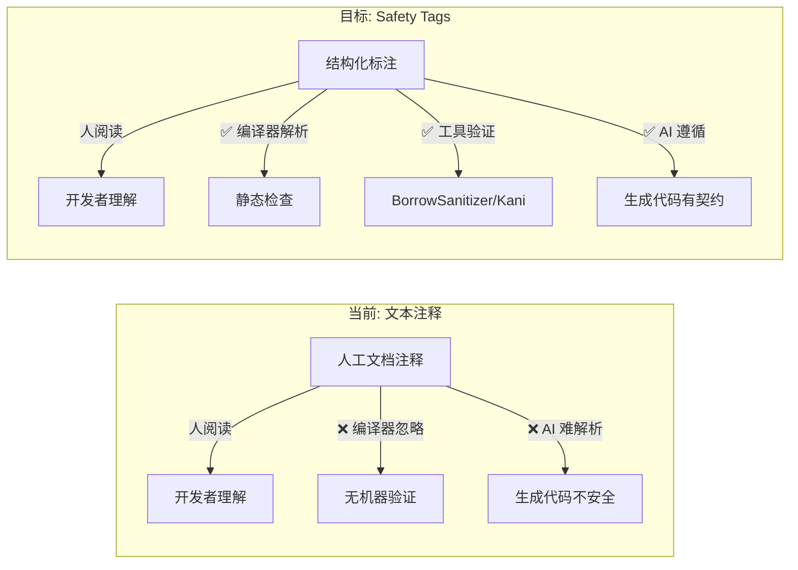
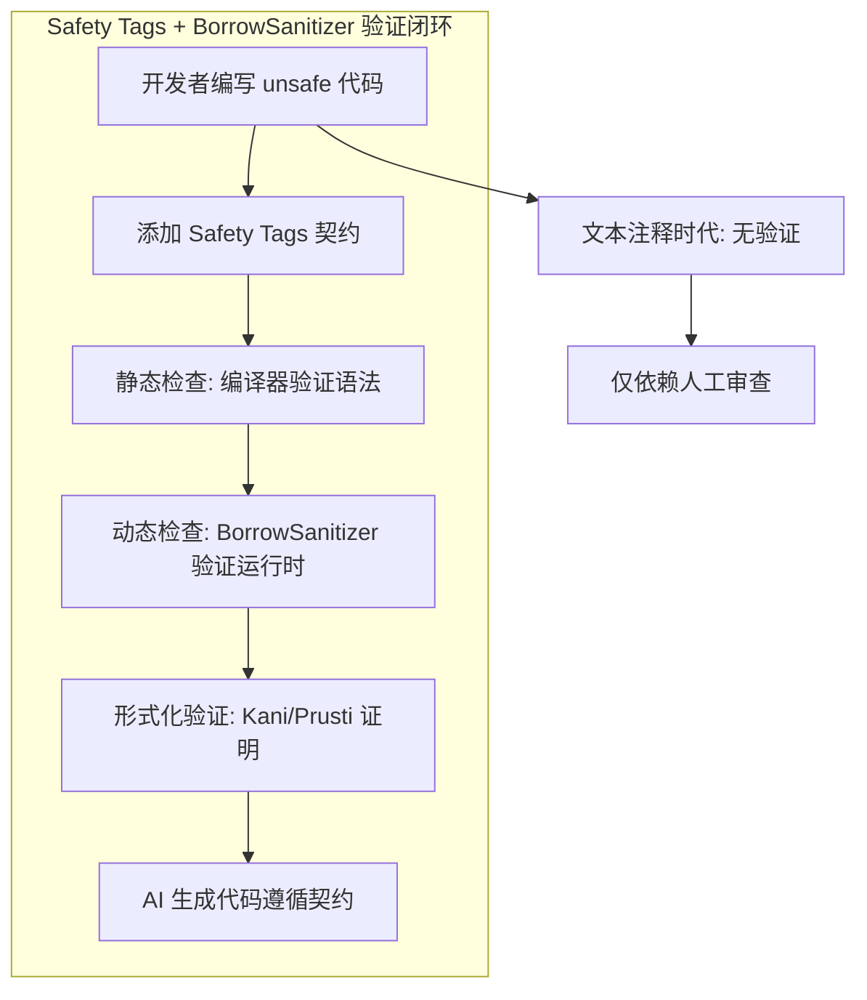
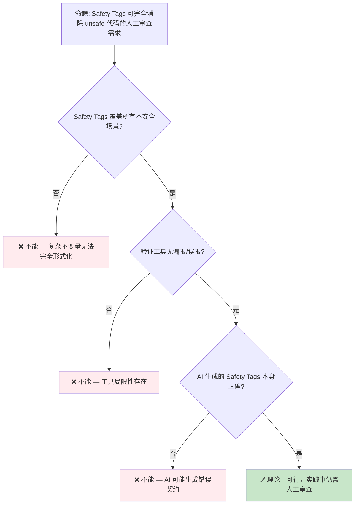

# Safety Tags 概念预研：Unsafe 契约的机器可读标注

> **内容重叠提示**: 本文与 [`docs/08_usage_guides/20_safety_tags_guide.md`](../../../docs/08_usage_guides/20_safety_tags_guide.md) 内容高度重叠。`docs/` 版本提供专项深入；`concept/` 版本为项目权威主轨。
> **代码状态**: ✅ 含可编译示例
>
> **EN**: Safety Tags Preview
> **Summary**: Preview of safety tags for annotating and propagating unsafe preconditions in Rust.
> **Rust 版本**: 1.97.0+ (Edition 2024)
>
> **状态**: 🧪 Nightly 实验性
> **Rust 属性标记**: `#[experimental]` `#[nightly_only]`
> **跟踪版本**: nightly 1.98.0 (2026-05-31)
> **预计稳定**: 待定（需等待 RFC / MCP 完成）
>
> **受众**: [专家]
> **内容分级**: [实验级]
> **Bloom 层级**: L4-L5
> **权威来源**: 本文件为 `concept/` 权威页。
> **A/S/P 标记**: **S** — Structure
> **双维定位**: C×Ana — 分析安全标签预览特性
> **定位**: 探讨 Safety Tags 作为 Rust **unsafe 代码契约**的机器可读标注机制，从人工文档注释演进为编译器可理解、工具可验证的安全契约格式。
> **前置概念**: [Unsafe Rust](../../03_advanced/02_unsafe/01_unsafe.md) · [BorrowSanitizer](24_borrow_sanitizer.md)
> **后置概念**: [Formal Methods](../04_research_and_experimental/02_formal_methods.md) · [AI Integration](../04_research_and_experimental/01_ai_integration.md)
> **定理链**: N/A — 描述性/综述性/导航性文档，不涉及形式化定理链
---

> **来源**: [Rust RFC: Safety Tags](https://github.com/rust-lang/rfcs/pull/) · · [Brown University — Interactive Rust Book](https://rust-book.cs.brown.edu/) · [Jung et al. — RustBelt: Securing the Foundations of Rust](https://plv.mpi-sws.org/rustbelt/popl18/) · [Itanium C++ ABI](https://itanium-cxx-abi.github.io/cxx-abi/abi.html)
> [Rust Project Goals 2026](https://rust-lang.github.io/rust-project-goals/2026/) ·
> [Rust Internals — Safety Annotations](https://internals.rust-lang.org/) ·
> [Rust for Linux](https://rust-for-linux.com/) ·
> [Prusti: Deductive Verification for Rust](https://pm.inf.ethz.ch/publications/AstrauskasMuellerPoliSummers19.pdf)
> **前置依赖**: [Rust vs C++](../../05_comparative/01_systems_languages/01_rust_vs_cpp.md)
> **前置依赖**: [Toolchain](../../06_ecosystem/00_toolchain/01_toolchain.md)

## 📑 目录

- [Safety Tags 概念预研：Unsafe 契约的机器可读标注](#safety-tags-概念预研unsafe-契约的机器可读标注)
  - [📑 目录](#-目录)
  - [一、核心概念](#一核心概念)
    - [1.1 问题定义：Unsafe 契约的表达缺口](#11-问题定义unsafe-契约的表达缺口)
    - [1.2 Safety Tags 的设计目标](#12-safety-tags-的设计目标)
    - [1.3 与 `#[safety]` 属性的关系](#13-与-safety-属性的关系)
  - [二、形式化语义](#二形式化语义)
    - [2.1 契约的谓词逻辑表示](#21-契约的谓词逻辑表示)
    - [2.2 与 BorrowSanitizer 的互补](#22-与-borrowsanitizer-的互补)
  - [三、使用场景](#三使用场景)
    - [3.1 AI 生成代码的安全标注](#31-ai-生成代码的安全标注)
    - [3.2 Rust for Linux 内核契约](#32-rust-for-linux-内核契约)
    - [3.3 FFI 边界的前置/后置条件](#33-ffi-边界的前置后置条件)
  - [四、反命题与边界分析](#四反命题与边界分析)
    - [4.1 反命题树](#41-反命题树)
    - [4.2 边界极限](#42-边界极限)
  - [五、演进路线与预测](#五演进路线与预测)
  - [六、来源与延伸阅读](#六来源与延伸阅读)
  - [相关概念](#相关概念)
  - [十、边界测试：Safety Tags 预览的编译错误](#十边界测试safety-tags-预览的编译错误)
    - [10.1 边界测试：安全标签的层级不匹配（编译错误）](#101-边界测试安全标签的层级不匹配编译错误)
    - [10.2 边界测试：标签传播与 unsafe 块边界（编译错误）](#102-边界测试标签传播与-unsafe-块边界编译错误)
    - [10.3 边界测试：安全标签的层级蕴含与工具支持缺失（编译错误/验证失败）](#103-边界测试安全标签的层级蕴含与工具支持缺失编译错误验证失败)
    - [10.4 边界测试：`unsafe` 代码的安全标签审计与人为遗漏（逻辑错误）](#104-边界测试unsafe-代码的安全标签审计与人为遗漏逻辑错误)
    - [10.4 边界测试：`#[safety::tag]` 的契约验证与工具链支持（编译错误/未来特性）](#104-边界测试safetytag-的契约验证与工具链支持编译错误未来特性)
    - [补充定理链](#补充定理链)
  - [嵌入式测验（Embedded Quiz）](#嵌入式测验embedded-quiz)
    - [测验 1："安全标签"（Safety Tags）在 Rust 中可能解决什么问题？（理解层）](#测验-1安全标签safety-tags在-rust-中可能解决什么问题理解层)
    - [测验 2：当前 Rust 的 `unsafe` 块与 C 的注释有什么区别？（理解层）](#测验-2当前-rust-的-unsafe-块与-c-的注释有什么区别理解层)
    - [测验 3：安全标签对 Miri 等验证工具有什么潜在好处？（理解层）](#测验-3安全标签对-miri-等验证工具有什么潜在好处理解层)
    - [测验 4：安全标签提案与 Rust 的"最小 unsafe 面积"哲学一致吗？（理解层）](#测验-4安全标签提案与-rust-的最小-unsafe-面积哲学一致吗理解层)
    - [测验 5：如果安全标签成为语言特性，它会对 unsafe 代码的代码审查产生什么影响？（理解层）](#测验-5如果安全标签成为语言特性它会对-unsafe-代码的代码审查产生什么影响理解层)
  - [认知路径](#认知路径)
    - [核心推理链](#核心推理链)
    - [反命题与边界](#反命题与边界)
  - [附录：标准 Tag 库设想与当前状态](#附录标准-tag-库设想与当前状态)
    - [标准 Tag 库设想](#标准-tag-库设想)
    - [当前状态](#当前状态)
    - [行动建议](#行动建议)

---

## 一、核心概念

本节从问题定义：Unsafe 契约的表达缺口、Safety Tags 的设计目标与与 `#[safety]` 属性的关系切入，剖析「核心概念」的核心内容。

### 1.1 问题定义：Unsafe 契约的表达缺口

Rust 的 `unsafe` 块是**信任边界**——编译器暂停检查，开发者手动保证安全：

```ignore
/// # Safety
/// - `ptr` must be valid for reads of `count` bytes
/// - `ptr` must be properly aligned
pub unsafe fn read_bytes(ptr: *const u8, count: usize) -> Vec<u8> {
    // ...
}
```

> **当前局限**: `/// # Safety` 注释是**纯文本**——编译器不理解，工具无法验证，AI 难以遵循。
> [来源: [Rust Reference — Unsafe Functions](https://doc.rust-lang.org/reference/items/functions.html)]

**Safety Tags 的目标**: 将文本契约转化为**结构化、机器可读、可验证**的标注：

```ignore
// 假设的 Safety Tags 语法（非 Rust 实际语法）
#[safety(
    requires: valid_ptr(ptr) && aligned(ptr) && count <= isize::MAX,
    ensures: result.len() == count,
)]
pub unsafe fn read_bytes(ptr: *const u8, count: usize) -> Vec<u8> {
    // ...
}
```

---

### 1.2 Safety Tags 的设计目标
>



> **认知功能**: 此图展示 Safety Tags 的**三重受众**——人类开发者、编译器/工具、AI 生成系统。当前文本注释只能服务人类；Safety Tags 同时服务三者。
> [来源: [TRPL](https://doc.rust-lang.org/book/title-page.html)]
> **使用建议**: 设计 Safety Tags 时，需同时考虑人类可读性和机器可解析性。纯逻辑表达式对人类不友好，需要注释+标注的混合形式。
> **关键洞察**: Safety Tags 是 Rust 从"人工保证安全"向"机器辅助验证安全"演进的关键基础设施。
> [💡 原创分析](../../00_meta/00_framework/methodology.md)

---

### 1.3 与 `#[safety]` 属性的关系

Rust 社区已存在 `#[safety]` 相关的实验性讨论：

| 概念 | 当前状态 | 说明 |
| :--- | :--- | :--- |
| `/// # Safety` 文档注释 | ✅ 稳定 | 纯文本，人阅读 |
| `#[safety]` 属性 | 🟡 RFC 讨论中 | 机器可读契约标注 |
| `unsafe_op_in_unsafe_fn` | ✅ 2024 Edition | 调用者/实现者权限分离 |
| `unsafe extern` + `safe` | ✅ 1.82+ | FFI 边界安全标注 |

> **演进关系**: `unsafe extern` + `safe` 是 Safety Tags 的**前序步骤**——它已经在 FFI 边界引入了"安全/不安全"的显式标注概念。Safety Tags 将这一概念从 FFI 扩展到所有 unsafe 代码。
> [来源: [Rust Project Goals 2026](https://rust-lang.github.io/rust-project-goals/2026/)]

> **RFC #3842 进展（2026-07-12 自同主题重复页合并）**: Safety Tags 研究原型（[safety-tool slides](https://os-checker.github.io/slides/safety-tags)）已梳理出 **21 个基础标签**，可覆盖 std 中约 **96%** 的公开 `unsafe` API；RFC #3842 提案使用 `#[safety::requires(...)]` 在 unsafe 函数上声明安全前提、`#[safety::checked(...)]` 在调用点显式消除标签，并与 Verus 的 `requires`/`ensures`、Kani 的 harness 假设、Miri/BorrowSanitizer 的动态检查标签集形成映射。(Source: [RFC #3842 Safety Tags](https://github.com/rust-lang/rfcs/pull/3842) · [Safety Tags 研究仓库](https://github.com/safer-rust/safety-tags))

---

## 二、形式化语义

本节从契约的谓词逻辑表示 与 与 BorrowSanitizer 的互补 两个层面剖析「形式化语义」。

### 2.1 契约的谓词逻辑表示

Safety Tags 的核心是**霍尔逻辑**（Hoare Logic）的三元组：

```text
{ P } C { Q }

其中:
  P = 前置条件 (precondition)
  C = 代码 (command)
  Q = 后置条件 (postcondition)
```

> **形式化映射**:
>
> - `requires:` → 前置条件 P
> - `ensures:` → 后置条件 Q
> - `modifies:` → 帧条件（frame condition）
> - `invariant:` → 循环不变式
> [来源: [Hoare Logic](https://en.wikipedia.org/wiki/Hoare_logic) ·
> [Prusti Paper](https://pm.inf.ethz.ch/publications/AstrauskasMuellerPoliSummers19.pdf)]

---

### 2.2 与 BorrowSanitizer 的互补



> **认知功能**: 此图展示 Safety Tags 在整个 Rust 安全验证生态中的**枢纽位置**——它是连接人工契约、静态检查、动态检测、形式化证明和 AI 生成的中间层。
> **使用建议**: Safety Tags 的设计应兼容多种下游工具：编译器检查语法、BorrowSanitizer 检查运行时（Runtime）、Kani/Prusti 证明形式化属性。
> **关键洞察**: Safety Tags 不是独立的验证工具，而是**契约的通用表示格式**——类似于类型签名之于类型检查器。

---

## 三、使用场景

理解「使用场景」需要把握 AI 生成代码的安全标注、Rust for Linux 内核契约与FFI 边界的前置/后置条件，本节依次展开。

### 3.1 AI 生成代码的安全标注

```text
AI 代码生成场景:
├── 输入: "实现一个安全的内存拷贝函数"
├── AI 生成代码:
│   #[safety(requires: valid_ptr(src) && valid_ptr(dst) && len <= isize::MAX)]
│   pub unsafe fn memcpy(dst: *mut u8, src: *const u8, len: usize) { ... }
│
├── 编译器检查: Safety Tag 语法合法 ✅
├── BorrowSanitizer 检查: 运行时契约满足 ✅
└── 人类审查: 关注复杂逻辑，而非基础契约
```

> **关键洞察**: Safety Tags 使 AI 生成代码的**安全边界**显式化、可验证化。这是 AI × Rust 集成的关键基础设施。
> [来源: [AI Integration in Rust](https://blog.rust-lang.org/inside-rust/)]

---

### 3.2 Rust for Linux 内核契约

Linux 内核中的 Rust 代码需要与大量 C 代码交互：

```ignore
// 假设的 Safety Tags 在内核中的使用
#[safety(
    requires: ctx.is_valid(),
    ensures: result.is_ok() || ctx.state_unchanged(),
)]
pub unsafe fn kernel_spinlock_acquire(lock: *mut spinlock_t) -> Result<Guard, Error> {
    // ...
}
```

> **需求驱动**: Rust for Linux 项目需要明确的 unsafe 契约来通过内核代码审查。Safety Tags 可将隐式契约转化为显式、可检查的标注。
> [来源: [Rust for Linux](https://rust-for-linux.com/)]

---

### 3.3 FFI 边界的前置/后置条件
>

Rust 的 `unsafe extern` + `safe` 已为 FFI 引入了边界标注：

```rust
// Rust 1.82+ 的 FFI 安全标注
use std::os::raw::c_char;

unsafe extern "C" {
    safe fn strlen(s: *const c_char) -> usize;
    // ^ safe 表示调用者无需 unsafe 块
}
```

Safety Tags 将在此基础上扩展**前置/后置条件**：

```ignore
unsafe extern "C" {
    #[safety(requires: s.is_null() == false)]
    safe fn strlen(s: *const c_char) -> usize;
}
```

---

## 四、反命题与边界分析

本节从反命题树 与 边界极限 两个层面剖析「反命题与边界分析」。

### 4.1 反命题树



> **认知功能**: 此决策树揭示 Safety Tags 的**能力边界**——即使契约可机器验证，契约本身的正确性仍需人类保证。
> **使用建议**: Safety Tags 降低但不消除人工审查需求。审查重点从"基础契约"转向"复杂不变量"和"工具未覆盖的边界"。
> **关键洞察**: Safety Tags 的价值不是"消除审查"，而是"将审查提升到更高抽象层次"。

---

### 4.2 边界极限

```text
边界 1: 表达力极限
├── 复杂数据结构的图不变量 — 难以用简单谓词表达
├── 时序属性（"此操作必须在锁持有期间完成"）— 需扩展时序逻辑
└── 量化属性（"所有元素满足 P"）— 需支持全称/存在量词

边界 2: 与现有工具的兼容性
├── Miri: 需要理解 Safety Tags 语义以跳过已验证契约
├── BorrowSanitizer: 需要契约指导检测重点
├── Kani: 需要契约作为证明假设
└── 三者语义需统一

边界 3: 社会技术因素
├── 开发者学习成本 — 新语法、新思维
├── 现有代码迁移 — 大量 unsafe 代码无 Safety Tags
└── 社区共识 — RFC 需要广泛支持
```

> **边界要点**: Safety Tags 的最大挑战不是技术实现，而是**社区采纳**和**与现有生态的集成**。需要与 Miri、BorrowSanitizer、Kani 等工具形成统一的契约语义。
> [来源: [Rust Internals Forum](https://internals.rust-lang.org/)]

---

## 五、演进路线与预测
>

| 里程碑 | 状态 | 预计时间 | 说明 |
|:---|:---:|:---|:---|
| 社区讨论与需求收集 | 🟡 进行中 | 2025–2026 | Rust Internals 论坛 |
| Pre-RFC 发布 | ⬜ | 2026 H2 | 契约语法、属性设计 |
| RFC 正式提交 | ⬜ | 2027 | 社区评审 |
| 编译器原型实现 | ⬜ | 2027+ | `#[safety]` 属性解析 |
| 工具集成（Miri/Kani） | ⬜ | 2027+ | 契约验证 |
| 稳定化 | ⬜ | 2028+ | 广泛采用 |

> **预测**:
> Safety Tags 的演进路径参考 `unsafe_op_in_unsafe_fn`（2024 Edition）——从社区讨论到 RFC 到实现约需 2-3 年。Safety Tags 更复杂，预计需要 3-4 年。
> 与 BorrowSanitizer 形成协同：Safety Tags 标注契约（2027+），BorrowSanitizer 验证契约（2027+），两者共同构成 Rust unsafe 代码的**标注-验证闭环**。
> [来源: 💡 原创分析 · [Rust Project Goals 2026](https://rust-lang.github.io/rust-project-goals/2026/)]

---

## 六、来源与延伸阅读

| 来源 | 可信度 | 说明 |
|:---|:---:|:---|
| [RFC #3842 — Safety Tags](https://github.com/rust-lang/rfcs/pull/3842) | ✅ 一级 | 提案原文 |
| [safety-tool slides](https://os-checker.github.io/slides/safety-tags) | ✅ 一级 | 研究原型与 21 标签词兑表 |
| [Safety Tags 研究仓库](https://github.com/safer-rust/safety-tags) | ✅ 一级 | 标注工具原型 |
| [Rust Reference — Unsafe Functions](https://doc.rust-lang.org/reference/items/functions.html) | ✅ 一级 | unsafe 函数规范 |
| [Rust Project Goals 2026](https://rust-lang.github.io/rust-project-goals/2026/) | ✅ 一级 | 官方项目目标 |
| [Rust for Linux](https://rust-for-linux.com/) | ✅ 一级 | 内核 Rust 项目 |
| [Prusti Paper](https://pm.inf.ethz.ch/publications/AstrauskasMuellerPoliSummers19.pdf) | ✅ 一级 | Rust 契约验证学术论文 |
| [Annotating and Auditing the Safety Properties of Unsafe Rust (arXiv:2504.21312v2, 2026)](https://arxiv.org/abs/2504.21312) | ✅ 一级 | Safety Tags 标注与审计学术研究（2026-04 修订版） |
| [Rust Internals Forum](https://internals.rust-lang.org/) | ⚠️ 二级 | 设计讨论 |
| [Hoare Logic](https://en.wikipedia.org/wiki/Hoare_logic) | 🔍 三级 | 形式化基础 |

---

## 相关概念

- [Unsafe Rust](../../03_advanced/02_unsafe/01_unsafe.md) — Unsafe 边界与借用（Borrowing）规则
- [BorrowSanitizer](24_borrow_sanitizer.md) — 运行时（Runtime）借用（Borrowing）检查验证
- [Formal Methods](../04_research_and_experimental/02_formal_methods.md) — 形式化验证工具链
- [AI Integration](../04_research_and_experimental/01_ai_integration.md) — AI 生成代码的安全边界
- [AutoVerus / Verus 预览](33_autoverus_preview.md) — 自动化形式化证明与 `requires`/`ensures` 契约
- [Tree Borrows 深度解析](../../04_formal/01_ownership_logic/05_tree_borrows_deep_dive.md) — Rust 别名模型与 Miri 默认模型
- [Version Tracking](../00_version_tracking/01_rust_version_tracking.md) — Rust 版本特性演进

---

> **权威来源**:
> [Rust Reference](https://doc.rust-lang.org/reference/introduction.html),
> [Rust Project Goals 2026](https://rust-lang.github.io/rust-project-goals/2026/),
> [Rust for Linux](https://rust-for-linux.com/)
> **权威来源对齐变更日志**: 2026-05-21 创建，对齐 Rust 1.97.0+ (Edition 2024)

**文档版本**: 1.0
**最后更新**: 2026-05-21
**状态**: ✅ 概念文件创建完成

---

## 十、边界测试：Safety Tags 预览的编译错误

本节围绕「边界测试：Safety Tags 预览的编译错误」展开，依次讨论边界测试：安全标签的层级不匹配（编译错误）、边界测试：标签传播与 unsafe 块边界（编译错误）、边界测试：安全标签的层级蕴含与工具支持缺失（编译错误/验证失败）、边界测试：`unsafe` 代码的安全标签审计与人为遗漏（逻辑错误）等6个方面。

### 10.1 边界测试：安全标签的层级不匹配（编译错误）

```rust,compile_fail
#[safety::tag("memory-safe")]
fn safe_alloc(size: usize) -> *mut u8 {
    // ❌ 编译错误/审计失败: 标记为 memory-safe 但返回裸指针
    std::alloc::alloc(std::alloc::Layout::array::<u8>(size).unwrap())
}

#[safety::tag("memory-safe")]
fn safe_use(ptr: *mut u8) {
    // ❌ 编译错误: 标记为 safe 但在 safe 函数中使用裸指针
    unsafe { *ptr = 0; }
}
```

> **修正**:
> Safety Tags（实验性概念）是为 unsafe 代码提供形式化安全契约的元数据系统。
> 函数或模块（Module）标记为 `"memory-safe"`、`"thread-safe"`、`"panic-safe"` 等，静态分析工具验证代码行为与标签一致。
> `safe_alloc` 标记为 `memory-safe` 但返回未初始化的裸指针——使用者必须知道指针的有效性约束，因此实际上不是"安全"的。
> 正确做法：返回 `Vec<u8>` 或 `Box<[u8]>`，将裸指针封装在安全抽象中。
> 这与 Rust 现有的 unsafe 函数契约（文档中描述前置条件）相比，Safety Tags 将非形式化的文档注释提升为可机器检查的声明。
> 挑战：标签语义的精确定义、标签之间的蕴含关系（`memory-safe` ⇒ `thread-safe`?）、与形式化验证工具（Kani、Prusti）的集成。
> [来源: [Rust Secure Code WG](https://github.com/rust-secure-code/wg)] · [来源: [Safety Dance Blog Series](https://vgatherps.github.io/)]

### 10.2 边界测试：标签传播与 unsafe 块边界（编译错误）

```rust,compile_fail
#[safety::tag("no-panic")]
fn no_panic_add(a: i32, b: i32) -> i32 {
    // ❌ 编译错误/审计失败: 加法可能溢出 panic（debug 模式）
    a + b
}

#[safety::tag("no-panic")]
fn safe_add(a: i32, b: i32) -> i32 {
    // 正确: 使用 wrapping_add 或 checked_add
    a.wrapping_add(b) // ✅ 显式处理溢出
}
```

> **修正**:
> `"no-panic"` 标签要求函数在任何输入下都不 panic。
> Rust 的许多基本操作在 debug 模式下会 panic（整数溢出、数组越界、除零），在 release 模式下则回绕（wrap）或产生 UB（`get_unchecked`）。
> `no-panic` 标签强制开发者使用显式的安全替代：`wrapping_add`、`checked_div`、`get`（返回 `Option`）等。
> `no_panic` crate 通过链接时检查验证最终二进制中无 panic 调用。这与航空、汽车等安全关键领域的需求一致——禁止不可恢复的错误路径。
> 形式化上，`no-panic` 是**全函数**（total function）的近似：对所有定义域输入都有定义输出。
> 完全的 totality 证明需要形式化验证，但 `no-panic` 标签 + 静态分析是实用的工程折中。
> [来源: [no_panic Crate](https://docs.rs/no-panic/)] ·
> [来源: [Rust Secure Code WG](https://github.com/rust-secure-code/wg)]

### 10.3 边界测试：安全标签的层级蕴含与工具支持缺失（编译错误/验证失败）

```rust,compile_fail
#[safety::tag("memory-safe")]
#[safety::tag("thread-safe")]
fn safe_function() {}

// ❌ 编译错误/验证失败: 若工具不处理标签层级，
// "memory-safe" 可能不蕴含 "no-ub"
// 标签语义未标准化，不同工具解释不同

fn main() {
    safe_function();
}
```

> **修正**:
> Safety Tags 是 Rust 安全代码 WG 提出的实验性概念，但目前**无编译器支持**，无标准语义。
> 标签如 `"memory-safe"`、`"thread-safe"`、`"no-panic"` 是声明式的，工具（lint、验证器）可选择性识别。
> 挑战：
>
> 1) **标签语义**：`"memory-safe"` 是否蕴含 `"no-ub"`、`"no-data-race"`、`"no-use-after-free"`？
> 2) **标签传播**：调用 `"memory-safe"` 函数的函数是否自动 `"memory-safe"`？
> 3) **工具碎片化**：`cargo-geiger` 统计 unsafe，`no_panic` 检查 panic，无统一工具处理所有标签。
>
> 这与 Java 的 `@Nullable`/`@NonNull`（Checker Framework 支持，但非标准）或 C 的 `__attribute__((nonnull))`（编译器支持有限）类似——标签/注解系统的价值取决于工具生态的成熟度。
> [来源: [Rust Secure Code WG](https://github.com/rust-secure-code/wg)] ·
> [来源: [Safety Dance Blog](https://vgatherps.github.io/)]

### 10.4 边界测试：`unsafe` 代码的安全标签审计与人为遗漏（逻辑错误）

```rust,compile_fail
#[safety::tag("memory-safe")]
fn wrapper() {
    unsafe {
        // ❌ 逻辑错误: 标签声明 memory-safe，但 unsafe 块未充分审计
        // 若内部违反内存安全，标签是虚假承诺
        let ptr = 0x1 as *mut i32;
        *ptr = 42; // UB!
    }
}

fn main() {
    wrapper();
}
```

> **修正**:
>
> 安全标签是**信任机制**，非**验证机制**：开发者声明代码满足某些安全属性，但编译器不自动验证（除非结合 Kani/Prusti 等工具）。
> 虚假标签比无标签更危险——它给审查者虚假的安全感。
>
> 最佳实践：
>
> 1) 每个 `unsafe` 块配详细注释（输入不变式、输出保证、为何安全）；
> 2) 使用 Miri 在测试套件中运行 unsafe 代码；
> 3) 使用 `cargo vet` 审计依赖的 unsafe 使用。
>
> 这与航空领域的 DO-178C（"已验证"是认证过程的结果，非自我声明）或网络安全领域的 SOC 2（信任但需审计）类似——标签是起点，非终点。
> Rust 社区正在探索将标签与形式化验证结合：标签声明 + 工具验证 = 可组合的安全保证。
> [来源: [The Rustonomicon](https://doc.rust-lang.org/nomicon/index.html)] ·
> [来源: [Rust Secure Code WG](https://github.com/rust-secure-code/wg)]

### 10.4 边界测试：`#[safety::tag]` 的契约验证与工具链支持（编译错误/未来特性）

```rust,ignore
// 概念代码: Safety Tags（提案中）
// #[safety::tag("memory-safe")]
// #[safety::requires("pointer is non-null and aligned")]
// unsafe fn deref_ptr(ptr: *const i32) -> i32 {
//     *ptr
// }

// ❌ 编译错误: safety tags 不是当前 Rust 特性，需第三方工具或 nightly 实验

fn main() {}
```

> **修正**:
>
> **Safety Tags** 是 Rust 形式化验证的前沿方向：
>
> 1) 在 unsafe 函数上标注**安全契约**（前置条件、后置条件、副作用）；
> 2) 静态分析工具验证调用点满足契约；
> 3) 与 Miri、Kani、Prusti 等工具集成。
>
> 当前状态：讨论阶段，无 RFC。
> 相关努力：
>
> 1) `contracts` crate（运行时（Runtime）契约检查）；
> 2) 文档约定（`SAFETY:` 注释）；
> 3) `unsafe-code-guidelines` working group 的形式化规范。
>
> Safety Tags 若实现，将使 Rust 的 unsafe 代码从"文档化契约"提升到"工具验证契约"，是向"形式化保证 unsafe 安全"迈出的重要一步。
> 这与 Ada/SPARK 的 contracts（`Pre`/`Post` 条件，工具验证）或 Dafny 的 `requires`/`ensures`（编译期验证）类似——Rust 的安全标签将是语言原生支持或标准化注释。
> [来源: [Unsafe Code Guidelines](https://rust-lang.github.io/unsafe-code-guidelines/)] ·
> [来源: [Rust Safety Research](https://www.rust-lang.org/governance/wgs)]
> **过渡**: Safety Tags 概念预研：Unsafe 契约的机器可读标注 的深入理解需要结合具体代码实践，建议通过编写测试用例验证边界行为。

### 补充定理链

- **定理**: Safety Tags 概念预研：Unsafe 契约的机器可读标注 定义 ⟹ 类型安全保证

## 嵌入式测验（Embedded Quiz）

本节从测验 1："安全标签"（Safety Tags）在 Rust 中可能解…、测验 2：当前 Rust 的 `unsafe` 块与 C 的注释有什么…、测验 3：安全标签对 Miri 等验证工具有什么潜在好处？（理解层）、测验 4：安全标签提案与 Rust 的"最小 unsafe 面积"哲学…等5个方面切入，剖析「嵌入式测验（Embedded Quiz）」的核心内容。

### 测验 1："安全标签"（Safety Tags）在 Rust 中可能解决什么问题？（理解层）

**题目**: "安全标签"（Safety Tags）在 Rust 中可能解决什么问题？

<details>
<summary>✅ 答案与解析</summary>

为 `unsafe` 代码块提供更细粒度的分类和文档，如标记 `unsafe { /* memory: 原始指针（Raw Pointer）解引用 */ }`，使 unsafe 的语义更清晰，便于审计和工具分析。
</details>

---

### 测验 2：当前 Rust 的 `unsafe` 块与 C 的注释有什么区别？（理解层）

**题目**: 当前 Rust 的 `unsafe` 块与 C 的注释有什么区别？

<details>
<summary>✅ 答案与解析</summary>

`unsafe` 只是编译器关键字，不携带具体不安全原因的信息。安全标签提案试图将不安全的原因编码为结构化元数据，而非依赖自由文本注释。
</details>

---

### 测验 3：安全标签对 Miri 等验证工具有什么潜在好处？（理解层）

**题目**: 安全标签对 Miri 等验证工具有什么潜在好处？

<details>
<summary>✅ 答案与解析</summary>

Miri 可以根据安全标签选择不同的检查策略。例如，标记为 `extern_call` 的 unsafe 块可能不需要检查指针别名，而标记为 `raw_pointer` 的需要更严格的检查。
</details>

---

### 测验 4：安全标签提案与 Rust 的"最小 unsafe 面积"哲学一致吗？（理解层）

**题目**: 安全标签提案与 Rust 的"最小 unsafe 面积"哲学一致吗？

<details>
<summary>✅ 答案与解析</summary>

一致。安全标签不增加 unsafe 的使用，只是使已有的 unsafe 更清晰、更易于审计。它支持"unsafe 边界最小化"的目标，帮助识别和隔离不安全代码。
</details>

---

### 测验 5：如果安全标签成为语言特性，它会对 unsafe 代码的代码审查产生什么影响？（理解层）

**题目**: 如果安全标签成为语言特性，它会对 unsafe 代码的代码审查产生什么影响？

<details>
<summary>✅ 答案与解析</summary>

审查者可以基于标签快速定位不安全原因，自动化工具可以检查标签与实际代码的一致性（Coherence），降低人工审查的认知负担，提高 unsafe 代码的可维护性。
</details>

## 认知路径

> **认知路径**: 从 Rust 核心语言特性出发，经由 **Safety Tags 概念预研：Unsafe 契约的机器可读标注** 的生态/前沿实践，通向系统化工程能力与未来语言演进方向。

### 核心推理链

| 定理 | 前提 | 结论 | 置信度 |
|:---|:---|:---|:---|
| Safety Tags 概念预研：Unsafe 契约的机器可读标注 基础原理 ⟹ 正确选型 | 理解核心概念与适用边界 | 能在实际项目中做出合理决策 | 高 |
| Safety Tags 概念预研：Unsafe 契约的机器可读标注 选型实践 ⟹ 常见陷阱 | 忽视版本兼容性与生态成熟度 | 技术债务或迁移成本 | 中 |
| Safety Tags 概念预研：Unsafe 契约的机器可读标注 陷阱规避 ⟹ 深度掌握 | 持续跟踪社区演进与最佳实践 | 能进行架构设计与技术预研 | 高 |

> **过渡**: 掌握 Safety Tags 概念预研：Unsafe 契约的机器可读标注 的基础概念后，建议通过实际案例与源码阅读加深理解，建立从理论到实践的桥梁。
> **过渡**: 在工程实践中应用 Safety Tags 概念预研：Unsafe 契约的机器可读标注 时，务必评估生态成熟度、社区支持与长期维护风险，避免过度依赖实验性技术。
> **过渡**: Safety Tags 概念预研：Unsafe 契约的机器可读标注 反映了 Rust 生态系统的演进趋势与语言设计哲学，理解这些趋势有助于预判未来发展方向并做出前瞻性技术决策。

### 反命题与边界

> **反命题**:
> "Safety Tags 概念预研：Unsafe 契约的机器可读标注 是万能解决方案，适用于所有场景" —— 错误。
> 任何技术选择都有权衡，需根据具体需求、团队能力与项目约束综合评估。

---

## 附录：标准 Tag 库设想与当前状态

> 本节内容整合自 `docs/08_usage_guides/20_safety_tags_guide.md`。

### 标准 Tag 库设想

| Tag | 语义 | 适用场景 |
|:---|:---|:---|
| `valid_ptr(p)` | `p` 是非空且已分配的指针 | 所有解引用（Reference）操作 |
| `aligned(p)` | `p` 满足 `T` 的对齐要求 | 非包装解引用（Reference） |
| `non_overlapping(a, b)` | `a` 和 `b` 的内存范围不重叠 | `copy_nonoverlapping` |
| `initialized(p)` | `p` 指向已初始化的内存 | `read` / 转型 |
| `no_alias(p)` | `p` 在生命周期（Lifetimes）内是唯一的访问路径 | `&mut` 构造 |
| `valid_utf8(s)` | `s` 是合法的 UTF-8 字节序列 | `str::from_utf8_unchecked` |

### 当前状态

| 方面 | 状态 |
|:---|:---:|
| RFC 草案 | 🟡 已提交：[RFC #3842](https://github.com/rust-lang/rfcs/pull/3842)（open，未合并） |
| 社区讨论 | 🟡 Rust Internals / Zulip 活跃讨论 |
| 原型实现 | 🔴 无 |
| Rust-for-Linux 兴趣 | 🟢 已表达强烈兴趣 |
| 预计 RFC 时间 | 2026 H2 |

### 行动建议

1. **跟踪** [Rust Internals 论坛](https://internals.rust-lang.org/) 的 Safety Tags 讨论。
2. **准备** 在项目中统一 Safety Comment 格式，为迁移做准备。
3. **实验** 使用现有 `#[doc = "SAFETY: ..."]` 规范化为结构化注释。
