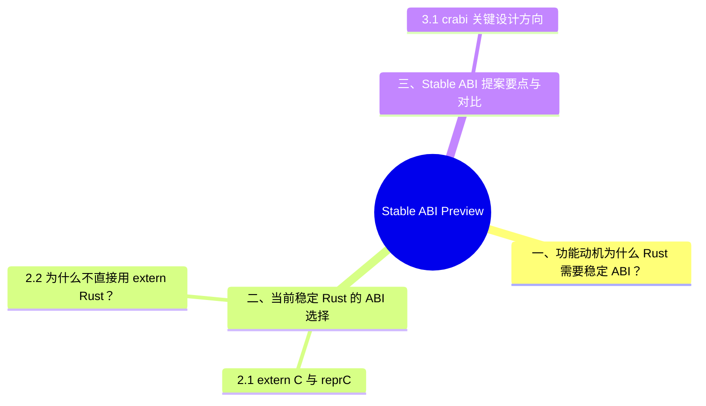

# Stable ABI Preview

> **代码状态**: [已验证（rustc 1.97）] — 代码块经 rustc 1.97.0 `--edition 2024` 单文件编译验证（2026-07-12）
>
> **EN**: Stable Application Binary Interface (ABI) Preview
> **Summary**: Preview of Rust's long-term effort to define a stable ABI (`crabi`) for cross-version dynamic linking and FFI, currently experimental and under discussion.
> **Rust 版本**: 1.97.0+ (Edition 2024)
> **状态**: 🧪 设计/MCP 阶段；`crabi` 提案仍在讨论
> **Rust 属性标记**: `#[experimental]` `#[nightly_only]`
> **跟踪版本**: nightly 1.98.0 (2026-05-31)
> **预计稳定**: 待定（需等待 RFC / MCP 完成）
>
> **受众**: [专家]
> **内容分级**: [实验级]
> **Bloom 层级**: L2-L4
> **权威来源**: 本文件为 `concept/` 权威页。
> **A/S/P 标记**: **S** — Structure
> **双维定位**: C×Ana — 分析 Rust ABI 稳定性问题
> **前置依赖**: [FFI](../../03_advanced/04_ffi/01_rust_ffi.md) · [Unsafe](../../03_advanced/02_unsafe/01_unsafe.md) · [Linkage](../../03_advanced/04_ffi/03_linkage.md)
> **后置延伸**: [Rust for Linux](../04_research_and_experimental/04_rust_for_linux.md)
> **来源**: [Rust Reference — ABI](https://doc.rust-lang.org/reference/items/external-blocks.html) · [RFC 2945 — C-unwind ABI](https://rust-lang.github.io/rfcs/2945-c-unwind-abi.html) · [Rust RFCs](https://github.com/rust-lang/rfcs) · [TRPL](https://doc.rust-lang.org/book/title-page.html) · [Brown University — Interactive Rust Book](https://rust-book.cs.brown.edu/) · [Jung et al. — RustBelt: Securing the Foundations of Rust](https://plv.mpi-sws.org/rustbelt/popl18/) · [Itanium C++ ABI](https://itanium-cxx-abi.github.io/cxx-abi/abi.html)
> **定理链**: N/A — 描述性/综述性/导航性文档，不涉及形式化定理链
>

## 一、功能动机：为什么 Rust 需要稳定 ABI？

Rust 的默认 ABI（`extern "Rust"`）是**不稳定**的。这意味着：

- 不同编译器版本编译的动态库通常无法相互链接；
- 结构体（Struct）字段重排、枚举（Enum）布局优化、单态化（Monomorphization）策略都可能随版本变化；
- 插件系统、闭源 SDK、操作系统驱动等场景难以使用纯 Rust ABI。

目前稳定 Rust 的唯一选择是 `extern "C"` + `#[repr(C)]`，这带来以下问题：

1. **表达能力受限**：不支持 Rust 高级类型（如 `String`、`Vec`、trait object、enum with payload）；
2. **panic 跨边界未定义**：FFI 边界 panic 是 UB；
3. **手动转换开销**：需要在 `repr(C)` 类型和 Rust 类型之间反复转换。

**Stable ABI（crabi / C Rust ABI）** 提案旨在定义一套 Rust 类型在 FFI 中的稳定布局，既兼容 C ABI，又支持 Rust 特性（如 panic 协议、trait object、闭包（Closures）），从而实现 Rust 动态库跨版本安全链接。

---

## 二、当前稳定 Rust 的 ABI 选择

本节从 `extern "C"` 与 `#[repr(C)]` 与 为什么不直接用 `extern "Rust"`？ 两个层面剖析「当前稳定 Rust 的 ABI 选择」。

### 2.1 `extern "C"` 与 `#[repr(C)]`

```rust,editable
#[repr(C)]
pub struct Point {
    pub x: f64,
    pub y: f64,
}

#[unsafe(no_mangle)]
pub extern "C" fn distance(p: Point) -> f64 {
    (p.x * p.x + p.y * p.y).sqrt()
}

fn main() {
    let p = Point { x: 3.0, y: 4.0 };
    assert_eq!(distance(p), 5.0);
}
```

### 2.2 为什么不直接用 `extern "Rust"`？

```rust,ignore
// ❌ 不要这样做：extern "Rust" ABI 不稳定
#[no_mangle]
pub fn unstable_abi_function(x: String) -> String {
    x
}
```

`String` / `Vec` / `Drop` 类型跨越 FFI 边界时行为未定义，且默认 ABI 可能因编译器版本不同而改变。

---

## 三、Stable ABI 提案要点与对比

| 维度 | 当前 `extern "C"` | 未来 Stable ABI (`crabi`) |
|:---|:---|:---|
| 跨版本链接 | 仅对 C 布局类型稳定 | 对 Rust 类型稳定 |
| 支持 Rust 类型 | 仅基础 POD + 手动转换 | `String`、`Vec`、enum、trait object 等 |
| panic 协议 | 未定义 | 定义跨边界 panic 行为 |
| 性能 | 受限于 C 布局 | 可能保留部分 Rust 布局优化 |
| 成熟度 | 稳定可用 | 设计阶段 |

### 3.1 `crabi` 关键设计方向

1. **与 C ABI 兼容**：基础类型布局与平台 C ABI 一致；
2. **扩展 panic 协议**：定义 Rust panic 如何跨动态库边界传播；
3. **Drop / 所有权（Ownership）协议**：明确跨 FFI 边界的资源释放责任；
4. **版本协商**：允许动态库在加载时协商 ABI 版本，逐步演进。

---

## 四、与稳定 Rust 的对比及迁移建议

本节围绕「与稳定 Rust 的对比及迁移建议」展开，覆盖当前最佳实践 与 何时关注 Stable ABI？ 两个方面。

### 4.1 当前最佳实践

1. **所有 FFI 边界使用 `extern "C"` + `#[repr(C)]`**；
2. **不传递 `String` / `Vec` / 裸指针所有权（Ownership）**，使用 `CString`、长度+指针、或 `Box` 显式约定；
3. **panic 边界隔离**：在 FFI 边界捕获 panic（`catch_unwind`），避免 UB；
4. **动态库插件系统**：目前建议通过 C ABI 接口暴露，或要求所有 Rust 插件用同一编译器版本构建。

### 4.2 何时关注 Stable ABI？

- 设计长期稳定的 Rust SDK；
- 操作系统驱动或内核模块（Module）；
- 需要跨编译器版本加载的插件系统；
- 与 Ferrocene 等安全认证工具链配套使用。

> **版本说明**：Stable ABI 目前处于 RFC/MCP 讨论阶段，没有明确的 nightly 实现时间表。`crabi` 名称和目标仍在迭代中。

---

## 五、边界测试：稳定 ABI 与 extern "C" 的符号兼容性（链接错误）

```rust
// Rust 的默认 ABI 不稳定（随编译器版本变化）
#[unsafe(no_mangle)]
pub extern "C" fn rust_function(x: i32) -> i32 {
    x * 2
}

// ❌ 链接错误: 若 C 代码按 Rust 默认 ABI 调用（而非 extern "C"）
// C 代码:
// int rust_function(int x); // 声明匹配 extern "C"
// // 但 C++ 的 name mangling 可能与 Rust 的 #[no_mangle] 冲突

fn main() {}
```

> **修正**:
>
> **稳定 ABI** 是 Rust 的长期目标：
>
> 1) 当前 `extern "C"` 是唯一稳定的跨语言 ABI；
> 2) Rust 的默认 ABI（`extern "Rust"`）随编译器版本变化（字段重排、enum 布局优化）；
> 3) `#[repr(C)]` 强制 C 兼容布局，但仍有限制（如 enum 的大小）。
>
> `crabi`（C Rust ABI）提案：
>
> 1) 定义 Rust 类型在 FFI 中的稳定布局；
> 2) 与 C ABI 兼容但支持 Rust 特性（如 panic、trait object）；
> 3) 允许 Rust 动态库跨版本安全链接。
>
> 当前限制：
>
> 1) `String` / `Vec` 不能安全传递（需 `CString` / 原始指针（Raw Pointer））；
> 2) `panic` 跨 FFI 边界是 UB；
> 3) `Drop` 在 FFI 中的行为未定义。这与 C++ 的 ABI（由 Itanium/MSVC 定义，稳定但不跨编译器）或 Swift 的 ABI（稳定但版本锁定）不同——Rust 追求语言级别的稳定 ABI，而非依赖平台约定。
>
> [来源: [crabi Proposal](https://rust-lang.github.io/rfcs/3325-unsafe-attributes.html)] ·
> [来源: [Rust FFI](https://doc.rust-lang.org/nomicon/ffi.html)]
>
> **后置概念**: [Rust Specification](https://www.rust-lang.org/) · [官方路线图](https://github.com/rust-lang/rust/labels/F-roadmap)
> **前置依赖**: [Rust vs C++](../../05_comparative/01_systems_languages/01_rust_vs_cpp.md)
> **前置依赖**: [Toolchain](../../06_ecosystem/00_toolchain/01_toolchain.md)

## 认知路径

> **认知路径**: 从 Rust 核心语言特性出发，经由 **Stable ABI Preview** 的生态/前沿实践，通向系统化工程能力与未来语言演进方向。

### 核心推理链

| 定理 | 前提 | 结论 | 置信度 |
| :--- | :--- | :--- | :--- |
| Stable ABI Preview 基础原理 ⟹ 正确选型 | 理解核心概念与适用边界 | 能在实际项目中做出合理决策 | 高 |
| Stable ABI Preview 选型实践 ⟹ 常见陷阱 | 忽视版本兼容性与生态成熟度 | 技术债务或迁移成本 | 中 |
| Stable ABI Preview 陷阱规避 ⟹ 深度掌握 | 持续跟踪社区演进与最佳实践 | 能进行架构设计与技术预研 | 高 |

## 嵌入式测验（Embedded Quiz）

本节从测验 1：为什么 Rust 目前没有稳定的 ABI？（理解层）、测验 2：`repr(C)` 和 `extern "C"` 如何提供稳…、测验 3：Stable ABI 提案对 Rust 的动态链接有什么意义…、测验 4：稳定 ABI 与性能之间的权衡是什么？（理解层）等5个方面切入，剖析「嵌入式测验（Embedded Quiz）」的核心内容。

### 测验 1：为什么 Rust 目前没有稳定的 ABI？（理解层）

**题目**: 为什么 Rust 目前没有稳定的 ABI？

<details>
<summary>✅ 答案与解析</summary>

编译器优化（单态化（Monomorphization）、布局优化）可能改变结构体（Struct）和枚举（Enum）的内存布局。稳定 ABI 会限制这些优化，影响性能。
</details>

> **前置概念**: N/A
---

### 测验 2：`repr(C)` 和 `extern "C"` 如何提供稳定的跨语言边界？（理解层）

**题目**: `repr(C)` 和 `extern "C"` 如何提供稳定的跨语言边界？

<details>
<summary>✅ 答案与解析</summary>

`repr(C)` 使用 C 的布局规则，`extern "C"` 使用 C 的调用约定。这是 Rust 与 C/C++ 互操作的标准方式，但不是 Rust 到 Rust 的 ABI。
</details>

---

### 测验 3：Stable ABI 提案对 Rust 的动态链接有什么意义？（理解层）

**题目**: Stable ABI 提案对 Rust 的动态链接有什么意义？

<details>
<summary>✅ 答案与解析</summary>

允许不同编译器版本编译的动态库相互调用。目前 Rust 动态库要求使用相同编译器版本，限制了插件系统和二进制分发。
</details>

---

### 测验 4：稳定 ABI 与性能之间的权衡是什么？（理解层）

**题目**: 稳定 ABI 与性能之间的权衡是什么？

<details>
<summary>✅ 答案与解析</summary>

稳定 ABI 限制编译器优化布局的能力，可能导致更大的结构体（Struct）和更慢的字段访问。需要精心设计以最小化性能损失。
</details>

---

### 测验 5：哪些场景最需要 Rust 的稳定 ABI？（理解层）

**题目**: 哪些场景最需要 Rust 的稳定 ABI？

<details>
<summary>✅ 答案与解析</summary>

插件系统（动态加载扩展）、操作系统接口（驱动 ABI）、闭源库分发、语言服务器协议等长期稳定的接口。
</details>

---

## 国际权威参考 / International Authority References（P1 学术 · P2 生态）

> 依据 `AGENTS.md` §2「对齐网络国际化权威内容」补充：仅追加已验证可达的权威链接，不改动正文事实。

- **P2 生态/社区**: [docs.rs/tokio — 生态权威 API 文档](https://docs.rs/tokio) · [docs.rs/futures — 生态权威 API 文档](https://docs.rs/futures)

## 🧭 思维导图（Mindmap）




## ⚠️ 反例与陷阱：把 `#[repr(Rust)]` 当作跨 dylib 的稳定 ABI

**反例（错误假设）**：插件与宿主都用 Rust 1.97 编译，于是直接跨动态库边界传递默认布局类型：

```rust,ignore
// plugin.so 与宿主各自编译、各自链接 std
pub struct Config { pub name: String, pub retries: u32 } // 默认 repr(Rust)
```

**陷阱本质**：`repr(Rust)` 的字段顺序、对齐、`String`/`Vec` 内部表示**不做任何跨版本、跨编译单元保证**；同一 rustc 版本下编译选项变化也可能改变布局。跨 dylib 传递引发的是未定义行为而非编译错误——这正是 stable ABI 提案要解决的核心问题。

**修正对照**：跨动态库边界只用 `#[repr(C)]` 类型 + `extern "C"` 签名；需要富类型时用 `abi_stable` / `stabby` 等 crate 的稳定 ABI 包装；在提案稳定化之前，不要在生产插件系统中依赖 `repr(Rust)` 布局。
