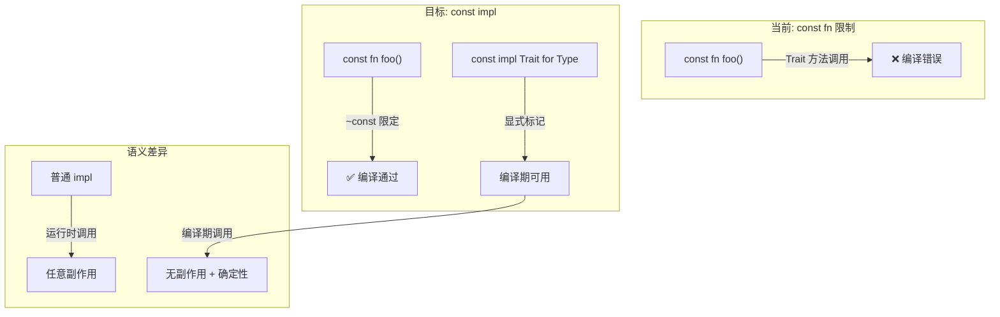
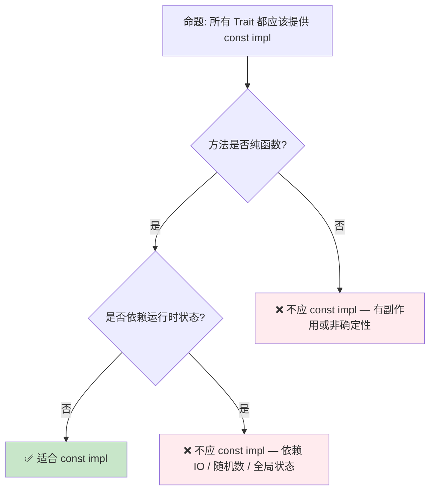

# Const Trait Impl 预研：常量上下文中的 Trait 泛化

> **代码状态**: [综述级 — 待补充代码]
>
> **EN**: Const Trait Impl Preview
> **Summary**: Preview of const trait implementations (`const Trait`) for compile-time generic code.
>
> **状态**: 🧪 Nightly 实验性
> **Rust 属性标记**: `#[experimental]` `#[nightly_only]`
> **跟踪版本**: nightly 1.98.0 (2026-05-31)
> **预计稳定**: 待定（需等待 RFC / MCP 完成）
>
> ⚠️ **语法演进声明**: 本文档中使用的 `~const` 语法是 nightly 实验性语法，**不是 Rust 效果系统的最终方向**。
> Yoshua Wuyts（Rust Effects Initiative 核心维护者）在 2026 年的设计提案中已明确将 `~const` 视为过渡方案，未来可能被 `eff`/`with` 统一效果语法取代。
> 但 `const` 作为**效果语义**（编译期可求值）将持续演进。
> [来源: [Yoshua Wuyts — "An Effect Notation Based on With-Clauses and Blocks" (2026-03)](https://blog.yoshuawuyts.com/a-with-based-effect-notation/)] ·
> [来源: [Rust Effects System 预研](04_effects_system.md)]
>
> **受众**: [专家]
> **内容分级**: [实验级]
> **Bloom 层级**: 应用 → 分析
> **A/S/P 标记**: **S** — Structure
> **双维定位**: C×Ana — 分析 Const Trait Impl 预览特性
> **定位**: 探讨 Rust 在**常量上下文**（`const fn`）中支持 Trait 调用的演进，分析其对泛型（Generics）编程、`const fn` 表达能力以及编译期计算的影响。
> **前置概念**: [Generics](../../02_intermediate/01_generics/02_generics.md) · [Traits](../../02_intermediate/00_traits/01_traits.md) · [Type System](../../01_foundation/02_type_system/04_type_system.md)
> **后置概念**: [Evolution](../04_research_and_experimental/03_evolution.md)
> **定理链**: N/A — 描述性/综述性/导航性文档，不涉及形式化定理链
---

> **来源**:
>
> · [Brown University — Interactive Rust Book](https://rust-book.cs.brown.edu/) ·
> [Jung et al. — RustBelt: Securing the Foundations of Rust](https://plv.mpi-sws.org/rustbelt/popl18/) ·
> [Itanium C++ ABI](https://itanium-cxx-abi.github.io/cxx-abi/abi.html)
>
> [Rust RFC — Const Traits](https://github.com/rust-lang/rfcs/pull/2632) ·
> [Rust Reference — Const Evaluation](https://doc.rust-lang.org/reference/const_eval.html) ·
> [Tracking Issue #67792](https://github.com/rust-lang/rust/issues/67792) ·
> [Const Eval Working Group](https://github.com/rust-lang/const-eval)
> **前置依赖**: [Rust vs C++](../../05_comparative/01_systems_languages/01_rust_vs_cpp.md)
> **前置依赖**: [Toolchain](../../06_ecosystem/00_toolchain/01_toolchain.md)

## 📑 目录

- [Const Trait Impl 预研：常量上下文中的 Trait 泛化](#const-trait-impl-预研常量上下文中的-trait-泛化)
  - [📑 目录](#-目录)
  - [一、核心概念](#一核心概念)
    - [1.1 问题：常量上下文中的 Trait 鸿沟](#11-问题常量上下文中的-trait-鸿沟)
    - [1.2 `const impl` 方案概览](#12-const-impl-方案概览)
    - [1.3 `~const` 限定与效果系统](#13-const-限定与效果系统)
  - [二、技术细节](#二技术细节)
    - [2.1 常量 Trait 的约束继承](#21-常量-trait-的约束继承)
    - [2.2 与现有 Const 特性的交互](#22-与现有-const-特性的交互)
    - [2.3 编译器实现挑战](#23-编译器实现挑战)
  - [三、使用模式](#三使用模式)
  - [四、反命题与边界分析](#四反命题与边界分析)
    - [4.1 反命题树](#41-反命题树)
    - [4.2 边界极限](#42-边界极限)
  - [五、演进路线](#五演进路线)
    - [5.1 当前路线图（基于 `~const` 语法）](#51-当前路线图基于-const-语法)
  - [六、来源与延伸阅读](#六来源与延伸阅读)
  - [相关概念文件](#相关概念文件)
  - [权威来源索引](#权威来源索引)
  - [十、边界测试：const trait impl 的编译错误](#十边界测试const-trait-impl-的编译错误)
    - [10.1 边界测试：const 上下文中调用非 const 方法（编译错误）](#101-边界测试const-上下文中调用非-const-方法编译错误)
    - [10.2 边界测试：trait bound 的 const 兼容性（编译错误）](#102-边界测试trait-bound-的-const-兼容性编译错误)
    - [10.6 边界测试：`~const` bound 与默认实现的交互（编译错误）](#106-边界测试const-bound-与默认实现的交互编译错误)
    - [10.5 边界测试：const trait 的默认实现与泛型（Generics）约束（编译错误）](#105-边界测试const-trait-的默认实现与泛型约束编译错误)
    - [10.3 边界测试：`~const` 边界的语法演进与兼容性（编译错误）](#103-边界测试const-边界的语法演进与兼容性编译错误)
    - [补充定理链](#补充定理链)
  - [嵌入式测验（Embedded Quiz）](#嵌入式测验embedded-quiz)
    - [测验 1：`const trait` 与 `const fn` 有什么区别？（理解层）](#测验-1const-trait-与-const-fn-有什么区别理解层)
    - [测验 2：为什么 `Vec::new()` 在 Rust 1.96 中还不是 `const fn`？（理解层）](#测验-2为什么-vecnew-在-rust-196-中还不是-const-fn理解层)
    - [测验 3：`~const Trait` 语法是什么意思？（理解层）](#测验-3const-trait-语法是什么意思理解层)
    - [测验 4：`const trait` 对嵌入式开发有什么意义？（理解层）](#测验-4const-trait-对嵌入式开发有什么意义理解层)
    - [测验 5：`const trait` 的实现目前有什么限制？（理解层）](#测验-5const-trait-的实现目前有什么限制理解层)
  - [认知路径](#认知路径)
    - [核心推理链](#核心推理链)
    - [反命题与边界](#反命题与边界)

---

## 一、核心概念

### 1.1 问题：常量上下文中的 Trait 鸿沟

当前 Rust 中，`const fn` 无法调用 Trait 方法，即使该方法在语义上完全可以在编译期执行：

```rust,ignore
// 当前 Rust: const fn 中不能调用 Trait 方法
trait Add {
    fn add(&self, other: &Self) -> Self;
}

impl Add for i32 {
    fn add(&self, other: &Self) -> Self {
        *self + *other
    }
}

const fn compute<T: Add>(a: T, b: T) -> T {
    a.add(&b)  // ❌ 编译错误: 不能在 const fn 中调用 Trait 方法
}
```

> **核心痛点**:
>
> 1. `const fn` 的泛型（Generics）参数只能使用**内建操作**（`+`, `-`, `*` 等），无法使用**抽象 Trait 接口**
> 2. 库作者需要为 `const fn` 和运行时（Runtime）分别提供两套 API
> 3. 阻碍了编译期计算（CTFE, Compile-Time Function Evaluation）的表达能力
> [来源: [Rust RFC 2632](https://github.com/rust-lang/rfcs/pull/2632)]

---

### 1.2 `const impl` 方案概览



> **认知功能**: 此图展示 `const impl` 解决的核心问题——通过 `~const` 限定和 `const impl` 标记，将 Trait 方法调用引入常量上下文。
> [来源: [TRPL](https://doc.rust-lang.org/book/title-page.html)]
> **使用建议**: 对于需要在 `const fn` 中使用的 Trait，使用 `const impl` 实现；对于仅运行时（Runtime）使用的 Trait，保持普通 impl。
> **关键洞察**: `const impl` 不是简单的语法扩展，而是 Rust **效果系统**（Effect System）的雏形——`const` 是一种**效果**（effect），表示"无副作用、可编译期执行"。
> [来源: [Rust [RFC 2632](https://github.com/rust-lang/rfcs/pull/2632) — Motivation](https://github.com/rust-lang/rfcs/pull/2632)]

---

### 1.3 `~const` 限定与效果系统
>

```text
~const 限定的语义:

  trait Add {
      fn add(&self, other: &Self) -> Self;
  }

  const fn compute<T: ~const Add>(a: T, b: T) -> T {
      a.add(&b)  // ✅ 可以调用，因为 T 实现了 const Add
  }

语义解读:
  - T: Add        → T 在**运行时**实现了 Add
  - T: ~const Add → T 在**编译期**也实现了 Add（即 const impl）
  - ~const 是"可选的 const"——如果 T 有 const impl，则在 const 上下文可用
```

> **效果系统视角**: `~const` 是 Rust 向**显式效果追踪**迈出的第一步。未来可能扩展为 `~async`、`~unsafe` 等更通用的效果限定。
> [来源: [Effects System Preview](04_effects_system.md)]

---

## 二、技术细节

### 2.1 常量 Trait 的约束继承
>

```text
约束继承规则:

  trait Debug {
      fn fmt(&self, f: &mut Formatter<'_>) -> Result;
  }

  trait Display: ~const Debug {
      fn fmt(&self, f: &mut Formatter<'_>) -> Result;
  }

  // 含义: 如果一个类型要实现 const Display，它必须也实现 const Debug
  //       但可以实现普通 Display 而不要求 const Debug
```

> **技术要点**: `~const` 在 supertrait 约束中的含义是"如果在此 const 上下文中使用，则要求 const 版本"。这允许 Trait 层次结构在 const 和非 const 场景中复用。
> [来源: [Rust Reference — Traits](https://doc.rust-lang.org/reference/items/traits.html)]

---

### 2.2 与现有 Const 特性的交互
>

| 特性 | 当前状态 | 与 Const Trait 的关系 |
|:---|:---:|:---|
| `const fn` | ✅ stable | 基础载体，const trait 方法可在其中调用 |
| `const generics` | ✅ stable | 值级泛型（Generics），与 const trait 互补（类型级 + 值级） |
| `const eval_limit` | ✅ stable | CTFE 步骤限制，const trait 调用受相同限制 |
| `inline_const` | ✅ stable | `const { }` 块，内部可使用 const trait 方法 |
| `const_mut_refs` | ✅ stable | const 上下文中允许 `&mut`，支持 const trait 的突变方法 |
| `const_trait_impl` | 🟡 nightly | 本 RFC 核心，允许 `const impl Trait for Type` |

> **协同效应**: Const Trait Impl 与 Const Generics 共同构成 Rust 的**编译期编程**能力矩阵。Const Generics 提供值级抽象，Const Trait 提供类型级抽象。
> [来源: [Rust Version Tracking](../00_version_tracking/05_rust_version_tracking.md)]

---

### 2.3 编译器实现挑战

```text
挑战 1: 常量求值的确定性
├── 问题: const fn 的求值必须是确定性的（相同的输入总是产生相同的输出）
├── 要求: const impl 的方法必须满足"纯函数"条件
└── 检查: 编译器需验证 const impl 中无运行时-only 操作

挑战 2: Trait 对象与动态分发
├── 问题: dyn Trait 的 vtable 在编译期未知
├── 限制: const 上下文不支持 dyn Trait（编译期无法解析 vtable）
└── 影响: const trait 仅限静态分发（泛型参数、impl Trait）

挑战 3: 向后兼容性
├── 问题: 现有 impl 自动变为 const impl 可能破坏语义
├── 方案: 默认非 const，显式 opt-in（const impl）
└── 影响: 库作者需显式标记哪些 impl 支持编译期使用
```

> **实现状态**: 截至 Rust 1.95+，`const_trait_impl` 在 nightly 可用，但语法和语义仍在演进。核心挑战是设计一个**不破坏现有代码**的迁移路径。
> [来源: [Tracking Issue #67792](https://github.com/rust-lang/rust/issues/67792)]

---

## 三、使用模式

```text
模式 1: 基础 const trait
├── 定义: trait Arithmetic { fn add(&self, other: &Self) -> Self; }
├── const impl: const impl Arithmetic for i32 { ... }
└── 使用: const fn sum<T: ~const Arithmetic>(a: T, b: T) -> T { a.add(&b) }

模式 2: 标准库 Trait 的 const 版本
├── 目标: const Clone、const Default、const PartialEq 等
├── 状态: 标准库逐步添加 const impl
└── 影响: 大量数据结构可在 const 上下文中构造和比较

模式 3: 编译期计算库
├── 应用: const 数学库、const 哈希、const 序列化
├── 优势: 零运行时开销，编译期预计算
└── 示例: const 配置解析、编译期路由表生成
```

> **工程意义**: Const Trait Impl 使 Rust 的**编译期编程**能力接近 C++ 模板元编程，但保持类型安全和可读性。
> [来源: [Const Eval Working Group](https://github.com/rust-lang/const-eval)]

---

## 四、反命题与边界分析

### 4.1 反命题树
>



> **认知功能**: 此决策树帮助判断一个 Trait 是否适合提供 const impl。核心判断标准是**纯函数性**和**运行时（Runtime）独立性**。
> **使用建议**: 数学运算、比较、拷贝等纯函数 Trait 优先 const impl；涉及 IO、随机数、全局状态的 Trait 不应 const impl。
> **关键洞察**: `const` 在 Rust 中不仅是"编译期可执行"，更是"无副作用 + 确定性"的语义保证。这与函数式编程中的**纯函数**概念一致。
> [来源: [Rust Reference — Const Evaluation](https://doc.rust-lang.org/reference/const_eval.html)]

---

### 4.2 边界极限
>

```text
边界 1: 不支持的操作
├── 堆分配（Box::new 在 const 上下文受限）
├── 运行时类型信息（type_id、Any downcast）
├── 线程操作和同步原语
├── Panic（const panic 的处理方式特殊）
└── 外部函数调用（FFI）

边界 2: Trait 对象的限制
├── dyn Trait 在 const 上下文不可用
├── 原因: vtable 在编译期无法静态解析
└── 替代: 使用泛型参数 + impl Trait 保持静态分发

边界 3: 与 async 的交互
├── async fn 目前不能是 const fn
├── 未来可能: const async fn（极低优先级）
└── 原因: async 的状态机转换涉及运行时调度器

边界 4: 求值复杂度
├── const 求值有步骤限制（const_eval_limit）
├── 无限循环或复杂递归会在编译期被中断
└── 诊断: 编译器提供 CTFE 回溯信息
```

> **边界要点**: Const Trait Impl 的边界反映了 Rust 对**编译期计算**的保守态度——保证求值的终止性和确定性，宁可限制表达能力也不引入编译期非确定性。
> [来源: [Const Eval Working Group — Limitations](https://github.com/rust-lang/const-eval)]

---

## 五、演进路线

> ⚠️ **重要更新 (2026-06-02)**: `~const` 语法正被重新评估。Const Trait Impl 的核心语义（"编译期效果追踪"）是正确的方向，但语法载体可能从 `~const Trait` bound 转变为统一效果系统中的 `with const` 或 `eff Const` 形式。以下路线图同时标注当前语法和未来可能方向。

### 5.1 当前路线图（基于 `~const` 语法）

| 里程碑 | 状态 | 预计时间 | 说明 |
|:---|:---:|:---|:---|
| [RFC 2632](https://github.com/rust-lang/rfcs/pull/2632) 接受 | ✅ | 2018 | 初始设计提案 |
| 编译器原型 | ✅ nightly | 2020-2024 | 多次语法迭代 |
| `~const` 语法稳定 | 🟡 → ❌ | 2026-2027 | **已非最终方向**；语法可能废弃，语义保留 |
| 标准库 const impl | 🟡 | 2026-2028 | 逐步为 core/std Trait 添加 |
| 稳定化 | ⬜ | 2028+ | 语法和语义冻结后稳定 |
| 与 Effects 系统统一 | ⬜ | 2029+ | `const` 效果通过 `eff`/`with` 统一语法整合 |

> **预测**: Const Trait Impl 是 Rust 效果系统的**先驱特性**。`~const` 语法可能在 Effects 系统成熟后被更通用的语法替代，但核心语义（编译期效果追踪）将持续演进。
> [来源: [Rust Project Goals](https://rust-lang.github.io/rust-project-goals/)]

---

## 六、来源与延伸阅读
>

| 来源 | 可信度 | 说明 |
|:---|:---:|:---|
| [Rust RFC 2632](https://github.com/rust-lang/rfcs/pull/2632) | ✅ 一级 | 官方 RFC，Const Trait 设计 |
| [Tracking Issue #67792](https://github.com/rust-lang/rust/issues/67792) | ✅ 一级 | 实现跟踪 |
| [Rust Reference — Const Eval](https://doc.rust-lang.org/reference/const_eval.html) | ✅ 一级 | 常量求值规则 |
| [Const Eval Working Group](https://github.com/rust-lang/const-eval) | ✅ 一级 | 工作组文档 |
| [Effects System Preview](04_effects_system.md) | ✅ 一级 | 效果系统关联概念 |
| [Rust Internals Forum](https://internals.rust-lang.org/) | ⚠️ 二级 | 设计讨论 |

---

## 相关概念文件

- [Generics](../../02_intermediate/01_generics/02_generics.md) — 泛型与参数多态
- [Traits](../../02_intermediate/00_traits/01_traits.md) — Trait 系统与接口抽象
- [Type System](../../01_foundation/02_type_system/04_type_system.md) — Rust 类型系统（Type System）基础
- [Evolution](../04_research_and_experimental/03_evolution.md) — 语言演进机制
- [Effects System](04_effects_system.md) — 效果系统预研
- [Version Tracking](../00_version_tracking/05_rust_version_tracking.md) — Rust 版本特性演进

---

> **权威来源**: [Rust Reference](https://doc.rust-lang.org/reference/introduction.html), [The Rust Programming Language](https://doc.rust-lang.org/book/title-page.html), [Rustonomicon](https://doc.rust-lang.org/nomicon/index.html)
> **权威来源对齐变更日志**: 2026-05-21 创建，对齐 Rust 1.96.1+ (Edition 2024)

**文档版本**: 1.0
**对应 Rust 版本**: 1.96.1+ (Edition 2024)
**最后更新**: 2026-05-21
**状态**: ✅ 概念文件创建完成

---

## 权威来源索引

>
>
>
>
>

---

---

---

## 十、边界测试：const trait impl 的编译错误

### 10.1 边界测试：const 上下文中调用非 const 方法（编译错误）

```rust,compile_fail
struct Point { x: i32, y: i32 }

impl Point {
    fn new(x: i32, y: i32) -> Self {
        Point { x, y }
    }
}

const ORIGIN: Point = Point::new(0, 0); // ❌ 编译错误: `new` 不是 const fn

fn main() {
    println!("{}, {}", ORIGIN.x, ORIGIN.y);
}
```

> **修正**:
> 在 const 上下文中（`const` 变量、`static` 变量、数组长度、`match` 分支守卫），只能调用 `const fn`。
> 普通 `fn` 可能包含堆分配、I/O、panic 等运行时（Runtime）才允许的操作，因此不能在编译期执行。
> `const trait impl`（[RFC 2632](https://github.com/rust-lang/rfcs/pull/2632)）扩展了这一能力：允许 trait 方法在 const 上下文中调用，但要求 trait 和实现都标记为 `const`。
> 例如 `const impl Add for Point` 允许 `const SUM: Point = A + B;`。
> 这是 Rust"编译期计算"能力的关键扩展，使自定义类型在 const 上下文中的表现力接近内置类型。
> [来源: [Rust RFC 2632](https://github.com/rust-lang/rust/issues/67792)] ·
> [来源: [The Rust Programming Language](https://doc.rust-lang.org/book/title-page.html)]

### 10.2 边界测试：trait bound 的 const 兼容性（编译错误）

```rust,compile_fail
trait Compute {
    fn compute(&self) -> i32;
}

const fn process<T: Compute>(x: T) -> i32 {
    // ❌ 编译错误: `T: Compute` 不保证 `compute` 是 const fn
    x.compute()
}
```

> **修正**:
> 在 `const trait impl` 之前，`const fn` 不能调用 trait 方法，因为无法保证实现是 const 的。
> `const trait impl` 引入 `~const Trait` bound（"maybe const"）：`fn process<T: ~const Compute>(x: T) -> i32` 表示 `T` 可以是 const 或非 const 实现，但仅在 const 上下文中要求 const。
> 这是 Rust 类型系统（Type System）的复杂扩展：trait bound 现在需要考虑"const 性"（constness），形成类似 effect system 的维度。
> 设计挑战：向后兼容性（现有代码无需修改）、默认行为（trait 默认非 const）、语法简洁性（`~const` 标记）。
> 这与 C++ 的 `constexpr` 虚函数（C++23）方向类似，但 Rust 通过类型系统（Type System）而非关键字控制编译期/运行时（Runtime）分派。
> [来源: [Rust RFC 2632](https://github.com/rust-lang/rust/issues/67792)] ·
> [来源: [Rust Internals Forum](https://internals.rust-lang.org/)]

### 10.6 边界测试：`~const` bound 与默认实现的交互（编译错误）

```rust,compile_fail
trait Add {
    fn add(&self, other: &Self) -> Self;
}

const fn sum<T: ~const Add>(a: T, b: T) -> T {
    a.add(&b)
}

// ❌ 编译错误: 若 T 的实现不是 const impl，在 const 上下文中调用失败
// impl Add for i32 { fn add(&self, other: &Self) -> Self { self + other } }
// const X: i32 = sum(1, 2); // 若 i32 的 Add 不是 const impl
```

> **修正**:
> `~const Trait`（"maybe const"）bound 是 `const trait impl` 的关键语法：它表示"此泛型参数可以是 const 或非 const 实现，但在 const 上下文中要求 const"。
> 这增加了类型系统（Type System）的维度：trait bound 现在需考虑"const 性"（constness）。
> 设计挑战：
>
> 1) 向后兼容性：现有代码无需修改；
> 2) 默认行为：trait 默认非 const，需显式 `const trait` 声明；
> 3) 语法简洁性：`~const` 标记是否足够清晰？`const trait impl` 的稳定化将使 Rust 的 const 泛型编程能力大幅提升：自定义类型的常量计算、编译期数据结构、零成本抽象（Zero-Cost Abstraction）的配置系统。
> 这与 C++ 的 `constexpr` 虚函数（C++23，类似方向）或 D 的 CTFE（编译期完全可用）不同——Rust 选择通过类型系统（Type System）控制编译期能力，而非全局关键字。
> [来源: [Rust RFC 2632](https://github.com/rust-lang/rust/issues/67792)] ·
> [来源: [Rust Internals Forum](https://internals.rust-lang.org/)]

### 10.5 边界测试：const trait 的默认实现与泛型约束（编译错误）

```rust,compile_fail
#![feature(const_trait_impl)]

pub trait ConstDefault {
    fn default() -> Self;
}

// ❌ 编译错误: const trait 的默认实现可能调用非 const 方法
impl const ConstDefault for i32 {
    fn default() -> Self { 0 }
}

// 泛型约束: T: ~const ConstDefault
// ~const 在 2024 edition 中语义仍在演进
```

> **修正**:
>
> `const trait impl`（[RFC 2632](https://github.com/rust-lang/rfcs/pull/2632)）允许 trait 方法在 const 上下文中调用，
> 但**默认实现**是复杂点：
>
> 1) trait 的默认方法体若调用其他非 const 方法，const impl 中覆盖时可能破坏 const 保证；
> 2) `~const` 边界（"maybe const"）表示"若类型实现 const trait（Trait）则可用在 const 中"，语义仍在稳定化中。
>
> 编译错误场景：
>
> 1) 为类型实现 const trait，但方法体包含非 const 操作（`Vec::push`）；
> 2) 泛型函数声明 `~const` 边界，但调用方传入非 const 实现。
>
> 当前状态（nightly 1.97）：`const_trait_impl` 已部分可用，但 `~const` 语法和默认实现处理仍在讨论。
> 这与 C++ 的 `constexpr`（类似演进路径：C++11 有限 → C++14 扩展 → C++20 `consteval`）或 D 语言的 `enum` 强制编译期求值不同——Rust 的 const 系统趋向更灵活的泛型支持，但保守推进以避免设计锁定。
> [来源: [RFC 2632 — const trait impl](https://github.com/rust-lang/rust/issues/67792)] ·
> [来源: [Rust Internals](https://internals.rust-lang.org/)]

### 10.3 边界测试：`~const` 边界的语法演进与兼容性（编译错误）

```rust,compile_fail
#![feature(const_trait_impl)]

pub trait ConstDefault {
    fn default() -> Self;
}

impl const ConstDefault for i32 {
    fn default() -> Self { 0 }
}

fn use_const<T: ~const ConstDefault>() -> T {
    T::default()
}

fn main() {
    let _x: i32 = use_const();
}
```

> **修正**:
>
> `~const`（"maybe const"）是 `const trait impl` 的关键语法：表示"若类型实现 const trait，则此函数可在 const 上下文中调用"。
> 语法演进：
>
> 1) 早期 nightly 使用 `const` 修饰 trait bound；
> 2) 当前使用 `~const`；
> 3) 稳定化后可能变更。
>
> 编译错误场景：
>
> 1) 为类型实现 const trait，但方法体包含非 const 操作（`Vec::push`）；
> 2) 泛型函数声明 `~const` 边界，但调用方传入非 const 实现。
>
> 当前状态（nightly 1.97）：`const_trait_impl` 已部分可用，但 `~const` 语法和默认实现处理仍在讨论。
> 这与 C++ 的 `constexpr`（类似演进路径）或 D 语言的 `enum` 强制编译期求值不同——Rust 的 const 系统趋向更灵活的泛型支持，但保守推进以避免设计锁定。
> [来源: [RFC 2632](https://github.com/rust-lang/rust/issues/67792)] · [来源: [Rust Internals](https://internals.rust-lang.org/)]
> **过渡**: Const Trait Impl 预研：常量上下文中的 Trait 泛化 的深入理解需要结合具体代码实践，建议通过编写测试用例验证边界行为。

### 补充定理链

- **定理**: Const Trait Impl 预研：常量上下文中的 Trait 泛化 定义 ⟹ 类型安全保证
- **定理**: Const Trait Impl 预研：常量上下文中的 Trait 泛化 定义 ⟹ 类型安全保证
- **定理**: Const Trait Impl 预研：常量上下文中的 Trait 泛化 定义 ⟹ 类型安全保证

## 嵌入式测验（Embedded Quiz）

### 测验 1：`const trait` 与 `const fn` 有什么区别？（理解层）

**题目**: `const trait` 与 `const fn` 有什么区别？

<details>
<summary>✅ 答案与解析</summary>

`const fn` 是单个函数可在编译期执行。`const trait` 允许 trait 的所有方法在常量上下文中使用，使泛型常量代码成为可能。
</details>

---

### 测验 2：为什么 `Vec::new()` 在 Rust 1.96 中还不是 `const fn`？（理解层）

**题目**: 为什么 `Vec::new()` 在 Rust 1.96 中还不是 `const fn`？

<details>
<summary>✅ 答案与解析</summary>

因为 `Vec` 的分配需要堆内存，而常量上下文 historically 不支持分配。`const_mut_refs` 和 `const_heap` 功能逐步放宽这些限制。
</details>

---

### 测验 3：`~const Trait` 语法是什么意思？（理解层）

**题目**: `~const Trait` 语法是什么意思？

<details>
<summary>✅ 答案与解析</summary>

它是 `const trait` 的边界标记，表示"这个泛型参数可以是 const 或非 const 的 trait 实现"。允许函数同时服务于 const 和运行时（Runtime）上下文。
</details>

---

### 测验 4：`const trait` 对嵌入式开发有什么意义？（理解层）

**题目**: `const trait` 对嵌入式开发有什么意义？

<details>
<summary>✅ 答案与解析</summary>

允许在编译期构造复杂数据结构（如查找表、配置结构），无需运行时（Runtime）初始化代码，减少二进制体积和启动时间。
</details>

---

### 测验 5：`const trait` 的实现目前有什么限制？（理解层）

**题目**: `const trait` 的实现目前有什么限制？

<details>
<summary>✅ 答案与解析</summary>

不能包含 `dyn`、`async`、浮点运算（部分情况）、某些原子操作（Atomic Operations）。随着功能稳定化，限制逐步减少。
</details>

## 认知路径

> **认知路径**: 从 Rust 核心语言特性出发，经由 **Const Trait Impl 预研：常量上下文中的 Trait 泛化** 的生态/前沿实践，通向系统化工程能力与未来语言演进方向。

### 核心推理链

| 定理 | 前提 | 结论 | 置信度 |
| :--- | :--- | :--- | :--- |
| Const Trait Impl 预研：常量上下文中的 Trait 泛化 基础原理 ⟹ 正确选型 | 理解核心概念与适用边界 | 能在实际项目中做出合理决策 | 高 |
| Const Trait Impl 预研：常量上下文中的 Trait 泛化 选型实践 ⟹ 常见陷阱 | 忽视版本兼容性与生态成熟度 | 技术债务或迁移成本 | 中 |
| Const Trait Impl 预研：常量上下文中的 Trait 泛化 陷阱规避 ⟹ 深度掌握 | 持续跟踪社区演进与最佳实践 | 能进行架构设计与技术预研 | 高 |

> **过渡**: 掌握 Const Trait Impl 预研：常量上下文中的 Trait 泛化 的基础概念后，建议通过实际案例与源码阅读加深理解，建立从理论到实践的桥梁。
> **过渡**: 在工程实践中应用 Const Trait Impl 预研：常量上下文中的 Trait 泛化 时，务必评估生态成熟度、社区支持与长期维护风险，避免过度依赖实验性技术。
> **过渡**: Const Trait Impl 预研：常量上下文中的 Trait 泛化 反映了 Rust 生态系统的演进趋势与语言设计哲学，理解这些趋势有助于预判未来发展方向并做出前瞻性技术决策。

### 反命题与边界

> **反命题**: "Const Trait Impl 预研：常量上下文中的 Trait 泛化 是万能解决方案，适用于所有场景" —— 错误。任何技术选择都有权衡，需根据具体需求、团队能力与项目约束综合评估。
