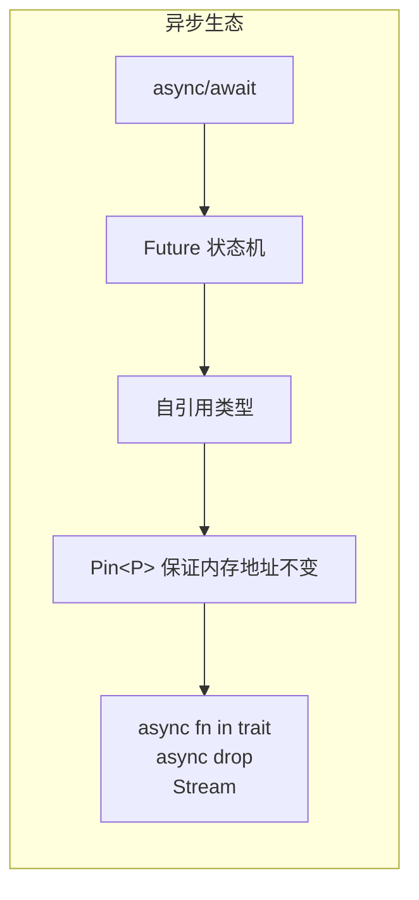
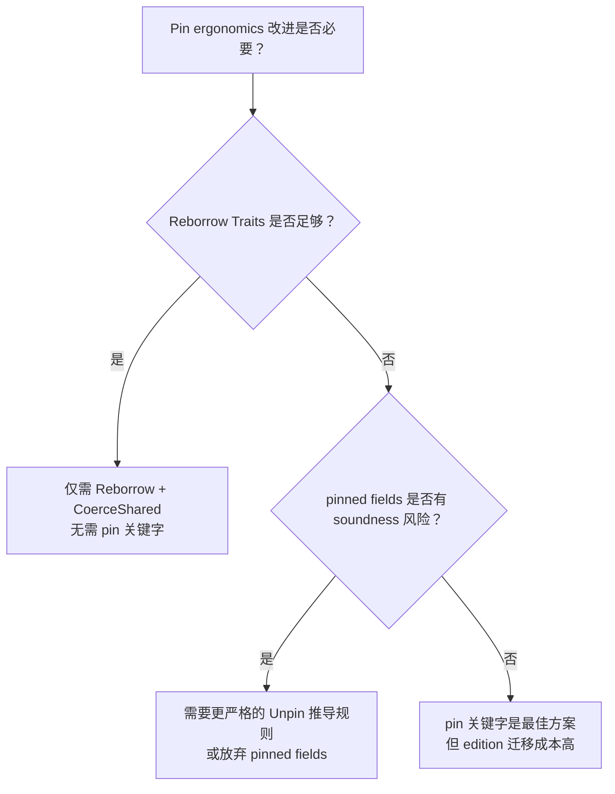

# Pin Ergonomics 与 Reborrow Traits 预研：超越 `Pin::as_mut`

> **代码状态**: ✅ 含可编译示例
>
> **EN**: Pin Ergonomics Preview
> **Summary**: Preview of ergonomic improvements to working with `Pin` in Rust.
> **Rust 版本**: 1.97.0+ (Edition 2024)
> **状态**: 🧪 Nightly 实验性（MCP 已通过，RFC 推进中）
> **Rust 属性标记**: `#[experimental]` `#[nightly_only]`
> **跟踪版本**: nightly 1.98.0 (2026-05-31)
> **预计稳定**: 2027+（需等待 RFC 完成及 ecosystem 适配）
>
> **受众**: [专家]
> **内容分级**: [实验级]
> **Bloom 层级**: L4-L5
> **权威来源**: 本文件为 `concept/` 权威页。
>
> **定位**: 探讨 Rust 编译器基础设施中最影响异步（Async）编程体验的长期痛点 —— `Pin` 的 ergonomics，以及 Project Goals 2026 Flagship "Beyond the `&`" 的解决方案：Reborrow Traits、Pinned Places、Safe Pin Projection。
> **前置概念**: · [并发与异步（Async）](../../06_ecosystem/04_web_and_networking/02_cloud_native.md)
> [Async](../../03_advanced/01_async/01_async.md) ·
> [Pin/Unpin](../../03_advanced/01_async/08_pin_unpin.md) ·
> [Traits](../../02_intermediate/00_traits/01_traits.md)
> **后置概念**:
> [Version Tracking](../00_version_tracking/01_rust_version_tracking.md) ·
> [Async Drop](22_async_drop_preview.md)
> **来源**: · [Rust Reference](https://doc.rust-lang.org/reference/introduction.html) · [TRPL](https://doc.rust-lang.org/book/title-page.html) · [Brown University — Interactive Rust Book](https://rust-book.cs.brown.edu/) · [Jung et al. — RustBelt: Securing the Foundations of Rust](https://plv.mpi-sws.org/rustbelt/popl18/) · [Itanium C++ ABI](https://itanium-cxx-abi.github.io/cxx-abi/abi.html)
> [RFC #3709 — Pinned Places](https://github.com/rust-lang/rfcs/issues/3709) ·
> [Rust Project Goals 2026 — Pin Ergonomics](https://rust-lang.github.io/rust-project-goals/2026/pin-ergonomics.html) ·
> [withoutboats — Pin and Suffering](https://without.boats/blog/) ·
> [RFC #3627 — Reborrow Traits](https://github.com/rust-lang/rfcs/pull/3627)

---

## 一、核心问题：Pin 的人机工程学危机

「核心问题：Pin 的人机工程学危机」部分包含当前的五大痛点 与 为什么 Pin 如此重要？ 两条主线，本节依次说明。

### 1.1 当前的五大痛点

| # | 痛点 | 示例 | 影响 |
|:---:|:---|:---|:---:|
| 1 | **栈上 Pin 需要宏（Macro）** | `let mut pinned = pin!(future);` | 初学者困惑：为什么不能 `let pinned = Pin::new(&mut future)` |
| 2 | **Pinned 引用（Reference）不能自动 reborrow** | `pinned.as_mut().await` | 每次都需要显式调用 `as_mut()`，代码噪音大 |
| 3 | **方法签名噪音** | `fn poll(self: Pin<&mut Self>)` | 自定义 Future 必须写冗长的 self 类型 |
| 4 | **Safe Pin Projection 需要外部 crate** | 必须使用 `pin-project` 或 `pin-project-lite` | 额外依赖、宏（Macro）魔法、学习曲线 |
| 5 | **Drop 与 Pin 的交互危险** | 手动实现 pin projection 时可能违反 pinning guarantee | 潜在的内存安全（Memory Safety）漏洞 |

### 1.2 为什么 Pin 如此重要？



Rust 的 `async/await` 编译为**自引用（Reference）状态机**。如果状态机在内存中移动，内部指针将悬空。`Pin` 是 Rust 内存安全（Memory Safety）模型的关键扩展 —— 但它的人机工程学一直是社区最大痛点之一。

---

## 二、解决方案 1：Reborrow Traits（已推进）

Pin 人体工学的核心痛点之一：**`Pin<&mut T>` 不能自动 reborrow**。普通 `&mut T` 在传给函数时会隐式 reborrow（`&mut *x`），原引用之后仍可用；`Pin<&mut T>` 无此机制，每次传递都是移动——调用一次 `poll` 类 API 后 `Pin` 引用即被消耗，迫使开发者手写 `x.as_mut()` 重借。

Reborrow Traits 方案引入两个标记 trait：

- **`Reborrow`**：表达「该类型可产生一个更短的同类型借用视图」（`Pin<&mut T>` → `Pin<&mut T>` 缩短生命周期）；
- **`CoerceShared`**：表达「可降级为共享形式」（`Pin<&mut T>` → `Pin<&T>`）。

预期效果：`Pin<&mut T>` 在方法调用链中获得与 `&mut T` 一致的自动 reborrow 体验，`as_mut()` 仪式性调用消失。

判定依据：该方案已相对成熟（traits 设计收敛）；等待稳定期间，库 API 设计应接受 `Pin<&mut T>` 而非 `&mut Pin<T>`，减少调用方摩擦。

### 2.1 问题：`Pin<&mut T>` 不能自动 reborrow

```rust,ignore
// 当前代码：必须显式调用 as_mut()
let mut pinned: Pin<&mut MyFuture> = ...;
pinned.as_mut().poll(cx);   // ✅ 可以
pinned.poll(cx);            // ❌ 不能自动 reborrow
```

对比普通引用（Reference）：

```rust,ignore
let mut r: &mut T = ...;
use_ref(r);      // ✅ 自动 reborrow
use_ref(r);      // ✅ 再次使用
```

### 2.2 `Reborrow` 和 `CoerceShared` Traits

Project Goals 2026 正在推进两个核心 trait：

```rust
// 概念性伪代码（nightly 实验中）
pub trait Reborrow {
    type Output;
    fn reborrow(&mut self) -> Self::Output;
}

pub trait CoerceShared<To> {
    fn coerce_shared(&self) -> To;
}
```

**设计目标**:

- `Reborrow`：允许 `Pin<&mut T>` 像普通 `&mut T` 一样自动 reborrow
- `CoerceShared`：允许 `Pin<&mut T>` → `Pin<&T>` 的自动转换

### 2.3 预期效果

```rust,ignore
// Reborrow Traits 稳定后的目标语法
let mut pinned: Pin<&mut MyFuture> = ...;
pinned.poll(cx);           // ✅ 自动 reborrow
let shared: Pin<&MyFuture> = &pinned;  // ✅ 自动 CoerceShared
```

**当前状态** (2026-06):

- 2025H2 已实现 `Reborrow` / `CoerceShared` trait 的单生命周期（Lifetimes） + trivial 内存布局原型
- 2026 年继续迭代：收集用户反馈、支持多生命周期（Lifetimes）重借、非平凡 `CoerceShared`、安全性验证、基于实现经验重写 RFC
- Blocker：可能需要对编译器内部 `Rvalue::Ref` / `ExprKind::Ref` 进行大规模重构；多生命周期（Lifetimes）支持涉及 rmeta 复杂度
- 详见 [Rust Project Goals 2026 — Reborrow Traits](https://rust-lang.github.io/rust-project-goals/2026/reborrow-traits.html)

---

## 三、解决方案 2：Pinned Places（RFC 讨论中）

Pinned Places 是更激进的方案：把「固定（pinned）」从类型层下沉到**位置（place）层**——`pin` 关键字声明一个被固定的局部位置，编译器保证其地址稳定。

三个设计要点：

1. **`pin` 关键字**：`let pin x = ...;` 声明固定绑定，后续 `&pin mut x` / `&pin const x` 产生固定引用——取代 `Pin::new`/`Box::pin` 的堆分配仪式，栈上固定成为一等语法；
2. **Pinned Fields**：结构体字段可标记为固定，投影（projection）规则决定「固定父结构 → 哪些子字段引用合法」——这是当前 `pin-project` 宏手工实现的语言级化；
3. **Pinned Drop**：固定对象的析构保证在原地发生，与 `Drop` 的移动语义交互是 RFC 讨论焦点。

判定依据：Pinned Places 触及语言核心（位置语义），落地周期长；中期最现实的增量仍是 Reborrow Traits 与 `pin-project` 宏生态。

### 3.1 核心想法：`pin` 关键字

由 withoutboats 和 Olivier Faure 提出的激进方案：将 `pin` 作为语言关键字。

```rust,ignore
// 栈上 pinned 绑定（无需 pin! 宏）
let pin mut stream = make_stream();

// 自动 reborrow
stream.next().await;  // ✅ 无需 as_mut()

// 安全的 pin projection
let pin mut foo = Foo { bar: Bar::new(), baz: 42 };
let bar_ref: Pin<&mut Bar> = &pin mut foo.bar;  // ✅ 安全且无需宏
```

### 3.2 Pinned Fields

```rust,ignore
struct Foo {
    pub pin bar: Bar,   // 标记字段为 pinned
    pub baz: Baz,       // 普通字段
}

let pin mut foo = Foo { ... };
let bar: Pin<&mut Bar> = &pin mut foo.bar;  // 自动 pin projection
let baz: &mut Baz = &mut foo.baz;            // 普通借用
```

**关键约束**: 类型含 pinned fields 时，不能显式实现 `Unpin` —— 只能通过 auto trait 机制推导。

### 3.3 Pinned Drop

```rust,ignore
impl Drop for Foo {
    fn drop(&pin mut self) {
        // self 的类型是 Pin<&mut Self>
        // 防止在 drop 中 move pinned fields
    }
}
```

**兼容性**: `Drop::drop` 不允许直接调用，因此改变签名不会破坏现有代码。

---

## 四、解决方案 3：Field Projections（Project Goals #390）

本节从与 Pinned Places 的关系 与 设计空间 两个层面剖析「解决方案 3：Field Projections（Proj…」。

### 4.1 与 Pinned Places 的关系

Field Projections 是 Rust for Linux 和 Beyond the `&` 的共同需求：

```rust,ignore
// 目标：安全的字段投影（不限于 Pin）
let dma_buf: &mut DmaBuffer = ...;
let header: &mut Header = &mut dma_buf.header;  // 当前需要 unsafe
```

### 4.2 设计空间

| 方案 | 状态 | 适用场景 |
|:---|:---|:---|
| `pin` 关键字 + pinned fields | RFC 讨论 | 语言级 Pin ergonomics |
| `Deref` / `Receiver` 重构 | 推进中 | 通用字段投影 |
| `Field` trait + 宏（Macro） | 实验性 | Rust for Linux 当前方案 |

---

## 五、反命题与边界分析

反命题树：「Pin API 足够好，人体工学改进不值得语言复杂度」——边界分析：

1. **采用率证据**：async 生态中 `Pin` 是新手第一道认知悬崖（调查显示理解成本远超生命周期），生态库（`pin-project` 下载量千万级）的存在本身就是「语言缺位」的市场信号；
2. **方案复杂度的真实边界**：Reborrow Traits 只加两个标记 trait（类型层增量，无新语法）——复杂度可控；Pinned Places 引入位置级新概念（编译器实现与教学成本双高）——应作为长期方向而非近期赌注；
3. **错误的替代方案**：用 `unsafe { Pin::new_unchecked }` 绕过是生产代码的真实普遍做法，人体工学缺失正在把 unsafe 常态化——这是改进的最强论据。

判定依据：关注 RFC 3462 系（`&pin` 引用类型）与 Project Goal #390 的季度报告；生产代码继续用 `pin-project`，不用 nightly 特性。

### 5.1 反命题树



### 5.2 关键边界

1. **Edition 兼容性**: `pin` 作为关键字需要在新的 Edition 中引入，不能破坏现有代码中的 `pin` 标识符。
2. **生态适配成本**: `tokio`、`futures`、`async-trait` 等核心 crate 需要适配新的 Reborrow traits。
3. **与 `Drop` 的交互**: 改变 `Drop` 签名的条件性（`&mut self` vs `&pin mut self`）需要编译器特殊处理。

---

## 六、演进路线与跟踪

| 里程碑 | 预计时间 | 状态 |
|:---|:---|:---:|
| Reborrow Traits PR 合并 | 2026 H2 | 🔄 审查中 |
| Reborrow derive macro | 2026 H2 | ⏳ 待实现 |
| Field Projections RFC | 2026 H2 | 🔄 讨论中 |
| `pin` 关键字 RFC | 2027+ | ⏳ 早期提案 |
| Pinned Drop 实验 | 2027+ | ⏳ 依赖 pin 关键字 |

---

## 七、实践：当前可用的缓解方案

> 在语言特性稳定之前，开发者可以使用以下 crate：

| Crate | 解决的问题 | 使用场景 |
|:---|:---|:---|
| `pin-project` / `pin-project-lite` | Safe pin projection | 自定义 Future / Stream |
| `pin-utils` | `pin_mut!` 宏（Macro） | 栈上 pinning（已被 `std::pin::pin!` 取代）|
| `futures::FutureExt` | `.poll_unpin()` 等辅助方法 | 通用异步（Async）编程 |

---

> **[教学类比]** Pin Ergonomics 的改进类似于给 Rust 的异步（Async）编程"解除绑腿"——核心机制（Pin 保证内存安全（Memory Safety））不变，但使用方式更自然。Reborrow Traits 让 `Pin<&mut T>` 的行为更接近普通 `&mut T`，而 `pin` 关键字则从根本上简化自引用（Reference）类型的表达。
>
> **来源**: [Rust Project Goals 2026 — Pin Ergonomics](https://rust-lang.github.io/rust-project-goals/2026/pin-ergonomics.html) · [withoutboats — "Pin and Suffering"](https://without.boats/blog/pin/) · [RFC #3709](https://github.com/rust-lang/rfcs/issues/3709)

## ⚠️ 反例与陷阱

**陷阱：对 `!Unpin` 类型的 `Pin<&mut T>` 直接写字段**。`Pin` 刻意不实现 `DerefMut`（除非 `T: Unpin`），「Pin 人机工程学危机」最日常的体现就是连改一个普通字段都被拦下：

```rust,compile_fail
use std::marker::PhantomPinned;
use std::pin::Pin;

struct SelfRef { data: u32, _pin: PhantomPinned }

fn mutate(p: Pin<&mut SelfRef>) {
    p.data += 1; // Pin<&mut SelfRef> 不可 DerefMut
}
```

rustc 1.97.0 实测：`error[E0594]: cannot assign to data in dereference of Pin<&mut SelfRef>`。

**修正（当前可用）**：对非结构钉扎字段用显式 unsafe 投影并注明 SAFETY；生产代码用 `pin-project` 宏生成等价安全投影：

```rust,ignore
fn mutate(p: Pin<&mut SelfRef>) {
    // SAFETY: 仅修改非结构钉扎字段 data，不移动被钉扎数据
    let this = unsafe { p.get_unchecked_mut() };
    this.data += 1;
}
```

## 嵌入式测验（Embedded Quiz）

「嵌入式测验（Embedded Quiz）」部分按测验 1：`Pin` 的人机工程学危机指什么？（理解层）、测验 2：`Pin::as_mut()` 和普通的 `&mut` 重新…、测验 3：`pin!` 宏在 Rust 1.96+ 中提供了什么便利？…、测验 4：Reborrow Traits 提案试图解决什么问题？（理解…等5个方面的顺序逐层展开。

### 测验 1：`Pin` 的人机工程学危机指什么？（理解层）

**题目**: `Pin` 的人机工程学危机指什么？

<details>
<summary>✅ 答案与解析</summary>

自引用（Reference）类型（如异步（Async）状态机）需要 `Pin` 保证内存不移动，但 `Pin<&mut T>` 不能自由重新借用（Borrowing），导致大量模板代码和不直观的错误信息。
</details>

---

### 测验 2：`Pin::as_mut()` 和普通的 `&mut` 重新借用有什么区别？（理解层）

**题目**: `Pin::as_mut()` 和普通的 `&mut` 重新借用（Borrowing）有什么区别？

<details>
<summary>✅ 答案与解析</summary>

`Pin::as_mut()` 保持 `Pin` 包装，返回 `Pin<&mut T>`。普通 `&mut` 重新借用（Borrowing）会丢失 `Pin` 语义，可能破坏自引用（Reference）类型的内存安全（Memory Safety）。
</details>

---

### 测验 3：`pin!` 宏在 Rust 1.96+ 中提供了什么便利？（理解层）

**题目**: `pin!` 宏（Macro）在 Rust 1.96+ 中提供了什么便利？

<details>
<summary>✅ 答案与解析</summary>

`pin!` 宏（Macro）在栈上创建 pinned 值，无需 `Box::pin` 的堆分配。简化了测试和局部异步（Async）代码中的 pinning 操作。
</details>

---

### 测验 4：Reborrow Traits 提案试图解决什么问题？（理解层）

**题目**: Reborrow Traits 提案试图解决什么问题？

<details>
<summary>✅ 答案与解析</summary>

让 `Pin<&mut T>` 的行为更接近普通 `&mut T`，允许自动重新借用（Borrowing）和模式匹配（Pattern Matching），减少显式的 `as_mut()` 调用。
</details>

---

### 测验 5：如果 `pin` 关键字被引入 Rust，它可能如何简化自引用类型？（理解层）

**题目**: 如果 `pin` 关键字被引入 Rust，它可能如何简化自引用（Reference）类型？

<details>
<summary>✅ 答案与解析</summary>

`pin` 关键字可能允许直接声明自引用（Reference）字段（`pin field: T`），编译器自动生成必要的 pinning 保证，无需手动 `Pin` 包装和 unsafe 投影。
</details>

---

## 国际权威参考 / International Authority References（P1 学术 · P2 生态）

> 依据 `AGENTS.md` §2「对齐网络国际化权威内容」补充：仅追加已验证可达的权威链接，不改动正文事实。

- **P2 生态/社区**: [docs.rs/hyper — 生态权威 API 文档](https://docs.rs/hyper) · [docs.rs/tokio — 生态权威 API 文档](https://docs.rs/tokio)
