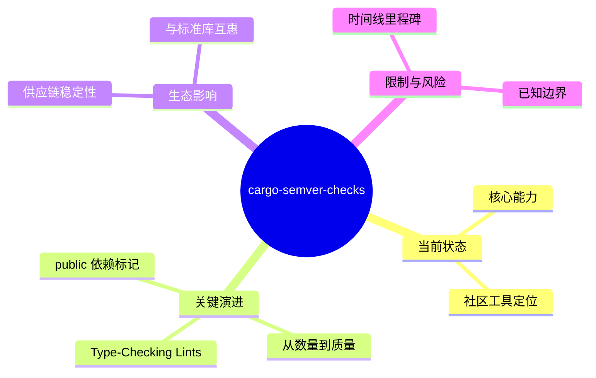

> **内容分级**: [实验级]
> **代码状态**: ✅ 含可编译示例
> **状态**: 🧪 Nightly 实验性
> **Rust 属性标记**: `#[experimental]` `#[nightly_only]`
> **跟踪版本**: nightly 1.98.0
> **预计稳定**: 待定

# cargo-semver-checks：从社区工具到 Cargo 官方集成
>
> **EN**: Cargo SemVer Checks Preview
> **Summary**: Preview of `cargo-semver-checks` integration for automated semantic-versioning linting.
> **Rust 版本**: 1.97.0+ (Edition 2024)
> **受众**: [专家]
> **权威来源**: 本文件为 `concept/` 权威页。
> **跟踪版本**: 1.97.0+ (Edition 2024)
> **定理链**: N/A — 描述性/综述性/导航性文档，不涉及形式化定理链
>
> **来源**: [Rust RFCs](https://github.com/rust-lang/rfcs) · [Inside Rust Blog](https://blog.rust-lang.org/inside-rust/) · [Rust Edition Guide](https://doc.rust-lang.org/edition-guide/index.html) · [Rust Reference](https://doc.rust-lang.org/reference/introduction.html) · [TRPL](https://doc.rust-lang.org/book/title-page.html) · [Brown University — Interactive Rust Book](https://rust-book.cs.brown.edu/) · [Jung et al. — RustBelt: Securing the Foundations of Rust](https://plv.mpi-sws.org/rustbelt/popl18/) · [Itanium C++ ABI](https://itanium-cxx-abi.github.io/cxx-abi/abi.html)
---

> **来源**:
> [cargo-semver-checks GitHub](https://github.com/obi1kenobi/cargo-semver-checks) ·
> [2025 Year in Review — Predrag Gruevski](https://predr.ag/blog/cargo-semver-checks-2025-year-in-review/) ·
> [Rust GSoC 2026](https://github.com/rust-lang/google-summer-of-code) ·
> [Rust Project Goals — Orphaned Goals](https://rust-lang.github.io/rust-project-goals/)
>
> **前置概念**:
> [Public/Private Dependencies](../../06_ecosystem/01_cargo/02_public_private_deps.md) ·
> [Cargo 工具链](../../06_ecosystem/00_toolchain/01_toolchain.md)

---

> **Bloom 层级**: L4-L5
> **A/S/P 标记**: **P** — Procedure
> **定位**: 跟踪 `cargo-semver-checks` 从独立社区工具向 Cargo 官方生态集成的演进过程，分析其对 Rust 供应链稳定性和 API 兼容性验证的结构性影响。

---

## 一、当前状态

`cargo-semver-checks` 是 Rust 生态中最重要的 API 兼容性验证工具之一，截至 2026-06-06：

| 指标 | 数值 |
|:---|:---|
| GitHub Stars | ~1,632 |
| 可检测破坏变更类型 | ~245 种 |
| Open Issues | 174 |
| 最后更新 | 2026-06-06 |
| Cargo 官方集成状态 | 🟡 跟踪中（非阻塞性 blocker 持续解决中） |

### 核心能力

- **基于 rustdoc JSON**：利用 `rustdoc --output-format json` 提取 crate 的公开 API 结构，无需实际编译下游代码即可检测破坏变更
- **声明式查询语言**：使用 Trustfall 图查询引擎，以声明方式定义 lint 规则，支持快速扩展
- **Witness Crate 验证**：对疑似破坏变更自动生成最小复现 crate，通过 `cargo check` 确认是否真正破坏

---

## 二、2026 年关键演进方向

2026 年的演进围绕一个公认缺口：**cargo-semver-checks 目前主要做 API 表面（类型签名）比对，不做类型检查级的语义比对**。三条方向按成熟度排序：

| 方向 | 解决的问题 | 当前状态判据 |
|:---|:---|:---|
| Type-checking lints | `impl Trait` 约束变化、auto trait 泄漏等语义级 breaking | 官方仓库 lint 清单与 issue 登记 |
| 策略转变：从数量到质量 | 降低 lint 误报率，优先合并高信度 lint | release 中 lint 精度标注 |
| `public` 依赖标记集成 | 依赖类型泄漏到公共 API 时的版本要求 | cargo public/private 依赖特性进展 |

判定原则：评估"能否在 CI 强制 semver-checks"时，先统计本仓库的误报率；误报未收敛前建议 warn-only。

### 2.1 Type-Checking Lints（最大能力缺口）

当前 `cargo-semver-checks` 最大的局限是**无法执行类型检查**。例如以下变更当前无法被检测：

```rust,ignore
// 旧版本
pub fn example(x: i64) {}

// 新版本（破坏变更，但当前无法自动检测）
pub fn example(x: String) {}
```

**GSoC 2026 项目**已将其列为正式项目（Crate ecosystem 类别），目标：

- 设计并实现 type-checking lint 的基础设施
- 通过 Witness Crate + `cargo check` 的组合验证类型层面的破坏
- 为 2026 年及以后批量上线 type-checking lint 奠定基础

### 2.2 策略转变：从数量到质量

作者 Predrag Gruevski 在 2025 Year in Review 中明确 2026 年策略转变：

| 维度 | 2025 及以前 | 2026 目标 |
|:---|:---|:---|
| Lint 增长策略 | 每年新增数百条 lint | 转向稳定性、减少误报 |
| 核心目标 | 覆盖更多破坏变更类型 | 让 Rust 标准库本身运行 cargo-semver-checks |
| 集成深度 | 独立社区工具 | 进一步集成到 Cargo 官方生态 |
| 资金状况 | GitHub Sponsors + 企业赞助 | 需要重大企业资助维持高强度开发 |

### 2.3 `public` 依赖标记集成

随着 Cargo `public = true/false` 依赖标记（[RFC 3516](https://rust-lang.github.io/rfcs//3516-public-private-dependencies.html)）的推进，`cargo-semver-checks` 计划利用该标记优化分析：

- 仅对 `public` 依赖的 API 变更进行 SemVer 影响分析
- 减少 `private` 依赖升级导致的误报
- 已在 `concept/06_ecosystem/10_public_private_deps.md` 中记录该集成计划

---

## 三、对 Rust 生态的结构性影响

结构性影响沿两条链路传导：

1. **供应链稳定性**：semver-checks 进入 CI 后，breaking change 从"下游报错才发现"前移到"发布前阻断"，与 `cargo publish` 的依赖解析叠加，抬高整个生态的升级可信度；
2. **与标准库的互惠**：标准库自身的稳定性承诺（stable API 永不 breaking）为 semver-checks 提供基准语料；反过来 lint 的误报复测也依赖 std 的真实演化历史。

判定一个生态工具是否产生"结构性"影响的标准：它是否改变了发布者的**默认行为**（而非可选增强）。semver-checks 的临界点是被 crates.io 或主流 workspace 模板默认集成。

### 3.1 供应链稳定性

`cargo-semver-checks` 已被多个顶级 crate 采用（包括 rustfmt），其集成到 Cargo 官方工作流将：

- **降低 crate 作者发布破坏变更的风险**
- **减少下游用户的编译失败和运行时（Runtime）行为变更**
- **为 crates.io 提供自动化 SemVer 验证的基础能力**

### 3.2 与 Rust 标准库的互惠

让 Rust 标准库本身运行 `cargo-semver-checks` 是一个双向目标：

- **对工具**：标准库的庞大 API 表面是对工具性能和准确性的终极压力测试
- **对标准库**：确保 `std` API 变更的 SemVer 合规性（尽管 `std` 理论上不受 SemVer 约束，但 de facto 兼容性仍然关键）

---

## 四、时间线与里程碑

| 时间 | 事件 | 状态 |
|:---|:---|:---:|
| 2023 | `cargo-semver-checks` 初始发布 | ✅ |
| 2025 | 年检测 ~245 种破坏变更， Trustfall 查询引擎成熟 | ✅ |
| 2025-12 | 2025 Year in Review 发布，明确 2026 策略转变 | ✅ |
| 2026-02 | GSoC 2026 项目提案：Type-Checking Lints | ✅ |
| 2026 | GSoC 实习生开始 type-checking lint 基础设施开发 | 🔄 进行中 |
| 2026–2027 | 解决合并到 Cargo 的剩余 blocker | 🟡 跟踪中 |
| 2027+ | 可能的 Cargo 官方原生集成 | 🔮 远期 |

---

## 五、已知限制与风险

| 风险 | 说明 | 缓解措施 |
|:---|:---|:---|
| **资金可持续性** | 开源赞助不足以维持高强度开发 | 寻求重大企业资助；GSoC 补充人力 |
| **误报率** | 部分 lint 存在 false positive | 2026 年核心工作：减少误报 |
| **标准库集成复杂度** | `std` 的特殊性（no_std 边界、unstable feature） | 分阶段推进，先核心 API 后边缘模块（Module） |
| **RFC 3516 依赖** | `public` 标记优化需等待 RFC 稳定 | 独立开发，条件编译适配 |

---

> **后置概念**: [Public/Private Dependencies](../../06_ecosystem/01_cargo/02_public_private_deps.md) · [Rust 工具链](../../06_ecosystem/00_toolchain/01_toolchain.md)

## 嵌入式测验（Embedded Quiz）

本节 5 道测验均为理解层：先验证对 `cargo-semver-checks` 检测机制（rustdoc JSON 分析）与检查类别的掌握，再考察其在 crates.io 生态与 CI 发布流程中的工程价值。建议作答前先回顾上文「一、当前状态」与「三、对 Rust 生态的结构性影响」，尝试不看答案复述检测流程。

### 测验 1：`cargo-semver-checks` 如何检测 breaking change？（理解层）

**题目**: `cargo-semver-checks` 如何检测 breaking change？

<details>
<summary>✅ 答案与解析</summary>

分析 `rustdoc` 生成的 JSON 输出，检查公共 API 的变更：删除项、改变类型签名、修改 trait 实现、调整泛型（Generics）约束等。
</details>

---

### 测验 2：为什么 SemVer 检查对 crates.io 生态如此重要？（理解层）

**题目**: 为什么 SemVer 检查对 crates.io 生态如此重要？

<details>
<summary>✅ 答案与解析</summary>

crates.io 有超过 15 万个 crate，依赖关系复杂。SemVer 违规可能导致大量下游 crate 编译失败，破坏生态稳定性。
</details>

---

### 测验 3：`cargo-semver-checks` 目前支持哪些类别的检查？（理解层）

**题目**: `cargo-semver-checks` 目前支持哪些类别的检查？

<details>
<summary>✅ 答案与解析</summary>

函数删除、结构体（Struct）字段变更、enum 变体变更、trait 方法添加（默认 impl 除外）、泛型（Generics）参数变更、可见性变更等。持续扩展中。
</details>

---

### 测验 4：如何在 CI 中集成 SemVer 检查？（理解层）

**题目**: 如何在 CI 中集成 SemVer 检查？

<details>
<summary>✅ 答案与解析</summary>

在发布工作流中运行 `cargo semver-checks`，与最新发布的版本比较。若检测到 breaking change 但版本号未升级 major，则阻断发布。
</details>

---

### 测验 5：这个工具对 Rust 生态的长期影响是什么？（理解层）

**题目**: 这个工具对 Rust 生态的长期影响是什么？

<details>
<summary>✅ 答案与解析</summary>

降低"依赖地狱"风险，提高 crates.io 的整体质量。使库维护者更自信地演进 API，用户更放心地升级依赖。
</details>

---

## 🧭 思维导图（Mindmap）




## ⚠️ 反例与陷阱：「小版本升级」改变公开函数签名

**反例**：库在 `1.1.0` 中把 `fn parse(s: &str) -> i32` 改为返回 `Result`，下游仅 `cargo update` 后编译失败：

```rust,compile_fail
// 库 1.1.0 的新签名
fn parse(s: &str) -> Result<i32, ()> {
    Ok(s.len() as i32)
}

fn main() {
    // 下游按 1.0.x 的旧签名调用
    let n: i32 = parse("42");
    println!("{n}");
}
```

实测（rustc 1.97.0, edition 2024）：`error[E0308]: mismatched types`（`Result<i32, ()>` 不能赋给 `i32`）。

**陷阱本质**：修改公开项签名属破坏性变更，SemVer 要求主版本升级；靠人工记忆必然漏判——这正是 cargo-semver-checks 走向 Cargo 官方集成的动机。

**修正**：破坏性变更升主版本（`2.0.0`），或保留旧 API 并 `#[deprecated]` 过渡；发布前运行 `cargo semver-checks`，把这类错误挡在 CI。
