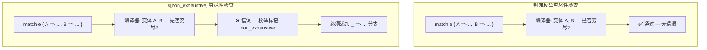
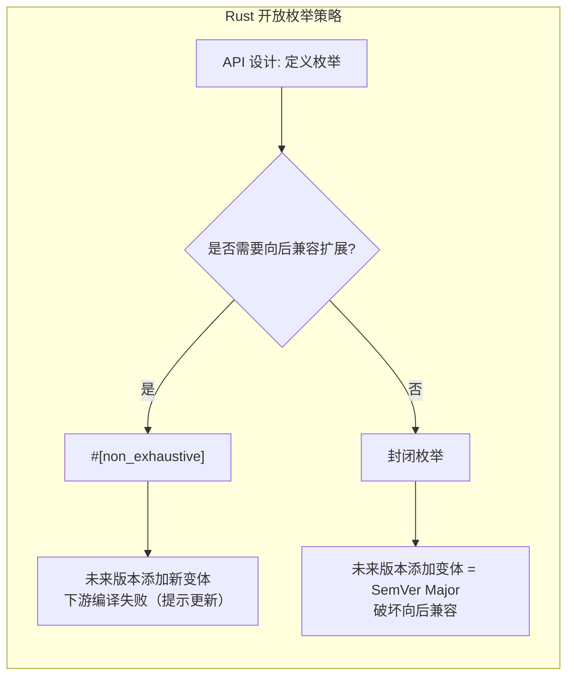
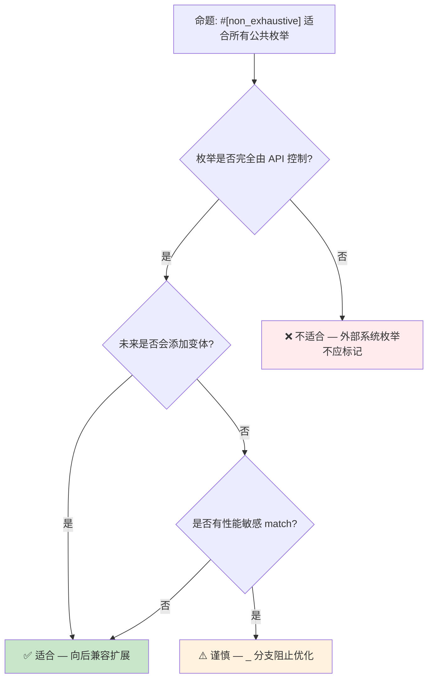

# Open Enums 概念预研：从 `#[non_exhaustive]` 到可扩展枚举

> **代码状态**: ✅ 含可编译示例
>
> **EN**: Open Enums Preview
> **Summary**: Open Enums Preview: emerging Rust language feature or ecosystem trend.
> **Rust 版本**: 1.97.0+ (Edition 2024)
>
> **状态**: 🧪 Nightly 实验性
> **Rust 属性标记**: `#[experimental]` `#[nightly_only]`
> **跟踪版本**: nightly 1.98.0 (2026-05-31)
> **预计稳定**: 待定（需等待 RFC / MCP 完成）
>
> **受众**: [专家]
> **内容分级**: [实验级]
> **Bloom 层级**: L4-L5
> **权威来源**: 本文件为 `concept/` 权威页。
> **A/S/P 标记**: **S** — Structure
> **双维定位**: C×Ana — 分析 Open Enums 预览特性
> **定位**: 探讨 Rust 枚举（Enum）类型在 API 演进与跨 crate 兼容性维度的**开放性语义**，从现有 `#[non_exhaustive]` 机制延伸到语言级开放枚举的设计空间。
> **前置概念**: [Type System](../../01_foundation/02_type_system/01_type_system.md) · [Traits](../../02_intermediate/00_traits/01_traits.md) · [Error Handling](../../02_intermediate/03_error_handling/01_error_handling.md) · [Evolution](../04_research_and_experimental/03_evolution.md)
> **后置概念**:
> [Version Tracking](../00_version_tracking/01_rust_version_tracking.md) ·
> [Effects System](01_effects_system.md)
> **定理链**: N/A — 描述性/综述性/导航性文档，不涉及形式化定理链
---

> **来源**: · [Brown University — Interactive Rust Book](https://rust-book.cs.brown.edu/) · [Jung et al. — RustBelt: Securing the Foundations of Rust](https://plv.mpi-sws.org/rustbelt/popl18/) · [Itanium C++ ABI](https://itanium-cxx-abi.github.io/cxx-abi/abi.html)
> [RFC 2008 — `non_exhaustive`](https://github.com/rust-lang/rfcs/pull/2008) ·
> [Rust Reference — Enum Types](https://doc.rust-lang.org/reference/items/enumerations.html) ·
> [RFC 3518 — Sealed Traits](https://github.com/rust-lang/rfcs/pull/3518) ·
> [GitHub #156628 — Open Enums Tracking](https://github.com/rust-lang/rust/issues/156628) ·
> [Scala Sealed Traits](https://docs.scala-lang.org/tour/pattern-matching.html) ·
> [Haskell Open Data Types](https://wiki.haskell.org/Extensible_datatypes) ·
> [OCaml Polymorphic Variants](https://ocaml.org/manual/polyvariant.html)
> **前置依赖**: [Rust vs C++](../../05_comparative/01_systems_languages/01_rust_vs_cpp.md)
> **前置依赖**: [Toolchain](../../06_ecosystem/00_toolchain/01_toolchain.md)

## 📑 目录

- [Open Enums 概念预研：从 `#[non_exhaustive]` 到可扩展枚举](#open-enums-概念预研从-non_exhaustive-到可扩展枚举)
  - [📑 目录](#-目录)
  - [一、核心概念：封闭 vs 开放枚举](#一核心概念封闭-vs-开放枚举)
    - [1.1 封闭枚举（Closed Enums）](#11-封闭枚举closed-enums)
    - [1.2 `#[non_exhaustive]`：兼容性层面的开放](#12-non_exhaustive兼容性层面的开放)
    - [1.3 开放枚举（Open Enums）的设计空间](#13-开放枚举open-enums的设计空间)
  - [二、`#[non_exhaustive]` 的形式化语义](#二non_exhaustive-的形式化语义)
    - [2.1 编译期影响：穷尽性检查的弱化](#21-编译期影响穷尽性检查的弱化)
    - [2.2 运行时语义：无变化](#22-运行时语义无变化)
    - [2.3 与模式匹配的交互](#23-与模式匹配的交互)
  - [三、跨语言对比：开放枚举的多种形态](#三跨语言对比开放枚举的多种形态)
    - [3.1 Scala：Sealed Traits + 子类](#31-scalasealed-traits--子类)
    - [3.2 Haskell：Open Data Types](#32-haskellopen-data-types)
    - [3.3 OCaml：Polymorphic Variants](#33-ocamlpolymorphic-variants)
    - [3.4 Rust 当前方案：`#[non_exhaustive]` + 新变体](#34-rust-当前方案non_exhaustive--新变体)
  - [四、API 设计中的开放枚举模式](#四api-设计中的开放枚举模式)
    - [4.1 错误码枚举](#41-错误码枚举)
    - [4.2 事件/消息类型](#42-事件消息类型)
    - [4.3 配置/选项枚举](#43-配置选项枚举)
  - [五、反命题与边界分析](#五反命题与边界分析)
    - [5.1 反命题树](#51-反命题树)
    - [5.2 边界极限](#52-边界极限)
  - [六、演进路线与预测](#六演进路线与预测)
  - [七、来源与延伸阅读](#七来源与延伸阅读)
  - [相关概念](#相关概念)
  - [权威来源索引](#权威来源索引)
  - [十、边界测试：Open Enums 预览的编译错误](#十边界测试open-enums-预览的编译错误)
    - [10.1 边界测试：开放枚举的穷尽匹配失效（编译错误）](#101-边界测试开放枚举的穷尽匹配失效编译错误)
    - [10.2 边界测试：开放枚举的整数转换安全（编译错误/运行时 panic）](#102-边界测试开放枚举的整数转换安全编译错误运行时-panic)
    - [10.3 边界测试：open enum 的 match 穷尽性检查松弛（编译错误）](#103-边界测试open-enum-的-match-穷尽性检查松弛编译错误)
    - [10.4 边界测试：open enum 的整数转换与有效性检查（运行时 panic）](#104-边界测试open-enum-的整数转换与有效性检查运行时-panic)
    - [10.3 边界测试：open enum 的穷尽匹配与未知变体（编译错误/运行时 panic）](#103-边界测试open-enum-的穷尽匹配与未知变体编译错误运行时-panic)
  - [嵌入式测验（Embedded Quiz）](#嵌入式测验embedded-quiz)
    - [测验 1：什么是"开放枚举"（Open Enums）？它解决了 Rust 当前枚举的什么问题？（理解层）](#测验-1什么是开放枚举open-enums它解决了-rust-当前枚举的什么问题理解层)
    - [测验 2：开放枚举与 `#[non_exhaustive]` 属性有什么关系？（理解层）](#测验-2开放枚举与-non_exhaustive-属性有什么关系理解层)
    - [测验 3：开放枚举对库作者和库用户分别有什么影响？（理解层）](#测验-3开放枚举对库作者和库用户分别有什么影响理解层)
    - [测验 4：这个特性对 C FFI 中的枚举映射有什么帮助？（理解层）](#测验-4这个特性对-c-ffi-中的枚举映射有什么帮助理解层)
    - [测验 5：开放枚举目前的反对意见主要是什么？（理解层）](#测验-5开放枚举目前的反对意见主要是什么理解层)
  - [认知路径](#认知路径)
    - [核心推理链](#核心推理链)
  - [国际权威参考 / International Authority References（P1 学术 · P2 生态）](#国际权威参考--international-authority-referencesp1-学术--p2-生态)

---

## 一、核心概念：封闭 vs 开放枚举
>
>

### 1.1 封闭枚举（Closed Enums）
>

Rust 默认枚举是**封闭的**——定义后变体集合固定：

```rust
enum HttpStatus {
    Ok,
    NotFound,
    ServerError,
}

fn handle(status: HttpStatus) {
    match status {
        HttpStatus::Ok => println!("success"),
        HttpStatus::NotFound => println!("not found"),
        HttpStatus::ServerError => println!("server error"),
        // 编译器验证：穷尽性检查确保无遗漏
    }
}
```

> **关键特性**: 封闭枚举的变体集合在编译期完全已知，编译器可执行**穷尽性检查**（exhaustiveness checking）。这是 Rust 模式匹配（Pattern Matching）安全性的基石。
> [来源: [Rust Reference — Patterns](https://doc.rust-lang.org/reference/patterns.html)]

---

### 1.2 `#[non_exhaustive]`：兼容性层面的开放
>

Rust 1.40 引入 `#[non_exhaustive]`，在**不改变运行时（Runtime）语义**的前提下，向外部 crate 隐藏枚举的"完整性"：

```rust
// 在 crate A 中定义
#[non_exhaustive]
pub enum ErrorKind {
    NotFound,
    PermissionDenied,
    Other,
}

// 在 crate B 中使用
fn handle_error(kind: ErrorKind) {
    match kind {
        ErrorKind::NotFound => {},
        ErrorKind::PermissionDenied => {},
        ErrorKind::Other => {},
        // 必须保留 `_ =>` 分支，即使枚举看起来已穷尽
        _ => unreachable!("future variants may be added"),
    }
}
```

> **语义核心**: `#[non_exhaustive]` 不是"运行时开放"，而是**编译期契约的弱化**——它告诉编译器"这个枚举在未来版本可能添加新变体，不要对下游 crate 做穷尽性保证"。
> [来源: [RFC 2008](https://github.com/rust-lang/rfcs/pull/2008)]

**形式化视角**:

```text
封闭枚举 E 的类型论表示:  E = μX.{V₁(τ₁), V₂(τ₂), ..., Vₙ(τₙ)}
#[non_exhaustive] E 的表示:  E = μX.{V₁(τ₁), ..., Vₙ(τₙ), ⊥}
                              其中 ⊥ 代表"未来可能存在的未知变体"
```

> **认知要点**: `#[non_exhaustive]` 在类型论中引入了**显式的不完全性标记**（⊥），使穷尽性检查从"证明完备"降级为"证明覆盖已知变体"。
> [💡 原创分析](../../00_meta/00_framework/methodology.md)

---

### 1.3 开放枚举（Open Enums）的设计空间
>

真正的"开放枚举"允许**运行时扩展**变体集合，这是 Rust 当前未支持的特性：

```text
// 假设的开放枚举语法（非 Rust 实际语法）
open enum Event {
    Click { x: i32, y: i32 },
    KeyPress(char),
}

// 允许在其他 crate 中扩展
extend enum Event {
    Scroll { delta: i32 },
}
```

**设计空间对比**:

| 维度 | 封闭枚举 | `#[non_exhaustive]` | 真正的开放枚举 |
|:---|:---|:---|:---|
| 变体集合 | 编译期固定 | 编译期固定，但对下游隐藏 | 运行时（Runtime）/链接时可扩展 |
| 穷尽性检查 | ✅ 完全 | ⚠️ 弱化（需 `_`） | ❌ 不可能 |
| 运行时开销 | 零 | 零 | 可能有（虚表/dispatch） |
| 用例 | 内部状态机 | 公共 API 枚举（Enum） | 插件系统、事件总线 |
| Rust 现状 | 默认 | 稳定（1.40+） | 无计划 |

> **关键洞察**: Rust 的设计哲学倾向于"编译期可知性"。`#[non_exhaustive]` 是在"向后兼容"和"编译期安全"之间做的**最小侵入式妥协**，而非向动态开放性的让步。

---

## 二、`#[non_exhaustive]` 的形式化语义

`#[non_exhaustive]` 的形式化语义拆解：

1. **编译期影响**：标注的 `enum`/`struct` 在**其他 crate** 中 `match` 时必须带通配臂 `_`——穷尽性检查被有意弱化；同一 crate 内不受影响（库作者自身仍获穷尽检查）。这是「库作者保留扩展权」与「下游代码不因新增变体而编译失败」的契约。
2. **运行时语义**：零变化——布局、判别式、匹配成本与非标注枚举完全相同，纯编译期机制。
3. **与模式匹配的交互**：通配臂 `_` 会把「新增变体的处理责任」静默吞掉——下游应写成 `_ => log::warn!("unhandled variant")` 而非空臂，否则升级依赖时新变体被静默忽略。

判定依据：公共 API 的枚举若可能增变体（错误类型、事件类型）→ 加 `#[non_exhaustive]`；领域建模的封闭枚举（状态机）→ 不加，保穷尽检查。

### 2.1 编译期影响：穷尽性检查的弱化
>



> **认知功能**: 此流程图对比展示 `#[non_exhaustive]` 对穷尽性检查的精确影响——它不改变枚举定义 crate 内的行为，仅影响**外部 crate** 的模式匹配（Pattern Matching）。
> [来源: [TRPL](https://doc.rust-lang.org/book/title-page.html)]
> **使用建议**: 在评估是否对公共 API 枚举使用 `#[non_exhaustive]` 时，参考此图理解对下游用户的强制成本（必须保留 `_` 分支）。
> **关键洞察**: `#[non_exhaustive]` 的约束是**单向传播**的——定义 crate 知道全部变体，消费 crate 必须假设未知变体存在。

---

### 2.2 运行时语义：无变化
>

```rust
#[non_exhaustive]
pub enum Color { Red, Green, Blue }

// 运行时：Color 仍然是标签联合体（tagged union）
// 内存布局与封闭枚举完全相同
// 大小: size_of::<Color>() == 1 byte（标签）
```

> **定理**: `#[non_exhaustive]` 不改变枚举的内存布局、运行时性能或 ABI。
> **证明**: 属性仅在编译期影响穷尽性检查的算法逻辑，不生成任何额外运行时代码。枚举的 LLVM IR 表示与无属性版本完全相同。
> [来源: [Rust Reference — Attributes](https://doc.rust-lang.org/reference/attributes.html)]

---

### 2.3 与模式匹配的交互
>

```rust
#[non_exhaustive]
pub enum Response {
    Success(String),
    Error { code: u16, message: String },
}

// 在定义 crate 内：穷尽性检查正常工作
fn process_in_crate(r: Response) -> String {
    match r {
        Response::Success(s) => s,
        Response::Error { message, .. } => message,
        // ✅ 不需要 _，定义 crate 知道全部变体
    }
}

// 在外部 crate 中：必须保留通配分支
fn process_external(r: Response) -> String {
    match r {
        Response::Success(s) => s,
        Response::Error { message, .. } => message,
        _ => panic!("future variant"), // ❌ 编译器强制要求
    }
}
```

> **形式化规则**:
>
> - 设 `E` 为 `#[non_exhaustive]` 枚举，`V(E)` 为其变体集合
> - 在定义 crate 中：穷尽性条件 = `∪ patterns == V(E)`
> - 在外部 crate 中：穷尽性条件 = `∪ patterns == V(E) ∪ {UNKNOWN}`
> - `UNKNOWN` 为编译器隐式添加的**未知变体占位符**

---

## 三、跨语言对比：开放枚举的多种形态

开放枚举（可扩展的和类型）的跨语言形态谱系：

| 语言 | 机制 | 扩展点 | 穷尽性 |
|---|---|---|---|
| Scala | `sealed trait` + 子类 / 非 sealed 抽象类 | 同文件内 / 跨文件 | sealed 时编译期检查 |
| Haskell | Open Data Types（GADT 扩展） | 实例声明分散 | 弱 |
| OCaml | Polymorphic Variants | 隐式行多态 | 编译期推断，精度高 |
| Rust | `#[non_exhaustive]` | 仅库作者增变体 | 下游强制 `_` 臂 |

Rust 方案的独特性：扩展权**只给定义方**，消费方永远安全（不会因新增变体出编译错误）——这是「语义化版本 + 类型检查」的组合设计；OCaml 多态变体最灵活但类型推断复杂度代价大。

判定依据：需要消费方也能扩展的场景在 Rust 中应改用 trait object（`Box<dyn Event>`）而非枚举。

### 3.1 Scala：Sealed Traits + 子类
>

```scala
// Scala 的 sealed trait 实现封闭/开放的灵活组合
sealed trait Event           // sealed = 同文件内可扩展
final case class Click(x: Int, y: Int) extends Event
final case class Key(c: Char) extends Event

// 在另一个文件中无法添加新变体（编译错误）
// case class Scroll(delta: Int) extends Event  // ❌ 编译失败
```

**与 Rust 对比**:

- Scala `sealed` = Rust `enum`（封闭，但允许同模块（Module）扩展）
- Scala 非 `sealed` = Rust `#[non_exhaustive]`（开放性，但 Scala 在运行时）
- Rust 的 `enum` 更严格：编译期变体集合完全固定

---

### 3.2 Haskell：Open Data Types
>

```haskell
-- Haskell 的 open data type（需要语言扩展）
data Event = Click Int Int | Key Char
  -- 默认是封闭的

-- 使用 Existential Quantification 模拟开放
class EventClass e where
    process :: e -> String

data AnyEvent = forall e. EventClass e => AnyEvent e
```

> **对比**: Haskell 通过**类型类（Type Class）** 和**存在类型（Existential Types）** 模拟开放枚举，运行时通过虚表（vtable）分派。Rust 的 `enum` + `match` 是编译期静态分派，零运行时开销。
> [来源: [Haskell Wiki — Open data type](https://wiki.haskell.org/Extensible_datatypes)]

---

### 3.3 OCaml：Polymorphic Variants

```ocaml
(* OCaml 的多态变体 — 真正的开放枚举 *)
let handle_event = function
  | `Click (x, y) -> Printf.sprintf "click at (%d,%d)" x y
  | `Key c -> Printf.sprintf "key %c" c

(* 可以在任何地方添加新变体 *)
let handle_extended = function
  | `Click (x, y) -> "click"
  | `Key c -> "key"
  | `Scroll d -> "scroll"  (* 新变体，类型系统自动扩展 *)
```

> **关键差异**: OCaml 的多态变体在**类型系统（Type System）层面**支持开放——变体集合是类型的子结构，可通过子类型关系扩展。Rust 的枚举类型是**名义类型**（nominal），变体与类型名强绑定，不支持此类扩展。
> [来源: [OCaml Manual — Polymorphic Variants](https://ocaml.org/manual/polyvariant.html)]

---

### 3.4 Rust 当前方案：`#[non_exhaustive]` + 新变体



> **认知功能**: 此图展示 Rust 当前处理枚举演进的**唯一官方路径**——`#[non_exhaustive]` 是向后兼容扩展枚举的编译器支持机制。
> [来源: [Rust Reference](https://doc.rust-lang.org/reference/introduction.html)]
> **使用建议**: 设计公共 API 时，若枚举代表可能扩展的概念域（错误类型、协议消息、事件），优先使用 `#[non_exhaustive]`。
> **关键洞察**: Rust 选择"编译期失败 + 显式处理"而非"运行时开放"，体现了**Fail-Safe** 设计哲学。

---

## 四、API 设计中的开放枚举模式

API 设计中开放枚举的三类典型场景与设计要点：

1. **错误码枚举**：`#[non_exhaustive] pub enum Error { Io, Parse, ... }`——新增错误类别不破坏下游；配合 `thiserror` 的 `#[from]` 透明转换，下游用 `_` 臂兜底日志。
2. **事件/消息类型**：事件溯源/消息总线的事件枚举必须开放（新版本服务加事件类型，旧消费者应跳过未知事件）；序列化配合 `#[serde(other)]` 把未知变体映射到 `Unknown` 占位。
3. **配置/选项枚举**：谨慎开放——配置项新增通常需要消费方响应（如新策略需要参数），此时封闭枚举 + 编译错误提醒反而是正确设计。

判定口诀：「新增变体时，下游什么都不用做」为真 → 开放；「新增变体时，下游必须处理」为真 → 封闭。开放枚举的 `_` 臂里必须有可观测行为（日志/指标），不能静默丢弃。

### 4.1 错误码枚举

```rust
#[non_exhaustive]
#[derive(Debug)]
pub enum DatabaseError {
    ConnectionFailed,
    QueryTimeout,
    ConstraintViolation,
    // 未来可能添加: TransactionConflict, Deadlock, ...
}

impl std::fmt::Display for DatabaseError {
    fn fmt(&self, f: &mut std::fmt::Formatter<'_>) -> std::fmt::Result {
        write!(f, "{:?}", self)
    }
}

// 下游使用
impl std::error::Error for DatabaseError {
    fn source(&self) -> Option<&(dyn std::error::Error + 'static)> {
        match self {
            _ => None, // 安全 — 未来变体自动落入此分支
        }
    }
}
```

> **设计原则**: 错误枚举应始终使用 `#[non_exhaustive]`，因为错误场景必然随系统演进扩展。
> [来源: [std::io::ErrorKind](https://doc.rust-lang.org/std/io/enum.ErrorKind.html)]

---

### 4.2 事件/消息类型

```rust
#[non_exhaustive]
pub enum WindowEvent {
    Resized { width: u32, height: u32 },
    Moved { x: i32, y: i32 },
    CloseRequested,
}

// 事件处理器必须处理未知事件
trait EventHandler {
    fn handle(&mut self, event: WindowEvent);
}
```

---

### 4.3 配置/选项枚举

```rust
#[non_exhaustive]
pub enum LogLevel {
    Error,
    Warn,
    Info,
    Debug,
    // 未来可能添加: Trace, Silent, ...
}
```

---

## 五、反命题与边界分析

本节从反命题树 与 边界极限 两个层面剖析「反命题与边界分析」。

### 5.1 反命题树



> **认知功能**: 此决策树帮助 API 设计者判断何时应使用 `#[non_exhaustive]`，区分"适合"、"不适合"和"需谨慎"三种场景。
> **使用建议**: 对公共库中的枚举类型，按此树决策；内部枚举（`pub(crate)`）通常不需要。
> **关键洞察**: `#[non_exhaustive]` 的代价是**消除穷尽性检查的保护**——下游代码失去编译器对 match 完备性的验证。

---

### 5.2 边界极限

```rust
// 边界 1: #[non_exhaustive] 对内部使用无影响
mod inner {
    #[non_exhaustive]
    pub enum Foo { A, B }

    pub fn test(f: Foo) {
        match f {
            Foo::A | Foo::B => {},
            // ✅ 同一模块内不需要 _ 分支
        }
    }
}

// 边界 2: 跨 crate 边界才触发约束
// crate B 中使用 crate A 的 #[non_exhaustive] 枚举 → 必须 _

// 边界 3: 与 const 的交互
#[non_exhaustive]
pub enum ConstExample {
    A = 1,
    B = 2,
}
// const 赋值仍可用，但 match 仍需 _
```

> **极限测试**: `#[non_exhaustive]` 的约束在**crate 边界**处生效，不跨模块（Module）边界。这是 Rust 模块系统的最小可见性单元原则的体现。
> [来源: [Rust Reference — Visibility and Privacy](https://doc.rust-lang.org/reference/visibility-and-privacy.html)]

---

## 六、演进路线与预测

| 特性 | 当前状态 | 预计稳定 | 影响 |
|:---|:---|:---:|:---|
| `#[non_exhaustive]` on structs | 稳定（1.40+） | ✅ | 字段扩展兼容性 |
| `#[non_exhaustive]` on enums | 稳定（1.40+） | ✅ | 变体扩展兼容性 |
| **True Open Enums** | 无 RFC | 2027+ | 可能通过 effect system 或 trait alias 实现 |
| **Sealed Traits 正式化** | 社区惯用法 | 2026–2027 | 与开放枚举互补的封闭控制 |
| **Variant types / Row polymorphism** | 研究阶段 | 2027+ | 可能引入 OCaml 式开放变体 |

> **预测**: Rust 短期内不会引入真正的运行时开放枚举（破坏零成本抽象（Zero-Cost Abstraction）原则）。更可能的方向是通过**类型系统（Type System）扩展**（如 row polymorphism 或 effect system）在保持编译期安全的前提下提供更大的灵活性。
> [来源: 💡 原创分析 · [Rust Effects System RFC](https://github.com/rust-lang/rfcs/pull/))]

---

## 七、来源与延伸阅读

| 来源 | 可信度 | 说明 |
|:---|:---:|:---|
| [RFC 2008 — `non_exhaustive`](https://github.com/rust-lang/rfcs/pull/2008) | ✅ 一级 | 官方 RFC，定义语义与动机 |
| [Rust Reference — Enum Types](https://doc.rust-lang.org/reference/items/enumerations.html) | ✅ 一级 | 权威语言规范 |
| [Rust Reference — `non_exhaustive`](https://doc.rust-lang.org/reference/attributes/diagnostics.html#the-non_exhaustive-attribute) | ✅ 一级 | 属性语义详细说明 |
| [std::io::ErrorKind](https://doc.rust-lang.org/std/io/enum.ErrorKind.html) | ✅ 一级 | 标准库实践案例 |
| [RFC 3518 — Sealed Traits](https://github.com/rust-lang/rfcs/pull/3518) | ⚠️ 二级 | 设计讨论中 |
| [Scala Sealed Traits](https://docs.scala-lang.org/tour/pattern-matching.html) | 🔍 三级 | 对比参考 |
| [OCaml Polymorphic Variants](https://ocaml.org/manual/polyvariant.html) | 🔍 三级 | 对比参考 |

---

## 相关概念

- [Type System](../../01_foundation/02_type_system/01_type_system.md) — 枚举类型的形式化根基
- [Traits](../../02_intermediate/00_traits/01_traits.md) — Sealed Traits 与开放/封闭设计
- [Error Handling](../../02_intermediate/03_error_handling/01_error_handling.md) — `ErrorKind` 实践案例
- [Evolution](../04_research_and_experimental/03_evolution.md) — 语言演进机制与向后兼容
- [Version Tracking](../00_version_tracking/01_rust_version_tracking.md) — Rust 版本特性演进跟踪

---

> **权威来源**: [Rust Reference](https://doc.rust-lang.org/reference/introduction.html), [RFC 2008](https://github.com/rust-lang/rfcs/pull/2008), [The Rust Programming Language](https://doc.rust-lang.org/book/title-page.html)
> **权威来源对齐变更日志**: 2026-05-21 创建，对齐 Rust 1.97.0+ (Edition 2024)

**文档版本**: 1.0
**最后更新**: 2026-05-21
**状态**: ✅ 概念文件创建完成

---

## 权威来源索引

>
>
>
>
>

---

## 十、边界测试：Open Enums 预览的编译错误

本节将「边界测试：Open Enums 预览的编译错误」分解为若干主题：边界测试：开放枚举的穷尽匹配失效（编译错误）、边界测试：开放枚举的整数转换安全（编译错误/运行时 panic）、边界测试：open enum 的 match 穷尽性检查松弛（编译错误）、边界测试：open enum 的整数转换与有效性检查（运行时 pani…等6个方面。

### 10.1 边界测试：开放枚举的穷尽匹配失效（编译错误）

```rust,compile_fail
#[open_enum]
enum HttpStatus {
    Ok = 200,
    NotFound = 404,
}

fn handle(status: HttpStatus) -> &'static str {
    match status {
        HttpStatus::Ok => "success",
        HttpStatus::NotFound => "missing",
        // ❌ 编译错误: open enum 可能包含未知变体，match 不穷尽
    }
}
```

> **修正**: `#[open_enum]`（实验性特性）标记枚举为"开放"——允许未来添加变体，或允许从整数值构造未知变体（如 `HttpStatus::from_raw(500)`）。
> 这与 C 的枚举（底层是整数，可任意转换）或 Rust 的常规枚举（封闭、穷尽）都不同。
> 开放枚举要求 match 必须包含 `_ => ...` 分支处理未知情况，强制开发者考虑前向兼容性。
> 使用场景：协议解析（HTTP 状态码、错误码）、文件格式（可能包含未来定义的标记）、 FFI（C 枚举的 Rust 映射）。
> 设计权衡：开放枚举丧失编译期穷尽检查的保护，但获得与 evolving 协议的兼容性。
> 这与 `#[non_exhaustive]` 属性（仅影响外部 crate 的匹配）类似，但语义更强：开放枚举在本 crate 内也允许未知变体。
> [来源: [Open Enums RFC Draft](https://github.com/rust-lang/rfcs/)] ·
> [来源: [The Rust Programming Language](https://doc.rust-lang.org/book/ch06-01-defining-an-enum.html)]

### 10.2 边界测试：开放枚举的整数转换安全（编译错误/运行时 panic）

```rust,compile_fail
#[open_enum]
enum Priority {
    Low = 1,
    High = 10,
}

fn main() {
    // ❌ 运行时 panic: from_raw 可能接收无效值
    let p = Priority::from_raw(5); // 5 不是已知变体
    match p {
        Priority::Low => println!("low"),
        Priority::High => println!("high"),
        _ => println!("unknown: {}", p as u8), // 必须处理未知
    }
}
```

> **修正**:
> 开放枚举的 `from_raw`（或 `try_from`）将整数转换为枚举值。
> 对于未知值，行为由设计决定：
>
> 1) 创建未知变体（`Priority(5)`，类似 newtype 包装）；
> 2) 返回 `Option<Self>`（`try_from` 模式）；
> 3) panic（`from_raw_unchecked` 模式）。
> Rust 的类型安全要求：转换操作必须将"可能的无效值"显式化——不能静默允许 `Priority::from_raw(999)` 而不加处理。
> 这与 C 的枚举转换（`(enum Priority)5` 完全合法，无检查）或 Java 的 `Enum.valueOf`（未知名称抛 `IllegalArgumentException`）不同——Rust 倾向于使用类型系统（Type System）（`Option`、`Result`）而非异常处理无效转换。
> [来源: [Open Enums RFC Draft](https://github.com/rust-lang/rfcs/)] ·
> [来源: [Rust Reference — Enum Types](https://doc.rust-lang.org/reference/items/enumerations.html)]

### 10.3 边界测试：open enum 的 match 穷尽性检查松弛（编译错误）

```rust,compile_fail
#[open_enum]
enum Status {
    Ok = 200,
    Error = 500,
}

fn handle(status: Status) -> &'static str {
    match status {
        Status::Ok => "success",
        Status::Error => "error",
        // ❌ 编译错误: open enum 要求 _ 分支处理未知变体
        // 但开发者可能遗漏，认为只有两个变体
    }
}
```

> **修正**:
> Open enum 的核心设计是**允许未知变体**，因此 `match` 必须包含 `_ => ...` 分支。这与常规 enum 的穷尽检查不同：
> 常规 enum 无 `_` 分支是编译错误（遗漏变体），open enum 无 `_` 分支也是编译错误（未处理未知）。
> 但 open enum 的编译错误信息应明确提示"open enum 需要通配分支"，避免开发者困惑。
> 这与 `#[non_exhaustive]` 属性（仅对外部 crate 强制非穷尽）不同——open enum 在本 crate 内也允许未知变体。
> 使用场景：
>
> 1) 网络协议的状态码（HTTP 可能有未来定义的状态码）；
> 2) 文件格式的标记（版本升级可能增加新标记）；
> 3) FFI 的 C enum（C 侧可能传递未定义值）。
> 这与 TypeScript 的 string literal unions（可扩展，但无编译期穷尽检查）或 Swift 的 `@unknown default`（类似 open enum 的 `_` 分支）类似。
> [来源: [Open Enums RFC Draft](https://github.com/rust-lang/rfcs/)] ·
> [来源: [Swift Unknown Case](https://docs.swift.org/swift-book/documentation/the-swift-programming-language/enumerations/#Associated-Values)]

### 10.4 边界测试：open enum 的整数转换与有效性检查（运行时 panic）

```rust,compile_fail
#[open_enum]
enum Priority {
    Low = 1,
    High = 10,
}

fn from_raw(val: u8) -> Priority {
    // ❌ 运行时问题: 若 open enum 的 from_raw 不检查范围，
    // 可能创建内部状态不一致的值
    // 当前设计倾向于 from_raw 是 safe 的，创建未知变体
    Priority::from_raw(val)
}
```

> **修正**:
> Open enum 的 `from_raw` 转换是设计难点：
>
> 1) `from_raw(5)` 创建未知变体，是 safe 的（不 panic），但后续 `match` 需处理 `_`；
> 2) `from_raw` 是否应返回 `Option<Self>`（`try_from` 模式），拒绝未知值？
> 3) 未知变体的内部表示：存储原始整数值（`Priority(5)`），还是不存储（仅标记"未知"）？
>
> 设计决策影响：
>
> 1) 内存布局（是否需要额外字段存储原始值）；
> 2) `Debug` 输出（能否打印 `"Priority(5)"`）；
> 3) 序列化（未知变体如何 JSON 化）。
> 这与 C 的 enum（整数可任意转换，无检查）或 Java 的 `Enum.valueOf`（字符串名查找，未找到抛异常）不同——Rust 的 open enum 设计需在类型安全、灵活性和性能间权衡。
> [来源: [Open Enums RFC Draft](https://github.com/rust-lang/rfcs/)] ·
> [来源: [Rust Reference — Enum Types](https://doc.rust-lang.org/reference/items/enumerations.html)]

### 10.3 边界测试：open enum 的穷尽匹配与未知变体（编译错误/运行时 panic）

```rust,ignore
// 概念代码: open enum（提案中）
// #[repr(u8)]
// open enum StatusCode {
//     Ok = 200,
//     NotFound = 404,
// }

// fn handle_status(code: StatusCode) {
//     match code {
//         StatusCode::Ok => println!("ok"),
//         StatusCode::NotFound => println!("not found"),
//         // ❌ 编译错误: open enum 要求处理未知变体（_ =>）
//     }
// }

fn main() {}
```

> **修正**: **Open enum**（RFC 开放中）允许枚举在**未来版本中添加新变体**，而不破坏现有代码的穷尽匹配。
> 当前 Rust 的枚举是**封闭的**：添加新变体会使所有 `match` 编译错误（非穷尽）。
> Open enum 的设计：
>
> 1) `open enum` 关键字；
> 2) 匹配时必须包含 `_ =>` 处理未知变体；
> 3) 未知变体可通过 `as u8` 等转换获取底层值。
>
> 使用场景：
>
> 1) C FFI（C enum 可能在未来扩展）；
> 2) 网络协议（HTTP 状态码、错误码）；
> 3) 序列化格式（向后兼容）。
> 这与 Java 的 enum（可添加新常量，但 `switch` 不强制处理 default）或 C 的 enum（整数常量，无穷尽检查）不同——Rust 的 open enum 在类型安全和向后兼容之间寻求平衡。
> [来源: [Open Enum RFC](https://github.com/rust-lang/rfcs/)] ·
> [来源: [Rust Internals](https://internals.rust-lang.org/)]

## 嵌入式测验（Embedded Quiz）

理解「嵌入式测验（Embedded Quiz）」需要把握测验 1：什么是"开放枚举"（Open Enums）？它解决了 Rus…、测验 2：开放枚举与 `#[non_exhaustive]` 属性有什…、测验 3：开放枚举对库作者和库用户分别有什么影响？（理解层）、测验 4：这个特性对 C FFI 中的枚举映射有什么帮助？（理解层）等5个方面，本节依次展开。

### 测验 1：什么是"开放枚举"（Open Enums）？它解决了 Rust 当前枚举的什么问题？（理解层）

**题目**: 什么是"开放枚举"（Open Enums）？它解决了 Rust 当前枚举的什么问题？

<details>
<summary>✅ 答案与解析</summary>

允许枚举在未来版本中安全地添加新变体，而不会破坏现有 `match` 的穷尽性检查。当前添加变体会导致下游代码编译错误。
</details>

---

### 测验 2：开放枚举与 `#[non_exhaustive]` 属性有什么关系？（理解层）

**题目**: 开放枚举与 `#[non_exhaustive]` 属性有什么关系？

<details>
<summary>✅ 答案与解析</summary>

`#[non_exhaustive]` 是目前的 workaround，强制要求 `_ =>` 通配分支。开放枚举是更完整的语言级解决方案，提供更细粒度的控制。
</details>

---

### 测验 3：开放枚举对库作者和库用户分别有什么影响？（理解层）

**题目**: 开放枚举对库作者和库用户分别有什么影响？

<details>
<summary>✅ 答案与解析</summary>

库作者可以更自由地演进 API 而无需 major version 升级。库用户需要处理"未知变体"的情况，但编译器会强制这种处理。
</details>

---

### 测验 4：这个特性对 C FFI 中的枚举映射有什么帮助？（理解层）

**题目**: 这个特性对 C FFI 中的枚举映射有什么帮助？

<details>
<summary>✅ 答案与解析</summary>

C 枚举经常添加新常量。开放枚举使 Rust 绑定可以安全映射这种演进，无需每次 C 头文件更新就破坏 Rust 代码。
</details>

---

### 测验 5：开放枚举目前的反对意见主要是什么？（理解层）

**题目**: 开放枚举目前的反对意见主要是什么？

<details>
<summary>✅ 答案与解析</summary>

担心过度使用会使 `match` 的穷尽性保证变弱，增加处理未知变体的负担。社区在讨论如何平衡演进的便利性和类型安全性。
</details>

## 认知路径

> **认知路径**: 从 Rust 核心语言特性出发，经由 **Open Enums 概念预研：从 `` 到可扩展枚举** 的生态/前沿实践，通向系统化工程能力与未来语言演进方向。

### 核心推理链

| 定理 | 前提 | 结论 | 置信度 |
| :--- | :--- | :--- | :--- |
| Open Enums 概念预研：从 `` 到可扩展枚举 基础原理 ⟹ 正确选型 | 理解核心概念与适用边界 | 能在实际项目中做出合理决策 | 高 |
| Open Enums 概念预研：从 `` 到可扩展枚举 选型实践 ⟹ 常见陷阱 | 忽视版本兼容性与生态成熟度 | 技术债务或迁移成本 | 中 |
| Open Enums 概念预研：从 `` 到可扩展枚举 陷阱规避 ⟹ 深度掌握 | 持续跟踪社区演进与最佳实践 | 能进行架构设计与技术预研 | 高 |

---

## 国际权威参考 / International Authority References（P1 学术 · P2 生态）

> 依据 `AGENTS.md` §2「对齐网络国际化权威内容」补充：仅追加已验证可达的权威链接，不改动正文事实。

- **P2 生态/社区**: [docs.rs/hyper — 生态权威 API 文档](https://docs.rs/hyper) · [docs.rs/tokio — 生态权威 API 文档](https://docs.rs/tokio)
