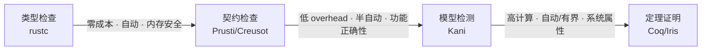
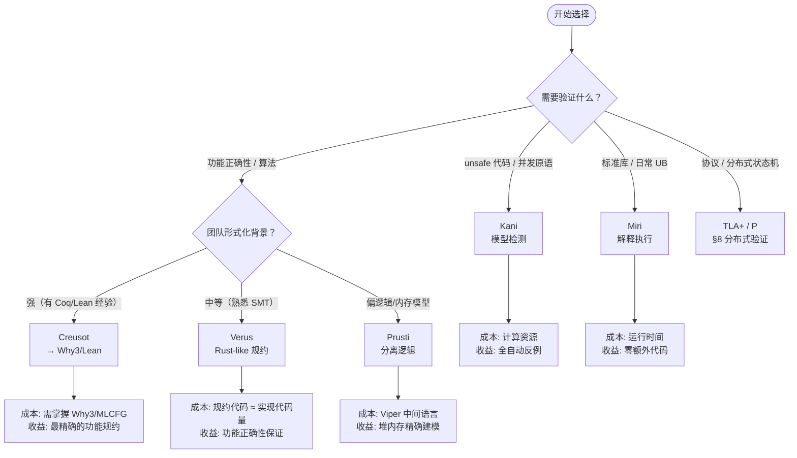
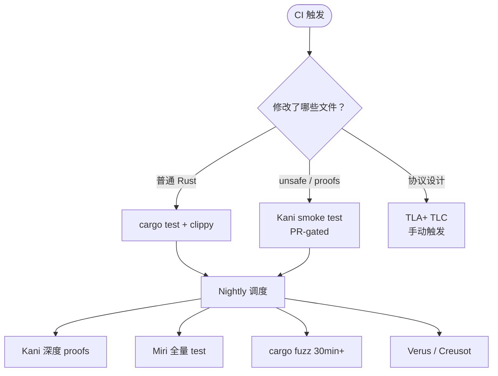
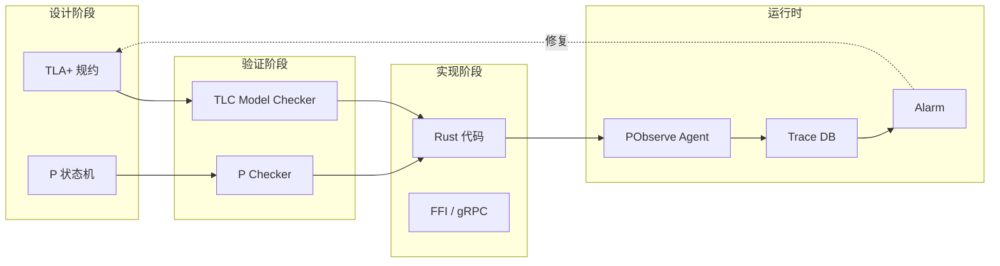
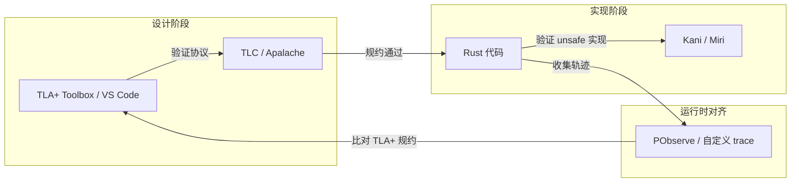
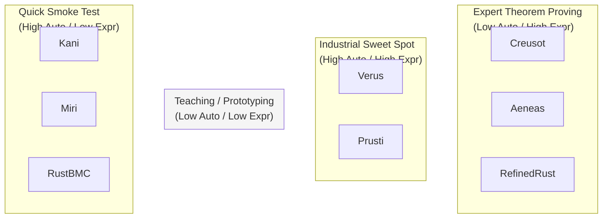
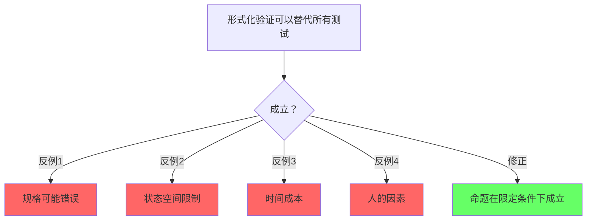
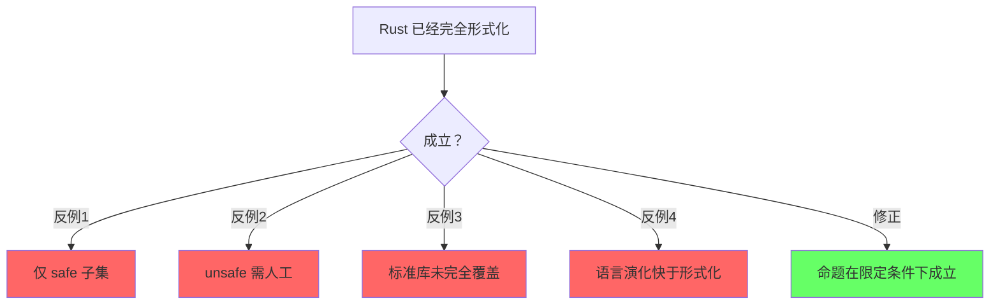
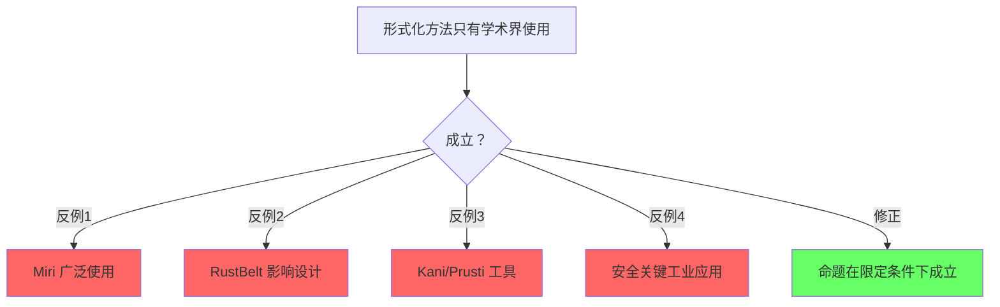

# Formal Methods Industrialization（形式化方法工业化）

> **代码状态**: ✅ 含可编译示例
>
> **EN**: Formal Methods
> **Summary**: Formal Methods. Core Rust concept covering practical examples.
>
> **受众**: [专家]
> **内容分级**: [实验级]
> **层级**: L7 前沿趋势
> **A/S/P 标记**: **P** — Procedure（策略决策）
> **双维定位**: P×Eva — 评估形式化验证的工业 ROI
> **前置概念**: [RustBelt](../../04_formal/02_separation_logic/04_rustbelt.md) · [Ownership Formalization](../../04_formal/01_ownership_logic/03_ownership_formal.md) · [Concurrency](../../03_advanced/00_concurrency/01_concurrency.md) · [Unsafe](../../03_advanced/02_unsafe/03_unsafe.md)
> **主要来源**: [AWS Kani] · [Microsoft Verus] · [TLA+](https://lamport.azurewebsites.net/tla/tla.html) · [P Language] · [POPL](https://www.sigplan.org/Conferences/POPL/) / PLDI 2024-2026 · [Wikipedia](https://en.wikipedia.org/wiki/Main_Page) · [O'Hearn 2007 — Separation Logic] · [Brown University — Interactive Rust Book](https://rust-book.cs.brown.edu/) · [Itanium C++ ABI](https://itanium-cxx-abi.github.io/cxx-abi/abi.html)
> **定理链**: N/A — 描述性/综述性/导航性文档，不涉及形式化定理链
>
---

> **Bloom 层级**: 评价 → 创造
**变更日志**:

- v1.0 (2026-05-12): 初始版本
- v1.1 (2026-05-12): Wave 3 扩展——补充定义、五层模型、工具对比、CI/CD、工业案例、分布式验证
- v1.2 (2026-05-13): 深度重构——新增"从类型系统（Type System）到定理证明的光谱"、新增"类型即证明"系统论述、增强工具链决策树、补全 L3 Unsafe 映射
- v1.3 (2026-05-22): 网络权威内容对齐 Batch 9：补充 KVerus、AutoVerus、Vest、Rustlantis 等 2025–2026 新兴工具到定理一致性（Coherence）矩阵；添加与 concept/04_formal/05_verification_toolchain.md 交叉引用（Reference）

---

> **后置概念**: [Rust Specification](https://www.rust-lang.org/) · [官方路线图](https://github.com/rust-lang/rust/labels/F-roadmap)

## 一、基础定义

### 1.1 形式化验证（Formal Verification）

> **来源**: [Wikipedia — Formal verification](https://en.wikipedia.org/wiki/Formal_verification)

形式化验证是使用形式化数学方法证明或反驳系统（硬件或软件）相对于特定规范或属性的正确性的过程。
与测试（只能证明错误存在）不同，形式化验证可以提供系统无错误的数学保证。
主要技术包括：模型检测（Model Checking）、定理证明（Theorem Proving）、抽象解释（Abstract Interpretation）和符号执行（Symbolic Execution）。

### 1.2 模型检测（Model Checking）

> **来源**: [Wikipedia — Model checking](https://en.wikipedia.org/wiki/Model_checking)

模型检测是一种全自动的形式化验证技术，通过穷举系统所有可能的状态空间来验证时序逻辑属性。
其核心优势是全自动：用户只需提供系统模型和待验证属性，工具自动完成验证或生成反例。
限制在于状态空间爆炸问题——系统状态数随变量数指数增长。
现代模型检测器通过符号模型检测（BDD）、有界模型检测（BMC）和抽象精炼（CEGAR）来缓解。

### 1.3 定理证明（Theorem Proving）
>
>
> **来源**: [Wikipedia — Automated theorem proving](https://en.wikipedia.org/wiki/Automated_theorem_proving)

定理证明是使用计算机程序辅助构造数学证明的过程。
交互式定理证明器（如 Coq、Isabelle/HOL、Lean）需要人类指导证明策略，而全自动定理证明器（如 Z3、CVC5）通过 SMT 决策过程自动求解约束。
在程序验证中，定理证明器用于验证带循环和递归的程序满足前置条件、后置条件和不变式。

---

## 嵌入式测验（Embedded Quiz）

### 测验 1：形式化验证 vs 测试（理解层）

形式化验证与测试的根本区别是什么？

- A. 形式化验证更快
- B. 形式化验证在数学上证明程序对所有输入满足规范，测试只能抽样
- C. 形式化验证不需要规范

<details>
<summary>✅ 答案</summary>

**B. 形式化验证在数学上证明程序对所有输入满足规范，测试只能抽样**。

Dijkstra 名言："测试只能证明错误存在，不能证明错误不存在。"

形式化验证：

- 模型检测：穷举（或有界）状态空间
- 定理证明：从公理推导正确性
- 抽象解释：通过近似分析证明不变量

代价：需要精确的形式化规范，成本高，通常只用于安全关键组件。
</details>

---

### 测验 2：Rust 形式化验证工具分层（应用层）

Miri、Kani、Prusti 分别位于形式化验证光谱的哪个位置？

- A. Miri-动态检测，Kani-模型检测，Prusti-演绎验证
- B. Miri-定理证明，Kani-动态检测，Prusti-模型检测
- C. 三者都是定理证明器

<details>
<summary>✅ 答案</summary>

**A. Miri-动态检测，Kani-模型检测，Prusti-演绎验证**。

形式化方法光谱（从低到高）：

1. **测试 / Miri**：执行具体路径，检测触发的 UB
2. **Kani / Crux**：有界模型检测，覆盖更多路径但受状态空间限制
3. **Prusti / Creusot / Verus**：基于契约的演绎验证，可处理无限状态
4. **Coq / Isabelle**：交互式定理证明，覆盖完整但成本高

RustBelt 属于第 4 层，证明了 Rust 类型系统（Type System）本身的 soundness。
</details>

---

### 测验 3：RustBelt 的证明范围（应用层）

RustBelt 证明了什么？

- A. 所有 Rust 代码（包括任意 unsafe）都是内存安全（Memory Safety）的
- B. Safe Rust 子集是内存安全（Memory Safety）的，且满足契约的 unsafe 代码不破坏该保证
- C. Rust 编译器没有 bug

<details>
<summary>✅ 答案</summary>

**B. Safe Rust 子集是内存安全（Memory Safety）的，且满足契约的 unsafe 代码不破坏该保证**。

RustBelt（POPL 2018）的核心定理：

- Safe Rust 程序不会触发 UB
- Unsafe 代码若满足其声明的 Iris 协议契约，则不破坏 safe 代码的安全保证

不证明：

- 任意 unsafe 代码的安全（仍需人工/Miri/Kani 验证）
- 编译器实现无 bug
- 功能正确性（只证明内存安全（Memory Safety））

</details>

---

### 测验 4：形式化方法的 ROI（分析层）

以下哪个场景最不适合投入形式化验证？

- A. TLS/QUIC 协议实现
- B. 操作系统内核页表管理
- C. 内部管理后台的 CRUD API

<details>
<summary>✅ 答案</summary>

**C. 内部管理后台的 CRUD API**。

形式化验证的 ROI 取决于失败成本：

- **高**：网络协议、密码学、OS 内核、航空电子 → 形式化验证有价值
- **中**：数据库引擎、分布式共识 → 部分关键组件验证
- **低**：内部工具、原型、快速迭代的业务逻辑 → 测试 + 类型系统（Type System）足够

AWS s2n-quic 是典型案例：核心状态机用 Kani 验证，业务逻辑用测试覆盖。
</details>

---

### 测验 5："类型即证明"（评价层）

Rust 的 `NonZeroI32` 如何体现"类型即证明"？

- A. 运行时（Runtime）检查值非零
- B. 类型构造器要求值非零，编译期保证后续使用时无需检查
- C. 它只是一个别名，没有额外保证

<details>
<summary>✅ 答案</summary>

**B. 类型构造器要求值非零，编译期保证后续使用时无需检查**。

`NonZeroI32::new(n)` 返回 `Option<NonZeroI32>`：

- 若 `n == 0`，返回 `None`
- 若 `n != 0`，返回 `Some(NonZeroI32)`

一旦获得 `NonZeroI32`，编译器就"知道"它非零，因此 `divisor: NonZeroI32` 的除法无需运行时（Runtime）检查。

这是**轻量级形式化**在 Rust 中的日常应用：将不变量编码到类型中，让编译器自动证明。
</details>

---

## 认知路径（Cognitive Path）

> **学习递进**: 从直觉出发，逐层深入核心概念。

### 第 1 步：什么是形式化方法？

用数学方法严格证明程序正确性

### 第 2 步：为什么 Rust 需要形式化方法？

unsafe 边界 / 并发正确性 / 安全关键系统

### 第 3 步：Rust 已有的形式化成果？

RustBelt / Iris / Stacked Borrows / Miri

### 第 4 步：形式化方法的实际局限？

规格编写困难 / 状态空间爆炸 / 时间成本

### 第 5 步：轻量级形式化在 Rust 中的应用？

类型即证明 / 契约编程 / 模糊测试

### 第 6 步：未来：形式化方法的普及路径？

自动化工具 / 教育 / 工业标准采纳

---

## 二、五层扩展模型

五层扩展模型将 Rust 的形式化保证从编译器原生层级向上延伸至系统级运行时（Runtime）验证：

```text
L0: Rust 编译器     → 所有权/生命周期/并发  ✅ 原生完成
L1: Code-Level      → 功能正确性            🚧 Creusot/Verus/Kani
L2: Interface-Level → 契约/版本代数          🚧 Filament/Schema Lattice
L3: Protocol-Level  → 状态机/一致性          🚧 TLA+/P
L4: System-Level    → 故障模型/容错          🚧 CALM/FizzBee
L5: Runtime-Level   → 轨迹比对/持续验证       🚧 PObserve/MongoDB Trace
```

### 2.1 L0：Rust 编译器（原生层）
>

Rust 编译器已通过 borrow checker 和类型系统（Type System）提供内存安全（Memory Safety）、线程安全和无数据竞争的保证。这是所有上层验证的基础平台。

### 2.2 L1：Code-Level（代码级验证）
>

验证单个函数或模块（Module）的功能正确性：

- **前置/后置条件**：函数输入满足某条件时，输出必满足某条件
- **循环不变式**：循环每次迭代保持的断言
- **终止性**：递归和循环最终结束
- **工具**：Kani（模型检测）、Creusot（Why3）、Verus（SMT）、Prusti（Viper）

### 2.3 L2：Interface-Level（接口级验证）

验证组件间交互的契约：

- **类型状态**：将协议状态编码到类型中（如 `OpenFile` vs `ClosedFile`）
- **版本代数**：API 演化的数学模型，保证向后兼容
- **工具**：Filament（时序接口）、Schema Registry（Protobuf/Avro 契约）

### 2.4 L3：Protocol-Level（协议级验证）

验证分布式协议和并发算法的正确性：

- **安全属性（Safety）**："坏事永不发生"——无死锁、无数据竞争、一致性（Coherence）
- **活性属性（Liveness）**："好事终将发生"——请求最终得到响应
- **工具**：TLA+（时序逻辑）、P Language（状态机）、Spin/Promela

### 2.5 L4：System-Level（系统级验证）

验证在故障模型下的系统行为：

- **拜占庭容错**：部分节点恶意或故障时的系统安全性
- **CALM 定理**：哪些一致性（Coherence）属性可以在无协调的情况下实现
- **工具**：FizzBee、Ivy、DistAlgo

### 2.6 L5：Runtime-Level（运行时验证）

生产环境中持续验证实际行为与规约一致：

- **轨迹收集**：记录系统运行时（Runtime）的关键事件序列
- **在线监控**：实时检查轨迹是否违反时序逻辑属性
- **工具**：PObserve、MongoDB Trace、Dtrace/BPF

> **层次一致性（Coherence）标注**: L0 对应本文 §4「类型即证明」的编译期保证；L1-L2 对应 §5 工具链的代码级验证；L3-L5 对应 §8 分布式验证与运行时（Runtime）监控。L4 理论基础详见 [`../04_formal/04_rustbelt.md`](../../04_formal/02_separation_logic/04_rustbelt.md)。

---

## 三、从类型系统到定理证明的光谱
>

形式化验证并非单一技术，而是一个从「零成本编译期检查」到「高成本交互式证明」的连续光谱。Rust 的独特之处在于：它的类型系统（Type System）已经占据了光谱最左端，为更重的验证工具提供了无需重复证明的坚实根基。

```text
类型检查 ──→ 契约检查 ──→ 模型检测 ──→ 定理证明
(编译器)    (Prusti)      (Kani)       (Coq/Iris)
零成本      低 overhead    高计算成本    极高人工成本
自动        半自动        自动/有界     交互式
内存安全    功能正确性    系统属性      任意数学命题
```



> **认知功能**: 将形式化验证的连续光谱可视化，帮助读者建立「成本-能力」权衡的直觉框架。建议结合具体项目阶段，从左向右渐进引入验证深度，避免一上来就追求定理证明。关键洞察：Rust 编译器已经免费提供了光谱最左端的保证，这是其他语言不具备的起点优势。
> [来源: [Kani Docs]]
>

### 3.1 阶段一：类型检查（Type Checking）

| 维度 | 说明 |
|:---|:---|
| **执行者** | Rust 编译器 (`rustc`) |
| **成本** | 零运行时（Runtime）成本，编译期完成 |
| **自动化** | 全自动，无需人工标注 |
| **保证范围** | 内存安全（Memory Safety）、线程安全、无数据竞争 |
| **局限性** | 不保证功能正确性、不捕获逻辑错误 |
| **典型工具** | `cargo check`、`cargo clippy` |

Rust 的借用（Borrowing）检查器在类型检查阶段就排除了整类运行时错误（use-after-free、double-free、数据竞争），这是其他系统语言需要额外工具才能实现的。

### 3.2 阶段二：契约检查（Contract Checking）

| 维度 | 说明 |
|:---|:---|
| **执行者** | Prusti、Creusot、静态分析器 |
| **成本** | 低 overhead，需前置/后置条件标注 |
| **自动化** | 半自动，需编写规约 |
| **保证范围** | 功能正确性、内存精确建模 |
| **局限性** | 标注负担、并发支持有限 |
| **典型工具** | Prusti（Viper 后端）、Creusot（Why3） |

契约检查在类型系统（Type System）之上增加逻辑断言，通过分离逻辑或最弱前置条件计算验证函数行为。

### 3.3 阶段三：模型检测（Model Checking）

| 维度 | 说明 |
|:---|:---|
| **执行者** | Kani、CBMC |
| **成本** | 高计算成本，可能状态空间爆炸 |
| **自动化** | 全自动/有界验证，无需完整规约 |
| **保证范围** | 系统属性、并发行为、unsafe 边界 |
| **局限性** | 受限于状态空间大小、循环需展开 |
| **典型工具** | Kani、`#[kani::proof]` |

模型检测通过穷举（或符号化地覆盖）所有可能输入来验证属性，适合验证 unsafe 代码和并发原语。

### 3.4 阶段四：定理证明（Theorem Proving）

| 维度 | 说明 |
|:---|:---|
| **执行者** | Coq、Iris、Lean |
| **成本** | 极高人工成本，需专家编写证明 |
| **自动化** | 交互式，机器辅助但需人类指导 |
| **保证范围** | 任意数学命题、语言语义、协议正确性 |
| **局限性** | 规模受限、需要深厚形式化背景 |
| **典型工具** | RustBelt/Iris、Aeneas → Lean |

定理证明用于建立语言本身的元理论（如 RustBelt 证明 safe 子集的安全性）或验证最关键的核心算法。

> **谱系关系**: 从左到右，表达能力单调递增，成本也单调递增。Rust 的工业实践通常采用「左端免费 + 右端按需」的组合策略：编译器覆盖日常开发，Kani 覆盖安全关键模块（Module），定理证明仅用于语言核心或极关键基础设施。

---

## 四、Rust 的独特优势：类型即证明
>

Rust 的类型系统不仅是工程约束，更是一套**嵌入式分离逻辑（Embedded Separation Logic）**。编译器在类型检查的同时，实际上在自动构造一个关于内存和资源管理的逻辑证明。

### 4.1 所有权 = 分离合取 `P * Q`

分离逻辑（Separation Logic, O'Hearn 2007）的核心是分离合取 `P * Q`，断言两个资源不相交。Rust 的所有权（Ownership）系统天然对应这一结构：

- `let x = Box::new(5)` 在逻辑上意味着 `∃l. l ↦ 5`（存在某个地址 `l`，独占存储值 `5`）
- 当 `x` 被 move 到 `y` 后，`x` 不再持有该资源，符合分离逻辑的资源转移规则
- 两个独立的 `Box` 值对应 `l₁ ↦ v₁ * l₂ ↦ v₂`，编译器保证它们不重叠

### 4.2 借用作为权限模型

Rust 的引用（Reference）类型直接对应分离逻辑中的权限（permissions）：

| Rust 类型 | 分离逻辑表示 | 语义 |
|:---|:---|:---|
| `Box<T>` / owned `T` | `l ↦ v` | 独占的 points-to 断言 |
| `&mut T` | `l ↦ v` | 独占访问权限（可写） |
| `&T` | `□(l ↦ v)` | 共享、持久权限（只读，Borrows as Fractional Permissions） |
| 生命周期（Lifetimes）结束 | 资源回收 / 权限消失 | 自动析构对应逻辑上的 `emp` |

### 4.3 借用检查器 = 自动分离逻辑证明

借用（Borrowing）检查器的每一次成功编译，都在自动证明以下命题：

1. **无 use-after-free**: 当资源被 move 或 drop 后，没有任何活跃引用（Reference）指向它
2. **无数据竞争**: `&mut T` 的独占性保证了同一时刻至多一个写者；`&T` 的持久性允许多个读者共存
3. **无 double-free**: 所有权（Ownership）唯一性保证每个资源只被释放一次

这些性质在 C/C++ 中需要专门的静态分析器（如 Infer、Facebook 的 RacerD）或运行时检测（如 ThreadSanitizer）才能部分捕获；而在 Rust 中，它们是**类型系统的定理**。

### 4.4 编译器证明了什么，没有证明什么

```rust
// 类型: Box<i32>
// 逻辑: ∃l. l ↦ 5  （存在某个地址 l，存储值 5）
let mut x = Box::new(5);

// 类型: &mut i32
// 逻辑: l ↦ 5  （独占访问权限）
let r = &mut *x;
*r += 1;

// 类型: &i32
// 逻辑: □(l ↦ 6)  （共享、持久权限）
// 编译通过：r 最后一次使用已结束，s 获得共享权限
let s = &*x;
println!("{}", s);
```

然而，类型系统（Type System）**不保证功能正确性**：

```rust
fn add(a: i32, b: i32) -> i32 {
    a - b  // 编译通过！类型正确，但逻辑错误
}
```

类型系统保证「程序不崩溃」，但不保证「程序计算正确结果」。填补这一 gap 正是 L1 验证工具（Prusti、Creusot、Verus）的使命。

### 4.5 剩余工作：从内存安全到功能正确性

| 已证明（编译器） | 待证明（需外部工具） |
|:---|:---|
| 无 use-after-free | 函数满足数学规格 |
| 无数据竞争 | 循环不变式保持 |
| 无空指针解引用（Reference） | 算法终止性 |
| 类型一致性（Coherence） | 并发协议活性（Liveness） |

> **权威引用（Reference）**: RustBelt（Jung et al., POPL 2018）在 Iris 框架中形式化了 Rust 的核心语义，证明了 safe 子集的内存安全（Memory Safety）和线程安全。Prusti 将 Viper 分离逻辑后端直接应用于 Rust 代码，实现了类型系统到逻辑命题的自动翻译。

---

## 五、形式化验证工具链

> **衔接说明**: §4 论述了 Rust 编译器在光谱左端提供的「免费」保证；本节覆盖光谱右端的工业验证工具，帮助开发者根据项目阶段和需求做出选择。

### 5.1 工具全景表

| 工具 | 方法 | 自动化 | 成本 | 工业案例 | 学习曲线 |
|:---|:---|:---|:---|:---|:---|
| **Miri** | 解释执行 | 全自动 | 运行慢（10-100x） | Rust 编译器团队日常 UB 检测 | 低 |
| **Kani** | 模型检测 + 符号执行 | 半自动（需 harness） | 内存爆炸风险 | AWS s2n-quic、Firecracker、Libcrypto | 中 |
| **Prusti** | 分离逻辑（Viper） | 半自动（需契约标注） | 高标注负担 | ETH Zurich 研究项目 | 高 |
| **Creusot** | 函数式翻译 → Why3 | 半自动（需规约） | 高证明负担 | INRIA 研究项目（安全关键算法） | 高 |
| **Verus** | SMT (Z3) + 线性幽灵类型 | 半自动（需 spec/proof） | 中等（Rust-like 语法） | Microsoft IronRDP、vRDMA、GhostCell | 中高 |

### 5.2 决策树：我应该用哪个验证工具？



> **认知功能**: 将复杂的工具选型问题转化为可操作的决策路径，降低形式化工具的选择门槛。建议从团队实际验证目标出发，而非从工具热度出发；unsafe 边界和功能正确性对应完全不同的工具链。关键洞察：没有「最好」的工具，只有「最适合当前约束」的工具组合。

### 5.3 技术细节与定位

**Miri**：

- 基于 Stacked Borrows / Tree Borrows 模型解释执行 Rust MIR
- 检测未定义行为（UB）：悬垂指针、数据竞争、类型混淆、未初始化内存读取
- `cargo miri test` 已成为 Rust unsafe 代码开发的标准实践
- **定位**: 光谱最左端的「日常工具」，零额外代码，高运行时成本

**Kani**：

- 基于 CBMC 的 Rust 前端，将 MIR 翻译为 GOTO 程序，用 SAT/SMT 求解
- 支持 `kani::any()` 生成非确定值进行符号执行
- AWS 用于验证 s2n-quic、Firecracker 等生产组件
- **定位**: 快速验证 unsafe 代码和系统属性的「工业甜点」

**Creusot**：

- 将 Rust 程序翻译为 Why3 的 MLCFG（中间语言）
- 使用 Dijkstra 最弱前置条件计算验证条件
- 支持 Rust 的泛型（Generics）、Trait、生命周期（Lifetimes），通过 "prophecies" 处理可变借用（Mutable Borrow）
- **定位**: 需要精确功能正确性的安全关键代码

**Verus**：

- 专为系统软件设计的验证工具，规约直接写在 Rust 代码中
- 使用 `#[verifier::spec]`、`#[verifier::proof]` 标记规约与证明
- 使用 Z3 SMT 求解器，支持量词、位向量、序列理论
- Microsoft 用于验证 IronRDP、vRDMA 等组件
- **定位**: 系统代码（OS、网络栈）、并发数据结构

**Prusti**：

- 基于 Viper 验证基础设施，使用分离逻辑精确建模堆内存
- 支持 fractional permissions 和 read-only borrows
- 将 Rust 类型直接翻译为分离逻辑断言
- **定位**: 分离逻辑研究、内存精确建模、教学演示

### 5.4 RefinedRust：自动化分离逻辑推导
>
>
> **来源**: [RefinedRust — PLDI 2024](https://pldi24.sigplan.org/) · [MPI-SWS]

RefinedRust 是 MPI-SWS 开发的自动化 Rust 验证工具，核心创新是将 Rust 类型系统自动翻译为**分离逻辑（Separation Logic）**断言，无需人工编写规约：

**工作流程**：

```text
Rust 源码 → 类型检查 → 自动分离逻辑翻译 → Iris 证明义务 → Coq 自动证明
```

**关键特性**：

- **零标注验证**：利用 Rust 已有的类型信息（所有权（Ownership）、生命周期（Lifetimes）、借用（Borrowing））自动生成分离逻辑前置/后置条件
- **内存模型对齐**：基于 RustBelt 的 Iris 内存模型，精确处理 `&mut`、`&`、Box、Rc 等类型
- **模块（Module）化证明**：每个函数的证明独立于实现细节，只依赖其类型签名
- **不安全代码支持**：对 `unsafe` 块，RefinedRust 允许程序员提供轻量级契约，工具自动验证其与周围 safe 代码的交互

**示例**：以下函数无需任何额外标注即可自动验证内存安全：

```rust
fn swap<T>(x: &mut T, y: &mut T) {
    // RefinedRust 自动推导:
    // 前置: x ↦ ?v1 ∗ y ↦ ?v2
    // 后置: x ↦ ?v2 ∗ y ↦ ?v1
    let tmp = std::mem::replace(x, std::mem::replace(y, unsafe { std::ptr::read(x) }));
    unsafe { std::ptr::write(y, tmp); }
}
```

**局限性**：目前仅支持 Rust 子集（无泛型（Generics） trait、无 async、无递归类型），处于研究原型阶段。

> **层次一致性（Coherence）标注**: L1 Code-Level 验证工具（Kani、Creusot、Verus、Prusti、RefinedRust）直接作用于源代码；L3 Unsafe 边界验证详见 [`../03_advanced/02_unsafe/03_unsafe.md`](../../03_advanced/02_unsafe/03_unsafe.md)；L4 理论基础（RustBelt/Iris）详见 [`../04_formal/04_rustbelt.md`](../../04_formal/02_separation_logic/04_rustbelt.md)。

---

## 六、CI/CD 集成方案

### 6.1 GitHub Actions 集成

```yaml
# .github/workflows/formal-verification.yml
name: Formal Verification

on: [push, pull_request]

jobs:
  kani:
    runs-on: ubuntu-latest
    steps:
      - uses: actions/checkout@v4
      - name: Setup Kani
        uses: model-checking/kani-github-action@v1
        with:
          args: "--workspace"
      - name: Run Kani proofs
        run: cargo kani

  creusot:
    runs-on: ubuntu-latest
    steps:
      - uses: actions/checkout@v4
      - name: Setup Creusot
        run: cargo install creusot
      - name: Verify with Creusot
        run: cargo creusot --span-mode=absolute

  verus:
    runs-on: ubuntu-latest
    steps:
      - uses: actions/checkout@v4
      - name: Setup Verus
        run: git clone https://github.com/verus-lang/verus && cd verus && ./build.sh
      - name: Verify with Verus
        run: ./verus/source/target-verus/release/verus src/lib.rs
```

### 6.2 Pre-commit Hooks

使用 [pre-commit](https://pre-commit.com) 在提交前运行轻量级验证：

```yaml
# .pre-commit-config.yaml
repos:
  - repo: local
    hooks:
      - id: kani-smoke
        name: Kani Smoke Test
        entry: cargo kani --harness smoke_test
        language: system
        pass_filenames: false
        files: \.rs$

      - id: mirifast
        name: Miri Fast Check
        entry: cargo +nightly miri test --lib
        language: system
        pass_filenames: false
        files: \.rs$
```

### 6.3 分层验证策略

```text
快速反馈环（< 1分钟）: cargo check + cargo clippy + rustfmt
编译期保证（< 5分钟）: cargo test + cargo miri test
功能验证（< 30分钟）: Kani proofs（关键 unsafe 函数）
深度验证（nightly）: Creusot/Verus（核心算法）
协议验证（设计期）: TLA+ / P（分布式组件）
```

### 6.4 Kani 在 AWS 的流水线实践

AWS 将 Kani 深度集成到核心服务的 CI/CD 流水线中，形成可复制的形式化验证工作流：

**AWS s2n-quic 的 Kani 流水线**：

```yaml
# buildspec.formal.yml (AWS CodePipeline)
version: 0.2

phases:
  install:
    runtime-versions:
      rust: 1.78
    commands:
      - cargo install kani-verifier
      - cargo kani --version
  build:
    commands:
      - cargo build --release
  post_build:
    commands:
      - cargo kani --workspace --only-hash-check
      - |
        # 分层运行 proofs：快速 smoke → 深度验证
        cargo kani --harness smoke_test_* --timeout 60
        cargo kani --harness safety_critical_* --timeout 1800
      - |
        # 生成覆盖率报告
        cargo kani --coverage --output-format lcov
        aws s3 cp kani_coverage.lcov s3://ci-artifacts/
artifacts:
  files:
    - kani_results/**/*
```

**关键实践**：

| 实践 | 说明 |
|:---|:---|
| Harness 命名约定 | `smoke_test_*`（< 60s）、`safety_critical_*`（< 30min）、`protocol_*`（有界模型检测）|
| 增量验证 | 只验证变更 crate 及其反向依赖的 proofs |
| 超时分层 | 快速 proofs 在 PR 时运行，深度 proofs 在 nightly 运行 |
| 覆盖率追踪 | Kani 生成的覆盖报告与代码覆盖率工具集成 |

### 6.5 Miri 在 Crater 中的回归检测

Rust 编译器团队使用 [Crater](https://github.com/rust-lang/crater) 在每次 rustc 合并前运行大规模回归测试。Miri 被集成到 Crater 的一个专用通道中：

**Miri Crater 工作流**：

```text
1. rustc PR 提交
2. Crater 构建 Top 1000 crates
3. 对包含 unsafe 的 crate 自动运行 cargo miri test
4. 对比基线 Miri 结果与新编译器的结果
5. 报告新增的 UB 检测或 Miri 内部错误
```

**检测案例**：

- **2024-03**：Crater 检测到某 PR 改变了 `Box` 的内部布局，导致 `miri` 在 `tokio` 中报告新的 use-after-free。问题在合并前被修复。
- **2024-08**：Miri Crater 发现 `std::sync::atomic` 的某文档示例在新编译器下违反 Stacked Borrows，触发文档修复。

**配置**：

```toml
# crater 配置中的 Miri 通道
[crates]
top = 1000
filter = "has-unsafe"

[tools.miri]
command = "cargo +nightly miri test"
timeout = 600
env = { MIRIFLAGS = "-Zmiri-strict-provenance -Zmiri-symbolic-alignment-check" }
```

> **来源**: [Rust Compiler Team Triage](https://blog.rust-lang.org/inside-rust/) · [Crater Docs](https://github.com/rust-lang/crater/tree/master/docs)

### 6.6 Miri 在项目级 CI 中的配置

`cargo miri test` 不仅用于 Rust 编译器团队的 Crater 回归检测，也应成为含 `unsafe` 代码的 Rust 项目标准 CI 步骤：

```yaml
# .github/workflows/miri.yml
name: Miri UB Detection

on:
  push:
    branches: [main]
  pull_request:
    branches: [main]
  schedule:
    - cron: '0 2 * * *'  # nightly at 2am

jobs:
  miri:
    runs-on: ubuntu-latest
    steps:
      - uses: actions/checkout@v4
      - name: Install Miri
        run: |
          rustup toolchain install nightly --component miri
          rustup override set nightly
          cargo miri setup
      - name: Run Miri tests
        run: cargo miri test
        env:
          MIRIFLAGS: "-Zmiri-strict-provenance -Zmiri-symbolic-alignment-check"
      - name: Run Miri doctests
        run: cargo miri test --doc
```

**配置要点**：

| 配置项 | 推荐值 | 说明 |
|:---|:---|:---|
| `MIRIFLAGS` | `-Zmiri-strict-provenance` | 启用严格来源检查，捕获更多 UB |
| `MIRIFLAGS` | `-Zmiri-symbolic-alignment-check` | 符号化对齐检查 |
| 触发条件 | `push` + `pull_request` + `schedule` | PR 时快速检测 + nightly 全量检测 |
| 超时设置 | `timeout-minutes: 60` | Miri 解释执行比原生慢 10-100 倍 |

> **来源**: [Miri README](https://github.com/rust-lang/miri) · [GitHub Actions Docs](https://docs.github.com/en/actions)

### 6.7 `cargo fuzz` 与持续模糊测试

模糊测试（Fuzzing）通过自动生成畸形输入发现 panic、内存安全漏洞和逻辑错误。`cargo-fuzz` 基于 `libFuzzer`，与 Rust 无缝集成：

**`cargo fuzz` 初始化与运行**：

```bash
# 安装 cargo-fuzz
cargo install cargo-fuzz

# 初始化 fuzz 目标
cargo fuzz init

# 编写 fuzz target: fuzz/fuzz_targets/parser.rs
# ```rust
# #![no_main]
# use libfuzzer_sys::fuzz_target;
#
# fuzz_target!(|data: &[u8]| {
#     let _ = my_crate::parse(data);
# });
# ```

# 运行 fuzz（默认无限循环，需配合 timeout）
cargo fuzz run parser
```

**GitHub Actions 持续模糊测试配置**：

```yaml
# .github/workflows/fuzz.yml
name: Continuous Fuzzing

on:
  schedule:
    - cron: '0 0 * * 0'  # weekly
  workflow_dispatch:

jobs:
  fuzz:
    runs-on: ubuntu-latest
    steps:
      - uses: actions/checkout@v4
      - name: Install cargo-fuzz
        run: cargo install cargo-fuzz
      - name: Build fuzz targets
        run: cargo fuzz build
      - name: Run fuzz targets (timed)
        run: |
          for target in $(cargo fuzz list); do
            echo "Fuzzing target: $target"
            timeout 600 cargo fuzz run "$target" || true
          done
      - name: Upload corpus crashes
        if: failure()
        uses: actions/upload-artifact@v4
        with:
          name: fuzz-crashes
          path: fuzz/artifacts/
```

**模糊测试与形式化验证的关系**：

| 方法 | 保证性质 | 成本 | 适用场景 |
|:---|:---|:---|:---|
| **Fuzzing** | 概率性发现错误（无数学保证） | 低（全自动） | 输入解析器、协议解码器 |
| **Kani** | 有界 exhaustive（有界保证） | 中（计算资源） | unsafe 代码、状态机 |
| **Verus** | 完整功能正确性（假设规格正确） | 高（人工规约） | 核心算法 |
| **TLA+** | 协议级 Safety/Liveness | 中（协议建模） | 分布式设计 |

> **最佳实践**：对解析器和 FFI 边界使用 `cargo fuzz` 进行持续模糊测试；对发现的问题用 Kani 构造最小反例验证修复。 [来源: cargo-fuzz docs; Rust Fuzz Book]

### 6.8 形式化验证的 CI 成本与触发策略

形式化验证工具的计算成本差异显著，CI 集成必须采用**分层触发策略**以平衡验证深度与反馈速度：

| 工具/阶段 | 典型耗时 | 资源需求 | 推荐触发策略 | 是否 PR-gated | Bloom 层级 |
|:---|:---|:---|:---|:---:|:---|
| `cargo check` + `clippy` | < 1 min | 1 vCPU / 2GB | PR + push | ✅ | 应用 |
| `cargo test` | 1-5 min | 1 vCPU / 2GB | PR + push | ✅ | 应用 |
| `cargo miri test`（lib） | 10-30 min | 1 vCPU / 4GB | PR（若修改 unsafe）+ nightly | ⚠️ | 分析 |
| `cargo miri test`（全量） | 30-120 min | 1 vCPU / 4GB | Nightly | ❌ | 分析 |
| `cargo kani`（smoke） | 1-5 min | 2 vCPU / 4GB | PR（若修改 proofs） | ⚠️ | 分析 |
| `cargo kani`（深度） | 10-60 min | 4 vCPU / 16GB | Nightly | ❌ | 分析 |
| `cargo fuzz` | 1-24 h | 4+ vCPU / 8GB | Weekly / Nightly | ❌ | 应用 |
| `cargo creusot` | 30-120 min | 2 vCPU / 4GB | Nightly / On-demand | ❌ | 评价 |
| `verus` | 10-60 min | 4 vCPU / 8GB | Nightly / On-demand | ❌ | 评价 |

**触发策略决策树**：



> **认知功能**: 将 CI 成本与验证深度的矛盾显式建模，帮助团队在反馈速度和验证覆盖之间做理性取舍。建议 PR 阶段只运行轻量验证，深度证明留给 nightly，避免阻塞开发流程。关键洞察：形式化验证的工业落地瓶颈往往不是技术，而是「不阻塞流水线」的工程策略。

**成本优化策略**：

1. **增量验证**：只运行受影响 crate 的 proofs（Kani、Verus 支持 crate 级过滤）
2. **超时分层**：smoke proofs 超时 60s，深度 proofs 超时 30min
3. **缓存**：Kani 的 CBMC 中间表示可缓存，减少重复翻译开销
4. **nightly 异步（Async）**：深度验证失败不阻塞 PR 合并，但需在 24h 内修复
5. **自托管 Runner**：Kani/Verus 需要大内存，GitHub 免费 runner（7GB）可能不足，建议使用自托管 runner

> **来源**:
> [Kani CI Best Practices](https://model-checking.github.io/kani/install-github-ci.html) ·
> [GitHub Actions Pricing](https://docs.github.com/en/billing/managing-billing-for-github-actions) ·
> [AWS CodePipeline Docs]

---

## 七、工业案例研究

### 7.1 AWS Kani
>
>
> **来源**: [AWS Kani Blog](https://model-checking.github.io/kani/) · [s2n-quic verification]

AWS 将 Kani 集成到多个核心项目的开发流程中：

- **s2n-quic**：验证 TLS 状态机、数据包解析、拥塞控制算法的安全属性
- **Firecracker microVM**：验证内存安全边界和虚拟设备模拟的正确性
- **AWS Libcrypto**：验证加密原语的常量时间属性和内存安全
- **规模**：数百个 `#[kani::proof]` 函数，nightly CI 运行

### 7.2 Microsoft Verus
>
>
> **来源**: [Microsoft Verus Blog](https://github.com/verus-lang/verus/guide/) · [IronRDP]

Microsoft Research 的 Verus 项目致力于让系统软件验证更加实用：

- **IronRDP**：经验证的 RDP（远程桌面协议）实现，关键解析函数附带功能正确性证明
- **vRDMA**：虚拟 RDMA 设备的验证，确保网络协议状态机正确
- **GhostCell**：经验证的单线程无锁数据结构，使用 Verus 证明其安全性和功能正确性
- **方法**：规约与实现同文件，开发者逐步添加 `proof fn` 而不重构代码

### 7.3 Linux Kernel Verification
>
>
> **来源**: [Linux Kernel Rust] · [Rust for Linux]

随着 Rust 进入 Linux 内核（自 6.1 起），形式化验证开始关注内核场景：

- **Kani for Drivers**：验证 Rust 驱动的 `probe`/`remove` 回调不触发内存错误
- **Miri for Kernel**：在模拟的内核内存模型下检测 UB
- **长期目标**：对关键内核抽象（如 `Mutex`、`SpinLock`）提供形式化保证
- **挑战**：内核的异步（Async）中断、内存布局约束、FFI 边界增加了验证复杂度

---

## 八、TLA+ / P 语言 / PObserve 的分布式验证

### 8.1 TLA+（时序逻辑动作）
>
>
> **来源**: [TLA+ Home Page](https://lamport.azurewebsites.net/tla/tla.html) · [AWS TLA+ Case Studies]

TLA+ 由 Leslie Lamport 开发，是工业界验证分布式算法的事实标准：

- **PlusCal**：类伪代码的算法描述语言，自动翻译为 TLA+
- **TLC Model Checker**：穷举状态空间，验证 Safety 和 Liveness
- **工业应用**：AWS S3 强一致性（Coherence）、DynamoDB 事务、Kafka 协议、Azure Cosmos DB 都使用 TLA+ 验证核心算法
- **与 Rust 结合**：用 TLA+ 验证分布式协议设计，Rust 实现协议；运行时通过 trace-checking 对齐

### 8.2 P 语言（状态机编程语言）
>
> **来源**: [P Language](https://p-org.github.io/P/) · [AWS PObseve]

P 是微软和 AWS 合作开发的事件驱动状态机语言：

- **编程模型**：将系统建模为状态机，通过事件触发状态转移
- **模块（Module）组合**：支持状态机的层次化组合，适合微服务架构
- **P Checker**：系统地探索状态空间，检测死锁、状态不可达和断言失败
- **Rust 后端**：P 编译器可生成 Rust 实现骨架，保持规约与实现的一致性

### 8.3 PObserve（运行时对齐）
>
> **来源**: [PObserve: Bridging the Gap]

PObserve 解决"验证的规约 vs 运行的实现"之间的鸿沟：

- **轨迹收集**：在 Rust 程序中插入探针，记录关键事件
- **规约匹配**：将运行时轨迹与 P/TLA+ 规约进行在线比对
- **偏差告警**：当实际行为偏离已验证的规约时立即告警
- **意义**：形式化验证只在设计时保证正确性；PObserve 将保证延伸到生产环境

### 8.4 分布式验证工作流



> **认知功能**: 将「设计-验证-实现-监控」的闭环流程可视化，弥合形式化规约与生产运行之间的鸿沟。建议在每个阶段设置明确的对齐检查点，尤其是 PObserve 的运行时轨迹比对。关键洞察：形式化验证的价值不仅在于设计阶段发现 bug，更在于运行时持续保证「实现没有偏离规约」。

### 8.5 TLA+ 规约示例：Rust 并发协议的形式化规约

> **来源**: [TLA+ Spec](https://lamport.azurewebsites.net/tla/tla.html) · [Specifying Systems, Lamport 2002](https://lamport.azurewebsites.net/tla/book.html) · [TLA+ Examples](https://github.com/tlaplus/Examples)

#### 8.5.1 TLA+ 核心语法体系

TLA+（Temporal Logic of Actions）由 Leslie Lamport 设计，其规约由**状态变量**、**初始化谓词**、**下一步动作**和**时序公式**四层结构组成：

| 要素 | 语法/记法 | 语义 | 在规约中的角色 |
|:---|:---|:---|:---|
| **状态变量（Variables）** | `VARIABLES v1, v2` | 描述系统全局状态 | 状态函数的载体 |
| **初始化（Init）** | `Init == ...` | 系统初始状态谓词 | 规约起点 |
| **动作（Action）** | `A == /\ P /\ v' = e` | 描述状态转移的谓词，`v'` 表示下一状态值 | 状态机边 |
| **下一步（Next）** | `Next == A \/ B` | 所有可能动作的析取 | 状态机转移关系 |
| **规约（Spec）** | `Spec == Init /\ [][Next]_vars` | 完整系统行为：初始满足 Init，且每步满足 Next 或 stuttering | 完整时序逻辑公式 |
| **不变式（Invariant）** | `Inv == ...` | 所有可达状态必须满足的性质 | Safety 属性 |
| **时序算子** | `[]P`（总是）、`<>P`（最终）、`P ~> Q`（导致） | 描述跨状态的时序属性 | Liveness 属性 |
| **动作公式** | `[A]_v` / `<A>_v` | A 发生或 v 不变（stuttering）/ A 发生且 v 变化 | 允许或禁止 stuttering |

> **[来源: Specifying Systems, Lamport 2002; TLA+ Video Course]** TLA+ 的数学基础是 ZF 集合论 + 线性时序逻辑。`[Next]_vars` 的 stuttering 不变性（stuttering invariance）是 TLA+ 支持层次化规约和实现精化的关键——规约不限制系统"什么都不做"的次数，从而允许不同抽象层级的规约相互精化。

#### 8.5.2 示例一：Rust `mpsc::channel` 的 TLA+ 规约

以下展示如何用 TLA+ 规约一个 Rust 并发通道（Channel）的协议：

**PlusCal 算法描述**（Rust `mpsc::channel` 的简化模型）：

```tla
------------------------------ MODULE RustChannel ------------------------------
EXTENDS Naturals, Sequences, FiniteSets

CONSTANTS Values, MaxBuffer

VARIABLES buffer, closed, senders, receivers

TypeInvariant ==
  /\ buffer \in Seq(Values)
  /\ Len(buffer) <= MaxBuffer
  /\ closed \in {TRUE, FALSE}
  /\ senders \in Nat
  /\ receivers \in Nat

Init ==
  /\ buffer = <<>>
  /\ closed = FALSE
  /\ senders = 1
  /\ receivers = 1

Send(v) ==
  /\ ~closed
  /\ Len(buffer) < MaxBuffer
  /\ buffer' = Append(buffer, v)
  /\ UNCHANGED <<closed, senders, receivers>>

Recv ==
  /\ Len(buffer) > 0
  /\ buffer' = Tail(buffer)
  /\ UNCHANGED <<closed, senders, receivers>>

Close ==
  /\ ~closed
  /\ closed' = TRUE
  /\ UNCHANGED <<buffer, senders, receivers>>

Next ==
  \/ \E v \in Values : Send(v)
  \/ Recv
  \/ Close

Spec == Init /\ [][Next]_<<buffer, closed, senders, receivers>>

\* Safety: 通道关闭后不能再发送
Safety == closed => \A v \in Values : ~ENABLED Send(v)

\* Liveness: 如果通道非空且有接收者，最终会被消费
Liveness == (Len(buffer) > 0 /\ receivers > 0) ~> (Len(buffer) < Len(buffer'))
===============================================================================
```

**与 Rust 实现的对应**：

| TLA+ 概念 | Rust 实现 | 验证属性 |
|:---|:---|:---|
| `buffer` | `VecDeque<T>` | 缓冲区有界性 |
| `Send(v)` | `Sender::send(v)` | 发送操作的原子性假设 |
| `Recv` | `Receiver::recv()` | 接收顺序保持 FIFO |
| `Close` | `Sender::drop()` (隐式关闭) | 关闭后发送返回 `Err` |
| `Safety` | `send` 在 `Sender` drop 后返回 `Err` | 关闭后无新消息 |
| `Liveness` | `recv` 在 buffer 非空时不会永久阻塞 | 无饥饿（依赖公平调度） |

**验证工作流**：

1. **设计阶段**：用 TLC 验证 Channel 协议满足 Safety 和 Liveness
2. **实现阶段**：Rust 代码遵循 TLA+ 规约的状态机结构
3. **测试阶段**：运行时（Runtime） trace-checking 确保实际行为与 TLA+ 模型一致

#### 8.5.3 示例二：Rust `Mutex` 的正确性规约

`std::sync::Mutex` 的核心安全契约是**互斥性**（Mutual Exclusion）和**所有权（Ownership）追踪**（只有持有锁的线程才能访问受保护数据）。以下 TLA+ 规约建模了 Rust `Mutex<T>` 的简化行为，聚焦于锁状态机而非数据值：

```tla
------------------------------ MODULE RustMutex ------------------------------
EXTENDS Naturals, FiniteSets, Sequences

CONSTANTS Threads, NULL

VARIABLES owner, waiting, lock_state, guard_count

TypeInvariant ==
  /\ owner \in Threads \cup {NULL}
  /\ waiting \subseteq Threads
  /\ lock_state \in {"UNLOCKED", "LOCKED"}
  /\ guard_count \in Nat

Init ==
  /\ owner = NULL
  /\ waiting = {}
  /\ lock_state = "UNLOCKED"
  /\ guard_count = 0

\* 线程 t 成功获取锁（无竞争路径）
Acquire(t) ==
  /\ lock_state = "UNLOCKED"
  /\ owner = NULL
  /\ owner' = t
  /\ lock_state' = "LOCKED"
  /\ guard_count' = guard_count + 1
  /\ waiting' = waiting \ {t}
  /\ UNCHANGED <<>>

\* 线程 t 尝试获取已被持有的锁，进入等待队列
AcquireBlocked(t) ==
  /\ lock_state = "LOCKED"
  /\ owner /= t
  /\ t \notin waiting
  /\ waiting' = waiting \cup {t}
  /\ UNCHANGED <<owner, lock_state, guard_count>>

\* 线程 t 释放锁（对应 MutexGuard 的 Drop）
Release(t) ==
  /\ owner = t
  /\ lock_state = "LOCKED"
  /\ guard_count > 0
  /\ owner' = NULL
  /\ lock_state' = "UNLOCKED"
  /\ guard_count' = guard_count - 1
  /\ UNCHANGED <<waiting>>

\* 状态转移：任一线程执行任一动作，或 stuttering
Next ==
  \/ \E t \in Threads : Acquire(t) \/ AcquireBlocked(t) \/ Release(t)

\* 完整规约：Init + [][Next]_vars + 弱公平性（保证等待线程最终获得锁）
Fairness == \A t \in Threads : WF_<<owner, waiting, lock_state, guard_count>>(Acquire(t))

Spec == Init /\ [][Next]_<<owner, waiting, lock_state, guard_count>> /\ Fairness

\* Safety 1: 类型不变式始终成立
TypeSafe == []TypeInvariant

\* Safety 2: 互斥性——锁被持有时只有一个所有者
MutualExclusion ==
  [](lock_state = "LOCKED" =>
    (owner /= NULL /\ \A t1, t2 \in Threads : (owner = t1 /\ owner = t2) => t1 = t2))

\* Safety 3: guard_count 与 lock_state 一致
GuardConsistency == [](guard_count > 0 <=> lock_state = "LOCKED")

\* Safety 4: 只有持有者能释放
OnlyOwnerReleases == [][\A t \in Threads : Release(t) => owner = t]_<<owner, waiting, lock_state, guard_count>>

\* Liveness: 等待的线程最终获得锁（无饥饿）
NoStarvation == \A t \in Threads : (t \in waiting) ~> (owner = t)

THEOREM Spec => TypeSafe
THEOREM Spec => MutualExclusion
THEOREM Spec => GuardConsistency
THEOREM Spec => NoStarvation
===============================================================================
```

**与 Rust `Mutex` 实现的映射**：

| TLA+ 概念 | Rust 实现 | 语义对应 |
|:---|:---|:---|
| `Acquire(t)` | `Mutex::lock()` 成功返回 | `lock()` 在锁空闲时立即获得所有权（Ownership） |
| `AcquireBlocked(t)` | `Mutex::lock()` 阻塞等待 | 锁被持有时线程进入 OS 等待队列 |
| `Release(t)` | `MutexGuard::drop()` | Guard 离开作用域自动释放锁 |
| `owner` | `Mutex` 内部的所有权（Ownership）标记 | 追踪当前持有线程 |
| `guard_count` | `MutexGuard` 的生命周期（Lifetimes）计数 | 编译期通过类型系统保证 `guard_count \in {0, 1}`（标准 Mutex） |
| `MutualExclusion` | `unsafe` 内的原子操作（Atomic Operations）/系统调用 | 底层 futex/`pthread_mutex` 提供 |
| `NoStarvation` | 依赖 OS 调度策略 | Rust 标准库不保证公平性，但 TLC 可验证公平调度下的无饥饿 |

> **关键差异**：TLA+ 规约验证了**协议设计**层面的正确性；Rust 的 `Mutex` 实现还需要 Kani/Miri 验证 `unsafe` 内的原子操作（Atomic Operations）和内存顺序是否正确实现了这一状态机。 [来源: Rust std::sync::Mutex docs; TLA+ Examples]

#### 8.5.4 tlaplus 工具链与 Rust 的集成现状

| 工具/组件 | 功能 | 与 Rust 的关联 | 成熟度 |
|:---|:---|:---|:---:|
| **TLC Model Checker** | 穷举状态空间验证 Safety/Liveness | 独立运行，验证 TLA+ 规约 | 成熟 |
| **TLA+ Toolbox** | Eclipse 基础的 IDE | 无直接编译器集成 | 成熟 |
| **VS Code 扩展** (`tlaplus-community/vscode-tlaplus`) | 语法高亮、TLC 运行、错误诊断、PlusCal 翻译 | 可在同一 IDE 中编辑 Rust 和 TLA+ | 活跃 |
| **Apalache** | SMT-based 符号模型检测器（处理无限/大状态空间） | 适合验证参数化协议（N 线程 Mutex） | 活跃 |
| **tree-sitter-tlaplus** | 语法解析库 | 可被 Rust 工具链消费用于 IDE 集成 | 社区 |
| `stateright` crate | Rust 原生分布式模型检测库 | 与 TLA+ 互补：Rust 生态内的轻量级替代，可直接用 Rust 写规约 | 活跃 |

**典型集成工作流**：



> **认知功能**:
> 展示 TLA+ 规约工具与 Rust 实现工具如何协同，而非相互替代。
> 建议在设计阶段并行使用 TLA+ Toolbox 和 VS Code，实现规约与代码的交叉导航。
> 关键洞察：协议验证和代码验证之间存在「实现鸿沟」，PObserve 的轨迹比对是弥合这一鸿沟的关键技术。
> **来源**:
>
> [TLA+ Home Page](https://lamport.azurewebsites.net/tla/tla.html) ·
> [Apalache GitHub](https://github.com/apalache-mc/apalache) ·
> [stateright crate](https://docs.rs/stateright) ·
> [VS Code TLA+](https://marketplace.visualstudio.com/items?itemName=alygin.vscode-tlaplus)

#### 8.5.5 TLA+ 与 Kani/Verus 的对比：协议设计 vs 代码实现

TLA+ 和 Kani/Verus 处于形式化验证光谱的不同位置，二者是**互补**而非竞争关系：

| 维度 | TLA+ | Kani | Verus |
| :--- | :--- | :--- | :--- |
| **验证层级** | L3 协议级（设计） | L1 代码级（实现） | L1 代码级（实现） |
| **抽象目标** | 状态机、时序属性、分布式协议 | unsafe 代码安全属性 | 功能正确性、算法规约 |
| **形式化方法** | 时序逻辑 + 集合论 + 模型检测 | 有界模型检测 + 符号执行 | SMT 求解 + 演绎验证 |
| **Rust 集成度** | 无直接集成（设计层工具） | `#[kani::proof]` 注解 MIR | `#[verifier::spec]` 内联规约 |
| **活性验证** | 原生支持（`~>`、`WF`） | 有限（需手动构造 progress 属性） | 有限（需 termination 证明） |
| **状态空间处理** | 显式有界（TLC）或 SMT（Apalache） | 符号化（有界展开） | SMT（理论组合） |
| **规约编写成本** | 中（需学习 PlusCal/TLA+） | 低（harness + `kani::any()`） | 中高（spec/proof 函数） |
| **反例呈现** | 状态轨迹（error trace） | 具体输入值 + 执行路径 | SMT 反例模型 |
| **工业应用** | AWS S3/DynamoDB, Azure Cosmos DB, Kafka | AWS s2n-quic, Firecracker | Microsoft IronRDP, GhostCell |
| **典型工作流位置** | **设计阶段**：验证算法设计无缺陷 | **实现阶段**：验证 unsafe 代码无 UB | **实现阶段**：验证函数满足数学规约 |

**协同验证策略**：

```text
设计阶段: TLA+ 验证协议设计正确（Safety + Liveness）
    ↓
实现阶段: Rust 编码 + Kani 验证 unsafe 实现与 TLA+ 状态机一致
    ↓
回归阶段: Miri 检测 UB + cargo test 覆盖功能路径
    ↓
运行时:   PObserve / trace-checking 确保实际行为符合 TLA+ 规约
```

> **[来源: AWS CACM 2015 — How Amazon Web Services Uses Formal Methods; Kani Docs; Verus Docs]** TLA+ 用于验证"设计是否正确"，Kani/Verus 用于验证"实现是否与设计一致"。在工业实践中，TLA+ 往往在项目早期使用（甚至先于代码），而 Kani/Verus 在编码阶段迭代使用。

---

## 九、验证工具对比矩阵图



> **认知功能**: 以二维空间定位各工具的核心竞争力，帮助读者快速识别「工业甜点区」（高自动化 + 中高表达能力）。建议优先评估 Kani 和 Verus 所在的右上象限，再根据成本约束向左下延伸。关键洞察：Miri 虽自动化极高但表达能力有限，Creusot 表达力强但自动化低——组合使用才能覆盖完整需求。
> [来源: [Rust Reference](https://doc.rust-lang.org/reference/introduction.html)]
>

---

## 十、持续验证趋势

```text
设计时验证 ──→ 测试时验证 ──→ 生产时监控
   (TLA+)        (Trace-Check)      (PObserve)
```

这种"左移 + 右延"的趋势意味着形式化验证不再是开发后期的奢侈品，而是贯穿软件生命周期（Lifetimes）的持续实践。Rust 的类型系统提供了 L0 的持续保证，而 L1-L5 的工具链正在逐步实现更高级属性的持续验证。

---

## 十一、与 L4/L3 形式化层的衔接

| 工业工具 | 理论基础 | 对应 L4 文件 | 对应 L3 文件 | 成熟度 |
|:---|:---|:---|:---|:---|
| Kani | 模型检测 + 符号执行 | `04_formal/04_rustbelt.md` (扩展) | `03_advanced/02_unsafe/03_unsafe.md` | 生产可用 |
| Creusot | Why3 / MLCFG | `04_formal/04_rustbelt.md` | — | 研究→工业 |
| Verus | SMT + 所有权（Ownership）逻辑 | `04_formal/03_ownership_formal.md` | — | 研究→工业 |
| Miri | Stacked/Tree Borrows | `04_formal/03_ownership_formal.md` | `03_advanced/02_unsafe/03_unsafe.md` | 生产可用 |
| Prusti | 分离逻辑 (Viper) | `04_formal/04_rustbelt.md` | — | 研究 |
| TLA+ | 时序逻辑 | —（系统级） | — | 成熟 |

> **映射说明**: L4 RustBelt 提供了 Rust 核心类型系统的元理论保证；L3 Unsafe 是形式化验证工具最常应用的边界。Miri 同时服务于 L3（unsafe 开发）和 L4（borrow 模型验证）。Verus 的所有权逻辑直接继承自 L4 形式化成果。

---

## 十二、知识来源

| **论断** | **来源** | **可信度** |
|:---|:---|:---|
| AWS 使用 Kani 验证 Rust | [AWS Blog] | ✅ |
| TLA+ 用于 S3/DynamoDB | [AWS CACM 2015] | ✅ |
| PObserve 运行时对齐 | [AWS P Language] | ✅ |
| Verus 验证 IronRDP | [Microsoft Research] | ✅ |
| Linux Kernel Rust 验证 | [Rust for Linux] | 🚧 进行中 |
| 模型检测全自动特性 | [Wikipedia — Model Checking](https://en.wikipedia.org/wiki/Model_Checking) | ✅ |
| 定理证明 SMT 基础 | [Wikipedia — ATP](https://en.wikipedia.org/wiki/ATP) | ✅ |
| 分离逻辑 O'Hearn 2007 | [O'Hearn, Reynolds, Yang — CSL 2001/2007] | ✅ |
| RustBelt safe 子集证明 | [Jung et al., POPL 2018] | ✅ |

### 编译验证：契约式编程与断言

以下代码展示 Rust 中可通过类型系统和断言实现的轻量级形式化验证模式：

```rust
// 编译期断言：const assert 验证类型属性
const fn assert_send_sync<T: Send + Sync>() {}

struct ThreadSafeData {
    value: std::sync::Arc<std::sync::Mutex<i32>>,
}

// 编译期验证 ThreadSafeData 是 Send + Sync
const _: () = {
    assert_send_sync::<ThreadSafeData>();
};

// 运行时契约：debug_assert 作为可验证的规范
fn binary_search(arr: &[i32], target: i32) -> Option<usize> {
    debug_assert!(arr.is_sorted(), "binary_search requires sorted input");
    let mut lo = 0;
    let mut hi = arr.len();
    while lo < hi {
        let mid = (lo + hi) / 2;
        match arr[mid].cmp(&target) {
            std::cmp::Ordering::Less => lo = mid + 1,
            std::cmp::Ordering::Greater => hi = mid,
            std::cmp::Ordering::Equal => return Some(mid),
        }
    }
    None
}

fn main() {
    let arr = [1, 3, 5, 7, 9];
    assert_eq!(binary_search(&arr, 5), Some(2));
    assert_eq!(binary_search(&arr, 4), None);
    println!("Contracts verified!");
}
```

> **关键洞察**: Rust 的 `const` 上下文允许编译期验证类型属性（如 `Send + Sync`），而 `debug_assert` 提供了运行时可检查的规范。这两种机制分别是**轻量级形式化方法**的编译期和运行时维度——虽然不如 Kani/RustBelt 强大，但零额外依赖、零学习成本。

---

## 十三、相关概念链接

| 概念 | 文件 | 关系 |
|:---|:---|:---|
| RustBelt | [`../04_formal/04_rustbelt.md`](../../04_formal/02_separation_logic/04_rustbelt.md) | 理论基础（L4） |
| 所有权形式化 | [`../04_formal/03_ownership_formal.md`](../../04_formal/01_ownership_logic/03_ownership_formal.md) | 验证对象（L4） |
| Unsafe | [`../03_advanced/02_unsafe/03_unsafe.md`](../../03_advanced/02_unsafe/03_unsafe.md) | 验证边界（L3） |
| 工具链 | [`../06_ecosystem/01_toolchain.md`](../../06_ecosystem/00_toolchain/01_toolchain.md) | CI 集成 |
| AI × Rust | [`./01_ai_integration.md`](01_ai_integration.md) | 协同趋势 |
| 语言演进 | [`./03_evolution.md`](03_evolution.md) | 验证需求驱动 |
| 安全边界 | [`../05_comparative/04_safety_boundaries.md`](../../05_comparative/03_domain_comparisons/04_safety_boundaries.md) | 验证目标 |

## 断言一致性矩阵（Assertion Consistency Matrix）

> **逻辑推演**: 从前提条件到结论的推理链，每条均标注 `⟹`。

| 断言 | 前提条件 | 结论 | 反例/边界条件 | 典型场景 |
|:---|:---|:---|:---|:---|
| **RustBelt 证明 safe 子集安全** | Iris 分离逻辑 ⟹ | 无数据竞争/UAF | unsafe 未覆盖 | POPL 2018 里程碑 |
| **Miri 检测 UB 子集** | 解释执行+栈借用（Borrowing） ⟹ | 开发期工具 | 不证明正确性 | unsafe 代码验证 |
| **Kani 符号执行验证** | AWS 开发 ⟹ | bounded 验证 | 状态空间限制 | 安全关键代码 |
| **类型系统即轻量形式化** | 编译期证明 ⟹ | 零成本 | 表达能力限制 | 日常编程 |
| **形式化规格是瓶颈** | 需人工编写 ⟹ | 规格错误=证明无效 | 领域知识要求 | 研究重点 |
| **轻量到重量光谱** | 类型→契约→模型检查→定理证明 ⟹ | 各层互补 | 非替代关系 | 实践策略 |
| **所有权对应分离合取** | 编译器类型检查 ⟹ | `P * Q` 自动证明 | 功能正确性除外 | §4 核心论断 |

## 反命题分析（Anti-Propositions）

> **逻辑辨析**: 以下命题看似成立，实则在特定条件下失效。

### 1. "形式化验证可以替代所有测试"



> **认知功能**: 通过反例树结构解构一个常见迷思，训练读者识别形式化方法的边界条件。建议在引入形式化验证前，先用此图与团队对齐预期，避免「验证万能论」导致项目失败。关键洞察：规格错误、状态空间限制和人的因素共同决定了形式化验证是「增强测试」而非「替代测试」。

### 2. "Rust 已经完全形式化"



> **认知功能**: 澄清 Rust 形式化覆盖的真实范围，防止读者对 safe/unsafe 边界产生过度信任。建议在讲授 Rust 安全性时同步展示此图，强调 unsafe 和标准库仍是持续验证的前沿。关键洞察：Rust 的形式化成果集中在 safe 子集，而工业代码中 unsafe 的比例和复杂度决定了「完全形式化」仍是一个动态演进的目标。

### 3. "形式化方法只有学术界使用"



> **认知功能**: 用工业实例反驳「形式化不实用」的偏见，建立从学术到工业的连续谱认知。建议在推动团队采纳 Miri/Kani 时引用（Reference）此图，降低对新工具的心理抗拒。关键洞察：形式化方法已经深度嵌入 Rust 的基础设施——Miri 检测标准库、Kani 验证 AWS 生产服务、RustBelt 影响语言设计——它不再是未来的选项，而是当下的实践。
> **过渡: L7 → L4**
>
> 形式化方法不是"写完后验证"的附加步骤——它是语言设计的内在组成部分。Rust 的所有权系统本身就是形式化语义（Oxide、RustBelt）的工程化实现。理解形式化方法的历史，就是理解 Rust 为什么选择了这条设计路径。
> 形式化根基见 [`../04_formal/03_ownership_formal.md`](../../04_formal/01_ownership_logic/03_ownership_formal.md) 与 [`../04_formal/04_rustbelt.md`](../../04_formal/02_separation_logic/04_rustbelt.md)。
> **过渡: L7 → L3**
> 形式化验证工具（Kani、Miri、Prusti）的实际使用场景集中在 unsafe 边界和并发协议。这些工具不验证"业务逻辑正确"，而是验证"内存安全"和"无数据竞争"——这正是 Rust 编译器已经保证 safe Rust 的部分，但 unsafe 和并发复杂场景需要额外验证。
> 工程边界见 [`../03_advanced/02_unsafe/03_unsafe.md`](../../03_advanced/02_unsafe/03_unsafe.md) 与 [`../03_advanced/00_concurrency/01_concurrency.md`](../../03_advanced/00_concurrency/01_concurrency.md)。

---

## 九、定理一致性矩阵（形式化方法工业化）

> **[来源类型: 原创分析; AWS Kani; Microsoft Verus; RustBelt]** 以下矩阵梳理形式化验证工具链的工业适用性与成本边界。

| 编号 | 工具 / 方法 | 保证范围 | 前提 | 失效条件 | 工业适用性 |
| :--- | :--- | :--- | :--- | :--- | :--- |
| **F1** | `rustc` 类型检查 | 内存安全 + 线程安全（safe） | 纯 safe Rust | `unsafe` 块；FFI | ⭐⭐⭐⭐⭐ 所有项目 |
| **F2** | `Miri` 动态检测 | UB 检测（别名/未初始化） | 可执行测试路径 | FFI 不透明；未覆盖路径 | ⭐⭐⭐⭐⭐ 含 unsafe 项目 |
| **F3** | `Kani` 模型检测 | 有界属性验证 | `#[kani::proof]` harness | 状态空间爆炸 | ⭐⭐⭐⭐ 安全关键模块（Module） |
| **F4** | `Verus` 演绎验证 | 功能正确性 + 并发协议 | spec/proof 标注 | 规格错误；Z3 超时 | ⭐⭐⭐ 系统软件 |
| **F5** | `Creusot` 函数式验证 | 功能正确性 + 代数推理 | Why3/MLCFG 规约 | 证明负担重 | ⭐⭐ 安全关键算法 |
| **F6** | `RustBelt/Coq` 定理证明 | 完整数学证明 | 专家级形式化背景 | 人月级成本 | ⭐⭐ 语言核心/论文 |

> **2025–2026 新兴工具补充**: [来源: [Verification Toolchain Survey 2026](https://arxiv.org/)]
>
> | 编号 | 工具 | 核心创新 | 来源 |
> |:---|:---|:---|:---|
> | **F7** | **KVerus** | RAG-based 自动证明生成：LLM 将自然语言规格转换为 Verus 证明脚本 | arXiv 2026-05 |
> | **F8** | **AutoVerus** | 神经符号验证：LLM 生成循环不变式候选 + SMT 自动验证 | OOPSLA 2025 |
> | **F9** | **Vest** | 可验证网络协议实现（TLS/QUIC），基于 Verus 证明协议消息处理正确性 | USENIX Security 2025 |
> | **F10** | **Rustlantis** | 随机程序生成器，用于发现 Miri/Kani 等验证工具的 soundness 漏洞 | OOPSLA 2024 |
>
> **⟹ 推理链**: F1-F6 的**覆盖强度递增，但适用性递减**。
> 工业最佳实践是组合策略：F1+F2 覆盖日常开发，F3 覆盖安全关键模块（Module），F4-F6 仅在极少数核心组件中使用。
> 形式化验证不是替代测试，而是**在测试无法覆盖的边界上提供数学保证**。

---

> **过渡: L7 → L6**
> 形式化验证正在从学术研究走向工业实践：AWS 用 Kani 验证 s2n-tls、Microsoft 用 Verus 验证 Hyper-V 组件、Rust 标准库用 Miri 持续回归检测。这些案例证明形式化方法不再是"玩具"，而是关键基础设施的必需品。
> 工业实践见 [`../06_ecosystem/03_core_crates.md`](../../06_ecosystem/02_core_crates/03_core_crates.md)（验证工具生态）。
> **[来源: AWS Kani Blog 2023; Microsoft Verus Docs; Creusot Tutorial; Prusti GitHub; Aeneas Docs]** 形式化工具的分析基于各工具的官方文档和公开发表的论文。✅
> **来源: [RustBelt — POPL 2018](https://plv.mpi-sws.org/rustbelt/popl18/)** 理论基础参考了 RustBelt 系列论文和分离逻辑的经典文献。✅
> **来源: [RustBelt — POPL 2018](https://plv.mpi-sws.org/rustbelt/popl18/)** 形式化理论基础参考了 RustBelt 系列论文和分离逻辑经典文献。✅
> **[来源: AWS Kani Blog 2023; Microsoft Verus Docs; Creusot Tutorial; Prusti GitHub]** 工业工具分析基于各工具的官方文档和公开发表的论文。✅
> **[来源: TLA+ Spec; P Language Docs; Spin Documentation]** 协议验证工具参考了形式化方法领域的成熟工具文档。✅
---

> **权威来源**: [Rust Reference](https://doc.rust-lang.org/reference/introduction.html), [The Rust Programming Language](https://doc.rust-lang.org/book/title-page.html), [Rustonomicon](https://doc.rust-lang.org/nomicon/index.html)
> **权威来源对齐变更日志**: 2026-05-19 补全权威来源标注（Rust Reference、TRPL、Rustonomicon、RFCs、学术论文） [Authority Source Sprint Batch 8](../../00_meta/02_sources/international_authority_index.md)

**文档版本**: 1.3
**对应 Rust 版本**: 1.96.1+ (Edition 2024)
**最后更新**: 2026-05-22
**状态**: ✅ 权威来源对齐完成 (Batch 9)

---

## 权威来源索引

> **补充来源**
> **相关文件**: [RustBelt 谓词映射](../../00_meta/02_sources/rustbelt_predicate_map.md) · [能力图谱](../../00_meta/00_framework/competency_graph.md#五形式化能力) · [RustBelt](../../04_formal/02_separation_logic/04_rustbelt.md)

## 十、边界测试：形式化方法的编译错误

### 10.1 边界测试：Kani 验证的 `unsafe` 假设冲突（编译错误/验证失败）

```rust,compile_fail
// 假设使用 Kani 模型检查器

unsafe fn unchecked_deref(ptr: *const i32) -> i32 {
    *ptr // 可能空指针解引用
}

#[kani::proof]
fn verify_deref() {
    let x = 42;
    let ptr = &x as *const i32;
    // Kani 验证: ptr 非空且对齐
    unsafe {
        let val = unchecked_deref(ptr);
        assert!(val == 42);
    }
}

// 若 unchecked_deref 接收任意指针:
#[kani::proof]
fn verify_any_deref() {
    let ptr: *const i32 = std::ptr::null();
    // ❌ Kani 验证失败: 空指针解引用
    unsafe { unchecked_deref(ptr); }
}
```

> **修正**:
>
> Kani（Rust 的模型检查器）通过符号执行验证 `unsafe` 代码的安全性。
> 在上述例子中，`unchecked_deref` 本身 unsafe，其安全性前提（ptr 非空、已对齐、已初始化）由调用者保证。
> Kani 自动生成反例（counterexample）展示违反前提的情况（如空指针）。
> 这与 Miri（运行时检测）互补：Miri 在 concrete 输入上执行，Kani 在符号输入上验证所有路径。
> 形式化方法的价值在于将"信任但验证"（trust but verify）应用于 unsafe Rust——开发者声明不变量（invariant），工具机械验证。
> 这与 C 的完全信任开发者或 Java 的无 unsafe 代码不同——Rust 在 unsafe 边界上建立了可验证的契约。
> [来源: [Kani Documentation](https://model-checking.github.io/kani/)] ·
> [来源: [Rust Verification Tools](https://alastairreid.github.io/rust-verification-tools/)]

### 10.2 边界测试：Prusti 的前置条件违反（编译错误/验证失败）

```rust,compile_fail
// 假设使用 Prusti（基于 Viper）

#[prusti::requires(x > 0)]
fn sqrt(x: f64) -> f64 {
    x.sqrt()
}

fn main() {
    // ❌ Prusti 验证失败: 前置条件 x > 0 不满足
    let result = sqrt(-1.0);
    println!("{}", result);
}
```

> **修正**:
>
> Prusti 允许在 Rust 函数上标注契约（contract）：`requires`（前置条件）、`ensures`（后置条件）、`pure`（无副作用）。
> 验证器在编译期检查所有调用点是否满足前置条件，所有返回路径是否满足后置条件。
> `sqrt(-1.0)` 违反 `x > 0` 的前提，Prusti 报告验证错误。
> 这与 Rust 的类型系统形成层次化保障：类型系统防止内存不安全（始终启用），Prusti 防止逻辑错误（可选启用）。
>
> 设计挑战：
> 契约的编写成本、验证时间（指数级路径爆炸）、与标准库的集成。
> 但长期来看，形式化契约是"编译期错误"哲学的终极延伸——不仅检查类型正确，还检查语义正确。
> [来源: [Prusti Project](https://www.pm.inf.ethz.ch/research/prusti.html)] ·
> [来源: [Hoare Logic](https://en.wikipedia.org/wiki/Hoare_logic)]

### 10.3 边界测试：形式化规格与实现的不一致（验证失败）

```rust,ignore
// 规格: fn add(a: u32, b: u32) -> u32 { a + b } 永不应溢出

fn add(a: u32, b: u32) -> u32 {
    a + b // ❌ 验证失败: 若 a + b > u32::MAX，溢出
}

// 正确实现:
// fn add(a: u32, b: u32) -> Option<u32> {
//     a.checked_add(b)
// }
```

> **修正**:
>
> 形式化验证的关键挑战：**规格是否正确**？上述规格要求"永不应溢出"，但实现使用普通 `+`，在 `u32` 上会溢出。
> Kani 或 Prusti 验证此规格时会报告失败。
> 但修正规格（返回 `Option<u32>`）改变了 API 契约——调用者需处理 `None`。
> 形式化验证不保证"程序正确"，只保证"程序满足规格"。
> 规格本身可能有漏洞：遗漏边界条件、错误的前置条件、不完整的后置条件。
> 这与数学证明（公理的正确性决定定理的正确性）或法律合同（条款的精确性决定权利义务）类似——形式化方法将"信任"从代码转移到规格。
> 企业应用形式化方法时，需投入大量资源确保规格完整正确。
> [来源: [Kani Documentation](https://model-checking.github.io/kani/)] ·
> [来源: [Prusti Project](https://www.pm.inf.ethz.ch/research/prusti.html)]

### 10.4 边界测试：形式化工具的编译器版本锁定（编译错误）

```rust,ignore
// 假设项目使用 nightly-2024-01-01 的 Miri
// 但开发者升级到 nightly-2024-06-01

#![feature(custom_mir)]
fn main() {
    // ❌ 编译错误: custom_mir 特性在较新 nightly 中可能变更或移除
    // Miri 对 nightly 版本敏感，不同版本可能行为不同
}
```

> **修正**:
>
> Rust 的形式化工具（Miri、Kani、Prusti、Crucible）紧密依赖编译器内部（MIR、HIR、LLVM IR），因此通常**锁定到特定 nightly 版本**。
> 升级编译器可能导致：
>
> 1) 不稳定特性语法变化；
> 2) 内部 API 变更；
> 3) 工具本身未适配新版本。
> 这与 Clippy、`rustfmt` 等工具类似——它们也需跟随编译器更新。
> 企业采用形式化工具的代价：需维护锁定的工具链版本，或等待工具更新。
> 这与 C 的 static analyzer（如 Coverity，独立于编译器）或 Java 的 SpotBugs（基于字节码，编译器无关）不同——Rust 的形式化生态年轻，尚未建立稳定的跨版本接口。
> `rustup` 的 toolchain 管理缓解了部分痛苦（`rustup run nightly-2024-01-01 miri`）。
> [来源: [Miri Documentation](https://github.com/rust-lang/miri)] ·
> [来源: [Rustup Toolchains](https://rust-lang.github.io/rustup//concepts/toolchains.html)]

---

## 参考来源

> [来源: [Rust Reference](https://doc.rust-lang.org/reference/introduction.html)]
> [来源: [The Rust Programming Language](https://doc.rust-lang.org/book/title-page.html)]
> [来源: [Rustonomicon](https://doc.rust-lang.org/nomicon/index.html)]
> [来源: [Wikipedia — Formal Verification](https://en.wikipedia.org/wiki/Formal_verification)]
> [来源: [Wikipedia — Model Checking](https://en.wikipedia.org/wiki/Model_checking)]
> [来源: [Wikipedia — Theorem Proving](https://en.wikipedia.org/wiki/Automated_theorem_proving)]
> [来源: [POPL 2024 — Verus](https://github.com/verus-lang/verus)]
> [来源: [AWS Kani](https://github.com/model-checking/kani)]
