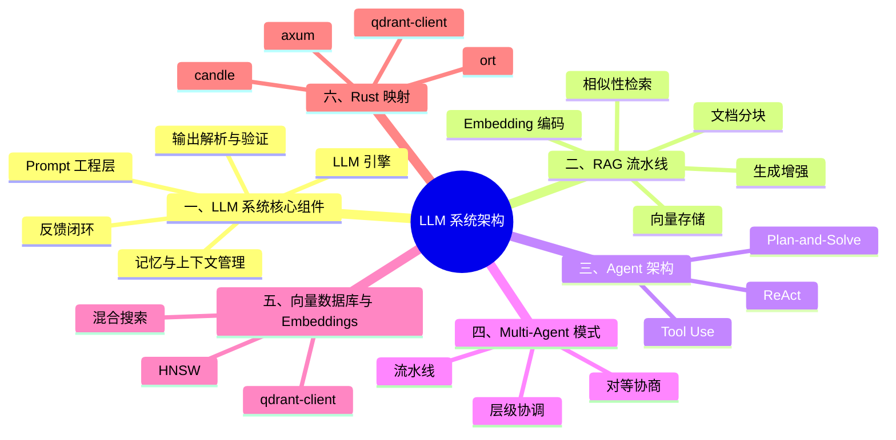

# LLM 系统架构：RAG、Agent 与向量数据库

> **代码状态**: ⚠️ 概念示例，外部 crate 依赖请见注释
>
> **EN**: LLM System Architecture
> **Summary**: LLM system architecture covering RAG pipelines, Agent patterns (ReAct, Plan-and-Solve, Tool Use), Multi-Agent systems, vector databases, and Rust ecosystem mappings.
>
> **受众**: [专家]
> **内容分级**: [实验级]
> **Bloom 层级**: L5-L7
> **权威来源**: 本文件为 `concept/` 权威页。
>
> **A/S/P 标记**: **P** — Procedure
> **双维定位**: P×Des — 设计 LLM 系统架构
> **前置概念**: [Rust in AI](05_rust_in_ai.md) · [Machine Learning Ecosystem](../../06_ecosystem/11_domain_applications/13_machine_learning_ecosystem.md) · [Type System](../../01_foundation/02_type_system/01_type_system.md) · [Concurrency](../../03_advanced/00_concurrency/01_concurrency.md)
> **后置概念**: [MLOps and LLMOps](09_mlops_and_llmops.md) · [AI Safety and Alignment](10_ai_safety_and_alignment.md) · [AI Integration](01_ai_integration.md)
> **定理链**: N/A — 描述性/综述性/导航性文档，不涉及形式化定理链
>
> **主要来源**: [Huyen — Designing Machine Learning Systems](https://www.oreilly.com/library/view/designing-machine-learning/9781098107956/) · [Yao et al. — ReAct: Synergizing Reasoning and Acting in Language Models](https://arxiv.org/abs/2210.03629) · [Schick et al. — Toolformer: Language Models Can Teach Themselves to Use Tools](https://arxiv.org/abs/2302.04761)
>
> **Rust 版本**: 1.97.0+ (Edition 2024)

---

**变更日志**:

- v1.0 (2026-07-28): Phase 4 初始版本——覆盖 LLM 系统组件、RAG、Agent、Multi-Agent、向量数据库与 Rust 映射

---

## 一、LLM 系统核心组件

一个生产级 LLM 系统不是单一模型调用，而是由多个相互依赖的子系统组成的流水线：

```text
┌─────────────┐   ┌─────────────┐   ┌─────────────┐   ┌─────────────┐
│   Prompt    │   │    LLM      │   │  Output     │   │   Memory    │
│  工程/模板   │ → │   Engine    │ → │  解析/验证   │ → │  上下文管理  │
└─────────────┘   └─────────────┘   └─────────────┘   └─────────────┘
       ↑                 ↑                                ↓
       └─────────────────┴────────────────────────────────┘
              反馈循环：日志、监控、人工标注、再训练
```

**核心组件**:

- **Prompt 工程层**: 将用户请求转化为模型可理解的结构化输入，包含系统提示、 few-shot 示例、输出格式约束（JSON schema、XML）。
- **LLM 引擎**: 模型推理服务，负责 token 生成、采样策略（temperature、top-p）、流式输出。生产环境通常使用 vLLM、TensorRT-LLM 或 Rust 原生推理引擎。
- **输出解析与验证**: 将模型生成的非结构化文本转换为结构化数据，并进行 schema 校验。失败时触发重试或降级。
- **记忆/上下文管理**: 维护对话历史、用户偏好和长期记忆。关键技术包括滑动窗口、摘要压缩和外部向量存储。
- **反馈闭环**: 收集用户反馈、运行时日志和评估结果，驱动 prompt 迭代与模型微调。

判定依据：系统复杂度不在模型本身，而在于**如何稳定地组合这些组件**。工程上应先固化输入输出契约，再优化单点模型能力。

### 1.1 系统接口契约

```rust
// 概念性接口：LLM 请求与响应契约
pub struct LlmRequest {
    pub system_prompt: String,
    pub user_prompt: String,
    pub temperature: f32,
    pub max_tokens: usize,
}

pub struct LlmResponse<T> {
    pub raw_text: String,
    pub parsed: Option<T>,
    pub usage_tokens: usize,
}

pub trait LlmBackend {
    type Output: serde::de::DeserializeOwned;
    fn complete(&self, req: LlmRequest) -> Result<LlmResponse<Self::Output>, LlmError>;
}

#[derive(Debug)]
pub enum LlmError {
    Timeout,
    ParseFailure(String),
    ModelUnavailable,
}
```

> **关键洞察**: 将 LLM 调用抽象为带类型的请求-响应契约，可以把模型的统计不确定性限制在 `parsed: Option<T>` 中，上层用 `Result` 处理失败。这是 Rust 类型系统对 AI 系统可靠性的直接贡献。

---

## 二、RAG 流水线

**检索增强生成（Retrieval-Augmented Generation, RAG）** 通过在生成阶段注入外部知识，缓解 LLM 的幻觉（hallucination）和知识截止问题。RAG 流水线可分为四个阶段：

```text
原始文档
   │
   ▼
┌─────────────┐   ┌─────────────┐   ┌─────────────┐   ┌─────────────┐
│  文档分块    │ → │  Embedding  │ → │  向量存储    │ → │  相似性检索  │
│  Chunking   │   │   模型编码   │   │  Vector DB  │   │  Top-K 召回 │
└─────────────┘   └─────────────┘   └─────────────┘   └─────────────┘
                                                          │
                   ┌─────────────┐   ┌─────────────┐     ▼
                   │  生成答案    │ ← │  Prompt 拼接 │ ← 检索上下文
                   │  Generation │   │  模型输入    │
                   └─────────────┘   └─────────────┘
```

### 2.1 文档分块策略

分块（Chunking）决定检索粒度，常见策略：

- **固定长度分块**: 按 token 数或字符数切分，实现简单但可能破坏语义边界。
- **语义分块**: 按段落、章节或主题边界切分，保留上下文连贯性。
- **重叠窗口**: 相邻块之间保留重叠内容，减少边界信息丢失。

### 2.2 Embedding 与相似性检索

Embedding 模型将文本映射为稠密向量。检索时，将查询向量与文档向量进行相似度计算（通常是余弦相似度），返回 Top-K 相关块：

```text
score(d, q) = cosine(embed(d), embed(q))
             = (d · q) / (||d|| * ||q||)
```

判定依据：检索质量是 RAG 的上限，生成质量只是逼近这个上限。如果召回的上下文不相关，再强的模型也无法生成正确回答。

### 2.3 生成阶段增强

将检索到的上下文拼接到 prompt 中，典型模板：

```text
基于以下上下文回答问题。如果上下文不包含答案，请回答"我不知道"。

上下文:
{retrieved_chunks}

问题:
{user_question}
```

这种显式引用机制使回答可溯源，并为后续事实性评估提供依据。

### 2.4 RAG 的失败模式

- **检索失败**: 相关文档未被召回，原因可能是 embedding 模型领域不匹配、分块粒度错误、向量索引未更新。
- **生成忽略上下文**: 模型过度依赖参数化知识，忽视检索内容（称为 "context disobedience"）。
- **拼接过载**: 一次性塞入过多检索块，稀释关键信息并触发上下文长度限制。

---

## 三、Agent 架构

**Agent** 指能够自主规划、调用工具并与环境交互的 LLM 系统。与单次 LLM 调用不同，Agent 通过循环迭代完成复杂任务。

### 3.1 ReAct：推理与行动交织

ReAct（Reasoning + Acting）让模型在每一步生成**思考（Thought）**、**行动（Action）**和**观察（Observation）**，形成推理链：

```text
Question: 2024 年诺贝尔文学奖得主是谁？
Thought 1: 我需要搜索最新信息。
Action 1: Search["2024 Nobel Prize in Literature winner"]
Observation 1: Han Kang won the 2024 Nobel Prize in Literature.
Thought 2: 我已经获得答案。
Action 2: Finish["韩江（Han Kang）"]
```

> **来源**: [Yao et al. — ReAct: Synergizing Reasoning and Acting in Language Models](https://arxiv.org/abs/2210.03629)

ReAct 的优势在于可解释性：中间步骤全部可见，便于调试和人工审计。

### 3.2 Plan-and-Solve：先规划再执行

对于多步骤任务，Plan-and-Solve 先让模型生成高层计划，再逐步执行每个子任务：

```text
任务: 计算公司 Q3 财报中的净利润率
计划:
1. 从 PDF 中提取 Q3 收入与净利润
2. 计算净利润率 = 净利润 / 收入
3. 验证数字单位一致性
4. 返回结果并附计算公式
```

这种架构适合**工具链长、依赖关系明确**的任务，但计划僵化，遇到异常时需要回退机制。

### 3.3 Tool Use：工具调用接口

Tool Use 让模型输出结构化工具调用请求，由系统解析并执行：

```rust
// 概念性工具调用 schema
#[derive(Debug)]
pub struct ToolError;

#[derive(serde::Deserialize, Debug)]
#[serde(tag = "tool")]
pub enum ToolCall {
    #[serde(rename = "search")]
    Search { query: String },
    #[serde(rename = "calculator")]
    Calculator { expression: String },
    #[serde(rename = "finish")]
    Finish { answer: String },
}

pub trait Tool {
    type Output;
    fn name(&self) -> &'static str;
    fn invoke(&self, args: serde_json::Value) -> Result<Self::Output, ToolError>;
}
```

> **来源**: [Schick et al. — Toolformer: Language Models Can Teach Themselves to Use Tools](https://arxiv.org/abs/2302.04761)

判定依据：工具调用接口必须严格定义输入输出 schema，否则模型容易生成无效参数。Rust 的强类型和 serde 是定义此类契约的理想工具。

---

## 四、Multi-Agent 模式

当任务涉及多个角色或视角时，Multi-Agent 系统将工作分配给多个专用 Agent：

```text
┌─────────────────────────────────────────────────────────────┐
│                      协调器（Orchestrator）                   │
│                   分解任务、分发、合并结果                    │
└──────────────┬──────────────────────────────┬───────────────┘
               │                              │
       ┌───────▼───────┐              ┌───────▼───────┐
       │  Researcher   │              │   Coder       │
       │  检索/分析     │              │   生成代码     │
       └───────┬───────┘              └───────┬───────┘
               │                              │
               └──────────────┬───────────────┘
                              ▼
                       ┌─────────────┐
                       │  Reviewer   │
                       │  审查/验证   │
                       └─────────────┘
```

### 4.1 常见协作模式

- **层级协调**: 一个中心 Agent 分解任务并分配给子 Agent，适合复杂但可结构化的工作流。
- **对等协商**: Agent 之间通过消息传递协商，适合创意生成或辩论式任务。
- **流水线**: 每个 Agent 负责固定阶段，输出作为下一个 Agent 的输入，适合文档审查、代码 review 等流程。

### 4.2 通信契约

Multi-Agent 系统的核心复杂度在于**Agent 间通信契约**：

```rust
// 概念性 Agent 消息协议
#[derive(Clone)]
pub struct AgentId(String);

pub struct AgentMessage {
    pub from: AgentId,
    pub to: AgentId,
    pub message_type: MessageType,
    pub payload: serde_json::Value,
}

pub enum MessageType {
    TaskAssignment,
    IntermediateResult,
    ReviewComment,
    FinalAnswer,
}

pub trait Agent {
    fn id(&self) -> AgentId;
    fn receive(&mut self, msg: AgentMessage) -> Vec<AgentMessage>;
}
```

判定依据：Multi-Agent 的收益不是简单叠加 Agent 数量，而是来自**清晰的角色边界和消息协议**。协议模糊时，系统会退化为昂贵且低效的聊天循环。

---

## 五、向量数据库与 Embeddings

向量数据库专门存储和检索高维向量，是 RAG 和长期记忆的基础设施。

### 5.1 核心能力

- **近似最近邻（ANN）搜索**: 在百万甚至十亿级向量中快速找到相似向量。
- **元数据过滤**: 结合标量过滤条件（如 `user_id = 42`）缩小检索范围。
- **混合搜索**: 同时利用向量相似性和传统关键词匹配（BM25）。

### 5.2 索引算法

常见 ANN 索引包括 HNSW、IVF、PQ（Product Quantization）。选择依据：

| 算法 | 召回率 | 内存占用 | 构建速度 | 适用规模 |
|:---|:---|:---|:---|:---|
| HNSW | 高 | 高 | 中等 | 百万级 |
| IVF | 中 | 中 | 快 | 千万级 |
| PQ | 中低 | 低 | 快 | 亿级 |

### 5.3 Rust 映射

Rust 生态中可直接使用的向量数据库客户端和 embedding 工具：

| 用途 | Crate / 项目 | 说明 |
|:---|:---|:---|
| 向量数据库客户端 | `qdrant-client` | Qdrant 的 Rust gRPC/REST 客户端 |
| 向量数据库客户端 | `milvus-sdk-rust` | Milvus 客户端（社区维护） |
| 本地向量索引 | `instant-distance` | HNSW 纯 Rust 实现 |
| 嵌入服务 | `ort` + ONNX | 运行 BERT/SentenceTransformer 模型 |
| 本地推理 | `candle` | 纯 Rust 运行 embedding 模型 |
| 文本嵌入 | `rust-bert` | 基于 tch-rs 的 Transformer 模型 |

```rust,ignore
// 概念性 Qdrant 客户端用法（需依赖 qdrant-client）
use qdrant_client::Qdrant;
use qdrant_client::qdrant::{SearchPoints, WithVectorsSelector};

async fn search_similar(
    client: &Qdrant,
    collection: &str,
    vector: Vec<f32>,
    top_k: u64,
) -> anyhow::Result<Vec<ScoredPoint>> {
    let request = SearchPoints {
        collection_name: collection.to_string(),
        vector,
        limit: top_k,
        with_payload: Some(true.into()),
        ..Default::default()
    };
    let response = client.search_points(request).await?;
    Ok(response.result)
}
```

> **关键洞察**: 向量数据库的选择应基于延迟-召回-成本的三角权衡。Rust 客户端适合构建低延迟的检索服务，但 embedding 模型本身的性能和质量仍是瓶颈。

---

## 六、Rust 映射：构建 LLM 系统组件

Rust 在 LLM 系统基础设施中的角色与在 ML 生态中类似：**训练侧弱势，推理与服务侧强势**。

| 子系统 | Rust 优势 | 代表 crate |
|:---|:---|:---|
| 推理引擎 | 无 GC、低延迟、WASM 部署 | `candle`, `mistral.rs` |
| ONNX 推理 | 跨框架、硬件加速 | `ort` |
| 嵌入服务 | 单二进制、并发安全 | `candle`, `rust-bert` |
| 向量检索 | 高并发、内存安全 | `qdrant-client`, `instant-distance` |
| 服务编排 | async/await、类型安全 API | `axum`, `actix-web` |
| 序列化/契约 | 强类型 schema | `serde`, `schemars` |

```rust
// 概念性 axum 推理服务端点
use axum::{extract::State, Json, Router};
use std::sync::Arc;

#[derive(serde::Deserialize)]
struct InferenceRequest {
    prompt: String,
    max_tokens: usize,
}

#[derive(serde::Serialize)]
struct InferenceResponse {
    text: String,
}

struct LlmError;
struct LlmRequest {
    system_prompt: String,
    user_prompt: String,
    temperature: f32,
    max_tokens: usize,
}

trait LlmBackend {
    type Output;
    fn complete(&self, req: LlmRequest) -> Result<Self::Output, LlmError>;
}

async fn inference_handler(
    State(model): State<Arc<dyn LlmBackend<Output = InferenceResponse>>>,
    Json(req): Json<InferenceRequest>,
) -> Result<Json<InferenceResponse>, LlmError> {
    let resp = model.complete(LlmRequest {
        system_prompt: "You are a helpful assistant.".into(),
        user_prompt: req.prompt,
        temperature: 0.7,
        max_tokens: req.max_tokens,
    })?;
    Ok(Json(resp))
}
```

判定依据：Rust 适合构建 LLM 系统的"硬壳"——推理服务、检索代理、协议编排；而 prompt 工程、模型训练、评估基准通常仍依赖 Python 生态。

---

## 七、反命题与边界分析

### 7.1 反命题树

**反命题 1**: "RAG 可以完全消除 LLM 幻觉"

- 反驳：RAG 只能减少基于外部知识的幻觉；如果检索内容本身错误，或模型忽视上下文，仍然会产生错误输出。
- 根结论：RAG 是**风险缓解**而非**风险消除**，需要配合事实性评估和人工审核。

**反命题 2**: "Agent 越自主越好"

- 反驳：过度自主会导致行动不可预测、成本失控和安全风险。生产系统需要人类可中断的边界和每一步的审计日志。
- 根结论：自主性应与**可解释性**和**可控性**同步增长。

**反命题 3**: "向量数据库是 RAG 的唯一选择"

- 反驳：对于小规模、结构化或关键词密集型知识，传统搜索引擎（Elasticsearch、SQLite FTS）可能更简单高效。
- 根结论：按数据规模和查询类型选择检索后端，避免过度工程。

### 7.2 边界极限

| 边界 | 现状 | 工程影响 |
|:---|:---|:---|
| 上下文窗口 | 128K–1M tokens（模型相关） | 长上下文不等于有效利用，需要分层摘要 |
| 检索召回 | 依赖 embedding 质量和索引参数 | 需要领域微调和持续评估 |
| Agent 步数 | 每步都是模型调用，成本线性增长 | 需要预算限制和步数上限 |
| 工具调用延迟 | 模型生成 + 工具执行串行 | 可并行调用独立工具 |
| 多 Agent 协调 | 通信开销和角色冲突 | 需要严格的消息协议和超时机制 |

---

## 八、认知路径

> **学习递进**: LLM 系统架构的核心逻辑链

1. **单点模型能力 ≠ 系统能力**: 系统能力取决于输入输出契约、检索质量、失败处理和反馈闭环。
2. **RAG 是知识外挂**: 把动态、私有、最新知识从模型参数中解耦出来。
3. **Agent 是控制流抽象**: 用 LLM 替代部分控制流决策，但必须保留人类监督和审计能力。
4. **Multi-Agent 的收益来自分工**: 不是 Agent 越多越好，而是角色边界和协议清晰。
5. **Rust 适合构建确定性基础设施**: 无 GC、类型安全的特性使其成为 LLM 服务编排和推理引擎的可靠选择。

---

## 🧭 思维导图（Mindmap）



---

## 嵌入式测验（Embedded Quiz）

### 测验 1：RAG 的核心价值是什么？（理解层）

**题目**: RAG 的核心价值是什么？

<details>
<summary>✅ 答案与解析</summary>

RAG 通过在生成阶段注入外部检索上下文，缓解 LLM 的幻觉和知识截止问题，使回答可溯源到具体文档。
</details>

---

### 测验 2：ReAct 模式中的三个关键元素是什么？（理解层）

**题目**: ReAct 模式中的三个关键元素是什么？

<details>
<summary>✅ 答案与解析</summary>

Thought（思考）、Action（行动）、Observation（观察）。模型通过显式推理步骤与外部环境交互，提高可解释性和任务完成率。
</details>

---

### 测验 3：为什么 Tool Use 需要严格的输入输出 schema？（分析层）

**题目**: 为什么 Tool Use 需要严格的输入输出 schema？

<details>
<summary>✅ 答案与解析</summary>

LLM 生成的工具调用参数可能是幻觉或格式错误。严格 schema 可以在解析阶段失败并触发重试，防止无效参数传播到外部系统。Rust 的 serde + 强类型是理想实现手段。
</details>

---

### 测验 4：Multi-Agent 系统失败的主要原因是什么？（分析层）

**题目**: Multi-Agent 系统失败的主要原因是什么？

<details>
<summary>✅ 答案与解析</summary>

角色边界模糊、消息协议不一致、缺乏超时和错误回退机制。Agent 数量增加会放大协调开销，清晰的契约比数量更重要。
</details>

---

### 测验 5：在 Rust 中构建 LLM 推理服务的核心优势是什么？（应用层）

**题目**: 在 Rust 中构建 LLM 推理服务的核心优势是什么？

<details>
<summary>✅ 答案与解析</summary>

无 GC 停顿、低延迟、内存安全、可静态链接为单二进制，适合高并发服务编排和边缘部署。典型组合：`candle`/`ort` 负责推理，`axum`/`actix-web` 负责服务。
</details>

---

> **权威来源**: [Rust Reference](https://doc.rust-lang.org/reference/introduction.html) · [The Rust Programming Language](https://doc.rust-lang.org/book/title-page.html) · [Huyen — Designing Machine Learning Systems](https://www.oreilly.com/library/view/designing-machine-learning/9781098107956/) · [Yao et al. — ReAct](https://arxiv.org/abs/2210.03629) · [Schick et al. — Toolformer](https://arxiv.org/abs/2302.04761)
>
> **文档版本**: 1.0
> **最后更新**: 2026-07-28
> **状态**: ✅ Phase 4 初始创建
