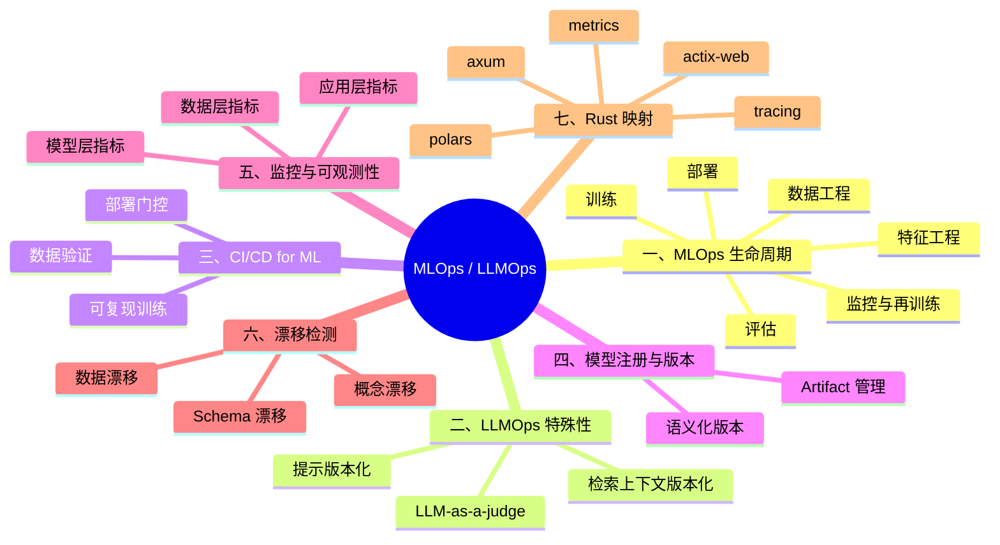

# MLOps 与 LLMOps：模型生命周期工程化

> **代码状态**: ⚠️ 概念示例，外部 crate 依赖请见注释
>
> **EN**: MLOps and LLMOps
> **Summary**: MLOps and LLMOps lifecycle: CI/CD for ML, model versioning, observability, data and schema drift, with Rust ecosystem mappings for serving and feature stores.
>
> **受众**: [专家]
> **内容分级**: [实验级]
> **Bloom 层级**: L5-L7
> **权威来源**: 本文件为 `concept/` 权威页。
>
> **A/S/P 标记**: **P** — Procedure
> **双维定位**: P×Eva — 评估 MLOps/LLMOps 工程实践
> **前置概念**: [Machine Learning Ecosystem](../../06_ecosystem/11_domain_applications/13_machine_learning_ecosystem.md) · [LLM System Architecture](08_llm_system_architecture.md) · [Type System](../../01_foundation/02_type_system/01_type_system.md) · [Async/Await](../../03_advanced/01_async/01_async.md)
> **后置概念**: [AI Safety and Alignment](10_ai_safety_and_alignment.md) · [LLM System Architecture](08_llm_system_architecture.md)
> **定理链**: N/A — 描述性/综述性/导航性文档，不涉及形式化定理链
>
> **主要来源**: [Huyen — Designing Machine Learning Systems](https://www.oreilly.com/library/view/designing-machine-learning/9781098107956/) · [DeepLearning.AI — MLOps Specialization](https://www.deeplearning.ai/courses/machine-learning-engineering-for-production-mlops/) · [arXiv — MLOps: Overview, Definition, and Architecture](https://arxiv.org/abs/2005.12473) · [docs.rs — candle-core](https://docs.rs/candle-core) · [docs.rs — polars](https://docs.rs/polars) · [docs.rs — axum](https://docs.rs/axum)
>
> **Rust 版本**: 1.97.0+ (Edition 2024)

---

**变更日志**:

- v1.0 (2026-07-28): Phase 4 初始版本——覆盖 MLOps 生命周期、LLMOps 特性、CI/CD、模型注册、监控、漂移检测与 Rust 映射

---

## 一、MLOps 生命周期

MLOps（Machine Learning Operations）将软件工程实践扩展到机器学习系统，覆盖从数据到生产模型的全生命周期：

```text
┌─────────┐   ┌─────────┐   ┌─────────┐   ┌─────────┐   ┌─────────┐
│  Data   │ → │ Feature │ → │ Train   │ → │ Evaluate│ → │ Deploy  │
│ 数据收集 │   │ 特征工程 │   │ 模型训练 │   │ 模型评估 │   │ 模型部署 │
└─────────┘   └─────────┘   └─────────┘   └─────────┘   └─────────┘
       ↑                                               │
       └────────────── Monitor & Retrain ←─────────────┘
```

**关键阶段**:

- **数据工程**: 数据采集、清洗、标注、版本化。数据质量直接决定模型上限。
- **特征工程**: 将原始数据转换为模型可消费的特征，通常需要特征存储（Feature Store）支持在线/离线一致性。
- **训练**: 实验管理、超参搜索、分布式训练。产出候选模型和训练元数据。
- **评估**: 在 holdout 集和切片（slice）上验证模型性能，避免只在平均指标上过关。
- **部署**: 将模型发布为推理服务，涉及金丝雀发布、A/B 测试、回滚策略。
- **监控与再训练**: 持续监控模型性能、数据漂移，触发再训练流水线。

> **来源**: [Huyen — Designing Machine Learning Systems](https://www.oreilly.com/library/view/designing-machine-learning/9781098107956/)

判定依据：MLOps 的核心目标不是让模型跑起来，而是让模型**持续、可靠、可审计**地跑起来。

### 1.1 流水线即代码

与软件 CI/CD 类似，ML 流水线也应以代码形式版本化：

```rust
// 概念性流水线步骤抽象
pub struct PipelineStep<T> {
    pub name: &'static str,
    pub version: semver::Version,
    pub run: Box<dyn Fn(&T) -> Result<T, PipelineError>>,
}

pub struct MlPipeline<T> {
    pub steps: Vec<PipelineStep<T>>,
}

impl<T> MlPipeline<T> {
    pub fn execute(&self, input: T) -> Result<T, PipelineError> {
        self.steps.iter().try_fold(input, |state, step| {
            println!("running step: {} v{}", step.name, step.version);
            (step.run)(&state)
        })
    }
}
```

> **关键洞察**: 将每个流水线步骤版本化，可以在模型出问题时精确复现训练环境，这是审计和合规的基础。

---

## 二、LLMOps 的特殊性

LLMOps 是 MLOps 在大型语言模型时代的 specialization，面临传统 ML 不常见的挑战：

| 维度 | 传统 MLOps | LLMOps |
|:---|:---|:---|
| 模型体积 | MB–GB 级 | GB–TB 级 |
| 训练成本 | 可承受重训 | 预训练成本极高，通常只做微调 |
| 输出空间 | 有限标签 | 开放式文本，难以定义单一"正确" |
| 评估 | 准确率、F1 | 人工评估、LLM-as-a-judge、RAG 事实性 |
| 提示工程 | 不适用 | 核心资产，需要版本化 |
| 延迟要求 | 通常批量 | 流式、首 token 延迟敏感 |

### 2.1 提示版本化

Prompt 是 LLMOps 的一等公民，需要像代码一样版本管理：

```text
prompts/
├── v1.0/
│   ├── system.txt
│   ├── summarize.txt
│   └── schema.json
└── v1.1/
    ├── system.txt
    └── summarize.txt
```

判定依据：一个 prompt 的微小改动可能导致输出质量显著变化。没有版本化的 prompt 管理，A/B 测试和回滚都无法进行。

### 2.2 检索上下文版本化

对于 RAG 系统，向量索引、embedding 模型和文档分块策略共同决定检索质量。它们必须协同版本化：

```text
rag_release/
├── embedding_model=bert-base-v2
├── vector_index=qdrant-2026-07-28
├── chunk_strategy=semantic-512-128
└── prompt_version=v1.1
```

三者任一变更都应触发新的发布单元，否则无法解释线上表现变化。

---

## 三、CI/CD for ML

ML 系统的 CI/CD 需要在传统测试之外增加数据验证、模型评估和部署门控：

```text
代码变更 / 数据变更
    │
    ▼
┌─────────────┐
│  数据验证    │  ← 检查 schema、分布、缺失值
└──────┬──────┘
       ▼
┌─────────────┐
│  模型训练    │  ← 可复现环境（容器、锁文件）
└──────┬──────┘
       ▼
┌─────────────┐
│  模型评估    │  ← 性能基准、公平性、切片分析
└──────┬──────┘
       ▼
┌─────────────┐
│  部署门控    │  ← 人工审批、金丝雀、A/B
└──────┬──────┘
       ▼
   生产环境
```

### 3.1 数据验证

数据是 ML 系统中最脆弱的输入。CI 阶段应验证：

- Schema 一致性：列名、类型、取值范围。
- 分布漂移：训练/服务数据分布是否显著偏离。
- 标签质量：异常标签比例、标注一致性。

### 3.2 可复现性

训练可复现要求固定：随机种子、依赖版本、数据集版本、硬件配置。Rust 的 `Cargo.lock` 和确定性构建特性在这里同样适用。

```rust
// 概念性训练配置，强调版本锁定
#[derive(Clone, Debug)]
pub struct TrainingConfig {
    pub seed: u64,
    pub dataset_version: String,
    pub dependency_lock: String, // Cargo.lock hash
    pub hyperparameters: serde_json::Value,
}

impl TrainingConfig {
    pub fn reproducibility_key(&self) -> String {
        format!(
            "{}-{}-{}",
            self.seed, self.dataset_version, self.dependency_lock
        )
    }
}
```

---

## 四、模型注册与版本管理

模型注册中心（Model Registry）是生产 ML 的单一事实源，记录：

- 模型版本与对应的训练运行（run）。
- 评估指标和 artifacts（权重、配置、日志）。
- 阶段标签：staging / production / archived。
- 审批记录和部署历史。

### 4.1 版本化策略

推荐采用**语义化版本**管理模型：

- **MAJOR**: 架构变更、输入输出 schema 变更、breaking change。
- **MINOR**: 同等架构下的性能提升、新特征。
- **PATCH**: 热修复、权重更新、同等能力下的 bug 修复。

判定依据：模型版本不是装饰，而是部署、回滚、A/B 测试的基础。模型接口变更应像 API 一样遵循语义化版本。

### 4.2 Artifact 管理

```rust
// 概念性模型 artifact 元数据
#[derive(Debug)]
pub struct RegistryError;

pub struct ModelArtifact {
    pub name: String,
    pub version: String, // 实际工程中使用 semver::Version
    pub checksum: String,
    pub metrics: serde_json::Value,
    pub stage: ModelStage,
}

pub enum ModelStage {
    Development,
    Staging,
    Production,
    Archived,
}

pub trait ModelRegistry {
    fn register(&mut self, artifact: ModelArtifact) -> Result<(), RegistryError>;
    fn promote(&mut self, name: &str, version: &str, stage: ModelStage) -> Result<(), RegistryError>;
    fn load(&self, name: &str, stage: ModelStage) -> Option<&ModelArtifact>;
}
```

---

## 五、监控与可观测性

生产模型的可观测性分为三个层面：

```text
┌─────────────────────────────────────────────┐
│              监控金字塔                       │
├─────────────────────────────────────────────┤
│  应用层: 延迟、吞吐、错误率、成本              │
├─────────────────────────────────────────────┤
│  模型层: 预测分布、置信度、输出质量            │
├─────────────────────────────────────────────┤
│  数据层: 输入分布、特征漂移、schema 变更       │
└─────────────────────────────────────────────┘
```

### 5.1 应用层指标

- **延迟**: P50/P95/P99 token 生成延迟，首 token 时间（Time to First Token, TTFT）。
- **吞吐**: tokens/s、请求/秒。
- **错误率**: 模型服务不可用、超时、输出解析失败的比例。
- **成本**: 每次请求的成本，尤其是调用第三方 API 时。

### 5.2 模型层指标

- **输出分布**: 回答长度、语言分布、拒绝率。
- **置信度**: 对于分类/抽取任务，概率分布的熵。
- **LLM-as-a-judge**: 用另一个 LLM 评估生成质量，但需注意 judge 模型本身的偏差。

### 5.3 数据层指标

- **特征漂移**: 输入特征分布与训练时相比的变化。
- **标签漂移**: 输出分布的变化。
- **Schema 漂移**: 输入字段缺失或类型变更。

```rust
// 概念性漂移检测接口
pub trait DriftDetector {
    fn fit_reference(&mut self, data: &[f32]);
    fn detect(&self, sample: &[f32]) -> DriftReport;
}

pub struct DriftReport {
    pub score: f64,        // 如 KS 统计量、KL 散度
    pub threshold: f64,
    pub is_drift: bool,
}

// 简单的均值漂移检测器
pub struct MeanDriftDetector {
    reference_mean: f64,
    threshold: f64,
}

impl DriftDetector for MeanDriftDetector {
    fn fit_reference(&mut self, data: &[f32]) {
        self.reference_mean = data.iter().map(|x| *x as f64).sum::<f64>() / data.len() as f64;
    }

    fn detect(&self, sample: &[f32]) -> DriftReport {
        let sample_mean = sample.iter().map(|x| *x as f64).sum::<f64>() / sample.len() as f64;
        let score = (sample_mean - self.reference_mean).abs();
        DriftReport {
            score,
            threshold: self.threshold,
            is_drift: score > self.threshold,
        }
    }
}
```

---

## 六、数据漂移与 Schema 漂移

### 6.1 漂移类型

- **概念漂移（Concept Drift）**: 输入到输出的映射关系发生变化。例如用户行为模式改变导致旧模型不再适用。
- **数据漂移（Data Drift）**: 输入分布变化，但真实映射未变。例如季节变化导致特征均值偏移。
- **标签漂移（Label Drift）**: 输出分布变化，可能反映业务环境变化。
- **Schema 漂移**: 上游数据 schema 变更，如新增/删除字段、单位变化。

### 6.2 应对策略

| 漂移类型 | 检测手段 | 应对策略 |
|:---|:---|:---|
| 概念漂移 | 在线指标下降、人工反馈 | 重新标注、再训练 |
| 数据漂移 | 统计检验（KS、PSI）、距离度量 | 特征工程、模型校准 |
| 标签漂移 | 输出分布监控 | 检查上游流程、调整阈值 |
| Schema 漂移 | 输入 schema 校验 | 强类型契约、CI 数据测试 |

> **关键洞察**: Rust 的类型系统和 serde schema 校验可以在部署前拦截 schema 漂移，但无法检测统计分布漂移；后者需要运行时监控。

---

## 七、Rust 映射：MLOps 基础设施

Rust 在 MLOps 基础设施中的机会集中在**服务化、数据管道和可观测性**，而非训练编排：

| 能力 | Rust 优势 | 代表 crate / 模式 |
|:---|:---|:---|
| 模型服务 | 低延迟、高并发、无 GC | `axum`, `actix-web`, `tonic` |
| 特征服务 | 内存安全、并发安全 | 自建 Redis/Postgres 特征存储 |
| 数据管道 | 高性能、类型安全 | `polars`, `datafusion`, `arrow` |
| 可观测性 | 低开销指标采集 | `metrics`, `tracing`, `prometheus` |
| Artifact 管理 | 强类型版本、校验和 | `semver`, `sha2`, `serde` |
| 推理引擎 | 单二进制、WASM | `candle`, `ort`, `tract` |

### 7.1 模型服务示例

```rust,ignore
// 概念性 axum 模型服务（需 axum、serde、tokio）
use axum::{extract::State, Json, Router};
use std::sync::Arc;

#[derive(serde::Deserialize)]
struct PredictRequest {
    features: Vec<f32>,
}

#[derive(serde::Serialize)]
struct PredictResponse {
    score: f32,
    model_version: String,
}

async fn predict_handler(
    State(model): State<Arc<dyn Fn(&[f32]) -> f32 + Send + Sync>>,
    State(version): State<String>,
    Json(req): Json<PredictRequest>,
) -> Json<PredictResponse> {
    let score = model(&req.features);
    Json(PredictResponse { score, model_version: version })
}
```

### 7.2 特征存储模式

Rust 生态目前缺少成熟的开源 Feature Store，但可以用 Redis/Postgres + Rust 服务自建：

```text
在线特征:
  用户画像 → Redis（低延迟）
离线特征:
  批量特征 → Parquet/Arrow（分析）
特征服务:
  Rust API 统一在线/离线读取，保证一致性
```

判定依据：Rust 在 MLOps 中的价值是**把训练后的产物可靠地交付到生产环境**，而不是替代 Python 训练生态。

---

## 八、反命题与边界分析

### 8.1 反命题树

**反命题 1**: "有了监控就不需要测试"

- 反驳：监控只能发现已经发生的退化；测试可以在部署前捕获回归。两者互补，监控不能替代离线评估和 CI 门控。
- 根结论：监控是反馈环，测试是门禁，缺一不可。

**反命题 2**: "模型版本越多越好"

- 反驳：版本过多会增加管理、评估和回滚成本。应通过 stage 标签和审批流程控制进入生产的版本数量。
- 根结论：版本管理的目标是可追溯，不是版本数量最大化。

**反命题 3**: "LLMOps 只是 MLOps 加个 LLM"

- 反驳：LLMOps 需要额外管理 prompt、检索上下文、开放式输出评估和人类反馈循环，这些在传统 MLOps 中不存在或权重很低。
- 根结论：LLMOps 是 MLOps 的扩展，但有独立的实践集合。

### 8.2 边界极限

| 边界 | 现状 | 工程影响 |
|:---|:---|:---|
| 再训练频率 | 受成本和数据准备周期限制 | 需要自动化触发条件 |
| 漂移检测灵敏度 | 高灵敏度导致误报，低灵敏度漏报 | 需业务指标校准 |
| LLM 评估一致性 | 人工评估成本高，LLM judge 有偏差 | 多采用混合评估 |
| 成本可观测性 | 第三方 API 计费粒度有限 | 需要按请求/用户归因 |
| Rust 训练生态 | 不成熟 | Rust 聚焦部署与服务 |

---

## 九、认知路径

> **学习递进**: MLOps/LLMOps 的核心逻辑链

1. **模型是代码+数据+配置的产物**: 生产系统必须版本化这三者，而不仅仅是权重文件。
2. **监控要分层**: 应用层、模型层、数据层指标缺一不可。
3. **漂移不可避免**: 关键是检测速度和再训练闭环的自动化程度。
4. **LLMOps 增加了提示和检索上下文管理**: 它们与模型权重同等重要。
5. **Rust 适合构建高可靠性的服务与数据基础设施**: 训练仍主要留在 Python，但部署和服务可以由 Rust 承载。

---

## 🧭 思维导图（Mindmap）



---

## 嵌入式测验（Embedded Quiz）

### 测验 1：MLOps 的核心目标是什么？（理解层）

**题目**: MLOps 的核心目标是什么？

<details>
<summary>✅ 答案与解析</summary>

让机器学习系统持续、可靠、可审计地运行，覆盖从数据到生产部署再到监控再训练的全生命周期。
</details>

---

### 测验 2：LLMOps 与传统 MLOps 最显著的区别是什么？（理解层）

**题目**: LLMOps 与传统 MLOps 最显著的区别是什么？

<details>
<summary>✅ 答案与解析</summary>

LLMOps 需要管理 prompt、检索上下文和开放式文本输出评估，而传统 MLOps 主要关注固定输入输出和可量化指标。
</details>

---

### 测验 3：为什么模型注册中心需要记录训练运行的元数据？（分析层）

**题目**: 为什么模型注册中心需要记录训练运行的元数据？

<details>
<summary>✅ 答案与解析</summary>

为了复现训练环境、追溯问题来源、满足审计要求，并支持按 stage（staging/production/archived）管理模型生命周期。
</details>

---

### 测验 4：数据漂移和概念漂移有什么区别？（分析层）

**题目**: 数据漂移和概念漂移有什么区别？

<details>
<summary>✅ 答案与解析</summary>

数据漂移是输入分布变化但真实映射不变；概念漂移是输入到输出的映射关系本身发生变化。前者可能通过特征工程缓解，后者通常需要重新训练。
</details>

---

### 测验 5：Rust 在 MLOps 中的合理定位是什么？（应用层）

**题目**: Rust 在 MLOps 中的合理定位是什么？

<details>
<summary>✅ 答案与解析</summary>

构建模型推理服务、特征服务、数据管道和可观测性基础设施，利用无 GC、类型安全和并发安全优势；训练编排仍主要依赖 Python 生态。
</details>

---

> **权威来源**: [Rust Reference](https://doc.rust-lang.org/reference/introduction.html) · [The Rust Programming Language](https://doc.rust-lang.org/book/title-page.html) · [Huyen — Designing Machine Learning Systems](https://www.oreilly.com/library/view/designing-machine-learning/9781098107956/) · [DeepLearning.AI — MLOps Specialization](https://www.deeplearning.ai/courses/machine-learning-engineering-for-production-mlops/) · [arXiv — MLOps: Overview, Definition, and Architecture](https://arxiv.org/abs/2005.12473) · [docs.rs — candle-core](https://docs.rs/candle-core) · [docs.rs — polars](https://docs.rs/polars) · [docs.rs — axum](https://docs.rs/axum)
>
> **文档版本**: 1.0
> **最后更新**: 2026-07-28
> **状态**: ✅ Phase 4 初始创建
