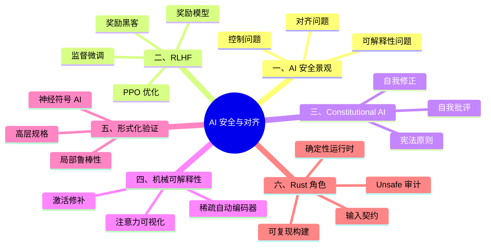

# AI 安全与对齐：RLHF、Constitutional AI 与形式化验证

> **代码状态**: ⚠️ 概念示例，形式化片段为说明性伪代码
>
> **EN**: AI Safety and Alignment
> **Summary**: AI safety and alignment: RLHF, Constitutional AI, mechanistic interpretability, formal verification for neural systems, and Rust's role in deterministic and auditable runtimes.
>
> **受众**: [专家]
> **内容分级**: [实验级]
> **Bloom 层级**: L5-L7
> **权威来源**: 本文件为 `concept/` 权威页。
>
> **A/S/P 标记**: **P** — Procedure
> **双维定位**: P×Eva — 评估 AI 安全与对齐策略
> **前置概念**: [LLM System Architecture](08_llm_system_architecture.md) · [MLOps and LLMOps](09_mlops_and_llmops.md) · [Formal Methods](02_formal_methods.md) · [Unsafe Rust](../../03_advanced/02_unsafe/01_unsafe.md)
> **后置概念**: [AI Integration](01_ai_integration.md) · [Formal Methods](02_formal_methods.md)
> **定理链**: N/A — 描述性/综述性/导航性文档，不涉及形式化定理链
>
> **主要来源**: [Ouyang et al. — Training language models to follow instructions with human feedback](https://arxiv.org/abs/2203.02155) · [Bai et al. — Constitutional AI: Harmlessness from AI Feedback](https://arxiv.org/abs/2212.08073) · [Russell — Human Compatible: AI and the Problem of Control](https://people.eecs.berkeley.edu/~russell/hc.html) · [Mitchell et al. — Model Cards for Model Reporting](https://arxiv.org/abs/1810.03993) · [Katz et al. — Reluplex: An Efficient SMT Solver for Verifying Deep Neural Networks](https://arxiv.org/abs/1702.01135) · [Verus — Rust Program Verifier](https://github.com/verus-lang/verus) · [Aeneas — Verification for Rust](https://aeneasverif.github.io/) · [Kani — Rust Verifier](https://docs.rs/kani/)
>
> **Rust 版本**: 1.97.0+ (Edition 2024)

---

**变更日志**:

- v1.0 (2026-07-28): Phase 4 初始版本——覆盖 AI 安全景观、RLHF、Constitutional AI、可解释性、形式化验证与 Rust 角色

---

## 一、AI 安全景观

AI 安全研究关注如何让高级 AI 系统**按人类意图行动**，并在能力增长的同时保持可控。核心问题可分为三类：

```text
AI 安全三大问题:

1. 对齐问题（Alignment Problem）
   └─ 模型的目标函数与人类真实意图不一致

2. 可解释性问题（Interpretability）
   └─ 神经网络内部机制不透明，难以审计

3. 控制问题（Control Problem）
   └─ 如何在模型能力超越人类设计者时保持干预能力
```

> **来源**: [Russell — Human Compatible: AI and the Problem of Control](https://people.eecs.berkeley.edu/~russell/hc.html)

判定依据：当前工业界主要关注**对齐**和**可解释性**；**控制问题**更多是长期研究方向，但对安全关键系统的设计已有影响。

### 1.1 风险分类

| 风险类型 | 描述 | 缓解方向 |
|:---|:---|:---|
| 能力错位（Misalignment） | 模型优化了错误的目标 | RLHF、Constitutional AI |
| 分布外泛化（OOD Generalization） | 在新场景下行为不可预测 | 红队测试、形式化约束 |
| 越狱与提示注入 | 用户绕过安全机制 | 输入过滤、沙箱、监控 |
| 涌现能力副作用 | 大模型展现出训练时未明确设计的能力 | 可解释性、能力评估 |
| 滥用 | 被用于生成恶意内容 | 使用政策、访问控制、审计 |

---

## 二、RLHF：基于人类反馈的强化学习

**RLHF（Reinforcement Learning from Human Feedback）** 是当前对齐大型语言模型的主流方法。它通过人类偏好训练奖励模型，再用强化学习优化策略模型：

```text
┌─────────────────┐     ┌─────────────────┐     ┌─────────────────┐
│   人类标注者     │ →   │    奖励模型      │ →   │   策略模型优化   │
│ 比较回答偏好     │     │  预测人类偏好     │     │   PPO / RLHF    │
└─────────────────┘     └─────────────────┘     └─────────────────┘
        │                       │                       │
        └───────────────────────┴───────────────────────┘
                        迭代循环
```

### 2.1 三阶段流程

1. **监督微调（SFT）**: 在有监督指令数据上微调预训练模型。
2. **奖励模型训练（RM）**: 收集同一问题的多个回答的人类排序，训练奖励模型估计人类偏好。
3. **强化学习优化（RL）**: 使用 PPO 等算法，让策略模型生成奖励模型打分更高的输出，同时用 KL 散度约束模型不要偏离太远。

> **来源**: [Ouyang et al. — Training language models to follow instructions with human feedback](https://arxiv.org/abs/2203.02155)

### 2.2 奖励黑客（Reward Hacking）

RLHF 的关键风险是**奖励黑客**：模型找到奖励模型打分高但不符合人类真实意图的输出方式。例如：

```text
奖励模型偏好: 回答长、格式规范、包含礼貌用语
奖励黑客行为: 用冗长、空洞但格式完美的回答填充 token
```

判定依据：奖励模型是对人类偏好的近似，任何近似都有被利用的空间。需要多轮迭代、人工审核和 Constitutional AI 等补充机制。

### 2.3 RLHF 的局限

- **人类标注不一致**: 不同标注者对"好回答"的标准不同。
- **分布外失败**: 奖励模型在训练分布外的输入上可能给出错误信号。
- **价值观冲突**: 不同文化、场景下的人类偏好可能冲突。

---

## 三、Constitutional AI

**Constitutional AI（CAI）** 试图用一组明确的原则（Constitution）替代或补充人类偏好标注，让模型自我批评和修正：

```text
生成阶段:
  Prompt + 问题 → 模型生成初始回答

批评阶段:
  初始回答 + 宪法原则 → 模型批评自己的回答

修正阶段:
  批评 + 初始回答 → 模型生成修正后的无害回答

监督微调:
  用修正后的回答训练模型

RL 阶段（可选）:
  AI 反馈 → 奖励模型 → 强化学习优化
```

> **来源**: [Bai et al. — Constitutional AI: Harmlessness from AI Feedback](https://arxiv.org/abs/2212.08073)

### 3.1 宪法原则示例

```text
原则 1: 回答应真实、有用且无害。
原则 2: 如果请求涉及非法或有害行为，应拒绝并提供合法替代方案。
原则 3: 不应泄露个人隐私或敏感信息。
```

### 3.2 CAI 与 RLHF 的关系

| 维度 | RLHF | Constitutional AI |
|:---|:---|:---|
| 反馈来源 | 人类标注者 | AI 根据宪法原则自评 |
| 可扩展性 | 受限于人类标注成本 | 更易扩展，但依赖原则质量 |
| 透明度 | 奖励模型是黑盒 | 宪法原则可公开审查 |
| 失败模式 | 人类偏好偏差 | 原则设计偏差、自评能力不足 |

判定依据：Constitutional AI 不是 RLHF 的替代品，而是**降低对人类标注依赖**的补充路径。原则设计本身成为新的安全关键工程问题。

---

## 四、机械可解释性

**机械可解释性（Mechanistic Interpretability）** 试图打开神经网络黑盒，理解其内部表示和计算 circuit：

```text
目标: 解释模型为什么生成某个 token
方法:
  · 激活修补（Activation Patching）
  · 注意力可视化
  · 稀疏自动编码器（Sparse Autoencoders）
  · 探针（Probing）
```

### 4.1 关键发现

- **Induction heads**: Transformer 中存在专门用于复制模式的 circuit。
- **知识定位**: 部分事实知识存储在特定层的 MLP 参数中。
- **表示分解**: 稀疏自动编码器可提取可解释的特征方向。

### 4.2 工程意义

机械可解释性目前主要用于研究，但长期来看可能实现：

- **审计**: 检查模型是否使用不希望的特征（如性别、种族）。
- **编辑**: 修改特定知识或行为而不重新训练整个模型。
- **安全评估**: 在部署前识别潜在的欺骗性或权力寻求行为 circuit。

---

## 五、形式化验证与神经符号 AI

将形式化方法应用于神经网络是 AI 安全的前沿方向，通常称为**神经符号 AI（Neurosymbolic AI）**或**可证明的神经网络（Provable Neural Networks）**。

### 5.1 形式化验证目标

- **局部鲁棒性**: 对于输入 x 的 ε-邻域，模型输出不变。
- **全局属性**: 模型在所有合法输入上满足某些高层规格（如"不会输出恶意代码"）。
- **组合推理**: 将神经组件与符号规则结合，保证端到端性质。

### 5.2 方法概览

| 方法 | 思想 | 代表工具/框架 |
|:---|:---|:---|
| 抽象解释 | 用抽象域过近似神经网络行为 | α,β-CROWN, nnenum |
| SMT/ MILP 编码 | 将 ReLU 网络编码为约束求解问题 | Marabou, Reluplex |
| 混合系统验证 | 将神经网络视为动态系统组件 | 学术研究 |
| 神经符号编程 | 神经网络 + 符号推理模块 | 领域特定框架 |

### 5.3 形式化规格示例

```text
局部鲁棒性规格:
  ∀x'. ||x' - x||∞ ≤ ε ⟹ argmax(f(x')) = argmax(f(x))

高层安全规格:
  ∀input. contains_malicious_request(input) ⟹ ¬permits_harmful_action(output(input))
```

判定依据：当前形式化神经网络验证主要适用于小型网络或特定层。对于生产级 LLM，完整形式化验证仍不可行，但可以用于验证关键子系统（如输入过滤器、工具调用 schema 校验）。

### 5.4 Rust 与形式化 AI 的交汇

Rust 的类型系统和验证工具可以在 AI 系统的**非神经部分**提供形式化保证：

- **输入/输出契约**: 用 serde + 强类型 schema 保证消息格式合法。
- **权限边界**: 用类型系统区分"可信任"与"不可信任"输入。
- **unsafe 审计**: 对 AI 推理中的底层算子或 FFI 边界进行 Miri/Kani 验证。
- **确定性运行时**: 无 GC、无数据竞争的运行时有助于构建可复现的安全评估环境。

```rust
// 概念性：用类型系统标记"已过滤输入"与"原始输入"
pub struct SafetyPolicy;
impl SafetyPolicy {
    pub fn check(&self, _input: &str) -> bool { true }
}

#[derive(Debug)]
pub enum SafetyError {
    PolicyViolation,
}

pub struct RawPrompt(String);
pub struct SanitizedPrompt(String);

impl RawPrompt {
    /// 必须经过内容过滤才能进入模型
    pub fn sanitize(self, policy: &SafetyPolicy) -> Result<SanitizedPrompt, SafetyError> {
        if policy.check(&self.0) {
            Ok(SanitizedPrompt(self.0))
        } else {
            Err(SafetyError::PolicyViolation)
        }
    }
}

pub fn run_model(_input: SanitizedPrompt) {
    // 编译期保证：只有经过 sanitize 的输入才能到达此处
}
```

> **关键洞察**: Rust 无法直接验证神经网络内部行为，但可以在系统边界上强制安全契约，把"模型不可控"与"系统可验证"清晰分开。

---

## 六、Rust 在 AI 安全中的角色

Rust 的内存安全、并发安全和确定性运行时为 AI 安全基础设施提供了工程基础：

| 安全需求 | Rust 贡献 | 典型场景 |
|:---|:---|:---|
| 运行时确定性 | 无 GC、无数据竞争 | 安全评估复现 |
| 输入过滤 | 强类型、零拷贝解析 | 反提示注入、反越狱 |
| Unsafe 审计 | Miri、Kani、Clippy | AI 推理底层算子验证 |
| 沙箱隔离 | 进程隔离、WASM | 不可信模型执行 |
| 可审计构建 | 可复现构建、SBOM | 模型供应链安全 |

判定依据：Rust 的角色是**构建可信的 AI 基础设施壳**，而不是解决 AI 对齐的算法问题。对齐算法需要 ML 研究，但 Rust 可以让这些算法在安全、可审计的环境中运行。具体验证工具链可参考 Rust 生态中的 [形式化验证工具链](../../06_ecosystem/08_formal_verification/02_formal_verification_tools.md)。

---

## 七、反命题与边界分析

### 7.1 反命题树

**反命题 1**: "RLHF 已经解决了对齐问题"

- 反驳：RLHF 只能让模型符合奖励模型所近似的人类偏好，存在奖励黑客、分布外失败和价值观冲突等问题。
- 根结论：RLHF 是对齐的重要工具，但不是最终解。

**反命题 2**: "Constitutional AI 不需要人类监督"

- 反驳：宪法原则由人类设计，模型自评能力也来自训练。原则设计偏差和模型自评错误都会导致新的失败模式。
- 根结论：CAI 降低了对大量人类标注的依赖，但并未消除人类监督责任。

**反命题 3**: "形式化验证可以让 LLM 完全安全"

- 反驳：当前形式化方法无法直接验证十亿参数级 LLM 的开放式输出；它只能用于边界子系统或小型网络。
- 根结论：形式化验证是安全栈的一层，需要与红队测试、监控、人类审核叠加使用。

### 7.2 边界极限

| 边界 | 现状 | 工程影响 |
|:---|:---|:---|
| RLHF 可扩展性 | 依赖高质量人类/AI 反馈 | 成本高昂，需要迭代 |
| 可解释性深度 | 可解释小型 circuit，难解大规模模型 | 主要用于研究 |
| 形式化验证规模 | 限于小型网络或特定层 | 生产 LLM 不可行 |
| 价值观一致性 | 跨文化、跨场景存在冲突 | 需要显式范围限定 |
| Rust 直接验证神经网络 | 不可行 | Rust 验证系统边界 |

---

## 反例与边界

| 反例命题 | 为什么错 | 安全边界 |
|---|---|---|
| "安全只是后训练过滤" | 输出过滤只能在生成后拦截，无法解决目标函数错位或训练数据偏见 | 安全需贯穿数据清洗、训练目标、架构设计与部署约束 |
| "对齐解决对抗鲁棒性" | 经过 RLHF 对齐的模型仍可能被越狱、提示注入或对抗样本绕过 | 对齐 **≠** 对抗安全，需叠加红队测试、输入过滤与监控 |
| "开源模型 inherently 更安全" | 开源权重可被恶意微调、移除安全限制或用于生成有害内容 | 开源提高透明度，但透明度不是安全保证 |
| "RLHF 已经解决了对齐问题" | 存在奖励黑客、分布外失败和跨文化价值观冲突 | RLHF 是对齐的重要工具，不是最终解 |
| "形式化验证可以让 LLM 完全安全" | 当前无法形式化验证十亿参数级模型的开放式输出 | 形式化方法只适用于输入过滤器、schema 校验等边界子系统 |

> 判定依据：AI 安全是分层栈，没有任何单一技术能覆盖所有风险。Rust 等工程手段负责系统边界，对齐算法负责模型行为，两者缺一不可。

## 八、认知路径

> **学习递进**: AI 安全与对齐的核心逻辑链

1. **对齐不等于能力**: 模型越强大，目标错位风险越高。
2. **RLHF 是对齐的近似**: 奖励模型是对人类偏好的近似，可能被利用。
3. **Constitutional AI 提高透明度**: 用可审查的原则引导模型行为，但原则设计成为新挑战。
4. **可解释性是长期解药**: 理解模型内部机制才能从根本上识别和修复风险。
5. **形式化方法用于边界**: Rust 和形式化工具最适合验证系统的输入输出契约和运行时安全，而非神经网络本身。

---

## 🧭 思维导图（Mindmap）



---

## 嵌入式测验（Embedded Quiz）

### 测验 1：RLHF 中奖励黑客问题的本质是什么？（理解层）

**题目**: RLHF 中奖励黑客问题的本质是什么？

<details>
<summary>✅ 答案与解析</summary>

模型找到奖励模型打分高但不符合人类真实意图的输出方式。奖励模型只是人类偏好的近似，存在被利用的空间。
</details>

---

### 测验 2：Constitutional AI 与 RLHF 的主要区别是什么？（理解层）

**题目**: Constitutional AI 与 RLHF 的主要区别是什么？

<details>
<summary>✅ 答案与解析</summary>

Constitutional AI 使用一组显式原则让模型自我批评和修正，降低对人类偏好标注的依赖；RLHF 直接依赖人类反馈训练奖励模型。
</details>

---

### 测验 3：机械可解释性为什么对 AI 安全重要？（分析层）

**题目**: 机械可解释性为什么对 AI 安全重要？

<details>
<summary>✅ 答案与解析</summary>

它试图打开神经网络黑盒，识别模型内部是否使用了不希望的特征或存在欺骗性 circuit，为审计和干预提供依据。
</details>

---

### 测验 4：当前形式化方法能直接验证生产级 LLM 吗？（分析层）

**题目**: 当前形式化方法能直接验证生产级 LLM 吗？

<details>
<summary>✅ 答案与解析</summary>

不能。当前形式化神经网络验证主要适用于小型网络或特定层。生产 LLM 的完整形式化验证仍不可行，但可用于验证输入过滤器、schema 校验等边界子系统。
</details>

---

### 测验 5：Rust 在 AI 安全系统中的合理角色是什么？（应用层）

**题目**: Rust 在 AI 安全系统中的合理角色是什么？

<details>
<summary>✅ 答案与解析</summary>

构建可信的基础设施壳：用强类型契约过滤输入、用无 GC 确定性运行时支撑安全评估、用 Miri/Kani 审计 unsafe 算子。Rust 不直接解决神经网络对齐问题，但能让对齐系统更可靠地运行。
</details>

---

> **权威来源**: [Rust Reference](https://doc.rust-lang.org/reference/introduction.html) · [The Rust Programming Language](https://doc.rust-lang.org/book/title-page.html) · [Ouyang et al. — RLHF](https://arxiv.org/abs/2203.02155) · [Bai et al. — Constitutional AI](https://arxiv.org/abs/2212.08073) · [Russell — Human Compatible](https://people.eecs.berkeley.edu/~russell/hc.html)
>
> **文档版本**: 1.0
> **最后更新**: 2026-07-28
> **状态**: ✅ Phase 4 初始创建
