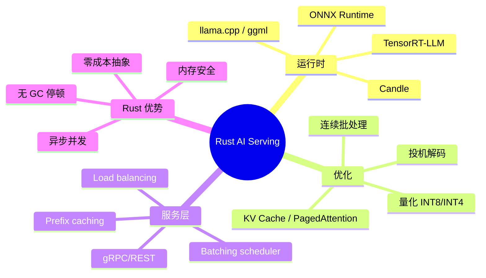

> **内容分级**: [专家级]

# Rust 在 AI 模型服务与推理系统中的应用

**EN**: Rust for AI Model Serving and Inference Systems
**Summary**: A systems-level guide to deploying and serving AI/ML models with Rust — covering ONNX Runtime, Candle, quantization strategies, batching, caching, and latency/throughput trade-offs in production inference pipelines.

> **Rust 版本**: 1.97.0+ (Edition 2024)
> **Bloom 层级**: L5-L7
> **权威来源**: 本文件为 `concept/` 权威页。
> **定位**: 聚焦**模型服务层**（model serving / inference serving），把 LLM system architecture 中的推理部分下沉到工程实现，对齐国际 ML 系统工程实践与 Rust 生态。
> **前置概念**: [LLM System Architecture](08_llm_system_architecture.md) · [MLOps and LLMOps](09_mlops_and_llmops.md) · [Concurrency](../../03_advanced/00_concurrency/01_concurrency.md) · [Async/Await](../../03_advanced/01_async/01_async.md) · [Performance Optimization](../../06_ecosystem/10_performance/01_performance_optimization.md)
> **后置概念**: [Rust in AI](05_rust_in_ai.md) · [AI Safety and Alignment](10_ai_safety_and_alignment.md) · [Custom Allocators](../../03_advanced/06_low_level_patterns/01_custom_allocators.md)

---

> **来源**: [Huyen — *Designing Machine Learning Systems*](https://www.oreilly.com/library/view/designing-machine-learning/9781098107956/) · [ONNX Runtime](https://onnxruntime.ai/) · [Hugging Face Candle](https://github.com/huggingface/candle) · [LLM Inference Survey (arXiv)](https://arxiv.org/abs/2401.00066) · [vLLM / PagedAttention](https://arxiv.org/abs/2309.06180) · [TensorRT-LLM](https://developer.nvidia.com/tensorrt-llm)

---

## 🧠 知识结构图



---

## 一、模型服务层核心组件

生产级模型服务不是简单加载 `.pt` 文件并调用 `forward`，而是一个多阶段流水线：

```text
Client Request
    ↓
[Tokenizer] → token ids
    ↓
[Scheduler] → batch / prefill / decode
    ↓
[Inference Engine] → logits / embeddings
    ↓
[Post-processing] → detokenize / filter
    ↓
Response
```

Rust 在 **Scheduler、网络层、缓存层、量化工具链** 中优势最大；核心算子通常仍依赖 CUDA/ROCm 内核。

---

## 二、Rust 生态中的推理运行时

| 运行时 | 定位 | Rust 绑定/实现 | 适用场景 |
|---|---|---|---|
| **ONNX Runtime** | 通用模型格式 | `ort` crate | 图像/语音/小模型 |
| **Candle** | 纯 Rust ML 框架 | `candle-core` | LLM、Embedding、训练 |
| **llama.cpp** | GGUF/GGML 量化模型 | `llama-cpp-rs` | 本地/边缘 LLM |
| **TensorRT-LLM** | NVIDIA 高性能推理 | 官方 Rust 绑定有限 | 数据中心 GPU |
| **burn** | 深度学习框架 | `burn` | 训练 + 推理 |

### 2.1 Candle 最小示例（概念骨架）

```rust,ignore
// 概念示例：Candle 加载模型并执行前向推理。
// 真实代码需对应 model files 与 tokenizer。
use candle_core::{Device, Tensor};
use candle_nn::VarMap;

fn inference_skeleton() -> anyhow::Result<()> {
    let device = Device::Cpu;
    // 占位：加载权重与 tokenizer
    let input_ids = Tensor::new(&[101u32, 2023, 2003, 1037, 3231, 102u32], &device)?;
    let _logits = model_forward(&input_ids, &device)?;
    Ok(())
}

fn model_forward(_input_ids: &Tensor, _device: &Device) -> anyhow::Result<Tensor> {
    todo!("load real weights and run forward")
}
```

> 本示例为骨架，真实运行需下载模型文件；使用 `ignore` 避免 CI 依赖外部权重。

---

## 三、推理优化策略

### 3.1 量化（Quantization）

```text
FP32  →  FP16  →  INT8  →  INT4 / GPTQ / AWQ
  ↓        ↓        ↓           ↓
精度最高   常用      精度损失可控   极致压缩
```

Rust 生态已支持 GGUF 格式（llama.cpp）和 Candle 的量化张量。量化选择是**精度、延迟、显存**的权衡。

### 3.2 连续批处理（Continuous Batching）

传统静态批处理等待所有请求到达固定 batch size；连续批处理允许在**每次 forward 之间**替换已完成的序列，提高 GPU 利用率。

```rust,ignore
// 概念骨架：Scheduler 在每次解码步决定 batch 内容
pub struct Scheduler {
    requests: Vec<Request>,
    kv_cache: KvCacheManager,
}

impl Scheduler {
    pub fn schedule(&mut self) -> Vec<&Request> {
        // 按优先级、长度、SLA 选择可合并的请求
        self.requests.iter().filter(|r| self.kv_cache.can_fit(r)).collect()
    }
}
```

### 3.3 KV Cache 与 PagedAttention

PagedAttention 把 KV cache 分成固定大小的 block，像虚拟内存一样按需分配，减少显存碎片。Rust 的精确内存控制使其适合实现类似的 cache manager。

---

## 四、服务架构模式

### 4.1 Rust 推理服务骨架

```rust,ignore
use axum::{extract::Json, response::IntoResponse, routing::post, Router};
use serde::Deserialize;

#[derive(Deserialize)]
struct GenerateRequest {
    prompt: String,
    max_tokens: usize,
}

async fn generate(Json(req): Json<GenerateRequest>) -> impl IntoResponse {
    // 提交到异步推理队列，等待结果
    let output = INFERENCE_QUEUE.submit(req.prompt, req.max_tokens).await;
    Json(output)
}

// async runtime + 独立推理线程/进程池是常见部署形态
```

> 使用 `ignore` 避免引入 axum/tokio 等依赖到 concept 代码块检查。

### 4.2 与 Python 服务对比

| 维度 | Python (FastAPI + vLLM/TGI) | Rust (Candle/ORT + tokio) |
|---|---|---|
| 启动延迟 | 中等 | 低 |
| GC 停顿 | 有 | 无 |
| 内存安全 | 依赖运行时 | 编译期保证 |
| 生态成熟度 | 极高 | 快速增长 |
| 适合场景 | 快速迭代、研究 | 高吞吐、低延迟、边缘 |

---

## 五、生产部署与治理

### 5.1 SLO / SLI 与可观测性

生产模型服务需要明确的**服务水平目标（SLO）**和**服务水平指标（SLI）**：

| SLI | 说明 | Rust 生态工具 |
|---|---|---|
| **延迟（Latency）** | TTFT / TPOT / P99 latency | `tokio::time`、`metrics`、OpenTelemetry |
| **吞吐（Throughput）** | tokens/s、requests/s | `prometheus`、自定义 histogram |
| **可用性（Availability）** | 成功请求比例 | `axum` health check、kube probes |
| **成本（Cost）** | $ / 1M tokens、GPU 利用率 | DCGM、NVML 绑定 |
| **能效（Energy）** | W / token、CO₂ / inference | MLCommons Power、NVIDIA Triton 能效指标 |

> **关键洞察**: Rust 的无 GC 停顿和零成本抽象使其在**延迟敏感**和**高吞吐**场景下更容易达成严格的 SLO。

### 5.2 模型版本管理与 A/B 测试

```text
模型注册表（如 MLflow / Hugging Face Hub）
    ↓
版本化模型工件（GGUF、ONNX、Safetensors）
    ↓
金丝雀部署 → A/B 测试 → 全量 rollout
    ↓
回滚策略（蓝绿 / 影子流量）
```

Rust 服务可通过 feature flag（如 `launchdarkly`、`unleash`）或配置文件实现模型版本路由。

### 5.3 安全与隐私边界

- **模型窃取**：限制 prompt 日志、限制输出 tokens 采样。
- **数据泄露**：避免在日志中记录 PII；使用差分隐私或联邦学习时明确边界。
- **提示注入**：对输入进行过滤、沙箱化工具调用。
- **供应链**：使用 `cargo vet` / `cargo audit` 审查推理运行时依赖。

### 5.4 国际权威来源对齐

| 来源 | URL | 对齐内容 |
|---|---|---|
| MLCommons Inference | https://mlcommons.org/benchmarks/inference/ | 推理性能与能效基准 |
| NVIDIA Triton | https://docs.nvidia.com/deeplearning/triton-inference-server/ | 数据中心推理服务架构 |
| Seldon Core | https://docs.seldon.io/seldon-core-2/ | Kubernetes 上 ML 部署与监控 |
| Model Cards | https://arxiv.org/abs/1810.03993 | 模型透明度与限制报告 |
| LLM System Survey | https://arxiv.org/abs/2303.18223 | LLM 训练与推理系统栈 |

---

## 六、反命题与边界

### 反例 1：用 Rust 重写所有训练代码

Rust 在**训练框架**生态（autograd、分布式训练、实验工具）仍远不如 PyTorch/JAX。当前更合理的策略是：Python 训练，Rust 服务。

### 反例 2：认为量化总是无代价

INT4 量化可能显著降低模型能力；对于需要高精度推理的任务（如代码生成、数学推理），应保留 FP16 或采用 QLoRA 等精细量化。

### 边界：Rust 不是 CUDA 内核开发首选

虽然 Rust 有 `cust`/`cudarc` 等 CUDA 绑定，但高性能 kernel 开发仍以 CUDA C++/Triton 为主。Rust 更适合编排这些 kernel。

---

## 七、国际权威参考

- **P1 学术/系统**
  - [Huyen — *Designing Machine Learning Systems*](https://www.oreilly.com/library/view/designing-machine-learning/9781098107956/)
  - [vLLM / PagedAttention (SOSP 2023)](https://arxiv.org/abs/2309.06180)
  - [LLM Inference Survey](https://arxiv.org/abs/2401.00066)
  - [LLM Serving Survey](https://arxiv.org/abs/2312.15234)

- **P0 官方/生态**
  - [ONNX Runtime](https://onnxruntime.ai/)
  - [Candle GitHub](https://github.com/huggingface/candle)
  - [TensorRT-LLM](https://developer.nvidia.com/tensorrt-llm)

- **P2 社区**
  - [Hugging Face Rust](https://huggingface.co/docs/candle/index)
  - [Rust ML](https://www.arewelearningyet.com/)

---

## 嵌入式测验

> **Q1**. PagedAttention 主要解决什么问题？
>
> - A. 模型训练速度
> - B. KV Cache 显存碎片与浪费
> - C. Tokenizer 精度
> - D. 数据加载
>
> <details><summary>答案</summary>B. 通过分页管理 KV cache，提高显存利用率。</details>

> **Q2**. Rust 在 AI 服务中的主要优势不包括？
>
> - A. 无 GC 停顿
> - B. 内存安全
> - C. 训练生态最成熟
> - D. 零成本并发抽象
>
> <details><summary>答案</summary>C. Rust 训练生态仍在追赶 Python。</details>

> **Q3**. 连续批处理相比静态批处理的主要收益是？
>
> - A. 提高模型精度
> - B. 提高 GPU 利用率
> - C. 减少模型参数量
> - D. 简化代码
>
> <details><summary>答案</summary>B. 允许在解码步之间动态替换已完成序列。</details>
