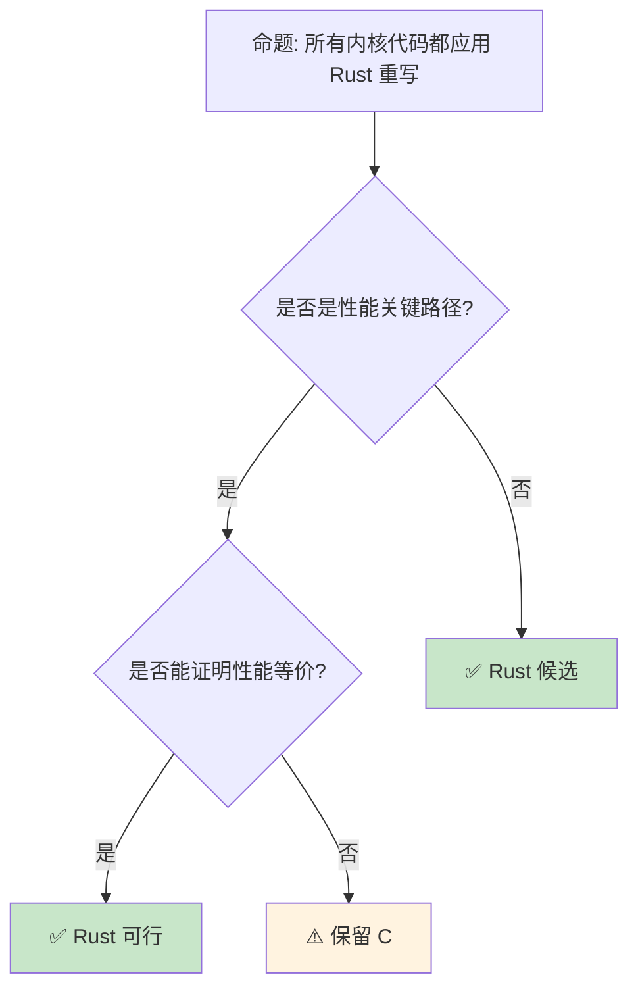
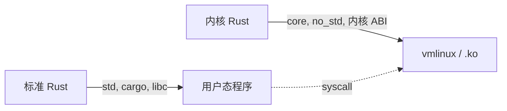

# Rust for Linux ：操作系统内核中的内存安全

> **内容重叠提示**: 本文与 [`docs/04_research/04_rust_for_linux.md`](../../../docs/04_research/04_rust_for_linux.md) 内容高度重叠。`docs/` 版本已改为重定向页；`concept/` 版本为项目权威主轨。
> **代码状态**: [示例级 — 已补充代码]
>
> **EN**: Operating Systems
> **Summary**: Operating Systems. Core Rust concept covering mechanism analysis, in-depth analysis, FFI interoperability.
>
> **受众**: [专家]
> **内容分级**: [综述级]
>
> **Bloom 层级**: L4-L5
> **权威来源**: 本文件为 `concept/` 权威页。
> **A/S/P 标记**: **A+S+P** — ApplicationStructureProcedure
> **双维定位**: P×Cre — 设计 Rust for Linux 架构
> **定位**: 深入分析 **Rust for Linux** 项目——如何将 Rust 引入 Linux 内核开发，从驱动程序编写、C 互操作到内核特定的安全保证，揭示系统编程范式的历史性转变。
> **前置概念**: [Unsafe](../../03_advanced/02_unsafe/03_unsafe.md) · [FFI](../../03_advanced/04_ffi/05_rust_ffi.md) · [Cross Compilation](../../06_ecosystem/05_systems_and_embedded/17_cross_compilation.md)
> **后置概念**: [Formal Methods](../../04_formal/02_separation_logic/04_rustbelt.md) · [Evolution](03_evolution.md)
> **定理链**: N/A — 描述性/综述性/导航性文档，不涉及形式化定理链
>
> **来源**: [Rust RFCs](https://github.com/rust-lang/rfcs) · [Inside Rust Blog](https://blog.rust-lang.org/inside-rust/) · [Rust Edition Guide](https://doc.rust-lang.org/edition-guide/index.html) · [Brown University — Interactive Rust Book](https://rust-book.cs.brown.edu/) · [Jung et al. — RustBelt: Securing the Foundations of Rust](https://plv.mpi-sws.org/rustbelt/popl18/) · [Itanium C++ ABI](https://itanium-cxx-abi.github.io/cxx-abi/abi.html)
---

> **来源**: [Rust for Linux](https://rust-for-linux.com/) ·
> [Linux Kernel Rust Documentation](https://www.kernel.org/doc/html/latest/rust/index.html) ·
> [LWN — Rust in the Linux Kernel](https://lwn.net/Articles/829858/) ·
> [Rust CVE Database](https://nvd.nist.gov/vuln/search/results?form_type=Basic&results_type=overview&search_type=all&isCpeNameSearch=false&query=rust) ·
> [Google — Rust in the Linux Kernel](https://security.googleblog.com/2021/04/rust-in-linux-kernel.html)

## 📑 目录

- [Rust for Linux ：操作系统内核中的内存安全（Memory Safety）](43_rust_for_linux.md)
  - [📑 目录](#-目录)
  - [一、核心概念](#一核心概念)
    - [1.1 为什么内核需要 Rust](#11-为什么内核需要-rust)
    - [1.2 Rust for Linux 架构](#12-rust-for-linux-架构)
    - [1.3 内核中的 unsafe 边界](#13-内核中的-unsafe-边界)
  - [二、技术细节](#二技术细节)
    - [2.1 C 互操作与绑定生成](#21-c-互操作与绑定生成)
    - [2.2 内核抽象层](#22-内核抽象层)
    - [2.3 驱动程序开发模型](#23-驱动程序开发模型)
  - [三、采用状态矩阵](#三采用状态矩阵)
    - [3.1 内核 Rust 实验正式结束（2025-12）](#31-内核-rust-实验正式结束2025-12)
    - [3.2 Linux 7.0 将 Rust 支持提升为 stable（2026-04）](#32-linux-70-将-rust-支持提升为-stable2026-04)
  - [四、与形式化工具的交叉（2026-06 更新）](#四与形式化工具的交叉2026-06-更新)
  - [五、反命题与边界分析](#五反命题与边界分析)
    - [5.1 反命题树](#51-反命题树)
    - [5.2 边界极限](#52-边界极限)
  - [六、常见陷阱](#六常见陷阱)
  - [七、来源与延伸阅读](#七来源与延伸阅读)
  - [相关概念文件](#相关概念文件)
  - [权威来源索引](#权威来源索引)
  - [十、边界测试：Rust for Linux 的编译错误](#十边界测试rust-for-linux-的编译错误)
    - 10.1 边界测试：内核模块（Module）的 `no_std` 与标准库缺失（编译错误）
    - [10.2 边界测试：内核锁的原子顺序与 `unsafe` 封装（编译错误）](#102-边界测试内核锁的原子顺序与-unsafe-封装编译错误)
    - [10.3 边界测试：内核模块（Module）的 `no_std` 与 `alloc` 的谨慎使用（编译错误）](#103-边界测试内核模块的-no_std-与-alloc-的谨慎使用编译错误)
    - 10.4 边界测试：内核锁的 `spinlock` 与睡眠的互斥（运行时（Runtime）死锁）
    - [10.5 边界测试：内核模块（Module）的 `no_std` 与 alloc 限制（编译错误）](#105-边界测试内核模块的-no_std-与-alloc-限制编译错误)
    - [补充定理链](#补充定理链)
  - [嵌入式测验（Embedded Quiz）](#嵌入式测验embedded-quiz)
    - [测验 1：Rust for Linux 项目的核心目标是什么？（理解层）](#测验-1rust-for-linux-项目的核心目标是什么理解层)
    - [测验 2：为什么 Linus Torvalds 对在内核中引入 Rust 持谨慎但开放的态度？（理解层）](#测验-2为什么-linus-torvalds-对在内核中引入-rust-持谨慎但开放的态度理解层)
    - [测验 3：Rust 驱动如何与 Linux 内核的 C API 交互？（理解层）](#测验-3rust-驱动如何与-linux-内核的-c-api-交互理解层)
    - [测验 4：目前 Linux 内核中已有哪些 Rust 代码？（理解层）](#测验-4目前-linux-内核中已有哪些-rust-代码理解层)
    - [测验 5：Rust for Linux 对 Rust 语言本身有什么反馈影响？（理解层）](#测验-5rust-for-linux-对-rust-语言本身有什么反馈影响理解层)
  - [认知路径](#认知路径)
    - [核心推理链](#核心推理链)
    - [反命题与边界](#反命题与边界)
  - [自 docs/06\_toolchain/06\_rust\_for\_linux\_tooling\_guide.md 合并的补充内容](#自-docs06_toolchain06_rust_for_linux_tooling_guidemd-合并的补充内容)
    - [工具链需求](#工具链需求)
    - [内核编译目标](#内核编译目标)
    - [内核模块（Module）编写基础](#内核模块编写基础)
      - [`#[no_std]` 与 `#[no_main]`](#no_std-与-no_main)
      - [`panic_handler`](#panic_handler)
      - [`alloc` 配置](#alloc-配置)
    - [与标准 Rust 开发的差异](#与标准-rust-开发的差异)

---

## 一、核心概念
>
>

### 1.1 为什么内核需要 Rust
>

```text
Linux 内核的安全现状:

  内存安全漏洞统计:
  ├── ~70% 的内核安全漏洞是内存安全问题
  ├── 缓冲区溢出、Use-after-free、NULL 指针解引用
  ├── 传统缓解措施: KASAN, KFENCE, CFI
  └── 但这些都是运行时检测，有性能开销

  Rust 的价值主张:
  ├── 编译期内存安全保证
  ├── 无运行时开销（零成本抽象）
  ├── 与 C 的 FFI 互操作
  └── 现代语言特性（泛型、模式匹配、错误处理）

  关键里程碑:
  ├── 2022: Rust 支持合并到 Linux 6.1
  ├── 2023: 首个 Rust 驱动程序（Android Binder）
  ├── 2024: 更多驱动程序（NVMe, GPU 等）
  ├── 2025-12: Linux Kernel Maintainers Summit 达成共识，内核 Rust 实验结束
  ├── 2026-04: Linux 7.0 正式发布并移除 Rust 的 experimental 标签
  └── 未来: 核心子系统的 Rust 重写

  反对意见与回应:
  ├── "学习曲线陡峭" → 但内核开发者已有能力
  ├── "编译时间增加" → 增量编译缓解
  ├── "双语言维护复杂" → 渐进式替换
  └── "生态不成熟" → 内核特定生态在成长
```

> **认知功能**: Rust for Linux 是**系统编程的范式转变**——它试图在不重写整个内核的情况下，逐步引入内存安全（Memory Safety）。
> [来源: [Google Security Blog — Rust in Linux](https://security.googleblog.com/2021/04/rust-in-linux-kernel.html)]

---

### 1.2 Rust for Linux 架构
>

```text
Rust for Linux 项目结构:

  内核树中的 Rust 支持:
  ├── rust/                     # Rust 核心支持
  │   ├── kernel/               # 内核抽象 crate
  │   ├── alloc/                # 内核分配器
  │   ├── bindings/             # C 绑定生成
  │   └── helpers.c             # C 辅助函数
  ├── drivers/                  # Rust 驱动程序
  │   └── android/binder/       # Android Binder（首个驱动）
  └── samples/rust/             # Rust 示例代码

  编译流程:
  ├── Kbuild 集成 Rust 编译
  ├── rust-bindgen 生成 C 头绑定
  ├── 链接时与 C 对象混合
  └── 使用 LLVM（与内核相同后端）

  关键设计决策:
  ├── 使用内核的内存分配器（非 libc）
  ├── 禁用 std（#![no_std]）
  ├── 自定义 panic 处理（oops）
  └── 与内核的错误码系统互操作
```

> **架构洞察**: Rust for Linux 不是**在外部编译 Rust 模块（Module）**——而是**深度集成到内核构建系统**中。
> [来源: [Linux Kernel Rust Docs](https://docs.kernel.org/rust/index.html)]

---

### 1.3 内核中的 unsafe 边界
>

```text
内核中的 unsafe 使用原则:

  必须 unsafe 的场景:
  ├── C 数据结构访问（绑定生成）
  ├── 硬件寄存器访问（MMIO）
  ├── 原始指针操作（页表、DMA）
  └── 内联汇编

  安全抽象层:
  ├── rust/kernel/ 提供安全包装
  ├── Device 抽象
  ├── FileOperations 抽象
  ├── SpinLock/Mutex 包装
  └── Allocator 集成

  安全保证:
  ├── 驱动级代码通常是 safe Rust
  ├── 底层绑定是 unsafe（但生成/审计一次）
  ├── 类型系统防止常见错误
  └── 编译期检查替代运行时检测

  示例对比:
  C 驱动:
    struct my_device *dev = container_of(file->private_data, ...);
    // 容易出错的指针运算

  Rust 驱动:
    let dev = file.private_data::<MyDevice>()?;
    // 类型安全，编译期检查
```

> **unsafe 洞察**: Rust for Linux 的**核心策略**是"unsafe 封装"——将 C API 的 unsafe 调用封装为 safe 抽象，使驱动开发者编写 safe Rust。
> [来源: [Rust for Linux — Safety](https://rust-for-linux.com/)]

---

## 二、技术细节

### 2.1 C 互操作与绑定生成
>

```text
绑定生成流程:

  C 头文件 → bindgen → Rust 绑定

  输入: include/linux/fs.h
  └── 输出: rust/bindings/generated/fs.rs

  bindgen 配置:
  ├── 白名单: 只生成需要的函数/类型
  ├── 类型映射: C 类型 → Rust 类型
  ├── 布局保证: #[repr(C)] 匹配
  └── 常量生成: #define → const

  手工调整:
  ├── bindgen 输出可能不完美
  ├── 需要手工添加 Send/Sync 标记
  ├── 添加生命周期注释
  └── 创建更符合 Rust 习惯的包装

  示例绑定:
  // C
  struct file_operations {
      ssize_t (*read)(struct file *, char __user *, size_t, loff_t *);
      // ...
  };

  // Rust (bindgen 生成)
  #[repr(C)]
  pub struct file_operations {
      pub read: Option<unsafe extern "C" fn(...) -> ssize_t>,
      // ...
  }
```

稳定 Rust 可编译的 `#![no_std]` 库示例：

```rust
#![no_std]

pub fn add(left: u64, right: u64) -> u64 {
    left + right
}

#[cfg(test)]
mod tests {
    use super::*;

    #[test]
    fn it_works() {
        assert_eq!(add(2, 2), 4);
    }
}
```

nightly 内核模块概念骨架（需要 Linux 源码与 `kernel` crate）：

```rust,ignore
#![no_std]
#![no_main]

extern crate alloc;

use kernel::prelude::*;

module! {
    type: MyModule,
    name: "my_module",
    author: "Rust for Linux",
    description: "A minimal kernel module",
    license: "GPL",
}

struct MyModule;

impl kernel::Module for MyModule {
    fn init(_module: &'static ThisModule) -> Result<Self> {
        pr_info!("Hello from Rust module!\n");
        Ok(MyModule)
    }
}
```

> **绑定洞察**: 自动绑定生成是 Rust for Linux **规模化的关键**——它使数千个 C API 可以被 Rust 调用。
> [来源: [rust-bindgen](https://rust-lang.github.io/rust-bindgen/)]

---

### 2.2 内核抽象层
>

```rust,ignore
// Rust 内核抽象示例（概念性）

use kernel::prelude::*;
use kernel::file_operations::FileOperations;
use kernel::sync::Mutex;

module! {
    type: MyDriver,
    name: b"my_driver",
    author: b"Developer",
    description: b"Example Rust driver",
    license: b"GPL",
}

struct MyDevice {
    data: Mutex<Vec<u8>>,
}

#[vtable]
impl FileOperations for MyDevice {
    fn read(
        &self,
        _file: &File,
        buf: &mut UserSlicePtrWriter,
        _offset: u64,
    ) -> Result<usize> {
        let data = self.data.lock();
        buf.write(&data)?;
        Ok(data.len())
    }

    fn write(
        &self,
        _file: &File,
        buf: &mut UserSlicePtrReader,
        _offset: u64,
    ) -> Result<usize> {
        let mut data = self.data.lock();
        let len = buf.read(&mut data)?;
        Ok(len)
    }
}

// 核心抽象:
// ├── kernel::sync: SpinLock, Mutex, Arc
// ├── kernel::file: File, VfsMount
// ├── kernel::device: Device, Class
// ├── kernel::error: Error, Result
// └── kernel::alloc: 内核内存分配
```

> **抽象洞察**: `kernel` crate 是 Rust for Linux 的**核心创新**——它提供了**类型安全**的内核 API 包装。
> [来源: [Rust for Linux Samples](https://github.com/Rust-for-Linux/linux/tree/rust/samples/rust)]

---

### 2.3 驱动程序开发模型
>

```text
Rust 驱动 vs C 驱动的对比:

  C 驱动开发:
  ├── 手动管理内存（kmalloc/kfree）
  ├── 错误码返回（-ENOMEM, -EINVAL）
  ├── 手动引用计数（kref）
  ├── 复杂的初始化/清理路径
  └── 容易遗漏错误处理

  Rust 驱动开发:
  ├── 所有权系统自动管理资源
  ├── Result 类型强制错误处理
  ├── Arc/Mutex 替代手动引用计数
  ├── Drop trait 自动清理
  └── 编译期保证资源释放

  开发流程:
  1. 编写 Rust 驱动代码（mostly safe）
  2. 使用 kernel crate 的抽象
  3. bindgen 处理 C API 绑定
  4. Kbuild 编译链接
  5. 加载模块并测试

  调试工具:
  ├── printk! / pr_info! / pr_err!
  ├── Rust panic → kernel oops
  ├── KASAN 仍适用
  └── 内核调试器（kgdb）
```

> **驱动洞察**: Rust 驱动的**核心优势**是**开发时安全**——许多在 C 中运行时（Runtime）才能发现的错误，在 Rust 中编译期就被阻止。
> [来源: [Android Binder in Rust](https://lwn.net/Articles/869019/)]

---

## 三、采用状态矩阵

```text
Rust for Linux 采用状态 (2024+):

  已合并内核子系统:
  ├── Rust 核心支持 (6.1+)
  ├── Android Binder 驱动
  ├── NVMe 驱动（部分）
  └── 示例驱动程序

  已合并内核子系统 (2024-2025):
  ├── Rust 核心支持 (6.1+)
  ├── Android Binder 驱动
  ├── NVMe 驱动（部分）
  └── 示例驱动程序

  进行中 (2025-2026):
  ├── GPU 驱动（DRM 子系统）
  ├── 网络驱动
  ├── 文件系统实验
  └── 核心调度器（长期目标）

  社区争议 (2026-05):
  ├── Linus Torvalds 表态: 对 Rust 在内核的推进速度保持审慎
  ├── 部分核心维护者质疑 Rust 抽象层增加的复杂度
  └── 争议焦点: `unsafe` 封装边界 vs. C 直接操作的可审查性

  主要贡献者:
  ├── Google (Android 团队)
  ├── Microsoft
  ├── Red Hat
  └── 社区独立开发者

  挑战:
  ├── C 代码的渐进式替换策略
  ├── 性能等价性证明
  ├── 维护者接受度（社区争议升温）
  └── 工具链集成（rustc 版本与内核同步）

  MSRV 策略与 Debian 14 Forky (2027):
  ├── Debian Stable 是 Rust for Linux 的 MSRV 基准
  ├── Debian 14 (codename: Forky) 预计 2027 年夏季发布
  ├── 假设 Debian Forky 包含 Rust 1.104.0，则内核 MSRV 可随之升级
  └── 当前 Rust for Linux 支持多个稳定工具链，每个工具链可访问不同的不稳定特性子集
```

> **MSRV 策略来源**: [Inside Rust — Program Management Update February 2026](https://blog.rust-lang.org/inside-rust/2026/03/27/program-management-update-2026-02/)（2026-03-27）
> Debian Stable 对 Rust for Linux 至关重要，因为它提供了内核开发所需的最小 Rust 版本基线。MSRV 升级后，内核可以采用新的稳定特性，消除维护多个条件编译路径的负担。
> **采用矩阵**: Rust for Linux 是**渐进式替换**——从外围驱动开始，逐步向核心子系统推进。
> [来源: [Rust for Linux — Status](https://rust-for-linux.com/)]

### 3.1 内核 Rust 实验正式结束（2025-12）

**[LWN / rust-for-linux, 2025-12-10]** 在 2025 年 Linux Kernel Maintainers Summit 上，内核维护者达成共识：Rust 在 Linux 内核中**不再是实验性语言**，而是内核的核心组成部分并将长期存在。Miguel Ojeda 随后提交文档补丁，移除了将 Rust 描述为 experimental 的段落。

核心论据：

- Rust 代码已在生产环境运行，部分知名 Linux 发行版已启用 Rust 支持；
- Android 已有数百万设备通过 ashmem 等模块（Module）运行 Rust 内核代码；
- 社区对 Rust 在内核中的长期存在达成零异议共识。

同时，Ojeda 也强调实验结束不等于所有问题都已解决：不同内核配置、架构、工具链组合仍有大量工作要做，GCC+LLVM 混合构建与即将到来的 GCC Rust 支持仍具实验性。

> **关键洞察**: 这一决定是 Rust for Linux 的**范式转折点**——它从“能否留在内核”的评估期进入“如何规模化共存”的治理期。对企业与发行版而言，这意味着投资 Rust 内核驱动的政策风险显著降低。
> **来源**: [LWN — The (successful) end of the kernel Rust experiment](https://lwn.net/Articles/1049831/) · [LKML — rust: conclude the Rust experiment](https://lkml.org/lkml/2025/12/13/38) · [git.kernel.org/linus/8aebac82933f](https://git.kernel.org/linus/8aebac82933f) · 可信度: ✅

### 3.2 Linux 7.0 将 Rust 支持提升为 stable（2026-04）

**[Linux 7.0 Release, 2026-04]** Linux 7.0 正式发布，其中一项显著变化是移除 Rust 支持的 experimental 状态，标志着 2025 年 Maintainers Summit 的共识在主线版本中落地。Linus Torvalds 在发布邮件中列举了多项架构与驱动改进，Rust 不再被标记为实验性即为其一。

> **来源**: [LWN — The 7.0 kernel has been released [已失效]]<!-- 原链接: https://lwn.net/Articles/... --> · [Linux Today — Linux Kernel 7.0 Officially Released](https://www.linuxtoday.com/blog/linux-kernel-7-0-officially-released-this-is-whats-new/) · 可信度: ⚠️ 二级来源转引

### 3.3 历史里程碑总览（自 `docs/04_research/04_rust_for_linux.md` 合并）

| 时间 | 事件 |
|------|------|
| 2020 | Rust for Linux 项目启动（Miguel Ojeda 发起） |
| 2021 | Rust 代码首次进入 Linux 6.1（实验性） |
| 2022-2024 | 实验阶段：驱动开发、工具链磨合、社区争议 |
| 2025 年底 | Linux 核心维护者达成一致：**Rust 实验结束** |
| 2026 年初 | Rust 正式成为 Linux 内核的**永久一级公民** |
| 2026-04 | Linux 7.0 正式发布并移除 Rust 的 experimental 标签 |

> **这意味着什么**：Rust 代码与 C 代码在内核中享有同等地位；内核维护者承诺长期支持 Rust 基础设施；第三方开发者可使用稳定的 `kernel` crate API 编写内核模块（Module）。

### 3.4 生产级驱动案例（自 `docs/04_research/04_rust_for_linux.md` 合并）

#### Android Binder IPC

- **用途**：Android 系统中进程间通信的核心机制
- **选择 Rust 的原因**：Binder 历史上存在大量复杂对象生命周期（Lifetimes）漏洞
- **状态**：已合并主线，投入生产
- **代码位置**：`drivers/android/binder.rs`

#### Apple GPU (Asahi)

- **用途**：Apple Silicon (M1/M2/M3) 的 Linux GPU 驱动
- **状态**：生产级，支持 OpenGL ES 3.1 / Vulkan 1.3
- **维护者**：Asahi Linux 团队

#### NVMe 基础设施

- **用途**：NVMe 存储控制器的基础框架
- **状态**：部分组件已 Rust 化，作为 C 驱动的补充

---

## 四、与形式化工具的交叉（2026-06 更新）

Rust for Linux 是 Rust 形式化工具与运行时（Runtime）检查的重要落地场景：

- **[Safety Tags](../../04_formal/02_separation_logic/33_safety_tags_in_formal.md)**：内核中存在大量 `unsafe` 边界，Safety Tags（RFC #3842）可将 `# Safety` 文档注释转化为机器可读契约，帮助内核维护者审查 `unsafe` 调用点。
- **[BorrowSanitizer](../../04_formal/02_separation_logic/34_borrow_sanitizer_in_formal.md)**：在 Rust/C 混合代码中检测别名模型违规，补充 Miri 无法覆盖的生产环境。
- **[Tree Borrows](../../04_formal/01_ownership_logic/36_tree_borrows_deep_dive.md)**：相比 Stacked Borrows 更适合内核中常见的复杂借用（Borrowing）模式，已被 Miri 支持。
- **[AutoVerus / Verus](../../04_formal/04_model_checking/24_autoverus.md)**：未来可用于验证内核抽象层（如 `kernel::sync`）的功能正确性。

> **趋势判断**：内核代码对工具链的可审查性要求极高，Safety Tags + BorrowSanitizer 的组合有望成为 Rust for Linux 进入核心子系统前的标准流程。

### 4.2 与 Ferrocene / 安全关键系统的关联（自 `docs/04_research/04_rust_for_linux.md` 合并）

| 项目 | 目标 | 关系 |
|------|------|------|
| **Rust for Linux** | 操作系统内核 | 生产级系统软件 |
| **Ferrocene** | 安全关键认证（ISO 26262, IEC 61508） | 提供认证工具链 |
| **Rust Foundation** | 生态安全、C++ 互操作 | 资助 Rust for Linux |
| **Sealed Rust** | 嵌入式安全 | 与内核安全互补 |

**协同趋势**：Rust for Linux 的成功为 Rust 在**最深层的系统软件**中建立了可信度，这反过来推动了 Ferrocene 等安全关键认证项目的接受度。

## 五、反命题与边界分析

### 5.1 反命题树
>



> **认知功能**: Rust for Linux 的**现实路径**是"渐进替换"——从安全性收益最大、性能影响最小的组件开始。
> [来源: [LWN — Rust in Linux](https://lwn.net/Articles/829858/)]

---

### 5.2 边界极限
>

```text
边界 1: 启动代码
├── 内核启动时 Rust 运行时未初始化
├── 早期启动代码必须用汇编/C
├── Rust 代码在内存管理初始化后可用
└── 缓解: 分阶段初始化

边界 2: 内联汇编
├── 某些架构需要内联汇编
├── Rust 支持内联汇编（stable）
├── 但语法与 GCC 不同
└── 缓解: 使用 C 包装函数

边界 3: 不稳定特性依赖
├── Rust for Linux 需要某些 nightly 特性
├── 内核要求编译器版本固定
├── 与 Rust 稳定版发布节奏不同步
├── **最新进展**: 截至 LPC 2025（2025-12），Linux 内核中 Rust 代码**仅剩 2 个不稳定特性**待稳定化：
│   ├── `arbitrary_self_types`（允许在 trait 方法中使用 `self: Box<Self>` 等自定义接收器类型）
│   └── `derive(CoercePointee)`（智能指针自动强制转换推导）
│   └── 其中仅 `arbitrary_self_types` 被允许在内核中全局使用
├── 其他已稳定化的关键特性：`asm!`（内联汇编）、`global_asm!`、`const_mut_refs`、裸指针算术等
└── 缓解: 维护稳定的编译器分支；随着 Rust 稳定化推进，内核将逐步消除对 nightly 的依赖 [来源: [LPC 2025 — Rust for Linux](https://lpc.events/event/19/contributions/2068/)]

边界 4: 调试工具链
├── GDB 对 Rust 支持有限
├── 内核调试器主要是 C 思维
├── Rust 符号和栈跟踪需要适配
└── 缓解: rust-gdb 脚本改善体验

边界 5: 社区接受度
├── 部分内核维护者反对引入 Rust
├── 双语言增加维护复杂性
├── 需要证明长期价值
└── 缓解: 成功案例和数据驱动
```

> **边界要点**: Rust for Linux 的边界主要与**启动代码**、**内联汇编（Inline Assembly）**、**编译器版本**、**调试工具**和**社区接受度**相关。
> [来源: [Rust for Linux — Challenges](https://rust-for-linux.com/)]

---

## 六、常见陷阱

```text
陷阱 1: 忽视 C 绑定的不安全性
  ❌ 直接调用 bindgen 生成的函数
     // 假设它们安全

  ✅ 在 safe 抽象层中包装
     // 验证前置条件

陷阱 2: 误解内核分配语义
  ❌ 使用标准库分配器
     // 内核中不可用

  ✅ 使用 kernel::alloc
     // 或内核的 kmalloc 包装

陷阱 3: 错误处理不当
  ❌ unwrap() 在内核代码中
     // panic 可能导致系统崩溃

  ✅ 使用 ? 和传播 Result
     // 内核 Error 类型映射

陷阱 4: 忽视并发模型差异
  ❌ 假设标准 Rust 并发原语可用
     // 内核调度不同

  ✅ 使用 kernel::sync 的原语
     // SpinLock、Mutex、RCU 包装

陷阱 5: 忘记模块许可证
  ❌ module! { ... } 中缺少 license
     // 内核拒绝加载

  ✅ 明确指定 GPL/等许可证
     // 内核模块要求
```

> **陷阱总结**: Rust for Linux 的陷阱主要与**C 绑定安全**、**内核分配器**、**panic 处理**、**并发原语**和**许可证**相关。
> [来源: [Rust for Linux — Getting Started](https://rust-for-linux.com/)]

---

## 七、来源与延伸阅读

| 来源 | 可信度 | 说明 |
| [Rust Standard Library](https://doc.rust-lang.org/std/index.html) | ✅ 一级 | 标准库参考 |
| [Rust By Example](https://doc.rust-lang.org/rust-by-example/index.html) | ✅ 一级 | 交互式教程 |
| [This Week in Rust](https://this-week-in-rust.org/) | ✅ 二级 | 社区动态 |

| [Rust Reference](https://doc.rust-lang.org/reference/introduction.html) | ✅ 一级 | 语言参考 |
|:---|:---:|:---|
| [Rust for Linux](https://rust-for-linux.com/) | ✅ 一级 | 项目主页 |
| [Linux Kernel Rust Docs](https://docs.kernel.org/rust/index.html) | ✅ 一级 | 内核文档 |
| [LWN — Rust in Linux](https://lwn.net/Articles/829858/) | ✅ 二级 | 深度报道 |
| [Google Security Blog](https://security.googleblog.com/2021/04/rust-in-linux-kernel.html) | ✅ 二级 | 动机说明 |
| [Android Binder Rust](https://lwn.net/Articles/869019/) | ✅ 二级 | 首个驱动 |
| [LWN — The (successful) end of the kernel Rust experiment](https://lwn.net/Articles/1049831/) | ✅ 二级 | 实验结束定调 |
| [LKML — rust: conclude the Rust experiment](https://lkml.org/lkml/2025/12/13/38) | ✅ 一级 | 文档移除 experimental 段落 |
| [Rust Foundation Blog](https://foundation.rust-lang.org/news/) | ✅ 二级 | 资助与生态动态 |
| Miguel Ojeda 的演讲 | — | Linux Plumbers Conference 2024-2025 |

### 7.1 学习路径建议

1. **基础**：掌握 Rust 所有权（Ownership）、生命周期（Lifetimes）、`no_std`、FFI
2. **入门**：阅读 `samples/rust/` 中的官方示例
3. **进阶**：尝试编写简单的字符设备驱动
4. **深入**：理解 `kernel` crate 的内存模型和并发抽象
5. **专家**：参与 Rust for Linux 邮件列表，贡献驱动代码

---

## 相关概念文件

- [Unsafe](../../03_advanced/02_unsafe/03_unsafe.md) — 不安全代码
- [FFI](../../03_advanced/04_ffi/05_rust_ffi.md) — 外部函数接口
- [Cross Compilation](../../06_ecosystem/05_systems_and_embedded/17_cross_compilation.md) — 交叉编译
- [RustBelt](../../04_formal/02_separation_logic/04_rustbelt.md) — 形式化验证

---

> **权威来源**: [Rust Reference](https://doc.rust-lang.org/reference/introduction.html), [The Rust Programming Language](https://doc.rust-lang.org/book/title-page.html)
>
> **权威来源对齐变更日志**: 2026-05-22 创建 [Authority Source Sprint Batch 10](../../00_meta/02_sources/international_authority_index.md)

**文档版本**: 1.2
**对应 Rust 版本**: 1.97.0+ (Edition 2024)
**最后更新**: 2026-06-20
**状态**: ✅ 权威来源对齐完成 (Batch 34)

---

## 权威来源索引

>
>
>
>
>

---

---

---

> **补充来源**

## 十、边界测试：Rust for Linux 的编译错误

### 10.1 边界测试：内核模块的 `no_std` 与标准库缺失（编译错误）

```rust,compile_fail
#![no_std]
#![no_main]

// ❌ 编译错误: 内核模块不能使用 std
use std::vec::Vec;

fn init() -> i32 {
    let mut v = Vec::new(); // Vec 需要全局分配器
    v.push(1);
    0
}
```

> **修正**: Linux 内核模块（Module）使用 `#![no_std]`，标准库（`std`）不可用，只有核心库（`core`）和分配库（`alloc`）。
> `Vec`、`String`、`Box` 来自 `alloc`，但要求全局分配器——内核中的全局分配器是 `kmalloc`/`kfree` 的 Rust 封装。
> 进一步限制：内核代码不能 panic（或 panic 必须调用 `BUG()`），不能使用 `unwrap()`，必须处理所有错误路径。
> `rust-for-linux` 项目提供 `kernel` crate，封装内核 API（`printk`、锁、工作队列、设备驱动抽象）。
> 这与用户空间 Rust 开发截然不同——内核 Rust 是"在更严酷的沙盒中编程"，但类型系统（Type System）仍提供内存安全（Memory Safety）和数据竞争自由。
> [来源: [Rust for Linux](https://rust-for-linux.com/)] ·
> [来源: [Linux Kernel Documentation](https://docs.kernel.org/rust/)]

### 10.2 边界测试：内核锁的原子顺序与 `unsafe` 封装（编译错误）

```rust,compile_fail
use kernel::sync::SpinLock;

struct DeviceData {
    counter: i32,
}

static DATA: SpinLock<DeviceData> = SpinLock::new(DeviceData { counter: 0 });

fn increment() {
    // ❌ 编译错误: SpinLockGuard 的生命周期管理
    let guard = DATA.lock();
    guard.counter += 1;
    // guard 在这里自动释放，但若需要跨函数传递:
    // send_guard_to_other_context(guard); // 可能死锁或 UAF
}
```

> **修正**:
> `rust-for-linux` 的 `SpinLock` 是内核自旋锁的安全封装：`lock()` 返回 `SpinLockGuard`，实现 `DerefMut` 允许可变访问，Drop 时释放锁。
> 关键约束：
>
> 1) `SpinLockGuard` 不能跨越 await 点（阻塞上下文）；
> 2) 不能发送到其他 CPU（锁的 CPU 亲和性）；
> 3) 中断上下文中必须使用 `irqsave` 变体（禁用中断防止死锁）。
> 这些约束部分通过类型系统（Type System）强制（`Send`/`Sync` bound），部分通过文档约定。
> 违反约束不是编译错误，而是运行时（Runtime）死锁或数据损坏——这是内核编程的本质：某些约束无法完全静态检查。
> 与用户空间的 `std::sync::Mutex`（可睡眠、跨线程安全）相比，内核锁更底层、约束更多。
> [来源: [Rust for Linux](https://rust-for-linux.com/)] ·
> [来源: [Linux Kernel Locking Documentation](https://docs.kernel.org/kernel-hacking/locking.html)]

### 10.3 边界测试：内核模块的 `no_std` 与 `alloc` 的谨慎使用（编译错误）

```rust,ignore
#![no_std]

extern crate alloc;
use alloc::vec::Vec;

fn init() -> i32 {
    // ❌ 编译错误/运行时失败: 内核中的 alloc 依赖全局分配器
    // 若内核配置无 slab allocator 或分配失败，panic
    let mut v = Vec::new();
    v.push(1);
    0
}
```

> **修正**:
>
> Linux 内核的 Rust 支持允许使用 `alloc`（`Vec`、`String`、`Box`），但内核环境比用户空间更严格：
>
> 1) 堆分配可能失败（内存紧张），`alloc` 的 `oom=panic` 策略在 kernel 中不可接受；
> 2) 分配是 GFP（Get Free Pages）标志敏感的（`GFP_KERNEL`、`GFP_ATOMIC`），`alloc` 默认使用 `GFP_KERNEL`（可睡眠），在中断上下文中非法；
> 3) 内存碎片问题（内核无用户空间的 `malloc` 自由）。`rust-for-linux` 提供内核特定的分配 API：`kmalloc`（GFP 敏感）、`kzalloc`（零初始化）、`kfree`（释放）。
> Rust 代码需使用这些 API 替代标准 `alloc`。这与 C 的内核模块（Module）（直接使用 `kmalloc`/`kfree`）或 eBPF 的受限内存（无堆分配，仅栈和 map）类似——内核编程的内存管理是核心技能。
> [来源: [Rust for Linux](https://rust-for-linux.com/)] ·
> [来源: [Linux Kernel Memory Management](https://docs.kernel.org/core-api/memory-allocation.html)]
>

### 10.4 边界测试：内核锁的 `spinlock` 与睡眠的互斥（运行时死锁）

```rust,compile_fail
use kernel::sync::SpinLock;

static DATA: SpinLock<i32> = SpinLock::new(0);

fn buggy_function() {
    let guard = DATA.lock();
    // ❌ 运行时死锁: 在持有 spinlock 时睡眠或调度
    // kernel::sched::schedule(); // 非法!

    // spinlock 是忙等待锁，持有期间不能睡眠
    // 若需睡眠，应使用 mutex 或 rwsem
    let _ = *guard;
}
```

> **修正**:
> Linux 内核的锁类型与使用上下文严格绑定：
>
> 1) **SpinLock**：忙等待，适用于短临界区、中断上下文、不可睡眠场景；
> 2) **Mutex**：可睡眠，适用于长临界区、进程上下文；
> 3) **RWSem**：读写锁，可睡眠。在持有 `SpinLock` 时睡眠是致命错误：当前 CPU 忙等待，调度器无法切换任务，若高优先级任务需同一锁，系统死锁。
>
> Rust 的 `rust-for-linux` 通过类型系统（Type System）部分防止：`SpinLockGuard` 不实现 `Send`（不能跨线程/CPU），但无法静态检测睡眠操作——这需要更高级的效果系统（effect system）。
> 这与用户空间的 `std::sync::Mutex`（总是可睡眠）或 `spin` crate 的 `Mutex`（用户态忙等待，无调度概念）不同——内核锁的上下文敏感性是底层编程的本质。
> [来源: [Rust for Linux](https://rust-for-linux.com/)] ·
> [来源: [Linux Kernel Locking](https://docs.kernel.org/kernel-hacking/locking.html)]

### 10.5 边界测试：内核模块的 `no_std` 与 alloc 限制（编译错误）

```rust,ignore
#![no_std]
extern crate alloc;

use alloc::vec::Vec;

fn kernel_function() {
    // ❌ 编译错误: 内核中 alloc 可能失败（OOM），需处理分配失败
    let mut v = Vec::new();
    v.push(1);
}

fn main() {}
```

> **修正**:
> Rust for Linux 项目将 Rust 引入 Linux 内核开发。
> 内核环境的特殊限制：
>
> 1) **无标准库**：`no_std` + 自定义 `alloc`；
> 2) **分配可能失败**：内核 OOM 处理不同于用户空间，`Vec::push` 可能 panic（内核 panic 是致命的）；
> 3) **无浮点数**：内核代码通常禁用浮点单元；
> 4) **并发原语**：使用内核的 `spinlock_t`、`mutex_t` 而非 Rust 的 `std::sync::Mutex`。
>
> Rust 内核模块的优势：
>
> 1) 内存安全（Memory Safety）（减少 CVE）；
> 2) 零成本抽象（Zero-Cost Abstraction）（与 C 代码同等性能）；
> 3) 现代类型系统（Type System）（减少逻辑错误）。
>
> 挑战：
>
> 1) ABI 兼容性（与 C 内核代码互操作）；
> 2) 编译时间（内核代码量大）；
> 3) 社区接受度。这与 Linux 内核的 C 代码（40 年历史，大量遗留代码）或 Windows 内核的 Rust 实验（Microsoft 也在探索）不同——Rust for Linux 是操作系统内核现代化的前沿尝试。
> [来源: [Rust for Linux](https://rust-for-linux.com/)] · [来源: [Linux Kernel Documentation](https://docs.kernel.org/rust/)]
> **过渡**: Rust for Linux ：操作系统内核中的内存安全（Memory Safety） 的深入理解需要结合具体代码实践，建议通过编写测试用例验证边界行为。

### 补充定理链

- **定理**: Rust for Linux ：操作系统内核中的内存安全（Memory Safety） 定义 ⟹ 类型安全保证

## 嵌入式测验（Embedded Quiz）

### 测验 1：Rust for Linux 项目的核心目标是什么？（理解层）

**题目**: Rust for Linux 项目的核心目标是什么？

<details>
<summary>✅ 答案与解析</summary>

允许在 Linux 内核中编写 Rust 驱动和模块，利用 Rust 的内存安全（Memory Safety）保证减少内核漏洞，同时保持与现有 C 代码的互操作性。
</details>

---

### 测验 2：为什么 Linus Torvalds 对在内核中引入 Rust 持谨慎但开放的态度？（理解层）

**题目**: 为什么 Linus Torvalds 对在内核中引入 Rust 持谨慎但开放的态度？

<details>
<summary>✅ 答案与解析</summary>

支持引入更安全语言减少漏洞，但担心：1) 编译器依赖和构建复杂度；2) 维护者学习成本；3) 与 C 的 FFI 边界安全性。
</details>

---

### 测验 3：Rust 驱动如何与 Linux 内核的 C API 交互？（理解层）

**题目**: Rust 驱动如何与 Linux 内核的 C API 交互？

<details>
<summary>✅ 答案与解析</summary>

通过 `bindgen` 生成 C 头文件的 Rust FFI 绑定，再编写安全的 Rust 包装层。`rust-for-linux` 项目提供了内核特有的 safe abstractions。
</details>

---

### 测验 4：目前 Linux 内核中已有哪些 Rust 代码？（理解层）

**题目**: 目前 Linux 内核中已有哪些 Rust 代码？

<details>
<summary>✅ 答案与解析</summary>

截至 2026 年，已有 Rust 编写的驱动（如 Android Binder、NVIDIA GPU 驱动的部分组件）和内核子系统。数量在稳步增长。
</details>

---

### 测验 5：Rust for Linux 对 Rust 语言本身有什么反馈影响？（理解层）

**题目**: Rust for Linux 对 Rust 语言本身有什么反馈影响？

<details>
<summary>✅ 答案与解析</summary>

推动了 `unsafe` 字段、更灵活的 FFI、更稳定的 ABI 等语言特性的优先级。内核需求正在塑造 Rust 的演进方向。
</details>

## 认知路径

> **认知路径**: 从 Rust 核心语言特性出发，经由 **Rust for Linux ：操作系统内核中的内存安全（Memory Safety）** 的生态/前沿实践，通向系统化工程能力与未来语言演进方向。

### 核心推理链

| 定理 | 前提 | 结论 | 置信度 |
|:---|:---|:---|:---|
| Rust for Linux ：操作系统内核中的内存安全（Memory Safety） 基础原理 ⟹ 正确选型 | 理解核心概念与适用边界 | 能在实际项目中做出合理决策 | 高 |
| Rust for Linux ：操作系统内核中的内存安全 选型实践 ⟹ 常见陷阱 | 忽视版本兼容性与生态成熟度 | 技术债务或迁移成本 | 中 |
| Rust for Linux ：操作系统内核中的内存安全 陷阱规避 ⟹ 深度掌握 | 持续跟踪社区演进与最佳实践 | 能进行架构设计与技术预研 | 高 |

> **过渡**: 掌握 Rust for Linux ：操作系统内核中的内存安全 的基础概念后，建议通过实际案例与源码阅读加深理解，建立从理论到实践的桥梁。
> **过渡**: 在工程实践中应用 Rust for Linux ：操作系统内核中的内存安全 时，务必评估生态成熟度、社区支持与长期维护风险，避免过度依赖实验性技术。
> **过渡**: Rust for Linux ：操作系统内核中的内存安全 反映了 Rust 生态系统的演进趋势与语言设计哲学，理解这些趋势有助于预判未来发展方向并做出前瞻性技术决策。

### 反命题与边界

> **反命题**: "Rust for Linux ：操作系统内核中的内存安全 是万能解决方案，适用于所有场景" —— 错误。任何技术选择都有权衡，需根据具体需求、团队能力与项目约束综合评估。

## 自 docs/06_toolchain/06_rust_for_linux_tooling_guide.md 合并的补充内容

> **合并说明**: 以下内容来自 `docs/06_toolchain/06_rust_for_linux_tooling_guide.md`（2026-05-08 创建），
> 专注 Rust for Linux 的工具链需求、裸机目标、`panic_handler`、`alloc` 配置等独特实操细节。

### 工具链需求
>
> **来源: [Rust Official Docs](https://doc.rust-lang.org/)**

在内核中编译 Rust 代码与常规用户态开发有本质区别，需要专门的工具链配置：

| 组件 | 说明 | 版本要求 |
| :--- | :--- | :--- |
| `rustc` | 需支持裸机目标（`no_std`） | 1.85.0+（内核分支可能锁定特定 nightly） |
| `bindgen` | 自动生成 C 头文件的 Rust FFI 绑定 | 0.70+ |
| `libclang` | `bindgen` 依赖的 C/C++ 前端 | LLVM 18+ |
| `rustfmt` | 内核代码格式化 | 与 `rustc` 配套 |
| `clippy` | 静态检查（内核配置下禁用部分 lint） | 与 `rustc` 配套 |
| `QEMU` | 调试与测试环境 | 8.0+ |

**关键配置**：

- 内核的 `Kconfig` 提供 `CONFIG_RUST` 选项，启用后会调用 `scripts/rust/` 下的工具链脚本。
- `bindgen` 的配置由内核 `Makefile` 和 `.bindgen` 规则统一管理，开发者通常无需手动调用。

---

### 内核编译目标
>
> **来源: [Rust Official Docs](https://doc.rust-lang.org/)**

Rust for Linux 使用裸机（bare-metal）目标，没有操作系统支撑的标准库：

| 目标三元组 | 架构 | 说明 |
| :--- | :--- | :--- |
| `x86_64-unknown-none` | x86_64 | 64 位 x86 裸机，无 `std` |
| `aarch64-unknown-none` | ARM64 | 64 位 ARM 裸机，无 `std` |
| `riscv64gc-unknown-none-elf` | RISC-V | 实验性支持 |

这些目标与常规 Linux 用户态目标（如 `x86_64-unknown-linux-gnu`）的核心差异：

- **无 `std`**：无法使用 `std::vec::Vec`、`std::string::String` 等，需通过内核封装的 `alloc` 或自定义容器替代。
- **无 `libc`**：内核直接运行在硬件之上，不依赖 C 标准库。
- **自定义链接脚本**：由内核 `Makefile` 和 `vmlinux.lds` 控制，Rust 编译出的目标文件（`.o`）与 C 目标文件统一链接。

---

### 内核模块编写基础
>
> **来源: [Rust Official Docs](https://doc.rust-lang.org/)**

一个最小的 Rust 内核模块需要显式处理以下语言层面约束：

#### `#[no_std]` 与 `#[no_main]`

> **来源: [Wikipedia - Type System](https://en.wikipedia.org/wiki/Type_system)**
>
> **来源: [Rust Official Docs](https://doc.rust-lang.org/)**

```rust,ignore
#![no_std]
#![no_main]
```

- `#![no_std]`：禁用标准库，仅保留 `core`。
- `#![no_main]`：内核模块不是独立可执行程序，没有用户态的 `main` 函数。

#### `panic_handler`

> **来源: [Wikipedia - Rust (programming language)](https://en.wikipedia.org/wiki/Rust_(programming_language))**
>
> **来源: [Rust Official Docs](https://doc.rust-lang.org/)**

内核中 `panic` 不能展开栈（unwinding），必须提供一个终止型的 panic handler：

```rust,ignore
use core::panic::PanicInfo;

#[panic_handler]
fn panic(_info: &PanicInfo) -> ! {
    // 内核 panic：记录日志并停止当前 CPU
    loop {}
}
```

> **版本标注**: Rust 1.81+ 引入了 `#[expect(panic_handler)]` 属性，内核工具链已跟进此 lint。

#### `alloc` 配置

> **来源: [Rust Reference - doc.rust-lang.org/reference](https://doc.rust-lang.org/reference/introduction.html)**
>
> **来源: [Rust Official Docs](https://doc.rust-lang.org/)**

若需要使用堆分配（如 `Box`、`Vec`），需显式定义全局分配器。内核提供专门的 `KernelAllocator`：

```rust,ignore
extern crate alloc;

use kernel::alloc::KernelAllocator;

#[global_allocator]
static ALLOCATOR: KernelAllocator = KernelAllocator;
```

---

### 与标准 Rust 开发的差异
>
> **[来源: [The Rust Programming Language](https://doc.rust-lang.org/book/title-page.html)]**

| 维度 | 标准 Rust（用户态） | Rust for Linux（内核态） |
| :--- | :--- | :--- |
| 标准库 | `std` + `alloc` + `core` | 仅 `core` + 可选 `alloc` |
| 全局分配器 | 默认 `System` | 必须显式指定 `KernelAllocator` |
| Panic 行为 | 默认 unwinding | 必须 `abort`（内核不支持栈展开） |
| `unsafe` 审计 | 业务逻辑层面 | 极度严格：每行 `unsafe` 需配对安全注释 |
| 浮点运算 | 自由使用 | 受限（内核上下文可能禁用 FPU） |
| 并发原语 | `std::sync::Mutex` | 内核 `spinlock_t` / `mutex_t` 封装 |
| 错误处理（Error Handling） | `Result<T, E>` + `?` | 内核错误码 `i32`（如 `-EINVAL`） |
| 测试框架 | `cargo test` | 内核 `kselftest` 或 `KUnit` |



---
