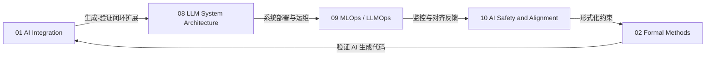

# L7 研究前沿与实验：04_research_and_experimental

> **EN**: L7 Research and Experimental
> **Summary**: Index for L7 research and experimental topics in Rust: AI integration, formal methods, language evolution, Rust in AI, and emerging system-level frontiers.
>
> **内容分级**: [综述级]
> **受众**: [专家]
> **Bloom 层级**: L5-L7
> **权威来源**: 本文件为 `concept/` 权威页。
>
> **前置概念**: [L7 前沿趋势层](../README.md)
> **后置概念**: N/A
>
> **Rust 版本**: 1.97.0+ (Edition 2024)

---

## 目录索引

本目录收录 L7 层中处于研究前沿或实验性质的主题，内容可能涉及 nightly 特性、新兴生态或尚未完全稳定的工程实践。

| 文件 | 主题 | 核心内容 | 状态 | 依赖的 L1-L6 | 反向驱动 |
|:---|:---|:---|:---|:---|:---|
| [01_ai_integration.md](01_ai_integration.md) | AI × Rust 集成 | 生成-验证闭环、确定性容器、编译器作为 RL 环境 | ✅ v1.0 | L3 Unsafe, L4 RustBelt, L6 工具链 | L3 Unsafe 契约精确化 |
| [02_formal_methods.md](02_formal_methods.md) | 形式化方法工业化 | Kani/Creusot/Verus、CI 集成、五层验证模型 | ✅ v1.0 | L4 RustBelt, L6 工具链, L3 Unsafe | L4 验证范围扩展 |
| [03_evolution.md](03_evolution.md) | 语言演进 | Edition、RFC、Const 泛型、GATs、Effects | ✅ v1.0 | L2 Trait/Generics, L5 范式定位 | L2 特性扩展 |
| [04_rust_for_linux.md](04_rust_for_linux.md) | Rust for Linux | 内核模块、驱动、内存安全操作系统 | ✅ v1.0 | L3 Unsafe, L6 工具链 | L3 Unsafe 内核场景 |
| [05_rust_in_ai.md](05_rust_in_ai.md) | Rust 在 AI 中的新兴角色 | 推理引擎、ONNX、WASM、AI 基础设施 | ✅ v1.0 | L3 Unsafe, L6 工具链 | L3 Unsafe/FFI 边界 |
| [06_rust_for_webassembly.md](06_rust_for_webassembly.md) | Rust × WebAssembly | wasm-bindgen、前端框架、边缘部署 | ✅ v1.0 | L3 Unsafe, L6 工具链 | L6 WASM 工具链 |
| [07_ebpf_rust.md](07_ebpf_rust.md) | eBPF / Aya / Rex | 内核可观测性、安全、网络 | ✅ v1.0 | L3 Unsafe, L6 工具链 | L3 Unsafe 内核场景 |
| [08_llm_system_architecture.md](08_llm_system_architecture.md) | LLM 系统架构 | RAG、Agent、Multi-Agent、向量数据库、Rust 映射 | ✅ v1.0 | L3 Unsafe, L6 工具链, L4 Formal | L3 Unsafe/类型契约 |
| [09_mlops_and_llmops.md](09_mlops_and_llmops.md) | MLOps / LLMOps | 模型生命周期、CI/CD、监控、漂移检测 | ✅ v1.0 | L3 Unsafe, L6 工具链, L2 Trait | L6 可观测性工具链 |
| [10_ai_safety_and_alignment.md](10_ai_safety_and_alignment.md) | AI 安全与对齐 | RLHF、Constitutional AI、形式化验证、Rust 可审计运行时 | ✅ v1.0 | L3 Unsafe, L4 RustBelt, L6 工具链 | L3/L4 安全边界 |

---

## 跨文件关系

> **认知功能**: 本索引展示 `04_research_and_experimental` 内 AI 相关前沿文件的关系。
> **使用建议**: 从 [AI 集成](01_ai_integration.md) 进入，按需深入 LLM 架构、运维或安全对齐。

---

> **权威来源**: [Rust Reference](https://doc.rust-lang.org/reference/introduction.html) · [The Rust Programming Language](https://doc.rust-lang.org/book/title-page.html) · [Rustonomicon](https://doc.rust-lang.org/nomicon/index.html)
>
> **文档版本**: 1.0
> **最后更新**: 2026-07-28
> **状态**: ✅ Phase 4 更新——新增 08/09/10 文件索引
