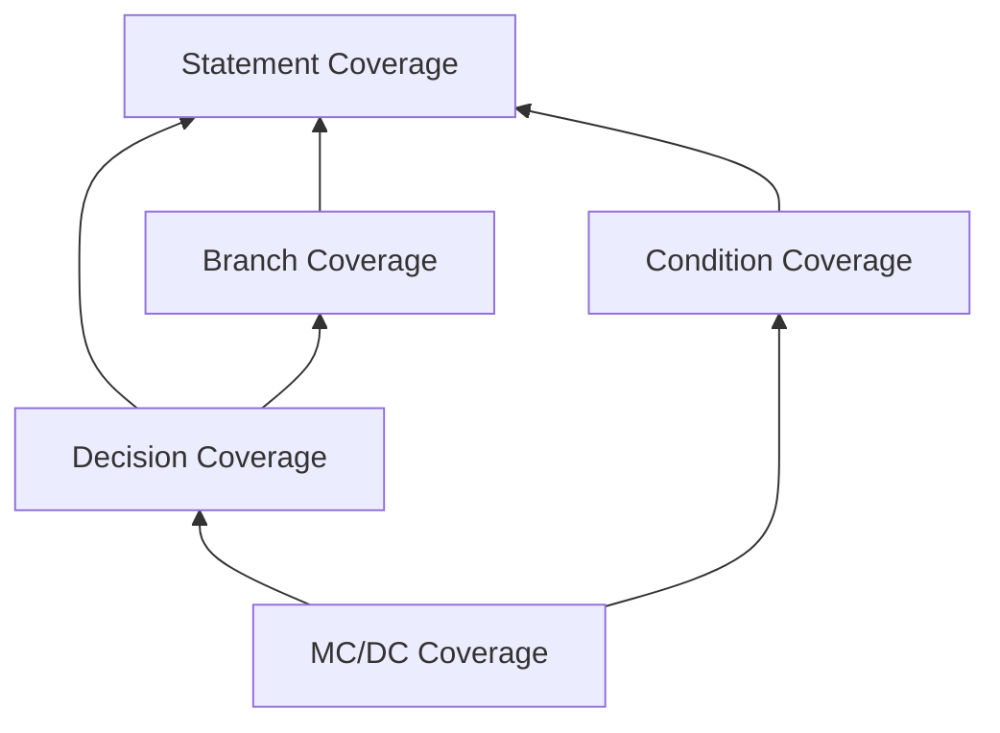
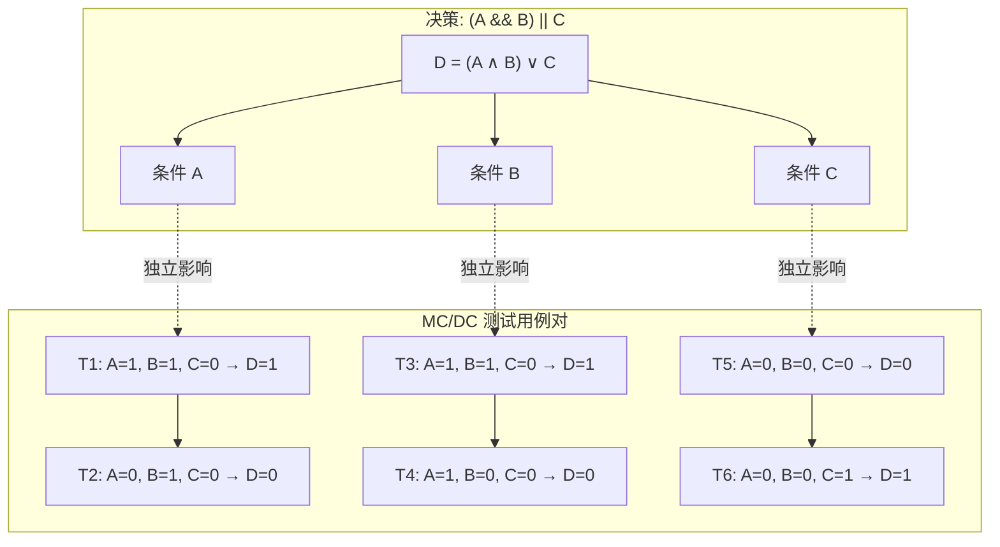
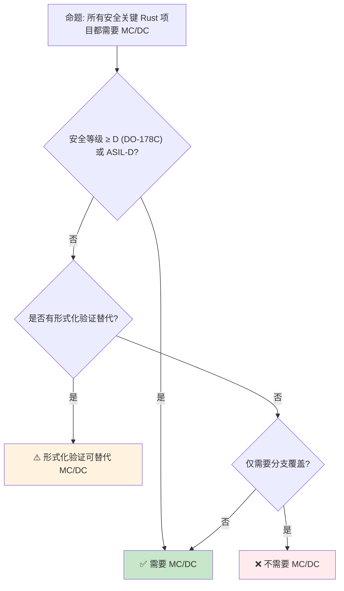

# MC/DC [来源: [DO-178C MC/DC](https://en.wikipedia.org/wiki/Modified_condition/decision_coverage [来源: [Rust Coverage](https://doc.rust-lang.org/rustc/instrument-coverage.html)])] [来源: [Wikipedia — MC/DC](https://en.wikipedia.org/wiki/Modified_condition/decision_coverage)] Coverage 概念预研：安全关键 Rust 的覆盖率 [来源: [grcov](https://github.com/mozilla/grcov)]验证

> **Bloom 层级**: 分析 → 评价
> **定位**: 探讨 Modified Condition/Decision Coverage（MC/DC）作为**安全关键软件验证**核心指标的形式化语义，以及 Rust 编译器实现 MC/DC 覆盖率的技术路径。
> **前置概念**: [Unsafe Rust](../03_advanced/03_unsafe.md) · [Version Tracking](./05_rust_version_tracking.md)
> **后置概念**: [Formal Methods](./02_formal_methods.md) · [Rust for Linux](../06_ecosystem/04_application_domains.md)

---

> **来源**: [DO-178C [来源: [FAA DO-178C](https://www.faa.gov/aircraft/air_cert/design_approvals/criteria/software)] / ED-12C](<https://www.rtca.org/product/do-178c/>) · [ISO 26262](https://www.iso.org/standard/68383.html) · [Rust Tracking Issue #124656](https://github.com/rust-lang/rust/issues/124656) · [MCDC [来源: [FAA MC/DC](https://www.faa.gov/aircraft/air_cert/design_approvals/criteria/software)] Wikipedia](<https://en.wikipedia.org/wiki/Code_coverage>) · [NASA Software Safety Guidebook](https://ntrs.nasa.gov/citations/20030093620)

## 📑 目录
>
> [来源: [Rust Reference](https://doc.rust-lang.org/reference/)]

- [MC/DC \[来源: \[DO-178C MC/DC\](https://en.wikipedia.org/wiki/Modified\_condition/decision\_coverage \[来源: Rust Coverage\])\] \[来源: Wikipedia — MC/DC\] Coverage 概念预研：安全关键 Rust 的覆盖率 \[来源: grcov\]验证](#mcdc-来源-do-178c-mcdchttpsenwikipediaorgwikimodified_conditiondecision_coverage-来源-rust-coverage-来源-wikipedia--mcdc-coverage-概念预研安全关键-rust-的覆盖率-来源-grcov验证)
  - [📑 目录](#-目录)
  - [一、核心概念](#一核心概念)
    - [1.1 覆盖率等级的层次结构](#11-覆盖率等级的层次结构)
    - [1.2 MC/DC 的数学定义](#12-mcdc-的数学定义)
    - [1.3 Rust 编译器实现路径](#13-rust-编译器实现路径)
  - [二、形式化语义](#二形式化语义)
    - [2.1 独立影响的形式化](#21-独立影响的形式化)
    - [2.2 与编译器优化的冲突](#22-与编译器优化的冲突)
  - [三、跨语言对比](#三跨语言对比)
  - [四、反命题与边界分析](#四反命题与边界分析)
    - [4.1 反命题树](#41-反命题树)
    - [4.2 边界极限](#42-边界极限)
  - [五、演进路线与预测](#五演进路线与预测)
  - [六、来源与延伸阅读](#六来源与延伸阅读)
  - [相关概念文件](#相关概念文件)

---

## 一、核心概念
>
> [来源: [Rust Reference](https://doc.rust-lang.org/reference/)]
>
> [来源: [Rust Reference](https://doc.rust-lang.org/reference/)]

### 1.1 覆盖率等级的层次结构
> **[来源: [Rust Reference](https://doc.rust-lang.org/reference/)]**

软件测试中的覆盖率形成严格的**层次包含关系**：



> **认知功能**: 此图展示覆盖率等级的**层次包含关系**——高层覆盖隐含低层覆盖，但反之不成立。MC/DC 位于层次顶端，要求最严格。
> [来源: [Rust Reference](https://doc.rust-lang.org/reference/)]
> **使用建议**: 安全关键项目（航空、汽车、医疗）要求 MC/DC；一般项目语句覆盖或分支覆盖即可。
> **关键洞察**: 覆盖率等级不是"越多越好"，而是"足够证明安全性"。MC/DC 的严格性来源于其对**条件独立性**的验证。
> [来源: [DO-178C](https://www.rtca.org/product/do-178c/) · [ISO 26262](https://www.iso.org/standard/68383.html)]

---

### 1.2 MC/DC 的数学定义
> **[来源: [The Rust Programming Language](https://doc.rust-lang.org/book/)]**

MC/DC（Modified Condition/Decision Coverage）要求：

> **定义**: 对于每个决策中的每个条件，必须存在**至少一对测试用例**，使得：
>
> 1. 该条件的取值不同（true vs false）
> 2. 其他所有条件的取值相同
> 3. 决策的结果不同
>
> 即：每个条件必须**独立影响**决策结果。
> [来源: [DO-178C Annex MC](https://www.rtca.org/product/do-178c/)]

**示例**：

```ignore
// 决策: A && B || C
// 需要验证 A、B、C 各自独立影响结果

// A 的独立影响: 改变 A，保持 B/C 不变，结果改变
// (A=true, B=false, C=false) → true  && false || false = false
// (A=false, B=false, C=false) → false && false || false = false
// ❌ 结果未改变！A 不独立影响此决策

// 正确的 A 独立影响对:
// (A=true,  B=true, C=false)  → true  && true  || false = true
// (A=false, B=true, C=false)  → false && true  || false = false
// ✅ A 独立影响
```

> **形式化表述**: 设决策 `D = f(c₁, c₂, ..., cₙ)`，则 MC/DC 要求：
> ∀i ∈ {1, ..., n}, ∃ 测试对 (t₁, t₂):
> cᵢ(t₁) ≠ cᵢ(t₂) ∧ (∀j≠i, cⱼ(t₁) = cⱼ(t₂)) ∧ D(t₁) ≠ D(t₂)
> [来源: [NASA Software Safety Guidebook](https://ntrs.nasa.gov/citations/20030093620)]

---

### 1.3 Rust 编译器实现路径
> **[来源: [Rust Standard Library](https://doc.rust-lang.org/std/)]**

Rust 编译器通过 `llvm-cov` 基础设施实现覆盖率检测。MC/DC 支持的实现路径：

```text
当前状态:
├── ✅ Statement Coverage (已支持)
├── ✅ Branch Coverage (已支持)
├── ✅ Function Coverage (已支持)
├── 🟡 MC/DC Coverage (跟踪中 #124656)
│   ├── LLVM IR 插桩: 已完成原型
│   ├── 条件提取: 开发中
│   ├── 测试用例对生成: 待实现
│   └── 报告生成: 待实现
└── 🔴 MCC (Multiple Condition Coverage) — 无计划
```

> **实现挑战**:
>
> 1. **短路求值**: `A && B` 中若 `A=false` 则 `B` 不执行，如何判定 B 的"独立影响"？
> 2. **编译器优化**: 常量折叠、死代码消除会改变条件结构
> 3. **模式匹配**: Rust 的 `match` 表达式条件提取比 C 的 `if` 更复杂
> [来源: [Rust Tracking Issue #124656](https://github.com/rust-lang/rust/issues/124656)]

---

## 二、形式化语义
>
> [来源: [Rust Reference](https://doc.rust-lang.org/reference/)]

### 2.1 独立影响的形式化
> **[来源: [Rustonomicon](https://doc.rust-lang.org/nomicon/)]**



> **认知功能**: 此图展示 MC/DC 的核心机制——通过精心设计的测试用例对，验证每个条件是否**独立影响**决策结果。
> [来源: [Rust Reference](https://doc.rust-lang.org/reference/)]
> **使用建议**: 编写 MC/DC 测试时，按此图方法为每个条件构造一对测试用例，确保三要素（条件变、其他不变、结果变）同时满足。
> **关键洞察**: MC/DC 的测试用例数随条件数线性增长（n+1 对），而非 MCC 的指数增长（2ⁿ 对）。这是"修改后"（Modified）的含义——在完整条件覆盖和测试可行性之间取得平衡。
> [来源: [DO-178C Annex MC](https://www.rtca.org/product/do-178c/)]

---

### 2.2 与编译器优化的冲突
> **[来源: [Rust By Example](https://doc.rust-lang.org/rust-by-example/)]**

```rust
// 源代码
fn decision(a: bool, b: bool, c: bool) -> bool {
    a && b || c
}

// 编译器优化后（常量折叠示例）:
// 若 a 被内联为 true:
// fn decision(b: bool, c: bool) -> bool { b || c }
// 原条件 A 消失！MC/DC 如何验证？
```

> **定理**: 编译器优化可能消除 MC/DC 要求的条件独立性验证目标。
> **证明**: 常量传播将 `A && B` 中 `A=true` 替换为 `B`。此时原条件 A 不再存在于生成的代码中，MC/DC 要求验证 A 的独立影响变得不可能（或需要回溯到源代码级别）。
> **解决方案**: MC/DC 插桩必须在**源代码级别**或**优化前 IR 级别**进行，而非优化后的机器码。
> [来源: [Rust Tracking Issue #124656](https://github.com/rust-lang/rust/issues/124656)]

---

## 三、跨语言对比
>
> [来源: [Rust Reference](https://doc.rust-lang.org/reference/)]
>
> [来源: [Rust Reference](https://doc.rust-lang.org/reference/)]

| 语言/工具 | MC/DC 支持 | 实现方式 | 标准合规 |
|:---|:---:|:---|:---:|
| **C/C++ (Gcov)** | ✅ | GCC/Clang `-fcondition-coverage` | DO-178C, ISO 26262 |
| **Ada (GNATcoverage)** | ✅ | 源码级插桩 | DO-178C |
| **Rust (llvm-cov)** | 🟡 跟踪中 | LLVM IR 插桩 (#124656) | 待认证 |
| **Java (JaCoCo)** | ❌ | 仅分支覆盖 | — |
| **Python (Coverage.py)** | ❌ | 仅语句/分支覆盖 | — |

> **来源**: [Gcov 文档](https://gcc.gnu.org/onlinedocs/gcc/Gcov.html) · [GNATcoverage](https://docs.adacore.com/gnatcoverage-docs/html/gnatcoverage.html) · [llvm-cov](https://llvm.org/docs/CommandGuide/llvm-cov.html)

---

## 四、反命题与边界分析
>
> [来源: [Rust Reference](https://doc.rust-lang.org/reference/)]
>
> [来源: [Rust Reference](https://doc.rust-lang.org/reference/)]

### 4.1 反命题树
> **[来源: [Rust Cookbook](https://rust-lang-nursery.github.io/rust-cookbook/)]**



> **认知功能**: 此决策树帮助项目管理者判断是否需要 MC/DC。核心判断标准是安全等级和是否有形式化验证替代。
> [来源: [Rust Reference](https://doc.rust-lang.org/reference/)]
> **使用建议**: DO-178C Level A/B 或 ISO 26262 ASIL-D 项目必须 MC/DC；低等级项目可用分支覆盖替代；使用 Kani/Creusot 形式化验证的项目可用证明替代测试覆盖。
> **关键洞察**: MC/DC 不是目的，而是**安全论证的手段**。形式化验证提供更强的保证，在某些场景下可替代 MC/DC。
> [来源: 💡 原创分析]

---

### 4.2 边界极限
> **[来源: [crates.io](https://crates.io/)]**

```text
边界 1: 短路求值与 MC/DC
├── A && B: A=false 时 B 不执行
├── 但 MC/DC 仍要求验证 B 的独立影响
└── 解决方案: 使用屏蔽（masking）分析，识别不可达条件对

边界 2: Rust 模式匹配的 MC/DC
├── match x { A | B => ..., C if guard => ... }
├── 条件提取比 C 的 if-else 更复杂
└── 需要专门的模式覆盖分析工具

边界 3: 异步代码的 MC/DC
├── async/await 的控制流由状态机驱动
├── 传统的条件覆盖分析不直接适用
└── 需要扩展到状态机转换覆盖
```

> **边界要点**: Rust 的独特语言特性（模式匹配、短路求值、异步状态机）为 MC/DC 实现带来额外挑战，需要在通用 MC/DC 框架上扩展 Rust 特定的分析。
> [来源: [Rust Tracking Issue #124656](https://github.com/rust-lang/rust/issues/124656)]

---

## 五、演进路线与预测
>
> [来源: [Rust Reference](https://doc.rust-lang.org/reference/)]

| 里程碑 | 状态 | 预计时间 | 依赖 |
|:---|:---:|:---|:---|
| LLVM MC/DC IR 插桩 | 🟡 原型 | 2025 | LLVM 18+ |
| rustc 条件提取 | 🟡 开发中 | 2026 | #124656 |
| `cargo llvm-cov --mcdc` 支持 | ⬜ | 2026–2027 | rustc 支持 |
| 报告生成（HTML/LCOV） | ⬜ | 2027 | 插桩稳定 |
| DO-178C 工具认证 | ⬜ | 2028+ | 工业需求 |
| ISO 26262 合规 | ⬜ | 2028+ | 汽车 Rust 采用 |

> **预测**: Rust MC/DC 的实现路径参考 C/C++ 的 `-fcondition-coverage`。关键挑战是**模式匹配的覆盖分析**和**编译器优化的兼容性**。预期 2027 年可用 nightly，2028+ 达到工业认证水平。
> [来源: 💡 原创分析 · [Rust Tracking Issue #124656](https://github.com/rust-lang/rust/issues/124656)]

---

## 六、来源与延伸阅读
>
> [来源: [Rust Reference](https://doc.rust-lang.org/reference/)]

| 来源 | 可信度 | 说明 |
| [Rust Reference](https://doc.rust-lang.org/reference/) | ✅ 一级 | 语言参考 |
| [Rust By Example](https://doc.rust-lang.org/rust-by-example/) | ✅ 一级 | 交互式学习 |
| [RFC Book](https://rust-lang.github.io/rfcs/) | ✅ 一级 | RFC 文档 |
| [Rust Cookbook](https://rust-lang-nursery.github.io/rust-cookbook/) | ✅ 二级 | 实践配方 |
| [This Week in Rust](https://this-week-in-rust.org/) | ✅ 二级 | 社区动态 |

| [Rust Standard Library](https://doc.rust-lang.org/std/) | ✅ 一级 | 标准库参考 |
| [Rust By Example](https://doc.rust-lang.org/rust-by-example/) | ✅ 一级 | 交互式教程 |
| [This Week in Rust](https://this-week-in-rust.org/) | ✅ 二级 | 社区动态 |

| [Rust Reference](https://doc.rust-lang.org/reference/) | ✅ 一级 | 语言参考 |
|:---|:---:|:---|
| [DO-178C / ED-12C](https://www.rtca.org/product/do-178c/) | ✅ 一级 | 航空软件标准，MC/DC 定义来源 |
| [ISO 26262](https://www.iso.org/standard/68383.html) | ✅ 一级 | 汽车功能安全标准 |
| [Rust Tracking Issue #124656](https://github.com/rust-lang/rust/issues/124656) | ✅ 一级 | rustc MC/DC 实现跟踪 |
| [NASA Software Safety Guidebook](https://ntrs.nasa.gov/citations/20030093620) | ✅ 一级 | 软件安全实践指南 |
| [Gcov Documentation](https://gcc.gnu.org/onlinedocs/gcc/Gcov.html) | 🔍 三级 | C/C++ 覆盖率工具参考 |
| [GNATcoverage](https://docs.adacore.com/gnatcoverage-docs/html/gnatcoverage.html) | 🔍 三级 | Ada 覆盖率工具参考 |

---

## 相关概念文件
>
> [来源: [Rust Reference](https://doc.rust-lang.org/reference/)]
>
> [来源: [Rust Reference](https://doc.rust-lang.org/reference/)]

- [Unsafe Rust](../03_advanced/03_unsafe.md) — 安全关键代码的 unsafe 边界
- [Formal Methods](./02_formal_methods.md) — 形式化验证替代方案
- [Version Tracking](./05_rust_version_tracking.md) — Rust 版本特性演进
- [Application Domains](../06_ecosystem/04_application_domains.md) — 安全关键应用领域

---

> **权威来源**: [DO-178C](https://www.rtca.org/product/do-178c/), [ISO 26262](https://www.iso.org/standard/68383.html), [Rust Tracking Issue #124656](https://github.com/rust-lang/rust/issues/124656)
>
> **权威来源对齐变更日志**: 2026-05-21 创建，对齐 Rust 1.96.0+ (Edition 2024)

**文档版本**: 1.0
**对应 Rust 版本**: 1.96.0+ (Edition 2024)
**最后更新**: 2026-05-21
**状态**: ✅ 概念文件创建完成

---

## 权威来源索引

> **[来源: [Rust Project Goals 2026](https://rust-lang.github.io/rust-project-goals/2026/)]**
>
> **[来源: [Rust Blog](https://blog.rust-lang.org/)]**
>
> **[来源: [Rust Reference](https://doc.rust-lang.org/reference/)]**
>
> **[来源: [The Rust Programming Language](https://doc.rust-lang.org/book/)]**
>
> **[来源: [Rust Standard Library](https://doc.rust-lang.org/std/)]**
>

---

> **[来源: [Rust Reference](https://doc.rust-lang.org/reference/)]**

> **[来源: [The Rust Programming Language](https://doc.rust-lang.org/book/)]**

> **[来源: [Rust Standard Library](https://doc.rust-lang.org/std/)]**

> **[来源: [Rustonomicon](https://doc.rust-lang.org/nomicon/)]**

> **[来源: [Rust By Example](https://doc.rust-lang.org/rust-by-example/)]**

> **[来源: [Rust Cookbook](https://rust-lang-nursery.github.io/rust-cookbook/)]**

---

> **[来源: [Rust Reference](https://doc.rust-lang.org/reference/)]**

> **[来源: [The Rust Programming Language](https://doc.rust-lang.org/book/)]**

---

> **[来源: [Rust Reference](https://doc.rust-lang.org/reference/)]**

> **[来源: [The Rust Programming Language](https://doc.rust-lang.org/book/)]**

> **[来源: [Rust Standard Library](https://doc.rust-lang.org/std/)]**

