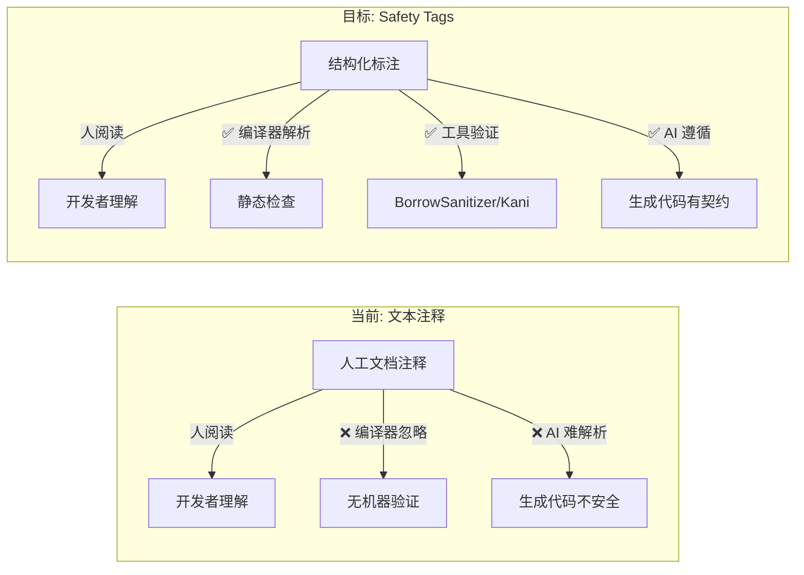
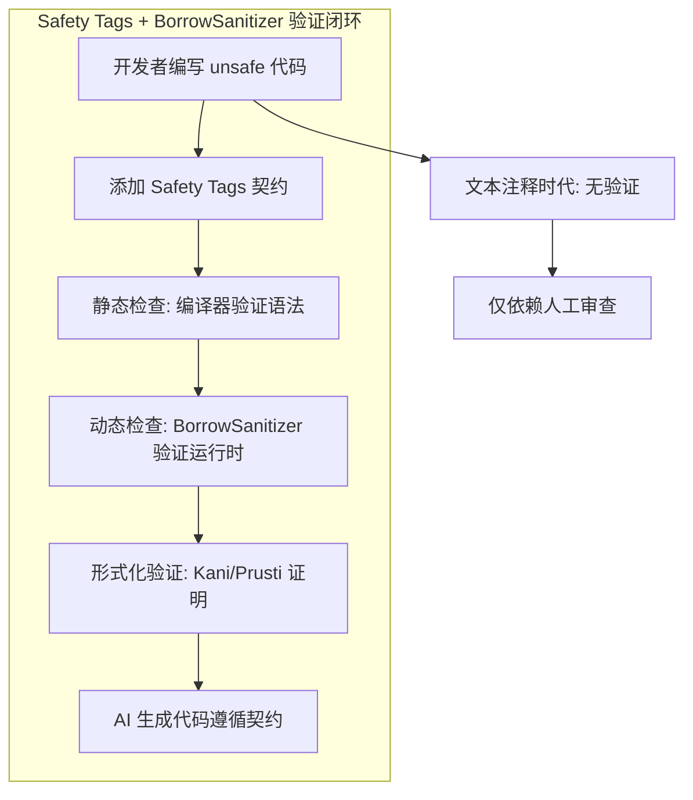
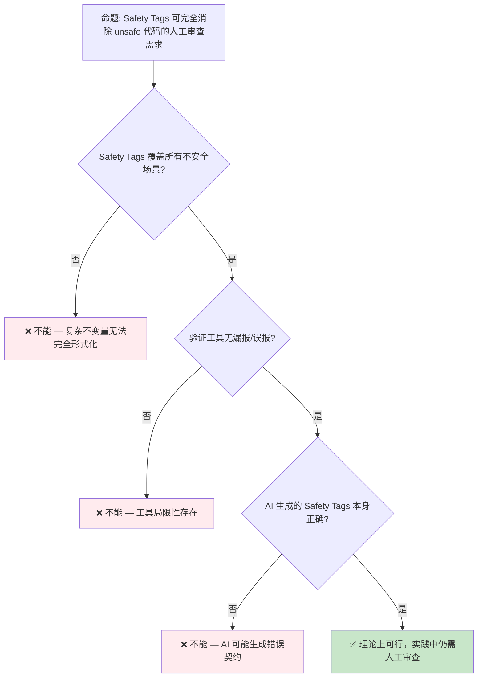

# Safety Tags 概念预研：Unsafe 契约的机器可读标注

> **Bloom 层级**: 分析 → 评价
> **定位**: 探讨 Safety Tags 作为 Rust **unsafe 代码契约**的机器可读标注机制，从人工文档注释演进为编译器可理解、工具可验证的安全契约格式。
> **前置概念**: [Unsafe Rust](../03_advanced/03_unsafe.md) · [BorrowSanitizer](./20_borrowsanitizer_preview.md)
> **后置概念**: [Formal Methods](./02_formal_methods.md) · [AI Integration](./01_ai_integration.md)

---

> **来源**: [Rust RFC: Safety Tags](https://github.com/rust-lang/rfcs/pull/) · [Rust Project Goals 2026](https://rust-lang.github.io/rust-project-goals/2026/) · [Rust Internals — Safety Annotations](https://internals.rust-lang.org/) · [Rust for Linux](https://rust-for-linux.com/) · [Prusti: Deductive Verification for Rust](https://www.pm.inf.ethz.ch/publications/getpdf.php?bibname=Own&id=AstrauskasMuellerPoliSummers21.pdf)

## 📑 目录

- [Safety Tags 概念预研：Unsafe 契约的机器可读标注](#safety-tags-概念预研unsafe-契约的机器可读标注)
  - [📑 目录](#-目录)
  - [一、核心概念](#一核心概念)
    - [1.1 问题定义：Unsafe 契约的表达缺口](#11-问题定义unsafe-契约的表达缺口)
    - [1.2 Safety Tags 的设计目标](#12-safety-tags-的设计目标)
    - [1.3 与 `#[safety]` 属性的关系](#13-与-safety-属性的关系)
  - [二、形式化语义](#二形式化语义)
    - [2.1 契约的谓词逻辑表示](#21-契约的谓词逻辑表示)
    - [2.2 与 BorrowSanitizer 的互补](#22-与-borrowsanitizer-的互补)
  - [三、使用场景](#三使用场景)
    - [3.1 AI 生成代码的安全标注](#31-ai-生成代码的安全标注)
    - [3.2 Rust for Linux 内核契约](#32-rust-for-linux-内核契约)
    - [3.3 FFI 边界的前置/后置条件](#33-ffi-边界的前置后置条件)
  - [四、反命题与边界分析](#四反命题与边界分析)
    - [4.1 反命题树](#41-反命题树)
    - [4.2 边界极限](#42-边界极限)
  - [五、演进路线与预测](#五演进路线与预测)
  - [六、来源与延伸阅读](#六来源与延伸阅读)
  - [相关概念文件](#相关概念文件)

---

## 一、核心概念

### 1.1 问题定义：Unsafe 契约的表达缺口

Rust 的 `unsafe` 块是**信任边界**——编译器暂停检查，开发者手动保证安全：

```ignore
/// # Safety
/// - `ptr` must be valid for reads of `count` bytes
/// - `ptr` must be properly aligned
pub unsafe fn read_bytes(ptr: *const u8, count: usize) -> Vec<u8> {
    // ...
}
```

> **当前局限**: `/// # Safety` 注释是**纯文本**——编译器不理解，工具无法验证，AI 难以遵循。
> [来源: [Rust Reference — Unsafe Functions](https://doc.rust-lang.org/reference/items/functions.html)]

**Safety Tags 的目标**: 将文本契约转化为**结构化、机器可读、可验证**的标注：

```ignore
// 假设的 Safety Tags 语法（非 Rust 实际语法）
#[safety(
    requires: valid_ptr(ptr) && aligned(ptr) && count <= isize::MAX,
    ensures: result.len() == count,
)]
pub unsafe fn read_bytes(ptr: *const u8, count: usize) -> Vec<u8> {
    // ...
}
```

---

### 1.2 Safety Tags 的设计目标



> **认知功能**: 此图展示 Safety Tags 的**三重受众**——人类开发者、编译器/工具、AI 生成系统。当前文本注释只能服务人类；Safety Tags 同时服务三者。
> **使用建议**: 设计 Safety Tags 时，需同时考虑人类可读性和机器可解析性。纯逻辑表达式对人类不友好，需要注释+标注的混合形式。
> **关键洞察**: Safety Tags 是 Rust 从"人工保证安全"向"机器辅助验证安全"演进的关键基础设施。
> [来源: 💡 原创分析]

---

### 1.3 与 `#[safety]` 属性的关系

Rust 社区已存在 `#[safety]` 相关的实验性讨论：

| 概念 | 当前状态 | 说明 |
|:---|:---|:---|
| `/// # Safety` 文档注释 | ✅ 稳定 | 纯文本，人阅读 |
| `#[safety]` 属性 | 🟡 RFC 讨论中 | 机器可读契约标注 |
| `unsafe_op_in_unsafe_fn` | ✅ 2024 Edition | 调用者/实现者权限分离 |
| `unsafe extern` + `safe` | ✅ 1.82+ | FFI 边界安全标注 |

> **演进关系**: `unsafe extern` + `safe` 是 Safety Tags 的**前序步骤**——它已经在 FFI 边界引入了"安全/不安全"的显式标注概念。Safety Tags 将这一概念从 FFI 扩展到所有 unsafe 代码。
> [来源: [Rust Project Goals 2026](https://rust-lang.github.io/rust-project-goals/2026/)]

---

## 二、形式化语义

### 2.1 契约的谓词逻辑表示

Safety Tags 的核心是**霍尔逻辑**（Hoare Logic）的三元组：

```text
{ P } C { Q }

其中:
  P = 前置条件 (precondition)
  C = 代码 (command)
  Q = 后置条件 (postcondition)
```

> **形式化映射**:
>
> - `requires:` → 前置条件 P
> - `ensures:` → 后置条件 Q
> - `modifies:` → 帧条件（frame condition）
> - `invariant:` → 循环不变式
> [来源: [Hoare Logic](https://en.wikipedia.org/wiki/Hoare_logic) · [Prusti Paper](https://www.pm.inf.ethz.ch/publications/getpdf.php?bibname=Own&id=AstrauskasMuellerPoliSummers21.pdf)]

---

### 2.2 与 BorrowSanitizer 的互补



> **认知功能**: 此图展示 Safety Tags 在整个 Rust 安全验证生态中的**枢纽位置**——它是连接人工契约、静态检查、动态检测、形式化证明和 AI 生成的中间层。
> **使用建议**: Safety Tags 的设计应兼容多种下游工具：编译器检查语法、BorrowSanitizer 检查运行时、Kani/Prusti 证明形式化属性。
> **关键洞察**: Safety Tags 不是独立的验证工具，而是**契约的通用表示格式**——类似于类型签名之于类型检查器。
> [来源: 💡 原创分析]

---

## 三、使用场景

### 3.1 AI 生成代码的安全标注

```text
AI 代码生成场景:
├── 输入: "实现一个安全的内存拷贝函数"
├── AI 生成代码:
│   #[safety(requires: valid_ptr(src) && valid_ptr(dst) && len <= isize::MAX)]
│   pub unsafe fn memcpy(dst: *mut u8, src: *const u8, len: usize) { ... }
│
├── 编译器检查: Safety Tag 语法合法 ✅
├── BorrowSanitizer 检查: 运行时契约满足 ✅
└── 人类审查: 关注复杂逻辑，而非基础契约
```

> **关键洞察**: Safety Tags 使 AI 生成代码的**安全边界**显式化、可验证化。这是 AI × Rust 集成的关键基础设施。
> [来源: [AI Integration in Rust](https://blog.rust-lang.org/inside-rust/2025/)]

---

### 3.2 Rust for Linux 内核契约

Linux 内核中的 Rust 代码需要与大量 C 代码交互：

```ignore
// 假设的 Safety Tags 在内核中的使用
#[safety(
    requires: ctx.is_valid(),
    ensures: result.is_ok() || ctx.state_unchanged(),
)]
pub unsafe fn kernel_spinlock_acquire(lock: *mut spinlock_t) -> Result<Guard, Error> {
    // ...
}
```

> **需求驱动**: Rust for Linux 项目需要明确的 unsafe 契约来通过内核代码审查。Safety Tags 可将隐式契约转化为显式、可检查的标注。
> [来源: [Rust for Linux](https://rust-for-linux.com/)]

---

### 3.3 FFI 边界的前置/后置条件

Rust 的 `unsafe extern` + `safe` 已为 FFI 引入了边界标注：

```rust
// Rust 1.82+ 的 FFI 安全标注
use std::os::raw::c_char;

unsafe extern "C" {
    safe fn strlen(s: *const c_char) -> usize;
    // ^ safe 表示调用者无需 unsafe 块
}
```

Safety Tags 将在此基础上扩展**前置/后置条件**：

```ignore
unsafe extern "C" {
    #[safety(requires: s.is_null() == false)]
    safe fn strlen(s: *const c_char) -> usize;
}
```

---

## 四、反命题与边界分析

### 4.1 反命题树



> **认知功能**: 此决策树揭示 Safety Tags 的**能力边界**——即使契约可机器验证，契约本身的正确性仍需人类保证。
> **使用建议**: Safety Tags 降低但不消除人工审查需求。审查重点从"基础契约"转向"复杂不变量"和"工具未覆盖的边界"。
> **关键洞察**: Safety Tags 的价值不是"消除审查"，而是"将审查提升到更高抽象层次"。
> [来源: 💡 原创分析]

---

### 4.2 边界极限

```text
边界 1: 表达力极限
├── 复杂数据结构的图不变量 — 难以用简单谓词表达
├── 时序属性（"此操作必须在锁持有期间完成"）— 需扩展时序逻辑
└── 量化属性（"所有元素满足 P"）— 需支持全称/存在量词

边界 2: 与现有工具的兼容性
├── Miri: 需要理解 Safety Tags 语义以跳过已验证契约
├── BorrowSanitizer: 需要契约指导检测重点
├── Kani: 需要契约作为证明假设
└── 三者语义需统一

边界 3: 社会技术因素
├── 开发者学习成本 — 新语法、新思维
├── 现有代码迁移 — 大量 unsafe 代码无 Safety Tags
└── 社区共识 — RFC 需要广泛支持
```

> **边界要点**: Safety Tags 的最大挑战不是技术实现，而是**社区采纳**和**与现有生态的集成**。需要与 Miri、BorrowSanitizer、Kani 等工具形成统一的契约语义。
> [来源: [Rust Internals Forum](https://internals.rust-lang.org/)]

---

## 五、演进路线与预测

| 里程碑 | 状态 | 预计时间 | 说明 |
|:---|:---:|:---|:---|
| 社区讨论与需求收集 | 🟡 进行中 | 2025–2026 | Rust Internals 论坛 |
| Pre-RFC 发布 | ⬜ | 2026 H2 | 契约语法、属性设计 |
| RFC 正式提交 | ⬜ | 2027 | 社区评审 |
| 编译器原型实现 | ⬜ | 2027+ | `#[safety]` 属性解析 |
| 工具集成（Miri/Kani） | ⬜ | 2027+ | 契约验证 |
| 稳定化 | ⬜ | 2028+ | 广泛采用 |

> **预测**: Safety Tags 的演进路径参考 `unsafe_op_in_unsafe_fn`（2024 Edition）——从社区讨论到 RFC 到实现约需 2-3 年。Safety Tags 更复杂，预计需要 3-4 年。与 BorrowSanitizer 形成协同：Safety Tags 标注契约（2027+），BorrowSanitizer 验证契约（2027+），两者共同构成 Rust unsafe 代码的**标注-验证闭环**。
> [来源: 💡 原创分析 · [Rust Project Goals 2026](https://rust-lang.github.io/rust-project-goals/2026/)]

---

## 六、来源与延伸阅读

| 来源 | 可信度 | 说明 |
|:---|:---:|:---|
| [Rust Reference — Unsafe Functions](https://doc.rust-lang.org/reference/items/functions.html) | ✅ 一级 | unsafe 函数规范 |
| [Rust Project Goals 2026](https://rust-lang.github.io/rust-project-goals/2026/) | ✅ 一级 | 官方项目目标 |
| [Rust for Linux](https://rust-for-linux.com/) | ✅ 一级 | 内核 Rust 项目 |
| [Prusti Paper](https://www.pm.inf.ethz.ch/publications/getpdf.php?bibname=Own&id=AstrauskasMuellerPoliSummers21.pdf) | ✅ 一级 | Rust 契约验证学术论文 |
| [Rust Internals Forum](https://internals.rust-lang.org/) | ⚠️ 二级 | 设计讨论 |
| [Hoare Logic](https://en.wikipedia.org/wiki/Hoare_logic) | 🔍 三级 | 形式化基础 |

---

## 相关概念文件

- [Unsafe Rust](../03_advanced/03_unsafe.md) — Unsafe 边界与借用规则
- [BorrowSanitizer](./20_borrowsanitizer_preview.md) — 运行时借用检查验证
- [Formal Methods](./02_formal_methods.md) — 形式化验证工具链
- [AI Integration](./01_ai_integration.md) — AI 生成代码的安全边界
- [Version Tracking](./05_rust_version_tracking.md) — Rust 版本特性演进

---

> **权威来源**: [Rust Reference](https://doc.rust-lang.org/reference/), [Rust Project Goals 2026](https://rust-lang.github.io/rust-project-goals/2026/), [Rust for Linux](https://rust-for-linux.com/)
>
> **权威来源对齐变更日志**: 2026-05-21 创建，对齐 Rust 1.95.0+ (Edition 2024)

**文档版本**: 1.0
**对应 Rust 版本**: 1.95.0+ (Edition 2024)
**最后更新**: 2026-05-21
**状态**: ✅ 概念文件创建完成
