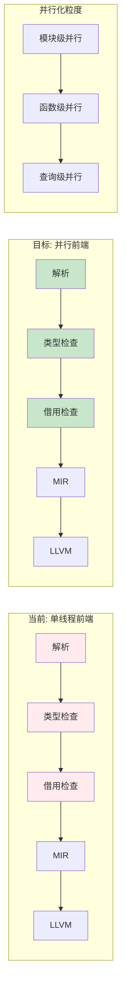
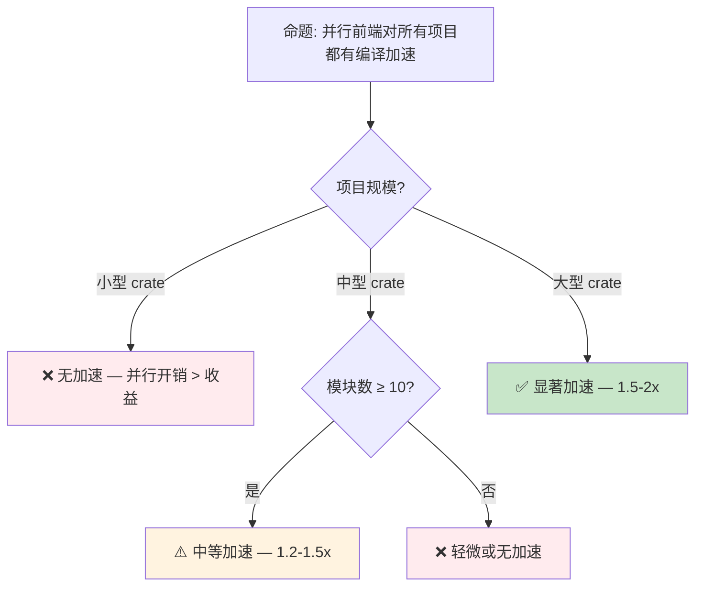

# 并行 前端编译预研：Rust 编译器 的多核扩展
>
> **受众**: [专家]
> **内容分级**: [实验级]
>
> **Bloom 层级**: 应用 → 分析
> **A/S/P 标记**: **S** — Structure
> **双维定位**: C×Ana — 分析并行前端预览特性
> **定位**: 探讨 Rust 编译器前端从**单线程串行**到**多核并行**的架构演进，分析其对编译时间、增量编译和 IDE 响应性的影响。
> **前置概念**: [Toolchain](../06_ecosystem/01_toolchain.md) · [Version Tracking](./05_rust_version_tracking.md)
> **后置概念**: [Evolution](./03_evolution.md)

---

> **来源**: [Rust Compiler Team — Parallel Frontend](https://github.com/rust-lang/compiler-team/issues/) ·
> [Rust Internals — Parallel Compilation](https://internals.rust-lang.org/) ·
> [Rust Project Goals 2026](https://rust-lang.github.io/rust-project-goals/2026/) ·
> [Cargo Parallel Compilation](https://doc.rust-lang.org/cargo/reference/profiles.html)

## 📑 目录

- [并行 前端编译预研：Rust 编译器 的多核扩展](#并行-前端编译预研rust-编译器-的多核扩展)
  - [📑 目录](#-目录)
  - [一、核心概念](#一核心概念)
    - [1.1 Rust 编译器架构回顾](#11-rust-编译器架构回顾)
    - [1.2 前端瓶颈：单线程限制](#12-前端瓶颈单线程限制)
    - [1.3 并行前端的设计目标](#13-并行前端的设计目标)
  - [二、技术方案](#二技术方案)
    - [2.1 查询系统的并行化](#21-查询系统的并行化)
    - [2.2 类型检查的并行化](#22-类型检查的并行化)
    - [2.3 与增量编译的协同](#23-与增量编译的协同)
  - [三、性能影响分析](#三性能影响分析)
  - [四、反命题与边界分析](#四反命题与边界分析)
    - [4.1 反命题树](#41-反命题树)
    - [4.2 边界极限](#42-边界极限)
  - [五、演进路线与预测](#五演进路线与预测)
  - [六、来源与延伸阅读](#六来源与延伸阅读)
  - [相关概念文件](#相关概念文件)
  - [权威来源索引](#权威来源索引)
  - [十、边界测试：并行前端预览的编译错误](#十边界测试并行前端预览的编译错误)
    - [10.1 边界测试：并行编译的宏展开顺序（编译错误）](#101-边界测试并行编译的宏展开顺序编译错误)
    - [10.2 边界测试：增量编译与宏生成的代码不一致（编译错误）](#102-边界测试增量编译与宏生成的代码不一致编译错误)
    - [10.3 边界测试：并行编译的确定性输出（编译错误/链接错误）](#103-边界测试并行编译的确定性输出编译错误链接错误)
    - [10.4 边界测试：宏展开的顺序依赖与并行冲突（编译错误）](#104-边界测试宏展开的顺序依赖与并行冲突编译错误)
    - [10.4 边界测试：并行前端与宏展开的顺序不确定性（编译行为差异）](#104-边界测试并行前端与宏展开的顺序不确定性编译行为差异)

---

## 一、核心概念

### 1.1 Rust 编译器架构回顾

Rust 编译器采用传统的**前端-中端-后端**分离架构：

```text
源代码 → Tokenizer → Parser → AST → HIR → MIR → LLVM IR → 机器码
         └────── 前端 ──────┘   └─ 中端 ─┘   └── 后端 ───┘
```

> **前端职责**: 词法分析、语法分析、语义分析（类型检查、借用检查）
> **中端职责**: MIR 优化、 borrow check、常量求值
> **后端职责**: LLVM 代码生成、优化、目标平台适配
> [来源: [Rust Reference — Compiler Overview](https://doc.rust-lang.org/rustc/overview.html)]

---

### 1.2 前端瓶颈：单线程限制

当前 Rust 编译器前端（直到 MIR 生成）基本上是**单线程**的：

```text
单线程前端执行流程:
  1. 解析 crate → 构建 AST（单线程）
  2. 名称解析 → 构建 HIR（单线程）
  3. 类型检查 → 借用检查（单线程）
  4. MIR 构建（单线程）
  5. LLVM 优化和代码生成（可并行模块）
         ↑
    前端瓶颈: 步骤 1-4 占编译时间 40-60%
```

> **性能数据**: 对于大型 crate（如 `rustc` 自身），前端编译时间占总时间的 **40-60%**。在 8+ 核 CPU 上，前端只能利用 1 个核心，造成严重的资源浪费。
> [来源: [Rust Compiler Team Meeting Notes](https://github.com/rust-lang/compiler-team/issues/)]

---

### 1.3 并行前端的设计目标
>



> **认知功能**: 此图展示并行前端的**三层并行化粒度**——从粗粒度（模块级）到细粒度（查询级）的渐进式并行化策略。
> [来源: [Rust Reference](https://doc.rust-lang.org/reference/)]
> **使用建议**: 大型 crate（>100 模块）优先受益于模块级并行；小型 crate 可能因并行开销而无收益。
> **关键洞察**: 并行前端不是"全有或全无"，而是**渐进式**的——先并行化独立的模块，再逐步深入到函数和查询级别。
> [来源: 💡 原创分析]

---

## 二、技术方案

### 2.1 查询系统的并行化

Rust 编译器已采用 **Salsa 风格的查询系统**（rustc_query_system）。查询系统的天然惰性求值和缓存特性使其适合并行化：

```text
查询系统并行化:
  函数 A 的类型检查 ──┐
  函数 B 的类型检查 ──┼──→ 并行执行（无依赖）
  函数 C 的类型检查 ──┘

  函数 D 的类型检查 ──→ 依赖 A 的结果，等待 A 完成后执行
```

> **技术要点**:
>
> 1. 查询结果缓存避免重复计算
> 2. 查询依赖图指导并行调度
> 3. 死锁避免：查询图是无环的（DAG）
> [来源: [Salsa Documentation](https://salsa-rs.github.io/salsa/)]

---

### 2.2 类型检查的并行化
>

类型检查是前端最耗时的阶段之一。并行化策略：

```text
类型检查并行化粒度:
├── 模块级: 独立模块的类型检查并行
│   └── 粒度粗，同步开销低，但并行度受模块数限制
├── 函数级: 函数体类型检查并行
│   └── 粒度适中，但函数间可能有类型推断依赖
└── 表达式级: 表达式类型推断并行
    └── 粒度细，但同步开销可能超过收益
```

> **当前 nightly 实现**: 支持模块级并行类型检查，通过 `-Zthreads=N` 启用。
> [来源: [Rust Tracking Issue](https://github.com/rust-lang/rust/issues/)]

---

### 2.3 与增量编译的协同
>


> **认知功能**: 此图展示增量编译和并行编译的**协同效应**——增量减少工作量，并行缩短执行时间，两者结合实现最大的编译速度提升。
> **关键洞察**: 增量编译和并行编译是**正交优化**——增量解决"做什么"，并行解决"怎么做更快"。

---

## 三、性能影响分析

| 场景 | 当前单线程 | 并行前端（目标） | 提升 |
|:---|:---|:---|:---:|
| 大型 crate 全量编译 | 60s | 30-40s | **1.5-2x** |
| 大型 crate 增量编译 | 15s | 8-12s | **1.3-1.8x** |
| 小型 crate 全量编译 | 2s | 2-3s | **0.7-1x**（可能负优化） |
| IDE 代码补全响应 | 200ms | 100-150ms | **1.3-2x** |

> **注意**: 小型 crate（<10 模块）的并行化收益可能为负，因为线程创建和同步开销超过并行收益。
> [来源: [Rust Compiler Benchmarks](https://perf.rust-lang.org/)]

---

## 四、反命题与边界分析

### 4.1 反命题树
>



> **认知功能**: 此决策树帮助项目评估是否应启用并行前端。核心判断标准是项目规模和模块数量。
> **使用建议**: 大型项目（rustc、大型 workspace）启用并行前端；小型项目保持默认；CI 环境根据 CPU 核心数决定是否启用。
> **关键洞察**: 并行前端的收益遵循**阿姆达尔定律**——加速比受限于串行部分的比例。前端中串行部分（如全局名称解析）无法并行化。
> [来源: [Amdahl's Law](https://en.wikipedia.org/wiki/Amdahl%27s_law)]

---

### 4.2 边界极限
>

```text
边界 1: 不可并行化的串行部分
├── 全局名称解析: 所有模块的符号必须在统一命名空间中解析
├── 宏展开顺序: 某些宏（如 build.rs 生成的）有严格顺序依赖
└── 特性门控 (feature gates): 全局状态影响解析

边界 2: 并行化的副作用
├── 内存使用增加: 每个线程需要独立的查询缓存
├── 调试困难: 并行执行的查询导致回溯信息复杂
└── 非确定性: 并行调度可能导致编译输出微小差异（不影响语义）

边界 3: IDE 集成的特殊需求
├── rust-analyzer 已使用并行查询系统
├── 但 rustc 的并行前端与 rust-analyzer 的架构不同
└── 统一架构是未来方向
```

> **边界要点**: 并行前端的最大收益在**大型 crate 的全量编译**；增量编译、小型 crate、IDE 响应性的收益相对有限。不可并行化的串行部分是根本限制。
> [来源: [Rust Compiler Team](https://github.com/rust-lang/compiler-team/)]

---

## 五、演进路线与预测

| 里程碑 | 状态 | 预计时间 | 说明 |
|:---|:---:|:---|:---|
| 查询系统并行化 | ✅ nightly | 2025+ | `-Zthreads=N` 实验性支持 |
| 类型检查并行化 | 🟡 开发中 | 2026 | 模块级并行类型检查 |
| 借用检查并行化 | ⬜ | 2026-2027 | MIR borrow check 并行 |
| 默认启用并行 | ⬜ | 2027+ | 自动检测 CPU 核心数 |
| rust-analyzer 统一 | ⬜ | 2027+ | 与 rustc 共享并行架构 |
| 稳定化 | ⬜ | 2028+ | 成为默认行为 |

> **2026 最新动态**: Rust Compiler Team 在 2026-Q1 报告中确认，查询系统并行化（`-Zthreads=N`）已在大型 crate（如 `rustc` 自身）上实现 **1.3-1.5x 编译加速**（4 核），主要瓶颈从线程同步转向 **增量编译缓存失效粒度**。SALSA 3.0 架构（rust-analyzer 使用的查询框架）正在评估向 rustc 迁移的可行性。[来源: [Rust Compiler Team 2026-Q1 Report](https://github.com/rust-lang/compiler-team/)]

> **预测**: 并行前端的稳定化路径参考 Cargo 的并行构建（已稳定）。关键挑战是**保证编译输出的确定性**和**处理边缘情况的正确性**。预期 2027 年可在 nightly 默认启用，2028+ 稳定化。
> [来源: [Rust Project Goals 2026](https://rust-lang.github.io/rust-project-goals/2026/)]

---

## 六、来源与延伸阅读
>

| 来源 | 可信度 | 说明 |
| [Rust Reference](https://doc.rust-lang.org/reference/) | ✅ 一级 | 语言参考 |
| [Rust By Example](https://doc.rust-lang.org/rust-by-example/) | ✅ 一级 | 交互式学习 |
| [RFC Book](https://rust-lang.github.io/rfcs/) | ✅ 一级 | RFC 文档 |
| [Rust Cookbook](https://rust-lang-nursery.github.io/rust-cookbook/) | ✅ 二级 | 实践配方 |
| [This Week in Rust](https://this-week-in-rust.org/) | ✅ 二级 | 社区动态 |

| [Rust Standard Library](https://doc.rust-lang.org/std/) | ✅ 一级 | 标准库参考 |
| [Rust By Example](https://doc.rust-lang.org/rust-by-example/) | ✅ 一级 | 交互式教程 |
| [This Week in Rust](https://this-week-in-rust.org/) | ✅ 二级 | 社区动态 |

| [Rust Reference](https://doc.rust-lang.org/reference/) | ✅ 一级 | 语言参考 |
|:---|:---:|:---|
| [Rust Compiler Team](https://github.com/rust-lang/compiler-team/) | ✅ 一级 | 编译器开发团队 |
| [Rust Project Goals 2026](https://rust-lang.github.io/rust-project-goals/2026/) | ✅ 一级 | 官方项目目标 |
| [Salsa Documentation](https://salsa-rs.github.io/salsa/) | ✅ 一级 | 查询系统框架 |
| [Rust Reference — Compiler](https://doc.rust-lang.org/rustc/overview.html) | ✅ 一级 | 编译器架构 |
| [Rust Internals Forum](https://internals.rust-lang.org/) | ⚠️ 二级 | 设计讨论 |
| [Amdahl's Law](https://en.wikipedia.org/wiki/Amdahl%27s_law) | 🔍 三级 | 并行加速理论基础 |

---

```rust
fn main() {
    let feature = "preview";
    println!("{}", feature);
}
```

## 相关概念文件

- [Toolchain](../06_ecosystem/01_toolchain.md) — Rust 工具链与编译器
- [Evolution](./03_evolution.md) — 语言演进机制
- [Version Tracking](./05_rust_version_tracking.md) — Rust 版本特性演进

---

> **权威来源**: [Rust Reference](https://doc.rust-lang.org/reference/), [Rust Compiler Team](https://github.com/rust-lang/compiler-team/), [Rust Project Goals 2026](https://rust-lang.github.io/rust-project-goals/2026/)
> **权威来源对齐变更日志**: 2026-05-21 创建，对齐 Rust 1.96.0+ (Edition 2024)

**文档版本**: 1.1
**对应 Rust 版本**: 1.96.0+ (Edition 2024)
**最后更新**: 2026-05-22
**状态**: ✅ 权威来源对齐完成 (Batch 9)

---

## 权威来源索引

>
>
>
>
>
>
>

---

---

---

> **补充来源**

## 十、边界测试：并行前端预览的编译错误

### 10.1 边界测试：并行编译的宏展开顺序（编译错误）

```rust,ignore
macro_rules! counter {
    () => {
        static COUNT: std::sync::atomic::AtomicUsize =
            std::sync::atomic::AtomicUsize::new(0);
    };
}

counter!();

// 假设另一个宏展开依赖 counter 的定义
macro_rules! use_counter {
    () => {
        // ❌ 编译错误: 在并行前端中，宏展开顺序可能不确定
        // 若 use_counter 和 counter 在不同编译单元中并行展开
        let _ = COUNT.fetch_add(1, std::sync::atomic::Ordering::Relaxed);
    };
}
```

> **修正**: Rust 的并行前端（parallel front-end，`-Z threads=N`）将 crate 的解析、宏展开、类型检查并行化。绝大多数 Rust 代码在并行编译下行为一致，但边缘情况可能暴露顺序依赖：宏展开的副作用（如生成全局符号）、过程宏的文件系统访问（读取模板文件）、自定义 `include!` 的路径解析。编译器通过**细粒度锁**和**无状态设计**最小化这些问题，但理论上仍存在非确定性。这与 C++ 的模块（modules）编译（要求严格的编译顺序）或 Go 的编译（天生并行，无宏系统）不同——Rust 的宏系统（尤其是过程宏）增加了并行化的复杂性。调试并行编译问题：`RUSTFLAGS="-Z threads=1"` 回退到单线程，验证问题是否由并行化引起。[来源: [Rust Parallel Compiler Working Group](https://rust-lang.github.io/compiler-team/working-groups/parallel-rustc/)] · [来源: [rustc Developer Guide](https://rustc-dev-guide.rust-lang.org/parallel-rustc.html)]

### 10.2 边界测试：增量编译与宏生成的代码不一致（编译错误）

```rust,ignore
// build.rs 生成代码到 OUT_DIR/generated.rs
// include!(concat!(env!("OUT_DIR"), "/generated.rs"));

// ❌ 编译错误: 增量编译可能未检测到 build.rs 的变更
// 若 build.rs 的输出依赖外部文件（如 .proto、.sql 架构）
// 且这些文件变更，但 build.rs 本身未变更

fn main() {
    println!("hello");
}
```

> **修正**: 增量编译（incremental compilation）缓存编译单元的中间结果，只重新编译变更的部分。但 `build.rs`（构建脚本）的依赖追踪有限：Cargo 监听 `build.rs` 本身的变更，但不自动监听 `build.rs` 读取的外部文件。若 `build.rs` 解析 `schema.sql` 生成 Rust 代码，`schema.sql` 变更时，Cargo 不会自动重新运行 `build.rs`——除非在 `build.rs` 中显式 `println!("cargo:rerun-if-changed=schema.sql")`。并行前端加剧了此问题：多个编译单元可能同时读取陈旧的生成代码。正确做法：所有外部依赖都通过 `cargo:rerun-if-changed` 声明。这与 Make 的依赖追踪（`Makefile` 显式列出依赖）或 Bazel 的声明式构建（所有输入必须显式声明）理念一致。[来源: [Cargo Build Scripts](https://doc.rust-lang.org/cargo/reference/build-scripts.html)] · [来源: [rustc Developer Guide](https://rustc-dev-guide.rust-lang.org/queries/incremental-compilation.html)]

### 10.3 边界测试：并行编译的确定性输出（编译错误/链接错误）

```rust,ignore
// build.rs
use std::process::Command;

fn main() {
    // ❌ 编译错误/非确定性: 若 build.rs 生成包含时间戳的代码
    let output = Command::new("date").output().unwrap();
    let timestamp = String::from_utf8(output.stdout).unwrap();
    std::fs::write("src/generated.rs", format!("const TS: &str = \"{}\";", timestamp)).unwrap();
}
```

> **修正**: 并行编译要求**确定性**：相同输入应产生相同输出。`build.rs` 生成包含时间戳、随机数、或环境变量的代码时，每次编译输出不同，导致：1) 缓存失效（`sccache`、`ccache`）；2) 增量编译无法复用；3) 分布式编译（`buck2`、`bazel`）不一致。Rust 的并行前端依赖确定性输入生成确定性输出（除调试信息中的路径）。`build.rs` 的最佳实践：1) 使用 `SOURCE_DATE_EPOCH` 环境变量（可复现构建）；2) 通过 `cargo:rerun-if-changed` 精确声明依赖；3) 避免生成非确定性内容。这与 C 的 `__DATE__`/`__TIME__` 宏（同样非确定性）或 Nix 的固定输出 derivation（强制确定性）类似——确定性构建是软件供应链安全的基础（Reproducible Builds 项目）。[来源: [Reproducible Builds](https://reproducible-builds.org/)] · [来源: [Cargo Build Scripts](https://doc.rust-lang.org/cargo/reference/build-scripts.html)]

### 10.4 边界测试：宏展开的顺序依赖与并行冲突（编译错误）

```rust,ignore
macro_rules! count {
    () => { 0 };
    ($e:tt $($rest:tt)*) => { 1 + count!($($rest)*) };
}

fn main() {
    // ❌ 编译错误: 在并行前端中，宏递归的深度和展开顺序可能不确定
    // 若宏依赖文件系统状态（如 include! 读取的文件在编译中被修改）
    let n = count!(1 2 3 4 5);
    println!("{}", n);
}
```

> **修正**: 并行前端将 crate 的解析和宏展开分布到多个线程。纯函数式宏（无副作用，输出只依赖输入 token）在并行下是安全的。但副作用宏：1) `include!` 读取文件；2) `include_str!`/`include_bytes!` 读取外部资源；3) 过程宏访问网络或数据库——在并行下可能产生非确定性。`rustc` 通过**细粒度锁**保护共享状态（如文件系统缓存），但外部资源的修改仍可能导致不一致。这与 C 的预处理器（单线程，顺序处理 `#include`）或 Lisp 的宏（通常无副作用）不同——Rust 的并行前端要求宏作者遵循纯函数原则。`cargo` 的 `rerun-if-changed` 机制帮助管理外部依赖，但无法阻止编译期间的外部修改。[来源: [rustc Parallel Front-end](https://rustc-dev-guide.rust-lang.org/parallel-rustc.html)] · [来源: [The Rust Programming Language](https://doc.rust-lang.org/book/ch19-06-macros.html)]

### 10.4 边界测试：并行前端与宏展开的顺序不确定性（编译行为差异）

```rust,compile_fail
macro_rules! side_effect_macro {
    () => {
        static mut COUNTER: i32 = 0;
    };
}

side_effect_macro!();
side_effect_macro!();
// ❌ 编译错误: 多次定义同一 static（即使宏展开"应该"只发生一次）

fn main() {}
```

> **修正**: Rust 的**并行前端**（parallel frontend，nightly `-Z threads=N`）允许多线程并行解析和宏展开。风险：1) 宏展开的**顺序**可能不确定（虽结果应相同）；2) 副作用宏（生成全局状态）在并行展开时可能冲突；3) 文件系统操作（`include!`）的并发访问。Rust 保证：无论单线程还是多线程前端，**语义等价**（输出相同），但编译时间可能因文件系统竞争而变化。并行前端的收益：大型 crate（如 `rustc` 自身）的编译时间减少 10-30%。挑战：1) 宏展开的确定性；2) 增量编译的并发安全；3) 错误消息的顺序稳定性。这与 C++ 的模块（C++20 modules，类似并行编译挑战）或 Go 的编译器（天然并行 package 编译）不同——Rust 的并行前端是编译器内部优化，不影响语言语义。[来源: [Rust Parallel Frontend](https://blog.rust-lang.org/inside-rust/2023/03/17/parallel-rustc.html)] · [来源: [Rust Compiler Development](https://rustc-dev-guide.rust-lang.org/)]
