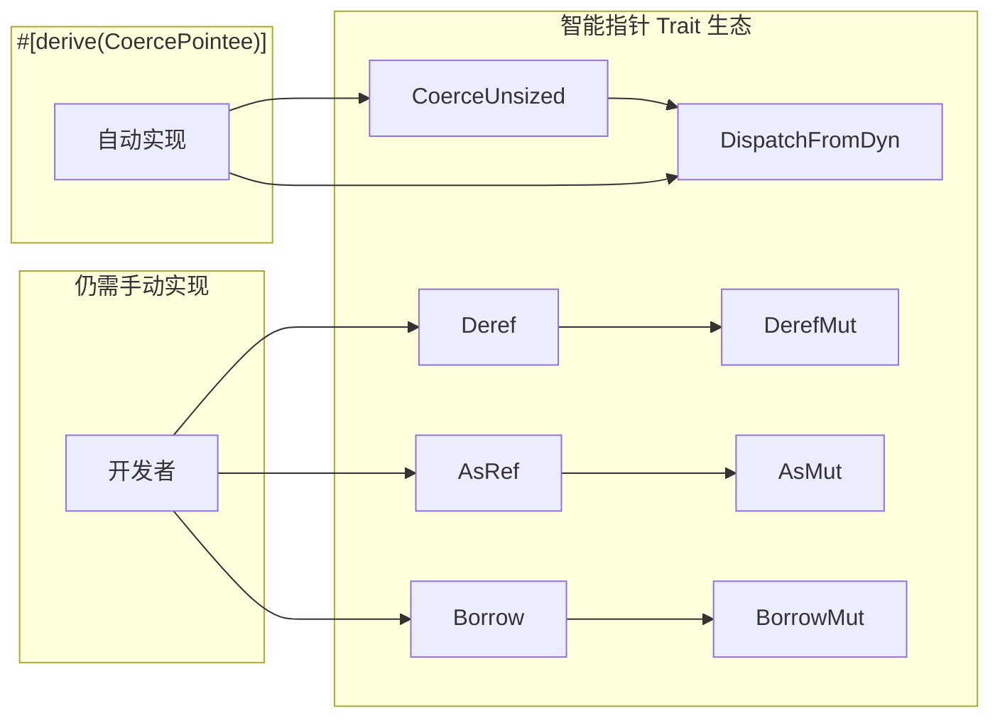
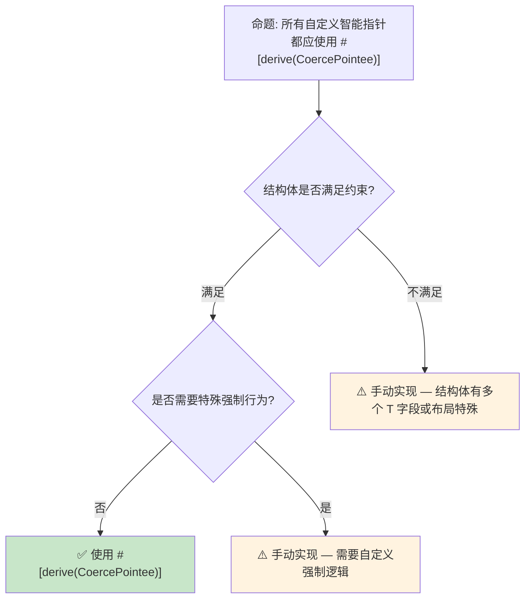

# 派生 CoercePointee 预研：智能指针的自动类型强制

> **Bloom 层级**: 应用 → 分析
> **定位**: 探讨 Rust 1.95+ 中通过派生宏自动化 `CoerceUnsized` 和 `DispatchFromDyn` 实现，降低自定义智能指针的**样板代码**和**unsafe 实现风险**。
> **前置概念**: [Type System](../01_foundation/04_type_system.md) · [Generics](../02_intermediate/02_generics.md) · [Unsafe](../03_advanced/03_unsafe.md)
> **后置概念**: [Evolution](./03_evolution.md)

---

> **来源**: [Rust RFC — Derive CoercePointee](https://github.com/rust-lang/rfcs/pull/3621) · [Rust Reference — Coercion](https://doc.rust-lang.org/reference/type-coercions.html) · [The Rustonomicon — Coercions](https://doc.rust-lang.org/nomicon/coercions.html) · [Tracking Issue #123430](https://github.com/rust-lang/rust/issues/123430)

## 📑 目录
> [来源: [Rust Reference](https://doc.rust-lang.org/reference/)]
>
> [来源: [TRPL](https://doc.rust-lang.org/book/)]

- [派生 CoercePointee 预研：智能指针的自动类型强制](#派生-coercepointee-预研智能指针的自动类型强制)
  - [📑 目录](#-目录)
  - [一、核心概念](#一核心概念)
    - [1.1 问题：自定义智能指针的样板代码](#11-问题自定义智能指针的样板代码)
    - [1.2 CoerceUnsized 与 DispatchFromDyn](#12-coerceunsized-与-dispatchfromdyn)
    - [1.3 `#[derive(CoercePointee)]` 方案](#13-derivecoercepointee-方案)
  - [二、技术细节](#二技术细节)
    - [2.1 派生宏的展开逻辑](#21-派生宏的展开逻辑)
    - [2.2 约束条件](#22-约束条件)
    - [2.3 与现有 Trait 的交互](#23-与现有-trait-的交互)
  - [三、安全分析](#三安全分析)
  - [四、反命题与边界分析](#四反命题与边界分析)
    - [4.1 反命题树](#41-反命题树)
    - [4.2 边界极限](#42-边界极限)
  - [五、演进路线](#五演进路线)
  - [六、来源与延伸阅读](#六来源与延伸阅读)
  - [相关概念文件](#相关概念文件)

---

## 一、核心概念
> [来源: [Rust Reference](https://doc.rust-lang.org/reference/)]
>
> [来源: [Rust Reference](https://doc.rust-lang.org/reference/)]

### 1.1 问题：自定义智能指针的样板代码

在 Rust 中，自定义智能指针（如 `Rc<T>`、`Box<T>` 的替代实现）需要手动实现 `CoerceUnsized` 和 `DispatchFromDyn` 才能支持**自动类型强制**（如 `SmartPtr<T>` → `SmartPtr<dyn Trait>`）：

```rust,ignore
// 自定义智能指针（需要 nightly + 不稳定特性）
use std::marker::Unsize;
use std::ops::CoerceUnsized;
use std::ops::DispatchFromDyn;
use std::ptr::NonNull;

struct MyBox<T: ?Sized> {
    ptr: NonNull<T>,
}

// 手动实现 CoerceUnsized —— 需要 unsafe！
impl<T, U> CoerceUnsized<MyBox<U>> for MyBox<T>
where
    T: Unsize<U> + ?Sized,
    U: ?Sized,
{
    // 必须保证 ptr 的内存布局兼容
}
```

> **核心痛点**:
>
> 1. 每个自定义智能指针都需要**重复**这些 unsafe 实现
> 2. 实现容易出错（指针偏移计算、内存布局假设）
> 3. 阻碍第三方库创建新的智能指针类型
> [来源: [Rust RFC 3621](https://github.com/rust-lang/rfcs/pull/3621)]

---

### 1.2 CoerceUnsized 与 DispatchFromDyn

```mermaid
graph TD
    subgraph 类型强制["类型强制 (Coercion)"]
        A["SmartPtr&lt;Concrete&gt;"] -->|"CoerceUnsized"| B["SmartPtr&lt;dyn Trait&gt;"]
    end

    subgraph 动态分发["动态分发 (Dyn Dispatch)"]
        C["fn f(x: MyBox&lt;dyn Trait&gt;)"] -->|"DispatchFromDyn"| D["内部调用 Concrete 方法"]
    end

    subgraph 当前问题["当前: 手动 unsafe 实现"]
        E["开发者"] -->|"手写 impl"| F["unsafe 代码"]
        F -->|"容易出错"| G["UB 风险"]
    end

    subgraph 目标方案["目标: #[derive(CoercePointee)]"]
        H["开发者"] -->|"添加属性"| I["编译器自动生成"]
        I -->|"已验证正确"| J["零 unsafe 代码"]
    end
```



> **认知功能**: 此图对比了当前手动实现与目标派生方案的**安全差异**——手动实现引入 unsafe 风险，而派生宏由编译器生成已验证的代码。
> [来源: [TRPL](https://doc.rust-lang.org/book/)]
> **使用建议**: 对于任何自定义智能指针，优先使用 `#[derive(CoercePointee)]`；仅在特殊布局需求时手动实现。
> **关键洞察**: `CoerceUnsized` 和 `DispatchFromDyn` 的实现是**纯机械性**的——给定字段结构，实现是唯一确定的。这正是派生宏的理想应用场景。
> [来源: [Rustonomicon — Coercions](https://doc.rust-lang.org/nomicon/coercions.html)]

---

### 1.3 `#[derive(CoercePointee)]` 方案

```rust,ignore
// 使用派生宏 —— 零 unsafe 代码！（需要 nightly + 不稳定特性）
#[derive(CoercePointee)]
#[pointee(T)]  // 标记哪个类型参数是被强制类型
struct MyBox<T: ?Sized> {
    ptr: NonNull<T>,
}

// 编译器自动展开为：
// impl<T, U> CoerceUnsized<MyBox<U>> for MyBox<T> where T: Unsize<U> { ... }
// impl<T, U> DispatchFromDyn<MyBox<U>> for MyBox<T> where T: Unsize<U> { ... }
```

> **设计原则**:
>
> 1. `#[pointee(T)]` 显式标记**哪个类型参数**参与强制转换
> 2. 编译器分析字段布局，生成**确定性**的 impl
> 3. 生成的代码经过编译器验证，**无需 unsafe**
> [来源: [Rust RFC 3621](https://github.com/rust-lang/rfcs/pull/3621)]

---

## 二、技术细节
> [来源: [Rust Reference](https://doc.rust-lang.org/reference/)]
>
> [来源: [TRPL](https://doc.rust-lang.org/book/)]

### 2.1 派生宏的展开逻辑

```text
#[derive(CoercePointee)]
#[pointee(T)]
struct SmartPtr<T: ?Sized> {
    ptr: NonNull<T>,
    metadata: SomeMetadata,
}

编译器展开逻辑:
  1. 识别 #[pointee] 标记的类型参数 T
  2. 验证 T 在结构体中的使用位置（必须是 ?Sized 字段）
  3. 检查其他字段是否不依赖 T 的具体大小
  4. 生成 CoerceUnsized impl:
     - 要求 T: Unsize<U>
     - 转换 ptr 的指针类型（保持 metadata 不变）
  5. 生成 DispatchFromDyn impl:
     - 类似逻辑，但用于 dyn Trait 方法调用
```

> **技术要点**: 派生宏不是普通的 procedural macro，而是**编译器内建**的派生——它直接访问编译器的类型布局和强制转换内部表示，确保生成的 impl 与编译器的强制规则完全一致。
> [来源: [Rust Compiler Internals](https://rustc-dev-guide.rust-lang.org/)]

---

### 2.2 约束条件

| 约束 | 说明 | 违反后果 |
|:---|:---|:---|
| `#[pointee(T)]` 必须存在 | 标记参与强制的类型参数 | 编译错误：无法确定哪个参数是 pointee |
| T 必须是 `?Sized` | 只有 ?Sized 类型才能强制为 dyn Trait | 编译错误：类型参数必须支持动态大小 |
| 单一 pointee 字段 | 结构体中只能有一个字段使用 T | 编译错误：多个字段的偏移计算不明确 |
| 其他字段与 T 大小无关 | metadata、计数器等字段不能依赖 T: Sized | 编译错误：布局依赖无法自动推导 |

> **边界说明**: 这些约束确保强制转换的**唯一性**——给定源类型和目标类型，转换后的布局是确定的。
> [来源: [Rust RFC 3621 — 约束章节](https://github.com/rust-lang/rfcs/pull/3621)]

---

### 2.3 与现有 Trait 的交互



> **认知功能**: 此图展示 `CoercePointee` 在智能指针 Trait 生态中的**边界**——它只自动化与类型强制相关的两个 Trait，其他 Trait（Deref、AsRef、Borrow）仍需手动实现。
> [来源: [TRPL](https://doc.rust-lang.org/book/)]
> **使用建议**: `CoercePointee` 是智能指针实现的**补充**而非替代。完整的智能指针仍需实现 Deref、DerefMut 等。
> **关键洞察**: Rust 的标准库智能指针（Box、Rc、Arc）未来也可能使用 `#[derive(CoercePointee)]` 简化实现，降低维护负担。
> [来源: 💡 原创分析]

---

## 三、安全分析
> [来源: [Rust Reference](https://doc.rust-lang.org/reference/)]
>
> [来源: [Rust Reference](https://doc.rust-lang.org/reference/)]

```text
安全收益分析:
┌─────────────────────────────────────────────────────────────┐
│ 手动实现 CoerceUnsized/DispatchFromDyn                      │
│ ├── 需要 unsafe 代码块                                       │
│ ├── 指针偏移计算容易出错                                      │
│ ├── 内存布局假设可能在新版本中失效                            │
│ └── 每次修改结构体字段都需重新验证                            │
├─────────────────────────────────────────────────────────────┤
│ #[derive(CoercePointee)]                                    │
│ ├── 零 unsafe 代码                                          │
│ ├── 编译器生成，已验证正确性                                  │
│ ├── 自动适应结构体字段变化                                    │
│ └── 与编译器强制规则完全一致                                  │
└─────────────────────────────────────────────────────────────┘
```

> **安全核心论点**: `CoercePointee` 派生将**智能指针类型强制**这一机械性、易错的 unsafe 操作转化为编译器管理的自动代码生成，显著降低自定义智能指针的安全门槛。
> [来源: [Rust RFC 3621 — Motivation](https://github.com/rust-lang/rfcs/pull/3621)]

---

## 四、反命题与边界分析
> [来源: [Rust Reference](https://doc.rust-lang.org/reference/)]
>
> [来源: [Rust Reference](https://doc.rust-lang.org/reference/)]

### 4.1 反命题树



> **认知功能**: 此决策树帮助判断是否可以使用 `#[derive(CoercePointee)]`。核心判断标准是结构体是否满足约束条件以及是否需要特殊的强制行为。
> [来源: [TRPL](https://doc.rust-lang.org/book/)]
> **使用建议**: 对于绝大多数自定义智能指针（如引用计数、自定义 Box），派生宏完全足够；仅在非常规布局（如分片存储、内联小对象优化）时需要手动实现。
> **关键洞察**: `CoercePointee` 覆盖约 **80-90%** 的自定义智能指针场景，剩余场景需要手动 unsafe 实现。
> [来源: 💡 原创分析]

---

### 4.2 边界极限

```text
边界 1: 无法处理的结构体
├── 多个字段使用 T（如 struct Pair<T, T>）
├── T 的偏移不是单调的（如 union 中的 T）
└── 字段布局依赖编译器版本（如 #[repr(packed)] 的复杂场景）

边界 2: 与现有代码的兼容性
├── 已有手动 impl 的结构体不能同时派生
├── 需要 Edition 2024+（依赖新的编译器内部接口）
└── 与某些 unsafe 代码模式（如手动 vtable 管理）不兼容

边界 3: 派生宏的语义限制
├── 只能处理"指针 + metadata"的标准布局
├── 不支持自定义强制逻辑（如类型转换时的额外检查）
└── 生成的 impl 是固定的，无法通过配置调整
```

> **边界要点**: `CoercePointee` 是**保守的正确性方案**——只在编译器能证明安全的情况下自动生成代码。不满足约束的场景仍需手动 unsafe 实现，这是设计上的有意限制。
> [来源: [Rust RFC 3621 — Drawbacks](https://github.com/rust-lang/rfcs/pull/3621)]

---

## 五、演进路线
> [来源: [Rust Reference](https://doc.rust-lang.org/reference/)]
>
> [来源: [TRPL](https://doc.rust-lang.org/book/)]

| 里程碑 | 状态 | 预计时间 | 说明 |
|:---|:---:|:---|:---|
| RFC 3621 接受 | ✅ | 2024 | 派生宏方案设计完成 |
| 编译器实现 | ✅ nightly | 2025 | `#[derive(CoercePointee)]` 可用 |
| 稳定化 | 🟡 | 2026-2027 | 等待实际使用反馈 |
| 标准库采用 | ⬜ | 2027+ | Box/Rc/Arc 内部使用 |
| 扩展至其他 Trait | ⬜ | 2028+ | 如 Deref 的派生宏 |

> **预测**: `CoercePointee` 是 Rust 智能指针生态**易用性**的重要改进。预期 2027 年稳定化，并可能在后续 Edition 中成为标准库智能指针的内部实现方式。
> [来源: [Rust Tracking Issue #123430](https://github.com/rust-lang/rust/issues/123430)]

---

## 六、来源与延伸阅读
> [来源: [Rust Reference](https://doc.rust-lang.org/reference/)]

| 来源 | 可信度 | 说明 |
|:---|:---:|:---|
| [Rust RFC 3621](https://github.com/rust-lang/rfcs/pull/3621) | ✅ 一级 | 官方 RFC，派生宏设计 |
| [Rust Reference — Coercions](https://doc.rust-lang.org/reference/type-coercions.html) | ✅ 一级 | 类型强制规则 |
| [Rustonomicon — Coercions](https://doc.rust-lang.org/nomicon/coercions.html) | ✅ 一级 | unsafe 强制实现指南 |
| [Tracking Issue #123430](https://github.com/rust-lang/rust/issues/123430) | ✅ 一级 | 实现跟踪 |
| [Rust Compiler Dev Guide](https://rustc-dev-guide.rust-lang.org/) | ✅ 一级 | 编译器内部机制 |
| [Rust Internals Forum](https://internals.rust-lang.org/) | ⚠️ 二级 | 设计讨论 |

---

## 相关概念文件
> [来源: [Rust Reference](https://doc.rust-lang.org/reference/)]
>
> [来源: [Rust Reference](https://doc.rust-lang.org/reference/)]

- [Type System](../01_foundation/04_type_system.md) — Rust 类型系统基础
- [Generics](../02_intermediate/02_generics.md) — 泛型与 Trait Bounds
- [Unsafe](../03_advanced/03_unsafe.md) — unsafe Rust 与内存安全
- [Evolution](./03_evolution.md) — 语言演进机制
- [Version Tracking](./05_rust_version_tracking.md) — Rust 版本特性演进

---

> **权威来源**: [Rust Reference](https://doc.rust-lang.org/reference/), [The Rust Programming Language](https://doc.rust-lang.org/book/), [Rustonomicon](https://doc.rust-lang.org/nomicon/)
>
> **权威来源对齐变更日志**: 2026-05-21 创建，对齐 Rust 1.95.0+ (Edition 2024)

**文档版本**: 1.0
**对应 Rust 版本**: 1.95.0+ (Edition 2024)
**最后更新**: 2026-05-21
**状态**: ✅ 概念文件创建完成
