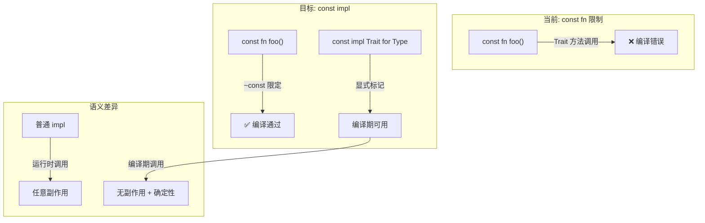
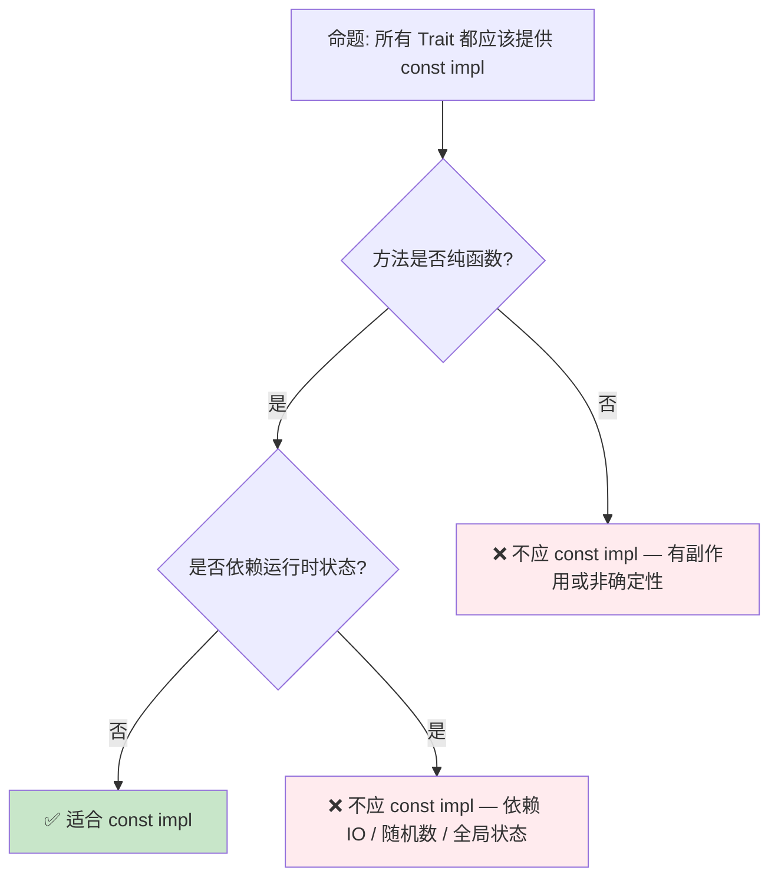

# Const Trait Impl 预研：常量上下文中的 Trait 泛化

> **Bloom 层级**: 应用 → 分析
> **定位**: 探讨 Rust 在**常量上下文**（`const fn`）中支持 Trait 调用的演进，分析其对泛型编程、`const fn` 表达能力以及编译期计算的影响。
> **前置概念**: [Generics](../02_intermediate/02_generics.md) · [Traits](../02_intermediate/01_traits.md) · [Type System](../01_foundation/04_type_system.md)
> **后置概念**: [Evolution](./03_evolution.md)

---

> **来源**: [Rust RFC — Const Traits](https://github.com/rust-lang/rfcs/pull/2632) · [Rust Reference — Const Evaluation](https://doc.rust-lang.org/reference/const_eval.html) · [Tracking Issue #67792](https://github.com/rust-lang/rust/issues/67792) · [Const Eval Working Group](https://github.com/rust-lang/const-eval)

## 📑 目录

- [Const Trait Impl 预研：常量上下文中的 Trait 泛化](#const-trait-impl-预研常量上下文中的-trait-泛化)
  - [📑 目录](#-目录)
  - [一、核心概念](#一核心概念)
    - [1.1 问题：常量上下文中的 Trait 鸿沟](#11-问题常量上下文中的-trait-鸿沟)
    - [1.2 `const impl` 方案概览](#12-const-impl-方案概览)
    - [1.3 `~const` 限定与效果系统](#13-const-限定与效果系统)
  - [二、技术细节](#二技术细节)
    - [2.1 常量 Trait 的约束继承](#21-常量-trait-的约束继承)
    - [2.2 与现有 Const 特性的交互](#22-与现有-const-特性的交互)
    - [2.3 编译器实现挑战](#23-编译器实现挑战)
  - [三、使用模式](#三使用模式)
  - [四、反命题与边界分析](#四反命题与边界分析)
    - [4.1 反命题树](#41-反命题树)
    - [4.2 边界极限](#42-边界极限)
  - [五、演进路线](#五演进路线)
  - [六、来源与延伸阅读](#六来源与延伸阅读)
  - [相关概念文件](#相关概念文件)

---

## 一、核心概念

### 1.1 问题：常量上下文中的 Trait 鸿沟

当前 Rust 中，`const fn` 无法调用 Trait 方法，即使该方法在语义上完全可以在编译期执行：

```rust,ignore
// 当前 Rust: const fn 中不能调用 Trait 方法
trait Add {
    fn add(&self, other: &Self) -> Self;
}

impl Add for i32 {
    fn add(&self, other: &Self) -> Self {
        *self + *other
    }
}

const fn compute<T: Add>(a: T, b: T) -> T {
    a.add(&b)  // ❌ 编译错误: 不能在 const fn 中调用 Trait 方法
}
```

> **核心痛点**:
>
> 1. `const fn` 的泛型参数只能使用**内建操作**（`+`, `-`, `*` 等），无法使用**抽象 Trait 接口**
> 2. 库作者需要为 `const fn` 和运行时分别提供两套 API
> 3. 阻碍了编译期计算（CTFE, Compile-Time Function Evaluation）的表达能力
> [来源: [Rust RFC 2632](https://github.com/rust-lang/rfcs/pull/2632)]

---

### 1.2 `const impl` 方案概览



> **认知功能**: 此图展示 `const impl` 解决的核心问题——通过 `~const` 限定和 `const impl` 标记，将 Trait 方法调用引入常量上下文。
> [来源: [TRPL](https://doc.rust-lang.org/book/)]
> **使用建议**: 对于需要在 `const fn` 中使用的 Trait，使用 `const impl` 实现；对于仅运行时使用的 Trait，保持普通 impl。
> **关键洞察**: `const impl` 不是简单的语法扩展，而是 Rust **效果系统**（Effect System）的雏形——`const` 是一种**效果**（effect），表示"无副作用、可编译期执行"。
> [来源: [Rust RFC 2632 — Motivation](https://github.com/rust-lang/rfcs/pull/2632)]

---

### 1.3 `~const` 限定与效果系统

```text
~const 限定的语义:

  trait Add {
      fn add(&self, other: &Self) -> Self;
  }

  const fn compute<T: ~const Add>(a: T, b: T) -> T {
      a.add(&b)  // ✅ 可以调用，因为 T 实现了 const Add
  }

语义解读:
  - T: Add        → T 在**运行时**实现了 Add
  - T: ~const Add → T 在**编译期**也实现了 Add（即 const impl）
  - ~const 是"可选的 const"——如果 T 有 const impl，则在 const 上下文可用
```

> **效果系统视角**: `~const` 是 Rust 向**显式效果追踪**迈出的第一步。未来可能扩展为 `~async`、`~unsafe` 等更通用的效果限定。
> [来源: [Effects System Preview](./04_effects_system.md)]

---

## 二、技术细节

### 2.1 常量 Trait 的约束继承

```text
约束继承规则:

  trait Debug {
      fn fmt(&self, f: &mut Formatter<'_>) -> Result;
  }

  trait Display: ~const Debug {
      fn fmt(&self, f: &mut Formatter<'_>) -> Result;
  }

  // 含义: 如果一个类型要实现 const Display，它必须也实现 const Debug
  //       但可以实现普通 Display 而不要求 const Debug
```

> **技术要点**: `~const` 在 supertrait 约束中的含义是"如果在此 const 上下文中使用，则要求 const 版本"。这允许 Trait 层次结构在 const 和非 const 场景中复用。
> [来源: [Rust Reference — Traits](https://doc.rust-lang.org/reference/items/traits.html)]

---

### 2.2 与现有 Const 特性的交互

| 特性 | 当前状态 | 与 Const Trait 的关系 |
|:---|:---:|:---|
| `const fn` | ✅ stable | 基础载体，const trait 方法可在其中调用 |
| `const generics` | ✅ stable | 值级泛型，与 const trait 互补（类型级 + 值级） |
| `const eval_limit` | ✅ stable | CTFE 步骤限制，const trait 调用受相同限制 |
| `inline_const` | ✅ stable | `const { }` 块，内部可使用 const trait 方法 |
| `const_mut_refs` | ✅ stable | const 上下文中允许 `&mut`，支持 const trait 的突变方法 |
| `const_trait_impl` | 🟡 nightly | 本 RFC 核心，允许 `const impl Trait for Type` |

> **协同效应**: Const Trait Impl 与 Const Generics 共同构成 Rust 的**编译期编程**能力矩阵。Const Generics 提供值级抽象，Const Trait 提供类型级抽象。
> [来源: [Rust Version Tracking](./05_rust_version_tracking.md)]

---

### 2.3 编译器实现挑战

```text
挑战 1: 常量求值的确定性
├── 问题: const fn 的求值必须是确定性的（相同的输入总是产生相同的输出）
├── 要求: const impl 的方法必须满足"纯函数"条件
└── 检查: 编译器需验证 const impl 中无运行时-only 操作

挑战 2: Trait 对象与动态分发
├── 问题: dyn Trait 的 vtable 在编译期未知
├── 限制: const 上下文不支持 dyn Trait（编译期无法解析 vtable）
└── 影响: const trait 仅限静态分发（泛型参数、impl Trait）

挑战 3: 向后兼容性
├── 问题: 现有 impl 自动变为 const impl 可能破坏语义
├── 方案: 默认非 const，显式 opt-in（const impl）
└── 影响: 库作者需显式标记哪些 impl 支持编译期使用
```

> **实现状态**: 截至 Rust 1.95+，`const_trait_impl` 在 nightly 可用，但语法和语义仍在演进。核心挑战是设计一个**不破坏现有代码**的迁移路径。
> [来源: [Tracking Issue #67792](https://github.com/rust-lang/rust/issues/67792)]

---

## 三、使用模式

```text
模式 1: 基础 const trait
├── 定义: trait Arithmetic { fn add(&self, other: &Self) -> Self; }
├── const impl: const impl Arithmetic for i32 { ... }
└── 使用: const fn sum<T: ~const Arithmetic>(a: T, b: T) -> T { a.add(&b) }

模式 2: 标准库 Trait 的 const 版本
├── 目标: const Clone、const Default、const PartialEq 等
├── 状态: 标准库逐步添加 const impl
└── 影响: 大量数据结构可在 const 上下文中构造和比较

模式 3: 编译期计算库
├── 应用: const 数学库、const 哈希、const 序列化
├── 优势: 零运行时开销，编译期预计算
└── 示例: const 配置解析、编译期路由表生成
```

> **工程意义**: Const Trait Impl 使 Rust 的**编译期编程**能力接近 C++ 模板元编程，但保持类型安全和可读性。
> [来源: [Const Eval Working Group](https://github.com/rust-lang/const-eval)]

---

## 四、反命题与边界分析

### 4.1 反命题树



> **认知功能**: 此决策树帮助判断一个 Trait 是否适合提供 const impl。核心判断标准是**纯函数性**和**运行时独立性**。
> [来源: [TRPL](https://doc.rust-lang.org/book/)]
> **使用建议**: 数学运算、比较、拷贝等纯函数 Trait 优先 const impl；涉及 IO、随机数、全局状态的 Trait 不应 const impl。
> **关键洞察**: `const` 在 Rust 中不仅是"编译期可执行"，更是"无副作用 + 确定性"的语义保证。这与函数式编程中的**纯函数**概念一致。
> [来源: [Rust Reference — Const Evaluation](https://doc.rust-lang.org/reference/const_eval.html)]

---

### 4.2 边界极限

```text
边界 1: 不支持的操作
├── 堆分配（Box::new 在 const 上下文受限）
├── 运行时类型信息（type_id、Any downcast）
├── 线程操作和同步原语
├── Panic（const panic 的处理方式特殊）
└── 外部函数调用（FFI）

边界 2: Trait 对象的限制
├── dyn Trait 在 const 上下文不可用
├── 原因: vtable 在编译期无法静态解析
└── 替代: 使用泛型参数 + impl Trait 保持静态分发

边界 3: 与 async 的交互
├── async fn 目前不能是 const fn
├── 未来可能: const async fn（极低优先级）
└── 原因: async 的状态机转换涉及运行时调度器

边界 4: 求值复杂度
├── const 求值有步骤限制（const_eval_limit）
├── 无限循环或复杂递归会在编译期被中断
└── 诊断: 编译器提供 CTFE 回溯信息
```

> **边界要点**: Const Trait Impl 的边界反映了 Rust 对**编译期计算**的保守态度——保证求值的终止性和确定性，宁可限制表达能力也不引入编译期非确定性。
> [来源: [Const Eval Working Group — Limitations](https://github.com/rust-lang/const-eval)]

---

## 五、演进路线

| 里程碑 | 状态 | 预计时间 | 说明 |
|:---|:---:|:---|:---|
| RFC 2632 接受 | ✅ | 2018 | 初始设计提案 |
| 编译器原型 | ✅ nightly | 2020-2024 | 多次语法迭代 |
| `~const` 语法稳定 | 🟡 | 2026-2027 | 当前 nightly 语法 |
| 标准库 const impl | 🟡 | 2026-2028 | 逐步为 core/std Trait 添加 |
| 稳定化 | ⬜ | 2028+ | 语法和语义冻结后稳定 |
| 与 Effects 系统统一 | ⬜ | 2029+ | `~const` 扩展为通用效果限定 |

> **预测**: Const Trait Impl 是 Rust 效果系统的**先驱特性**。`~const` 语法可能在 Effects 系统成熟后被更通用的语法替代，但核心语义（编译期效果追踪）将持续演进。
> [来源: [Rust Project Goals](https://rust-lang.github.io/rust-project-goals/)]

---

## 六、来源与延伸阅读

| 来源 | 可信度 | 说明 |
|:---|:---:|:---|
| [Rust RFC 2632](https://github.com/rust-lang/rfcs/pull/2632) | ✅ 一级 | 官方 RFC，Const Trait 设计 |
| [Tracking Issue #67792](https://github.com/rust-lang/rust/issues/67792) | ✅ 一级 | 实现跟踪 |
| [Rust Reference — Const Eval](https://doc.rust-lang.org/reference/const_eval.html) | ✅ 一级 | 常量求值规则 |
| [Const Eval Working Group](https://github.com/rust-lang/const-eval) | ✅ 一级 | 工作组文档 |
| [Effects System Preview](./04_effects_system.md) | ✅ 一级 | 效果系统关联概念 |
| [Rust Internals Forum](https://internals.rust-lang.org/) | ⚠️ 二级 | 设计讨论 |

---

## 相关概念文件

- [Generics](../02_intermediate/02_generics.md) — 泛型与参数多态
- [Traits](../02_intermediate/01_traits.md) — Trait 系统与接口抽象
- [Type System](../01_foundation/04_type_system.md) — Rust 类型系统基础
- [Evolution](./03_evolution.md) — 语言演进机制
- [Effects System](./04_effects_system.md) — 效果系统预研
- [Version Tracking](./05_rust_version_tracking.md) — Rust 版本特性演进

---

> **权威来源**: [Rust Reference](https://doc.rust-lang.org/reference/), [The Rust Programming Language](https://doc.rust-lang.org/book/), [Rustonomicon](https://doc.rust-lang.org/nomicon/)
>
> **权威来源对齐变更日志**: 2026-05-21 创建，对齐 Rust 1.95.0+ (Edition 2024)

**文档版本**: 1.0
**对应 Rust 版本**: 1.95.0+ (Edition 2024)
**最后更新**: 2026-05-21
**状态**: ✅ 概念文件创建完成
