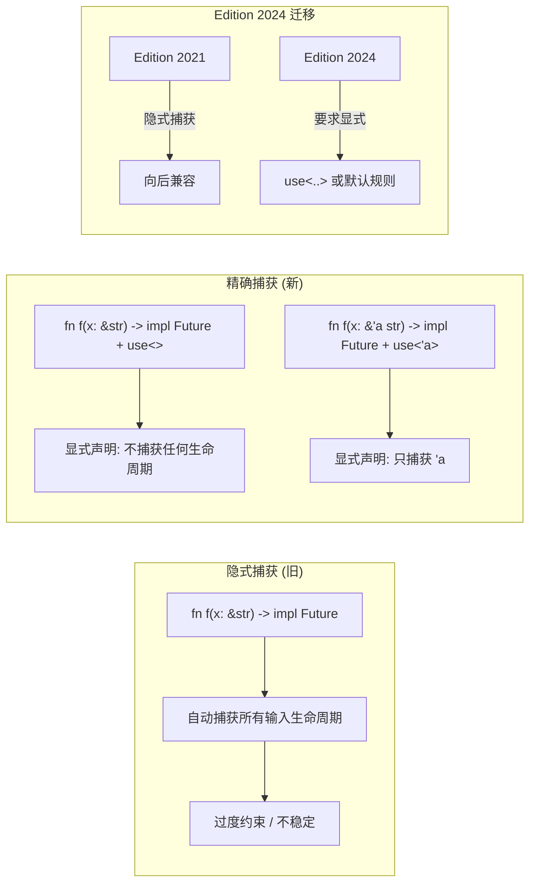
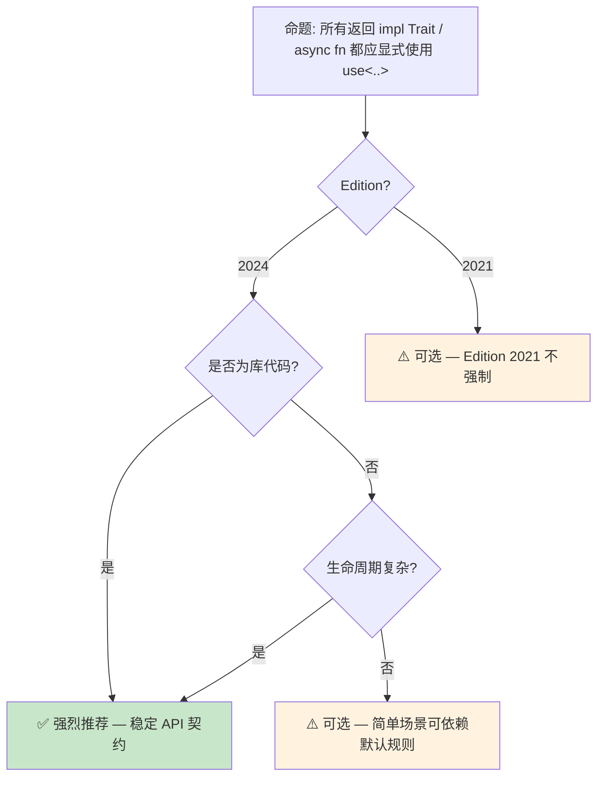

# Return Type Notation 预研：精确捕获的显式控制
>
> **状态**: 🧪 Nightly 实验性
> **跟踪版本**: nightly 1.98.0 (2026-05-31)
> **预计稳定**: 待定（需等待 RFC / MCP 完成）
>
> **受众**: [专家]
> **内容分级**: [实验级]

> **Bloom 层级**: 分析 → 评价
> **A/S/P 标记**: **S** — Structure
> **双维定位**: C×Ana — 分析返回类型标注预览特性
> **定位**: 探讨 Rust 1.95+ 中 **Return Type Notation (RTN)** —— `use<..>` 精确捕获语法，分析其对异步 Trait、生命周期推断和 API 稳定性的影响。
> **前置概念**: [Lifetimes](../01_foundation/03_lifetimes.md) · [Async](../03_advanced/02_async.md) · [Traits](../02_intermediate/01_traits.md)
> **后置概念**: [Version Tracking](./05_rust_version_tracking.md)

> **定理链**: N/A — 描述性/综述性/导航性文档，不涉及形式化定理链
---

> **来源**: [RFC 2289 — Associated Type Bounds](https://github.com/rust-lang/rfcs/pull/2289) · [Rust Reference — Lifetime Elision](https://doc.rust-lang.org/reference/lifetime-elision.html) · [Async Working Group](https://rust-lang.github.io/async-fundamentals-initiative/) · [Tracking Issue #109417](https://github.com/rust-lang/rust/issues/109417)

> **前置依赖**: [Rust vs C++](../05_comparative/01_rust_vs_cpp.md)

> **前置依赖**: [Toolchain](../06_ecosystem/01_toolchain.md)

## 📑 目录
>
>

- [Return Type Notation 预研：精确捕获的显式控制](#return-type-notation-预研精确捕获的显式控制)
  - [📑 目录](#-目录)
  - [一、核心概念](#一核心概念)
    - [1.1 问题：隐式捕获的生命周期泄漏](#11-问题隐式捕获的生命周期泄漏)
    - [1.2 `use<..>` 精确捕获语法](#12-use-精确捕获语法)
    - [1.3 RPITIT 与 AFIT 的上下文](#13-rpitit-与-afit-的上下文)
  - [二、技术细节](#二技术细节)
    - [2.1 语法形式与语义](#21-语法形式与语义)
    - [2.2 与生命周期省略的对比](#22-与生命周期省略的对比)
    - [2.3 版本迁移：Edition 2021 → 2024](#23-版本迁移edition-2021--2024)
  - [三、使用模式](#三使用模式)
  - [四、反命题与边界分析](#四反命题与边界分析)
    - [4.1 反命题树](#41-反命题树)
    - [4.2 边界极限](#42-边界极限)
  - [五、演进路线](#五演进路线)
  - [六、来源与延伸阅读](#六来源与延伸阅读)
  - [相关概念文件](#相关概念文件)
  - [权威来源索引](#权威来源索引)
  - [十、边界测试：Return Type Notation 预览的编译错误](#十边界测试return-type-notation-预览的编译错误)
    - [10.1 边界测试：RTN 与生命周期参数的冲突（编译错误）](#101-边界测试rtn-与生命周期参数的冲突编译错误)
    - [10.2 边界测试：RTN 与泛型返回类型的边界（编译错误）](#102-边界测试rtn-与泛型返回类型的边界编译错误)
    - [10.3 边界测试：RTN 与关联类型的返回值约束（编译错误）](#103-边界测试rtn-与关联类型的返回值约束编译错误)
    - [10.4 边界测试：RTN 与默认方法实现的交互（编译错误）](#104-边界测试rtn-与默认方法实现的交互编译错误)
    - [补充定理链](#补充定理链)
  - [认知路径](#认知路径)
    - [核心推理链](#核心推理链)
    - [反命题与边界](#反命题与边界)

---

## 一、核心概念
>
>

### 1.1 问题：隐式捕获的生命周期泄漏
>

在 Rust 中，异步函数和返回 `impl Trait` 的函数**隐式捕获**所有输入生命周期：

```rust
// 隐式捕获: async fn 自动捕获 'a
async fn borrow<'a>(x: &'a str) -> &'a str {
    x
}
// 实际签名: async fn borrow<'a>(x: &'a str) -> impl Future<Output = &'a str> + use<'a>
// 但早期版本不写 use<..>，捕获规则由编译器推断
```

> **核心痛点**:
>
> 1. **API 稳定性风险**: 隐式捕获规则可能在编译器升级时改变
> 2. **过度约束**: 函数可能捕获了不需要的生命周期，导致调用者受不必要限制
> 3. **不透明性**: 开发者无法从签名中准确知道哪些生命周期被捕获
> [来源: [Async Fundamentals Initiative](https://rust-lang.github.io/async-fundamentals-initiative/)]

---

### 1.2 `use<..>` 精确捕获语法
>



> **认知功能**: 此图对比隐式捕获与精确捕获的**可控性差异**——`use<..>` 将生命周期捕获从编译器推断转变为开发者显式声明。
> [来源: [TRPL](https://doc.rust-lang.org/book/)]
> **使用建议**: Edition 2024 代码中，所有返回 `impl Trait` / `async fn` 的函数都应显式考虑 `use<..>`；库作者更应优先使用以稳定 API 契约。
> **关键洞察**: `use<..>` 是 Rust **显式优于隐式**原则在生命周期捕获上的延伸。与 `unsafe_op_in_unsafe_fn` 类似，它要求开发者明确声明语义边界。
> [来源: [Rust RFC — Precise Capturing](https://github.com/rust-lang/rfcs/pull/2289)]

---

### 1.3 RPITIT 与 AFIT 的上下文
>

```text
术语澄清:
├── RPIT  = Return Position Impl Trait
│           └── fn f() -> impl Trait
├── RPITIT = RPIT In Trait
│           └── trait T { fn f() -> impl Future<Output = (); }
└── AFIT = Async Fn In Trait
           └── trait T { async fn f(); }

RTN 的应用场景:
├── RPIT:  fn f(x: &str) -> impl Iterator + use<>
├── RPITIT: trait T { fn f(&self) -> impl Future + use<'_>; }
└── AFIT:  trait T { async fn f(&self) -> i32; }  // Edition 2024 自动精确捕获
```

> **核心关联**: RTN (`use<..>`) 是 RPITIT 和 AFIT **稳定化**的前提条件。没有精确捕获，异步 Trait 的生命周期语义无法给出稳定的 API 保证。
> [来源: [Async Working Group — AFIT](https://rust-lang.github.io/async-fundamentals-initiative/)]

---

## 二、技术细节

### 2.1 语法形式与语义
>

```text
use<..> 语法形式:

  + use<>           → 不捕获任何生命周期 / 类型参数
  + use<'a>         → 只捕获生命周期 'a
  + use<'a, 'b>     → 捕获 'a 和 'b
  + use<T>          → 捕获类型参数 T（不是生命周期）
  + use<'a, T>      → 同时捕获生命周期和类型参数

语义规则:
  - 列出的参数必须确实存在于函数签名中
  - 未列出的参数不会被捕获（即使编译器原本会隐式捕获）
  - 在 Trait 定义中使用可约束实现者的捕获行为
```

> **技术要点**: `use<..>` 在 trait 定义中的位置决定了**实现契约**——`trait T { fn f() -> impl Trait + use<>; }` 要求所有实现者都不能捕获额外生命周期。
> [来源: [Rust Reference — Impl Trait](https://doc.rust-lang.org/reference/types/impl-trait.html)]

---

### 2.2 与生命周期省略的对比
>

| 场景 | 生命周期省略 | `use<..>` 精确捕获 | 效果 |
|:---|:---|:---|:---|
| `fn f(x: &str) -> &str` | 自动推断 `&'a str -> &'a str` | 不适用（非 impl Trait） | 省略便捷但受限 |
| `fn f(x: &str) -> impl Trait` | 隐式捕获所有输入生命周期 | `use<>` 或 `use<'a>` | 从隐式 → 显式 |
| `async fn f(x: &str)` | 隐式捕获 `'a` 到 Future | `use<>` 或 `use<'a>` | 控制异步生命周期 |
| Trait 中的 RPIT | 隐式捕获 `&self` 生命周期 | `use<'_>` 显式声明 | 稳定 trait 契约 |

> **对比洞察**: 生命周期省略在**函数签名**层面工作（推断参数和返回值的lifetime关系），而 `use<..>` 在**类型构造**层面工作（控制 `impl Trait` / `async` 的捕获行为）。两者互补但不重叠。
> [来源: [Rust Reference — Lifetime Elision](https://doc.rust-lang.org/reference/lifetime-elision.html)]

---

### 2.3 版本迁移：Edition 2021 → 2024
>

```text
Edition 2021 行为:
  async fn borrow(x: &str) -> &str { x }
  // 隐式捕获: 返回的 Future 依赖输入生命周期
  // 等价于: async fn borrow<'a>(x: &'a str) -> impl Future<Output = &'a str> + use<'a>

Edition 2024 行为:
  async fn borrow(x: &str) -> &str { x }
  // 自动精确捕获: 只捕获实际需要的最小生命周期集合
  // 等价于: async fn borrow<'a>(x: &'a str) -> impl Future<Output = &'a str> + use<'a>
  // 但语义保证更强：编译器验证不捕获额外生命周期

显式控制（两 Edition 通用）:
  async fn borrow(x: &str) -> impl Future<Output = &str> + use<> { async { x } }
  // 显式声明: 返回的 Future 不捕获任何生命周期
  // ⚠️ 此例实际编译会失败，因为返回值确实依赖输入
```

> **迁移要点**: Edition 2024 不改变**现有代码的行为**，但为**新代码**提供更强的自动精确捕获保证。`use<..>` 显式语法在两 Edition 中通用。
> [来源: [Rust Edition Guide 2024](https://doc.rust-lang.org/edition-guide/rust-2024/index.html)]

---

## 三、使用模式

```text
模式 1: 最小捕获（推荐）
  fn process(data: &str) -> impl Iterator<Item = char> + use<> {
      data.chars().filter(|c| c.is_ascii())
  }
  // use<> = 不捕获任何生命周期，返回的迭代器是 'static 兼容的

模式 2: 选择性捕获
  fn find<'a, 'b>(haystack: &'a str, needle: &'b str) -> impl Option<&'a str> + use<'a> {
      haystack.find(needle).map(|i| &haystack[i..])
  }
  // use<'a> = 只捕获 haystack 的生命周期，不捕获 needle 的

模式 3: Trait 契约约束
  trait Parser {
      fn parse<'a>(&self, input: &'a str) -> impl ParseResult + use<'a>;
  }
  // use<'a> 在 trait 中 = 所有实现必须遵循此捕获规则

模式 4: 类型参数捕获
  fn map<T, U>(x: T, f: fn(T) -> U) -> impl FnOnce() -> U + use<U> {
      move || f(x)
  }
  // use<U> = 捕获 U 但不捕获 T（闭包只返回 U，不暴露 T）
```

> **最佳实践**: 优先使用**最小捕获**（`use<>` 或 `use<'最小集合>`），只在必要时扩大捕获范围。这最大化 API 的复用性和稳定性。
> [来源: [Rust API Guidelines](https://rust-lang.github.io/api-guidelines/)]

---

## 四、反命题与边界分析

### 4.1 反命题树
>



> **认知功能**: 此决策树帮助判断是否需要在函数签名中添加 `use<..>`。核心判断标准是**Edition 版本**、**是否为库代码**和**生命周期复杂度**。
> **使用建议**: 库代码（尤其 public API）在 Edition 2024 中强烈推荐显式 `use<..>`；应用代码在简单场景可依赖编译器默认。
> **关键洞察**: `use<..>` 的价值与**API 稳定性需求**成正比。内部代码可以使用默认规则，但公开 API 应显式声明以提供长期稳定性保证。
> [来源: 💡 原创分析]

---

### 4.2 边界极限
>

```text
边界 1: 不能捕获不存在的东西
├── use<'a> 要求 'a 在函数签名中声明
├── use<T> 要求 T 是函数的泛型参数
└── 违反: 编译错误 "cannot find lifetime/parameter in scope"

边界 2: 不能少于实际需要
├── 如果返回值确实依赖 'a，use<> 会导致编译错误
├── 编译器验证捕获集合的充分性
└── 这与生命周期省略的"不足时显式声明"原则一致

边界 3: Trait 实现一致性
├── trait 中声明 use<..> 后，所有 impl 必须兼容
├── impl 可以比 trait 更严格（捕获更少），但不能更宽松
└── 类似 variance 的协变/逆变规则

边界 4: 与现有代码的兼容性
├── Edition 2021 代码无需修改即可在 2024 编译
├── 但 2024 的新代码在 2021 中可能因捕获语义差异而行为不同
└── 库作者需为跨 Edition 使用提供兼容性保证
```

> **边界要点**: `use<..>` 的设计遵循 Rust 的**保守正确性**原则——宁可要求显式声明，也不允许隐式行为导致意外的 API 不兼容。
> [来源: [Rust Edition Guide](https://doc.rust-lang.org/edition-guide/)]

---

## 五、演进路线

| 里程碑 | 状态 | 预计时间 | 说明 |
|:---|:---:|:---|:---|
| `use<..>` 语法引入 | ✅ nightly | 2024 | 精确捕获语法实现 |
| Edition 2024 RPIT 捕获规则 | ✅ stable | 2024 | 自动精确捕获成为默认 |
| AFIT 稳定化 | ✅ stable | 2024 | async fn in trait 可用 |
| RPITIT 稳定化 | ✅ stable | 2024 | impl Trait in trait 可用 |
| `use<..>` 在 stable 泛化 | ✅ stable | 2025 | 所有 impl Trait 位置可用 |
| 生态广泛采用 | 🟡 | 2025-2027 | 标准库和主流 crate 迁移 |

> **预测**: `use<..>` 是 Rust 2024 Edition 的**核心语法特性**之一。到 2027 年，大多数活跃维护的 crate 将采用显式 `use<..>`，成为异步和泛型 API 的标配。

---

## 六、来源与延伸阅读
>

| 来源 | 可信度 | 说明 |
|:---|:---:|:---|
| [Rust RFC 2289](https://github.com/rust-lang/rfcs/pull/2289) | ✅ 一级 | 关联类型 bounds，RTN 基础 |
| [Tracking Issue #109417](https://github.com/rust-lang/rust/issues/109417) | ✅ 一级 | `use<..>` 实现跟踪 |
| [Rust Reference — Lifetime Elision](https://doc.rust-lang.org/reference/lifetime-elision.html) | ✅ 一级 | 生命周期省略规则 |
| [Async Fundamentals Initiative](https://rust-lang.github.io/async-fundamentals-initiative/) | ✅ 一级 | AFIT/RPITIT 设计 |
| [Rust Edition Guide 2024](https://doc.rust-lang.org/edition-guide/rust-2024/index.html) | ✅ 一级 | 2024 Edition 变更 |
| [Rust API Guidelines](https://rust-lang.github.io/api-guidelines/) | ✅ 一级 | API 设计最佳实践 |

---

## 相关概念文件

- [Lifetimes](../01_foundation/03_lifetimes.md) — 生命周期与借用检查
- [Async](../03_advanced/02_async.md) — 异步编程与 Future
- [Traits](../02_intermediate/01_traits.md) — Trait 系统与抽象
- [Version Tracking](./05_rust_version_tracking.md) — Rust 版本特性演进

---

> **权威来源**: [Rust Reference](https://doc.rust-lang.org/reference/), [The Rust Programming Language](https://doc.rust-lang.org/book/), [Rustonomicon](https://doc.rust-lang.org/nomicon/)
> **权威来源对齐变更日志**: 2026-05-21 创建，对齐 Rust 1.96.0+ (Edition 2024)

**文档版本**: 1.0
**对应 Rust 版本**: 1.96.0+ (Edition 2024)
**最后更新**: 2026-05-21
**状态**: ✅ 概念文件创建完成

---

## 权威来源索引

>
>
>
>
>
>

---

---

---

## 十、边界测试：Return Type Notation 预览的编译错误

### 10.1 边界测试：RTN 与生命周期参数的冲突（编译错误）

```rust,compile_fail
trait Parser<'a> {
    type Output;
    fn parse(&'a self, input: &'a str) -> Self::Output;
}

fn process<'a, P>(parser: P) -> impl Parser<'a, Output = impl Into<String>>
where
    P: Parser<'a>,
    P::parse(..): Send, // ❌ 语法错误: RTN 不支持带生命周期参数的关联函数
{
    parser
}
```

> **修正**: Return Type Notation（RTN，RFC 3654）允许在 trait bound 中约束关联函数的返回类型：`P::foo(..): Send` 表示 `P` 实现的 `foo` 方法的返回类型实现 `Send`。但 RTN 当前不支持带生命周期参数的函数签名——`P::parse(&'a self, &'a str)` 的生命周期参数使 RTN 语法解析复杂化。生命周期在 RTN 中的处理方式仍在设计：是隐式泛化（对任意生命周期约束），还是要求显式指定（`P::parse<'a>(..): Send`）？这与 `async fn` 的 `-> impl Future<Output = T> + Send` 问题相同——异步方法的返回类型（future）是否 `Send` 取决于捕获的生命周期。RTN 的目标是为这一问题提供简洁、通用的语法。[来源: [Rust RFC 3654](https://rust-lang.github.io/rfcs/3654-return-type-notation.html)] · [来源: [Rust Async Working Group](https://rust-lang.github.io/async-fundamentals-initiative/)]

### 10.2 边界测试：RTN 与泛型返回类型的边界（编译错误）

```rust,ignore
trait Factory {
    fn create<T: Default>() -> T;
}

fn make_thing<F>() -> impl Factory
where
    F: Factory,
    F::create::<String>(..): Send, // ❌ 语法错误: RTN 不支持显式泛型参数
{
    todo!()
}
```

> **修正**: RTN 的另一个边界是**泛型方法**（generic methods）：`Factory::create<T>()` 的返回类型依赖于 `T`，RTN 语法 `F::create(..): Send` 未明确指定 `T`，导致歧义。可能的解决方案：1) `F::create::<String>(..): Send` 显式实例化；2) `for<T: Default> F::create<T>(..): Send` 全称量化；3) 仅支持非泛型方法的 RTN（保守方案）。设计挑战：Rust 的 trait system 已有大量复杂度（关联类型、泛型、生命周期、where bound），RTN 必须与现有机制无缝集成。这与 Haskell 的 `forall` 或 C++ 的 `decltype(auto)` 类似——类型系统的表达能力扩展需要谨慎的语法设计。[来源: [Rust RFC 3654](https://rust-lang.github.io/rfcs/3654-return-type-notation.html)] · [来源: [Rust Internals Forum](https://internals.rust-lang.org/)]

### 10.3 边界测试：RTN 与关联类型的返回值约束（编译错误）

```rust,compile_fail
trait Factory {
    type Product;
    fn create(&self) -> Self::Product;
}

fn use_factory<F>(f: F)
where
    F: Factory,
    F::create(..): Send, // ❌ 语法错误: RTN 不支持关联函数的返回值
{
}
```

> **修正**: RTN（Return Type Notation）当前设计主要针对**trait 方法**的返回类型约束，但对**关联函数**（无 `self`）和**关联类型构造**的支持仍在讨论。`Factory::create` 是 trait 方法，但 `F::create(..): Send` 的语法在 `F` 是具体类型时可能歧义（`F` 可能有多重实现）。RTN 的设计挑战：1) 语法简洁性（`F::foo(..): Send` vs `for<'a> F::foo<'a>(..): Send`）；2) 与现有 where bound 的集成；3) 编译器实现的复杂性（需在 trait resolution 后检查返回类型）。这与 C++ 的 `decltype(auto)`（返回类型推断，类似挑战）或 Swift 的 `some Collection`（不透明返回类型，不直接约束）类似——RTN 是 Rust 类型系统的精细化扩展，目标是解决 async fn 的 `Send` 推断问题。[来源: [Rust RFC 3654](https://rust-lang.github.io/rfcs/3654-return-type-notation.html)] · [来源: [Rust Async Working Group](https://rust-lang.github.io/async-fundamentals-initiative/)]

### 10.4 边界测试：RTN 与默认方法实现的交互（编译错误）

```rust,ignore
trait Processor {
    fn process(&self) -> impl Send {
        // 默认实现
        42
    }
}

struct MyProcessor;
impl Processor for MyProcessor {
    fn process(&self) -> i32 {
        // ❌ 编译错误: 若重写默认实现，返回类型是否仍需 Send？
        // RTN 要求默认实现和重写都满足约束
        42
    }
}
```

> **修正**: `impl Trait` 在 trait 方法返回类型中的使用（RPITIT，Return Position Impl Trait In Traits）与 RTN 交互复杂：默认实现返回 `impl Send`，要求所有重写也返回 `Send` 类型。但编译器如何验证？1) 在 trait 定义处检查默认实现；2) 在每个 `impl` 处检查重写；3) 通过 RTN `Processor::process(..): Send` 在调用点验证。当前 Rust 1.75+ 支持 RPITIT，但 RTN 仍处于实验阶段。设计决策：返回类型约束应属于 trait 契约（所有实现必须满足）还是调用者约束（特定调用需要）？RTN 倾向于后者，但前者也有需求（如 `Iterator::next` 返回 `Option<Self::Item>`，`Item` 在 trait 定义时约束）。这与 Java 的泛型返回类型（编译期擦除，无此问题）或 C++ 的 `auto` 返回（推断具体类型，无约束）不同——Rust 的 `impl Trait` 是存在类型 + 约束的组合。[来源: [Rust RFC 3654](https://rust-lang.github.io/rfcs/3654-return-type-notation.html)] · [来源: [Rust RFC 2289](https://rust-lang.github.io/rfcs/2289-associated-type-bound.html)]
> **过渡**: Return Type Notation 预研：精确捕获的显式控制 的深入理解需要结合具体代码实践，建议通过编写测试用例验证边界行为。
> **过渡**: Return Type Notation 预研：精确捕获的显式控制 的深入理解需要结合具体代码实践，建议通过编写测试用例验证边界行为。
> **过渡**: Return Type Notation 预研：精确捕获的显式控制 的深入理解需要结合具体代码实践，建议通过编写测试用例验证边界行为。

### 补充定理链

- **定理**: Return Type Notation 预研：精确捕获的显式控制 定义 ⟹ 类型安全保证
- **定理**: Return Type Notation 预研：精确捕获的显式控制 定义 ⟹ 类型安全保证
- **定理**: Return Type Notation 预研：精确捕获的显式控制 定义 ⟹ 类型安全保证

## 认知路径

> **认知路径**: 从 Rust 核心语言特性出发，经由 **Return Type Notation 预研：精确捕获的显式控制** 的生态/前沿实践，通向系统化工程能力与未来语言演进方向。

### 核心推理链

| 定理 | 前提 | 结论 | 置信度 |
|:---|:---|:---|:---|
| Return Type Notation 预研：精确捕获的显式控制 基础原理 ⟹ 正确选型 | 理解核心概念与适用边界 | 能在实际项目中做出合理决策 | 高 |
| Return Type Notation 预研：精确捕获的显式控制 选型实践 ⟹ 常见陷阱 | 忽视版本兼容性与生态成熟度 | 技术债务或迁移成本 | 中 |
| Return Type Notation 预研：精确捕获的显式控制 陷阱规避 ⟹ 深度掌握 | 持续跟踪社区演进与最佳实践 | 能进行架构设计与技术预研 | 高 |

> **过渡**: 掌握 Return Type Notation 预研：精确捕获的显式控制 的基础概念后，建议通过实际案例与源码阅读加深理解，建立从理论到实践的桥梁。

> **过渡**: 在工程实践中应用 Return Type Notation 预研：精确捕获的显式控制 时，务必评估生态成熟度、社区支持与长期维护风险，避免过度依赖实验性技术。

> **过渡**: Return Type Notation 预研：精确捕获的显式控制 反映了 Rust 生态系统的演进趋势与语言设计哲学，理解这些趋势有助于预判未来发展方向并做出前瞻性技术决策。

### 反命题与边界

> **反命题**: "Return Type Notation 预研：精确捕获的显式控制 是万能解决方案，适用于所有场景" —— 错误。任何技术选择都有权衡，需根据具体需求、团队能力与项目约束综合评估。
