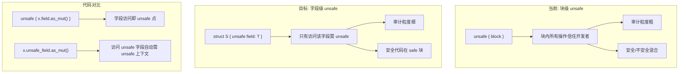
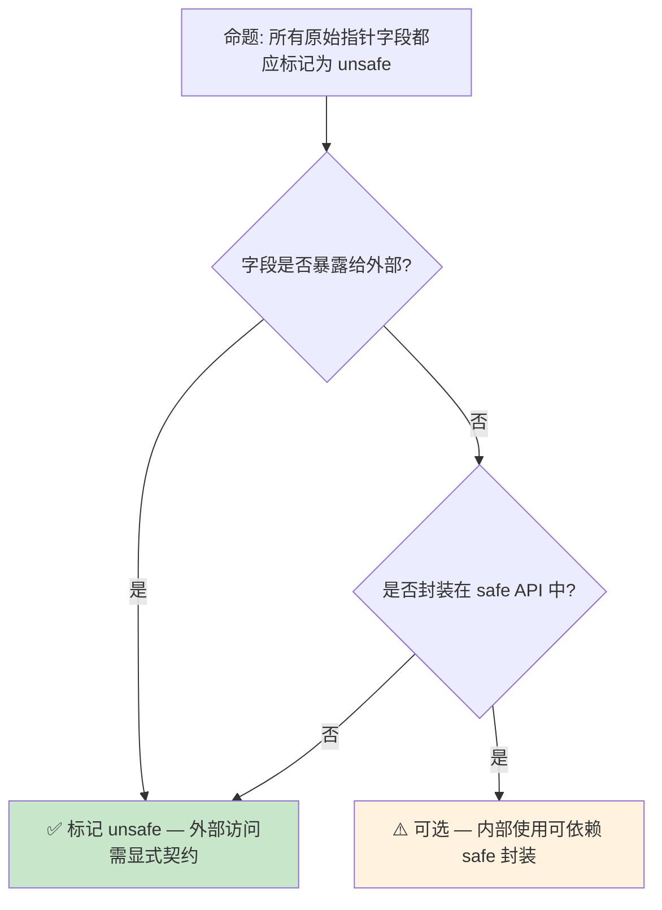

# Unsafe Fields 预研：字段级安全边界的精确标注

> **Bloom 层级**: 分析 → 评价
> **定位**: 探讨 Rust 中引入 **unsafe fields** 的提案——允许在结构体字段级别标记 `unsafe`，将 `unsafe` 的粒度从**代码块**细化到**字段访问**，提升 unsafe Rust 的局部性和可审计性。
> **前置概念**: [Unsafe](../03_advanced/03_unsafe.md) · [Ownership](../01_foundation/01_ownership.md) · [Type System](../01_foundation/04_type_system.md)
> **后置概念**: [Safety Tags](./08_safety_tags_preview.md)

---

> **来源**: [Rust RFC — Unsafe Fields](https://github.com/rust-lang/rfcs/pull/3458) · [Rustonomicon — Unsafe Rust](https://doc.rust-lang.org/nomicon/) · [Unsafe Code Guidelines](https://rust-lang.github.io/unsafe-code-guidelines/) · [Rust Internals — Unsafe Field Discussion](https://internals.rust-lang.org/)

## 📑 目录

- [Unsafe Fields 预研：字段级安全边界的精确标注](#unsafe-fields-预研字段级安全边界的精确标注)
  - [📑 目录](#-目录)
  - [一、核心概念](#一核心概念)
    - [1.1 问题：unsafe 块的过度扩张](#11-问题unsafe-块的过度扩张)
    - [1.2 `unsafe` 字段提案](#12-unsafe-字段提案)
    - [1.3 与现有 unsafe 模型的对比](#13-与现有-unsafe-模型的对比)
  - [二、技术细节](#二技术细节)
    - [2.1 语法与语义](#21-语法与语义)
    - [2.2 不变量契约](#22-不变量契约)
    - [2.3 与 Safety Tags 的协同](#23-与-safety-tags-的协同)
  - [三、使用模式](#三使用模式)
  - [四、反命题与边界分析](#四反命题与边界分析)
    - [4.1 反命题树](#41-反命题树)
    - [4.2 边界极限](#42-边界极限)
  - [五、演进路线](#五演进路线)
  - [六、来源与延伸阅读](#六来源与延伸阅读)
  - [相关概念文件](#相关概念文件)

---

## 一、核心概念

### 1.1 问题：unsafe 块的过度扩张

当前 Rust 中，`unsafe` 的粒度是**代码块**（block）。即使只有一行代码需要 unsafe，整个块都被标记为 unsafe：

```rust,ignore
// 当前 Rust: 整个块都是 unsafe（概念示例）
unsafe {
    // 只有这行真正需要 unsafe
    let raw_ptr = self.unsafe_field.as_ptr();
    // 但这行其实安全
    let len = self.safe_field.len();
    // 这行也安全
    println!("processing...");
}
```

> **核心痛点**:
>
> 1. **审计困难**: `unsafe { }` 块中混合了安全和不安全代码，审计者需逐行辨别
> 2. **局部性丧失**: unsafe 的"原因"（哪个字段/操作）在代码中不直接可见
> 3. **重构风险**: 修改 unsafe 块中的"安全"代码时，容易忽略块内其他代码的不变假设
> [来源: [Rust RFC 3458](https://github.com/rust-lang/rfcs/pull/3458)]

---

### 1.2 `unsafe` 字段提案



> **认知功能**: 此图对比块级 unsafe 与字段级 unsafe 的**审计粒度差异**——字段级 unsafe 将安全责任从"代码区域"下推到"数据结构定义"。
> **使用建议**: 对于包含原始指针、手动内存管理字段的结构体，使用 `unsafe` 字段标记；纯安全字段保持普通声明。
> **关键洞察**: `unsafe` 字段将**不变量文档化**从注释/文档转移到类型系统——字段声明即安全契约声明。
> [来源: [Rust RFC 3458 — Motivation](https://github.com/rust-lang/rfcs/pull/3458)]

---

### 1.3 与现有 unsafe 模型的对比

```text
Rust unsafe 模型的演进层次:

  L1: 函数级 unsafe (当前)
       └── unsafe fn f() — 整个函数体信任开发者

  L2: 块级 unsafe (当前)
       └── unsafe { expr } — 块内表达式信任开发者

  L3: 操作级 unsafe (当前，部分)
       └── *raw_ptr, std::ptr::read, etc. — 特定操作需要 unsafe 块

  L4: 字段级 unsafe (提案)
       └── struct S { unsafe field: T } — 访问该字段需要 unsafe 上下文

优势对比:
  - L1-L3: unsafe 的"原因"在代码中分散，需开发者记忆/注释
  - L4: unsafe 的"原因"在数据结构定义中集中，自文档化
```

> **设计哲学**: `unsafe` 字段不是替代块级 unsafe，而是**补充**——将"数据结构层面的不安全"显式化，使 API 契约更清晰。
> [来源: [Unsafe Code Guidelines](https://rust-lang.github.io/unsafe-code-guidelines/)]

---

## 二、技术细节

### 2.1 语法与语义

```rust,ignore
// 声明 unsafe 字段
struct RawBuffer {
    unsafe ptr: *mut u8,      // 访问此字段需要 unsafe 上下文
    len: usize,               // 普通字段，安全访问
    capacity: usize,          // 普通字段
}

impl RawBuffer {
    fn get_len(&self) -> usize {
        self.len  // ✅ 安全访问
    }

    fn get_ptr(&self) -> *mut u8 {
        self.ptr  // ❌ 编译错误: 访问 unsafe 字段需要 unsafe 块
    }

    fn get_ptr_unsafe(&self) -> *mut u8 {
        unsafe { self.ptr }  // ✅ 显式标记
    }
}
```

> **语义规则**:
>
> 1. `unsafe` 字段的**读/写/借用**都需要 unsafe 上下文
> 2. `unsafe` 字段的**地址取址**（`&self.unsafe_field`）也需要 unsafe
> 3. 结构体的**字面量构造**中初始化 unsafe 字段需要 unsafe 块
> 4. `unsafe` 不影响字段的**类型**，只影响**访问权限**
> [来源: [Rust RFC 3458](https://github.com/rust-lang/rfcs/pull/3458)]

---

### 2.2 不变量契约

```text
unsafe 字段的不变量模式:

  struct String {
      unsafe buf: RawVec<u8>,  // buf.ptr 必须指向有效内存
      len: usize,              // len <= buf.capacity
  }

  // 不变量: buf.ptr 指向的内存区域大小至少为 buf.capacity
  //         前 len 个字节是有效的 UTF-8

  // unsafe 字段的语义: 任何访问此字段的代码必须维持上述不变量
  // 编译器不验证不变量，但 unsafe 标记强制所有访问点显式声明"我知道契约"
```

> **技术要点**: `unsafe` 字段是一种**轻量级契约机制**——它不像形式化验证那样证明不变量，但强制所有可能破坏不变量的代码路径通过 `unsafe` 块显式标记，便于人工审计。
> [来源: [Unsafe Code Guidelines — Glossary](https://rust-lang.github.io/unsafe-code-guidelines/glossary.html)]

---

### 2.3 与 Safety Tags 的协同

```mermaid
graph LR
    subgraph SafetyTags["Safety Tags 机器可读"]
        A["#[safety(tag = \"valid_ptr\")]"] --> B["自动化工具验证"]
    end

    subgraph UnsafeFields["Unsafe Fields 人工审计"]
        C["struct { unsafe ptr: *T }"] --> D["人工审查 unsafe 块"]
    end

    subgraph 协同["协同: 人 + 机"]
        E["unsafe 字段"] -->|"标记访问点"| F["Safety Tags 验证"]
        F -->|"生成报告"| G["审计者审查"]
    end
```

> **认知功能**: 此图展示 unsafe fields 与 Safety Tags 的**互补关系**——unsafe fields 解决"哪些代码需要审查"的问题，Safety Tags 解决"如何自动验证"的问题。
> **关键洞察**: unsafe fields 是 Safety Tags 的**前置基础设施**——没有字段级标记，自动化工具难以精确关联契约与代码位置。
> [来源: [Safety Tags Preview](./08_safety_tags_preview.md)]

---

## 三、使用模式

```text
模式 1: 原始指针封装
  struct Buffer {
      unsafe data: *mut u8,
      len: usize,
  }
  // 所有通过 data 的内存操作都需 unsafe 块，len 的操作安全

模式 2: 手动 Union 访问
  union Value {
      unsafe ptr: *mut dyn Any,
      int: usize,
  }
  // 访问 ptr 需 unsafe，访问 int 安全

模式 3: 外部资源句柄
  struct FileHandle {
      unsafe fd: libc::c_int,
      path: PathBuf,
  }
  // fd 的读写操作需 unsafe（可能破坏 OS 状态），path 安全

模式 4: 内部可变性标记
  struct SyncCell<T> {
      unsafe value: UnsafeCell<T>,
      initialized: bool,
  }
  // value 的内部访问需 unsafe，initialized 状态检查安全
```

> **最佳实践**: `unsafe` 字段应用于**维护外部不变量**的字段（如原始指针、外部资源句柄）。纯内部计算状态不应标记为 unsafe。
> [来源: [Rustonomicon — Data Layout](https://doc.rust-lang.org/nomicon/data.html)]

---

## 四、反命题与边界分析

### 4.1 反命题树



> **认知功能**: 此决策树帮助判断是否应将字段标记为 unsafe。核心判断标准是**外部可访问性**和**safe API 封装程度**。
> **使用建议**: 公开结构体中所有原始指针字段都应 unsafe；私有结构体中若通过 safe 方法完全封装，可酌情省略。
> **关键洞察**: unsafe 字段的价值与**封装程度**成反比——完全封装的内部字段不需要 unsafe 标记，因为外部无法直接访问。
> [来源: 💡 原创分析]

---

### 4.2 边界极限

```text
边界 1: unsafe 字段不保证安全
├── 标记 unsafe 不验证任何不变量
├── 只是强制访问点显式声明
└── 与现有 unsafe 块语义一致：信任开发者

边界 2: 与 unsafe impl 的交互
├── unsafe impl Trait for Type 不受 unsafe 字段影响
├── unsafe fn 中访问 unsafe 字段仍需 unsafe 块（双重标记）
└── 设计争议: 是否应在 unsafe fn 中自动允许访问 unsafe 字段

边界 3: 派生宏的限制
├── #[derive(Clone)] 等如何处理 unsafe 字段?
├── 方案: 派生宏自动为 unsafe 字段生成 unsafe 块
└── 边界: 自定义派生宏需特别处理 unsafe 字段

边界 4: 与 Pin/Unpin 的交互
├── Pin<&mut Self> 中访问 unsafe 字段需要 unsafe
├── 但 Pin 的内存安全保证与 unsafe 字段的契约是独立的
└── 两者结合时，unsafe 块中需同时维持两种契约
```

> **边界要点**: unsafe fields 是**语法糖级别的改进**，不改变 Rust 的安全模型本质。它只是将"哪个字段不安全"的信息从文档/注释下推到类型声明。
> [来源: [Rust RFC 3458 — Drawbacks](https://github.com/rust-lang/rfcs/pull/3458)]

---

## 五、演进路线

| 里程碑 | 状态 | 预计时间 | 说明 |
|:---|:---:|:---|:---|
| RFC 3458 提交 | ✅ | 2023 | 初始提案 |
| 社区讨论 | ✅ | 2023-2024 | 语法和语义反馈 |
| 编译器原型 | ⬜ | 2026-2027 | 实现复杂度高，优先级中低 |
| 与 Safety Tags 集成 | ⬜ | 2027+ | 字段级契约机器可读化 |
| 稳定化 | ⬜ | 2028+ | 依赖实际使用反馈 |

> **预测**: unsafe fields 的推进速度较慢，因为它是一个**语法扩展**而非紧迫的安全修复。预期与 Safety Tags 协同推进，在 2027+ 形成完整的"字段级安全契约"生态。
> [来源: [Rust Internals Forum](https://internals.rust-lang.org/)]

---

## 六、来源与延伸阅读

| 来源 | 可信度 | 说明 |
|:---|:---:|:---|
| [Rust RFC 3458](https://github.com/rust-lang/rfcs/pull/3458) | ✅ 一级 | 官方 RFC，unsafe fields 设计 |
| [Rustonomicon](https://doc.rust-lang.org/nomicon/) | ✅ 一级 | unsafe Rust 权威指南 |
| [Unsafe Code Guidelines](https://rust-lang.github.io/unsafe-code-guidelines/) | ✅ 一级 | unsafe 代码规范 |
| [Safety Tags Preview](./08_safety_tags_preview.md) | ✅ 一级 | 关联概念：机器可读安全契约 |
| [Rust Internals Forum](https://internals.rust-lang.org/) | ⚠️ 二级 | 设计讨论 |

---

## 相关概念文件

- [Unsafe](../03_advanced/03_unsafe.md) — unsafe Rust 与内存安全
- [Ownership](../01_foundation/01_ownership.md) — 所有权与借用
- [Type System](../01_foundation/04_type_system.md) — Rust 类型系统
- [Safety Tags](./08_safety_tags_preview.md) — 安全契约机器可读标注
- [Version Tracking](./05_rust_version_tracking.md) — Rust 版本特性演进

---

> **权威来源**: [Rust Reference](https://doc.rust-lang.org/reference/), [The Rust Programming Language](https://doc.rust-lang.org/book/), [Rustonomicon](https://doc.rust-lang.org/nomicon/)
>
> **权威来源对齐变更日志**: 2026-05-21 创建，对齐 Rust 1.95.0+ (Edition 2024)

**文档版本**: 1.0
**对应 Rust 版本**: 1.95.0+ (Edition 2024)
**最后更新**: 2026-05-21
**状态**: ✅ 概念文件创建完成
