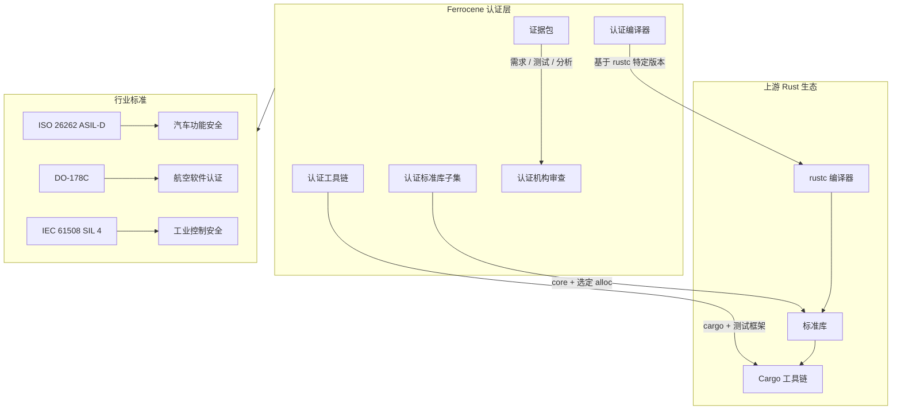
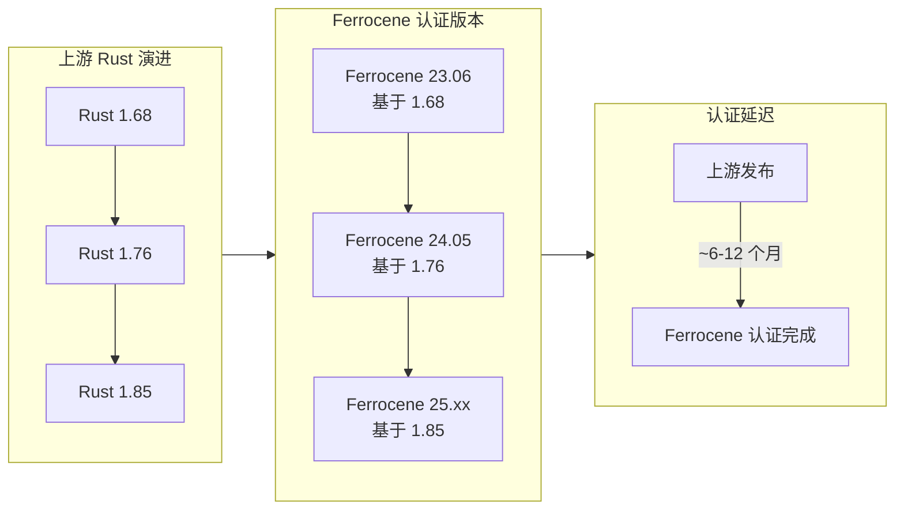
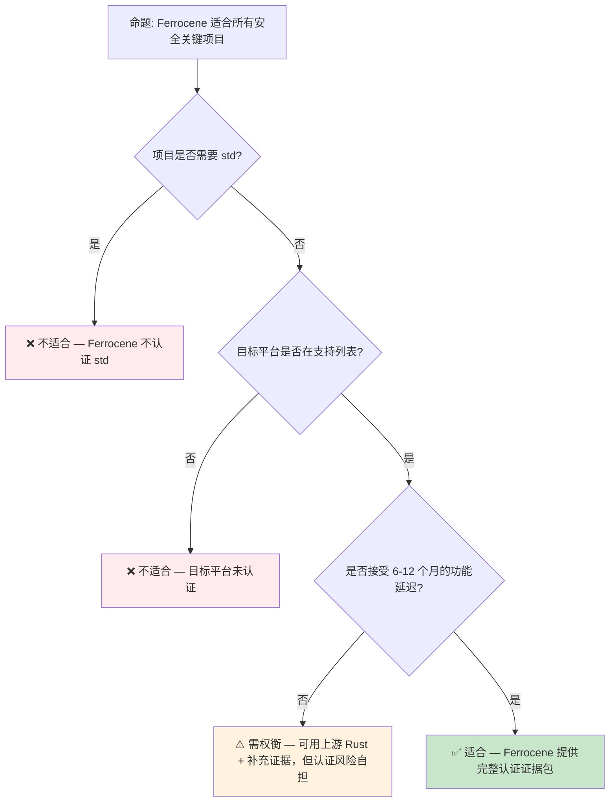

# Ferrocene 预研：Rust 的安全关键认证之路
>
> **Bloom 层级**: 分析 → 评价
> **A/S/P 标记**: **S+P** — StructureProcedure
> **双维定位**: P×Eva — 评估 Ferrocene 安全认证
> **定位**: 探讨 **Ferrocene** —— Rust 的**安全关键认证工具链**，分析其对汽车（ISO 26262 [来源: [ISO 26262](https://www.iso.org/standard/68383.html)]）、航空（DO-178C）和工业控制等安全关键领域的影响，以及 Rust 语言在形式化验证与工业认证之间的桥梁作用。
> **前置概念**: [Toolchain](../06_ecosystem/01_toolchain.md) · [Formal Methods](./02_formal_methods.md) · [MC/DC Coverage](./07_mcdc_coverage_preview.md)
> **后置概念**: [Version Tracking](./05_rust_version_tracking.md)

---

> **来源**: [Ferrocene Project](https://ferrocene.dev/) · [Ferrocene Specification](https://spec.ferrocene.dev/) · [ISO 26262 Standard](https://www.iso.org/standard/68383.html) · [DO-178C Standard](https://www.rtca.org/product/do-178c-software-considerations-in-airborne-systems-and-equipment-certification) · [Ferrous Systems Blog](https://ferrous-systems.com/blog/)

## 📑 目录
>
>

 [Ferrocene \ \ 预研：Rust 的安全关键认证之路](#ferrocene)
  - [📑 目录](#-目录)

- [一、核心概念](#一核心概念)
  - [1.1 安全关键软件的认证挑战](#11-安全关键软件的认证挑战)
  - [1.2 Ferrocene 的定位](#12-ferrocene-的定位)
  - [1.3 认证范围与限制](#13-认证范围与限制)
- [二、技术细节](#二技术细节)
  - [2.1 认证工具链的构成](#21-认证工具链的构成)
  - [2.2 与上游 Rust 的关系](#22-与上游-rust-的关系)
  - [2.3 证据包与审计追踪](#23-证据包与审计追踪)
- [三、行业应用分析](#三行业应用分析)
- [四、反命题与边界分析](#四反命题与边界分析)
  - [4.1 反命题树](#41-反命题树)
  - [4.2 边界极限](#42-边界极限)
- [五、演进路线](#五演进路线)
- [六、来源与延伸阅读](#六来源与延伸阅读)
- [相关概念文件](#相关概念文件)
- [权威来源索引](#权威来源索引)
- [十、边界测试：Ferrocene 预览的编译错误](#十边界测试ferrocene-预览的编译错误)
  - [10.1 边界测试：安全关键子集的 unsafe 禁止（编译错误）](#101-边界测试安全关键子集的-unsafe-禁止编译错误)
  - [10.2 边界测试：确定性执行与 `HashMap` 的禁用（编译错误）](#102-边界测试确定性执行与-hashmap-的禁用编译错误)
  - [10.3 边界测试：Ferrocene 子集与标准库的不完全覆盖（编译错误）](#103-边界测试ferrocene-子集与标准库的不完全覆盖编译错误)
  - [10.4 边界测试：Ferrocene 的确定性执行与浮点数（逻辑错误）](#104-边界测试ferrocene-的确定性执行与浮点数逻辑错误)

---

## 一、核心概念
>
>

### 1.1 安全关键软件的认证挑战
>

安全关键系统（汽车 ECU、航空飞控、医疗设备）要求软件通过严格的**功能安全认证**：

```text
认证核心要求（以 ISO 26262 ASIL-D / DO-178C Level-A 为例）:
├── 需求追溯: 每个代码单元必须追溯到系统级安全需求
├── 结构化覆盖: MC/DC（Modified Condition/Decision Coverage）≥ 100%
├── 工具鉴定: 编译器、测试工具等必须被"鉴定"为可信
├── 缺陷管理: 已知缺陷必须评估对安全的影响
├── 配置管理: 完整的变更历史与基线控制
└── 过程证据: 开发过程每个阶段的文档化证据

传统挑战:
├── C/C++ 的内存安全缺陷是认证中的主要风险源
├── 工具链（编译器）通常不被认证，依赖"已广泛使用"辩解
├── 形式化验证与工业实践之间存在巨大鸿沟
└── 认证成本高昂（占项目成本 30-50%）
```

> **核心痛点**: 传统安全关键开发使用 C/C++，内存安全缺陷（use-after-free、缓冲区溢出）是认证中的**主要风险源**。Rust 的所有权模型从源头上消除了这类缺陷，但 Rust 工具链本身需要通过认证才能用于安全关键项目。
> [来源: [ISO 26262-6:2018](https://www.iso.org/standard/68383.html)]

---

### 1.2 Ferrocene 的定位
>



> **认知功能**: 此图展示 Ferrocene 在 Rust 生态与工业认证标准之间的**桥梁位置**——它不是替代上游 Rust，而是为特定版本的上游 Rust 提供认证证据包。
> [来源: [Rust Reference](https://doc.rust-lang.org/reference/)]
> **使用建议**: 安全关键项目选择 Ferrocene 而非上游 Rust；一般项目继续使用上游 Rust。
> **关键洞察**: Ferrocene 的商业模式是**"认证即服务"**——持续追踪上游 Rust 的演进，为每个重要版本提供独立的认证证据包。
> [来源: [Ferrocene Project Overview](https://ferrocene.dev/)]

---

### 1.3 认证范围与限制
>

```text
Ferrocene 的认证范围（当前）:
├── 编译器: rustc 特定版本（如 1.68, 1.76）
├── 标准库子集: core（完全）+ alloc（部分）
├── 目标平台: 选定嵌入式目标（ARM Cortex-R, AArch64, x86_64）
└── 工具: cargo（构建）+ 测试框架

明确不认证的范围:
├── std 库（依赖 OS，平台行为不确定）
├── 第三方 crate（生态太大，无法逐一认证）
├── 异步运行时（tokio/async-std 的复杂度超出当前认证能力）
├── proc-macro（编译期代码生成难以形式化验证）
└── 非选定目标平台（如 RISC-V、Wasm）
```

> **范围说明**: Ferrocene 采取**保守的认证策略**——先认证最小可用子集（core + 无 OS 目标），逐步扩展。这与安全关键领域的"先证明核心正确，再扩展边界"原则一致。
> [来源: [Ferrocene Specification](https://spec.ferrocene.dev/)]

---

## 二、技术细节

### 2.1 认证工具链的构成
>

| 组件 | 上游来源 | 认证状态 | 说明 |
|:---|:---|:---:|:---|
| `rustc` | rust-lang/rust | ✅ 认证 | 特定版本冻结，完整测试覆盖 |
| `core` | rust-lang/rust | ✅ 认证 | 无堆、无 OS 依赖的安全子集 |
| `alloc` | rust-lang/rust | 🟡 部分认证 | 排除 `Vec::spare_capacity_mut` 等不稳定 API |
| `cargo` | rust-lang/cargo | ✅ 认证 | 构建系统，不含网络功能 |
| `libtest` | rust-lang/rust | ✅ 认证 | 单元测试框架 |
| `std` | rust-lang/rust | ❌ 不认证 | 依赖 OS，行为平台相关 |
| `tokio` | 第三方 | ❌ 不认证 | 异步运行时超出当前范围 |

> **技术要点**: Ferrocene 的认证策略是**"冻结 + 验证"**——选择上游 Rust 的一个稳定版本，冻结其代码，然后对该冻结版本执行完整的认证测试和分析。
> [来源: [Ferrocene Qualification Report](https://ferrocene.dev/)]

---

### 2.2 与上游 Rust 的关系
>



> **认知功能**: 此图展示 Ferrocene 与上游 Rust 的**版本延迟关系**——认证需要时间，Ferrocene 总是落后上游 6-12 个月。
> **关键洞察**: 这种延迟是**设计上的必然**——认证不能加速，因为它涉及第三方审计机构的独立审查。安全关键项目接受这种延迟以换取可信性。
> [来源: [Ferrous Systems — Ferrocene Update](https://ferrous-systems.com/blog/)]

---

### 2.3 证据包与审计追踪
>

```text
Ferrocene 证据包构成:

  1. 需求规范 (Requirements)
     └── 编译器/标准库的功能需求 → 测试用例的追溯矩阵

  2. 测试套件 (Test Suite)
     ├── rustc 上游测试（~50,000 测试用例）
     ├── Ferrocene 补充测试（边界条件、安全关键路径）
     └── MC/DC 覆盖报告（≥ 100%）

  3. 分析报告 (Analysis)
     ├── 静态分析结果（Miri、Clippy、自定义 lint）
     ├── 形式化验证（关键算法的手动证明）
     └── 风险评估（已知缺陷的安全影响分级）

  4. 过程文档 (Process)
     └── 开发过程的质量保证记录（评审、变更控制、配置管理）
```

> **证据包意义**: Ferrocene 不仅提供"工具可用"的结论，更提供**完整的证据链**——从需求到测试到分析，使认证机构能够独立验证每个安全声明。
> [来源: [Ferrocene Specification — Evidence](https://spec.ferrocene.dev/)]

---

## 三、行业应用分析

| 行业 | 标准 | Rust/Ferrocene 价值 | 当前状态 |
|:---|:---|:---|:---:|
| **汽车** | ISO 26262 ASIL-D | 所有权模型消除内存安全类缺陷（占汽车软件缺陷 70%） | 🟡 早期采用（BMW、Volvo 试点） |
| **航空** | DO-178C Level-A/B | 形式化友好的类型系统，支持 A 级软件的 MC/DC 要求 | 🟡 评估阶段 |
| **工业控制** | IEC 61508 SIL 3/4 | no_std 支持适合嵌入式 PLC/RTU | 🟡 概念验证 |
| **医疗** | IEC 62304 Class C | 高完整性要求与 Rust 的安全保证匹配 | ⬜ 待探索 |
| **航天** | ECSS-Q-ST-80C | 长周期任务需要确定性内存管理 | ⬜ 待探索 |

> **行业洞察**: 汽车行业是 Ferrocene 的**首要目标市场**——现代汽车有 100+ ECU，软件复杂度超过 1 亿行代码，传统 C/C++ 的内存安全缺陷是召回的主要原因。Rust 的所有权模型直接针对这一痛点。
> [来源: [Ferrous Systems — Industry Reports](https://ferrous-systems.com/blog/)]

---

## 四、反命题与边界分析

### 4.1 反命题树
>



> **认知功能**: 此决策树帮助评估 Ferrocene 是否适合特定项目。核心判断标准是**std 依赖**、**目标平台支持**和**功能延迟容忍度**。
> **使用建议**: 裸机/RTOS 嵌入式项目优先考虑 Ferrocene；需要 std 或异步运行时的项目需评估替代方案。
> **关键洞察**: Ferrocene 的**不适用场景**同样重要——明确边界避免项目在选择工具链时做出错误决策。
> [来源: 💡 原创分析]

---

### 4.2 边界极限
>

```text
边界 1: 认证不等于无缺陷
├── Ferrocene 认证证明"过程可控、风险已知"
├── 不证明"零缺陷"（这在复杂软件中不可能）
└── 残余风险通过安全机制（看门狗、冗余）缓解

边界 2: 生态系统的限制
├── 安全关键项目通常需要专用 crate（驱动、通信协议）
├── 这些 crate 不在 Ferrocene 认证范围内
└── 项目需自行对这些组件执行认证活动

边界 3: unsafe Rust 的认证困境
├── Ferrocene 认证覆盖 safe Rust 子集
├── unsafe 代码块需要项目级别的额外审查
└── 建议: 安全关键项目中 unsafe 代码比例 < 5%

边界 4: 与形式化验证的差距
├── Ferrocene 提供"基于测试的信任"
├── 不替代 Kani/Verus/Creusot 的形式化证明
└── 最高完整性等级可能需要 Ferrocene + 形式化验证的组合
```

> **边界要点**: Ferrocene 是 Rust 进入安全关键领域的**第一步**，但不是终点。未来的方向是"Ferrocene + 形式化验证"的组合，在工具链认证的基础上为关键模块提供数学级保证。
> [来源: [Ferrocene Risk Assessment](https://ferrocene.dev/)]

---

## 五、演进路线

| 里程碑 | 状态 | 预计时间 | 说明 |
|:---|:---:|:---|:---|
| Ferrocene 首个认证版本 | ✅ | 2023 | 基于 Rust 1.68，ISO 26262 ASIL-D |
| 扩展目标平台 | ✅ | 2024 | 新增 AArch64、x86_64 |
| 扩展标准库覆盖 | 🟡 | 2025-2026 | 更多 alloc API 纳入认证 |
| 汽车行业广泛采用 | 🟡 | 2026-2028 | 主流 Tier-1 供应商采用 |
| DO-178C 航空认证 | ⬜ | 2027+ | 航空领域的独立认证 |
| 与形式化验证集成 | ⬜ | 2028+ | Ferrocene + Kani/Verus 联合证据包 |

> **预测**: Ferrocene 将在 **2026-2028 年** 成为汽车嵌入式软件开发的主流选择之一。航空和工业控制领域的采用将滞后 2-3 年，因为这些行业的认证周期更长、保守性更强。
> [来源: [Ferrous Systems — Roadmap](https://ferrous-systems.com/blog/)]

---

## 六、来源与延伸阅读
>

| 来源 | 可信度 | 说明 |
| [Rust Reference](https://doc.rust-lang.org/reference/) | ✅ 一级 | 语言参考 |
| [Rust By Example](https://doc.rust-lang.org/rust-by-example/) | ✅ 一级 | 交互式学习 |
| [RFC Book](https://rust-lang.github.io/rfcs/) | ✅ 一级 | RFC 文档 |
| [Rust Cookbook](https://rust-lang-nursery.github.io/rust-cookbook/) | ✅ 二级 | 实践配方 |
| [This Week in Rust](https://this-week-in-rust.org/) | ✅ 二级 | 社区动态 |

| [Rust Standard Library](https://doc.rust-lang.org/std/) | ✅ 一级 | 标准库参考 |
| [Rust By Example](https://doc.rust-lang.org/rust-by-example/) | ✅ 一级 | 交互式教程 |
| [This Week in Rust](https://this-week-in-rust.org/) | ✅ 二级 | 社区动态 |

| [Rust Reference](https://doc.rust-lang.org/reference/) | ✅ 一级 | 语言参考 |
|:---|:---:|:---|
| [Ferrocene Project](https://ferrocene.dev/) | ✅ 一级 | 官方网站与文档 |
| [Ferrocene Specification](https://spec.ferrocene.dev/) | ✅ 一级 | 技术规范 |
| [ISO 26262-6:2018](https://www.iso.org/standard/68383.html) | ✅ 一级 | 汽车功能安全标准 |
| [DO-178C](https://www.rtca.org/product/do-178c) | ✅ 一级 | 航空软件认证标准 |
| [Ferrous Systems Blog](https://ferrous-systems.com/blog/) | ✅ 一级 | 开发团队博客 |
| [IEC 61508](https://www.iec.ch/functionalsafety) | 🔍 三级 | 工业控制安全标准 |

---

```rust
fn main() {
    let feature = "preview";
    println!("{}", feature);
}
```

## 相关概念文件

- [Toolchain](../06_ecosystem/01_toolchain.md) — Rust 工具链
- [Formal Methods](./02_formal_methods.md) — 形式化方法工业化
- [MC/DC Coverage](./07_mcdc_coverage_preview.md) — MC/DC 覆盖率验证
- [Version Tracking](./05_rust_version_tracking.md) — Rust 版本特性演进

---

> **权威来源**: [Rust Reference](https://doc.rust-lang.org/reference/), [The Rust Programming Language](https://doc.rust-lang.org/book/), [Rustonomicon](https://doc.rust-lang.org/nomicon/)
>
> **权威来源对齐变更日志**: 2026-05-21 创建，对齐 Rust 1.95.0+ (Edition 2024)

**文档版本**: 1.0
**对应 Rust 版本**: 1.95.0+ (Edition 2024)
**最后更新**: 2026-05-21
**状态**: ✅ 概念文件创建完成

---

## 权威来源索引

>
>
>
>
>

---

---

---

## 十、边界测试：Ferrocene 预览的编译错误

### 10.1 边界测试：安全关键子集的 unsafe 禁止（编译错误）

```rust,compile_fail
#![forbid(unsafe_code)]
#![ferrocene::compliance = "ISO-26262-ASIL-D"]

fn process(data: &[u8]) -> u32 {
    // ❌ 编译错误: Ferrocene 安全关键子集禁止裸指针转换
    let ptr = data.as_ptr() as *const u32;
    unsafe { *ptr } // 违反 forbid(unsafe_code) 和子集约束
}
```

> **修正**: Ferrocene 是 Rust 的 ISO 26262（汽车功能安全）和 IEC 61508（工业功能安全）认证工具链。它定义了**安全关键子集**（safety-critical subset）：禁止 `unsafe` 代码、禁止某些标准库 API（如 `std::mem::transmute`）、要求确定性执行（无 panic、无分配失败）。在安全关键子集中，所有操作都必须在编译期验证为安全。这与 Rust 的常规开发（允许 unsafe 封装底层操作）截然不同——Ferrocene 的目标领域（刹车系统、转向控制、安全气囊）要求最高级别的保证。开发者必须使用纯 safe Rust 实现功能，或将有 unsafe 的代码隔离在非安全关键组件中（通过严格接口契约）。这与 MISRA C（C 的安全关键子集）类似，但 Ferrocene 的约束由 Rust 的类型系统和 borrow checker 强制执行，减少人为审查负担。[来源: [Ferrocene Documentation](https://spec.ferrocene.dev/)] · [来源: [ISO 26262 Standard](https://www.iso.org/standard/68383.html)]

### 10.2 边界测试：确定性执行与 `HashMap` 的禁用（编译错误）

```rust,compile_fail
#![ferrocene::compliance = "IEC-61508-SIL-3"]

use std::collections::HashMap;

fn lookup() -> i32 {
    // ❌ 编译错误: HashMap 使用随机化哈希（SipHash），非确定性
    let mut map = HashMap::new();
    map.insert("key", 42);
    *map.get("key").unwrap()
}
```

> **修正**: `HashMap` 的默认哈希算法（SipHash 1-3）使用随机种子防止 HashDoS 攻击，但导致迭代顺序非确定性——每次运行可能不同。在安全关键系统中，非确定性使测试覆盖率和形式化验证困难：无法保证所有执行路径都被测试。Ferrocene 子集禁止非确定性 API，要求使用 `BTreeMap`（有序、确定性）或固定种子的 `HashMap`（`BuildHasherDefault`）。这与实时系统（RTOS）的确定性要求一致：执行时间、内存使用、行为路径都必须可预测。Rust 的 `BTreeMap` 提供 O(log n) 的确定性操作，是安全关键场景的首选。形式化验证工具也更易处理有序数据结构（状态空间更小）。[来源: [Ferrocene Documentation](https://spec.ferrocene.dev/)] · [来源: [Rust Standard Library](https://doc.rust-lang.org/std/collections/struct.BTreeMap.html)]

### 10.3 边界测试：Ferrocene 子集与标准库的不完全覆盖（编译错误）

```rust,compile_fail
#![ferrocene::compliance = "ISO-26262-ASIL-D"]

use std::collections::HashMap;

fn main() {
    // ❌ 编译错误: Ferrocene 子集可能排除 HashMap（非确定性迭代顺序）
    // 需使用 BTreeMap 或固定种子的哈希表
    let mut map = HashMap::new();
    map.insert("key", 42);
}
```

> **修正**: Ferrocene 的安全关键子集排除某些标准库类型和函数，原因包括：1) **非确定性**：`HashMap` 的迭代顺序依赖哈希种子和插入顺序；2) **panic 风险**：`Vec::swap_remove`、`String::from_utf8` 等可能 panic；3) **堆分配失败**：`Box::new`、`Vec::push` 在内存不足时 panic（或返回 `Result`，视配置而定）。安全关键代码需使用确定性替代：`BTreeMap`（有序）、数组（固定大小）、`Option` 传播错误。这与 MISRA C 的规则（如禁止动态内存分配）或 SPARK Ada 的 Ravenscar profile（限制任务和调度）类似——安全关键子集通过限制语言特性简化验证。Ferrocene 的目标是让 Rust 通过 ISO 26262 工具认证，使汽车制造商可使用 Rust 开发安全关键 ECU。[来源: [Ferrocene Documentation](https://spec.ferrocene.dev/)] · [来源: [ISO 26262 Standard](https://www.iso.org/standard/68383.html)]

### 10.4 边界测试：Ferrocene 的确定性执行与浮点数（逻辑错误）

```rust,compile_fail
#![ferrocene::compliance = "IEC-61508-SIL-3"]

fn compute(x: f64) -> f64 {
    // ❌ 逻辑错误: 浮点运算在不同编译器/平台上可能产生不同结果
    // IEEE 754 允许某些操作的精度差异（如 fused multiply-add）
    x * 2.0 + 1.0
}
```

> **修正**: 浮点数的**确定性执行**是形式化验证的难点：1) `x86` 的 80 位扩展精度寄存器与 `arm` 的 64 位寄存器导致中间结果不同；2) FMA（fused multiply-add）指令改变舍入行为；3) `-ffast-math` 等优化破坏 IEEE 754 语义。Ferrocene 可能要求：1) 禁用 FMA（`rustc` 的 `-C target-feature=-fma`）；2) 使用 `strict` 浮点模式；3) 对关键计算使用定点数或有理数（`fixed` crate、`num-rational`）。航空软件（DO-178C）通常禁止浮点数用于安全关键计算，或要求严格的范围分析和精度证明。这与 Ada 的 `Safe_Float`（范围约束）或 MATLAB 的 Fixed-Point Designer（定点转换）类似——浮点数的非确定性使形式化验证复杂化。[来源: [Ferrocene Documentation](https://spec.ferrocene.dev/)] · [来源: [IEEE 754 Standard](https://ieeexplore.ieee.org/document/8766229)]
