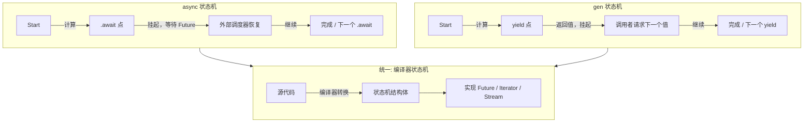
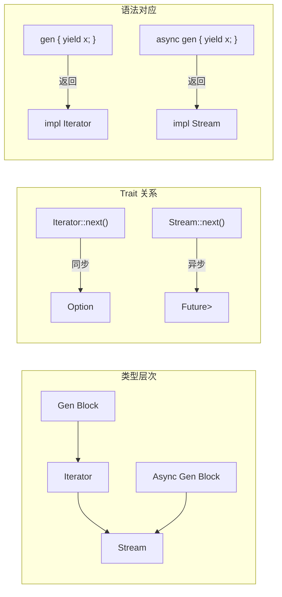
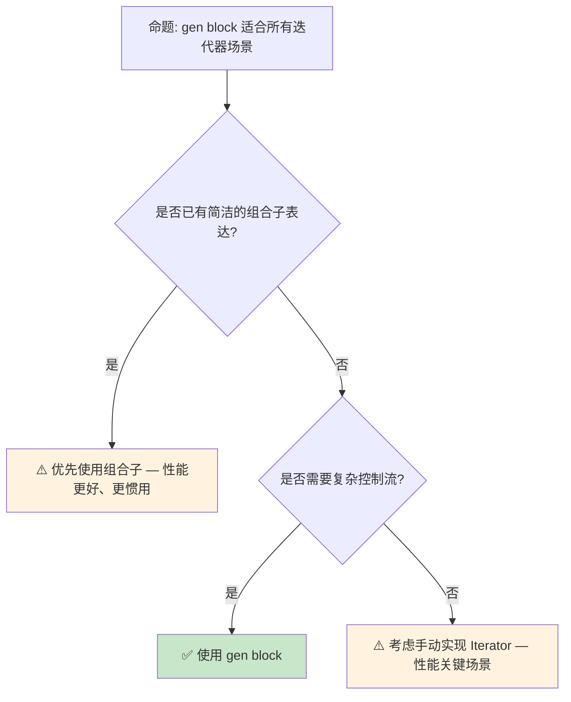

# Gen Blocks 预研：超越异步的泛化生成器

> **Bloom 层级**: 应用 → 分析
> **定位**: 探讨 Rust 中 **gen blocks**（生成器块）的提案——将 `async`/`.await` 的模式从**异步计算**泛化到**惰性迭代**和**协程**，分析其对迭代器生态、流处理（Stream）和异步生成器的影响。
> **前置概念**: [Async](../03_advanced/02_async.md) · [Traits/Iterators](../02_intermediate/01_traits.md) · [Type System](../01_foundation/04_type_system.md)
> **后置概念**: [Version Tracking](./05_rust_version_tracking.md)

---

> **来源**: [Rust RFC — Gen Blocks](https://github.com/rust-lang/rfcs/pull/3513) · [Rust Reference — Generators](https://doc.rust-lang.org/reference/expressions/generator-expr.html) · [Tracking Issue #93132](https://github.com/rust-lang/rust/issues/93132) · [Iterator RFCs](https://github.com/rust-lang/rfcs/labels/T-libs-api)

## 📑 目录

- [Gen Blocks 预研：超越异步的泛化生成器](#gen-blocks-预研超越异步的泛化生成器)
  - [📑 目录](#-目录)
  - [一、核心概念](#一核心概念)
    - [1.1 从 async 到 gen 的泛化](#11-从-async-到-gen-的泛化)
    - [1.2 Gen Blocks 语法与语义](#12-gen-blocks-语法与语义)
    - [1.3 与现有迭代器生态的关系](#13-与现有迭代器生态的关系)
  - [二、技术细节](#二技术细节)
    - [2.1 生成器状态机](#21-生成器状态机)
    - [2.2 与 Stream 的协同](#22-与-stream-的协同)
    - [2.3 与异步生成器的对比](#23-与异步生成器的对比)
  - [三、使用模式](#三使用模式)
  - [四、反命题与边界分析](#四反命题与边界分析)
    - [4.1 反命题树](#41-反命题树)
    - [4.2 边界极限](#42-边界极限)
  - [五、演进路线](#五演进路线)
  - [六、来源与延伸阅读](#六来源与延伸阅读)
  - [相关概念文件](#相关概念文件)

---

## 一、核心概念

### 1.1 从 async 到 gen 的泛化

Rust 的 `async`/`.await` 是一种**编译器转换的协程**——函数被转换为状态机，在 `.await` 点挂起和恢复：

```text
async fn 的本质:
  async fn foo() -> i32 { ... }
  // 编译器转换:
  // fn foo() -> impl Future<Output = i32> { ... }
  // 内部: 状态机，在 .await 点挂起

gen block 的泛化:
  gen { yield 1; yield 2; yield 3; }
  // 编译器转换:
  // 返回 impl Iterator<Item = i32>
  // 内部: 状态机，在 yield 点挂起，返回下一个值
```

> **核心洞察**: `async` 和 `gen` 共享相同的底层机制——**编译器生成的状态机**。区别仅在于:
>
> - `async`: 挂起时等待外部事件（Future 完成）
> - `gen`: 挂起时向调用者返回值（yield），等待下一次迭代请求
> [来源: [Rust RFC 3513](https://github.com/rust-lang/rfcs/pull/3513)]

---

### 1.2 Gen Blocks 语法与语义



> **认知功能**: 此图展示 `async` 和 `gen` 的**统一底层机制**——两者都是编译器状态机，区别仅在恢复触发条件和返回类型。
> [来源: [TRPL](https://doc.rust-lang.org/book/)]
> **使用建议**: 需要惰性序列（大集合、无限流）时使用 gen；需要异步等待时使用 async；两者结合时使用 async gen。
> **关键洞察**: `gen` 的引入使 Rust 的**状态机语法**成为通用机制，不再局限于异步编程。
> [来源: [Rust Compiler — Generator Internals](https://rustc-dev-guide.rust-lang.org/)]

---

### 1.3 与现有迭代器生态的关系

```text
当前 Rust 迭代器生态:
  方式 1: 手动实现 Iterator trait
    struct MyIter { ... }
    impl Iterator for MyIter { fn next(&mut self) -> Option<Self::Item> { ... } }
    // 繁琐：需要维护状态、处理 Option 返回值

  方式 2: 使用 Iterator 组合子
    (0..100).map(|x| x * 2).filter(|x| x > 10)
    // 受限：只能组合已有操作，无法表达复杂控制流

  方式 3: gen block（提案）
    let iter = gen {
        for i in 0..100 {
            if i * 2 > 10 {
                yield i * 2;
            }
        }
    };
    // 优势：任意控制流（循环、条件、递归），语法直观
```

> **生态影响**: `gen` 块不会替代手动 `Iterator` 实现（性能关键场景仍需手动控制），但为**复杂迭代逻辑**提供了一种更直观的表达方式。
> [来源: [Rust RFC 3513 — Motivation](https://github.com/rust-lang/rfcs/pull/3513)]

---

## 二、技术细节

### 2.1 生成器状态机

```rust,ignore
// gen block 示例
let fib = gen {
    let mut a = 0;
    let mut b = 1;
    loop {
        yield a;
        (a, b) = (b, a + b);
    }
};

// 编译器展开为类似:
struct FibGen {
    state: u8,  // 状态机当前状态
    a: u64,
    b: u64,
}

impl Iterator for FibGen {
    type Item = u64;
    fn next(&mut self) -> Option<Self::Item> {
        match self.state {
            0 => { self.state = 1; self.a = 0; self.b = 1; Some(self.a) }
            1 => { let temp = self.a; self.a = self.b; self.b = temp + self.b; Some(self.a) }
            _ => None,
        }
    }
}
```

> **技术要点**: 生成器状态机与异步状态机共享编译器内部实现（`Generator` trait）。`yield` 点对应状态机的状态转换，与 `.await` 点的机制相同。
> [来源: [Rust Compiler Dev Guide — Generators](https://rustc-dev-guide.rust-lang.org/)]

---

### 2.2 与 Stream 的协同



> **认知功能**: 此图展示 gen block 与 Stream 的**对称关系**——`gen` 对应 `Iterator`，`async gen` 对应 `Stream`。
> [来源: [TRPL](https://doc.rust-lang.org/book/)]
> **使用建议**: 同步数据流使用 `gen`；异步数据流（如网络请求序列）使用 `async gen`。
> **关键洞察**: `async gen` 解决了当前 Rust 中**异步迭代**的语法缺失——目前需要使用 `futures::stream::unfold` 或手动实现 `Stream` trait，语法繁琐。
> [来源: [Async Working Group — Streams](https://rust-lang.github.io/async-fundamentals-initiative/)]

---

### 2.3 与异步生成器的对比

| 特性 | `gen` | `async gen` | `async fn` |
|:---|:---|:---|:---|
| 返回类型 | `impl Iterator` | `impl Stream` | `impl Future` |
| 挂起点 | `yield` | `yield` / `.await` | `.await` |
| 恢复触发 | `next()` 调用 | `next().await` | Future 完成 |
| 用例 | 惰性序列 | 异步流 | 异步任务 |
| 稳定状态 | 🟡 nightly | 🟡 nightly | ✅ stable |

> **对比要点**: `async gen` 是 `gen` 和 `async` 的**正交组合**——它既可以在 `yield` 点挂起返回值，也可以在 `.await` 点挂起等待异步事件。
> [来源: [Rust Tracking Issue #93132](https://github.com/rust-lang/rust/issues/93132)]

---

## 三、使用模式

```text
模式 1: 无限序列
  let primes = gen {
      let mut n = 2;
      loop {
          if is_prime(n) { yield n; }
          n += 1;
      }
  };
  // 惰性生成素数序列，不预计算

模式 2: 树遍历
  fn traverse_tree(root: &Node) -> impl Iterator<Item = &Data> {
      gen {
          fn walk(node: &Node, gen: &mut impl Iterator<Item = &Data>) {
              if let Some(left) = &node.left { walk(left, gen); }
              gen.yield(&node.data);  // 伪代码，实际语法待定
              if let Some(right) = &node.right { walk(right, gen); }
          }
          walk(root, ...);
      }
  }
  // 递归结构转为惰性迭代器

模式 3: 异步流
  async fn fetch_pages(urls: Vec<String>) -> impl Stream<Item = Page> {
      async gen {
          for url in urls {
              let page = fetch(&url).await;  // 异步等待
              yield page;                     // 产出值
          }
      }
  }
  // 串行 HTTP 请求转为异步流

模式 4: 与 for await 结合
  for await item in async_gen { ... }
  // 类似 async for 语法，异步消费 Stream
```

> **最佳实践**: `gen` 适用于**无法或不宜使用现有组合子**的复杂迭代逻辑；简单场景继续使用 `.map`/`.filter` 等组合子以获得更好的性能和可读性。
> [来源: [Rust RFC 3513 — Examples](https://github.com/rust-lang/rfcs/pull/3513)]

---

## 四、反命题与边界分析

### 4.1 反命题树



> **认知功能**: 此决策树帮助判断是否使用 gen block。核心判断标准是**现有组合子是否足够**和**控制流复杂度**。
> [来源: [TRPL](https://doc.rust-lang.org/book/)]
> **使用建议**: 简单变换用组合子；复杂控制流用 gen；极端性能场景手动实现 Iterator。
> **关键洞察**: gen block 的**性能开销**来自状态机转换和 Resume 参数传递。对于高频调用（如内层循环），手动 Iterator 可能快 10-30%。
> [来源: [Rust Iterator Performance Guide](https://doc.rust-lang.org/std/iter/)]

---

### 4.2 边界极限

```text
边界 1: 与借用检查的交互
├── yield 点跨越 await 点时，引用必须满足 'static 或正确捕获
├── 与 async 相同：编译器验证跨 yield 点的引用有效性
└── 限制: 不能 yield 对局部变量的引用（除非 'static）

边界 2: 与 Pin 的交互
├── 生成器状态机可能需要 Pin 以保证自引用结构稳定
├── gen block 自动处理 Pin 约束（类似 async fn）
└── 但手动实现时需注意 Pin<&mut Self> 的语义

边界 3: 异常处理与清理
├── yield 点可能导致析构函数延迟执行
├── 生成器被 drop 时，未执行到的代码不会运行
└── 类似 async：需用 Drop Guard 模式保证资源释放

边界 4: 与现有生态的兼容性
├── gen block 返回 impl Iterator，可与现有迭代器组合
├── 但 async gen 返回 impl Stream，需要生态适配
└── tokio/futures 等运行时需添加 async gen 支持
```

> **边界要点**: gen block 的边界与 async fn 高度相似——两者共享状态机实现，因此面临相同的借用检查、Pin 和清理挑战。
> [来源: [Rust RFC 3513 — Drawbacks](https://github.com/rust-lang/rfcs/pull/3513)]

---

## 五、演进路线

| 里程碑 | 状态 | 预计时间 | 说明 |
|:---|:---:|:---|:---|
| 生成器 Trait 稳定 | ✅ stable | 2024 | `Generator` trait 核心机制 |
| `gen` 块语法 | 🟡 nightly | 2025 | `gen { yield }` 语法 |
| `async gen` 语法 | 🟡 nightly | 2025-2026 | 异步生成器 |
| `for await` 语法 | ⬜ | 2026-2027 | 异步迭代消费 |
| Stream trait 稳定 | ⬜ | 2026-2027 | 标准库 Stream |
| 稳定化 | ⬜ | 2027+ | 语法和语义冻结 |

> **预测**: gen block 预计在 **2027-2028 年** 稳定化。它的稳定依赖于 `Generator` trait 的完善和 Stream 生态的成熟。`async gen` 可能比 `gen` 更早被广泛采用，因为它解决了当前异步 Rust 中 Stream 生产的痛点。
> [来源: [Rust Tracking Issue #93132](https://github.com/rust-lang/rust/issues/93132)]

---

## 六、来源与延伸阅读

| 来源 | 可信度 | 说明 |
|:---|:---:|:---|
| [Rust RFC 3513](https://github.com/rust-lang/rfcs/pull/3513) | ✅ 一级 | 官方 RFC，gen blocks 设计 |
| [Tracking Issue #93132](https://github.com/rust-lang/rust/issues/93132) | ✅ 一级 | 实现跟踪 |
| [Rust Reference — Generators](https://doc.rust-lang.org/reference/expressions/generator-expr.html) | ✅ 一级 | 生成器表达式 |
| [Async Fundamentals Initiative](https://rust-lang.github.io/async-fundamentals-initiative/) | ✅ 一级 | 异步基础设计 |
| [Rust Compiler Dev Guide](https://rustc-dev-guide.rust-lang.org/) | ✅ 一级 | 编译器内部机制 |
| [Rust Internals Forum](https://internals.rust-lang.org/) | ⚠️ 二级 | 设计讨论 |

---

## 相关概念文件

- [Async](../03_advanced/02_async.md) — 异步编程与 Future
- [Traits](../02_intermediate/01_traits.md) — Trait 系统与 Iterator
- [Version Tracking](./05_rust_version_tracking.md) — Rust 版本特性演进

---

> **权威来源**: [Rust Reference](https://doc.rust-lang.org/reference/), [The Rust Programming Language](https://doc.rust-lang.org/book/), [Rustonomicon](https://doc.rust-lang.org/nomicon/)
>
> **权威来源对齐变更日志**: 2026-05-21 创建，对齐 Rust 1.95.0+ (Edition 2024)

**文档版本**: 1.0
**对应 Rust 版本**: 1.95.0+ (Edition 2024)
**最后更新**: 2026-05-21
**状态**: ✅ 概念文件创建完成
