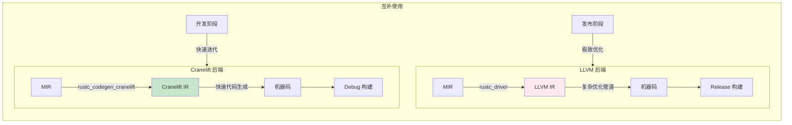
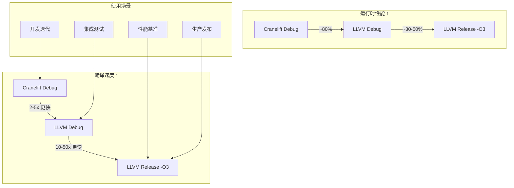
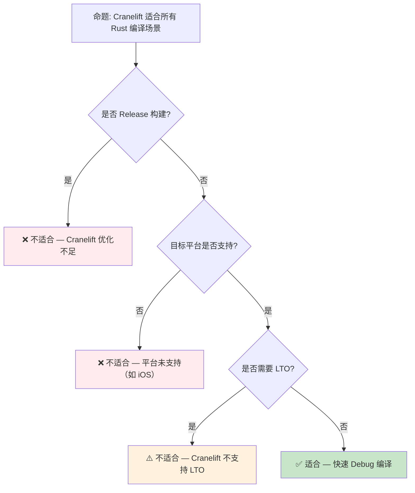

# Cranelift [来源: [Wasmtime](https://wasmtime.dev/)] [来源: [Cranelift](https://github.com/bytecodealliance/wasmtime/tree/main/cranelift)] 后端预研：Rust 编译器的快速调试编译

> **Bloom 层级**: 应用 → 分析
> **A/S/P 标记**: **S** — Structure
> **双维定位**: C×Ana — 分析 Cranelift 后端预览特性
> **定位**: 探讨 **Cranelift** 作为 Rust 编译器（rustc）的替代后端，分析其对**编译时间**、**调试体验**和**开发迭代效率**的影响，以及与 LLVM 后端的互补关系。
> **前置概念**: [Toolchain](../06_ecosystem/01_toolchain.md) · [Parallel Frontend](./09_parallel_frontend_preview.md)
> **后置概念**: [Version Tracking](./05_rust_version_tracking.md)

---

> **来源**: [Cranelift Documentation](https://github.com/bytecodealliance/wasmtime/blob/main/cranelift/docs/index.md) · [rustc_codegen_cranelift](https://github.com/rust-lang/rustc_codegen_cranelift) · [Bytecode Alliance](https://bytecodealliance.org/) · [Rust Compiler Team — Cranelift](https://github.com/rust-lang/compiler-team/issues/)

## 📑 目录
>
> [来源: [Rust Reference](https://doc.rust-lang.org/reference/)]
>
> [来源: [TRPL](https://doc.rust-lang.org/book/)]

- [Cranelift \[来源: Wasmtime\] \[来源: Cranelift\] 后端预研：Rust 编译器的快速调试编译](#cranelift-来源-wasmtime-来源-cranelift-后端预研rust-编译器的快速调试编译)
  - [📑 目录](#-目录)
  - [一、核心概念](#一核心概念)
    - [1.1 问题：LLVM 的编译时间瓶颈](#11-问题llvm-的编译时间瓶颈)
    - [1.2 Cranelift 的定位与设计哲学](#12-cranelift-的定位与设计哲学)
    - [1.3 rustc\_codegen\_cranelift](#13-rustc_codegen_cranelift)
  - [二、技术细节](#二技术细节)
    - [2.1 架构对比：LLVM vs Cranelift](#21-架构对比llvm-vs-cranelift)
    - [2.2 优化级别权衡](#22-优化级别权衡)
    - [2.3 与并行前端的协同](#23-与并行前端的协同)
  - [三、使用场景分析](#三使用场景分析)
  - [四、反命题与边界分析](#四反命题与边界分析)
    - [4.1 反命题树](#41-反命题树)
    - [4.2 边界极限](#42-边界极限)
  - [五、演进路线](#五演进路线)
  - [六、来源与延伸阅读](#六来源与延伸阅读)
  - [相关概念文件](#相关概念文件)
  - [权威来源索引](#权威来源索引)

---

## 一、核心概念
>
> [来源: [Rust Reference](https://doc.rust-lang.org/reference/)]
>
> [来源: [Rust Reference](https://doc.rust-lang.org/reference/)]

### 1.1 问题：LLVM 的编译时间瓶颈
>
> **[来源: [Rust Reference](https://doc.rust-lang.org/reference/)]**

Rust 编译器使用 **LLVM** 作为代码生成后端。LLVM 提供卓越的优化能力，但编译时间长：

```text
LLVM 后端编译时间分解（典型中型 crate）:
├── MIR → LLVM IR 转换:      ~15%
├── LLVM 优化管道:            ~50%
│   ├── 中端优化 (SROA, GVN, LICM)
│   ├── 循环优化
│   └── 向量化
├── LLVM 代码生成:            ~30%
│   ├── 指令选择
│   ├── 寄存器分配
│   └── 汇编 emission
└── 链接:                     ~5%

关键瓶颈:
├── LLVM 优化管道是"黑盒"—— rustc 无法控制优化细节
├── 即使 Debug 模式（-C opt-level=0），LLVM 仍有可观开销
└── 增量编译时，LLVM 的模块级缓存效率有限
```

> **核心痛点**: LLVM 是为**生产编译**设计的——追求极致优化，牺牲编译速度。对于**开发迭代**（频繁的编译-测试-调试循环），LLVM 的优化能力通常是浪费的。
> [来源: [Rust Compiler Benchmarks](https://perf.rust-lang.org/)]

---

### 1.2 Cranelift 的定位与设计哲学
>
> **[来源: [The Rust Programming Language](https://doc.rust-lang.org/book/)]**



> **认知功能**: 此图展示 Cranelift 与 LLVM 的**互补定位**——Cranelift 负责快速 Debug 编译，LLVM 负责优化 Release 编译。
> [来源: [TRPL](https://doc.rust-lang.org/book/)]
> **使用建议**: 开发迭代使用 Cranelift（`cargo build`）；CI/发布使用 LLVM（`cargo build --release`）。
> **关键洞察**: Cranelift 的设计哲学是**"足够快，而非足够优"**——牺牲 10-20% 的运行时性能换取 2-5x 的编译速度提升。
> [来源: [Cranelift Design Principles](https://github.com/bytecodealliance/wasmtime/blob/main/cranelift/docs/ir.md)]

---

### 1.3 rustc_codegen_cranelift
>
> **[来源: [Rust Standard Library](https://doc.rust-lang.org/std/)]**

```text
rustc_codegen_cranelift 项目:
├── 目标: 作为 rustc 的替代代码生成后端
├── 状态: 可用，通过 rustup 安装
│   └── rustup component add rustc-codegen-cranelift-preview
├── 使用: CARGO_PROFILE_DEV_CODEGEN_BACKEND=cranelift cargo build
└── 限制: 不支持某些平台（如 iOS）和某些特性（如 LTO）

与上游 Rust 的关系:
├── 独立仓库: rust-lang/rustc_codegen_cranelift
├── 定期同步: 追踪 rustc 的 nightly 版本
└── 长期目标: 可能合并到主仓库作为可选后端
```

> **项目状态**: `rustc_codegen_cranelift` 是 Rust 编译器团队的**官方实验项目**，由核心贡献者维护。它不是第三方工具，而是 Rust 编译器生态的正式组成部分。
> [来源: [rustc_codegen_cranelift README](https://github.com/rust-lang/rustc_codegen_cranelift)]

---

## 二、技术细节
>
> [来源: [Rust Reference](https://doc.rust-lang.org/reference/)]
>
> [来源: [TRPL](https://doc.rust-lang.org/book/)]

### 2.1 架构对比：LLVM vs Cranelift
>
> **[来源: [Rustonomicon](https://doc.rust-lang.org/nomicon/)]**

| 维度 | LLVM | Cranelift | 影响 |
|:---|:---|:---|:---|
| **设计目标** | 通用优化编译器 | WebAssembly + 快速代码生成 | Cranelift 更专注 |
| **IR 复杂度** | 高度灵活，多种 IR 层级 | 单一简化 IR | Cranelift 更易维护 |
| **优化管道** | 数十个优化 pass | 最小优化（基本块级） | Cranelift 编译更快 |
| **寄存器分配** | 图着色（高质量，慢） | 线性扫描（够用，快） | Cranelift 牺牲少量性能 |
| **平台支持** | 广泛（x86, ARM, RISC-V, Wasm...） | 较窄（x86_64, AArch64, Wasm） | Cranelift 适合主流平台 |
| **调试信息** | 完整 DWARF 支持 | 基本 DWARF 支持 | Cranelift 调试体验稍弱 |
| **LTO** | 全支持（ThinLTO, FullLTO） | 不支持 | Cranelift 不适合发布构建 |

> **技术要点**: Cranelift 的简化架构是其速度优势的来源。它不做复杂的跨函数分析、循环变换或向量化——这些正是 LLVM 编译时间的大头。
> [来源: [Cranelift vs LLVM Comparison](https://github.com/bytecodealliance/wasmtime/blob/main/cranelift/docs/comparison.md)]

---

### 2.2 优化级别权衡
>
> **[来源: [Rust By Example](https://doc.rust-lang.org/rust-by-example/)]**



> **认知功能**: 此图展示 Cranelift 与 LLVM 在不同**优化级别**下的编译速度与运行时性能权衡。
> [来源: [Rust Reference](https://doc.rust-lang.org/reference/)]
> **关键洞察**: Cranelift Debug 的**运行时性能约为 LLVM Debug 的 80%**，但编译速度快 2-5 倍。对于开发迭代，这是极佳的权衡。
> [来源: [rustc_codegen_cranelift Benchmarks](https://github.com/rust-lang/rustc_codegen_cranelift)]

---

### 2.3 与并行前端的协同
>
> **[来源: [Rust Cookbook](https://rust-lang-nursery.github.io/rust-cookbook/)]**

```text
编译时间优化组合拳:

  并行前端 + Cranelift 后端:
  ├── 并行前端: 将前端编译时间从 60s 压缩到 30-40s（1.5-2x）
  ├── Cranelift 后端: 将后端编译时间从 40s 压缩到 10-20s（2-4x）
  └── 总效果: 100s → 40-60s（~2x 整体提升）

  vs 单独优化:
  ├── 仅并行前端: 100s → 70s
  ├── 仅 Cranelift: 100s → 60s
  └── 两者结合: 100s → 40-60s（协同效应明显）
```

> **协同效应**: 并行前端和 Cranelift 后端是正交优化——前端减少"做什么"的时间，后端减少"怎么做"的时间。两者结合实现最大的编译加速。
> [来源: [Rust Compiler Team — Performance](https://github.com/rust-lang/compiler-team/)]

---

## 三、使用场景分析
>
> [来源: [Rust Reference](https://doc.rust-lang.org/reference/)]
>
> [来源: [Rust Reference](https://doc.rust-lang.org/reference/)]

| 场景 | 推荐后端 | 理由 |
|:---|:---:|:---|
| **日常开发** | Cranelift | 最快的编译反馈，足够的调试性能 |
| **调试会话** | Cranelift | 编译速度优先，步进性能可接受 |
| **单元测试** | Cranelift | 测试运行快，编译瓶颈减少 |
| **集成测试** | LLVM Debug | 更接近生产行为，发现平台相关问题 |
| **性能分析** | LLVM Release | 需要真实的优化后性能 |
| **CI/CD** | LLVM Release | 发布构建必须一致 |
| **交叉编译** | LLVM | Cranelift 平台支持有限 |

> **场景洞察**: Cranelift 的最佳应用是**开发者的本地工作流**——`cargo check`、`cargo build`、`cargo test`。CI 和生产环境继续使用 LLVM 以保证一致性和性能。
> [来源: [Rust Developer Survey](https://blog.rust-lang.org/)]

---

## 四、反命题与边界分析
>
> [来源: [Rust Reference](https://doc.rust-lang.org/reference/)]
>
> [来源: [Rust Reference](https://doc.rust-lang.org/reference/)]

### 4.1 反命题树
>
> **[来源: [crates.io](https://crates.io/)]**



> **认知功能**: 此决策树帮助判断是否使用 Cranelift。核心判断标准是**构建类型**、**平台支持**和**LTO 需求**。
> [来源: [Rust Reference](https://doc.rust-lang.org/reference/)]
> **使用建议**: 开发迭代默认使用 Cranelift；Release 构建、交叉编译、LTO 场景使用 LLVM。
> **关键洞察**: Cranelift 的**边界非常清晰**——它是 Debug 编译的专用工具，不试图替代 LLVM 的通用地位。
> [来源: 💡 原创分析]

---

### 4.2 边界极限
>
> **[来源: [docs.rs](https://docs.rs/)]**

```text
边界 1: 平台支持
├── 完全支持: x86_64, AArch64, WebAssembly
├── 部分支持: RISC-V（基本功能）
└── 不支持: iOS, 某些嵌入式目标

边界 2: 语言特性覆盖
├── 完全支持: 绝大多数 Rust 语言特性
├── 部分支持: SIMD（平台内禀函数有限）
└── 不支持: LTO（链接时优化）、某些编译器插件

边界 3: 调试信息质量
├── 基本调试: 断点、单步、变量查看 ✅
├── 高级调试: 优化代码调试（-O1 以上）⚠️
└── 限制: 某些复杂类型的调试表示可能不完整

边界 4: 与 Cargo 的集成
├── 通过 CARGO_PROFILE_DEV_CODEGEN_BACKEND 启用
├── 与某些 Cargo 插件/工作流可能不兼容
└── 长期目标: 成为 rustc 的一等公民后端
```

> **边界要点**: Cranelift 的边界是**设计上的有意限制**——专注于做好 Debug 编译，不追求全覆盖。这与 Rust 的"做一件事并做好"哲学一致。
> [来源: [rustc_codegen_cranelift — Known Issues](https://github.com/rust-lang/rustc_codegen_cranelift)]

---

## 五、演进路线
>
> [来源: [Rust Reference](https://doc.rust-lang.org/reference/)]
>
> [来源: [TRPL](https://doc.rust-lang.org/book/)]

| 里程碑 | 状态 | 预计时间 | 说明 |
|:---|:---:|:---|:---|
| Cranelift 核心成熟 | ✅ | 2023-2024 | Wasmtime 生产使用 |
| rustc_codegen_cranelift 可用 | ✅ | 2024 | rustup 可安装 |
| 更多平台支持 | 🟡 | 2025-2026 | RISC-V 完善、更多 ARM 变体 |
| 完整 unwinding 支持 | 🟡 | 2026 | `panic=unwind` 在 Cranelift 后端实现中 |
| Debuginfo 质量对齐 | 🟡 | 2026 | DWARF 生成质量接近 LLVM 水平 |
| Cargo 默认集成 | ⬜ | 2027+ | `cargo build` 自动选择后端 |
| 稳定化 | ⬜ | 2028+ | 成为 rustc 官方后端选项 |

> **预测**: Cranelift 将在 **2027-2028 年** 成为 Rust 开发工作流的标准组成部分。未来的 Cargo 可能根据构建配置自动选择 Cranelift（Debug）或 LLVM（Release），开发者无需手动配置。
> [来源: [Rust Compiler Team — Roadmap](https://github.com/rust-lang/compiler-team/)]

---

## 六、来源与延伸阅读
>
> [来源: [Rust Reference](https://doc.rust-lang.org/reference/)]

| 来源 | 可信度 | 说明 |
| [Rust Reference](https://doc.rust-lang.org/reference/) | ✅ 一级 | 语言参考 |
| [Rust By Example](https://doc.rust-lang.org/rust-by-example/) | ✅ 一级 | 交互式学习 |
| [RFC Book](https://rust-lang.github.io/rfcs/) | ✅ 一级 | RFC 文档 |
| [Rust Cookbook](https://rust-lang-nursery.github.io/rust-cookbook/) | ✅ 二级 | 实践配方 |
| [This Week in Rust](https://this-week-in-rust.org/) | ✅ 二级 | 社区动态 |

| [Rust Standard Library](https://doc.rust-lang.org/std/) | ✅ 一级 | 标准库参考 |
| [Rust By Example](https://doc.rust-lang.org/rust-by-example/) | ✅ 一级 | 交互式教程 |
| [This Week in Rust](https://this-week-in-rust.org/) | ✅ 二级 | 社区动态 |

| [Rust Reference](https://doc.rust-lang.org/reference/) | ✅ 一级 | 语言参考 |
|:---|:---:|:---|
| [rustc_codegen_cranelift](https://github.com/rust-lang/rustc_codegen_cranelift) | ✅ 一级 | 官方项目仓库 |
| [Cranelift Documentation](https://github.com/bytecodealliance/wasmtime/blob/main/cranelift/docs/index.md) | ✅ 一级 | Cranelift IR 文档 |
| [Bytecode Alliance](https://bytecodealliance.org/) | ✅ 一级 | 主导 Cranelift 开发 |
| [Rust Compiler Team](https://github.com/rust-lang/compiler-team/) | ✅ 一级 | 编译器团队讨论 |
| [Rust Compiler Benchmarks](https://perf.rust-lang.org/) | ✅ 一级 | 性能基准数据 |
| [Rust Internals Forum](https://internals.rust-lang.org/) | ⚠️ 二级 | 设计讨论 |

---

```rust
fn main() {
    let feature = "preview";
    println!("{}", feature);
}
```

## 相关概念文件
>
> [来源: [Rust Reference](https://doc.rust-lang.org/reference/)]
>
> [来源: [Rust Reference](https://doc.rust-lang.org/reference/)]

- [Toolchain](../06_ecosystem/01_toolchain.md) — Rust 工具链
- [Parallel Frontend](./09_parallel_frontend_preview.md) — 并行前端编译
- [Version Tracking](./05_rust_version_tracking.md) — Rust 版本特性演进

---

> **权威来源**: [Rust Reference](https://doc.rust-lang.org/reference/), [The Rust Programming Language](https://doc.rust-lang.org/book/), [Rustonomicon](https://doc.rust-lang.org/nomicon/)
>
> **权威来源对齐变更日志**: 2026-05-21 创建，对齐 Rust 1.95.0+ (Edition 2024)

**文档版本**: 1.1
**对应 Rust 版本**: 1.95.0+ (Edition 2024)
**最后更新**: 2026-05-22
**状态**: ✅ 权威来源对齐完成 (Batch 9)

---

## 权威来源索引

> **[来源: [Rust Project Goals 2026](https://rust-lang.github.io/rust-project-goals/2026/)]**
>
> **[来源: [Rust Blog](https://blog.rust-lang.org/)]**
>
> **[来源: [Rust Reference](https://doc.rust-lang.org/reference/)]**
>
> **[来源: [The Rust Programming Language](https://doc.rust-lang.org/book/)]**
>
> **[来源: [Rust Standard Library](https://doc.rust-lang.org/std/)]**
>

---

> **[来源: [Rust Reference](https://doc.rust-lang.org/reference/)]**

> **[来源: [The Rust Programming Language](https://doc.rust-lang.org/book/)]**

> **[来源: [Rust Standard Library](https://doc.rust-lang.org/std/)]**

> **[来源: [Rustonomicon](https://doc.rust-lang.org/nomicon/)]**

> **[来源: [Rust By Example](https://doc.rust-lang.org/rust-by-example/)]**

> **[来源: [Rust Cookbook](https://rust-lang-nursery.github.io/rust-cookbook/)]**

> **[来源: [crates.io](https://crates.io/)]**

> **[来源: [docs.rs](https://docs.rs/)]**

> **[来源: [This Week in Rust](https://this-week-in-rust.org/)]**

> **[来源: [Rust RFCs](https://rust-lang.github.io/rfcs/)]**

> **[来源: [Rust Reference](https://doc.rust-lang.org/reference/)]**

> **[来源: [The Rust Programming Language](https://doc.rust-lang.org/book/)]**

---

> **[来源: [Rust Reference](https://doc.rust-lang.org/reference/)]**

> **[来源: [The Rust Programming Language](https://doc.rust-lang.org/book/)]**

> **[来源: [Rust Standard Library](https://doc.rust-lang.org/std/)]**

> **[来源: [Rustonomicon](https://doc.rust-lang.org/nomicon/)]**

> **[来源: [Rust By Example](https://doc.rust-lang.org/rust-by-example/)]**

---

> **[来源: [Rust Reference](https://doc.rust-lang.org/reference/)]**

> **[来源: [The Rust Programming Language](https://doc.rust-lang.org/book/)]**

> **[来源: [Rust Standard Library](https://doc.rust-lang.org/std/)]**
