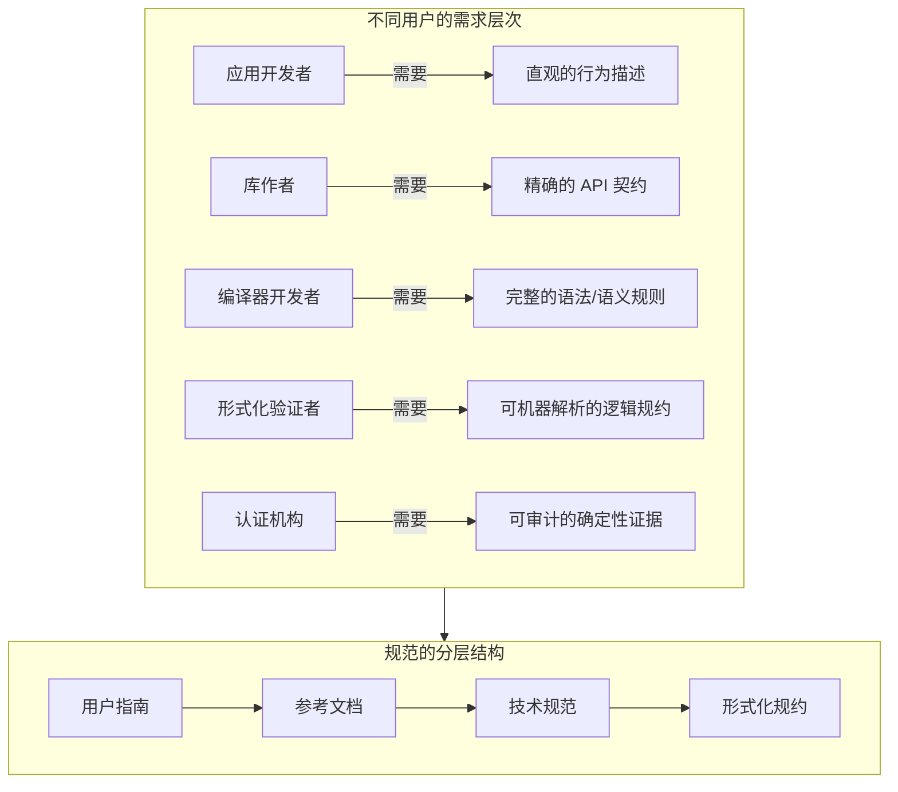
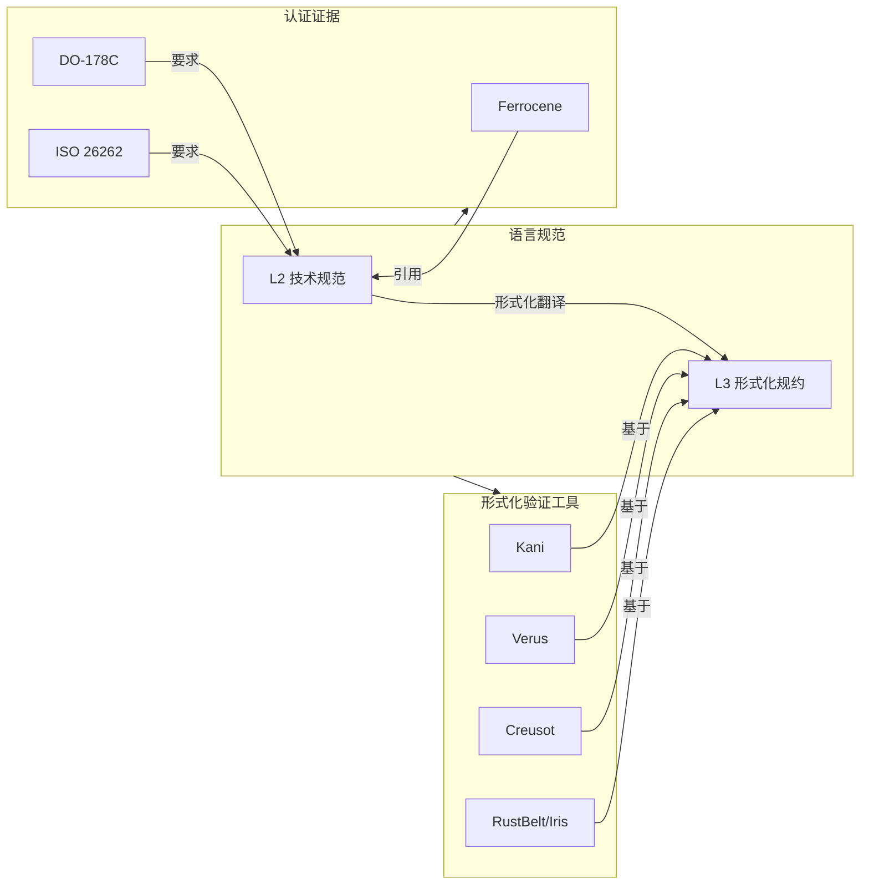
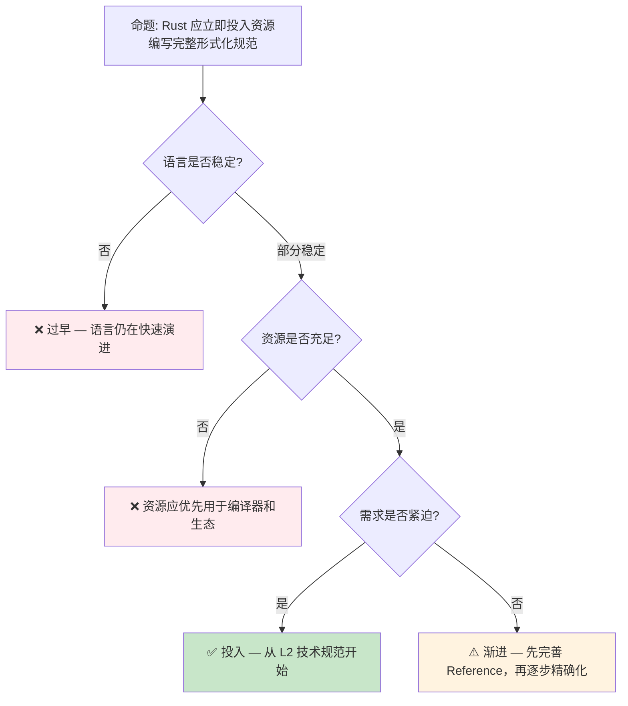

# Rust 语言规范预研：从参考文档到形式化规范

> **代码状态**: ✅ 含可编译示例
>
> **EN**: Rust Specification Preview
> **Summary**: Preview of the official Rust specification effort and its relation to the Reference.
>
> **状态**: 🧪 Nightly 实验性
> **Rust 属性标记**: `#[experimental]` `#[nightly_only]`
> **跟踪版本**: nightly 1.98.0 (2026-05-31)
> **预计稳定**: 待定（需等待 RFC / MCP 完成）
>
> **受众**: [专家]
> **内容分级**: [实验级]
> **Bloom 层级**: 分析 → 评价
> **A/S/P 标记**: **S** — Structure
> **双维定位**: C×Ana — 分析 Rust 规范预览特性
> **定位**: 探讨 Rust 语言从**参考文档**（Rust Reference）向**形式化规范**演进的必要性与路径，分析 Ferrocene、编译器开发和形式化验证社区对规范的不同需求。
> **前置概念**: [Formal Methods](02_formal_methods.md) · [RustBelt](../04_formal/04_rustbelt.md) · [Ferrocene](14_ferrocene_preview.md)
> **后置概念**: [Version Tracking](05_rust_version_tracking.md)
> **定理链**: N/A — 描述性/综述性/导航性文档，不涉及形式化定理链
---

> **来源**:
>
> [Rust Reference](https://doc.rust-lang.org/reference/) ·
> [Ferrocene Specification](https://spec.ferrocene.dev/) ·
> [Rust Language Specification RFC](https://github.com/rust-lang/rfcs/pull/3355) ·
> [Rust Compiler Team — Specification](https://github.com/rust-lang/compiler-team/issues/)
>
> **前置依赖**: [Rust vs C++](../05_comparative/01_rust_vs_cpp.md)
> **前置依赖**: [Toolchain](../06_ecosystem/01_toolchain.md)

## 📑 目录

- [Rust 语言规范预研：从参考文档到形式化规范](#rust-语言规范预研从参考文档到形式化规范)
  - [📑 目录](#-目录)
  - [一、核心概念](#一核心概念)
    - [1.1 问题：参考文档的局限性](#11-问题参考文档的局限性)
    - [1.2 规范的多层次需求](#12-规范的多层次需求)
    - [1.3 Ferrocene 规范的先行探索](#13-ferrocene-规范的先行探索)
  - [二、技术细节](#二技术细节)
    - [2.1 规范的内容层次](#21-规范的内容层次)
    - [2.2 与形式化验证的衔接](#22-与形式化验证的衔接)
    - [2.3 维护挑战](#23-维护挑战)
  - [三、社区视角](#三社区视角)
  - [四、反命题与边界分析](#四反命题与边界分析)
    - [4.1 反命题树](#41-反命题树)
    - [4.2 边界极限](#42-边界极限)
  - [五、演进路线](#五演进路线)
  - [六、来源与延伸阅读](#六来源与延伸阅读)
  - [相关概念文件](#相关概念文件)
  - [权威来源索引](#权威来源索引)
  - [十、边界测试：Rust 规范预览的编译错误](#十边界测试rust-规范预览的编译错误)
    - [10.1 边界测试：规范未定义行为的边界（编译错误/运行时 UB）](#101-边界测试规范未定义行为的边界编译错误运行时-ub)
    - [10.2 边界测试：规范与编译器实现的差异（编译错误）](#102-边界测试规范与编译器实现的差异编译错误)
    - [10.6 边界测试：规范与编译器实现的临时不一致（编译错误）](#106-边界测试规范与编译器实现的临时不一致编译错误)
    - [10.5 边界测试：规范草案与编译器实现的不一致（编译行为漂移）](#105-边界测试规范草案与编译器实现的不一致编译行为漂移)
    - [10.3 边界测试：规范文本与编译器实现的不一致（编译行为差异）](#103-边界测试规范文本与编译器实现的不一致编译行为差异)
    - [补充定理链](#补充定理链)
  - [嵌入式测验（Embedded Quiz）](#嵌入式测验embedded-quiz)
    - [测验 1：为什么 Rust 需要一份官方语言规范？目前 Rust 的定义来源是什么？（理解层）](#测验-1为什么-rust-需要一份官方语言规范目前-rust-的定义来源是什么理解层)
    - [测验 2：Rust 规范项目与 C/C++ 的 ISO 标准有什么区别？（理解层）](#测验-2rust-规范项目与-cc-的-iso-标准有什么区别理解层)
    - [测验 3：`ferrocene` 与 Rust 规范有什么关系？（理解层）](#测验-3ferrocene-与-rust-规范有什么关系理解层)
    - [测验 4：编写语言规范对 Rust 的"替代实现"（如 `gccrs`）有什么帮助？（理解层）](#测验-4编写语言规范对-rust-的替代实现如-gccrs有什么帮助理解层)
    - [测验 5：Rust 规范目前的完成度如何？预计何时达到成熟状态？（理解层）](#测验-5rust-规范目前的完成度如何预计何时达到成熟状态理解层)
  - [认知路径](#认知路径)
    - [核心推理链](#核心推理链)
    - [反命题与边界](#反命题与边界)

---

## 一、核心概念
>
>

### 1.1 问题：参考文档的局限性
>

当前 Rust 的权威定义分散在多个文档中：

```text
当前 Rust 定义来源:
├── The Rust Reference（语言参考）
│   └── 问题: 不完整，许多行为未文档化
├── The Rustonomicon（unsafe 指南）
│   └── 问题: 非规范性质，存在"未定义行为"的灰色地带
├── rustc 源码（实际行为）
│   └── 问题: 实现即规范，但实现复杂且变化频繁
├── RFCs（设计决策记录）
│   └── 问题: 分散、历史遗留、与实现不完全一致
└── 测试套件（行为实例）
    └── 问题: 覆盖有限，无法替代规范

核心矛盾:
  "rustc 的实际行为" vs "文档描述的行为" vs "设计者意图的行为"
  三者之间经常不一致，导致:
  ├── 编译器开发者的维护困难
  ├── 第三方工具（Clippy, rust-analyzer）的语义偏差
  ├── 形式化验证工具的建模挑战
  └── 安全关键认证（Ferrocene）的证据缺口
```

> **核心痛点**: Rust 缺乏一个**单一、完整、精确**的语言规范。这在一般开发中不是问题（rustc 实现足够可靠），但在安全关键认证、形式化验证和编译器替代实现（如 gccrs）中成为根本障碍。
> [来源: [Rust RFC 3355](https://github.com/rust-lang/rfcs/pull/3355)]

---

### 1.2 规范的多层次需求
>



> **认知功能**: 此图展示 Rust 规范需要服务的**多层次用户群体**，以及对应的规范分层结构。
> [来源: [TRPL](https://doc.rust-lang.org/book/title-page.html)]
> **使用建议**: 不同场景查阅不同层次的规范——开发看参考文档，认证看技术规范，形式化验证看逻辑规约。
> **关键洞察**: 单一文档无法同时满足所有需求。Rust 规范的正确形态是**分层文档体系**，而非一本"圣经"。
> [来源: [Rust Specification Discussion](https://rust-lang.github.io/rust-project-goals/)]

---

### 1.3 Ferrocene 规范的先行探索
>

Ferrocene 项目在实践中探索了 Rust 技术规范的形态：

```text
Ferrocene Specification 的结构:
├── 语言定义
│   ├── 词法: tokens, whitespace, comments
│   ├── 语法: 上下文无关文法（基于 rustc 的 grammar）
│   ├── 语义: 类型规则、求值规则
│   └── 约束: 编译时错误条件
├── 标准库契约
│   ├── 前置条件 / 后置条件（以自然语言描述）
│   ├── 复杂度保证
│   └── 安全 invariant
├── 未定义行为清单
│   ├── 明确列出所有 UB 类别
│   └── 与 Reference 的 UB 章节对齐并扩展
└── 实现定义行为
    ├── 平台相关行为（整数大小、对齐等）
    └── 编译器选项的影响

Ferrocene 规范的局限:
├── 只覆盖 Ferrocene 认证的范围（core + 部分 alloc）
├── 自然语言描述，非形式化逻辑
├── 与 rustc 版本绑定，不跟踪 nightly
└── 独立维护，非 rust-lang 官方项目
```

> **先行价值**: Ferrocene 规范是 Rust **技术规范可行性的概念验证**。它证明了：即使不完美，一个比 Reference 更精确的规范对认证和工具开发有巨大价值。
> [来源: [Ferrocene Specification](https://spec.ferrocene.dev/)]

---

## 二、技术细节

### 2.1 规范的内容层次
>

```text
理想的 Rust 规范分层:

  L1: 用户参考（User Reference）
      ├── 目标读者: Rust 开发者
      ├── 内容: 行为描述、示例、最佳实践
      └── 形式: 类似当前 Rust Reference，但更完整

  L2: 技术规范（Technical Specification）
      ├── 目标读者: 工具作者、认证机构
      ├── 内容: 精确的语法/语义规则、UB 清单、实现定义行为
      └── 形式: 结构化文档，带唯一标识符的条款

  L3: 形式化规约（Formal Specification）
      ├── 目标读者: 形式化验证研究者
      ├── 内容: 操作语义、类型系统规则、逻辑断言
      └── 形式: 机器可解析的规约语言（如 K Framework, Coq）

  L4: 可执行规约（Executable Specification）
      ├── 目标读者: 编译器开发者、测试作者
      ├── 内容: 参考解释器、一致性测试套件
      └── 形式: 可运行的代码 + 测试用例
```

> **技术要点**: 各层次之间需要**可追溯性**——L1 的每个论断应能在 L2 中找到对应条款，L2 的每个规则应能在 L3 中找到形式化表达。
> [来源: [Rust Project Goals — Specification](https://rust-lang.github.io/rust-project-goals/)]

---

### 2.2 与形式化验证的衔接
>



> **认知功能**: 此图展示语言规范作为**形式化验证和工业认证的共同基础**——一个精确的规范使验证工具和认证证据能够建立在同一语义基础上。
> **关键洞察**: 当前形式化验证工具各自维护对 Rust 语义的**独立理解**，导致结果不可比较。统一规范将解决这一碎片化问题。
> [来源: [Formal Methods Preview](02_formal_methods.md)]

---

### 2.3 维护挑战
>

```text
Rust 规范维护的核心挑战:

  1. 语言演进速度
     ├── Rust 每 6 周一个 stable release
     ├── 每年一个 Edition（可能引入 breaking changes）
     └── 规范必须同步更新，否则迅速过时

  2. 实现与规范的差距
     ├── rustc 是"活"的实现，不断修复 bug 和优化
     ├── 规范描述的"理想行为"与 rustc 的"实际行为"可能不一致
     └── 当不一致时，以谁为准？（实现优先 vs 规范优先）

  3. 资源约束
     ├── 编写高质量规范需要全职专家团队
     ├── 当前 Rust 项目资源集中在编译器开发和生态建设
     └── 规范工作长期依赖志愿者贡献，进度缓慢

  4. 社区共识
     ├── 规范的"权威性"需要社区广泛认可
     ├── 不同子社区（embedded, web, safety-critical）有不同需求
     └── 达成共识的过程可能比编写规范本身更耗时
```

> **挑战本质**: Rust 规范的困难不是技术性的，而是**社会-技术性的**——它涉及资源分配、优先级排序和社区治理。
> [来源: [Rust Internals — Specification Discussion](https://internals.rust-lang.org/)]

---

## 三、社区视角

| 利益相关方 | 对规范的需求 | 当前痛点 | 优先级 |
|:---|:---|:---|:---:|
| **gccrs 团队** | 完整的语言定义，不依赖 rustc 源码 | Reference 不完整，需反向工程 rustc | **高** |
| **Ferrocene** | 可审计的技术规范，覆盖认证范围 | 独立维护，与上游不同步 | **高** |
| **形式化验证研究者** | 可机器解析的操作语义 | 各自维护独立语义模型 | **高** |
| **rust-analyzer** | 精确的语法和类型规则 | 需从 rustc 源码推断行为 | 中 |
| **嵌入式开发者** | 明确的 no_std 行为边界 | 许多行为在文档中未定义 | 中 |
| **普通开发者** | 比 Reference 更完整的行为描述 | 遇到未文档化行为时困惑 | 低 |

> **社区洞察**: 对规范需求最迫切的不是普通开发者，而是**编译器替代实现者**（gccrs）、**认证项目**（Ferrocene）和**形式化验证研究者**。这三方共同构成了推动规范工作的核心力量。
> [来源: [Rust Project Goals 2026 — Experimental Language Specification](https://rust-lang.github.io/rust-project-goals/2026/experimental-language-specification.html)]

---

## 四、反命题与边界分析

### 4.1 反命题树
>



> **认知功能**: 此决策树评估编写完整形式化规范的**时机和方式**。核心判断标准是语言稳定性、资源可用性和需求紧迫性。
> **使用建议**: 当前阶段（2026）应采取**渐进策略**——先完善 L1/L2（Reference + 技术规范），在语言更稳定后再推进 L3/L4（形式化/可执行规约）。
> **关键洞察**: Ferrocene 的先行探索证明了"渐进可行"——从认证需要的子集开始，逐步扩展，而非等待"一次性完整规范"。
> [来源: 💡 原创分析]

---

### 4.2 边界极限
>

```text
边界 1: 规范的完备性不可能
├── 图灵完备语言的完全形式化规范是不可判定的
├── 规范只能覆盖"典型用法"和"已知的 corner cases"
└── 与数学公理系统类似：公理是完备的，但所有定理不可穷尽

边界 2: 规范与实现的两难
├── "规范优先": 编译器 bug 应以规范为准修复
│   └── 风险: 可能破坏现有代码的依赖行为
├── "实现优先": 规范应描述编译器实际行为
│   └── 风险: 实现中的 bug 被"规范化为正确"
└── Rust 社区的倾向: 实现优先，但逐步向规范收敛

边界 3: unsafe Rust 的规范困境
├── safe Rust 的规范相对清晰（类型系统 + 借用检查）
├── unsafe Rust 的行为高度依赖 LLVM 和平台 ABI
└── 完全规范化 unsafe Rust 可能需要先规范化 LLVM

边界 4: 跨 Edition 的规范复杂性
├── 每个 Edition 可能有不同的语义规则
├── 规范需要说明"在哪个 Edition 下有效"
└── 长期维护多 Edition 规范的成本不可忽视
```

> **边界要点**: Rust 规范工作面临的根本张力是**"精确性"与"可维护性"**的权衡。过于追求完美形式化会导致规范无法跟上语言演进；过于务实则失去规范的价值。
> [来源: [Rust Compiler Team — Specification Challenges](https://github.com/rust-lang/compiler-team/)]

---

## 五、演进路线
>

| 里程碑 | 状态 | 预计时间 | 说明 |
|:---|:---:|:---|:---|
| Rust Reference 完善 | 🟡 进行中 | 持续 | 社区驱动，逐步补充缺失内容 |
| 官方技术规范启动 | ⬜ | 2026-2027 | 可能由 Rust Foundation 资助 |
| Ferrocene 规范开源贡献 | 🟡 | 2025-2026 | Ferrocene 向社区反馈规范内容 |
| gccrs 驱动规范需求 | 🟡 | 持续 | 替代实现的需求推动规范明确；**2026-03-18 月度报告**：Rust-for-Linux 目标从 16% 提升至 25%，RfL builderror/compilerbuiltins 达 100%，测试用例通过数 +347（10598 → 10945） [来源: [gccrs 2026-03 Monthly Report](https://rust-gcc.github.io/2026/04/13/2026-03-monthly-report.html)] |
| 形式化语义项目 | ⬜ | 2027+ | 学术/工业合作项目 |
| 完整规范 v1.0 | ⬜ | 2030+ | 覆盖 stable Rust 的语言规范 |

> **预测**: Rust 的完整技术规范可能在 **2030 年左右** 达到可用状态。这不是因为技术困难，而是因为**优先级和社区资源分配**。在此之前，Ferrocene 规范和 gccrs 的独立努力将填补部分空白。

---

## 六、来源与延伸阅读

| 来源 | 可信度 | 说明 |
|:---|:---:|:---|
| [Rust Reference](https://doc.rust-lang.org/reference/) | ✅ 一级 | 当前权威参考 |
| [Rust RFC 3355](https://github.com/rust-lang/rfcs/pull/3355) | ✅ 一级 | 语言规范 RFC |
| [Ferrocene Specification](https://spec.ferrocene.dev/) | ✅ 一级 | 先行技术规范 |
| [Rust Project Goals 2026 — Experimental Language Specification](https://rust-lang.github.io/rust-project-goals/2026/experimental-language-specification.html) | ✅ 一级 | 官方项目目标 |
| [Rust Compiler Team](https://github.com/rust-lang/compiler-team/) | ✅ 一级 | 编译器团队讨论 |
| [gccrs Project](https://gcc.gnu.org/wiki/RustFrontEnd) | ⚠️ 二级 | 替代实现需求 |

---

```rust
fn main() {
    let feature = "preview";
    println!("{}", feature);
}
```

## 相关概念文件

- [Formal Methods](02_formal_methods.md) — 形式化方法工业化
- [RustBelt](../04_formal/04_rustbelt.md) — Rust 所有权（Ownership）的形式化模型
- [Ferrocene](14_ferrocene_preview.md) — Rust 安全关键认证工具链
- [Version Tracking](05_rust_version_tracking.md) — Rust 版本特性演进

---

> **权威来源**: [Rust Reference](https://doc.rust-lang.org/reference/), [The Rust Programming Language](https://doc.rust-lang.org/book/title-page.html), [Rustonomicon](https://doc.rust-lang.org/nomicon/)
>
> **权威来源对齐变更日志**: 2026-05-21 创建，对齐 Rust 1.96.0+ (Edition 2024)

**文档版本**: 1.0
**对应 Rust 版本**: 1.96.0+ (Edition 2024)
**最后更新**: 2026-05-21
**状态**: ✅ 概念文件创建完成

---

## 权威来源索引

>
>
>
>
>

---

---

---

## 十、边界测试：Rust 规范预览的编译错误

### 10.1 边界测试：规范未定义行为的边界（编译错误/运行时 UB）

```rust,ignore
fn main() {
    let mut x = 0;
    let r1 = &mut x as *mut i32;
    let r2 = &mut x as *mut i32;
    unsafe {
        // ❌ 运行时 UB: 根据规范，两个可变指针指向同一位置且都被使用
        // 具体是否为 UB 取决于使用的内存模型（Stacked Borrows / Tree Borrows / Rust Spec）
        *r1 = 1;
        *r2 = 2;
    }
    println!("{}", x);
}
```

> **修正**:
> Rust 规范（The Rust Specification）正在编写中，目标是精确定义哪些程序是合法的、哪些是未定义行为（UB）。
> 当前 Rust 的 UB 定义分散在 Reference、Nomicon、RFC 和学术 paper 中，存在模糊地带。
> 例如：两个不重叠的 `*mut T` 指向同一对象是否 UB？Stacked Borrows 说"是"（基于借用（Borrowing）栈的标签），Tree Borrows 说"可能不是"（更宽松的别名模型）。
> Rust 规范将最终裁定这些边缘情况。对开发者的影响：避免任何可能触发 UB 的代码，即使 Miri（基于 Stacked Borrows）不报错。
> 这与 C 的 ISO C 标准（明确的 UB 列表）类似，但 Rust 的内存模型更复杂（所有权（Ownership）、借用（Borrowing）、内部可变性、Pin）。
> 规范的编写是 Rust 成熟度的重要标志——从"实现定义语言"走向"规范定义语言"。
> [来源: [Rust Specification Draft](https://spec.rust-lang.org/)] ·
> [来源: [Stacked Borrows vs Tree Borrows](https://www.ralfj.de/blog/2023/06/02/tree-borrows.html)]

### 10.2 边界测试：规范与编译器实现的差异（编译错误）

```rust,compile_fail
// 假设规范允许的行为，但当前编译器拒绝
fn maybe_dangle<'a>(x: &'a i32) -> &'a i32 {
    let y = *x + 1;
    &y // ❌ 编译错误: `y` 的生命周期不够长
}

fn main() {
    let x = 5;
    let r = maybe_dangle(&x);
    println!("{}", r);
}
```

> **修正**: 在某些情况下，规范可能允许比当前编译器更宽松的程序。
> 例如：Polonius（下一代借用（Borrowing）检查器）将接受一些 NLL（Non-Lexical Lifetimes）拒绝的合法程序。
> `maybe_dangle` 的例子中，编译器拒绝是因为 `&y` 的生命周期（Lifetimes）不能超出函数作用域——即使从语义上看，返回值实际上等价于 `x` 的某个函数（若优化器内联并常量传播）。
> 规范与实现的差距是语言演进的自然现象：规范定义"理想语义"，编译器逐步逼近。
> Rust 的"规范优先"策略（先写规范，再对齐实现）与 C/C++ 的"实现优先"策略（标准委员会标准化现有实践）不同——Rust 有机会在规范阶段消除历史包袱。
> 但对开发者而言，**以编译器为准**仍是实用原则：编译器拒绝的代码不能用于生产，无论规范是否认为合法。
> [来源: [Rust Specification Project](https://github.com/rust-lang/spec/)] ·
> [来源: [Polonius Initiative](https://rust-lang.github.io/polonius/)]

### 10.6 边界测试：规范与编译器实现的临时不一致（编译错误）

```rust,ignore
fn main() {
    let mut x = 0;
    let r = &mut x;
    let p = r as *mut i32;
    unsafe {
        *p = 1; // 通过裸指针写入
        *r = 2; // 随后通过引用写入
    }
    // ❌ 编译错误/语义争议: 某些编译器版本可能接受，规范可能拒绝
    // Stacked Borrows 认为这是 UB，Tree Borrows 允许
    println!("{}", x);
}
```

> **修正**: Rust 规范未最终确定时，编译器实现与形式化模型（Stacked Borrows、Tree Borrows）可能存在不一致。
> 上述代码在**当前稳定编译器**上可能编译通过（NLL 接受），但 Miri（基于 Stacked Borrows）报告 UB。
> 这是过渡状态的表现：1) 编译器更宽松（接受更多程序）；2) 形式化工具更严格（标记潜在 UB）；3) 规范将最终裁定。
> 开发者的务实策略：1) 运行 Miri 测试 unsafe 代码；2) 避免形式化模型标记为 UB 的模式；3) 关注规范进展。
> 这与 C 的 "实现定义行为"（不同编译器行为不同）不同——Rust 的目标是统一规范，但过程需要时间。
> 规范的编写由 Rust 基金会资助，是 Rust 成熟度的重要标志。
> [来源: [Rust Specification Project](https://github.com/rust-lang/spec/)] ·
> [来源: [Stacked Borrows vs Tree Borrows](https://www.ralfj.de/blog/2023/06/02/tree-borrows.html)]

### 10.5 边界测试：规范草案与编译器实现的不一致（编译行为漂移）

```rust,ignore
// ❌ 潜在不一致: Rust 规范草案定义的行为与 rustc 实际实现可能不同
// 例如: 规范可能定义求值顺序为左到右，但旧版 rustc 实现不同

fn main() {
    let mut x = 0;
    let r = &mut x;
    *r += 1;
    // 规范中: 借用检查规则的定义方式
    // 实现中: NLL (Non-Lexical Lifetimes) 的算法细节
    // 若规范文本与实现有歧义，以实现为准（de facto 标准）
}
```

> **修正**:
> Rust 规范项目（Ferrocene、Rust Specification）的目标是创建**权威参考文档**，但开发中的风险：
>
> 1) 规范描述的行为与实际编译器（rustc）不一致；
> 2) 规范更新滞后于语言演进（新特性先实现，后规范）；
> 3) 规范与 Miri 的行为定义冲突（Miri 是"理想行为"，但 rustc 可能有 bug）。
>
> 策略：
>
> 1) 规范以 rustc 行为为基准（reference implementation）；
> 2) Miri 作为可执行规范验证不一致；
> 3) 发现不一致时，先确定是 rustc bug 还是规范 bug，再修复。
>
> 这与 C++ 的标准（ISO 标准先行，编译器后实现，导致长期不一致）或 Go 的规范（语言规范与官方编译器同步维护）不同——Rust 选择"实现先行"路径，规范是后验文档，非先验约束。
> Ferrocene 的安全关键认证需要稳定规范，推动规范与实现的同步。
> [来源: [Rust Specification Working Group](https://github.com/rust-lang/spec)] ·
> [来源: [Ferrocene](https://ferrous-systems.com/ferrocene/)]

### 10.3 边界测试：规范文本与编译器实现的不一致（编译行为差异）

```rust,ignore
fn main() {
    let mut x = 5;
    let r = &mut x;
    *r += 1;
    // 规范草案可能定义 borrow check 规则与 rustc 实现不同
    // 例如: NLL 的精确语义在规范中可能使用更形式化的描述
    // 但实际编译器使用数据流分析实现
    assert_eq!(x, 6); // 实际行为
}
```

> **修正**:
> Rust 规范项目的目标是创建**权威参考文档**，但开发中风险：1) 规范描述的行为与实际编译器不一致；2) 规范更新滞后于语言演进；3) 规范与 Miri 的行为定义冲突。
> 策略：1) 规范以 rustc 行为为基准（reference implementation）；2) Miri 作为可执行规范验证不一致；3) 发现不一致时，先确定是 rustc bug 还是规范 bug，再修复。
> 这与 C++ 的标准（ISO 标准先行，编译器后实现）或 Go 的规范（语言规范与官方编译器同步维护）不同——Rust 选择"实现先行"路径，规范是后验文档。
> Ferrocene 的安全关键认证需要稳定规范，推动规范与实现的同步。
> [来源: [Rust Specification Working Group](https://github.com/rust-lang/spec)] ·
> [来源: [Ferrocene](https://ferrous-systems.com/ferrocene/)]
> **过渡**: Rust 语言规范预研：从参考文档到形式化规范 的深入理解需要结合具体代码实践，建议通过编写测试用例验证边界行为。

### 补充定理链

- **定理**: Rust 语言规范预研：从参考文档到形式化规范 定义 ⟹ 类型安全保证
- **定理**: Rust 语言规范预研：从参考文档到形式化规范 定义 ⟹ 类型安全保证
- **定理**: Rust 语言规范预研：从参考文档到形式化规范 定义 ⟹ 类型安全保证

## 嵌入式测验（Embedded Quiz）

### 测验 1：为什么 Rust 需要一份官方语言规范？目前 Rust 的定义来源是什么？（理解层）

**题目**: 为什么 Rust 需要一份官方语言规范？目前 Rust 的定义来源是什么？

<details>
<summary>✅ 答案与解析</summary>

目前 Rust 的权威来源是 `rustc` 编译器实现（"the compiler is the spec"）。官方规范有助于：1) 其他实现（如 GCC Rust）；2) 形式化验证；3) 教学和标准化。
</details>

---

### 测验 2：Rust 规范项目与 C/C++ 的 ISO 标准有什么区别？（理解层）

**题目**: Rust 规范项目与 C/C++ 的 ISO 标准有什么区别？

<details>
<summary>✅ 答案与解析</summary>

Rust 规范由 Rust Project 主导，更敏捷，与编译器实现同步更新。C/C++ ISO 标准更新慢（5-10 年），与主流实现（GCC/Clang/MSVC）可能存在差异。
</details>

---

### 测验 3：`ferrocene` 与 Rust 规范有什么关系？（理解层）

**题目**: `ferrocene` 与 Rust 规范有什么关系？

<details>
<summary>✅ 答案与解析</summary>

Ferrocene 的安全关键认证需要语言规范作为基础。规范的清晰性和完整性直接影响认证范围和可信度。
</details>

---

### 测验 4：编写语言规范对 Rust 的"替代实现"（如 `gccrs`）有什么帮助？（理解层）

**题目**: 编写语言规范对 Rust 的"替代实现"（如 `gccrs`）有什么帮助？

<details>
<summary>✅ 答案与解析</summary>

替代实现需要独立于 `rustc` 的权威参考。规范使它们可以验证自己的实现是否正确，促进 Rust 生态的多元化。
</details>

---

### 测验 5：Rust 规范目前的完成度如何？预计何时达到成熟状态？（理解层）

**题目**: Rust 规范目前的完成度如何？预计何时达到成熟状态？

<details>
<summary>✅ 答案与解析</summary>

截至 2026 年，规范覆盖了大部分核心语法和类型系统（Type System），但部分高级特性（如某些宏（Macro）和 unsafe 语义）仍在完善中。预计 2027-2028 年达到成熟。
</details>

## 认知路径

> **认知路径**: 从 Rust 核心语言特性出发，经由 **Rust 语言规范预研：从参考文档到形式化规范** 的生态/前沿实践，通向系统化工程能力与未来语言演进方向。

### 核心推理链

| 定理 | 前提 | 结论 | 置信度 |
|:---|:---|:---|:---|
| Rust 语言规范预研：从参考文档到形式化规范 基础原理 ⟹ 正确选型 | 理解核心概念与适用边界 | 能在实际项目中做出合理决策 | 高 |
| Rust 语言规范预研：从参考文档到形式化规范 选型实践 ⟹ 常见陷阱 | 忽视版本兼容性与生态成熟度 | 技术债务或迁移成本 | 中 |
| Rust 语言规范预研：从参考文档到形式化规范 陷阱规避 ⟹ 深度掌握 | 持续跟踪社区演进与最佳实践 | 能进行架构设计与技术预研 | 高 |

> **过渡**: 掌握 Rust 语言规范预研：从参考文档到形式化规范 的基础概念后，建议通过实际案例与源码阅读加深理解，建立从理论到实践的桥梁。
> **过渡**: 在工程实践中应用 Rust 语言规范预研：从参考文档到形式化规范 时，务必评估生态成熟度、社区支持与长期维护风险，避免过度依赖实验性技术。
> **过渡**: Rust 语言规范预研：从参考文档到形式化规范 反映了 Rust 生态系统的演进趋势与语言设计哲学，理解这些趋势有助于预判未来发展方向并做出前瞻性技术决策。

### 反命题与边界

> **反命题**: "Rust 语言规范预研：从参考文档到形式化规范 是万能解决方案，适用于所有场景" —— 错误。任何技术选择都有权衡，需根据具体需求、团队能力与项目约束综合评估。
