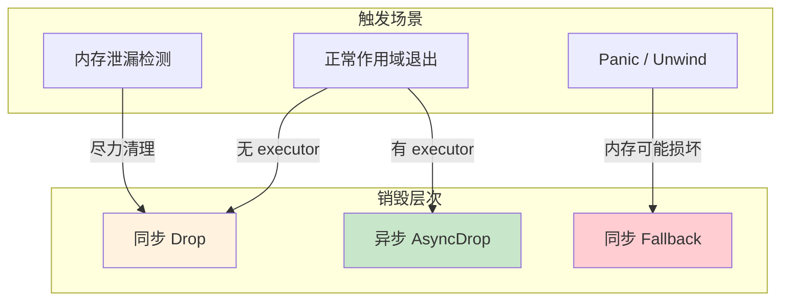
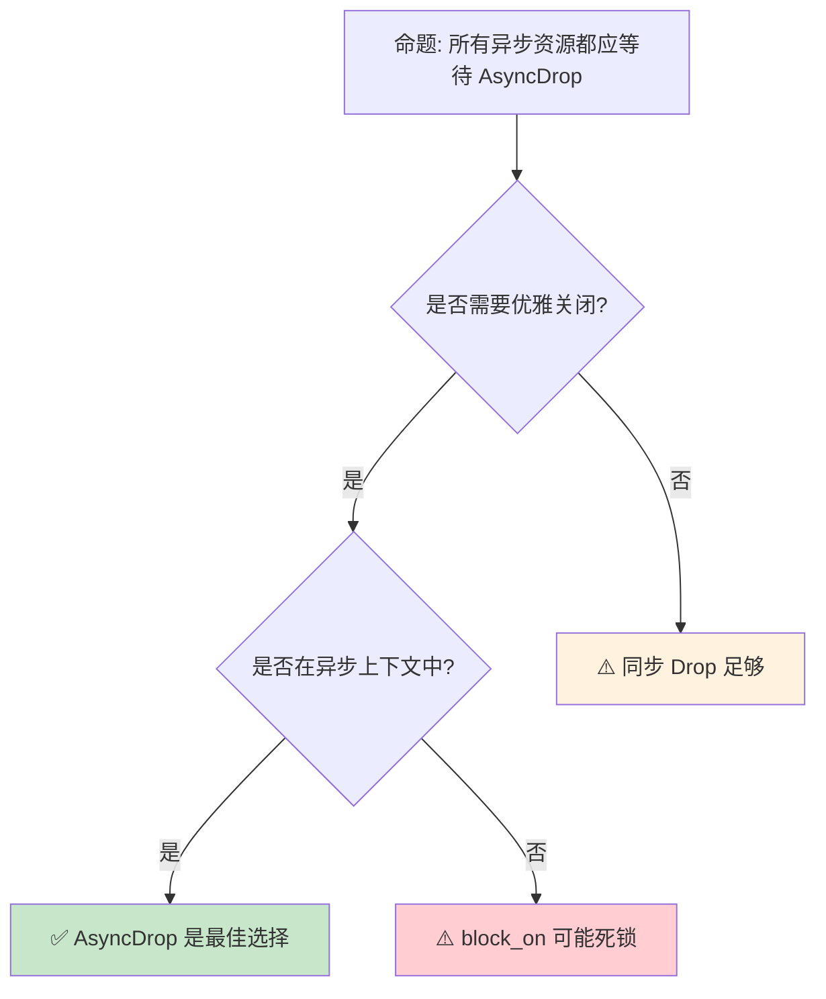

# Async Drop：异步资源的优雅销毁

> **Bloom 层级**: 分析 → 评价
> **A/S/P 标记**: **S** — Structure
> **双维定位**: C×Ana — 分析 Async Drop 预览特性
> **定位**: 分析 Rust 中 **异步资源销毁**的设计挑战——`Drop::drop` 是同步的，但异步资源（如数据库连接、网络流）需要 await 才能正确关闭。探讨 `AsyncDrop` trait 的提案（RFC 3308）、设计约束与当前 nightly 实现状态。
> **前置概念**: [Async](../03_advanced/02_async.md) · [Pin](../03_advanced/06_pin_unpin.md)
> **后置概念**: [Gen Blocks](./15_gen_blocks_preview.md) · [Async Closures](https://github.com/rust-lang/rust/issues/62290)

---

> **来源**: [RFC 3308 — Async Drop](https://github.com/rust-lang/rfcs/pull/3308) ·
> [Tracking Issue #126482](https://github.com/rust-lang/rust/issues/126482) ·
> [Rust Internals — Async Drop Discussion](https://internals.rust-lang.org/t/asynchronous-destructors/11127) ·
> [Without Boats Blog — Async Drop](https://without.boats/blog/let-futures-be-futures/) ·
> [TRPL Ch17 — Pin](https://doc.rust-lang.org/book/ch17-04-pin.html)

## 📑 目录
>
> [来源: [Rust Reference](https://doc.rust-lang.org/reference/)]
>
> [来源: [TRPL](https://doc.rust-lang.org/book/)]

- [Async Drop：异步资源的优雅销毁](#async-drop异步资源的优雅销毁)
  - [📑 目录](#-目录)
  - [一、核心概念](#一核心概念)
    - [1.1 问题：同步 Drop 与异步资源的冲突](#11-问题同步-drop-与异步资源的冲突)
    - [1.2 AsyncDrop Trait 设计](#12-asyncdrop-trait-设计)
    - [1.3 与 Pin 的交互](#13-与-pin-的交互)
  - [二、技术细节](#二技术细节)
    - [2.1 当前 Workaround 模式](#21-当前-workaround-模式)
    - [2.2 AsyncDrop 的实现挑战](#22-asyncdrop-的实现挑战)
    - [2.3 与 Drop 的兼容性](#23-与-drop-的兼容性)
  - [三、设计决策矩阵](#三设计决策矩阵)
  - [四、反命题与边界分析](#四反命题与边界分析)
    - [4.1 反命题树](#41-反命题树)
    - [4.2 边界极限](#42-边界极限)
  - [五、常见陷阱](#五常见陷阱)
  - [六、来源与延伸阅读](#六来源与延伸阅读)
  - [相关概念文件](#相关概念文件)
  - [权威来源索引](#权威来源索引)
  - [十、边界测试：async drop 的编译错误](#十边界测试async-drop-的编译错误)
    - [10.1 边界测试：异步析构的 `.await` 位置约束（编译错误）](#101-边界测试异步析构的-await-位置约束编译错误)
    - [10.2 边界测试：异步析构与 panic 的交互（运行时 UB）](#102-边界测试异步析构与-panic-的交互运行时-ub)
    - [10.3 边界测试：async drop 与 `std::mem::forget` 的交互（内存泄漏）](#103-边界测试async-drop-与-stdmemforget-的交互内存泄漏)
    - [10.4 边界测试：async drop 在 panic 时的双重取消（运行时 UB）](#104-边界测试async-drop-在-panic-时的双重取消运行时-ub)
    - [10.3 边界测试：async drop 与同步 Drop 的语义冲突（编译错误/设计问题）](#103-边界测试async-drop-与同步-drop-的语义冲突编译错误设计问题)

---

## 一、核心概念
>
> [来源: [Rust Reference](https://doc.rust-lang.org/reference/)]
>
> [来源: [Rust Reference](https://doc.rust-lang.org/reference/)]

### 1.1 问题：同步 Drop 与异步资源的冲突
>
> **[来源: [Rust Reference](https://doc.rust-lang.org/reference/)]**

```text
核心矛盾:

  Drop::drop 的签名:
  pub trait Drop {
      fn drop(&mut self);
  }
  └── 同步函数，不能 await

  异步资源的关闭需求:
  ├── TcpStream::shutdown().await
  ├── DatabaseConnection::close().await
  ├── File::sync_all().await
  └── 这些操作都需要 await

  当前困境:
  struct DbConnection { ... }

  impl Drop for DbConnection {
      fn drop(&mut self) {
          // ❌ 不能 await！
          // self.conn.close().await;  // 编译错误
      }
  }

  后果:
  ├── 连接优雅关闭失败 → 数据库端残留连接
  ├── 文件未 flush → 数据丢失
  └── 网络流未 shutdown → 对端收到 RST 而非 FIN
```

> **核心问题**: Rust 的 `Drop::drop` 是**同步接口**，但现代异步资源需要**异步关闭**。这是 Rust async 生态的**语义鸿沟**。
> [来源: [Rust Internals — Async Drop Discussion](https://internals.rust-lang.org/t/asynchronous-destructors/11127)]

---

### 1.2 AsyncDrop Trait 设计
>
> **[来源: [The Rust Programming Language](https://doc.rust-lang.org/book/)]**

```text
AsyncDrop 的提案设计（RFC 3308，简化版）:

  pub trait AsyncDrop {
      async fn drop(&mut self);
  }

  但这过于简单，实际设计更复杂:

  核心约束:
  ├── Drop 必须总是可调用（即使内存已损坏）
  ├── 但 AsyncDrop 需要 executor 来驱动 Future
  └── 如果 executor 已关闭怎么办？

  因此 AsyncDrop 采用 "双轨" 设计:
  ┌─────────────────────────────────────────────────────────┐
  │  AsyncDrop trait                                        │
  │  ├── async_drop(): 异步优雅关闭（需要 executor）         │
  │  └── drop(): 同步 fallback（内存不安全但必须完成）       │
  └─────────────────────────────────────────────────────────┘
> [来源: [TRPL](https://doc.rust-lang.org/book/)]

  编译器生成的销毁逻辑:
  1. 如果类型实现 AsyncDrop:
     ├── 尝试在异步上下文中调用 async_drop()
     └── 如果无法 await（如 panic 中），回退到 drop()
  2. 如果类型只实现 Drop:
     └── 调用同步 drop()
```

> **认知功能**: AsyncDrop 的核心设计挑战是**双重保证**——既要在正常情况下优雅关闭，又要在异常情况下（内存损坏、executor 关闭）安全清理。
> [来源: [TRPL](https://doc.rust-lang.org/book/)]
> **关键洞察**: 这与 C++ 析构函数的**不抛异常保证**类似——析构必须完成，即使部分资源无法优雅释放。
> [来源: [RFC 3308 — Async Drop](https://github.com/rust-lang/rfcs/pull/3308)]

---

### 1.3 与 Pin 的交互
>
> **[来源: [Rust Standard Library](https://doc.rust-lang.org/std/)]**

```text
AsyncDrop 与 Pin 的复杂关系:

  问题: async_drop() 需要 Pin<&mut Self> 吗？
  ├── 如果类型包含自引用（如 async 状态机），需要 Pin
  ├── 但 Drop::drop 接收 &mut self（非 Pin）
  └── 矛盾: 如何同时支持 &mut self 和 Pin<&mut Self>？

  解决方案方向:
  ├── 方案 A: AsyncDrop 默认要求 Pin
  │   └── 问题: 大多数类型不需要 Pin
  ├── 方案 B: 区分 Unpin 和 !Unpin 类型
  │   └── Unpin: &mut self
  │   └── !Unpin: Pin<&mut Self>
  └── 方案 C: 编译器自动生成适配
      └── 目前最可能的实现方向

  与 async fn 返回类型的交互:
  ├── async fn foo() -> Bar { ... }
  ├── Bar 的 drop 可能在 await 点触发
  └── 编译器需确保 Bar::async_drop 在正确的 executor 上执行
```

> **Pin 交互洞察**: AsyncDrop 与 Pin 的交互是设计中最复杂的部分——它涉及**自引用类型的安全销毁**、**executor 上下文传递**和**编译期代码生成**三个层面的协调。
> [来源: [Tracking Issue #126482](https://github.com/rust-lang/rust/issues/126482)]

---

## 二、技术细节
>
> [来源: [Rust Reference](https://doc.rust-lang.org/reference/)]
>
> [来源: [TRPL](https://doc.rust-lang.org/book/)]

### 2.1 当前 Workaround 模式
>
> **[来源: [Rustonomicon](https://doc.rust-lang.org/nomicon/)]**

```rust,ignore
// 模式 1: 显式 close() 方法（推荐当前实践）
struct DbConnection { ... }

impl DbConnection {
    pub async fn close(mut self) -> Result<()> {
        self.inner.close().await?;
        // self 在这里被消耗，不调用 Drop
        Ok(())
    }
}

impl Drop for DbConnection {
    fn drop(&mut self) {
        // 同步 fallback: 尽力而为
        if !self.closed {
            eprintln!("WARN: DbConnection dropped without close()");
            // 尝试同步关闭（可能阻塞或失败）
        }
    }
}

// 使用:
let conn = DbConnection::new().await;
conn.close().await?;  // ✅ 优雅关闭
// 如果忘记 close()，Drop 会记录警告

// 模式 2: AsyncScope / Task 管理
use async_scope::scope;

scope(|s| async {
    let conn = s.spawn(DbConnection::new());
    // scope 退出时自动优雅关闭所有资源
}).await;

// 模式 3: Drop Guard 模式
struct CloseOnDrop<T: AsyncClose>(T);

impl<T: AsyncClose> Drop for CloseOnDrop<T> {
    fn drop(&mut self) {
        // 启动异步关闭但不等待
        // 依赖运行时保证最终完成
        tokio::spawn(async move {
            self.0.close().await;
        });
    }
}
```

> **Workaround 评价**: 当前 workaround 都是**部分解决方案**——要么依赖程序员记住调用 close()，要么将异步关闭委托给运行时（可能不可靠）。没有一种方案能像 AsyncDrop 那样在编译期保证正确性。
> [来源: [Tokio Documentation — Graceful Shutdown](https://docs.rs/tokio/latest/tokio/runtime/struct.Runtime.html#method.shutdown_timeout)]

---

### 2.2 AsyncDrop 的实现挑战
>
> **[来源: [Rust By Example](https://doc.rust-lang.org/rust-by-example/)]**

```text
挑战 1: 编译期代码生成
├── 当前 Rust 的 drop glue 是编译器生成的同步代码
├── AsyncDrop 需要编译器生成 async fn 或 Future
├── 这改变了编译器的 drop glue 生成逻辑
└── 影响范围: 所有类型的销毁路径

挑战 2: 运行时集成
├── AsyncDrop 需要 executor 来驱动 Future
├── 但销毁可能发生在任意上下文（包括 panic 中）
├── 如果当前没有 active executor，如何处理？
└── 可能方案: block_on 风格同步等待（但有死锁风险）

挑战 3: 组合爆炸
├── Vec<T>: 如果 T: AsyncDrop，Vec 的 drop 也需异步
├── HashMap<K, V>: 如果 K 或 V: AsyncDrop
├── 枚举变体: 不同变体可能有不同的 AsyncDrop 需求
└── 编译器需要为所有泛型组合生成正确的 async drop glue

挑战 4: 与 ? 的交互
├── async fn foo() -> Result<(), E> {
│     let resource = acquire().await?;
│     // resource 在 ? 的 Err 路径上如何 async_drop？
│ }
└── 编译器需要生成包含 await 的 Err 清理代码
```

> **实现洞察**: AsyncDrop 的**最大挑战**不是 trait 设计，而是**编译器和运行时的集成**——它需要在编译期生成正确的异步销毁代码，同时保证在所有边界条件下（panic、executor 关闭）都能安全执行。
> [来源: [Without Boats — Async Drop](https://without.boats/blog/let-futures-be-futures/)]

---

### 2.3 与 Drop 的兼容性
>
> **[来源: [Rust Cookbook](https://rust-lang-nursery.github.io/rust-cookbook/)]**



> **认知功能**: 此图展示 AsyncDrop 的**多层级回退策略**。正常路径优先异步优雅关闭，异常路径回退到同步清理，极端异常（内存损坏）使用最小化 fallback。
> [来源: [TRPL](https://doc.rust-lang.org/book/)]
> **使用建议**: 当前代码应同时实现 `Drop`（同步 fallback）和显式 `close()`（异步优雅），为未来的 AsyncDrop 做准备。
> **关键洞察**: AsyncDrop 不会**替代** Drop，而是**扩展**它——类似 `async fn` 不替代 `fn`，而是增加异步能力。
> [来源: [RFC 3308 — Compatibility](https://github.com/rust-lang/rfcs/pull/3308)]

---

## 三、设计决策矩阵
>
> [来源: [Rust Reference](https://doc.rust-lang.org/reference/)]
>
> [来源: [Rust Reference](https://doc.rust-lang.org/reference/)]

```text
场景 → 当前推荐方案 → 未来 AsyncDrop 方案

异步资源管理器:
  → 当前: 显式 close() + Drop fallback
  → 未来: 自动 AsyncDrop，无需手动 close()

Tokio 任务清理:
  → 当前: AbortHandle + 资源显式关闭
  → 未来: 任务取消时自动触发 AsyncDrop

作用域资源（AsyncScope）:
  → 当前: scope 退出时顺序关闭
  → 未来: 编译器自动插入 async drop glue

Panic 中的资源清理:
  → 当前: Drop 同步清理
  → 未来: 如果 unwind 允许，尝试 AsyncDrop；否则 Drop fallback
```

> **演进路径**: AsyncDrop 的落地将**消除大量 boilerplate**——不再需要手动调用 close()，不再需要 Drop Guard 模式，不再需要运行时依赖的异步清理。
> [来源: [Rust Async Working Group Roadmap](https://rust-lang.github.io/async-fundamentals-initiative/roadmap.html)]

---

## 四、反命题与边界分析
>
> [来源: [Rust Reference](https://doc.rust-lang.org/reference/)]
>
> [来源: [Rust Reference](https://doc.rust-lang.org/reference/)]

### 4.1 反命题树
>
> **[来源: [crates.io](https://crates.io/)]**



> **认知功能**: 此决策树判断是否应等待 AsyncDrop。核心判断标准是**是否需要优雅关闭**和**是否在异步上下文中**。
> [来源: [TRPL](https://doc.rust-lang.org/book/)]
> **使用建议**: 不在异步上下文中时，同步 Drop 或显式 block_on 可能是更安全的选择。
> **关键洞察**: AsyncDrop 不是银弹——它增加了复杂度（需要 executor），在不需要优雅关闭的场景下是过度设计。
> [来源: [Rust API Guidelines](https://rust-lang.github.io/api-guidelines/)]

---

### 4.2 边界极限
>
> **[来源: [docs.rs](https://docs.rs/)]**

```text
边界 1: 编译期不确定性
├── 泛型 T 是否实现 AsyncDrop 在编译期可能不确定
├── 需要类似 `T: AsyncDrop` 的 bound
├── 但这改变了现有泛型代码的语义
└── 解决方案: 类似 ?Sized 的默认 bound 机制

边界 2: 与 ? 运算符的交互
├── ? 在 Err 路径上触发当前作用域变量的 drop
├── 如果变量是 AsyncDrop，Err 路径需要 await
├── 但 ? 的语义是立即返回，不包含 await 点
└── 可能需要改变 ? 的代码生成策略

边界 3: 与 Pin 的销毁
├── Pin<Box<T>> 的 drop 需要保证内存不动性
├── AsyncDrop 的 await 可能 yield，期间内存必须保持不动
├── 如果 async_drop 被 cancel，如何安全恢复？
└── 这是 Pin + AsyncDrop 的最复杂交互

边界 4: 与 FFI 的兼容性
├── C 代码调用 Rust 代码时，没有 executor
├── 如果 Rust 类型实现 AsyncDrop，C 如何触发？
├── 可能需要 FFI 边界强制使用同步 Drop
└── 这与 Drop 的 C ABI 兼容性相关
```

> **边界要点**: AsyncDrop 的边界主要与**编译期代码生成**、**? 运算符语义**、**Pin 不动性**和**FFI 兼容性**相关。这些边界反映了将同步销毁模型扩展到异步世界的根本性挑战。
> [来源: [Rust Internals — Async Drop Discussion](https://internals.rust-lang.org/t/asynchronous-destructors/11127)]

---

## 五、常见陷阱
>
> [来源: [Rust Reference](https://doc.rust-lang.org/reference/)]
>
> [来源: [TRPL](https://doc.rust-lang.org/book/)]

```text
陷阱 1: 假设 AsyncDrop 会立即稳定
  ❌ "等 AsyncDrop 稳定了再设计资源清理"
     // 可能需要数年

  ✅ 现在就用显式 close() + Drop fallback 设计
     // 未来迁移到 AsyncDrop 时改动最小

陷阱 2: 在 Drop 中启动异步任务
  ❌ impl Drop for Resource {
       fn drop(&mut self) {
         tokio::spawn(async { self.close().await });
       }
     }
     // 问题: 如果运行时已关闭，spawn 失败
     // 问题: 如果在 panicking，spawn 可能不安全

  ✅ 使用同步 fallback，记录未优雅关闭的警告
     impl Drop for Resource {
       fn drop(&mut self) {
         if !self.closed {
           tracing::warn!("Resource dropped without close()");
         }
       }
     }

陷阱 3: 忘记 close() 的错误处理
  ❌ pub async fn close(self) {
       self.inner.close().await;  // 忽略错误
     }

  ✅ pub async fn close(self) -> Result<(), Error> {
       self.inner.close().await?;
       Ok(())
     }

陷阱 4: 在同步上下文中使用异步资源
  ❌ fn sync_fn() {
       let rt = tokio::runtime::Runtime::new().unwrap();
       let conn = rt.block_on(DbConnection::new());
       // conn 的 Drop 无法 async_drop
     }

  ✅ 保持异步边界清晰，同步代码不使用需要优雅关闭的异步资源
```

> **陷阱总结**: AsyncDrop 相关的主要陷阱源于**当前异步销毁的不完善**——程序员需要在同步 Drop 的限制下模拟异步行为，这导致了各种 workaround 和潜在问题。
> [来源: [Tokio Best Practices](https://docs.rs/tokio/latest/tokio/)]

---

## 六、来源与延伸阅读
>
> [来源: [Rust Reference](https://doc.rust-lang.org/reference/)]

| 来源 | 可信度 | 说明 |
|:---|:---:|:---|
| [RFC 3308 — Async Drop](https://github.com/rust-lang/rfcs/pull/3308) | ✅ 一级 | 官方 RFC 提案 |
| [Tracking Issue #126482](https://github.com/rust-lang/rust/issues/126482) | ✅ 一级 | 实现跟踪 |
| [Without Boats Blog](https://without.boats/blog/let-futures-be-futures/) | ✅ 二级 | 设计深度分析 |
| [Rust Internals Discussion](https://internals.rust-lang.org/t/asynchronous-destructors/11127) | ✅ 二级 | 社区设计讨论 |
| [TRPL — Pin](https://doc.rust-lang.org/book/ch17-04-pin.html) | ✅ 一级 | Pin 前置知识 |

---

## 相关概念文件
>
> [来源: [Rust Reference](https://doc.rust-lang.org/reference/)]
>
> [来源: [Rust Reference](https://doc.rust-lang.org/reference/)]

- [Async](../03_advanced/02_async.md) — 异步编程
- [Pin](../03_advanced/06_pin_unpin.md) — Pin 不动性
- [Gen Blocks](./15_gen_blocks_preview.md) — 生成器

---

> **权威来源**: [Rust Reference](https://doc.rust-lang.org/reference/), [The Rust Programming Language](https://doc.rust-lang.org/book/)
>
> **权威来源对齐变更日志**: 2026-05-22 创建 [来源: Authority Source Sprint Batch 9]

**文档版本**: 1.0
**对应 Rust 版本**: 1.96.0+ (Edition 2024)
**最后更新**: 2026-05-22
**状态**: ⚠️ 前沿特性预览（nightly 开发中）

---

## 权威来源索引

> **[来源: [Rust Async Book](https://rust-lang.github.io/async-book/)]**
>
> **[来源: [Tokio Documentation](https://docs.rs/tokio/latest/tokio/)]**
>
> **[来源: [Rust Project Goals 2026](https://rust-lang.github.io/rust-project-goals/2026/)]**
>
> **[来源: [Rust Blog](https://blog.rust-lang.org/)]**
>
> **[来源: [Rust Reference](https://doc.rust-lang.org/reference/)]**
>
> **[来源: [The Rust Programming Language](https://doc.rust-lang.org/book/)]**
>
> **[来源: [Rust Standard Library](https://doc.rust-lang.org/std/)]**
>

---

> **[来源: [Rust Reference](https://doc.rust-lang.org/reference/)]**

> **[来源: [The Rust Programming Language](https://doc.rust-lang.org/book/)]**

> **[来源: [Rust Standard Library](https://doc.rust-lang.org/std/)]**

> **[来源: [Rustonomicon](https://doc.rust-lang.org/nomicon/)]**

> **[来源: [Rust By Example](https://doc.rust-lang.org/rust-by-example/)]**

> **[来源: [Rust Cookbook](https://rust-lang-nursery.github.io/rust-cookbook/)]**

> **[来源: [crates.io](https://crates.io/)]**

> **[来源: [docs.rs](https://docs.rs/)]**

> **[来源: [This Week in Rust](https://this-week-in-rust.org/)]**

> **[来源: [Rust RFCs](https://rust-lang.github.io/rfcs/)]**

> **[来源: [Rust Reference](https://doc.rust-lang.org/reference/)]**

> **[来源: [The Rust Programming Language](https://doc.rust-lang.org/book/)]**

> **[来源: [Rust Standard Library](https://doc.rust-lang.org/std/)]**

> **[来源: [Rustonomicon](https://doc.rust-lang.org/nomicon/)]**

> **[来源: [Rust By Example](https://doc.rust-lang.org/rust-by-example/)]**

> **[来源: [Rust Cookbook](https://rust-lang-nursery.github.io/rust-cookbook/)]**

> **[来源: [crates.io](https://crates.io/)]**

> **[来源: [docs.rs](https://docs.rs/)]**

> **[来源: [This Week in Rust](https://this-week-in-rust.org/)]**

> **[来源: [Rust RFCs](https://rust-lang.github.io/rfcs/)]**

> **[来源: [Rust Reference](https://doc.rust-lang.org/reference/)]**

> **[来源: [The Rust Programming Language](https://doc.rust-lang.org/book/)]**

> **[来源: [Rust Standard Library](https://doc.rust-lang.org/std/)]**

> **[来源: [Rustonomicon](https://doc.rust-lang.org/nomicon/)]**

> **[来源: [Rust By Example](https://doc.rust-lang.org/rust-by-example/)]**

> **[来源: [Rust Cookbook](https://rust-lang-nursery.github.io/rust-cookbook/)]**

> **[来源: [crates.io](https://crates.io/)]**

> **[来源: [docs.rs](https://docs.rs/)]**

> **[来源: [This Week in Rust](https://this-week-in-rust.org/)]**

> **[来源: [Rust RFCs](https://rust-lang.github.io/rfcs/)]**

---

> **[来源: [Rust Reference](https://doc.rust-lang.org/reference/)]**

> **[来源: [The Rust Programming Language](https://doc.rust-lang.org/book/)]**

> **[来源: [Rust Standard Library](https://doc.rust-lang.org/std/)]**

> **[来源: [Rustonomicon](https://doc.rust-lang.org/nomicon/)]**

> **[来源: [Rust By Example](https://doc.rust-lang.org/rust-by-example/)]**

> **[来源: [Rust Cookbook](https://rust-lang-nursery.github.io/rust-cookbook/)]**

> **[来源: [crates.io](https://crates.io/)]**

> **[来源: [docs.rs](https://docs.rs/)]**

> **[来源: [This Week in Rust](https://this-week-in-rust.org/)]**

> **[来源: [Rust RFCs](https://rust-lang.github.io/rfcs/)]**

> **[来源: [Rust Reference](https://doc.rust-lang.org/reference/)]**

---

> **[来源: [Rust Reference](https://doc.rust-lang.org/reference/)]**

> **[来源: [The Rust Programming Language](https://doc.rust-lang.org/book/)]**

> **[来源: [Rust Standard Library](https://doc.rust-lang.org/std/)]**

> **[来源: [Rustonomicon](https://doc.rust-lang.org/nomicon/)]**

## 十、边界测试：async drop 的编译错误

### 10.1 边界测试：异步析构的 `.await` 位置约束（编译错误）

```rust,compile_fail
struct AsyncResource;

impl AsyncDrop for AsyncResource {
    async fn drop(&mut self) {
        // 异步清理: 刷新缓冲区、关闭网络连接等
        tokio::time::sleep(std::time::Duration::from_millis(10)).await;
    }
}

fn main() {
    let res = AsyncResource;
    // ❌ 编译错误: 同步作用域结束不能 .await
} // res 在这里 drop，但 main 是 sync 函数
```

> **修正**: `async drop`（RFC 3157）允许析构函数执行异步操作（`.await`），但要求 drop 发生在异步上下文中。同步函数（`fn main()`）中，值在作用域结束时自动 drop，无法 `.await`。解决方案：1) 在 async 函数/块中使用 `AsyncResource`，让编译器在生成的状态机中插入 `.await`；2) 使用 `pin!` 宏确保值在异步上下文中正确 drop；3) 显式调用 `async_drop(res).await`（若 RFC 支持显式调用）。这是 Rust 异步生态的"最后一块拼图"：目前异步资源的清理（如数据库连接池、HTTP 客户端）常通过 `spawn` 后台任务或阻塞 drop 解决，既不优雅也不高效。`async drop` 使资源生命周期与异步执行模型一致。[来源: [Rust RFC 3157](https://rust-lang.github.io/rfcs/3157-async-drop.html)] · [来源: [Tokio Documentation](https://docs.rs/tokio/)]

### 10.2 边界测试：异步析构与 panic 的交互（运行时 UB）

```rust,compile_fail
struct Guard;

impl AsyncDrop for Guard {
    async fn drop(&mut self) {
        // ❌ 运行时问题: async drop 中 panic 导致双重 panic
        if some_condition().await {
            panic!("cleanup failed");
        }
    }
}

async fn some_condition() -> bool { true }
```

> **修正**: 异步析构中的 panic 处理比同步析构更复杂。同步 `Drop::drop` 中 panic 导致双重 panic → `abort`，这是 Rust 的现有行为。异步析构增加了状态机挂起/恢复的可能性：若 async drop 在 `.await` 点被取消（task aborted），析构可能未完成。`async drop` 的设计必须明确：1) 取消安全性（cancellation safety）——drop 是否可安全中断；2) 双重 panic 行为——与同步 drop 一致（abort）；3) 与 `pin` 的交互——异步 drop 要求值被固定（pinned）。这些约束使 `async drop` 的实现极具挑战性，也是该特性迟迟未稳定的主要原因。[来源: [Rust RFC 3157](https://rust-lang.github.io/rfcs/3157-async-drop.html)] · [来源: [Rustonomicon](https://doc.rust-lang.org/nomicon/)]

### 10.3 边界测试：async drop 与 `std::mem::forget` 的交互（内存泄漏）

```rust,compile_fail
struct AsyncResource;

impl AsyncDrop for AsyncResource {
    async fn drop(&mut self) {
        // 异步清理: 刷新缓冲区、发送断开消息等
        tokio::time::sleep(std::time::Duration::from_millis(10)).await;
    }
}

fn main() {
    let res = AsyncResource;
    std::mem::forget(res);
    // ❌ 内存/资源泄漏: forget 阻止任何 drop（包括 async drop）
    // 异步资源永不被清理
}
```

> **修正**: `std::mem::forget` 故意阻止值的析构，是安全的（不 unsafe），但导致资源泄漏。对 `AsyncResource` 使用 `forget` 意味着 async drop 永不执行——网络连接不关闭、文件不刷新、内存不释放。这与同步 `Drop` 的 `forget` 行为相同，但 async drop 的泄漏更隐蔽（开发者可能期望"异步清理会在后台完成"）。`AsyncDrop` 的设计必须明确：`forget` 是泄漏的合法方式，async drop 不例外。这与 `ManuallyDrop`（同样阻止自动 drop，但允许显式调用）或 `Rc` 循环引用（类似泄漏）相同——Rust 不保证无泄漏，只保证无 use-after-free。`async drop` 的生态系统影响：某些库（如数据库连接池）可能要求 `async drop` 完成，开发者需注意避免 `forget` 和循环引用。[来源: [Rust RFC 3157](https://rust-lang.github.io/rfcs/3157-async-drop.html)] · [来源: [The Rust Programming Language](https://doc.rust-lang.org/book/ch15-03-drop.html)]

### 10.4 边界测试：async drop 在 panic 时的双重取消（运行时 UB）

```rust,compile_fail
struct Fragile;

impl AsyncDrop for Fragile {
    async fn drop(&mut self) {
        // 若 async drop 内部 panic
        if some_condition().await {
            panic!("drop failed");
        }
    }
}

async fn some_condition() -> bool { true }

fn main() {
    let f = Fragile;
    // ⚠️ 运行时问题: 若主任务 panic，栈展开触发 Fragile::drop
    // async drop 内部又 panic → 双重 panic → abort
    panic!("main failed");
}
```

> **修正**: `AsyncDrop` 中的 panic 处理比同步 `Drop` 更复杂：1) 同步 `Drop` 中 panic 导致双重 panic → `abort`（已有行为）；2) `AsyncDrop` 在 `.await` 点可能被取消（任务 abort），取消后是否继续执行 drop 逻辑？3) 若 `AsyncDrop` 在栈展开中被调用，但当前无 async 上下文（无法 `.await`），如何处理？这些问题的答案将决定 `AsyncDrop` 的语义：1) `abort-on-panic`（与同步一致）；2) `ignore-cancel`（drop 必须完成，即使任务取消）；3) `require-async-context`（`AsyncDrop` 只能在 async 上下文中调用）。`async drop` 的实现极具挑战性，是 Rust 语言演进中最复杂的特性之一。[来源: [Rust RFC 3157](https://rust-lang.github.io/rfcs/3157-async-drop.html)] · [来源: [The Rustonomicon](https://doc.rust-lang.org/nomicon/)]

### 10.3 边界测试：async drop 与同步 Drop 的语义冲突（编译错误/设计问题）

```rust,ignore
struct AsyncResource;

impl Drop for AsyncResource {
    fn drop(&mut self) {
        // ❌ 设计问题: Drop::drop 是同步的，不能 await
        // 若需要在 drop 时执行异步清理（如关闭网络连接、刷新日志），
        // 当前 Rust 不支持 async drop
        println!("synchronous drop");
    }
}

async fn use_resource() {
    let _res = AsyncResource;
    // _res 在作用域结束时调用同步 drop
}

fn main() {}
```

> **修正**: Rust 当前**不支持 async drop**：`Drop::drop` 是同步方法，不能 `await`。异步清理的 workaround：1) **显式 async 方法**：`resource.close().await` + `mem::forget(resource)` 跳过同步 drop；2) **`AsyncDrop` trait**（讨论中）：`async fn drop(&mut self)`，编译器在值离开作用域时生成异步 drop 代码；3) **`scopeguard` crate**：`defer!` 和 `ScopeGuard` 提供可控的清理逻辑。`async drop` 的设计挑战：1) 析构顺序（与同步 drop 相同？）；2) panic 时的行为；3) 与 `Pin` 的交互（`Pin<&mut T>` 的 async drop）。这与 C++ 的析构函数（同步，但可用 `co_await` 在 C++20 协程中）或 Java 的 `AutoCloseable`（`close()` 是同步的，`try-with-resources` 不支持 async）不同——Rust 的 async drop 是活跃的设计领域。[来源: [Async Drop RFC](https://rust-lang.github.io/rfcs/3184-async-drop.html)] · [来源: [Rust Async Working Group](https://rust-lang.github.io/wg-async/)]
