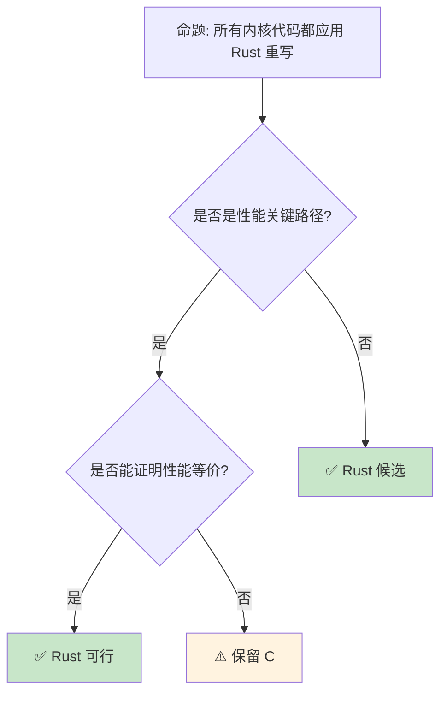

# Rust for Linux [来源: [Rust for Linux](https://rust-for-linux.com/)]：操作系统内核中的内存安全

> **Bloom 层级**: 分析 → 评价
> **定位**: 深入分析 **Rust for Linux** 项目——如何将 Rust 引入 Linux 内核开发，从驱动程序编写、C 互操作到内核特定的安全保证，揭示系统编程范式的历史性转变。
> **前置概念**: [Unsafe](../03_advanced/03_unsafe.md) · [FFI](../03_advanced/05_rust_ffi.md) · [Cross Compilation](../06_ecosystem/17_cross_compilation.md)
> **后置概念**: [Formal Methods](../04_formal/04_rustbelt.md) · [Evolution](./03_evolution.md)

---

> **来源**: [Rust for Linux](https://rust-for-linux.com/) ·
> [Linux Kernel Rust Documentation](<https://docs.kernel> [来源: [Linux Kernel](https://www.kernel.org/doc/html/latest/rust/)].org/rust/index.html) ·
> [LWN — Rust in the Linux Kernel](https://lwn.net/Articles/829858/) ·
> [Rust CVE Database](https://cve.mitre.org/cgi-bin/cvekey.cgi?keyword=rust) ·
> [Google — Rust in the Linux Kernel](https://security.googleblog.com/2021/04/rust-in-linux-kernel.html)

## 📑 目录

- [Rust for Linux \[来源: Rust for Linux\]：操作系统内核中的内存安全](#rust-for-linux-来源-rust-for-linux操作系统内核中的内存安全)
  - [📑 目录](#-目录)
  - [一、核心概念](#一核心概念)
    - [1.1 为什么内核需要 Rust](#11-为什么内核需要-rust)
    - [1.2 Rust for Linux 架构](#12-rust-for-linux-架构)
    - [1.3 内核中的 unsafe 边界](#13-内核中的-unsafe-边界)
  - [二、技术细节](#二技术细节)
    - [2.1 C 互操作与绑定生成](#21-c-互操作与绑定生成)
    - [2.2 内核抽象层](#22-内核抽象层)
    - [2.3 驱动程序开发模型](#23-驱动程序开发模型)
  - [三、采用状态矩阵](#三采用状态矩阵)
  - [四、反命题与边界分析](#四反命题与边界分析)
    - [4.1 反命题树](#41-反命题树)
    - [4.2 边界极限](#42-边界极限)
  - [五、常见陷阱](#五常见陷阱)
  - [六、来源与延伸阅读](#六来源与延伸阅读)
  - [相关概念文件](#相关概念文件)

---

## 一、核心概念

### 1.1 为什么内核需要 Rust

```text
Linux 内核的安全现状:

  内存安全漏洞统计:
  ├── ~70% 的内核安全漏洞是内存安全问题
  ├── 缓冲区溢出、Use-after-free、NULL 指针解引用
  ├── 传统缓解措施: KASAN, KFENCE, CFI
  └── 但这些都是运行时检测，有性能开销

  Rust 的价值主张:
  ├── 编译期内存安全保证
  ├── 无运行时开销（零成本抽象）
  ├── 与 C 的 FFI 互操作
  └── 现代语言特性（泛型、模式匹配、错误处理）

  关键里程碑:
  ├── 2022: Rust 支持合并到 Linux 6.1
  ├── 2023: 首个 Rust 驱动程序（Android Binder）
  ├── 2024: 更多驱动程序（NVMe, GPU 等）
  └── 未来: 核心子系统的 Rust 重写

  反对意见与回应:
  ├── "学习曲线陡峭" → 但内核开发者已有能力
  ├── "编译时间增加" → 增量编译缓解
  ├── "双语言维护复杂" → 渐进式替换
  └── "生态不成熟" → 内核特定生态在成长
```

> **认知功能**: Rust for Linux 是**系统编程的范式转变**——它试图在不重写整个内核的情况下，逐步引入内存安全。
> [来源: [Google Security Blog — Rust in Linux](https://security.googleblog.com/2021/04/rust-in-linux-kernel.html)]

---

### 1.2 Rust for Linux 架构

```text
Rust for Linux 项目结构:

  内核树中的 Rust 支持:
  ├── rust/                     # Rust 核心支持
  │   ├── kernel/               # 内核抽象 crate
  │   ├── alloc/                # 内核分配器
  │   ├── bindings/             # C 绑定生成
  │   └── helpers.c             # C 辅助函数
  ├── drivers/                  # Rust 驱动程序
  │   └── android/binder/       # Android Binder（首个驱动）
  └── samples/rust/             # Rust 示例代码

  编译流程:
  ├── Kbuild 集成 Rust 编译
  ├── rust-bindgen 生成 C 头绑定
  ├── 链接时与 C 对象混合
  └── 使用 LLVM（与内核相同后端）

  关键设计决策:
  ├── 使用内核的内存分配器（非 libc）
  ├── 禁用 std（#![no_std]）
  ├── 自定义 panic 处理（oops）
  └── 与内核的错误码系统互操作
```

> **架构洞察**: Rust for Linux 不是**在外部编译 Rust 模块**——而是**深度集成到内核构建系统**中。
> [来源: [Linux Kernel Rust Docs](https://docs.kernel.org/rust/index.html)]

---

### 1.3 内核中的 unsafe 边界

```text
内核中的 unsafe 使用原则:

  必须 unsafe 的场景:
  ├── C 数据结构访问（绑定生成）
  ├── 硬件寄存器访问（MMIO）
  ├── 原始指针操作（页表、DMA）
  └── 内联汇编

  安全抽象层:
  ├── rust/kernel/ 提供安全包装
  ├── Device 抽象
  ├── FileOperations 抽象
  ├── SpinLock/Mutex 包装
  └── Allocator 集成

  安全保证:
  ├── 驱动级代码通常是 safe Rust
  ├── 底层绑定是 unsafe（但生成/审计一次）
  ├── 类型系统防止常见错误
  └── 编译期检查替代运行时检测

  示例对比:
  C 驱动:
    struct my_device *dev = container_of(file->private_data, ...);
    // 容易出错的指针运算

  Rust 驱动:
    let dev = file.private_data::<MyDevice>()?;
    // 类型安全，编译期检查
```

> **unsafe 洞察**: Rust for Linux 的**核心策略**是"unsafe 封装"——将 C API 的 unsafe 调用封装为 safe 抽象，使驱动开发者编写 safe Rust。
> [来源: [Rust for Linux — Safety](https://rust-for-linux.com/safety)]

---

## 二、技术细节

### 2.1 C 互操作与绑定生成

```text
绑定生成流程:

  C 头文件 → bindgen → Rust 绑定

  输入: include/linux/fs.h
  └── 输出: rust/bindings/generated/fs.rs

  bindgen 配置:
  ├── 白名单: 只生成需要的函数/类型
  ├── 类型映射: C 类型 → Rust 类型
  ├── 布局保证: #[repr(C)] 匹配
  └── 常量生成: #define → const

  手工调整:
  ├── bindgen 输出可能不完美
  ├── 需要手工添加 Send/Sync 标记
  ├── 添加生命周期注释
  └── 创建更符合 Rust 习惯的包装

  示例绑定:
  // C
  struct file_operations {
      ssize_t (*read)(struct file *, char __user *, size_t, loff_t *);
      // ...
  };

  // Rust (bindgen 生成)
  #[repr(C)]
  pub struct file_operations {
      pub read: Option<unsafe extern "C" fn(...) -> ssize_t>,
      // ...
  }
```

> **绑定洞察**: 自动绑定生成是 Rust for Linux **规模化的关键**——它使数千个 C API 可以被 Rust 调用。
> [来源: [rust-bindgen](https://rust-lang.github.io/rust-bindgen/)]

---

### 2.2 内核抽象层

```rust,ignore
// Rust 内核抽象示例（概念性）

use kernel::prelude::*;
use kernel::file_operations::FileOperations;
use kernel::sync::Mutex;

module! {
    type: MyDriver,
    name: b"my_driver",
    author: b"Developer",
    description: b"Example Rust driver",
    license: b"GPL",
}

struct MyDevice {
    data: Mutex<Vec<u8>>,
}

#[vtable]
impl FileOperations for MyDevice {
    fn read(
        &self,
        _file: &File,
        buf: &mut UserSlicePtrWriter,
        _offset: u64,
    ) -> Result<usize> {
        let data = self.data.lock();
        buf.write(&data)?;
        Ok(data.len())
    }

    fn write(
        &self,
        _file: &File,
        buf: &mut UserSlicePtrReader,
        _offset: u64,
    ) -> Result<usize> {
        let mut data = self.data.lock();
        let len = buf.read(&mut data)?;
        Ok(len)
    }
}

// 核心抽象:
// ├── kernel::sync: SpinLock, Mutex, Arc
// ├── kernel::file: File, VfsMount
// ├── kernel::device: Device, Class
// ├── kernel::error: Error, Result
// └── kernel::alloc: 内核内存分配
```

> **抽象洞察**: `kernel` crate 是 Rust for Linux 的**核心创新**——它提供了**类型安全**的内核 API 包装。
> [来源: [Rust for Linux Samples](https://github.com/Rust-for-Linux/linux/tree/rust/samples/rust)]

---

### 2.3 驱动程序开发模型

```text
Rust 驱动 vs C 驱动的对比:

  C 驱动开发:
  ├── 手动管理内存（kmalloc/kfree）
  ├── 错误码返回（-ENOMEM, -EINVAL）
  ├── 手动引用计数（kref）
  ├── 复杂的初始化/清理路径
  └── 容易遗漏错误处理

  Rust 驱动开发:
  ├── 所有权系统自动管理资源
  ├── Result 类型强制错误处理
  ├── Arc/Mutex 替代手动引用计数
  ├── Drop trait 自动清理
  └── 编译期保证资源释放

  开发流程:
  1. 编写 Rust 驱动代码（mostly safe）
  2. 使用 kernel crate 的抽象
  3. bindgen 处理 C API 绑定
  4. Kbuild 编译链接
  5. 加载模块并测试

  调试工具:
  ├── printk! / pr_info! / pr_err!
  ├── Rust panic → kernel oops
  ├── KASAN 仍适用
  └── 内核调试器（kgdb）
```

> **驱动洞察**: Rust 驱动的**核心优势**是**开发时安全**——许多在 C 中运行时才能发现的错误，在 Rust 中编译期就被阻止。
> [来源: [Android Binder in Rust](https://lwn.net/Articles/869019/)]

---

## 三、采用状态矩阵

```text
Rust for Linux 采用状态 (2024+):

  已合并内核子系统:
  ├── Rust 核心支持 (6.1+)
  ├── Android Binder 驱动
  ├── NVMe 驱动（部分）
  └── 示例驱动程序

  进行中:
  ├── GPU 驱动（DRM 子系统）
  ├── 网络驱动
  ├── 文件系统实验
  └── 核心调度器（长期目标）

  主要贡献者:
  ├── Google (Android 团队)
  ├── Microsoft
  ├── Red Hat
  └── 社区独立开发者

  挑战:
  ├── C 代码的渐进式替换策略
  ├── 性能等价性证明
  ├── 维护者接受度
  └── 工具链集成（rustc 版本与内核同步）
```

> **采用矩阵**: Rust for Linux 是**渐进式替换**——从外围驱动开始，逐步向核心子系统推进。
> [来源: [Rust for Linux — Status](https://rust-for-linux.com/status)]

---

## 四、反命题与边界分析

### 4.1 反命题树



> **认知功能**: Rust for Linux 的**现实路径**是"渐进替换"——从安全性收益最大、性能影响最小的组件开始。
> [来源: [LWN — Rust in Linux](https://lwn.net/Articles/829858/)]

---

### 4.2 边界极限

```text
边界 1: 启动代码
├── 内核启动时 Rust 运行时未初始化
├── 早期启动代码必须用汇编/C
├── Rust 代码在内存管理初始化后可用
└── 缓解: 分阶段初始化

边界 2: 内联汇编
├── 某些架构需要内联汇编
├── Rust 支持内联汇编（stable）
├── 但语法与 GCC 不同
└── 缓解: 使用 C 包装函数

边界 3: 不稳定特性依赖
├── Rust for Linux 需要某些 nightly 特性
├── 内核要求编译器版本固定
├── 与 Rust 稳定版发布节奏不同步
└── 缓解: 维护稳定的编译器分支

边界 4: 调试工具链
├── GDB 对 Rust 支持有限
├── 内核调试器主要是 C 思维
├── Rust 符号和栈跟踪需要适配
└── 缓解: rust-gdb 脚本改善体验

边界 5: 社区接受度
├── 部分内核维护者反对引入 Rust
├── 双语言增加维护复杂性
├── 需要证明长期价值
└── 缓解: 成功案例和数据驱动
```

> **边界要点**: Rust for Linux 的边界主要与**启动代码**、**内联汇编**、**编译器版本**、**调试工具**和**社区接受度**相关。
> [来源: [Rust for Linux — Challenges](https://rust-for-linux.com/challenges)]

---

## 五、常见陷阱

```text
陷阱 1: 忽视 C 绑定的不安全性
  ❌ 直接调用 bindgen 生成的函数
     // 假设它们安全

  ✅ 在 safe 抽象层中包装
     // 验证前置条件

陷阱 2: 误解内核分配语义
  ❌ 使用标准库分配器
     // 内核中不可用

  ✅ 使用 kernel::alloc
     // 或内核的 kmalloc 包装

陷阱 3: 错误处理不当
  ❌ unwrap() 在内核代码中
     // panic 可能导致系统崩溃

  ✅ 使用 ? 和传播 Result
     // 内核 Error 类型映射

陷阱 4: 忽视并发模型差异
  ❌ 假设标准 Rust 并发原语可用
     // 内核调度不同

  ✅ 使用 kernel::sync 的原语
     // SpinLock、Mutex、RCU 包装

陷阱 5: 忘记模块许可证
  ❌ module! { ... } 中缺少 license
     // 内核拒绝加载

  ✅ 明确指定 GPL/等许可证
     // 内核模块要求
```

> **陷阱总结**: Rust for Linux 的陷阱主要与**C 绑定安全**、**内核分配器**、**panic 处理**、**并发原语**和**许可证**相关。
> [来源: [Rust for Linux — Getting Started](https://rust-for-linux.com/getting-started)]

---

## 六、来源与延伸阅读

| 来源 | 可信度 | 说明 |
| [Rust Standard Library](https://doc.rust-lang.org/std/) | ✅ 一级 | 标准库参考 |
| [Rust By Example](https://doc.rust-lang.org/rust-by-example/) | ✅ 一级 | 交互式教程 |
| [This Week in Rust](https://this-week-in-rust.org/) | ✅ 二级 | 社区动态 |

| [Rust Reference](https://doc.rust-lang.org/reference/) | ✅ 一级 | 语言参考 |
|:---|:---:|:---|
| [Rust for Linux](https://rust-for-linux.com/) | ✅ 一级 | 项目主页 |
| [Linux Kernel Rust Docs](https://docs.kernel.org/rust/index.html) | ✅ 一级 | 内核文档 |
| [LWN — Rust in Linux](https://lwn.net/Articles/829858/) | ✅ 二级 | 深度报道 |
| [Google Security Blog](https://security.googleblog.com/2021/04/rust-in-linux-kernel.html) | ✅ 二级 | 动机说明 |
| [Android Binder Rust](https://lwn.net/Articles/869019/) | ✅ 二级 | 首个驱动 |

---

## 相关概念文件

- [Unsafe](../03_advanced/03_unsafe.md) — 不安全代码
- [FFI](../03_advanced/05_rust_ffi.md) — 外部函数接口
- [Cross Compilation](../06_ecosystem/17_cross_compilation.md) — 交叉编译
- [RustBelt](../04_formal/04_rustbelt.md) — 形式化验证

---

> **权威来源**: [Rust Reference](https://doc.rust-lang.org/reference/), [The Rust Programming Language](https://doc.rust-lang.org/book/)
>
> **权威来源对齐变更日志**: 2026-05-22 创建 [来源: Authority Source Sprint Batch 10]

**文档版本**: 1.0
**对应 Rust 版本**: 1.96.0+ (Edition 2024)
**最后更新**: 2026-05-22
**状态**: ✅ 概念文件创建完成
