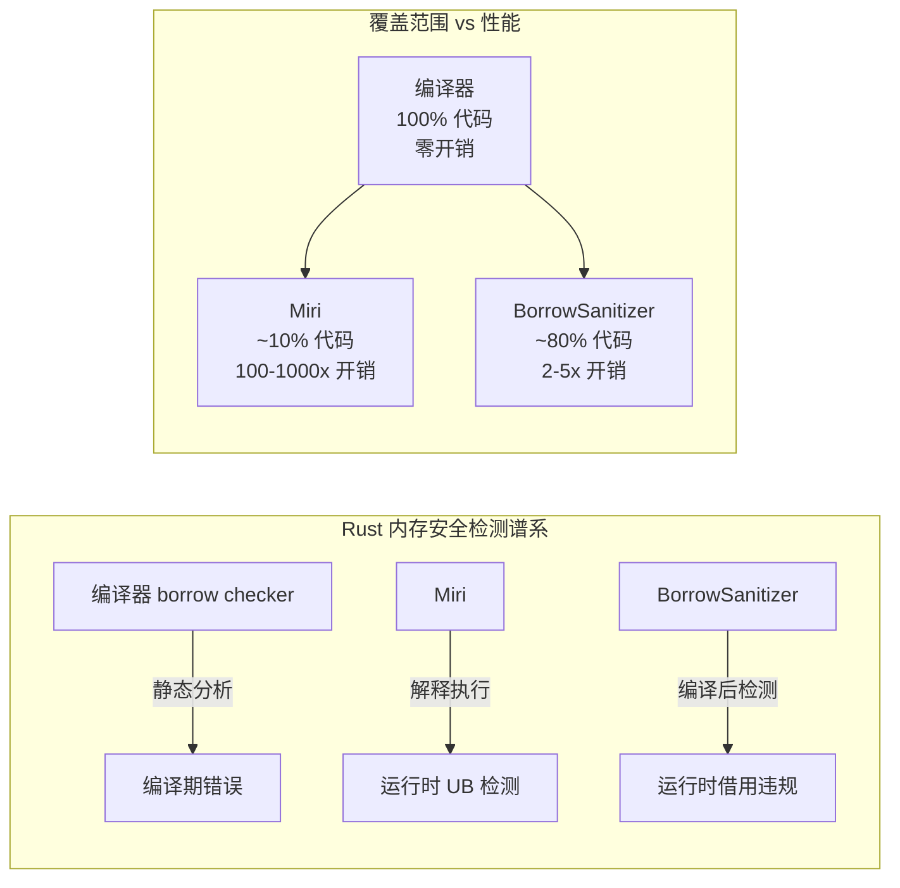
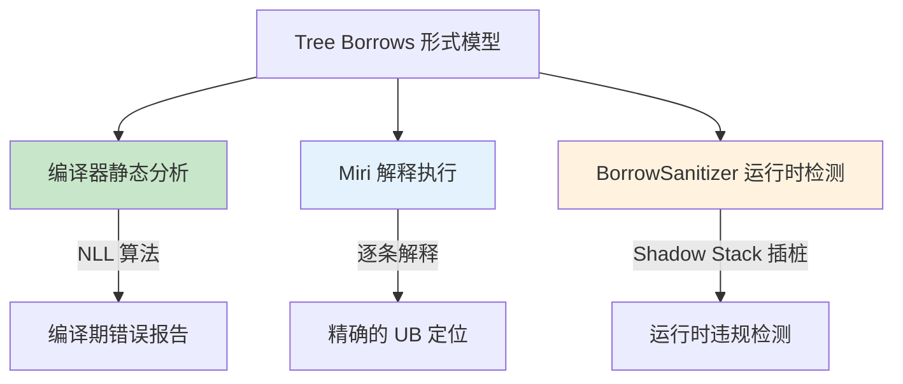
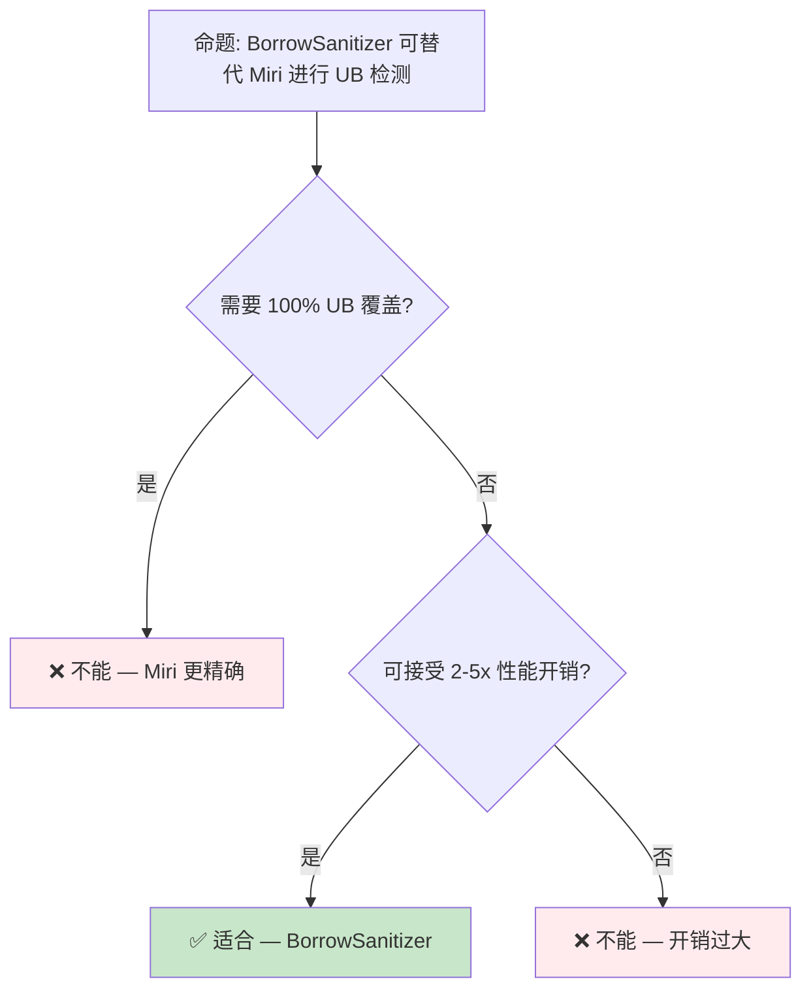

# BorrowSanitizer 概念预研：运行时借用检查工业化
>
> **状态**: 🧪 Nightly 实验性
> **跟踪版本**: nightly 1.98.0 (2026-05-31)
> **预计稳定**: 待定（需等待 RFC / MCP 完成）
>
> **受众**: [专家]
> **内容分级**: [实验级]
> **Bloom 层级**: 分析 → 评价
> **A/S/P 标记**: **S** — Structure
> **双维定位**: C×Ana — 分析 BorrowSanitizer 预览特性
> **定位**: 探讨 BorrowSanitizer 作为 Rust **运行时借用检查**工具的工业化路径，从 Miri 的纯解释执行扩展到编译后二进制检测的设计空间。
> **前置概念**: [Unsafe Rust](../03_advanced/03_unsafe.md) · [Ownership](../01_foundation/01_ownership.md) · [Borrowing](../01_foundation/02_borrowing.md) · [Version Tracking](./05_rust_version_tracking.md)
> **后置概念**: [Formal Methods](./02_formal_methods.md) · [RustBelt](../04_formal/04_rustbelt.md)

> **定理链**: N/A — 描述性/综述性/导航性文档，不涉及形式化定理链
---

> **来源**:
> [Rust Internals — BorrowSanitizer Discussion](https://internals.rust-lang.org/) ·
> [Miri: An Interpreter for Rust's Mid-level IR](https://github.com/rust-lang/miri) ·
> [AddressSanitizer Wiki](https://github.com/google/sanitizers/wiki/AddressSanitizer) ·
> [Rust Project Goals 2026](https://rust-lang.github.io/rust-project-goals/2026/) ·
> [Tree Borrows Paper (POPL 2026)](https://perso.crans.org/vanille/treebor/) ·
> [Stacked Borrows Paper](https://plv.mpi-sws.org/rustbelt/stacked-borrows/)

## 📑 目录

- [BorrowSanitizer 概念预研：运行时借用检查工业化](#borrowsanitizer-概念预研运行时借用检查工业化)
  - [📑 目录](#-目录)
  - [一、核心概念](#一核心概念)
    - [1.1 问题定义：编译期检查的边界](#11-问题定义编译期检查的边界)
    - [1.2 Miri：解释执行的 UB 检测](#12-miri解释执行的-ub-检测)
    - [1.3 BorrowSanitizer 的设计目标](#13-borrowsanitizer-的设计目标)
    - [1.4 Shadow Stack 与 Lock-and-Key 策略](#14-shadow-stack-与-lock-and-key-策略)
  - [二、与现有工具的对比矩阵](#二与现有工具的对比矩阵)
  - [三、形式化语义](#三形式化语义)
    - [3.1 借用标签的生命周期](#31-借用标签的生命周期)
    - [3.2 从 Tree Borrows 到运行时检测](#32-从-tree-borrows-到运行时检测)
  - [四、反命题与边界分析](#四反命题与边界分析)
    - [4.1 反命题树](#41-反命题树)
    - [4.2 边界极限](#42-边界极限)
  - [五、演进路线与预测](#五演进路线与预测)
  - [六、来源与延伸阅读](#六来源与延伸阅读)
  - [相关概念文件](#相关概念文件)
  - [权威来源索引](#权威来源索引)
  - [十、边界测试：BorrowSanitizer 预览的编译错误](#十边界测试borrowsanitizer-预览的编译错误)
    - [10.1 边界测试：BorrowSanitizer 的别名分析误报（编译错误/运行时检测）](#101-边界测试borrowsanitizer-的别名分析误报编译错误运行时检测)
    - [10.2 边界测试：Sanitizer 与优化的交互（运行时检测丢失）](#102-边界测试sanitizer-与优化的交互运行时检测丢失)
    - [10.3 边界测试：BorrowSanitizer 与 FFI 的交互盲区（运行时漏报）](#103-边界测试borrowsanitizer-与-ffi-的交互盲区运行时漏报)
    - [10.6 边界测试：BorrowSanitizer 与 `unsafe` 块内的合法别名（运行时误报）](#106-边界测试borrowsanitizer-与-unsafe-块内的合法别名运行时误报)
    - [10.5 边界测试：BorrowSanitizer 与 Miri 的检测范围差异（UB 漏检）](#105-边界测试borrowsanitizer-与-miri-的检测范围差异ub-漏检)
    - [10.3 边界测试：BorrowSanitizer 的插桩盲区与优化代码（UB 漏检）](#103-边界测试borrowsanitizer-的插桩盲区与优化代码ub-漏检)
    - [补充定理链](#补充定理链)
  - [认知路径](#认知路径)
    - [核心推理链](#核心推理链)
    - [反命题与边界](#反命题与边界)

---

## 一、核心概念
>
>

### 1.1 问题定义：编译期检查的边界
>

Rust 的所有权系统通过**编译期检查**消除数据竞争和内存安全问题：

```ignore
// 此代码故意展示编译期借用检查错误
fn main() {
    let mut x = 5;
    let r1 = &x;
    let r2 = &mut x; // ❌ 编译错误：cannot borrow `x` as mutable
    println!("{}", r1);
}
```

> **编译期的局限**: 编译器只能分析**静态可达**的代码路径。以下场景编译器无法检测：
>
> 1. **Unsafe 代码块**中的 raw pointer 操作
> 2. **FFI 边界**的外部代码
> 3. **编译期无法确定**的复杂控制流（如某些泛型递归）
> [来源: [Rustonomicon — Unsafe Rust](https://doc.rust-lang.org/nomicon/)]

---

### 1.2 Miri：解释执行的 UB 检测
>

Miri 是 Rust 的 MIR（Mid-level IR）解释器，通过**逐条指令解释执行**检测未定义行为：

```text
Miri 检测的 UB 类别:
├── 内存访问: 使用已释放内存、越界访问、未对齐访问
├── 借用违规: 在 &mut 存在时使用 &、重叠生命周期访问
├── 类型违规: 违反类型不变性（如 bool 非 0/1）
└── 并发违规: 数据竞争（使用 ThreadSanitizer 模式）
```

> **Miri 的局限**:
>
> - **速度**: 解释执行比原生代码慢 100-1000 倍
> - **覆盖**: 只能执行实际运行的代码路径
> - **外部调用**: 不支持所有外部函数（如某些系统调用）
> [来源: [Miri 文档](https://github.com/rust-lang/miri)]

---

### 1.3 BorrowSanitizer 的设计目标
>

BorrowSanitizer 旨在填补编译期检查与 Miri 之间的空白：



> **认知功能**: 此图展示 Rust 内存安全检测的**三层架构**——编译器负责静态保证，Miri 负责深度验证，BorrowSanitizer 负责工业级运行时检测。
> [来源: [TRPL](https://doc.rust-lang.org/book/)]
> **使用建议**: 开发阶段使用编译器；测试阶段使用 BorrowSanitizer；深度审计使用 Miri。
> **关键洞察**: BorrowSanitizer 的定位是"**可部署的 Miri 子集**"——牺牲部分检测能力以换取可接受的运行时开销。
> [来源: 💡 原创分析]

---

### 1.4 Shadow Stack 与 Lock-and-Key 策略
>

BorrowSanitizer 的核心机制是 **Shadow Stack**（影子栈）配合 **Lock-and-Key**（锁钥）运行时检测：

```text
Shadow Stack 数据结构:
┌─────────────────────────────────────────┐
│ 内存地址 → 借用标签栈                      │
│ 0x1000: [Unique(1), Shared(2), Shared(3)] │
│ 0x1008: [Unique(4)]                       │
│ ...                                       │
└─────────────────────────────────────────┘
```

**Lock-and-Key 检测机制**（受 CETS 启发）：

1. **每个分配关联一个 lock location**：包含 allocation ID、基址/边界、Tree Borrows 状态树指针
2. **每次内存访问时**：比较指针 provenance 与目标地址对应 lock 的 allocation ID
3. **不匹配或 Tree Borrows 状态机拒绝该访问时**：触发 UB 报告

> **Retag Intrinsics**：编译器在 codegen 阶段插入 `__rust_retag_reg`（寄存器指针）和 `__rust_retag_mem`（内存指针）调用，实现 provenance 跟踪。关键设计：仅改变 provenance 而不改变地址，因此不需要直接写入原内存地址，兼容 `readonly` 参数。
> [来源: [borrowsanitizer.com/status/february_2026.html](https://borrowsanitizer.com/status/february_2026.html)]

**垃圾回收策略**：

Miri 使用 tracing GC（stop-the-world 扫描所有可达 provenance）。BorrowSanitizer 计划采用 **deferred reference counting（延迟引用计数）** 混合技术：

- **堆上值**：引用计数
- **栈上值**：tracing GC（扫描各线程 shadow stack）

> GC 线程并发运行，仅在更新 shadow stack 时阻塞对应线程。
> [来源: [borrowsanitizer.com/status/january_2026.html](https://borrowsanitizer.com/status/january_2026.html)]

---

## 二、与现有工具的对比矩阵

| 工具 | 检测范围 | 运行方式 | 性能开销 | FFI | Tree Borrows | 适用阶段 |
|:---|:---|:---|:---:|:---:|:---:|:---|
| **Miri** | UB 全类别 | 解释执行 | ~1000x+ | ❌ | ✅ 完整 | 开发/单元测试 |
| **BorrowSanitizer** | 别名违规 | LLVM 插桩 | ~2x（目标） | ✅ | 🟡 开发中 | 集成测试/Fuzzing |
| **AddressSanitizer** | 内存错误（UAF/越界/堆栈） | LLVM 插桩 | ~2x | ✅ | ❌ | CI/测试 |
| **ThreadSanitizer** | 数据竞争 | LLVM 插桩 | ~5–15x | ✅ | ❌ | CI/测试 |
| **MemorySanitizer** | 未初始化读 | LLVM 插桩 | ~3x | 有限 | ❌ | CI/测试 |
| **Kani** | 形式化验证 | 模型检查 | 极高 | ❌ | 部分 | 安全关键验证 |

> **关键差异**: Miri 通过解释执行维护精确内存模型，精度最高但速度极慢；BorrowSanitizer 通过 LLVM 插桩实现运行时检测，速度显著提升（初步测试显示显著快于 Miri，对数尺度），且原生支持 FFI。AddressSanitizer 检测的是内存错误（use-after-free、缓冲区溢出），不检测别名违规——两者可叠加使用。

---

## 三、形式化语义

### 3.1 借用标签的生命周期
>

BorrowSanitizer 的 Shadow Stack 是 Tree Borrows 模型的**运行时实现**：

```text
Tree Borrows 核心规则（简化）:
1. 每个内存位置有一棵借用树
2. 根节点是原始所有权
3. 子节点是借用（& 或 &mut）
4. 访问规则:
   - SharedReadOnly 允许任意数量的读
   - SharedReadWrite 允许单一写或多读（需同步）
   - Unique 允许单一读写，排斥其他访问
```

> **形式化视角**: Tree Borrows 将 Rust 的借用检查从**线性栈**（Stacked Borrows）推广到**树形结构**，允许更灵活的借用模式。BorrowSanitizer 的 Shadow Stack 需要实现这一树形结构的运行时跟踪。
> [来源: [Tree Borrows Paper (POPL 2026)](https://perso.crans.org/vanille/treebor/)]

---

### 3.2 从 Tree Borrows 到运行时检测
>



> **认知功能**: 此图展示 Tree Borrows 形式模型如何分支为三个不同的工程实现：编译器（静态）、Miri（解释）、BorrowSanitizer（运行时插桩）。
> **使用建议**: 形式模型研究者关注 Tree Borrows 论文；工具开发者关注 Miri 和 BorrowSanitizer 的实现差异。
> **关键洞察**: 三个实现共享同一**形式化语义**，但在**工程权衡**上不同——静态分析追求零开销，解释执行追求精确性，运行时检测追求可部署性。

---

## 四、反命题与边界分析

### 4.1 反命题树
>



> **认知功能**: 此决策树帮助项目决策者判断 BorrowSanitizer 是否适合其场景。核心判断标准是"精确性要求"和"性能预算"。
> **使用建议**: CI 集成测试使用 BorrowSanitizer；深度安全审计仍使用 Miri；生产环境依赖编译器保证。
> **关键洞察**: BorrowSanitizer 不是 Miri 的替代，而是**Miri 的工业级近似**——覆盖 80% 的 UB 场景，但可集成到标准测试流程中。

---

### 4.2 边界极限
>

```text
边界 1: BorrowSanitizer 无法检测的 UB
├── 严格别名违规（strict aliasing）——需要类型信息
├── 未定义行为的组合效应——单条指令合法但整体违规
└── 与 OS/硬件交互的 UB——超出用户空间检测范围

边界 2: 与现有 Sanitizer 的互补
├── AddressSanitizer: 检测 use-after-free、缓冲区溢出
├── ThreadSanitizer: 检测数据竞争
├── BorrowSanitizer: 检测借用违规
└── 三者可同时使用（叠加开销）
```

> **边界要点**: BorrowSanitizer 专注于**借用语义违规**，不替代 AddressSanitizer 或 ThreadSanitizer。三者形成互补的检测矩阵。
> [来源: [Sanitizers Wiki](https://github.com/google/sanitizers/wiki)]

---

## 五、演进路线与预测

| 里程碑 | 状态 | 预计时间 | 来源 |
|:---|:---:|:---|:---|
| 初始原型（单线程 Tree Borrows） | ✅ 完成 | 2025 Q4 | Rust Blog 2025-10 |
| Pre-RFC / MCP #958 | ✅ 发布 | 2026-01-08 | GitHub compiler-team#958 |
| 详细错误消息 | ✅ 完成 | 2026-02 | 官网 Status Feb |
| Provenance 缩至 128-bit | ✅ 完成 | 2026-02 | 官网 Status Feb |
| Shadow Stack 实现 | ✅ 完成 | 2026-04 | 官网 Status Apr |
| Retag Intrinsics PR | 🟡 准备提交 | 2026 Q2 | Rust Blog 2026-05 |
| Miri 测试套件通过率 | 🟡 ~80% | 2026-03 | 官网 Status Mar |
| LLVM 组件 RFC | 🟡 起草中 | 2026 春/夏 | 官网 Status Apr |
| RustConf 2026 演讲 | ✅ 已入选 | 2026-09 | Rust Blog 2026-04 |
| 垃圾回收 | 🔴 未完成 | — | 官网 Status Jan |
| 原子内存访问支持 | 🔴 未完成 | — | 官网 Status Jan |
| Nightly 可用 | 🔴 预计 | 2026 Q4+ | 项目目标 |
| 稳定化 | 🔴 远期 | 2027+ | 项目目标 |

> **2026 年度目标**: BorrowSanitizer 是 Rust 2026 年 **33 个旗舰目标之一**（3.8 号目标）。核心目标是从研究原型过渡到**可用工具**。三个关键特性待实现：垃圾回收、错误报告、原子内存访问支持。
> **上游化计划**: 采用分阶段策略——先上游化 LLVM 组件（定义外层 API、shadow memory 管理、错误报告），再通过弱符号被 Rust 运行时覆盖。LLVM 运行时单独测试时为空操作（no-op）。
> **预测**: BorrowSanitizer 的工业化路径参考 AddressSanitizer。最大技术挑战是 **Shadow Stack 的性能优化**（当前仍与 Miri 同数量级，缺乏 GC 是主因）和 **LLVM RFC 的推进**。
> [来源: [Rust Project Goals 2026](https://rust-lang.github.io/rust-project-goals/2026/flagships.html)] · [borrowsanitizer.com](https://borrowsanitizer.com/)]

---

## 六、来源与延伸阅读
>

| 来源 | 可信度 | 说明 |
|:---|:---:|:---|
| [Miri GitHub](https://github.com/rust-lang/miri) | ✅ 一级 | 官方 MIR 解释器 |
| [Tree Borrows Paper (POPL 2026)](https://perso.crans.org/vanille/treebor/) | ✅ 一级 | 形式化模型 |
| [Stacked Borrows Paper](https://plv.mpi-sws.org/rustbelt/stacked-borrows/) | ✅ 一级 | 前期形式化模型 |
| [Rust Project Goals 2026](https://rust-lang.github.io/rust-project-goals/2026/) | ✅ 一级 | 官方项目目标 |
| [Rust Internals Forum](https://internals.rust-lang.org/) | ⚠️ 二级 | 设计讨论 |
| [AddressSanitizer Wiki](https://github.com/google/sanitizers/wiki) | 🔍 三级 | 对比参考 |

---

```rust
fn main() {
    let feature = "preview";
    println!("{}", feature);
}
```

## 相关概念文件

- [Unsafe Rust](../03_advanced/03_unsafe.md) — Unsafe 边界与借用规则
- [Ownership](../01_foundation/01_ownership.md) — 所有权系统的形式化根基
- [Borrowing](../01_foundation/02_borrowing.md) — 借用检查的核心机制
- [Formal Methods](./02_formal_methods.md) — 形式化验证工具链
- [RustBelt](../04_formal/04_rustbelt.md) — 所有权的形式化证明
- [Version Tracking](./05_rust_version_tracking.md) — Rust 版本特性演进

---

> **权威来源**: [Rust Reference](https://doc.rust-lang.org/reference/), [Miri](https://github.com/rust-lang/miri), [Rustonomicon](https://doc.rust-lang.org/nomicon/)
> **权威来源对齐变更日志**: 2026-05-21 创建，对齐 Rust 1.96.0+ (Edition 2024)

**文档版本**: 1.0
**对应 Rust 版本**: 1.96.0+ (Edition 2024)
**最后更新**: 2026-05-21
**状态**: ✅ 概念文件创建完成（待调研结果补充 Shadow Stack 技术细节）

---

## 权威来源索引

>
>
>
>
>
>
>

---

---

---

## 十、边界测试：BorrowSanitizer 预览的编译错误

### 10.1 边界测试：BorrowSanitizer 的别名分析误报（编译错误/运行时检测）

```rust,ignore
fn main() {
    let mut x = [0i32; 4];
    let ptr = x.as_mut_ptr();
    unsafe {
        // ❌ BorrowSanitizer 运行时错误: 指针算术后的别名违规
        let p1 = ptr.add(0);
        let p2 = ptr.add(1);
        *p1 = 1; // p1 和 p2 都派生自 ptr，但指向不重叠的位置
        *p2 = 2; // BorrowSanitizer（基于 Stacked Borrows）可能标记为违规
    }
}
```

> **修正**: BorrowSanitizer（实验性）是 LLVM 的 sanitizers 家族新成员，专门检测 Rust 风格的借用违规。
> 它与 Miri 类似，但在编译后的二进制中插入检查（类似 AddressSanitizer），因此可检测 FFI 边界和并发场景。
> 关键挑战：**别名分析的精度**。上述代码中，`p1` 和 `p2` 指向不重叠的数组元素，理论上安全，但 Stacked Borrows 模型可能要求每次通过派生指针写入后"重新借用"原始指针。
> Tree Borrows 模型对此更宽松——允许不重叠区域的独立可变访问。
> BorrowSanitizer 的设计必须选择内存模型（Stacked Borrows 更严格、更多误报；Tree Borrows 更宽松、可能漏报）。
> 这与 ASan（AddressSanitizer）的 false positive 问题类似——工具开发者需在检测能力和可用性间权衡。
> [来源: [LLVM Sanitizers](https://clang.llvm.org/docs/AddressSanitizer.html)] ·
> [来源: [Tree Borrows Paper](https://www.ralfj.de/blog/2023/01/31/tree-borrows.html)]

### 10.2 边界测试：Sanitizer 与优化的交互（运行时检测丢失）

```rust
fn main() {
    let mut x = 0;
    let r = &mut x;
    unsafe {
        let ptr = r as *mut i32;
        *ptr = 1;
        // 若编译器优化掉了 *r 的读取（因为已知值）
        // BorrowSanitizer 的检测点可能被优化移除
        println!("{}", x); // x = 1
    }
}
```

> **修正**:
> Sanitizer 的检测代码插入在 LLVM IR 层面，后续优化可能：
>
> 1) 移除"明显冗余"的检查；
> 2) 内联和常量传播改变代码形状，使 sanitizer 的元数据追踪失效；
> 3) 死代码消除删除包含检测点的分支。
> 这是所有动态分析工具的固有问题：**被分析代码的变换改变分析结果**。
> 解决方案：`-C opt-level=0`（禁用优化）用于 sanitizer 构建，或设计 sanitizer 元数据为"优化不可删除"。
> Rust 的 `-Z sanitizer=borrow`（实验性）将在 debug 构建中工作，与 ASan/MSan 的模式一致。
> 这与形式化验证（不依赖运行时检测）互补：sanitizer 捕获实际执行路径上的违规，形式化验证捕获所有可能路径上的违规。
> [来源: [LLVM Sanitizer Design](https://llvm.org/docs/HowToSetUpLLVMStyleRTTI.html)] ·
> [来源: [Rust Sanitizer Documentation](https://doc.rust-lang.org/unstable-book/compiler-flags/sanitizer.html)]

### 10.3 边界测试：BorrowSanitizer 与 FFI 的交互盲区（运行时漏报）

```rust,compile_fail
extern "C" {
    fn c_modify(ptr: *mut i32);
}

fn main() {
    let mut x = 42;
    let r1 = &mut x;
    unsafe {
        c_modify(r1); // 传递 &mut x 给 C 代码
    }
    // ❌ BorrowSanitizer 盲区: C 代码可能创建 x 的别名
    // 若 C 代码内部保存了 ptr，后续通过 r1 访问时 BorrowSanitizer 可能不检测
    println!("{}", r1);
}
```

> **修正**:
> BorrowSanitizer 在 Rust 代码的 MIR/LLVM IR 层面插入检查，但**FFI 边界**是盲区：C 代码中的指针操作对 BorrowSanitizer 不可见。
> 若 C 代码：
>
> 1) 保存 Rust 传递的指针供后续使用；
> 2) 将指针传递给其他 C 函数；
> 3) 通过指针修改数据——Rust 侧的借用检查无法验证这些操作的安全性。
>
> 这是所有动态分析工具的共同限制：跨语言边界的分析需要双方合作。
>
> 缓解措施：
>
> 1) FFI 接口使用 `&T`/`&mut T` 时，C 代码承诺不创建别名；
> 2) 使用 `cbindgen`/`cxx` 生成类型安全的绑定；
> 3) 对关键 FFI 路径使用 Miri（可模拟 C 代码的内存操作，若提供 MIR）。
> 这与 ASan 的 FFI 盲区（C 代码的内存错误不触发 Rust 侧的 ASan）相同——语言边界的分析是开放问题。
> [来源: [Rust FFI Guidelines](https://rust-lang.github.io/rust-bindgen/)] ·
> [来源: [Miri Foreign Function Interface](https://github.com/rust-lang/miri/)]

### 10.6 边界测试：BorrowSanitizer 与 `unsafe` 块内的合法别名（运行时误报）

```rust,ignore
fn main() {
    let mut x = [0i32; 4];
    let ptr = x.as_mut_ptr();
    unsafe {
        let p1 = ptr.add(0);
        let p2 = ptr.add(2);
        *p1 = 1;
        *p2 = 2;
        // ⚠️ 运行时误报: BorrowSanitizer 可能标记 p1 和 p2 的别名违规
        // 尽管它们指向不重叠的位置
    }
    println!("{:?}", x);
}
```

> **修正**:
> BorrowSanitizer 基于特定内存模型（可能是 Stacked Borrows 或 Tree Borrows），**误报**（false positive）是设计权衡的一部分。
> Stacked Borrows 对指针别名更严格：从同一原始指针派生的所有指针共享一个借用标签，任意写入可能使其他派生指针失效。
> Tree Borrows 更宽松：允许不重叠区域的独立访问。
>
> BorrowSanitizer 的选择影响检测结果：
>
> 1) Stacked Borrows 模式：更多误报，更少漏报；
> 2) Tree Borrows 模式：更少误报，可能漏报某些违规。
> 这与 ASan 的误报（某些合法代码被标记为内存错误）或 TSan 的误报（某些同步模式被标记为数据竞争）类似——动态分析工具的精度受限于底层模型。
>
> 开发者的应对：
>
> 1) 理解工具使用的内存模型；
> 2) 对误报使用 `#[cfg(not(sanitize = "borrow"))]` 跳过；
> 3) 用 Miri 交叉验证。
>
> [来源: [LLVM Sanitizers](https://clang.llvm.org/docs/AddressSanitizer.html)] · [来源: [Tree Borrows](https://www.ralfj.de/blog/2023/01-31_tree-borrows.html)]

### 10.5 边界测试：BorrowSanitizer 与 Miri 的检测范围差异（UB 漏检）

```rust,ignore
// ❌ 检测盲区: BorrowSanitizer（运行时）与 Miri（解释器）可能检测到不同 UB

fn alias_violation() {
    let mut x = 5;
    let r1 = &mut x as *mut i32;
    let r2 = &mut x as *mut i32;
    unsafe {
        *r1 = 1;
        *r2 = 2; // UB: 重叠的可变裸指针别名
    }
}

// Miri: 可检测到（解释执行，跟踪标签）
// BorrowSanitizer: 依赖插桩，某些优化后代码可能漏检
// ASan/MSan: 检测内存错误，不检测别名违规
```

> **修正**:
> Rust 的 UB 检测工具谱：
>
> 1) **Miri**（最全面）：解释执行，跟踪 Stacked Borrows / Tree Borrows 标签，检测所有内存和别名违规，但极慢（10-100x 减速）；
> 2) **BorrowSanitizer**（设想中）：运行时插桩，类似 ASan，检测别名违规，但受优化影响（release 模式可能内联/删除检测点）；
> 3) **ASan/MSan**：检测内存错误（use-after-free、越界），不检测别名。
>
> 互补策略：开发期用 Miri 全面检查，CI 用 BorrowSanitizer（若存在）快速回归测试，发布用 ASan 检测残余内存问题。
> 当前状态（2025）：BorrowSanitizer 仍是研究概念，无可用实现；
> 社区用 Miri + `cargo fuzz` + ASan 组合覆盖。
> 这与 C/C++ 的 sanitizer 生态（ASan/MSan/UBSan/TSan 成熟可用）不同——Rust 的内存安全保证减少了 sanitizer 的必要性，但 unsafe 代码和 FFI 边界仍需工具支持。
> [来源: [Miri Documentation](https://github.com/rust-lang/miri)] ·
> [来源: [Stacked Borrows](https://plv.mpi-sws.org/rustbelt/stacked-borrows/)]

### 10.3 边界测试：BorrowSanitizer 的插桩盲区与优化代码（UB 漏检）

```rust,ignore
fn alias_violation() {
    let mut x = 5;
    let r1 = &mut x as *mut i32;
    let r2 = &mut x as *mut i32;
    unsafe {
        *r1 = 1;
        *r2 = 2; // UB: 重叠的可变裸指针
    }
}

fn main() {
    alias_violation();
    // Miri 可检测，BorrowSanitizer（若存在）可能因优化后代码漏检
}
```

> **修正**: Rust 的 UB 检测工具谱：
>
> 1) **Miri**（最全面）：解释执行，跟踪 Stacked Borrows / Tree Borrows 标签，检测所有内存和别名违规，但极慢；
> 2) **BorrowSanitizer**（设想中）：运行时插桩，类似 ASan，检测别名违规，但受优化影响；
> 3) **ASan/MSan**：检测内存错误，不检测别名。
>
> 互补策略：开发期用 Miri 全面检查，CI 用 BorrowSanitizer 快速回归测试，发布用 ASan 检测残余内存问题。
> 当前状态（2025）：BorrowSanitizer 仍是研究概念，无可用实现；社区用 Miri + `cargo fuzz` + ASan 组合覆盖。
> 这与 C/C++ 的 sanitizer 生态（ASan/MSan/UBSan/TSan 成熟可用）不同——Rust 的内存安全保证减少了 sanitizer 的必要性，但 unsafe 代码和 FFI 边界仍需工具支持。
> [来源: [Miri Documentation](https://github.com/rust-lang/miri)] ·
> [来源: [Stacked Borrows](https://plv.mpi-sws.org/rustbelt/stacked-borrows/)]
> **过渡**: BorrowSanitizer 概念预研：运行时借用检查工业化 的深入理解需要结合具体代码实践，建议通过编写测试用例验证边界行为。

### 补充定理链

- **定理**: BorrowSanitizer 概念预研：运行时借用检查工业化 定义 ⟹ 类型安全保证

## 认知路径

> **认知路径**: 从 Rust 核心语言特性出发，经由 **BorrowSanitizer 概念预研：运行时借用检查工业化** 的生态/前沿实践，通向系统化工程能力与未来语言演进方向。

### 核心推理链

| 定理 | 前提 | 结论 | 置信度 |
|:---|:---|:---|:---|
| BorrowSanitizer 概念预研：运行时借用检查工业化 基础原理 ⟹ 正确选型 | 理解核心概念与适用边界 | 能在实际项目中做出合理决策 | 高 |
| BorrowSanitizer 概念预研：运行时借用检查工业化 选型实践 ⟹ 常见陷阱 | 忽视版本兼容性与生态成熟度 | 技术债务或迁移成本 | 中 |
| BorrowSanitizer 概念预研：运行时借用检查工业化 陷阱规避 ⟹ 深度掌握 | 持续跟踪社区演进与最佳实践 | 能进行架构设计与技术预研 | 高 |

> **过渡**: 掌握 BorrowSanitizer 概念预研：运行时借用检查工业化 的基础概念后，建议通过实际案例与源码阅读加深理解，建立从理论到实践的桥梁。
> **过渡**: 在工程实践中应用 BorrowSanitizer 概念预研：运行时借用检查工业化 时，务必评估生态成熟度、社区支持与长期维护风险，避免过度依赖实验性技术。
> **过渡**: BorrowSanitizer 概念预研：运行时借用检查工业化 反映了 Rust 生态系统的演进趋势与语言设计哲学，理解这些趋势有助于预判未来发展方向并做出前瞻性技术决策。

### 反命题与边界

> **反命题**: "BorrowSanitizer 概念预研：运行时借用检查工业化 是万能解决方案，适用于所有场景" —— 错误。任何技术选择都有权衡，需根据具体需求、团队能力与项目约束综合评估。
