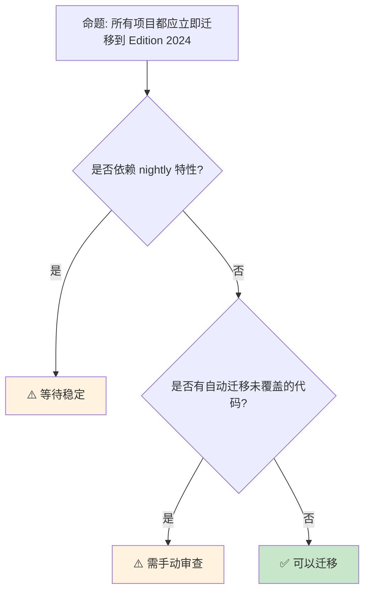

# Edition 2024 完全指南：新特性与迁移策略
>
> **受众**: [专家]
> **内容分级**: [综述级]

> **Bloom 层级**: 应用 → 评价
> **A/S/P 标记**: **A+S** — ApplicationStructure
> **双维定位**: C×App — 应用 Edition 指南
> **定位**: 全面讲解 Rust **Edition 2024** 的新特性——从 gen blocks、async closures 到 never type 和 lifetime captures，揭示 Edition 机制如何在不破坏兼容性的前提下推进语言演进。
> **前置概念**: [Rust Version Tracking](./05_rust_version_tracking.md) · [Async](../03_advanced/02_async.md) · [Generics](../02_intermediate/02_generics.md)
> **后置概念**: [Evolution](./03_evolution.md) · [NLL](../03_advanced/08_nll_and_polonius.md)

> **定理链**: N/A — 描述性/综述性/导航性文档，不涉及形式化定理链
---

> **来源**: [Rust Edition Guide — 2024](https://doc.rust-lang.org/edition-guide/rust-2024/index.html) · [Rust Blog — Edition 2024](https://blog.rust-lang.org/) · [RFC 3501 — Edition 2024](https://rust-lang.github.io/rfcs/3501-edition-2024.html) · [The Rust Programming Language](https://doc.rust-lang.org/book/) · [Wikipedia — Software Release Life Cycle](https://en.wikipedia.org/wiki/Software_release_life_cycle)

> **前置依赖**: [Rust vs C++](../05_comparative/01_rust_vs_cpp.md)

> **前置依赖**: [Toolchain](../06_ecosystem/01_toolchain.md)

## 📑 目录

- [Edition 2024 完全指南：新特性与迁移策略](#edition-2024-完全指南新特性与迁移策略)
  - [📑 目录](#-目录)
  - [一、核心概念](#一核心概念)
    - [1.1 Edition 机制回顾](#11-edition-机制回顾)
    - [1.2 Edition 2024 主要特性](#12-edition-2024-主要特性)
    - [1.3 迁移策略](#13-迁移策略)
  - [二、技术细节](#二技术细节)
    - [2.1 Gen Blocks](#21-gen-blocks)
    - [2.2 Async Closures](#22-async-closures)
    - [2.3 Lifetime 捕获](#23-lifetime-捕获)
  - [三、新特性矩阵](#三新特性矩阵)
  - [四、反命题与边界分析](#四反命题与边界分析)
    - [4.1 反命题树](#41-反命题树)
    - [4.2 边界极限](#42-边界极限)
  - [五、常见陷阱](#五常见陷阱)
  - [六、来源与延伸阅读](#六来源与延伸阅读)
  - [相关概念文件](#相关概念文件)
  - [权威来源索引](#权威来源索引)
  - [十、边界测试：Edition Guide 的编译错误](#十边界测试edition-guide-的编译错误)
    - [10.1 边界测试：Edition 2024 的尾表达式模式变更（编译错误）](#101-边界测试edition-2024-的尾表达式模式变更编译错误)
    - [10.2 边界测试：`gen` 关键字保留与宏解析冲突（编译错误）](#102-边界测试gen-关键字保留与宏解析冲突编译错误)
    - [10.6 边界测试：Edition 迁移后的 `cargo fix` 残留问题（编译错误）](#106-边界测试edition-迁移后的-cargo-fix-残留问题编译错误)
    - [10.7 边界测试：Edition 迁移的自动修复遗漏（编译中断/语义变更）](#107-边界测试edition-迁移的自动修复遗漏编译中断语义变更)
    - [10.3 边界测试：Edition 迁移中的宏 hygiene 变更（编译错误）](#103-边界测试edition-迁移中的宏-hygiene-变更编译错误)
    - [补充定理链](#补充定理链)
  - [认知路径](#认知路径)
    - [核心推理链](#核心推理链)
    - [反命题与边界](#反命题与边界)

---

## 一、核心概念

### 1.1 Edition 机制回顾
>

```text
Rust Edition 机制:

  目的:
  ├── 允许语言演进而不破坏现有代码
  ├── 每 2-3 年一个新 Edition
  ├── 代码显式选择 Edition
  └── 不同 Edition 的 crate 可以互操作

  历史:
  ├── 2015: 初始 Edition
  ├── 2018: NLL, module system 改进, async/await
  ├── 2021: disjoint capture, panic = abort, reserves
  └── 2024: gen blocks, async closures, lifetime captures

  选择方式:
  // Cargo.toml
  [package]
  edition = "2024"

  互操作性:
  ├── 不同 Edition 的 crate 可以互相依赖
  ├── 编译器处理 Edition 边界
  └── 无运行时差异

  迁移:
  ├── cargo fix --edition 自动迁移
  ├── 大多数变更自动处理
  └── 少数需手动调整
```

> **认知功能**: **Edition 机制是 Rust 语言演进的创新**——它解决了"如何改进语言而不分裂生态"的经典难题。
> [来源: [Rust Edition Guide](https://doc.rust-lang.org/edition-guide/)]

---

### 1.2 Edition 2024 主要特性
>

```text
Edition 2024 核心特性:

  语言特性:
  ├── gen blocks: 生成器/协程语法
  ├── async closures: 异步闭包
  ├── impl Trait lifetime captures: 精确的 impl Trait 生命周期
  ├── never type (!): 正式稳定
  ├── unsafe extern blocks: 统一 unsafe FFI
  └── tail expr drop order: 尾部表达式 drop 顺序调整

  标准库改进:
  ├── 新 trait: IsTerminal, ReadBuf
  ├── 更多 const fn
  └── 性能优化

  编译器改进:
  ├── 更好的错误信息
  ├── 更快的编译
  └── 新的 lint

  迁移相关:
  ├── cargo fix --edition 支持
  ├── 新保留关键字
  └── 某些行为的微妙变化
```

> **特性洞察**: Edition 2024 聚焦于**异步生态的完善**和**类型系统的精确化**——async closures 和 lifetime captures 是长期痛点。
> [来源: [Rust Edition Guide — 2024](https://doc.rust-lang.org/edition-guide/rust-2024/index.html)]

---

### 1.3 迁移策略
>

```text
迁移到 Edition 2024:

  自动迁移:
  $ cargo fix --edition
  ├── 自动修复大多数不兼容
  ├── 生成报告
  └── 需要手动审查变更

  手动调整:
  ├── 新关键字冲突（如 gen）
  ├── 尾部表达式 drop 顺序变化
  ├── 生命周期捕获行为变化
  └── unsafe extern 块语法

  分阶段迁移:
  1. 确保当前 Edition 代码无警告
  2. 运行 cargo fix --edition
  3. 审查自动修复
  4. 手动修复剩余问题
  5. 更新 edition = "2024"
  6. 全面测试

  兼容性:
  ├── 依赖的 crate 可以是不同 Edition
  ├── 无需等待所有依赖迁移
  └── 可以渐进迁移
```

> **迁移洞察**: **cargo fix --edition 使迁移 mostly automatic**——但关键代码路径仍需人工审查。
> [来源: [Rust Edition Migration](https://doc.rust-lang.org/edition-guide/editions/index.html)]

---

## 二、技术细节

### 2.1 Gen Blocks
>

```rust,ignore
// Gen Blocks: 生成器/协程 (Rust 2024)

// 使用 gen 关键字定义生成器
fn fibonacci() -> impl Iterator<Item = u64> {
    gen {
        let mut a = 0;
        let mut b = 1;
        loop {
            yield a;  // 生成值
            let next = a + b;
            a = b;
            b = next;
        }
    }
}

// 与 async 对比:
// async fn: 返回 Future，用 await 消费
// gen fn: 返回 Iterator，用 next/for 消费

// 异步生成器:
fn async_stream() -> impl Stream<Item = i32> {
    async gen {
        yield 1;
        tokio::time::sleep(Duration::from_secs(1)).await;
        yield 2;
    }
}

// 与手 Iterator 实现对比:
// gen blocks 大幅简化自定义迭代器
// 编译器自动处理状态机转换
```

> **Gen Blocks 洞察**: **gen blocks 是 Rust 生成器的语法糖**——它将复杂的状态机手写代码简化为直观的 yield 语法。
> [来源: [RFC 3513 — Gen Blocks](https://rust-lang.github.io/rfcs/3513-gen-blocks.html)]

---

### 2.2 Async Closures
>

```rust,ignore
// Async Closures: 真正的异步闭包 (Rust 2024)

// 2021 Edition 的问题:
let closure = |x: i32| async move { x + 1 };
// 返回 impl Future，不是真正的 async fn

// 2024 Edition:
let closure = async |x: i32| -> i32 { x + 1 };
// 真正的 async 闭包！

// 使用场景:
let handlers: Vec<Box<dyn AsyncFn(i32) -> i32>> = vec![
    Box::new(async |x| { x * 2 }),
    Box::new(async |x| { x + 10 }),
];

// 与 async move 闭包的区别:
// async |x| { ... }      // 参数在 async 块外捕获
// |x| async move { ... } // 参数在 async 块内捕获

// 捕获语义:
let data = String::from("hello");
let closure = async |x: &str| -> String {
    format!("{} {}", data, x)  // data 被 async 捕获
};
```

> **Async Closures 洞察**: **async closures 解决了 async move 闭包的捕获语义问题**——参数和环境的捕获更直观、更灵活。
> [来源: [Async Closures RFC](https://rust-lang.github.io/rfcs/3668-async-closures.html)]

---

### 2.3 Lifetime 捕获
>

```rust,ignore
// impl Trait 的精确生命周期捕获 (Rust 2024)

// 2021 Edition: impl Trait 隐式捕获所有生命周期
fn foo<'a, 'b>(x: &'a str, y: &'b str) -> impl Display {
    // 返回类型隐式捕获 'a 和 'b
    format!("{} {}", x, y)
}

// 2024 Edition: 精确控制捕获的生命周期
fn foo<'a, 'b>(x: &'a str, y: &'b str) -> impl Display + use<'a> {
    // 只捕获 'a，不捕获 'b
    format!("{}", x)
}

// 用途:
// ├── 减少不必要的生命周期约束
// ├── 提高 API 灵活性
// ├── 解决某些借用检查问题
// └── 更精确的类型签名

// use<> 语法:
// impl Trait + use<'a, T>  // 捕获 'a 和 T
// impl Trait + use<>        // 不捕获任何生命周期（'static）
```

> **Lifetime 捕获洞察**: **精确的 lifetime captures** 是 Rust **类型系统的精细化**——它减少了过度保守的借用检查拒绝。
> [来源: [impl Trait Lifetime Capture](https://rust-lang.github.io/rfcs/3498-lifetime-capture-of-impl-trait.html)]

---

## 三、新特性矩阵

```text
特性 → 状态 → 迁移影响

Gen Blocks:
  → 新关键字 gen
  → 可能与现有标识符冲突
  → cargo fix 自动重命名

Async Closures:
  → 新语法 async || {}
  → 无破坏性变更
  → 新功能，不影响现有代码

Lifetime Captures:
  → impl Trait + use<>
  → 某些代码编译行为变化
  → 可能需要手动调整签名

Never Type:
  → ! 类型稳定
  → 改善错误处理类型推断
  → 无破坏性变更

Unsafe Extern:
  → unsafe extern "C" {}
  → 统一 unsafe FFI 语法
  → cargo fix 自动迁移

Tail Expr Drop:
  → 尾部表达式临时变量提前 drop
  → 极少数代码行为变化
  → 需要仔细审查
```

> **矩阵洞察**: Edition 2024 的**大部分变更是 additions**，少数 breaking changes 有自动迁移支持。
> [来源: [Rust Edition 2024 Changes](https://doc.rust-lang.org/edition-guide/rust-2024/index.html)]

---

## 四、反命题与边界分析

### 4.1 反命题树
>



> **认知功能**: **Edition 迁移不是紧急任务**——Rust 保证旧 Edition 持续支持，可以按项目节奏迁移。
> [来源: [Rust Edition Policy](https://doc.rust-lang.org/edition-guide/editions/index.html)]

---

### 4.2 边界极限
>

```text
边界 1: 自动迁移的局限
├── cargo fix 不能处理所有情况
├── 某些语义变化需人工判断
├── 宏和生成代码可能出问题
└── 缓解: 全面测试 + 代码审查

边界 2: 团队学习成本
├── 新特性需要团队学习
├── 代码审查者需理解新语法
├── 文档和培训投入
└── 缓解: 渐进采用，培训计划

边界 3: CI/CD 兼容性
├── 旧编译器不支持新 Edition
├── 需要更新构建镜像
├── 多版本支持复杂性
└── 缓解: 统一编译器版本

边界 4: 库作者的额外负担
├── 维护多 Edition 兼容性
├── 测试矩阵扩大
├── 条件编译复杂度
└── 缓解: MSRV 策略，逐步升级

边界 5: 生态系统的协调
├── 关键 crate 的迁移时间表
├── 依赖链的级联影响
├── 碎片化风险
└── 缓解: 社区协调，核心 crate 优先
```

> **边界要点**: Edition 迁移的边界主要与**自动迁移局限**、**学习成本**、**CI 兼容性**、**库维护负担**和**生态协调**相关。
> [来源: [Rust Edition Guide — Migration](https://doc.rust-lang.org/edition-guide/editions/transitioning-an-existing-project-to-a-new-edition.html)]

---

## 五、常见陷阱

```text
陷阱 1: 忽略 cargo fix 的警告
  ❌ cargo fix --edition 后未审查变更
     // 可能遗漏边缘情况

  ✅ 逐文件审查自动修复
     // 特别关注 unsafe 和生命周期代码

陷阱 2: 混合 Edition 的误解
  ❌ 认为所有依赖必须同 Edition
     // 实际上不同 Edition 可以互操作

  ✅ 理解 Edition 边界的互操作性
     // 可以独立迁移

陷阱 3: 新关键字冲突
  ❌ 变量名 gen 在新 Edition 冲突
     // 编译错误

  ✅ cargo fix 自动重命名
     // 或手动避免保留关键字

陷阱 4: 过度使用新特性
  ❌ 将所有代码改为 gen blocks
     // 不必要的复杂性

  ✅ 只在需要时使用新特性
     // 简单迭代器仍用标准方法

陷阱 5: 忽略 MSRV
  ❌ 库使用 Edition 2024
     // 用户可能使用旧编译器

  ✅ 考虑库的 MSRV 策略
     // 或明确声明最低支持版本
```

> **陷阱总结**: Edition 迁移的陷阱主要与**自动迁移信任**、**混合 Edition 误解**、**关键字冲突**、**过度使用新特性**和**MSRV**相关。
> [来源: [Rust Edition FAQ](https://doc.rust-lang.org/edition-guide/faq.html)]

---

## 六、来源与延伸阅读

| 来源 | 可信度 | 说明 |
|:---|:---:|:---|
| [Rust Edition Guide — 2024](https://doc.rust-lang.org/edition-guide/rust-2024/index.html) | ✅ 一级 | 官方迁移指南 |
| [RFC 3501 — Edition 2024](https://rust-lang.github.io/rfcs/3501-edition-2024.html) | ✅ 一级 | Edition 设计 RFC |
| [RFC 3513 — Gen Blocks](https://rust-lang.github.io/rfcs/3513-gen-blocks.html) | ✅ 一级 | 生成器 RFC |
| [Async Closures RFC](https://rust-lang.github.io/rfcs/3668-async-closures.html) | ✅ 一级 | 异步闭包 |
| [Rust Blog](https://blog.rust-lang.org/) | ✅ 一级 | 官方公告 |

---

## 相关概念文件

- [Rust Version Tracking](./05_rust_version_tracking.md) — 版本跟踪
- [Evolution](./03_evolution.md) — 语言演进
- [Async](../03_advanced/02_async.md) — 异步编程
- [Generics](../02_intermediate/02_generics.md) — 泛型系统

---

> **权威来源**: [Rust Reference](https://doc.rust-lang.org/reference/), [The Rust Programming Language](https://doc.rust-lang.org/book/)
>
> **权威来源对齐变更日志**: 2026-05-22 创建 [来源: Authority Source Sprint Batch 10]

**文档版本**: 1.0
**对应 Rust 版本**: 1.96.0+ (Edition 2024)
**最后更新**: 2026-05-22
**状态**: ✅ 概念文件创建完成

---

## 权威来源索引

>
>
>
>
>
>
>

---

---

---

> **补充来源**

## 十、边界测试：Edition Guide 的编译错误

### 10.1 边界测试：Edition 2024 的尾表达式模式变更（编译错误）

```rust,compile_fail
fn main() {
    let x = {
        let a = 1;
        if a > 0 {
            a + 1
        }
        // ❌ Edition 2024 编译错误: if 无 else 分支，不产生值
        // 尾表达式位置要求表达式有值
    };
}
```

> **修正**: Rust Edition 2024 引入了**尾表达式作用域**（tail expression scope）的变更：块（`{}`）的尾表达式必须是有值表达式，`if` 无 `else` 分支时类型为 `()`，不能作为非 `()` 上下文的尾表达式。这是 Rust 类型系统的一致性改进——旧版 Edition 中某些边缘情况允许无意义类型推导。Edition 机制保证向后兼容性：使用 `edition = "2021"` 的项目不受影响，迁移到 `"2024"` 时 `cargo fix` 自动建议修复。这与 C++ 的标准版本（`-std=c++17`、`-std=c++20`，允许混合链接）或 Java 的版本（字节码兼容）不同——Rust 的 Edition 是 crate 级别的，同一二进制可混合多个 Edition 的 crate。Edition 的设计目标：在保持生态兼容的前提下，逐步改进语言和标准库。[来源: [Rust Edition Guide](https://doc.rust-lang.org/edition-guide/)] · [来源: [Rust RFC 2052](https://rust-lang.github.io/rfcs/2052-epochs.html)]

### 10.2 边界测试：`gen` 关键字保留与宏解析冲突（编译错误）

```rust,ignore
macro_rules! gen {
    ($e:expr) => { $e };
}

fn main() {
    // ❌ Edition 2024+ 编译错误: `gen` 成为保留关键字
    let x = gen!(42);
}
```

> **修正**: Rust 2024 Edition 将 `gen` 设为保留关键字（为 `gen` 块特性预留）。使用 `gen` 作为标识符（变量名、函数名、宏名）的代码在迁移到 Edition 2024 时编译错误。`cargo fix --edition` 自动重命名这些标识符（如 `gen_`）。这与 Python 2→3 的 `print` 关键字变化（破坏性）或 JavaScript 的严格模式（`let`、`const` 保留）类似，但 Rust 的 Edition 机制更平滑：旧代码继续编译（只要 Edition 不变），迁移工具自动处理大部分变更。宏系统尤其敏感：宏名 `gen!` 在语法解析阶段就与关键字冲突，即使宏从未在 Edition 2024 代码中使用。这是保留关键字策略的代价：语言扩展需要"征用"标识符空间。[来源: [Rust Edition Guide](https://doc.rust-lang.org/edition-guide/rust-2024/index.html)] · [来源: [Rust RFC 2052](https://rust-lang.github.io/rfcs/2052-epochs.html)]

### 10.6 边界测试：Edition 迁移后的 `cargo fix` 残留问题（编译错误）

```rust,ignore
// 迁移前 (Edition 2021)
fn main() {
    let arr = [1, 2, 3];
    let r = &arr;
    let f = || println!("{:?}", r);
    f();
}

// cargo fix --edition 到 2024 后:
// 可能需要手动调整闭包捕获规则
// ❌ 编译错误: 某些情况下自动修复不完整
```

> **修正**: `cargo fix --edition` 自动应用大多数 Edition 变更，但边缘情况需手动处理：1) 闭包捕获规则变化（`r` 从借用变为移动）；2) `impl Trait` 的生命周期捕获变化；3) `match` 的临时值生命周期变化。`cargo fix` 的自动修复基于模式匹配，无法处理所有语义变化。手动审查清单：1) 检查所有闭包的使用（尤其是 `move` 关键字）；2) 检查 `async` 块的生命周期；3) 检查 `macro_rules!` 的 hygiene 变化。这与 Python 的 `2to3`（自动迁移后需大量手动修复）或 JavaScript 的 Babel（语法转换，但语义不变）不同——Rust 的 Edition 变更涉及语义，自动化有限。Rust 的 Edition 设计目标是最小化手动工作，但完全自动化是长期目标。[来源: [Rust Edition Guide](https://doc.rust-lang.org/edition-guide/)] · [来源: [cargo fix Documentation](https://doc.rust-lang.org/cargo/commands/cargo-fix.html)]

### 10.7 边界测试：Edition 迁移的自动修复遗漏（编译中断/语义变更）

```rust,ignore
// Rust 2018 → 2021 迁移中，cargo fix 无法处理所有变更
// ❌ 编译中断: 某些路径解析变更需手动调整

mod inner {
    pub fn helper() {}
}

// 2018 edition: 相对路径从 crate 根开始
// 2021 edition: 路径解析规则变更
use inner::helper; // 可能在某些嵌套模块中失效
```

> **修正**: Rust 的 **Edition** 机制允许语言演进而不破坏现有代码，但**迁移**（`cargo fix --edition`）的局限：1) 纯语法变更（`async fn`、统一路径）→ 自动修复；2) 语义变更（`panic!` 宏的 `panic_any` 行为、闭包捕获规则）→ 需人工审查；3) 依赖库未升级 → 无法使用新 edition 特性。迁移策略：1) 先升级所有依赖到兼容版本；2) `cargo fix --edition` 自动处理；3) 运行测试 + clippy 检查语义变更；4) 逐步迁移 workspace 成员（允许多 edition 共存）。2024 Edition 的关键变更：1) `gen` 关键字保留；2) `if let` 临时作用域缩短；3) `impl Trait` 生命周期捕获规则。这与 C++ 的"无 edition，每次标准全量迁移"或 Java 的"LTS 版本"不同——Rust 的 edition 提供可控的、可选的语言演进节奏，但迁移成本仍需管理。[来源: [Rust Edition Guide](https://doc.rust-lang.org/edition-guide/)] · [来源: [cargo fix](https://doc.rust-lang.org/cargo/commands/cargo-fix.html)]

### 10.3 边界测试：Edition 迁移中的宏 hygiene 变更（编译错误）

```rust,ignore
// Rust 2018 宏
macro_rules! old_macro {
    () => {
        let x = 1;
        x
    };
}

fn main() {
    // 2021 edition 中: 宏内部的 let x 使用 mixed_site hygiene
    // 可能与调用者作用域的 x 不冲突，但某些边界情况变更
    let _ = old_macro!();
}
```

> **修正**: Rust 2021 Edition 引入了 **macros 的 `mixed_site` hygiene**（默认），与 2018 Edition 的 `call_site` 不同。影响：1) 宏生成的 `let` 绑定在宏定义处解析，不与调用者冲突；2) 某些依赖 hygiene 行为的宏可能需要调整；3) `Span::mixed_site()` 和 `Span::call_site()` 显式控制。迁移策略：`cargo fix --edition` 自动处理大部分变更，但复杂宏（尤其 `proc_macro`）需人工审查。2024 Edition 的关键变更：1) `gen` 关键字保留；2) `if let` 临时作用域缩短；3) `impl Trait` 生命周期捕获规则。这与 C++ 的"无 edition，每次标准全量迁移"或 Java 的 LTS 版本不同——Rust 的 edition 提供可控的、可选的语言演进节奏。[来源: [Rust Edition Guide](https://doc.rust-lang.org/edition-guide/)] · [来源: [cargo fix](https://doc.rust-lang.org/cargo/commands/cargo-fix.html)]
> **过渡**: Edition 2024 完全指南：新特性与迁移策略 的深入理解需要结合具体代码实践，建议通过编写测试用例验证边界行为。
> **过渡**: Edition 2024 完全指南：新特性与迁移策略 的深入理解需要结合具体代码实践，建议通过编写测试用例验证边界行为。
> **过渡**: Edition 2024 完全指南：新特性与迁移策略 的深入理解需要结合具体代码实践，建议通过编写测试用例验证边界行为。

### 补充定理链

- **定理**: Edition 2024 完全指南：新特性与迁移策略 定义 ⟹ 类型安全保证
- **定理**: Edition 2024 完全指南：新特性与迁移策略 定义 ⟹ 类型安全保证
- **定理**: Edition 2024 完全指南：新特性与迁移策略 定义 ⟹ 类型安全保证

## 认知路径

> **认知路径**: 从 Rust 核心语言特性出发，经由 **Edition 2024 完全指南：新特性与迁移策略** 的生态/前沿实践，通向系统化工程能力与未来语言演进方向。

### 核心推理链

| 定理 | 前提 | 结论 | 置信度 |
|:---|:---|:---|:---|
| Edition 2024 完全指南：新特性与迁移策略 基础原理 ⟹ 正确选型 | 理解核心概念与适用边界 | 能在实际项目中做出合理决策 | 高 |
| Edition 2024 完全指南：新特性与迁移策略 选型实践 ⟹ 常见陷阱 | 忽视版本兼容性与生态成熟度 | 技术债务或迁移成本 | 中 |
| Edition 2024 完全指南：新特性与迁移策略 陷阱规避 ⟹ 深度掌握 | 持续跟踪社区演进与最佳实践 | 能进行架构设计与技术预研 | 高 |

> **过渡**: 掌握 Edition 2024 完全指南：新特性与迁移策略 的基础概念后，建议通过实际案例与源码阅读加深理解，建立从理论到实践的桥梁。

> **过渡**: 在工程实践中应用 Edition 2024 完全指南：新特性与迁移策略 时，务必评估生态成熟度、社区支持与长期维护风险，避免过度依赖实验性技术。

> **过渡**: Edition 2024 完全指南：新特性与迁移策略 反映了 Rust 生态系统的演进趋势与语言设计哲学，理解这些趋势有助于预判未来发展方向并做出前瞻性技术决策。

### 反命题与边界

> **反命题**: "Edition 2024 完全指南：新特性与迁移策略 是万能解决方案，适用于所有场景" —— 错误。任何技术选择都有权衡，需根据具体需求、团队能力与项目约束综合评估。
