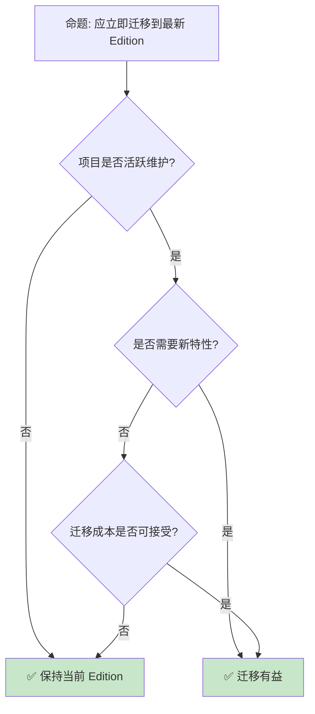

# Rust Edition 机制与迁移指南

> **代码状态**: ✅ 含可编译示例
>
> **EN**: Rust Edition Guide
> **Summary**: Rust Edition Guide: emerging Rust language feature or ecosystem trend.
>
> **受众**: [专家]
> **内容分级**: [综述级]
> **Bloom 层级**: 分析 → 应用
> **A/S/P 标记**: **A+S** — ApplicationStructure
> **双维定位**: C×App — 应用 Rust Edition 指南
> **定位**: 深入探讨 Rust 的 **Edition 机制**——从 2015 到 2024，分析 Edition 如何实现语言演进而不破坏兼容性，以及迁移策略。
> **前置概念**: [Toolchain](../06_ecosystem/01_toolchain.md) · [Macros](../03_advanced/04_macros.md) · [Type System](../01_foundation/04_type_system.md)
> **后置概念**: [Evolution](03_evolution.md) · [Version Tracking](05_rust_version_tracking.md)
> **定理链**: N/A — 描述性/综述性/导航性文档，不涉及形式化定理链
---

> **来源**: [Edition Guide](https://doc.rust-lang.org/edition-guide/) · [TRPL — Appendix: Rust Editions](https://doc.rust-lang.org/book/appendix-05-editions.html)
> [Rust Edition Guide](https://doc.rust-lang.org/edition-guide/) ·
> [RFC 2052 — Epochs](https://rust-lang.github.io/rfcs//2052-epochs.html) ·
> [Rust Blog — Edition 2024](https://blog.rust-lang.org/) ·
> [Wikipedia — Software Versioning](https://en.wikipedia.org/wiki/Software_versioning)

## 📑 目录

- [Rust Edition 机制与迁移指南](.#rust-edition-机制与迁移指南)
  - [📑 目录](.#-目录)
  - [一、核心概念](.#一核心概念)
    - [1.1 Edition 机制](.#11-edition-机制)
    - [1.2 版本兼容性](.#12-版本兼容性)
    - [1.3 2024 Edition 关键变更](.#13-2024-edition-关键变更)
  - [二、迁移策略](.#二迁移策略)
    - [2.1 cargo fix](.#21-cargo-fix)
    - [2.2 手动迁移](.#22-手动迁移)
  - [三、反命题与边界分析](.#三反命题与边界分析)
    - [3.1 反命题树](.#31-反命题树)
    - [3.2 边界极限](.#32-边界极限)
  - [四、常见陷阱](.#四常见陷阱)
  - [五、来源与延伸阅读](.#五来源与延伸阅读)
  - [相关概念文件](.#相关概念文件)
  - [权威来源索引](.#权威来源索引)
  - [十、边界测试：Rust Edition Guide 的编译错误](.#十边界测试rust-edition-guide-的编译错误)
    - [10.1 边界测试：`impl Trait` 在静态项中的生命周期捕获（编译错误）](.#101-边界测试impl-trait-在静态项中的生命周期捕获编译错误)
    - [10.2 边界测试：Edition 迁移的宏展开差异（编译错误）](.#102-边界测试edition-迁移的宏展开差异编译错误)
    - [10.6 边界测试：Edition 2024 的 `gen` 关键字保留与现有标识符冲突（编译错误）](.#106-边界测试edition-2024-的-gen-关键字保留与现有标识符冲突编译错误)
    - [10.5 边界测试：多 Edition workspace 的依赖解析冲突（编译错误）](.#105-边界测试多-edition-workspace-的依赖解析冲突编译错误)
    - [10.3 边界测试：多 Edition workspace 的 resolver 冲突（编译错误）](.#103-边界测试多-edition-workspace-的-resolver-冲突编译错误)
    - [补充定理链](.#补充定理链)
  - [嵌入式测验（Embedded Quiz）](.#嵌入式测验embedded-quiz)
    - [测验 1：`cargo-semver-checks` 在 Rust 生态中解决什么问题？（理解层）](.#测验-1cargo-semver-checks-在-rust-生态中解决什么问题理解层)
    - [测验 2：为什么 SemVer 在 Rust 中特别重要？（理解层）](.#测验-2为什么-semver-在-rust-中特别重要理解层)
    - [测验 3：`cargo-semver-checks` 与手动审查 API 变更相比有什么优势？（理解层）](.#测验-3cargo-semver-checks-与手动审查-api-变更相比有什么优势理解层)
    - [测验 4：`cargo-public-api` 与 `cargo-semver-checks` 有什么区别？（理解层）](.#测验-4cargo-public-api-与-cargo-semver-checks-有什么区别理解层)
    - [测验 5：这些工具对 Rust 生态系统稳定性的意义是什么？（理解层）](.#测验-5这些工具对-rust-生态系统稳定性的意义是什么理解层)
  - [认知路径](.#认知路径)
    - [核心推理链](.#核心推理链)
    - [反命题与边界](.#反命题与边界)

---

## 一、核心概念

### 1.1 Edition 机制

```text
Edition 机制:

  设计: 语言演进不破坏现有代码
  ├── 每 3 年一个新 Edition
  ├── Edition 之间完全互操作
  ├── 选择 Edition 在 crate 级别
  └── 默认 Edition 逐步更新

  历史:
  ├── 2015 Edition: 初始版本
  ├── 2018 Edition: NLL, async/await, module 简化
  ├── 2021 Edition: 预导入 panic, disjoint capture, IntoIterator for arrays
  └── 2024 Edition: gen blocks（nightly 预览）, never type, RPIT lifetime capture

  Cargo.toml 配置:
  [package]
  name = "my-crate"
  version = "0.1.0"
  edition = "2024"

  互操作保证:
  ├── 不同 Edition 的 crate 可链接
  ├── 同一项目中可混用
  └── 公共 API 行为一致
```

> **认知功能**: **Edition 是 Rust 语言演进的"安全阀"**——允许语法变化而不分裂生态。
> [来源: [Rust Edition Guide](https://doc.rust-lang.org/edition-guide/)]

---

### 1.2 版本兼容性

```text
兼容性承诺:

  稳定性保证:
  ├── 标准库 API 永不删除
  ├── 旧代码在新编译器上仍可编译
  ├── 行为变化极少
  └── 安全修复优先

  Edition 切换:
  ├── 同一编译器支持多 Edition
  ├── 切换 Edition 可能需要代码修改
  └── 互操作保证跨 Edition 调用

  版本号含义:
  ├── Major: Edition 变更
  ├── Minor: 每 6 周发布
  └── Patch: 安全修复

  对比其他语言:
  ┌─────────────────┬─────────────────┬─────────────────┐
  │ 语言             │ 版本策略        │ 兼容性           │
  ├─────────────────┼─────────────────┼─────────────────┤
  │ Rust            │ Edition + SemVer│ 强              │
  │ C++             │ 标准周期        │ 中               │
  │ Python          │ 重大版本        │ 弱（2→3）        │
  │ JavaScript      │ 年度更新        │ 强               │
  │ Go              │ SemVer          │ 强              │
  └─────────────────┴─────────────────┴─────────────────┘
```

> **兼容性洞察**: **Rust 的兼容性承诺是行业标杆**——Edition 机制实现了"演化而不革命"。
> [来源: [Rust RFC 2052](https://rust-lang.github.io/rfcs//2052-epochs.html)]

---

### 1.3 2024 Edition 关键变更
>

```text
2024 Edition 主要变更:

  gen blocks（nightly，feature `gen_blocks`）:
  ├── gen { yield 1; yield 2; }
  ├── 简化生成器语法
  └── 与 async {} 对称
  └── 注意：`gen` 关键字在 Edition 2024 中已预留，但 `gen {}` / `gen fn` 仍为 nightly

  never type (!):
  ├── 函数永不返回: fn abort() -> !
  ├── 类型推导改进
  └── 与 Result 更好集成

  RPIT 精确捕获:
  ├── use<'a, T> 语法
  ├── 精确控制生命周期捕获
  └── 解决意外捕获问题

  保留变更:
  ├── 某些语法变化需 Edition 2024
  ├── cargo fix 自动迁移
  └── 详细列表见 Edition Guide

  迁移工具:
  cargo fix --edition
  cargo fix --edition-idioms
```

> **2024 洞察**: **2024 Edition 聚焦异步（Async）和类型系统（Type System）完善**——精确捕获是核心稳定特性；gen blocks 作为 `gen` 关键字预留后的 nightly 预览特性，为未来生成器语法铺路。
> [来源: [Rust Edition 2024 Guide](https://doc.rust-lang.org/edition-guide/rust-2024/index.html)]

---

## 二、迁移策略

### 2.1 cargo fix
>

```text
cargo fix:

  自动迁移:
  ├── 检测 Edition 不兼容代码
  ├── 自动应用修复
  ├── 生成报告
  └── 交互式确认

  使用:
  # 预览变更
  cargo fix --edition --dry-run

  # 应用变更
  cargo fix --edition

  # 迁移到惯用法
  cargo fix --edition-idioms

  支持的修复:
  ├── 模块路径变化
  ├── 保留关键字
  ├── 捕获模式变化
  ├── 生命周期推导
  └── 宏规则变化
```

> **cargo fix 洞察**: **cargo fix 是 Rust 迁移体验的杀手级特性**——自动化减少了 Edition 升级的痛苦。
> [来源: [cargo fix](https://doc.rust-lang.org/cargo/commands/cargo-fix.html)]

---

### 2.2 手动迁移
>

```text
手动迁移检查清单:

  模块系统:
  ├── 检查 mod.rs 用法
  ├── 验证 use 路径
  └── 确认 crate:: 前缀

  异步:
  ├── 检查 .await 语法
  ├── 确认 Future trait
  └── 验证 Pin 用法

  生命周期:
  ├── 检查推导变化
  ├── 确认显式标注
  └── 验证 API 兼容性

  宏:
  ├── 检查保留关键字
  ├── 验证 token 树
  └── 确认 hygiene

  测试:
  ├── 运行完整测试套件
  ├── 检查边缘情况
  └── 验证性能回归
```

> **手动迁移洞察**: **复杂项目需要手动审查**——cargo fix 处理不了语义变化。
> [来源: [Rust Edition Guide — Migration](https://doc.rust-lang.org/edition-guide/editions/transitioning-an-existing-project-to-a-new-edition.html)]

---

## 三、反命题与边界分析

### 3.1 反命题树
>



> **认知功能**: **迁移决策取决于项目活跃度和新特性需求**——不活跃的库保持现状即可。

---

### 3.2 边界极限
>

```text
边界 1: 宏兼容性
├── 过程宏可能受 Edition 影响
├── 语法变化影响 token 解析
└── 缓解: 测试宏在所有 Edition 下的行为

边界 2: 依赖兼容性
├── 依赖 crate 的 Edition 可能不同
├── 公共接口需考虑跨 Edition
└── 缓解: 保持公共 API Edition 无关

边界 3: 文档和示例
├── 文档需更新以反映新 Edition
├── 示例代码可能过时
└── 缓解: 使用 edition 标注代码块

边界 4: 团队培训
├── 新 Edition 特性需学习
├── 代码审查标准更新
└── 缓解: 团队培训、编码规范更新

边界 5: CI/CD
├── 多 Edition 测试矩阵
├── 工具链更新
└── 缓解: 自动化测试、渐进式部署
```

> **边界要点**: Edition 迁移的边界与**宏（Macro）**、**依赖**、**文档**、**培训**和**CI/CD**相关。

---

## 四、常见陷阱

```text
陷阱 1: 混用 Edition
  ❌ 同一项目中不同 crate 使用不同 Edition 导致混乱
     // crate A: edition = "2021"
     // crate B: edition = "2024"
     // 调用代码可能行为不一致

  ✅ 统一项目 Edition 或明确文档化

陷阱 2: 忽略 cargo fix 警告
  ❌ 自动修复未完全处理
     cargo fix --edition
     // 仍有手动修复项

  ✅ 运行后检查输出，手动处理剩余项

陷阱 3: 假设行为完全一致
  ❌ 认为 Edition 仅影响语法
     // 某些语义可能微妙变化

  ✅ 仔细阅读 Edition 变更说明

陷阱 4: 忘记更新 CI
  ❌ CI 仍使用旧工具链
     // 本地通过，CI 失败

  ✅ 更新 rust-toolchain.toml

陷阱 5: 过度追求最新 Edition
  ❌ 不活跃项目仍升级
     // 引入风险无收益

  ✅ 根据需求决定是否升级
```

> **陷阱总结**: Edition 迁移的陷阱主要与**混用**、**自动修复**、**语义变化**、**CI**和**过度升级**相关。

---

## 五、来源与延伸阅读

| 来源 | 可信度 | 说明 |
|:---|:---:|:---|
| [Rust Edition Guide](https://doc.rust-lang.org/edition-guide/) | ✅ 一级 | 官方指南 |
| [RFC 2052](https://rust-lang.github.io/rfcs//2052-epochs.html) | ✅ 一级 | Edition RFC |
| [Rust Blog](https://blog.rust-lang.org/) | ✅ 一级 | 官方博客 |
| [cargo fix](https://doc.rust-lang.org/cargo/commands/cargo-fix.html) | ✅ 一级 | 迁移工具 |
| [SemVer](https://semver.org/) | ✅ 二级 | 语义化版本 |

---

```rust
fn main() {
    let feature = "preview";
    println!("{}", feature);
}
```

## 相关概念文件

- [Toolchain](../06_ecosystem/01_toolchain.md) — 工具链
- [Evolution](03_evolution.md) — 语言演进
- [Version Tracking](05_rust_version_tracking.md) — 版本跟踪
- [Macros](../03_advanced/04_macros.md) — 宏（Macro）系统

---

> **权威来源**: [Rust Reference](https://doc.rust-lang.org/reference/)
>
> **权威来源对齐变更日志**: 2026-05-22 创建 [来源: Authority Source Sprint Batch 11]

**文档版本**: 1.0
**对应 Rust 版本**: 1.96.0+ (Edition 2024)
**最后更新**: 2026-05-22
**状态**: ✅ 概念文件创建完成

---

## 权威来源索引

>
>
>
>
>
>
>

---

---

---

## 十、边界测试：Rust Edition Guide 的编译错误

### 10.1 边界测试：`impl Trait` 在静态项中的生命周期捕获（编译错误）

```rust,compile_fail
fn make_iter() -> impl Iterator<Item = i32> {
    vec![1, 2, 3].into_iter()
}

static ITER: impl Iterator<Item = i32> = make_iter();
// ❌ 编译错误: `impl Trait` 不能用于 static/const 项（当前限制）

fn main() {
    for x in ITER {
        println!("{}", x);
    }
}
```

> **修正**:
> `impl Trait` 在类型别名位置和静态项中的使用是 Rust 的长期限制。
> `static` 和 `const` 要求类型在编译期完全已知（单态化），而 `impl Trait` 是**存在类型**（existential type）——隐藏具体实现，只暴露 trait bound。
> 编译器需要知道 `static` 的确切大小和对齐，因此不能是抽象的 `impl Trait`。
> [RFC 2289](https://rust-lang.github.io/rfcs//2289-associated-type-bounds.html)（`type_alias_impl_trait`）部分解决了类型别名的问题，但 `static`/`const` 仍不支持。
> Edition 演进可能逐步放宽这些限制。 workaround：使用 trait 对象 `Box<dyn Iterator<Item = i32>>`（有运行时（Runtime）虚函数开销），或手写具体类型（暴露实现细节）。
> 这与 C++ 的 `auto`（不能用于 `static`）或 Java 的接口（可用于 `static`，但需具体实现类）不同——Rust 的 `impl Trait` 设计追求零成本抽象（Zero-Cost Abstraction），但静态位置的单态化要求与之冲突。
> [来源: [Rust RFC 2289](https://rust-lang.github.io/rfcs//2289-associated-type-bounds.html)] ·
> [来源: [The Rust Programming Language](https://doc.rust-lang.org/book/title-page.html)]

### 10.2 边界测试：Edition 迁移的宏展开差异（编译错误）

```rust,ignore
// Edition 2021 宏
macro_rules! old_macro {
    () => {
        let _ = async { println!("hello"); };
        // Edition 2021: async 块不捕获生命周期
    };
}

// Edition 2024: async 块捕获规则变更
fn use_macro() {
    let x = 5;
    old_macro!();
    // ❌ 若宏在 Edition 2024 中展开，async 块的生命周期捕获可能不同
    // 导致编译错误或行为变化
}
```

> **修正**:
> Rust 的 Edition 是 crate 级别的，但宏展开继承调用点的 Edition。
> 这意味着定义在 Edition 2021 crate 中的宏，在 Edition 2024 crate 中调用时，按 Edition 2024 规则展开。
> 若宏生成的代码依赖特定 Edition 语义（如 `async` 块的生命周期（Lifetimes）捕获、`match` 的移动语义），跨 Edition 使用可能导致意外行为。
> `cargo fix` 的 Edition 迁移工具检查这些风险，但复杂宏可能需手动审查。这与 C 预处理器宏（纯文本替换，无 Edition 概念）或 Lisp 宏（同像性，环境继承）不同——Rust 的宏系统既有 hygiene（避免命名冲突）又有 Edition 敏感性，增加了复杂性。最佳实践：避免在宏中生成依赖 Edition 边缘语义的代码，使用显式、可移植的写法。
> [来源: [Rust Edition Guide](https://doc.rust-lang.org/edition-guide/)] · [来源: [The Little Book of Rust Macros](https://danielkeep.github.io/tlborm/book/)]

### 10.6 边界测试：Edition 2024 的 `gen` 关键字保留与现有标识符冲突（编译错误）

```rust,ignore
struct Gen {
    value: i32,
}

fn main() {
    let gen = Gen { value: 42 };
    // ❌ 编译错误: Edition 2024 中 `gen` 成为保留关键字
    // 变量名、函数名、模块名使用 `gen` 需重命名
    println!("{}", gen.value);
}
```

> **修正**:
> Rust 2024 Edition 将 `gen` 设为保留关键字（为 `gen` 块特性预留）。
> 现有代码中使用 `gen` 作为标识符（变量、函数、结构体（Struct）字段）的需重命名。
> `cargo fix --edition` 自动处理大部分冲突，但某些边缘情况需手动修复：
>
> 1) 宏生成的代码包含 `gen`；
> 2) 外部 crate 的公开 API 使用 `gen`（需等待上游修复）；
> 3) `include!` 或 `include_str!` 引入的文件中的 `gen`。
>
> 这与 Python 3 的 `print` 变为关键字（破坏性变更）或 C 的 `_Bool`/`bool`（C99 引入，可能冲突）类似——语言演进需要"征用"标识符空间。
> Rust 的 Edition 机制缓解了这一痛苦：旧 Edition 代码继续编译，迁移时工具辅助重命名。
> [来源: [Rust Edition Guide](https://doc.rust-lang.org/edition-guide/rust-2024/index.html)] ·
> [来源: [Rust RFC 2052](https://rust-lang.github.io/rfcs//2052-epochs.html)]

### 10.5 边界测试：多 Edition workspace 的依赖解析冲突（编译错误）

```rust,ignore
// Workspace Cargo.toml
// [workspace]
// members = ["crate_2018", "crate_2021", "crate_2024"]
// resolver = "3" // 2024 edition 默认

// ❌ 编译错误: 若 crate_2018 依赖旧版 syn（不支持 2024 edition）
// 且 crate_2024 的 proc-macro 使用 syn 2.0，可能导致版本冲突
```

> **修正**:
>
> Workspace 中**多 edition 共存**是常见场景（逐步迁移），但依赖解析的复杂性：
>
> 1) proc-macro crate 的 edition 影响宏展开代码的解析；
> 2) `resolver = "3"`（2024 edition 默认）改变依赖特征解析，可能影响旧 crate；
> 3) 某些 crate 的 `build.rs` 依赖特定 edition 行为。
>
> 最佳实践：
>
> 1) workspace 统一 `resolver = "2"` 或 `"3"`（不混用）；
> 2) proc-macro crate 优先升级到新 edition（影响所有依赖者）；
> 3) 使用 `cargo tree` 检查依赖图中 edition 分布。
>
> `cargo` 的依赖解析保证：
>
> 同一 crate 的多个版本可在依赖图中共存（不同版本视为不同 crate），但 proc-macro 只能有一个版本（编译期加载）。
> 这与 npm 的 workspaces（类似多包管理）或 Java 的 Maven multi-module（版本统一强制）不同——Rust 的 workspace 更灵活，但 edition 交互是高级话题。
> [来源: [The Cargo Book](https://doc.rust-lang.org/cargo/reference/resolver.html)] ·
> [来源: [Rust Edition Guide](https://doc.rust-lang.org/edition-guide/)]

### 10.3 边界测试：多 Edition workspace 的 resolver 冲突（编译错误）

```rust,ignore
// Workspace Cargo.toml
// [workspace]
// members = ["crate_2018", "crate_2021", "crate_2024"]
// resolver = "3" // 2024 edition 默认

// crate_2018 依赖旧版 syn（不支持 2024 edition 的某些语法）
// crate_2024 的 proc-macro 使用 syn 2.0
// ❌ 编译错误: 若 syn 版本冲突且 proc-macro 只能有一个版本
```

> **修正**:
>
> Workspace 中**多 edition 共存**是常见场景（逐步迁移），但依赖解析复杂：
>
> 1) proc-macro crate 的 edition 影响宏展开代码的解析；
> 2) `resolver = "3"`（2024 edition 默认）改变依赖特征解析；
> 3) 某些 crate 的 `build.rs` 依赖特定 edition 行为。
>
> 最佳实践：
>
> 1) workspace 统一 `resolver = "2"` 或 `"3"`（不混用）；
> 2) proc-macro crate 优先升级到新 edition（影响所有依赖者）；
> 3) 使用 `cargo tree` 检查依赖图中 edition 分布。
>
> `cargo` 的依赖解析保证：同一 crate 的多个版本可在依赖图中共存，但 proc-macro 只能有一个版本（编译期加载）。
> 这与 npm 的 workspaces（类似多包管理）或 Java 的 Maven multi-module（版本统一强制）不同——Rust 的 workspace 更灵活，但 edition 交互是高级话题。
> [来源: [The Cargo Book](https://doc.rust-lang.org/cargo/reference/resolver.html)] ·
> [来源: [Rust Edition Guide](https://doc.rust-lang.org/edition-guide/)]
> **过渡**: Rust Edition 机制与迁移指南 的深入理解需要结合具体代码实践，建议通过编写测试用例验证边界行为。

### 补充定理链

- **定理**: Rust Edition 机制与迁移指南 定义 ⟹ 类型安全保证

## 嵌入式测验（Embedded Quiz）

### 测验 1：`cargo-semver-checks` 在 Rust 生态中解决什么问题？（理解层）

**题目**: `cargo-semver-checks` 在 Rust 生态中解决什么问题？

<details>
<summary>✅ 答案与解析</summary>

自动检测 crate 的版本升级是否违反了语义化版本控制（SemVer）规则，如删除公共 API、改变 trait 实现、修改泛型（Generics）约束等。
</details>

---

### 测验 2：为什么 SemVer 在 Rust 中特别重要？（理解层）

**题目**: 为什么 SemVer 在 Rust 中特别重要？

<details>
<summary>✅ 答案与解析</summary>

Rust 的强类型系统（Type System）和 trait 系统使 API 变更影响透明。违反 SemVer 的更新可能导致下游 crate 编译失败。`cargo` 的依赖解析依赖 SemVer。
</details>

---

### 测验 3：`cargo-semver-checks` 与手动审查 API 变更相比有什么优势？（理解层）

**题目**: `cargo-semver-checks` 与手动审查 API 变更相比有什么优势？

<details>
<summary>✅ 答案与解析</summary>

基于 Rustdoc JSON 和 MIR 自动分析，覆盖所有公共 API 变更，不受人类审查遗漏的影响。可在 CI 中自动运行，阻断违规发布。
</details>

---

### 测验 4：`cargo-public-api` 与 `cargo-semver-checks` 有什么区别？（理解层）

**题目**: `cargo-public-api` 与 `cargo-semver-checks` 有什么区别？

<details>
<summary>✅ 答案与解析</summary>

`cargo-public-api` 只生成公共 API 差异报告（增删改）。`cargo-semver-checks` 进一步判断这些差异是否违反 SemVer 规则。
</details>

---

### 测验 5：这些工具对 Rust 生态系统稳定性的意义是什么？（理解层）

**题目**: 这些工具对 Rust 生态系统稳定性的意义是什么？

<details>
<summary>✅ 答案与解析</summary>

降低"依赖地狱"风险，鼓励库作者自信地发布新版本。使整个生态的升级路径更可预测，减少因 breaking change 导致的连锁编译失败。
</details>

## 认知路径

> **认知路径**: 从 Rust 核心语言特性出发，经由 **Rust Edition 机制与迁移指南** 的生态/前沿实践，通向系统化工程能力与未来语言演进方向。

### 核心推理链

| 定理 | 前提 | 结论 | 置信度 |
|:---|:---|:---|:---|
| Rust Edition 机制与迁移指南 基础原理 ⟹ 正确选型 | 理解核心概念与适用边界 | 能在实际项目中做出合理决策 | 高 |
| Rust Edition 机制与迁移指南 选型实践 ⟹ 常见陷阱 | 忽视版本兼容性与生态成熟度 | 技术债务或迁移成本 | 中 |
| Rust Edition 机制与迁移指南 陷阱规避 ⟹ 深度掌握 | 持续跟踪社区演进与最佳实践 | 能进行架构设计与技术预研 | 高 |

> **过渡**: 掌握 Rust Edition 机制与迁移指南 的基础概念后，建议通过实际案例与源码阅读加深理解，建立从理论到实践的桥梁。
> **过渡**: 在工程实践中应用 Rust Edition 机制与迁移指南 时，务必评估生态成熟度、社区支持与长期维护风险，避免过度依赖实验性技术。
> **过渡**: Rust Edition 机制与迁移指南 反映了 Rust 生态系统的演进趋势与语言设计哲学，理解这些趋势有助于预判未来发展方向并做出前瞻性技术决策。

### 反命题与边界

> **反命题**: "Rust Edition 机制与迁移指南 是万能解决方案，适用于所有场景" —— 错误。任何技术选择都有权衡，需根据具体需求、团队能力与项目约束综合评估。
