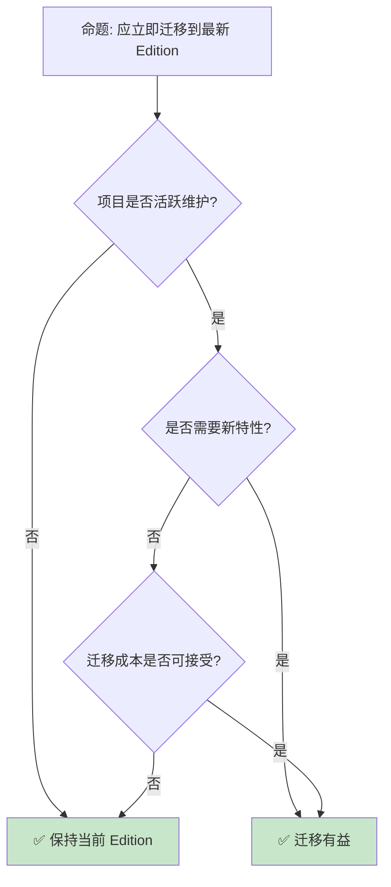

# Rust Edition 机制与迁移指南

> **Bloom 层级**: 分析 → 应用
> **定位**: 深入探讨 Rust 的 **Edition 机制**——从 2015 到 2024，分析 Edition 如何实现语言演进而不破坏兼容性，以及迁移策略。
> **前置概念**: [Toolchain](../06_ecosystem/01_toolchain.md) · [Macros](../03_advanced/04_macros.md) · [Type System](../01_foundation/04_type_system.md)
> **后置概念**: [Evolution](./03_evolution.md) · [Version Tracking](./05_rust_version_tracking.md)

---

> **来源**: [The Rust Programming Language](https://doc.rust-lang.org/book/) · [Rust Edition Guide](https://doc.rust-lang.org/edition-guide/) · [RFC 2052 — Epochs](https://rust-lang.github.io/rfcs/2052-epochs.html) · [Rust Blog — Edition 2024](https://blog.rust-lang.org/) · [Wikipedia — Software Versioning](https://en.wikipedia.org/wiki/Software_versioning)

## 📑 目录
>
> [来源: [Rust Reference](https://doc.rust-lang.org/reference/)]
>
> [来源: [Rust Edition Guide]]

- [Rust Edition 机制与迁移指南](#rust-edition-机制与迁移指南)
  - [📑 目录](#-目录)
  - [一、核心概念](#一核心概念)
    - [1.1 Edition 机制](#11-edition-机制)
    - [1.2 版本兼容性](#12-版本兼容性)
    - [1.3 2024 Edition 关键变更](#13-2024-edition-关键变更)
  - [二、迁移策略](#二迁移策略)
    - [2.1 cargo fix](#21-cargo-fix)
    - [2.2 手动迁移](#22-手动迁移)
  - [三、反命题与边界分析](#三反命题与边界分析)
    - [3.1 反命题树](#31-反命题树)
    - [3.2 边界极限](#32-边界极限)
  - [四、常见陷阱](#四常见陷阱)
  - [五、来源与延伸阅读](#五来源与延伸阅读)
  - [相关概念文件](#相关概念文件)

---

## 一、核心概念
>
> [来源: [Rust Reference](https://doc.rust-lang.org/reference/)]
>
> [来源: [Rust Reference](https://doc.rust-lang.org/reference/)]

### 1.1 Edition 机制

```text
Edition 机制:

  设计: 语言演进不破坏现有代码
  ├── 每 3 年一个新 Edition
  ├── Edition 之间完全互操作
  ├── 选择 Edition 在 crate 级别
  └── 默认 Edition 逐步更新

  历史:
  ├── 2015 Edition: 初始版本
  ├── 2018 Edition: NLL, async/await, module 简化
  ├── 2021 Edition: 预导入 panic, disjoint capture, IntoIterator for arrays
  └── 2024 Edition: gen blocks, never type, RPIT lifetime capture

  Cargo.toml 配置:
  [package]
  name = "my-crate"
  version = "0.1.0"
  edition = "2024"

  互操作保证:
  ├── 不同 Edition 的 crate 可链接
  ├── 同一项目中可混用
  └── 公共 API 行为一致
```

> **认知功能**: **Edition 是 Rust 语言演进的"安全阀"**——允许语法变化而不分裂生态。
> [来源: [Rust Edition Guide](https://doc.rust-lang.org/edition-guide/)]

---

### 1.2 版本兼容性

```text
兼容性承诺:

  稳定性保证:
  ├── 标准库 API 永不删除
  ├── 旧代码在新编译器上仍可编译
  ├── 行为变化极少
  └── 安全修复优先

  Edition 切换:
  ├── 同一编译器支持多 Edition
  ├── 切换 Edition 可能需要代码修改
  └── 互操作保证跨 Edition 调用

  版本号含义:
  ├── Major: Edition 变更
  ├── Minor: 每 6 周发布
  └── Patch: 安全修复

  对比其他语言:
  ┌─────────────────┬─────────────────┬─────────────────┐
  │ 语言            │ 版本策略        │ 兼容性          │
  ├─────────────────┼─────────────────┼─────────────────┤
  │ Rust            │ Edition + SemVer│ 强              │
  │ C++             │ 标准周期        │ 中              │
  │ Python          │ 重大版本        │ 弱（2→3）       │
  │ JavaScript      │ 年度更新        │ 强              │
  │ Go              │ SemVer          │ 强              │
  └─────────────────┴─────────────────┴─────────────────┘
```

> **兼容性洞察**: **Rust 的兼容性承诺是行业标杆**——Edition 机制实现了"演化而不革命"。
> [来源: [Rust RFC 2052](https://rust-lang.github.io/rfcs/2052-epochs.html)]

---

### 1.3 2024 Edition 关键变更

```text
2024 Edition 主要变更:

  gen blocks:
  ├── gen { yield 1; yield 2; }
  ├── 简化生成器语法
  └── 与 async {} 对称

  never type (!):
  ├── 函数永不返回: fn abort() -> !
  ├── 类型推导改进
  └── 与 Result 更好集成

  RPIT 精确捕获:
  ├── use<'a, T> 语法
  ├── 精确控制生命周期捕获
  └── 解决意外捕获问题

  保留变更:
  ├── 某些语法变化需 Edition 2024
  ├── cargo fix 自动迁移
  └── 详细列表见 Edition Guide

  迁移工具:
  cargo fix --edition
  cargo fix --edition-idioms
```

> **2024 洞察**: **2024 Edition 聚焦异步和类型系统完善**——gen blocks 和精确捕获是核心特性。
> [来源: [Rust Edition 2024 Guide](https://doc.rust-lang.org/edition-guide/rust-2024/index.html)]

---

## 二、迁移策略
>
> [来源: [Rust Reference](https://doc.rust-lang.org/reference/)]
>
> [来源: [Rust Edition Guide]]

### 2.1 cargo fix

```text
cargo fix:

  自动迁移:
  ├── 检测 Edition 不兼容代码
  ├── 自动应用修复
  ├── 生成报告
  └── 交互式确认

  使用:
  # 预览变更
  cargo fix --edition --dry-run

  # 应用变更
  cargo fix --edition

  # 迁移到惯用法
  cargo fix --edition-idioms

  支持的修复:
  ├── 模块路径变化
  ├── 保留关键字
  ├── 捕获模式变化
  ├── 生命周期推导
  └── 宏规则变化
```

> **cargo fix 洞察**: **cargo fix 是 Rust 迁移体验的杀手级特性**——自动化减少了 Edition 升级的痛苦。
> [来源: [cargo fix](https://doc.rust-lang.org/cargo/commands/cargo-fix.html)]

---

### 2.2 手动迁移

```text
手动迁移检查清单:

  模块系统:
  ├── 检查 mod.rs 用法
  ├── 验证 use 路径
  └── 确认 crate:: 前缀

  异步:
  ├── 检查 .await 语法
  ├── 确认 Future trait
  └── 验证 Pin 用法

  生命周期:
  ├── 检查推导变化
  ├── 确认显式标注
  └── 验证 API 兼容性

  宏:
  ├── 检查保留关键字
  ├── 验证 token 树
  └── 确认 hygiene

  测试:
  ├── 运行完整测试套件
  ├── 检查边缘情况
  └── 验证性能回归
```

> **手动迁移洞察**: **复杂项目需要手动审查**——cargo fix 处理不了语义变化。
> [来源: [Rust Edition Guide — Migration](https://doc.rust-lang.org/edition-guide/editions/transitioning-an-existing-project-to-a-new-edition.html)]

---

## 三、反命题与边界分析
>
> [来源: [Rust Reference](https://doc.rust-lang.org/reference/)]
>
> [来源: [Rust Reference](https://doc.rust-lang.org/reference/)]

### 3.1 反命题树



> **认知功能**: **迁移决策取决于项目活跃度和新特性需求**——不活跃的库保持现状即可。
> [来源: [Rust Edition Guide](https://doc.rust-lang.org/edition-guide/)]

---

### 3.2 边界极限

```text
边界 1: 宏兼容性
├── 过程宏可能受 Edition 影响
├── 语法变化影响 token 解析
└── 缓解: 测试宏在所有 Edition 下的行为

边界 2: 依赖兼容性
├── 依赖 crate 的 Edition 可能不同
├── 公共接口需考虑跨 Edition
└── 缓解: 保持公共 API Edition 无关

边界 3: 文档和示例
├── 文档需更新以反映新 Edition
├── 示例代码可能过时
└── 缓解: 使用 edition 标注代码块

边界 4: 团队培训
├── 新 Edition 特性需学习
├── 代码审查标准更新
└── 缓解: 团队培训、编码规范更新

边界 5: CI/CD
├── 多 Edition 测试矩阵
├── 工具链更新
└── 缓解: 自动化测试、渐进式部署
```

> **边界要点**: Edition 迁移的边界与**宏**、**依赖**、**文档**、**培训**和**CI/CD**相关。
> [来源: [Rust Edition Guide — Migration](https://doc.rust-lang.org/edition-guide/editions/transitioning-an-existing-project-to-a-new-edition.html)]

---

## 四、常见陷阱
>
> [来源: [Rust Reference](https://doc.rust-lang.org/reference/)]
>
> [来源: [Rust Edition Guide]]

```text
陷阱 1: 混用 Edition
  ❌ 同一项目中不同 crate 使用不同 Edition 导致混乱
     // crate A: edition = "2021"
     // crate B: edition = "2024"
     // 调用代码可能行为不一致

  ✅ 统一项目 Edition 或明确文档化

陷阱 2: 忽略 cargo fix 警告
  ❌ 自动修复未完全处理
     cargo fix --edition
     // 仍有手动修复项

  ✅ 运行后检查输出，手动处理剩余项

陷阱 3: 假设行为完全一致
  ❌ 认为 Edition 仅影响语法
     // 某些语义可能微妙变化

  ✅ 仔细阅读 Edition 变更说明

陷阱 4: 忘记更新 CI
  ❌ CI 仍使用旧工具链
     // 本地通过，CI 失败

  ✅ 更新 rust-toolchain.toml

陷阱 5: 过度追求最新 Edition
  ❌ 不活跃项目仍升级
     // 引入风险无收益

  ✅ 根据需求决定是否升级
```

> **陷阱总结**: Edition 迁移的陷阱主要与**混用**、**自动修复**、**语义变化**、**CI**和**过度升级**相关。
> [来源: [Rust Edition Guide](https://doc.rust-lang.org/edition-guide/)]

---

## 五、来源与延伸阅读
>
> [来源: [Rust Reference](https://doc.rust-lang.org/reference/)]
>
> [来源: [Rust Edition Guide]]

| 来源 | 可信度 | 说明 |
|:---|:---:|:---|
| [Rust Edition Guide](https://doc.rust-lang.org/edition-guide/) | ✅ 一级 | 官方指南 |
| [RFC 2052](https://rust-lang.github.io/rfcs/2052-epochs.html) | ✅ 一级 | Edition RFC |
| [Rust Blog](https://blog.rust-lang.org/) | ✅ 一级 | 官方博客 |
| [cargo fix](https://doc.rust-lang.org/cargo/commands/cargo-fix.html) | ✅ 一级 | 迁移工具 |
| [SemVer](https://semver.org/) | ✅ 二级 | 语义化版本 |

---

```rust
fn main() {
    let feature = "preview";
    println!("{}", feature);
}
```

## 相关概念文件
>
> [来源: [Rust Reference](https://doc.rust-lang.org/reference/)]
>
> [来源: [Rust Reference](https://doc.rust-lang.org/reference/)]

- [Toolchain](../06_ecosystem/01_toolchain.md) — 工具链
- [Evolution](./03_evolution.md) — 语言演进
- [Version Tracking](./05_rust_version_tracking.md) — 版本跟踪
- [Macros](../03_advanced/04_macros.md) — 宏系统

---

> **权威来源**: [Rust Reference](https://doc.rust-lang.org/reference/)
>
> **权威来源对齐变更日志**: 2026-05-22 创建 [来源: Authority Source Sprint Batch 11]

**文档版本**: 1.0
**对应 Rust 版本**: 1.96.0+ (Edition 2024)
**最后更新**: 2026-05-22
**状态**: ✅ 概念文件创建完成
