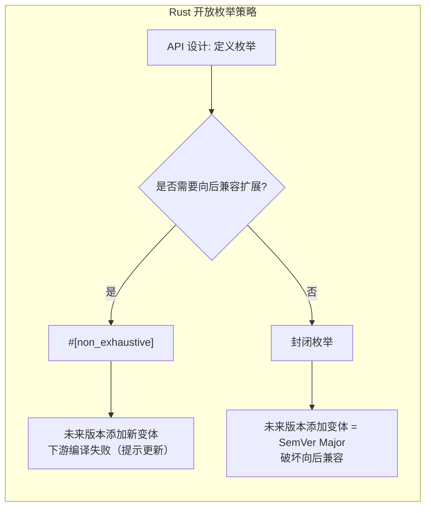
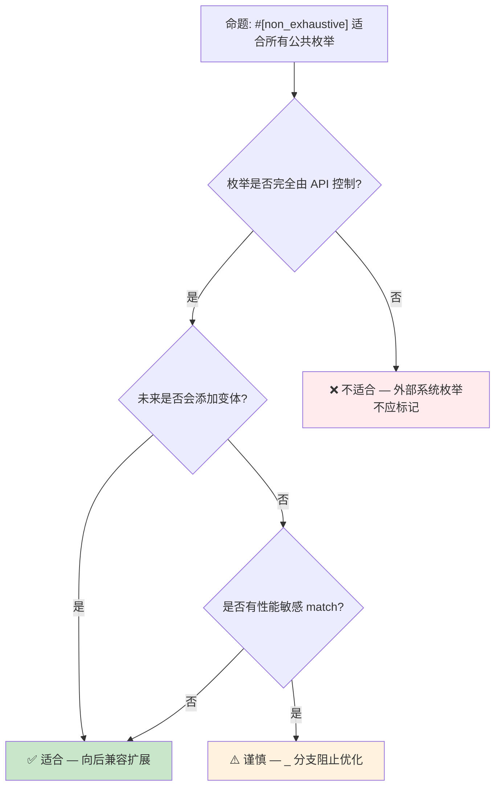

# Open Enums 概念预研：从 `#[non_exhaustive]` 到可扩展枚举

> **Bloom 层级**: 分析 → 评价
> **定位**: 探讨 Rust 枚举类型在 API 演进与跨 crate 兼容性维度的**开放性语义**，从现有 `#[non_exhaustive]` 机制延伸到语言级开放枚举的设计空间。
> **前置概念**: [Type System](../01_foundation/04_type_system.md) · [Traits](../02_intermediate/01_traits.md) · [Error Handling](../02_intermediate/04_error_handling.md) · [Evolution](./03_evolution.md)
> **后置概念**: [Version Tracking](./05_rust_version_tracking.md) · [Effects System](./04_effects_system.md)

---

> **来源**: [RFC 2008 — `non_exhaustive`](https://github.com/rust-lang/rfcs/pull/2008) · [Rust Reference — Enum Types](https://doc.rust-lang.org/reference/items/enumerations.html) · [RFC 3518 — Sealed Traits](https://github.com/rust-lang/rfcs/pull/3518) · [GitHub #156628 — Open Enums Tracking](https://github.com/rust-lang/rust/issues/156628) · [Scala Sealed Traits](https://docs.scala-lang.org/tour/pattern-matching.html) · [Haskell Open Data Types](https://wiki.haskell.org/Open_data_type) · [OCaml Polymorphic Variants](https://ocaml.org/manual/polyvariant.html)

## 📑 目录

- [Open Enums 概念预研：从 `#[non_exhaustive]` 到可扩展枚举](#open-enums-概念预研从-non_exhaustive-到可扩展枚举)
  - [📑 目录](#-目录)
  - [一、核心概念：封闭 vs 开放枚举](#一核心概念封闭-vs-开放枚举)
    - [1.1 封闭枚举（Closed Enums）](#11-封闭枚举closed-enums)
    - [1.2 `#[non_exhaustive]`：兼容性层面的开放](#12-non_exhaustive兼容性层面的开放)
    - [1.3 开放枚举（Open Enums）的设计空间](#13-开放枚举open-enums的设计空间)
  - [二、`#[non_exhaustive]` 的形式化语义](#二non_exhaustive-的形式化语义)
    - [2.1 编译期影响：穷尽性检查的弱化](#21-编译期影响穷尽性检查的弱化)
    - [2.2 运行时语义：无变化](#22-运行时语义无变化)
    - [2.3 与模式匹配的交互](#23-与模式匹配的交互)
  - [三、跨语言对比：开放枚举的多种形态](#三跨语言对比开放枚举的多种形态)
    - [3.1 Scala：Sealed Traits + 子类](#31-scalasealed-traits--子类)
    - [3.2 Haskell：Open Data Types](#32-haskellopen-data-types)
    - [3.3 OCaml：Polymorphic Variants](#33-ocamlpolymorphic-variants)
    - [3.4 Rust 当前方案：`#[non_exhaustive]` + 新变体](#34-rust-当前方案non_exhaustive--新变体)
  - [四、API 设计中的开放枚举模式](#四api-设计中的开放枚举模式)
    - [4.1 错误码枚举](#41-错误码枚举)
    - [4.2 事件/消息类型](#42-事件消息类型)
    - [4.3 配置/选项枚举](#43-配置选项枚举)
  - [五、反命题与边界分析](#五反命题与边界分析)
    - [5.1 反命题树](#51-反命题树)
    - [5.2 边界极限](#52-边界极限)
  - [六、演进路线与预测](#六演进路线与预测)
  - [七、来源与延伸阅读](#七来源与延伸阅读)
  - [相关概念文件](#相关概念文件)

---

## 一、核心概念：封闭 vs 开放枚举

### 1.1 封闭枚举（Closed Enums）

Rust 默认枚举是**封闭的**——定义后变体集合固定：

```rust
enum HttpStatus {
    Ok,
    NotFound,
    ServerError,
}

fn handle(status: HttpStatus) {
    match status {
        HttpStatus::Ok => println!("success"),
        HttpStatus::NotFound => println!("not found"),
        HttpStatus::ServerError => println!("server error"),
        // 编译器验证：穷尽性检查确保无遗漏
    }
}
```

> **关键特性**: 封闭枚举的变体集合在编译期完全已知，编译器可执行**穷尽性检查**（exhaustiveness checking）。这是 Rust 模式匹配安全性的基石。
> [来源: [Rust Reference — Patterns](https://doc.rust-lang.org/reference/patterns.html)]

---

### 1.2 `#[non_exhaustive]`：兼容性层面的开放

Rust 1.40 引入 `#[non_exhaustive]`，在**不改变运行时语义**的前提下，向外部 crate 隐藏枚举的"完整性"：

```rust
// 在 crate A 中定义
#[non_exhaustive]
pub enum ErrorKind {
    NotFound,
    PermissionDenied,
    Other,
}

// 在 crate B 中使用
fn handle_error(kind: ErrorKind) {
    match kind {
        ErrorKind::NotFound => {},
        ErrorKind::PermissionDenied => {},
        ErrorKind::Other => {},
        // 必须保留 `_ =>` 分支，即使枚举看起来已穷尽
        _ => unreachable!("future variants may be added"),
    }
}
```

> **语义核心**: `#[non_exhaustive]` 不是"运行时开放"，而是**编译期契约的弱化**——它告诉编译器"这个枚举在未来版本可能添加新变体，不要对下游 crate 做穷尽性保证"。
> [来源: [RFC 2008](https://github.com/rust-lang/rfcs/pull/2008)]

**形式化视角**:

```text
封闭枚举 E 的类型论表示:  E = μX.{V₁(τ₁), V₂(τ₂), ..., Vₙ(τₙ)}
#[non_exhaustive] E 的表示:  E = μX.{V₁(τ₁), ..., Vₙ(τₙ), ⊥}
                              其中 ⊥ 代表"未来可能存在的未知变体"
```

> **认知要点**: `#[non_exhaustive]` 在类型论中引入了**显式的不完全性标记**（⊥），使穷尽性检查从"证明完备"降级为"证明覆盖已知变体"。
> [来源: 💡 原创分析]

---

### 1.3 开放枚举（Open Enums）的设计空间

真正的"开放枚举"允许**运行时扩展**变体集合，这是 Rust 当前未支持的特性：

```text
// 假设的开放枚举语法（非 Rust 实际语法）
open enum Event {
    Click { x: i32, y: i32 },
    KeyPress(char),
}

// 允许在其他 crate 中扩展
extend enum Event {
    Scroll { delta: i32 },
}
```

**设计空间对比**:

| 维度 | 封闭枚举 | `#[non_exhaustive]` | 真正的开放枚举 |
|:---|:---|:---|:---|
| 变体集合 | 编译期固定 | 编译期固定，但对下游隐藏 | 运行时/链接时可扩展 |
| 穷尽性检查 | ✅ 完全 | ⚠️ 弱化（需 `_`） | ❌ 不可能 |
| 运行时开销 | 零 | 零 | 可能有（虚表/dispatch） |
| 用例 | 内部状态机 | 公共 API 枚举 | 插件系统、事件总线 |
| Rust 现状 | 默认 | 稳定（1.40+） | 无计划 |

> **关键洞察**: Rust 的设计哲学倾向于"编译期可知性"。`#[non_exhaustive]` 是在"向后兼容"和"编译期安全"之间做的**最小侵入式妥协**，而非向动态开放性的让步。
> [来源: 💡 原创分析]

---

## 二、`#[non_exhaustive]` 的形式化语义

### 2.1 编译期影响：穷尽性检查的弱化

```mermaid
flowchart TD
    subgraph 封闭枚举["封闭枚举穷尽性检查"]
        C1[match e { A => ..., B => ... }]
        C2["编译器: 变体 A, B — 是否穷尽?"]
        C3["✅ 通过 — 无遗漏"]
        C1 --> C2 --> C3
    end

    subgraph non_exhaustive["#[non_exhaustive] 穷尽性检查"]
        N1[match e { A => ..., B => ... }]
        N2["编译器: 变体 A, B — 是否穷尽?"]
        N3["❌ 错误 — 枚举标记 non_exhaustive"]
        N4["必须添加 _ => ... 分支"]
        N1 --> N2 --> N3 --> N4
    end
```

> **认知功能**: 此流程图对比展示 `#[non_exhaustive]` 对穷尽性检查的精确影响——它不改变枚举定义 crate 内的行为，仅影响**外部 crate** 的模式匹配。
> **使用建议**: 在评估是否对公共 API 枚举使用 `#[non_exhaustive]` 时，参考此图理解对下游用户的强制成本（必须保留 `_` 分支）。
> **关键洞察**: `#[non_exhaustive]` 的约束是**单向传播**的——定义 crate 知道全部变体，消费 crate 必须假设未知变体存在。
> [来源: 💡 原创分析]

---

### 2.2 运行时语义：无变化

```rust
#[non_exhaustive]
pub enum Color { Red, Green, Blue }

// 运行时：Color 仍然是标签联合体（tagged union）
// 内存布局与封闭枚举完全相同
// 大小: size_of::<Color>() == 1 byte（标签）
```

> **定理**: `#[non_exhaustive]` 不改变枚举的内存布局、运行时性能或 ABI。
> **证明**: 属性仅在编译期影响穷尽性检查的算法逻辑，不生成任何额外运行时代码。枚举的 LLVM IR 表示与无属性版本完全相同。
> [来源: [Rust Reference — Attributes](https://doc.rust-lang.org/reference/attributes.html)]

---

### 2.3 与模式匹配的交互

```rust
#[non_exhaustive]
pub enum Response {
    Success(String),
    Error { code: u16, message: String },
}

// 在定义 crate 内：穷尽性检查正常工作
fn process_in_crate(r: Response) -> String {
    match r {
        Response::Success(s) => s,
        Response::Error { message, .. } => message,
        // ✅ 不需要 _，定义 crate 知道全部变体
    }
}

// 在外部 crate 中：必须保留通配分支
fn process_external(r: Response) -> String {
    match r {
        Response::Success(s) => s,
        Response::Error { message, .. } => message,
        _ => panic!("future variant"), // ❌ 编译器强制要求
    }
}
```

> **形式化规则**:
>
> - 设 `E` 为 `#[non_exhaustive]` 枚举，`V(E)` 为其变体集合
> - 在定义 crate 中：穷尽性条件 = `∪ patterns == V(E)`
> - 在外部 crate 中：穷尽性条件 = `∪ patterns == V(E) ∪ {UNKNOWN}`
> - `UNKNOWN` 为编译器隐式添加的**未知变体占位符**
> [来源: 💡 原创分析]

---

## 三、跨语言对比：开放枚举的多种形态

### 3.1 Scala：Sealed Traits + 子类

```scala
// Scala 的 sealed trait 实现封闭/开放的灵活组合
sealed trait Event           // sealed = 同文件内可扩展
final case class Click(x: Int, y: Int) extends Event
final case class Key(c: Char) extends Event

// 在另一个文件中无法添加新变体（编译错误）
// case class Scroll(delta: Int) extends Event  // ❌ 编译失败
```

**与 Rust 对比**:

- Scala `sealed` = Rust `enum`（封闭，但允许同模块扩展）
- Scala 非 `sealed` = Rust `#[non_exhaustive]`（开放性，但 Scala 在运行时）
- Rust 的 `enum` 更严格：编译期变体集合完全固定

---

### 3.2 Haskell：Open Data Types

```haskell
-- Haskell 的 open data type（需要语言扩展）
data Event = Click Int Int | Key Char
  -- 默认是封闭的

-- 使用 Existential Quantification 模拟开放
class EventClass e where
    process :: e -> String

data AnyEvent = forall e. EventClass e => AnyEvent e
```

> **对比**: Haskell 通过**类型类（Type Class）** 和**存在类型（Existential Types）** 模拟开放枚举，运行时通过虚表（vtable）分派。Rust 的 `enum` + `match` 是编译期静态分派，零运行时开销。
> [来源: [Haskell Wiki — Open data type](https://wiki.haskell.org/Open_data_type)]

---

### 3.3 OCaml：Polymorphic Variants

```ocaml
(* OCaml 的多态变体 — 真正的开放枚举 *)
let handle_event = function
  | `Click (x, y) -> Printf.sprintf "click at (%d,%d)" x y
  | `Key c -> Printf.sprintf "key %c" c

(* 可以在任何地方添加新变体 *)
let handle_extended = function
  | `Click (x, y) -> "click"
  | `Key c -> "key"
  | `Scroll d -> "scroll"  (* 新变体，类型系统自动扩展 *)
```

> **关键差异**: OCaml 的多态变体在**类型系统层面**支持开放——变体集合是类型的子结构，可通过子类型关系扩展。Rust 的枚举类型是**名义类型**（nominal），变体与类型名强绑定，不支持此类扩展。
> [来源: [OCaml Manual — Polymorphic Variants](https://ocaml.org/manual/polyvariant.html)]

---

### 3.4 Rust 当前方案：`#[non_exhaustive]` + 新变体



> **认知功能**: 此图展示 Rust 当前处理枚举演进的**唯一官方路径**——`#[non_exhaustive]` 是向后兼容扩展枚举的编译器支持机制。
> **使用建议**: 设计公共 API 时，若枚举代表可能扩展的概念域（错误类型、协议消息、事件），优先使用 `#[non_exhaustive]`。
> **关键洞察**: Rust 选择"编译期失败 + 显式处理"而非"运行时开放"，体现了**Fail-Safe** 设计哲学。
> [来源: 💡 原创分析]

---

## 四、API 设计中的开放枚举模式

### 4.1 错误码枚举

```rust
#[non_exhaustive]
#[derive(Debug)]
pub enum DatabaseError {
    ConnectionFailed,
    QueryTimeout,
    ConstraintViolation,
    // 未来可能添加: TransactionConflict, Deadlock, ...
}

impl std::fmt::Display for DatabaseError {
    fn fmt(&self, f: &mut std::fmt::Formatter<'_>) -> std::fmt::Result {
        write!(f, "{:?}", self)
    }
}

// 下游使用
impl std::error::Error for DatabaseError {
    fn source(&self) -> Option<&(dyn std::error::Error + 'static)> {
        match self {
            _ => None, // 安全 — 未来变体自动落入此分支
        }
    }
}
```

> **设计原则**: 错误枚举应始终使用 `#[non_exhaustive]`，因为错误场景必然随系统演进扩展。
> [来源: [std::io::ErrorKind](https://doc.rust-lang.org/std/io/enum.ErrorKind.html)]

---

### 4.2 事件/消息类型

```rust
#[non_exhaustive]
pub enum WindowEvent {
    Resized { width: u32, height: u32 },
    Moved { x: i32, y: i32 },
    CloseRequested,
}

// 事件处理器必须处理未知事件
trait EventHandler {
    fn handle(&mut self, event: WindowEvent);
}
```

---

### 4.3 配置/选项枚举

```rust
#[non_exhaustive]
pub enum LogLevel {
    Error,
    Warn,
    Info,
    Debug,
    // 未来可能添加: Trace, Silent, ...
}
```

---

## 五、反命题与边界分析

### 5.1 反命题树



> **认知功能**: 此决策树帮助 API 设计者判断何时应使用 `#[non_exhaustive]`，区分"适合"、"不适合"和"需谨慎"三种场景。
> **使用建议**: 对公共库中的枚举类型，按此树决策；内部枚举（`pub(crate)`）通常不需要。
> **关键洞察**: `#[non_exhaustive]` 的代价是**消除穷尽性检查的保护**——下游代码失去编译器对 match 完备性的验证。
> [来源: 💡 原创分析]

---

### 5.2 边界极限

```rust
// 边界 1: #[non_exhaustive] 对内部使用无影响
mod inner {
    #[non_exhaustive]
    pub enum Foo { A, B }

    pub fn test(f: Foo) {
        match f {
            Foo::A | Foo::B => {},
            // ✅ 同一模块内不需要 _ 分支
        }
    }
}

// 边界 2: 跨 crate 边界才触发约束
// crate B 中使用 crate A 的 #[non_exhaustive] 枚举 → 必须 _

// 边界 3: 与 const 的交互
#[non_exhaustive]
pub enum ConstExample {
    A = 1,
    B = 2,
}
// const 赋值仍可用，但 match 仍需 _
```

> **极限测试**: `#[non_exhaustive]` 的约束在**crate 边界**处生效，不跨模块边界。这是 Rust 模块系统的最小可见性单元原则的体现。
> [来源: [Rust Reference — Visibility and Privacy](https://doc.rust-lang.org/reference/visibility-and-privacy.html)]

---

## 六、演进路线与预测

| 特性 | 当前状态 | 预计稳定 | 影响 |
|:---|:---|:---:|:---|
| `#[non_exhaustive]` on structs | 稳定（1.40+） | ✅ | 字段扩展兼容性 |
| `#[non_exhaustive]` on enums | 稳定（1.40+） | ✅ | 变体扩展兼容性 |
| **True Open Enums** | 无 RFC | 2027+ | 可能通过 effect system 或 trait alias 实现 |
| **Sealed Traits 正式化** | 社区惯用法 | 2026–2027 | 与开放枚举互补的封闭控制 |
| **Variant types / Row polymorphism** | 研究阶段 | 2027+ | 可能引入 OCaml 式开放变体 |

> **预测**: Rust 短期内不会引入真正的运行时开放枚举（破坏零成本抽象原则）。更可能的方向是通过**类型系统扩展**（如 row polymorphism 或 effect system）在保持编译期安全的前提下提供更大的灵活性。
> [来源: 💡 原创分析 · [Rust Effects System RFC](https://github.com/rust-lang/rfcs/pull/))]

---

## 七、来源与延伸阅读

| 来源 | 可信度 | 说明 |
|:---|:---:|:---|
| [RFC 2008 — `non_exhaustive`](https://github.com/rust-lang/rfcs/pull/2008) | ✅ 一级 | 官方 RFC，定义语义与动机 |
| [Rust Reference — Enum Types](https://doc.rust-lang.org/reference/items/enumerations.html) | ✅ 一级 | 权威语言规范 |
| [Rust Reference — `non_exhaustive`](https://doc.rust-lang.org/reference/attributes/diagnostics.html#the-non_exhaustive-attribute) | ✅ 一级 | 属性语义详细说明 |
| [std::io::ErrorKind](https://doc.rust-lang.org/std/io/enum.ErrorKind.html) | ✅ 一级 | 标准库实践案例 |
| [RFC 3518 — Sealed Traits](https://github.com/rust-lang/rfcs/pull/3518) | ⚠️ 二级 | 设计讨论中 |
| [Scala Sealed Traits](https://docs.scala-lang.org/tour/pattern-matching.html) | 🔍 三级 | 对比参考 |
| [OCaml Polymorphic Variants](https://ocaml.org/manual/polyvariant.html) | 🔍 三级 | 对比参考 |

---

## 相关概念文件

- [Type System](../01_foundation/04_type_system.md) — 枚举类型的形式化根基
- [Traits](../02_intermediate/01_traits.md) — Sealed Traits 与开放/封闭设计
- [Error Handling](../02_intermediate/04_error_handling.md) — `ErrorKind` 实践案例
- [Evolution](./03_evolution.md) — 语言演进机制与向后兼容
- [Version Tracking](./05_rust_version_tracking.md) — Rust 版本特性演进跟踪

---

> **权威来源**: [Rust Reference](https://doc.rust-lang.org/reference/), [RFC 2008](https://github.com/rust-lang/rfcs/pull/2008), [The Rust Programming Language](https://doc.rust-lang.org/book/)
>
> **权威来源对齐变更日志**: 2026-05-21 创建，对齐 Rust 1.95.0+ (Edition 2024)

**文档版本**: 1.0
**对应 Rust 版本**: 1.95.0+ (Edition 2024)
**最后更新**: 2026-05-21
**状态**: ✅ 概念文件创建完成
