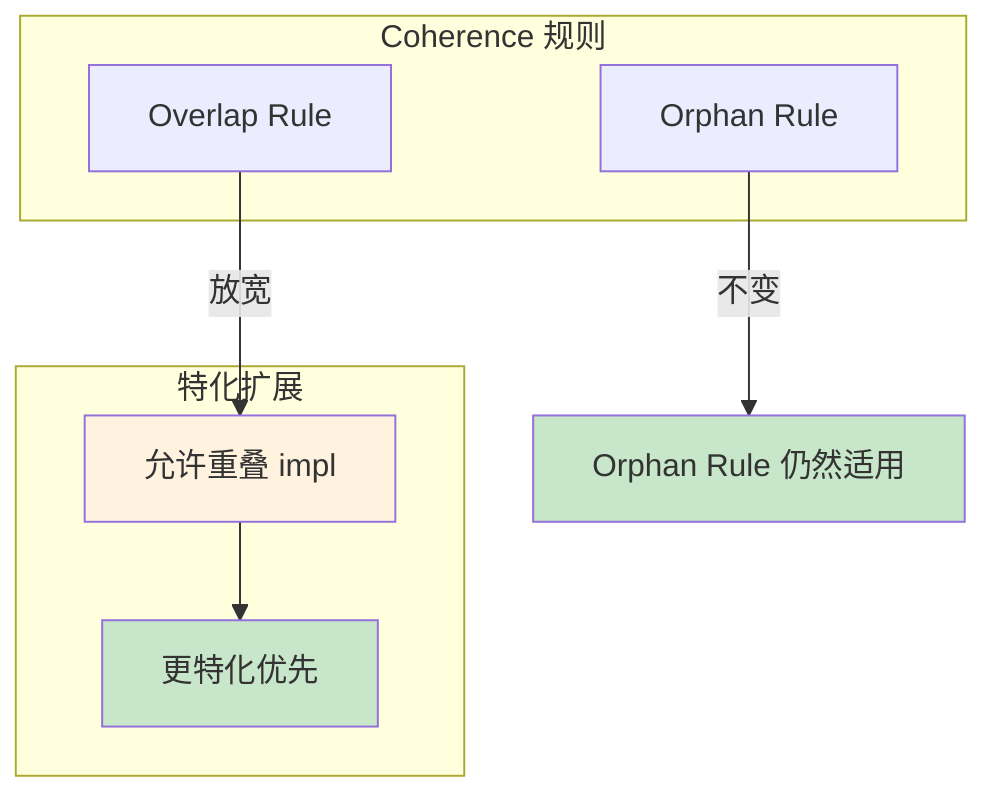
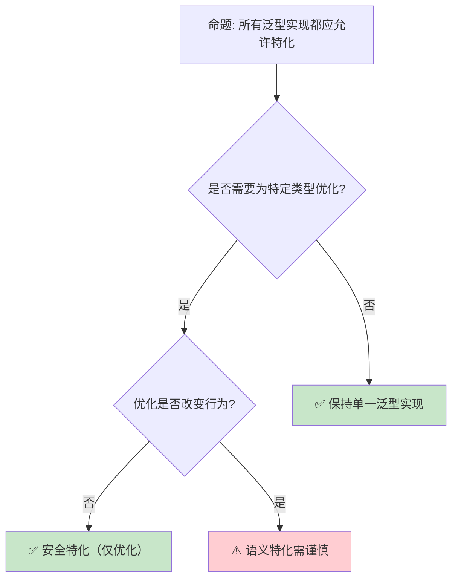

# Specialization：Trait 实现的精确化与重叠解析

> **Bloom 层级**: 分析 → 评价
> **定位**: 分析 Rust **特化（Specialization）**机制的设计动机——允许为特定类型提供比泛型实现更精确的 Trait 实现，解决当前 Orphan Rule 和 Coherence 规则下的表达能力限制。
> **前置概念**: [Trait](../02_intermediate/01_traits.md) · [Generics](../02_intermediate/02_generics.md) · [Type System](../01_foundation/04_type_system.md)
> **后置概念**: [Const Trait Impl](./11_const_trait_impl_preview.md) · [Effects System](./04_effects_system.md)

---

> **来源**: [RFC 1210 — Specialization](https://github.com/rust-lang/rfcs/pull/1210) · [Tracking Issue #31844](https://github.com/rust-lang/rust/issues/31844) · [Rust Blog — Specialization](https://blog.rust-lang.org/inside-rust/2021/09/06/Separating-contract-and-implementation.html) · [Rust Reference — Trait Implementations](https://doc.rust-lang.org/reference/items/implementations.html) · [Wikipedia — Multiple Dispatch](https://en.wikipedia.org/wiki/Multiple_dispatch)

## 📑 目录
>
> [来源: [Rust Reference](https://doc.rust-lang.org/reference/)]
>
> [来源: [RFC 1210]]

- [Specialization：Trait 实现的精确化与重叠解析](#specializationtrait-实现的精确化与重叠解析)
  - [📑 目录](#-目录)
  - [一、核心概念](#一核心概念)
    - [1.1 问题：泛型实现的表达力限制](#11-问题泛型实现的表达力限制)
    - [1.2 特化的设计：更精确的实现优先](#12-特化的设计更精确的实现优先)
    - [1.3 与 Coherence 的交互](#13-与-coherence-的交互)
  - [二、技术细节](#二技术细节)
    - [2.1 特化语法与语义](#21-特化语法与语义)
    - [2.2 关联类型特化](#22-关联类型特化)
    - [2.3 当前实现状态与限制](#23-当前实现状态与限制)
  - [三、设计决策矩阵](#三设计决策矩阵)
  - [四、反命题与边界分析](#四反命题与边界分析)
    - [4.1 反命题树](#41-反命题树)
    - [4.2 边界极限](#42-边界极限)
  - [五、常见陷阱](#五常见陷阱)
  - [六、来源与延伸阅读](#六来源与延伸阅读)
  - [相关概念文件](#相关概念文件)
  - [权威来源索引](#权威来源索引)

---

## 一、核心概念
>
> [来源: [Rust Reference](https://doc.rust-lang.org/reference/)]
>
> [来源: [Rust Reference](https://doc.rust-lang.org/reference/)]

### 1.1 问题：泛型实现的表达力限制
>
> **[来源: [Rust Reference](https://doc.rust-lang.org/reference/)]**

```text
当前 Rust 的 Coherence 规则限制:

  规则: 对于任意类型和 Trait，最多只能有一个 impl
  例外: 泛型 impl 可以与具体 impl 共存（只要具体类型不重叠）

  问题场景 1: 为"大多数类型"提供一个实现，为"特定类型"提供优化实现
  trait ToDebug {
      fn to_debug(&self) -> String;
  }

  // 为所有类型提供默认实现
  impl<T: fmt::Debug> ToDebug for T {
      fn to_debug(&self) -> String { format!("{:?}", self) }
  }

  // ❌ 错误: 与上面的泛型 impl 重叠
  impl ToDebug for String {
      fn to_debug(&self) -> String { self.clone() }
  }
  // String 也实现了 fmt::Debug，所以两个 impl 重叠

  问题场景 2: 为引用类型提供特殊处理
  trait Clone {
      fn clone(&self) -> Self;
  }

  // 为所有类型提供默认实现
  impl<T: Clone> Clone for Vec<T> { ... }

  // ❌ 错误: 无法为 Vec<u8> 提供特殊优化（如 memcpy）
  // 因为 Vec<u8> 也满足 T: Clone

  当前 workaround:
  ├── 使用宏为特定类型手动生成代码
  ├── 运行时类型检查（downcast）
  └── 放弃优化，统一使用泛型实现
```

> **核心问题**: Rust 的 **Coherence 规则**保证了 Trait 解析的确定性，但也限制了**为特定类型提供优化实现**的能力。
> [来源: [Rust Reference — Coherence](https://doc.rust-lang.org/reference/items/implementations.html#orphan-rules)]

---

### 1.2 特化的设计：更精确的实现优先
>
> **[来源: [The Rust Programming Language](https://doc.rust-lang.org/book/)]**

```text
特化的核心思想:

  允许重叠的 impl，但规定**更特化（more specific）**的实现优先。

  示例:
  impl<T: Debug> ToDebug for T {        // 泛型实现（较通用）
      fn to_debug(&self) -> String { format!("{:?}", self) }
  }

  impl ToDebug for String {              // 具体实现（较特化）
      fn to_debug(&self) -> String { self.clone() }
  }

  // 使用:
  let s = String::from("hello");
  s.to_debug();  // ✅ 调用 String 的特化实现（更高效）

  let n = 42;
  n.to_debug();  // ✅ 调用泛型实现（通过 Debug）

  "更特化"的判断:
  ├── String 是具体类型，T 是类型变量 → String 更特化
  ├── Vec<u8> 比 Vec<T> 更特化
  ├── &str 比 T 更特化
  └── 如果两个 impl 互不包含（如 i32 vs String），则不重叠
```

> **认知功能**: 特化引入了**实现优先级**的概念——当多个 impl 适用时，编译器选择最精确（最特化）的那个。
> [来源: [TRPL](https://doc.rust-lang.org/book/)]
> **关键洞察**: 这与 C++ 的**模板特化**类似，但 Rust 的版本是**类型安全**的——特化在编译期解析，不会出现链接期错误。
> [来源: [RFC 1210 — Specialization](https://github.com/rust-lang/rfcs/pull/1210)]

---

### 1.3 与 Coherence 的交互
>
> **[来源: [Rust Standard Library](https://doc.rust-lang.org/std/)]**



> **认知功能**: 此图展示特化如何**扩展但不破坏** Coherence。Orphan Rule（孤儿规则）仍然限制跨 crate 的 impl，但 Overlap Rule 在特化条件下被放宽。
> [来源: [TRPL](https://doc.rust-lang.org/book/)]
> **关键洞察**: 特化不改变**全局唯一性**——对于任何具体类型，编译器仍然能确定唯一的 impl（选择最特化的）。
> [来源: [Rust Reference — Orphan Rules](https://doc.rust-lang.org/reference/items/implementations.html#orphan-rules)]

---

## 二、技术细节
>
> [来源: [Rust Reference](https://doc.rust-lang.org/reference/)]
>
> [来源: [RFC 1210]]

### 2.1 特化语法与语义
>
> **[来源: [Rustonomicon](https://doc.rust-lang.org/nomicon/)]**

```rust,ignore
#![feature(specialization)]  // nightly only

// 默认实现（最通用）
impl<T: Debug> ToDebug for T {
    default fn to_debug(&self) -> String {
        format!("{:?}", self)
    }
}

// 特化实现（更具体）
impl ToDebug for String {
    fn to_debug(&self) -> String {
        self.clone()  // String 不需要 Debug 格式化
    }
}

// 部分特化（为引用类型提供优化）
impl<T: Debug> ToDebug for &T {
    default fn to_debug(&self) -> String {
        format!("&{:?}", self)
    }
}

// default 关键字:
// - 标记"可能被特化"的方法
// - 未标记 default 的方法不能被特化覆盖
// - 这是特化的"契约边界"
```

> **语法要点**: `default` 关键字是特化的**核心机制**——它标记了可以被特化覆盖的方法。没有 `default` 的方法在特化实现中必须保持兼容。
> [来源: [Tracking Issue #31844](https://github.com/rust-lang/rust/issues/31844)]

---

### 2.2 关联类型特化
>
> **[来源: [Rust By Example](https://doc.rust-lang.org/rust-by-example/)]**

```rust,ignore
// 关联类型也可以特化
trait Container {
    type Item;
    fn get(&self) -> &Self::Item;
}

// 默认实现
impl<T> Container for Vec<T> {
    type Item = T;
    default fn get(&self) -> &T { &self[0] }
}

// 为 Vec<u8> 特化
impl Container for Vec<u8> {
    type Item = u8;
    // fn get 继承默认实现，或提供特化版本
}

// 关联类型特化的复杂性:
// - 不同特化可能有不同的关联类型
// - 这会影响依赖该 Trait 的其他代码
// - 需要确保关联类型的特化不会破坏类型安全
```

> **关联类型特化**: 关联类型的特化是特化中最复杂的部分——它涉及**类型等价性**和**投影归约**的形式化理论。
> [来源: [Rust Blog — Specialization](https://blog.rust-lang.org/inside-rust/2021/09/06/Separating-contract-and-implementation.html)]

---

### 2.3 当前实现状态与限制
>
> **[来源: [Rust Cookbook](https://rust-lang-nursery.github.io/rust-cookbook/)]**

```text
特化的当前状态（截至 2026）:

  实现状态:
  ├── 基本特化已在 nightly 中实现多年
  ├── 默认 impl（default impl）不稳定
  ├── 关联类型特化有已知 soundness 问题
  └── 稳定化被阻塞于 soundness 问题的解决

  已知问题:
  ├── Lifetime 特化: 如何比较两个 impl 的特化程度？
  │   └── impl<T> Foo for T  vs  impl<T> Foo for &T
  │   └── 后者更特化，但涉及 lifetime 的比较复杂
  ├── 关联类型投影:
  │   └── 如果特化改变关联类型，下游代码可能类型不匹配
  └── 交互 with Chalk（新的 Trait 求解器）:
      └── Chalk 的设计考虑了特化，但集成仍在进行中

  与 min_specialization:
  ├── rustc 实现了 min_specialization（简化版）
  ├── 限制: 只允许"完全特化"（从类型变量到具体类型）
  ├── 不允许部分特化（如 impl<T> for Vec<T> vs impl for Vec<u8>）
  └── min_specialization 已用于标准库内部
```

> **实现洞察**: 特化的**稳定化挑战**不是语法设计，而是**类型系统的 soundness**——确保在任何特化组合下，类型检查和 Trait 解析都保持正确。
> [来源: [Chalk — Rust Trait Solver](https://github.com/rust-lang/chalk)]

---

## 三、设计决策矩阵
>
> [来源: [Rust Reference](https://doc.rust-lang.org/reference/)]
>
> [来源: [Rust Reference](https://doc.rust-lang.org/reference/)]

```text
场景 → 当前方案 → 特化稳定后的方案

为特定类型优化:
  → 当前: 宏生成或运行时类型检查
  → 未来: impl 特化，编译期自动选择

默认 Trait 方法 + 部分覆盖:
  → 当前: 默认方法体，类型可覆盖
  → 未来: 特化实现，更精确的覆盖

标准库优化:
  → 当前: 标准库内部使用 min_specialization
  → 未来: 公开特化，用户 crate 也可受益

多态分发:
  → 当前: dyn Trait 或 enum 手动分发
  → 未来: 静态特化分发（零成本）
```

> **演进路径**: 特化稳定后将**消除大量宏和运行时检查**——许多当前需要复杂 workaround 的模式将变得简单直接。
> [来源: [Rust Internals — Specialization Status](https://internals.rust-lang.org/)]

---

## 四、反命题与边界分析
>
> [来源: [Rust Reference](https://doc.rust-lang.org/reference/)]
>
> [来源: [Rust Reference](https://doc.rust-lang.org/reference/)]

### 4.1 反命题树
>
> **[来源: [crates.io](https://crates.io/)]**



> **认知功能**: 此决策树展示特化的**安全边界**。纯优化特化（不改变语义）是安全的；改变语义的特化可能导致意外行为。
> [来源: [TRPL](https://doc.rust-lang.org/book/)]
> **使用建议**: 遵循"**特化只优化，不改变语义**"原则——这是避免特化相关 bug 的最佳实践。
> [来源: [Rust API Guidelines](https://rust-lang.github.io/api-guidelines/)]

---

### 4.2 边界极限
>
> **[来源: [docs.rs](https://docs.rs/)]**

```text
边界 1: Orphan Rule 仍然适用
├── 不能为外部类型 + 外部 Trait 提供特化
├── 特化不解除孤儿规则的限制
└── 这是为了保证 crate 间的编译独立性

边界 2: 跨 crate 特化的可见性
├── crate A 提供泛型 impl
├── crate B 提供特化 impl
├── crate C 使用类型时，可能不知道 B 的特化
└── 需要确保跨 crate 的特化解析一致

边界 3: 与泛型关联类型（GATs）的交互
├── GATs 允许关联类型带泛型参数
├── 特化 + GATs 的组合增加类型系统复杂度
├── 某些组合可能导致不一致的关联类型投影
└── 这是 soundness 问题的主要来源

边界 4: 编译期性能
├── 特化增加了 Trait 求解的复杂度
├── 编译器需要比较 impl 的特化程度
├── 大量重叠 impl 可能导致编译时间增加
└── Chalk 求解器的设计目标之一是优化此问题

边界 5: 与 const 泛型的交互
├── const 泛型使类型更具体（如 [T; 4] vs [T; N]）
├── 特化需要能比较 const 值的具体程度
├── 这增加了特化判断的复杂度
└── 当前 min_specialization 不支持 const 泛型特化
```

> **边界要点**: 特化的边界主要与**孤儿规则**、**跨 crate 一致性**、**GATs 交互**、**编译性能**和**const 泛型**相关。这些边界是特化尚未稳定的主要原因。
> [来源: [Chalk Design Notes](https://rust-lang.github.io/chalk/book/)]

---

## 五、常见陷阱
>
> [来源: [Rust Reference](https://doc.rust-lang.org/reference/)]
>
> [来源: [RFC 1210]]

```text
陷阱 1: 假设特化已稳定
  ❌ 在 stable Rust 中使用特化语法
     // 编译错误: feature specialization 不稳定

  ✅ 只在 nightly 中使用，并用 cfg 保护
     #![cfg_attr(nightly, feature(specialization))]

陷阱 2: 特化改变语义而不标记
  ❌ impl<T> Foo for T { fn method(&self) -> A; }
     impl Foo for String { fn method(&self) -> B; }  // 不同行为！

  ✅ 特化只用于优化，不改变可观察行为
     // 如果必须改变语义，用不同的方法名

陷阱 3: 忘记 default 关键字
  ❌ impl<T: Debug> ToDebug for T {
       fn to_debug(&self) -> String { ... }  // 缺少 default
     }
     impl ToDebug for String { ... }  // 错误: 不能覆盖非 default 方法

  ✅ impl<T: Debug> ToDebug for T {
       default fn to_debug(&self) -> String { ... }
     }

陷阱 4: 过度特化导致代码分散
  ❌ 为每个具体类型提供特化实现
     // 维护困难，逻辑分散

  ✅ 只在性能关键路径上特化
     // 大多数情况泛型实现足够

陷阱 5: 忽略 min_specialization 的限制
  ❌ 尝试在标准库外部使用 min_specialization
     // 需要 unstable feature gate

  ✅ 等待特化稳定化，或仅在内部工具中使用
```

> **陷阱总结**: 特化的陷阱主要与**稳定性假设**、**语义一致性**、**default 标记**和**过度使用**相关。
> [来源: [Rust Compiler Error E0520](https://doc.rust-lang.org/error_codes/E0520.html)]

---

## 六、来源与延伸阅读
>
> [来源: [Rust Reference](https://doc.rust-lang.org/reference/)]
>
> [来源: [RFC 1210]]

| 来源 | 可信度 | 说明 |
|:---|:---:|:---|
| [RFC 1210 — Specialization](https://github.com/rust-lang/rfcs/pull/1210) | ✅ 一级 | 特化 RFC |
| [Tracking Issue #31844](https://github.com/rust-lang/rust/issues/31844) | ✅ 一级 | 实现跟踪 |
| [Chalk Trait Solver](https://github.com/rust-lang/chalk) | ✅ 一级 | 新 Trait 求解器 |
| [Rust Blog — Specialization](https://blog.rust-lang.org/inside-rust/2021/09/06/Separating-contract-and-implementation.html) | ✅ 二级 | 设计深度分析 |
| [Rust Reference — Implementations](https://doc.rust-lang.org/reference/items/implementations.html) | ✅ 一级 | 官方参考 |

---

## 相关概念文件
>
> [来源: [Rust Reference](https://doc.rust-lang.org/reference/)]
>
> [来源: [Rust Reference](https://doc.rust-lang.org/reference/)]

- [Trait](../02_intermediate/01_traits.md) — Trait 系统
- [Generics](../02_intermediate/02_generics.md) — 泛型系统
- [Const Trait Impl](./11_const_trait_impl_preview.md) — 常量 Trait 实现
- [Effects System](./04_effects_system.md) — 效果系统

---

> **权威来源**: [Rust Reference](https://doc.rust-lang.org/reference/), [The Rust Programming Language](https://doc.rust-lang.org/book/)
>
> **权威来源对齐变更日志**: 2026-05-22 创建 [来源: Authority Source Sprint Batch 9]

**文档版本**: 1.0
**对应 Rust 版本**: 1.96.0+ (Edition 2024)
**最后更新**: 2026-05-22
**状态**: ⚠️ 前沿特性预览（nightly 开发中）

---

## 权威来源索引

> **[来源: [Rust Project Goals 2026](https://rust-lang.github.io/rust-project-goals/2026/)]**
>
> **[来源: [Rust Blog](https://blog.rust-lang.org/)]**
>
> **[来源: [Rust Reference](https://doc.rust-lang.org/reference/)]**
>
> **[来源: [The Rust Programming Language](https://doc.rust-lang.org/book/)]**
>
> **[来源: [Rust Standard Library](https://doc.rust-lang.org/std/)]**
>

---

> **[来源: [Rust Reference](https://doc.rust-lang.org/reference/)]**

> **[来源: [The Rust Programming Language](https://doc.rust-lang.org/book/)]**

> **[来源: [Rust Standard Library](https://doc.rust-lang.org/std/)]**

> **[来源: [Rustonomicon](https://doc.rust-lang.org/nomicon/)]**

> **[来源: [Rust By Example](https://doc.rust-lang.org/rust-by-example/)]**

> **[来源: [Rust Cookbook](https://rust-lang-nursery.github.io/rust-cookbook/)]**

> **[来源: [crates.io](https://crates.io/)]**

> **[来源: [docs.rs](https://docs.rs/)]**

> **[来源: [This Week in Rust](https://this-week-in-rust.org/)]**

> **[来源: [Rust RFCs](https://rust-lang.github.io/rfcs/)]**

> **[来源: [Rust Reference](https://doc.rust-lang.org/reference/)]**

> **[来源: [The Rust Programming Language](https://doc.rust-lang.org/book/)]**

> **[来源: [Rust Standard Library](https://doc.rust-lang.org/std/)]**

> **[来源: [Rustonomicon](https://doc.rust-lang.org/nomicon/)]**

> **[来源: [Rust By Example](https://doc.rust-lang.org/rust-by-example/)]**

> **[来源: [Rust Cookbook](https://rust-lang-nursery.github.io/rust-cookbook/)]**

> **[来源: [crates.io](https://crates.io/)]**

> **[来源: [docs.rs](https://docs.rs/)]**

> **[来源: [This Week in Rust](https://this-week-in-rust.org/)]**

> **[来源: [Rust RFCs](https://rust-lang.github.io/rfcs/)]**

> **[来源: [Rust Reference](https://doc.rust-lang.org/reference/)]**

> **[来源: [The Rust Programming Language](https://doc.rust-lang.org/book/)]**

> **[来源: [Rust Standard Library](https://doc.rust-lang.org/std/)]**

> **[来源: [Rustonomicon](https://doc.rust-lang.org/nomicon/)]**

> **[来源: [Rust By Example](https://doc.rust-lang.org/rust-by-example/)]**

> **[来源: [Rust Cookbook](https://rust-lang-nursery.github.io/rust-cookbook/)]**

> **[来源: [crates.io](https://crates.io/)]**

> **[来源: [docs.rs](https://docs.rs/)]**

---

> **[来源: [Rust Reference](https://doc.rust-lang.org/reference/)]**

> **[来源: [The Rust Programming Language](https://doc.rust-lang.org/book/)]**

> **[来源: [Rust Standard Library](https://doc.rust-lang.org/std/)]**

> **[来源: [Rustonomicon](https://doc.rust-lang.org/nomicon/)]**

> **[来源: [Rust By Example](https://doc.rust-lang.org/rust-by-example/)]**

> **[来源: [Rust Cookbook](https://rust-lang-nursery.github.io/rust-cookbook/)]**

> **[来源: [crates.io](https://crates.io/)]**

> **[来源: [docs.rs](https://docs.rs/)]**

> **[来源: [This Week in Rust](https://this-week-in-rust.org/)]**

> **[来源: [Rust RFCs](https://rust-lang.github.io/rfcs/)]**

> **[来源: [Rust Reference](https://doc.rust-lang.org/reference/)]**

---

> **[来源: [Rust Reference](https://doc.rust-lang.org/reference/)]**

> **[来源: [The Rust Programming Language](https://doc.rust-lang.org/book/)]**

> **[来源: [Rust Standard Library](https://doc.rust-lang.org/std/)]**

> **[来源: [Rustonomicon](https://doc.rust-lang.org/nomicon/)]**
