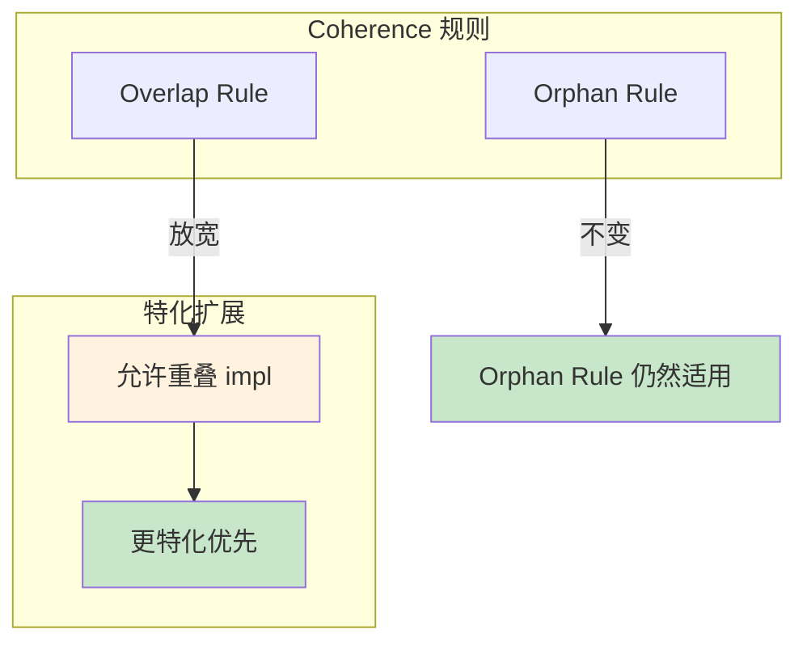
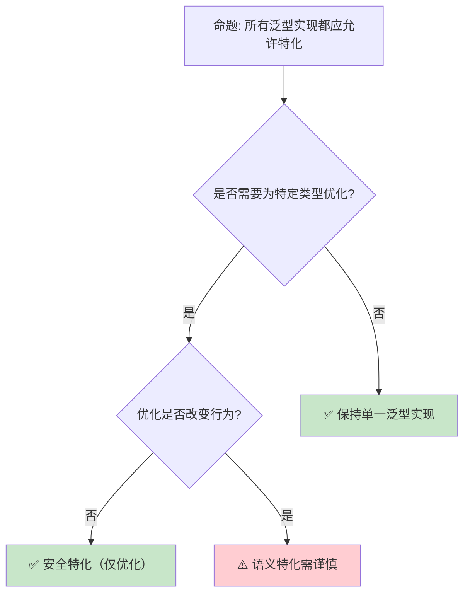

# Specialization：Trait 实现的精确化与重叠解析

> **代码状态**: [综述级 — 待补充代码]
>
> **EN**: Specialization Preview
> **Summary**: Preview of trait specialization: allowing overlapping impls with a default/fallback.
> **状态**: 🧪 Nightly 实验性
> **Rust 属性标记**: `#[experimental]` `#[nightly_only]`
> **跟踪版本**: nightly 1.98.0 (2026-05-31)
> **预计稳定**: 待定（需等待 RFC / MCP 完成）
>
> **受众**: [专家]
> **内容分级**: [实验级]
> **Bloom 层级**: 分析 → 评价
> **A/S/P 标记**: **S** — Structure
> **双维定位**: C×Ana — 分析 Specialization 预览特性
> **定位**: 分析 Rust **特化（Specialization）**机制的设计动机——允许为特定类型提供比泛型（Generics）实现更精确的 Trait 实现，解决当前 Orphan Rule 和 Coherence 规则下的表达能力限制。
> **前置概念**:
>
> [Trait](../02_intermediate/01_traits.md) ·
> [Generics](../02_intermediate/02_generics.md) ·
> [Type System](../01_foundation/04_type_system.md)
> **后置概念**:
>
> [Const Trait Impl](11_const_trait_impl_preview.md) ·
> [Effects System](04_effects_system.md)
> **定理链**: N/A — 描述性/综述性/导航性文档，不涉及形式化定理链
---

> ⚠️ **不稳定特性警告**: 本文件包含 `#![feature(...)]` 标注的代码示例，需要 **nightly 工具链** 编译。
>
> **使用方式**: `rustup run nightly rustc ...` 或 `cargo +nightly ...`
> **状态查询**: <https://doc.rust-lang.org/nightly/unstable-book/index.html>
> **注意**: 不稳定特性可能在后续版本中变更或移除，生产代码应避免依赖。

---
> **来源**: · [Brown University — Interactive Rust Book](https://rust-book.cs.brown.edu/) · [Jung et al. — RustBelt: Securing the Foundations of Rust](https://plv.mpi-sws.org/rustbelt/popl18/) · [Itanium C++ ABI](https://itanium-cxx-abi.github.io/cxx-abi/abi.html)
> [RFC 1210 — Specialization](https://github.com/rust-lang/rfcs/pull/1210) ·
> [Tracking Issue #31844](https://github.com/rust-lang/rust/issues/31844) ·
> [Rust Blog — Specialization](https://blog.rust-lang.org/inside-rust/) ·
> [Rust Reference — Trait Implementations](https://doc.rust-lang.org/reference/items/implementations.html) ·
> [Wikipedia — Multiple Dispatch](https://en.wikipedia.org/wiki/Multiple_dispatch)
> **前置依赖**: [Rust vs C++](../05_comparative/01_rust_vs_cpp.md)
> **前置依赖**: [Toolchain](../06_ecosystem/01_toolchain.md)

## 📑 目录

- [Specialization：Trait 实现的精确化与重叠解析](#specializationtrait-实现的精确化与重叠解析)
  - [📑 目录](#-目录)
  - [一、核心概念](#一核心概念)
    - [1.1 问题：泛型实现的表达力限制](#11-问题泛型实现的表达力限制)
    - [1.2 特化的设计：更精确的实现优先](#12-特化的设计更精确的实现优先)
    - [1.3 与 Coherence 的交互](#13-与-coherence-的交互)
  - [二、技术细节](#二技术细节)
    - [2.1 特化语法与语义](#21-特化语法与语义)
    - [2.2 关联类型特化](#22-关联类型特化)
    - [2.3 当前实现状态与限制](#23-当前实现状态与限制)
  - [三、设计决策矩阵](#三设计决策矩阵)
  - [四、反命题与边界分析](#四反命题与边界分析)
    - [4.1 反命题树](#41-反命题树)
    - [4.2 边界极限](#42-边界极限)
  - [五、常见陷阱](#五常见陷阱)
  - [六、来源与延伸阅读](#六来源与延伸阅读)
  - [相关概念文件](#相关概念文件)
  - [权威来源索引](#权威来源索引)
  - [十、边界测试：特化（Specialization）的编译错误](#十边界测试特化specialization的编译错误)
    - [10.1 边界测试：重叠实现与孤儿规则（编译错误）](#101-边界测试重叠实现与孤儿规则编译错误)
    - [10.2 边界测试：`default` 方法与最终实现的冲突（编译错误）](#102-边界测试default-方法与最终实现的冲突编译错误)
    - [10.3 边界测试：特化与关联类型的冲突（编译错误）](#103-边界测试特化与关联类型的冲突编译错误)
    - [10.4 边界测试：特化的交互与 trait 一致性（编译错误）](#104-边界测试特化的交互与-trait-一致性编译错误)
    - [10.3 边界测试：特化（specialization）的 soundness 问题与编译错误（编译错误）](#103-边界测试特化specialization的-soundness-问题与编译错误编译错误)
    - [补充定理链](#补充定理链)
  - [嵌入式测验（Embedded Quiz）](#嵌入式测验embedded-quiz)
    - [测验 1：什么是"特化"（Specialization）？它与当前 Rust 的泛型实现有什么区别？（理解层）](#测验-1什么是特化specialization它与当前-rust-的泛型实现有什么区别理解层)
    - [测验 2：为什么 Rust 的特化比 C++ 的模板特化更难设计？（理解层）](#测验-2为什么-rust-的特化比-c-的模板特化更难设计理解层)
    - [测验 3：`default impl` 语法在特化中有什么作用？（理解层）](#测验-3default-impl-语法在特化中有什么作用理解层)
    - [测验 4：特化对性能优化有什么帮助？（理解层）](#测验-4特化对性能优化有什么帮助理解层)
    - [测验 5：目前特化为什么仍未稳定？主要障碍是什么？（理解层）](#测验-5目前特化为什么仍未稳定主要障碍是什么理解层)
  - [认知路径](#认知路径)
    - [核心推理链](#核心推理链)
    - [反命题与边界](#反命题与边界)

---

## 一、核心概念

### 1.1 问题：泛型实现的表达力限制

```text
当前 Rust 的 Coherence 规则限制:

  规则: 对于任意类型和 Trait，最多只能有一个 impl
  例外: 泛型 impl 可以与具体 impl 共存（只要具体类型不重叠）

  问题场景 1: 为"大多数类型"提供一个实现，为"特定类型"提供优化实现
  trait ToDebug {
      fn to_debug(&self) -> String;
  }

  // 为所有类型提供默认实现
  impl<T: fmt::Debug> ToDebug for T {
      fn to_debug(&self) -> String { format!("{:?}", self) }
  }

  // ❌ 错误: 与上面的泛型 impl 重叠
  impl ToDebug for String {
      fn to_debug(&self) -> String { self.clone() }
  }
  // String 也实现了 fmt::Debug，所以两个 impl 重叠

  问题场景 2: 为引用类型提供特殊处理
  trait Clone {
      fn clone(&self) -> Self;
  }

  // 为所有类型提供默认实现
  impl<T: Clone> Clone for Vec<T> { ... }

  // ❌ 错误: 无法为 Vec<u8> 提供特殊优化（如 memcpy）
  // 因为 Vec<u8> 也满足 T: Clone

  当前 workaround:
  ├── 使用宏为特定类型手动生成代码
  ├── 运行时类型检查（downcast）
  └── 放弃优化，统一使用泛型实现
```

> **核心问题**: Rust 的 **Coherence 规则**保证了 Trait 解析的确定性，但也限制了**为特定类型提供优化实现**的能力。
> [来源: [Rust Reference — Coherence](https://doc.rust-lang.org/reference/items/implementations.html#orphan-rules)]

---

### 1.2 特化的设计：更精确的实现优先

```text
特化的核心思想:

  允许重叠的 impl，但规定**更特化（more specific）**的实现优先。

  示例:
  impl<T: Debug> ToDebug for T {        // 泛型实现（较通用）
      fn to_debug(&self) -> String { format!("{:?}", self) }
  }

  impl ToDebug for String {              // 具体实现（较特化）
      fn to_debug(&self) -> String { self.clone() }
  }

  // 使用:
  let s = String::from("hello");
  s.to_debug();  // ✅ 调用 String 的特化实现（更高效）

  let n = 42;
  n.to_debug();  // ✅ 调用泛型实现（通过 Debug）

  "更特化"的判断:
  ├── String 是具体类型，T 是类型变量 → String 更特化
  ├── Vec<u8> 比 Vec<T> 更特化
  ├── &str 比 T 更特化
  └── 如果两个 impl 互不包含（如 i32 vs String），则不重叠
```

> **认知功能**: 特化引入了**实现优先级**的概念——当多个 impl 适用时，编译器选择最精确（最特化）的那个。
> [来源: [TRPL](https://doc.rust-lang.org/book/title-page.html)]
> **关键洞察**: 这与 C++ 的**模板特化**类似，但 Rust 的版本是**类型安全**的——特化在编译期解析，不会出现链接期错误。
> [来源: [RFC 1210 — Specialization](https://github.com/rust-lang/rfcs/pull/1210)]

---

### 1.3 与 Coherence 的交互



> **认知功能**: 此图展示特化如何**扩展但不破坏** Coherence。Orphan Rule（孤儿规则）仍然限制跨 crate 的 impl，但 Overlap Rule 在特化条件下被放宽。
> **关键洞察**: 特化不改变**全局唯一性**——对于任何具体类型，编译器仍然能确定唯一的 impl（选择最特化的）。
> [来源: [Rust Reference — Orphan Rules](https://doc.rust-lang.org/reference/items/implementations.html#orphan-rules)]

---

## 二、技术细节

### 2.1 特化语法与语义

```rust,ignore
#![feature(specialization)]  // nightly only

// 默认实现（最通用）
impl<T: Debug> ToDebug for T {
    default fn to_debug(&self) -> String {
        format!("{:?}", self)
    }
}

// 特化实现（更具体）
impl ToDebug for String {
    fn to_debug(&self) -> String {
        self.clone()  // String 不需要 Debug 格式化
    }
}

// 部分特化（为引用类型提供优化）
impl<T: Debug> ToDebug for &T {
    default fn to_debug(&self) -> String {
        format!("&{:?}", self)
    }
}

// default 关键字:
// - 标记"可能被特化"的方法
// - 未标记 default 的方法不能被特化覆盖
// - 这是特化的"契约边界"
```

> **语法要点**: `default` 关键字是特化的**核心机制**——它标记了可以被特化覆盖的方法。没有 `default` 的方法在特化实现中必须保持兼容。
> [来源: [Tracking Issue #31844](https://github.com/rust-lang/rust/issues/31844)]

---

### 2.2 关联类型特化

```rust,ignore
// 关联类型也可以特化
trait Container {
    type Item;
    fn get(&self) -> &Self::Item;
}

// 默认实现
impl<T> Container for Vec<T> {
    type Item = T;
    default fn get(&self) -> &T { &self[0] }
}

// 为 Vec<u8> 特化
impl Container for Vec<u8> {
    type Item = u8;
    // fn get 继承默认实现，或提供特化版本
}

// 关联类型特化的复杂性:
// - 不同特化可能有不同的关联类型
// - 这会影响依赖该 Trait 的其他代码
// - 需要确保关联类型的特化不会破坏类型安全
```

> **关联类型特化**: 关联类型的特化是特化中最复杂的部分——它涉及**类型等价性**和**投影归约**的形式化理论。
> [来源: [Rust Blog — Specialization](https://blog.rust-lang.org/inside-rust/)]

---

### 2.3 当前实现状态与限制

```text
特化的当前状态（截至 2026）:

  实现状态:
  ├── 基本特化已在 nightly 中实现多年
  ├── 默认 impl（default impl）不稳定
  ├── 关联类型特化有已知 soundness 问题
  └── 稳定化被阻塞于 soundness 问题的解决

  已知问题:
  ├── Lifetime 特化: 如何比较两个 impl 的特化程度？
  │   └── impl<T> Foo for T  vs  impl<T> Foo for &T
  │   └── 后者更特化，但涉及 lifetime 的比较复杂
  ├── 关联类型投影:
  │   └── 如果特化改变关联类型，下游代码可能类型不匹配
  └── 交互 with Chalk（新的 Trait 求解器）:
      └── Chalk 的设计考虑了特化，但集成仍在进行中

  与 min_specialization:
  ├── rustc 实现了 min_specialization（简化版）
  ├── 限制: 只允许"完全特化"（从类型变量到具体类型）
  ├── 不允许部分特化（如 impl<T> for Vec<T> vs impl for Vec<u8>）
  └── min_specialization 已用于标准库内部
```

> **实现洞察**: 特化的**稳定化挑战**不是语法设计，而是**类型系统（Type System）的 soundness**——确保在任何特化组合下，类型检查和 Trait 解析都保持正确。
> [来源: [Chalk — Rust Trait Solver](https://github.com/rust-lang/chalk)]

---

## 三、设计决策矩阵

```text
场景 → 当前方案 → 特化稳定后的方案

为特定类型优化:
  → 当前: 宏生成或运行时类型检查
  → 未来: impl 特化，编译期自动选择

默认 Trait 方法 + 部分覆盖:
  → 当前: 默认方法体，类型可覆盖
  → 未来: 特化实现，更精确的覆盖

标准库优化:
  → 当前: 标准库内部使用 min_specialization
  → 未来: 公开特化，用户 crate 也可受益

多态分发:
  → 当前: dyn Trait 或 enum 手动分发
  → 未来: 静态特化分发（零成本）
```

> **演进路径**: 特化稳定后将**消除大量宏（Macro）和运行时（Runtime）检查**——许多当前需要复杂 workaround 的模式将变得简单直接。
> [来源: [Rust Internals — Specialization Status](https://internals.rust-lang.org/)]

---

## 四、反命题与边界分析

### 4.1 反命题树



> **认知功能**: 此决策树展示特化的**安全边界**。纯优化特化（不改变语义）是安全的；改变语义的特化可能导致意外行为。
> **使用建议**: 遵循"**特化只优化，不改变语义**"原则——这是避免特化相关 bug 的最佳实践。
> [来源: [Rust API Guidelines](https://rust-lang.github.io/api-guidelines/)]

---

### 4.2 边界极限

```text
边界 1: Orphan Rule 仍然适用
├── 不能为外部类型 + 外部 Trait 提供特化
├── 特化不解除孤儿规则的限制
└── 这是为了保证 crate 间的编译独立性

边界 2: 跨 crate 特化的可见性
├── crate A 提供泛型 impl
├── crate B 提供特化 impl
├── crate C 使用类型时，可能不知道 B 的特化
└── 需要确保跨 crate 的特化解析一致

边界 3: 与泛型关联类型（GATs）的交互
├── GATs 允许关联类型带泛型参数
├── 特化 + GATs 的组合增加类型系统复杂度
├── 某些组合可能导致不一致的关联类型投影
└── 这是 soundness 问题的主要来源

边界 4: 编译期性能
├── 特化增加了 Trait 求解的复杂度
├── 编译器需要比较 impl 的特化程度
├── 大量重叠 impl 可能导致编译时间增加
└── Chalk 求解器的设计目标之一是优化此问题

边界 5: 与 const 泛型的交互
├── const 泛型使类型更具体（如 [T; 4] vs [T; N]）
├── 特化需要能比较 const 值的具体程度
├── 这增加了特化判断的复杂度
└── 当前 min_specialization 不支持 const 泛型特化
```

> **边界要点**: 特化的边界主要与**孤儿规则（Orphan Rule）**、**跨 crate 一致性（Coherence）**、**GATs 交互**、**编译性能**和**const 泛型（Generics）**相关。这些边界是特化尚未稳定的主要原因。
> [来源: [Chalk Design Notes](https://rust-lang.github.io/chalk/book/)]

---

## 五、常见陷阱

```text
陷阱 1: 假设特化已稳定
  ❌ 在 stable Rust 中使用特化语法
     // 编译错误: feature specialization 不稳定

  ✅ 只在 nightly 中使用，并用 cfg 保护
     #![cfg_attr(nightly, feature(specialization))]

陷阱 2: 特化改变语义而不标记
  ❌ impl<T> Foo for T { fn method(&self) -> A; }
     impl Foo for String { fn method(&self) -> B; }  // 不同行为！

  ✅ 特化只用于优化，不改变可观察行为
     // 如果必须改变语义，用不同的方法名

陷阱 3: 忘记 default 关键字
  ❌ impl<T: Debug> ToDebug for T {
       fn to_debug(&self) -> String { ... }  // 缺少 default
     }
     impl ToDebug for String { ... }  // 错误: 不能覆盖非 default 方法

  ✅ impl<T: Debug> ToDebug for T {
       default fn to_debug(&self) -> String { ... }
     }

陷阱 4: 过度特化导致代码分散
  ❌ 为每个具体类型提供特化实现
     // 维护困难，逻辑分散

  ✅ 只在性能关键路径上特化
     // 大多数情况泛型实现足够

陷阱 5: 忽略 min_specialization 的限制
  ❌ 尝试在标准库外部使用 min_specialization
     // 需要 unstable feature gate

  ✅ 等待特化稳定化，或仅在内部工具中使用
```

> **陷阱总结**: 特化的陷阱主要与**稳定性假设**、**语义一致性（Coherence）**、**default 标记**和**过度使用**相关。
> [来源: [Rust Compiler Error E0520](https://doc.rust-lang.org/error_codes/E0520.html)]

---

## 六、来源与延伸阅读

| 来源 | 可信度 | 说明 |
| :--- | :---: | :--- |
| [RFC 1210 — Specialization](https://github.com/rust-lang/rfcs/pull/1210) | ✅ 一级 | 特化 RFC |
| [Tracking Issue #31844](https://github.com/rust-lang/rust/issues/31844) | ✅ 一级 | 实现跟踪 |
| [Chalk Trait Solver](https://github.com/rust-lang/chalk) | ✅ 一级 | 新 Trait 求解器 |
| [Rust Blog — Specialization](https://blog.rust-lang.org/inside-rust/) | ✅ 二级 | 设计深度分析 |
| [Rust Reference — Implementations](https://doc.rust-lang.org/reference/items/implementations.html) | ✅ 一级 | 官方参考 |

---

## 相关概念文件

- [Trait](../02_intermediate/01_traits.md) — Trait 系统
- [Generics](../02_intermediate/02_generics.md) — 泛型系统
- [Const Trait Impl](11_const_trait_impl_preview.md) — 常量 Trait 实现
- [Effects System](04_effects_system.md) — 效果系统

---

> **权威来源**: [Rust Reference](https://doc.rust-lang.org/reference/), [The Rust Programming Language](https://doc.rust-lang.org/book/title-page.html)
> **权威来源对齐变更日志**: 2026-05-22 创建 [来源: Authority Source Sprint Batch 9]

**文档版本**: 1.0
**对应 Rust 版本**: 1.96.0+ (Edition 2024)
**最后更新**: 2026-05-22
**状态**: ⚠️ 前沿特性预览（nightly 开发中）

---

## 权威来源索引

## 十、边界测试：特化（Specialization）的编译错误

### 10.1 边界测试：重叠实现与孤儿规则（编译错误）

```rust,compile_fail
trait Display {
    fn show(&self);
}

impl<T> Display for T {
    default fn show(&self) { println!("generic"); }
}

impl Display for String {
    fn show(&self) { println!("string: {}", self); }
}

// ❌ 编译错误: 若添加与 String 重叠的自定义类型实现
struct MyString(String);

impl Display for MyString {
    fn show(&self) { println!("my string"); }
}

// 若同时: impl<T: Deref<Target=str>> Display for T { ... }
// 会与 impl Display for String 重叠
```

> **修正**: 特化（specialization）允许为泛型类型提供默认实现，并为特定类型提供更优实现。
> 但重叠实现（overlapping impls）必须满足**特化序**（specialization order）：一个实现必须是另一个实现的严格子集。
> `impl<T> Display for T` 是最通用的（顶层），`impl Display for String` 是特化的。
> 若添加 `impl<T: Deref<Target=str>> Display for T`，它与 `impl Display for String` 重叠（`String: Deref<Target=str>`），且 neither 是对方的子集——编译错误。
> 这与 C++ 的模板特化（允许任意重叠，由偏序规则解决）不同——Rust 的特化更保守，确保始终存在唯一最特化实现，避免歧义。
> [来源: [Rust RFC 1210](https://rust-lang.github.io/rfcs//1210-impl-specialization.html)] ·
> [来源: [The Rust Programming Language](https://doc.rust-lang.org/book/title-page.html)]

### 10.2 边界测试：`default` 方法与最终实现的冲突（编译错误）

```rust,compile_fail
trait Process {
    fn run(&self);
}

impl<T> Process for T {
    default fn run(&self) { println!("default"); }
}

impl Process for i32 {
    fn run(&self) { println!("i32: {}", self); }
}

// ❌ 编译错误: 尝试在特化实现中调用 default 实现
impl Process for i32 {
    fn run(&self) {
        // 无语法访问父实现（如 C++ 的 Base::method()）
        // self.default_run(); // 不存在!
        println!("override");
    }
}
```

> **修正**:
> 特化中的 `default` 关键字标记"可被覆盖的方法"，但 Rust 目前不提供**显式调用父实现**的语法（类似 C++ 的 `Base::method()` 或 Java 的 `super.method()`）。
> 这是设计决策：鼓励组合（composition）而非继承（inheritance）。
> 若需复用默认逻辑，应将共享代码提取为独立函数，在默认实现和特化实现中都调用。
> 这与 Rust 的整体哲学一致—— trait 是接口 + 默认实现，不是类继承层次。
> 特化的主要用例是性能优化（如 `Iterator::nth` 的默认实现 vs `SliceIter::nth` 的 O(1) 实现），而非代码复用。
> [来源: [Rust RFC 1210](https://rust-lang.github.io/rfcs//1210-impl-specialization.html)] ·
> [来源: [Rust Internals Forum](https://internals.rust-lang.org/)]

### 10.3 边界测试：特化与关联类型的冲突（编译错误）

```rust,compile_fail
trait Container {
    type Item;
    fn get(&self) -> Self::Item;
}

impl<T> Container for Vec<T> {
    default type Item = T;
    default fn get(&self) -> T {
        self[0].clone()
    }
}

impl Container for Vec<u8> {
    type Item = &[u8]; // ❌ 编译错误: 特化实现改变关联类型
    fn get(&self) -> &[u8] {
        &self[..]
    }
}
```

> **修正**:
> 特化（specialization）允许为特定类型提供更优实现，但**关联类型**的特化是复杂问题：默认实现声明 `type Item = T`，特化实现能否改为 `type Item = &[u8]`？
> 这会破坏依赖 `Container::Item` 的代码——它们假设 `Vec<u8>: Container<Item = u8>`。
> 当前 Rust 的特化设计限制：
>
> 1) 关联类型在特化中不能改变（或需满足特定约束）；
> 2) 方法签名可以特化，但返回类型的特化受对象安全约束；
> 3) `default` 关键字标记可被覆盖的项。
> 这与 C++ 的模板特化（可完全改变类定义，包括嵌套类型）或 Java 的泛型（类型擦除，无特化概念）不同——Rust 的特化更保守，优先保证类型一致性。
> [来源: [Rust RFC 1210](https://rust-lang.github.io/rfcs//1210-impl-specialization.html)] ·
> [来源: [Rust Internals Forum](https://internals.rust-lang.org/)]

### 10.4 边界测试：特化的交互与 trait 一致性（编译错误）

```rust,compile_fail
trait Process {
    fn run(&self);
}

impl<T> Process for T {
    default fn run(&self) { println!("generic"); }
}

impl Process for String {
    fn run(&self) { println!("string"); }
}

// ❌ 编译错误: 若再为 &str 特化，与 String 的 Deref<Target=str> 交互可能歧义
impl Process for &str {
    fn run(&self) { println!("str"); }
}

fn main() {
    let s = String::from("hello");
    s.run(); // String 的特化
    (&s as &str).run(); // &str 的特化
}
```

> **修正**: 特化实现之间的**交互**是类型系统（Type System）的复杂点：`String` 和 `&str` 是不同的类型，各自特化合法。
> 但 `String: Deref<Target=str>` 意味着 `&String` 可自动解引用（Reference）为 `&str`，在方法调用 `s.run()` 中，编译器选择 `String` 的特化（直接匹配），而非 `&str` 的特化（需 Deref）。
> 若添加 `impl Process for &String`，则方法解析更复杂。
> Rust 的方法解析规则：
>
> 1) 直接匹配优先；
> 2) 自动解引用（Deref）次之；
> 3) 特化序决定最具体实现。
> 这与 C++ 的 ADL（Argument Dependent Lookup，类似但无特化序）或 Scala 的 implicit resolution（更复杂的优先级规则）类似
> ——Rust 的特化增加了方法解析的复杂度，但设计目标始终是"有唯一最具体实现"。
> [来源: [Rust RFC 1210](https://rust-lang.github.io/rfcs//1210-impl-specialization.html)] ·
> [来源: [The Rust Programming Language](https://doc.rust-lang.org/book/title-page.html)]

### 10.3 边界测试：特化（specialization）的 soundness 问题与编译错误（编译错误）

```rust,ignore
#![feature(specialization)]

trait Foo {
    fn method(&self) -> &'static str;
}

impl<T> Foo for T {
    default fn method(&self) -> &'static str { "generic" }
}

impl Foo for i32 {
    fn method(&self) -> &'static str { "i32" }
}

// ❌ 编译错误: specialization 的 soundness 问题导致某些合法代码被拒绝
// 或: 具体实现与 blanket impl 的冲突在复杂场景下编译器无法正确解析

fn main() {
    println!("{}", 42i32.method());
}
```

> **修正**:
> **Specialization** 允许为特定类型提供 trait 的**特化实现**，覆盖 blanket impl（`impl<T> Trait for T`）。
> 设计挑战：
>
> 1) **Soundness**：特化不能破坏类型安全（如 `impl<T> Trait for T` 承诺的性质被 `impl Trait for Concrete` 违反）；
> 2) **重叠规则**：编译器需确定哪个实现"更具体"；
> 3) **关联类型**：特化时关联类型的确定性。当前状态：`specialization` 特性长期停滞（8+ 年），因 soundness 问题未解决。
>
> 替代方案：
>
> 1) `min_specialization`（限制性子集，部分 nightly 可用）；
> 2) 类型级编程（`typenum`、`generic-array`）；
> 3) 宏（Macro）生成特定实现。
> 这与 C++ 的模板特化（完全支持，但无类型安全保证）或 Haskell 的 overlapping instances（可控制重叠）不同——Rust 对 specialization 极其谨慎，宁可不实现也不牺牲 soundness。
> [来源: [Specialization RFC](https://rust-lang.github.io/rfcs//1210-impl-specialization.html)] ·
> [来源: [Rust Internals](https://internals.rust-lang.org/)]
> **过渡**: Specialization：Trait 实现的精确化与重叠解析 的深入理解需要结合具体代码实践，建议通过编写测试用例验证边界行为。
> **过渡**: Specialization：Trait 实现的精确化与重叠解析 的深入理解需要结合具体代码实践，建议通过编写测试用例验证边界行为。
> **过渡**: Specialization：Trait 实现的精确化与重叠解析 的深入理解需要结合具体代码实践，建议通过编写测试用例验证边界行为。

### 补充定理链

- **定理**: Specialization：Trait 实现的精确化与重叠解析 定义 ⟹ 类型安全保证

## 嵌入式测验（Embedded Quiz）

### 测验 1：什么是"特化"（Specialization）？它与当前 Rust 的泛型实现有什么区别？（理解层）

**题目**: 什么是"特化"（Specialization）？它与当前 Rust 的泛型实现有什么区别？

<details>
<summary>✅ 答案与解析</summary>

特化允许为泛型实现提供更具体的覆盖实现。例如为 `impl Trait for T` 和 `impl Trait for u32` 同时存在，编译器选择最具体的。
</details>

---

### 测验 2：为什么 Rust 的特化比 C++ 的模板特化更难设计？（理解层）

**题目**: 为什么 Rust 的特化比 C++ 的模板特化更难设计？

<details>
<summary>✅ 答案与解析</summary>

Rust 需要保证特化不破坏类型安全（如 coherence、orphan rules）。C++ 模板特化更灵活但可能导致意外行为和晦涩错误。
</details>

---

### 测验 3：`default impl` 语法在特化中有什么作用？（理解层）

**题目**: `default impl` 语法在特化中有什么作用？

<details>
<summary>✅ 答案与解析</summary>

标记一个实现可以被更具体的实现覆盖。没有 `default` 的实现是最终的，不可特化。这提供了显式的特化控制。
</details>

---

### 测验 4：特化对性能优化有什么帮助？（理解层）

**题目**: 特化对性能优化有什么帮助？

<details>
<summary>✅ 答案与解析</summary>

允许为特定类型（如 `u8` 数组）提供高度优化的实现，而通用实现处理其他类型。这是零成本抽象（Zero-Cost Abstraction）的重要扩展。
</details>

---

### 测验 5：目前特化为什么仍未稳定？主要障碍是什么？（理解层）

**题目**: 目前特化为什么仍未稳定？主要障碍是什么？

<details>
<summary>✅ 答案与解析</summary>

与类型推断（Type Inference）、借用（Borrowing）检查器和 trait 系统的交互复杂，存在声音性（soundness）问题需要解决。社区在推进最小可行版本（min_specialization）。
</details>

## 认知路径

> **认知路径**: 从 Rust 核心语言特性出发，经由 **Specialization：Trait 实现的精确化与重叠解析** 的生态/前沿实践，通向系统化工程能力与未来语言演进方向。

### 核心推理链

| 定理 | 前提 | 结论 | 置信度 |
|:---|:---|:---|:---|
| Specialization：Trait 实现的精确化与重叠解析 基础原理 ⟹ 正确选型 | 理解核心概念与适用边界 | 能在实际项目中做出合理决策 | 高 |
| Specialization：Trait 实现的精确化与重叠解析 选型实践 ⟹ 常见陷阱 | 忽视版本兼容性与生态成熟度 | 技术债务或迁移成本 | 中 |
| Specialization：Trait 实现的精确化与重叠解析 陷阱规避 ⟹ 深度掌握 | 持续跟踪社区演进与最佳实践 | 能进行架构设计与技术预研 | 高 |

> **过渡**: 掌握 Specialization：Trait 实现的精确化与重叠解析 的基础概念后，建议通过实际案例与源码阅读加深理解，建立从理论到实践的桥梁。
> **过渡**: 在工程实践中应用 Specialization：Trait 实现的精确化与重叠解析 时，务必评估生态成熟度、社区支持与长期维护风险，避免过度依赖实验性技术。
> **过渡**: Specialization：Trait 实现的精确化与重叠解析 反映了 Rust 生态系统的演进趋势与语言设计哲学，理解这些趋势有助于预判未来发展方向并做出前瞻性技术决策。

### 反命题与边界

> **反命题**: "Specialization：Trait 实现的精确化与重叠解析 是万能解决方案，适用于所有场景" —— 错误。任何技术选择都有权衡，需根据具体需求、团队能力与项目约束综合评估。
