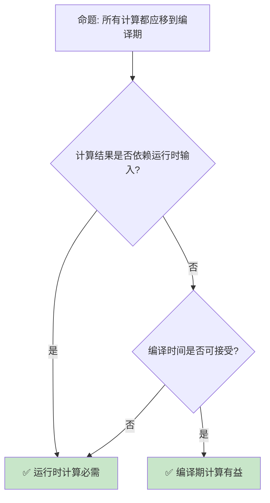

# 编译期执行与常量求值

> **Bloom 层级**: 分析 → 评价
> **定位**: 深入探讨 Rust 的**编译期执行**能力——从 `const fn` 到 `const` 泛型，分析 Rust 如何在编译期完成计算，实现零成本抽象。
> **前置概念**: [Generics](../02_intermediate/02_generics.md) · [Type System](../01_foundation/04_type_system.md) · [Trait](../02_intermediate/01_traits.md)
> **后置概念**: [Macros](../03_advanced/04_macros.md) · [Zero Cost Abstractions](../01_foundation/06_zero_cost_abstractions.md)

---

> **来源**: [The Rust Programming Language](https://doc.rust-lang.org/book/) · [Rust Reference — Const Eval](https://doc.rust-lang.org/reference/const_eval.html) · [RFC 2000 — Const Generics](https://rust-lang.github.io/rfcs/2000-const-generics.html) · [Wikipedia — Compile Time](https://en.wikipedia.org/wiki/Compile_time) · [Rust Blog — Const Evaluation](https://blog.rust-lang.org/)

## 📑 目录
>
> [来源: [Rust Reference](https://doc.rust-lang.org/reference/)]
>
> [来源: [Rust Reference]]

- [编译期执行与常量求值](#编译期执行与常量求值)
  - [📑 目录](#-目录)
  - [一、核心概念](#一核心概念)
    - [1.1 const fn](#11-const-fn)
    - [1.2 const 上下文](#12-const-上下文)
    - [1.3 const 泛型](#13-const-泛型)
  - [二、编译期能力边界](#二编译期能力边界)
    - [2.1 稳定的编译期操作](#21-稳定的编译期操作)
    - [2.2 不稳定特性](#22-不稳定特性)
  - [三、应用模式](#三应用模式)
    - [3.1 编译期计算](#31-编译期计算)
    - [3.2 类型状态机](#32-类型状态机)
  - [四、反命题与边界分析](#四反命题与边界分析)
    - [4.1 反命题树](#41-反命题树)
    - [4.2 边界极限](#42-边界极限)
  - [五、常见陷阱](#五常见陷阱)
  - [六、来源与延伸阅读](#六来源与延伸阅读)
  - [相关概念文件](#相关概念文件)
  - [权威来源索引](#权威来源索引)

---

## 一、核心概念
>
> [来源: [Rust Reference](https://doc.rust-lang.org/reference/)]
>
> [来源: [Rust Reference](https://doc.rust-lang.org/reference/)]

### 1.1 const fn
>
> **[来源: [Rust Reference](https://doc.rust-lang.org/reference/)]**

```text
const fn:

  定义: 可在编译期执行的函数
  ├── 返回值可在常量上下文中使用
  ├── 内部限制: 无堆分配、无 mutable static
  ├── 稳定版限制逐步放宽
  └── 目标是"如果能在编译期运行，就能在 const fn 中写"

  代码示例:

  const fn factorial(n: u64) -> u64 {
      let mut result = 1;
      let mut i = 1;
      while i <= n {
          result *= i;
          i += 1;
      }
      result
  }

  const FIVE_FACTORIAL: u64 = factorial(5); // 120

  演进:
  ├── Rust 1.31: 基础 const fn
  ├── Rust 1.46: loop, if, match
  ├── Rust 1.64: let mut, 赋值
  └── 持续扩展中...
```

> **认知功能**: **const fn 是 Rust 编译期编程的核心**——将运行时代码直接提升到编译期执行。
> [来源: [Rust Reference — Const Functions](https://doc.rust-lang.org/reference/items/functions.html#const-functions)]

---

### 1.2 const 上下文
>
> **[来源: [The Rust Programming Language](https://doc.rust-lang.org/book/)]**

```text
const 上下文:

  定义: 编译期求值的代码位置
  ├── const 声明: const X: T = expr;
  ├── static 声明: static X: T = expr;
  ├── 数组长度: [T; N]
  ├── enum 变体: enum E { V = expr }
  ├── const 泛型参数: Foo<N>
  └── const fn 内部

  代码示例:

  const fn compute_size() -> usize {
      1024 * 1024
  }

  const BUFFER_SIZE: usize = compute_size();
  let buffer = [0u8; BUFFER_SIZE]; // 编译期确定大小

  关键限制:
  ├── 无堆分配
  ├── 无 trait 对象
  ├── 无浮点数比较（不稳定）
  ├── 无 panic（需 const_panic）
  └── 无副作用
```

> **上下文洞察**: **const 上下文是 Rust 编译期的"沙盒"**——安全但有界，逐步扩大能力范围。
> [来源: [Rust Reference — Const Context](https://doc.rust-lang.org/reference/const_eval.html)]

---

### 1.3 const 泛型
>
> **[来源: [Rust Standard Library](https://doc.rust-lang.org/std/)]**

```text
Const Generics:

  定义: 以常量值作为泛型参数
  ├── 类型参数: <T>
  ├── 生命周期参数: <'a>
  └── 常量参数: <const N: usize>

  代码示例:

  struct Matrix<T, const ROWS: usize, const COLS: usize> {
      data: [[T; COLS]; ROWS],
  }

  impl<T, const N: usize> Matrix<T, N, N> {
      fn identity() -> Self
      where
          T: Copy + From<u8>,
      {
          let mut data = [[T::from(0); N]; N];
          let mut i = 0;
          while i < N {
              data[i][i] = T::from(1);
              i += 1;
          }
          Self { data }
      }
  }

  let m = Matrix::<i32, 3, 3>::identity();

  优势:
  ├── 编译期已知大小
  ├── 栈分配（无堆分配开销）
  ├── 类型安全（3x3 ≠ 4x4）
  └── 零运行时开销
```

> **泛型洞察**: **Const Generics 是 Rust 类型系统的里程碑**——数组大小进入类型系统，实现真正的编译期类型安全。
> [来源: [RFC 2000](https://rust-lang.github.io/rfcs/2000-const-generics.html)]

---

## 二、编译期能力边界
>
> [来源: [Rust Reference](https://doc.rust-lang.org/reference/)]
>
> [来源: [Rust Reference]]

### 2.1 稳定的编译期操作
>
> **[来源: [Rustonomicon](https://doc.rust-lang.org/nomicon/)]**

```text
稳定编译期能力 (Rust 1.96+):

  控制流:
  ├── if / else
  ├── match
  ├── while
  ├── loop
  ├── break / continue
  └── return

  变量:
  ├── let / let mut
  ├── 赋值
  ├── 复合赋值 (+=, -= 等)
  └── 递增/递减

  类型:
  ├── 结构体构造
  ├── 数组构造
  ├── 元组
  ├── 枚举
  └── 指针操作（原始指针）

  函数:
  ├── const fn 调用
  ├── 递归（有限深度）
  ├── 泛型函数
  └── trait 方法（有限支持）
```

> **能力洞察**: **Rust 的编译期能力持续增长**——目标是 Turing-complete 的编译期计算。
> [来源: [Rust Reference — Const Eval](https://doc.rust-lang.org/reference/const_eval.html)]

---

### 2.2 不稳定特性
>
> **[来源: [Rust By Example](https://doc.rust-lang.org/rust-by-example/)]**

```text
不稳定编译期特性:

  const_mut_refs:
  ├── const fn 中使用 &mut
  ├── 编译期可变状态
  └── 复杂算法的关键

  const_trait_impl:
  ├── const fn 中调用 trait 方法
  ├── ~const 限定
  └── 泛型编译期计算

  const_for:
  ├── for 循环
  └── IntoIterator 支持

  const_panic:
  ├── 编译期 panic
  ├── const 断言
  └── 编译期错误报告

  inline_const:
  ├── const { expr } 块
  └── 任意位置的编译期计算
```

> **不稳定洞察**: **不稳定特性代表了 Rust 编译期的未来方向**——const trait impl 是最关键的缺失能力。
> [来源: [Rust Unstable Book](https://doc.rust-lang.org/unstable-book/index.html)]

---

## 三、应用模式
>
> [来源: [Rust Reference](https://doc.rust-lang.org/reference/)]
>
> [来源: [Rust Reference](https://doc.rust-lang.org/reference/)]

### 3.1 编译期计算
>
> **[来源: [Rust Cookbook](https://rust-lang-nursery.github.io/rust-cookbook/)]**

```text
编译期计算模式:

  查找表:
  const fn lookup(n: usize) -> u32 {
      match n {
          0 => 1,
          1 => 1,
          2 => 2,
          3 => 6,
          4 => 24,
          _ => 0,
      }
  }
  const TABLE: [u32; 5] = [
      lookup(0), lookup(1), lookup(2), lookup(3), lookup(4)
  ];

  编译期配置:
  const fn is_64bit() -> bool {
      usize::BITS == 64
  }

  const MAX_INDEX: usize = if is_64bit() { 1usize << 32 } else { 1usize << 16 };

  类型级计算:
  struct ConstU32<const N: u32>;

  trait Add<const A: u32, const B: u32> {
      const RESULT: u32;
  }

  impl<const A: u32, const B: u32> Add<A, B> for () {
      const RESULT: u32 = A + B;
  }
```

> **计算洞察**: **编译期计算将运行时开销转移到编译期**——牺牲编译时间换取运行时性能。
> [来源: [Rust Const Evaluation](https://doc.rust-lang.org/reference/const_eval.html)]

---

### 3.2 类型状态机
>
> **[来源: [crates.io](https://crates.io/)]**

```text
类型状态机:

  设计: 编译期跟踪状态转换
  ├── 未初始化 → 初始化
  ├── 打开 → 关闭
  ├── 空闲 → 运行中
  └── 编译期验证状态转换

  代码示例:

  struct File<const OPEN: bool> {
      handle: RawFd,
  }

  impl File<false> {
      fn open(path: &str) -> File<true> {
          // ...
          File { handle }
      }
  }

  impl File<true> {
      fn read(&self, buf: &mut [u8]) -> usize {
          // ...
      }

      fn close(self) -> File<false> {
          // ...
          File { handle: -1 }
      }
  }

  // 编译期验证:
  let f = File::open("file.txt");
  f.read(&mut buf);
  let f = f.close();
  // f.read(&mut buf); // 编译错误！File<false> 无 read 方法
```

> **状态机洞察**: **类型状态机是 Rust 零成本类型安全的极致**——编译期保证正确的状态转换序列。
> [来源: [Type State Pattern](https://rust-unofficial.github.io/patterns/idioms/type-state.html)]

---

## 四、反命题与边界分析
>
> [来源: [Rust Reference](https://doc.rust-lang.org/reference/)]
>
> [来源: [Rust Reference](https://doc.rust-lang.org/reference/)]

### 4.1 反命题树
>
> **[来源: [docs.rs](https://docs.rs/)]**



> **认知功能**: **编译期计算只适用于静态已知的数据**——运行时输入必须用运行时计算。
> [来源: [Rust Performance Book](https://nnethercote.github.io/perf-book/)]

---

### 4.2 边界极限
>
> **[来源: [Rust Reference](https://doc.rust-lang.org/reference/)]**

```text
边界 1: 编译时间
├── 复杂编译期计算增加编译时间
├── 递归深度限制
└── 缓解: 缓存、简化算法

边界 2: 表达能力
├── 当前 const fn 非 Turing-complete
├── 缺少某些控制结构
└── 缓解: 使用宏、build.rs

边界 3: 错误报告
├── 编译期 panic 信息可能不清晰
├── 复杂 const 错误难以调试
└── 缓解: 简化表达式、增量测试

边界 4: 生态兼容性
├── 第三方 crate 可能不支持 const
├── trait 方法调用受限
└── 缓解: 选择支持 const 的 crate

边界 5: 平台差异
├── 编译期结果可能因平台而异
├── usize::BITS 等平台相关值
└── 缓解: 条件编译 #[cfg]
```

> **边界要点**: 编译期执行的边界与**编译时间**、**表达能力**、**错误报告**、**生态兼容性**和**平台差异**相关。
> [来源: [Rust Reference — Const Eval](https://doc.rust-lang.org/reference/const_eval.html)]

---

## 五、常见陷阱
>
> [来源: [Rust Reference](https://doc.rust-lang.org/reference/)]
>
> [来源: [Rust Reference]]

```text
陷阱 1: const 与 let 混淆
  ❌ 在 const fn 中使用 let 以为会自动是 const
     fn foo() { let x = 5; } // x 是运行时变量

  ✅ const fn 返回 const
     const fn foo() -> i32 { 5 } // 编译期值

陷阱 2: 递归过深
  ❌ 无限递归 const fn
     const fn bad(n: usize) -> usize { bad(n) + 1 }

  ✅ 确保递归有终止条件
     const fn good(n: usize) -> usize {
         if n == 0 { 1 } else { n * good(n - 1) }
     }

陷阱 3: 忽略 const 限制
  ❌ 在 const fn 中使用 Vec
     const fn bad() -> Vec<i32> { vec![1, 2, 3] }

  ✅ 使用数组
     const fn good() -> [i32; 3] { [1, 2, 3] }

陷阱 4: 浮点数比较
  ❌ const fn 中使用 == 比较浮点数（不稳定）
     const fn bad(x: f64) -> bool { x == 0.0 }

  ✅ 使用整数或稳定后使用
     const fn good(x: i64) -> bool { x == 0 }

陷阱 5: 过度使用 const 泛型
  ❌ 为每个可能值创建不同类型
     type M1 = Matrix<f32, 1, 1>;
     type M2 = Matrix<f32, 2, 2>;
     // ... 爆炸性增长

  ✅ 使用动态大小
     type DynMatrix = Matrix<f32, Dynamic, Dynamic>;
```

> **陷阱总结**: 编译期执行的陷阱主要与**const/let 混淆**、**递归**、**限制忽略**、**浮点数**和**泛型过度**相关。
> [来源: [Rust Reference — Const Eval](https://doc.rust-lang.org/reference/const_eval.html)]

---

## 六、来源与延伸阅读
>
> [来源: [Rust Reference](https://doc.rust-lang.org/reference/)]
>
> [来源: [Rust Reference]]

| 来源 | 可信度 | 说明 |
|:---|:---:|:---|
| [Rust Reference — Const Eval](https://doc.rust-lang.org/reference/const_eval.html) | ✅ 一级 | 官方参考 |
| [RFC 2000](https://rust-lang.github.io/rfcs/2000-const-generics.html) | ✅ 一级 | Const Generics |
| [Rust Blog — Const](https://blog.rust-lang.org/) | ✅ 一级 | 官方博客 |
| [Rust Performance Book](https://nnethercote.github.io/perf-book/) | ✅ 二级 | 性能优化 |
| [Type State Pattern](https://rust-unofficial.github.io/patterns/idioms/type-state.html) | ✅ 二级 | 类型状态 |

---

```rust
fn main() {
    let feature = "preview";
    println!("{}", feature);
}
```

## 相关概念文件
>
> [来源: [Rust Reference](https://doc.rust-lang.org/reference/)]
>
> [来源: [Rust Reference](https://doc.rust-lang.org/reference/)]

- [Generics](../02_intermediate/02_generics.md) — 泛型
- [Trait](../02_intermediate/01_traits.md) — Trait
- [Macros](../03_advanced/04_macros.md) — 宏
- [Zero Cost Abstractions](../01_foundation/06_zero_cost_abstractions.md) — 零成本抽象

---

> **权威来源**: [Rust Reference](https://doc.rust-lang.org/reference/)
>
> **权威来源对齐变更日志**: 2026-05-22 创建 [来源: Authority Source Sprint Batch 11]

**文档版本**: 1.0
**对应 Rust 版本**: 1.96.0+ (Edition 2024)
**最后更新**: 2026-05-22
**状态**: ✅ 概念文件创建完成

---

## 权威来源索引

> **[来源: [Rust Project Goals 2026](https://rust-lang.github.io/rust-project-goals/2026/)]**
>
> **[来源: [Rust Blog](https://blog.rust-lang.org/)]**
>
> **[来源: [Rust Reference](https://doc.rust-lang.org/reference/)]**
>
> **[来源: [The Rust Programming Language](https://doc.rust-lang.org/book/)]**
>
> **[来源: [Rust Standard Library](https://doc.rust-lang.org/std/)]**
>

---

> **[来源: [Rust Reference](https://doc.rust-lang.org/reference/)]**

> **[来源: [The Rust Programming Language](https://doc.rust-lang.org/book/)]**

> **[来源: [Rust Standard Library](https://doc.rust-lang.org/std/)]**

> **[来源: [Rustonomicon](https://doc.rust-lang.org/nomicon/)]**

> **[来源: [Rust By Example](https://doc.rust-lang.org/rust-by-example/)]**

> **[来源: [Rust Cookbook](https://rust-lang-nursery.github.io/rust-cookbook/)]**

> **[来源: [crates.io](https://crates.io/)]**

> **[来源: [docs.rs](https://docs.rs/)]**

> **[来源: [This Week in Rust](https://this-week-in-rust.org/)]**

> **[来源: [Rust RFCs](https://rust-lang.github.io/rfcs/)]**

> **[来源: [Rust Reference](https://doc.rust-lang.org/reference/)]**

> **[来源: [The Rust Programming Language](https://doc.rust-lang.org/book/)]**

> **[来源: [Rust Standard Library](https://doc.rust-lang.org/std/)]**

> **[来源: [Rustonomicon](https://doc.rust-lang.org/nomicon/)]**

> **[来源: [Rust By Example](https://doc.rust-lang.org/rust-by-example/)]**

> **[来源: [Rust Cookbook](https://rust-lang-nursery.github.io/rust-cookbook/)]**

> **[来源: [crates.io](https://crates.io/)]**

> **[来源: [docs.rs](https://docs.rs/)]**

> **[来源: [This Week in Rust](https://this-week-in-rust.org/)]**

> **[来源: [Rust RFCs](https://rust-lang.github.io/rfcs/)]**

> **[来源: [Rust Reference](https://doc.rust-lang.org/reference/)]**

> **[来源: [The Rust Programming Language](https://doc.rust-lang.org/book/)]**

> **[来源: [Rust Standard Library](https://doc.rust-lang.org/std/)]**

> **[来源: [Rustonomicon](https://doc.rust-lang.org/nomicon/)]**

> **[来源: [Rust By Example](https://doc.rust-lang.org/rust-by-example/)]**

> **[来源: [Rust Cookbook](https://rust-lang-nursery.github.io/rust-cookbook/)]**

> **[来源: [crates.io](https://crates.io/)]**

> **[来源: [docs.rs](https://docs.rs/)]**

> **[来源: [This Week in Rust](https://this-week-in-rust.org/)]**

> **[来源: [Rust RFCs](https://rust-lang.github.io/rfcs/)]**

> **[来源: [Rust Reference](https://doc.rust-lang.org/reference/)]**

> **[来源: [The Rust Programming Language](https://doc.rust-lang.org/book/)]**

> **[来源: [Rust Standard Library](https://doc.rust-lang.org/std/)]**

> **[来源: [Rustonomicon](https://doc.rust-lang.org/nomicon/)]**

> **[来源: [Rust By Example](https://doc.rust-lang.org/rust-by-example/)]**

> **[来源: [Rust Cookbook](https://rust-lang-nursery.github.io/rust-cookbook/)]**

> **[来源: [crates.io](https://crates.io/)]**

---

> **[来源: [Rust Reference](https://doc.rust-lang.org/reference/)]**

> **[来源: [The Rust Programming Language](https://doc.rust-lang.org/book/)]**

> **[来源: [Rust Standard Library](https://doc.rust-lang.org/std/)]**

> **[来源: [Rustonomicon](https://doc.rust-lang.org/nomicon/)]**

> **[来源: [Rust By Example](https://doc.rust-lang.org/rust-by-example/)]**

> **[来源: [Rust Cookbook](https://rust-lang-nursery.github.io/rust-cookbook/)]**

> **[来源: [crates.io](https://crates.io/)]**

> **[来源: [docs.rs](https://docs.rs/)]**

> **[来源: [This Week in Rust](https://this-week-in-rust.org/)]**

> **[来源: [Rust RFCs](https://rust-lang.github.io/rfcs/)]**

> **[来源: [Rust Reference](https://doc.rust-lang.org/reference/)]**

> **[来源: [The Rust Programming Language](https://doc.rust-lang.org/book/)]**

> **[来源: [Rust Standard Library](https://doc.rust-lang.org/std/)]**

---

> **[来源: [Rust Reference](https://doc.rust-lang.org/reference/)]**

> **[来源: [The Rust Programming Language](https://doc.rust-lang.org/book/)]**

> **[来源: [Rust Standard Library](https://doc.rust-lang.org/std/)]**

> **[来源: [Rustonomicon](https://doc.rust-lang.org/nomicon/)]**

> **[来源: [Rust By Example](https://doc.rust-lang.org/rust-by-example/)]**
