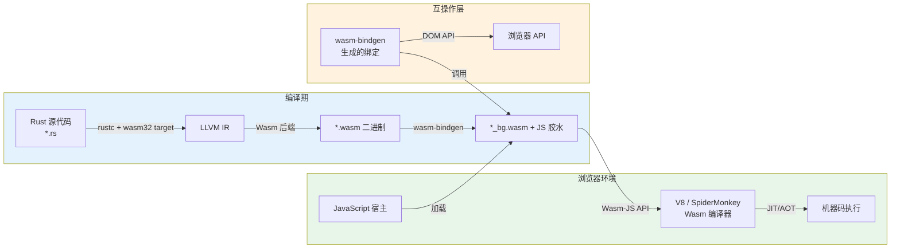
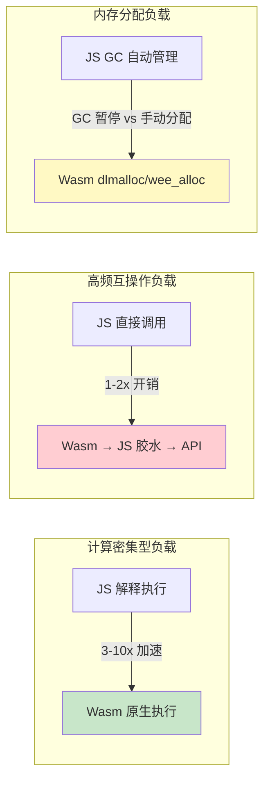

# Rust for WebAssembly：从 wasm-bindgen 到前端框架的深度技术栈

> **代码状态**: ✅ 含可编译示例

>
> **EN**: WebAssembly
> **Summary**: WebAssembly. Core Rust concept covering mental model building, mechanism analysis, performance optimization.
>
> **受众**: [专家]
> **内容分级**: [综述级]
> **Bloom 层级**: 应用 → 评价
> **A/S/P 标记**: **A+S+P** — ApplicationStructureProcedure
> **双维定位**: P×Cre — 设计 Rust for WASM 架构
> **定位**: 深度评价 Rust 在 **WebAssembly (Wasm)** 全栈开发中的技术成熟度——从 wasm-bindgen/wasm-pack 工具链到 Yew/Leptos 前端框架，分析 Rust→Wasm 编译模型、JS 互操作内存模型、性能权衡边界与工程选型决策。
> **前置概念**: [Rust 路线图](./24_roadmap.md) · [WebAssembly 生态](../06_ecosystem/11_webassembly.md) · [Web 框架](../06_ecosystem/27_web_frameworks.md)
> **后置概念**: [WASI 预览](../06_ecosystem/08_wasi.md) · [形式化方法](./02_formal_methods.md)
> **定理链**: N/A — 描述性/综述性/导航性文档，不涉及形式化定理链
---

> **来源**: [Rust Wasm Book](https://rustwasm.github.io/book/) ·
> [wasm-bindgen Guide](https://rustwasm.github.io/wasm-bindgen/) ·
> [wasm-pack Book](https://rustwasm.github.io/wasm-pack/book/) ·
> [Yew Framework](https://yew.rs/) ·
> [Leptos Framework](https://leptos.dev/) ·
> [WebAssembly Specification](https://webassembly.github.io/spec/) ·
> [W3C WebAssembly](https://www.w3.org/wasm/) ·
> [MDN — WebAssembly](https://developer.mozilla.org/en-US/docs/WebAssembly) ·
> [Wasmtime Runtime](https://docs.wasmtime.dev/) ·
> [Bytecode Alliance](https://bytecodealliance.org/) ·
> [Rustc Platform Support](https://doc.rust-lang.org/rustc/platform-support.html) ·
> [TRPL — Unsafe Rust](https://doc.rust-lang.org/book/ch19-01-unsafe-rust.html) ·
> [Wasmtime Security](https://docs.wasmtime.dev/security.html) ·
> [The State of WebAssembly 2023](https://blog.scottlogic.com/2023/10/18/the-state-of-webassembly-2023.html)

---

> **Bloom 层级**: 应用 → 评价
**变更日志**:

- v1.0 (2026-05-22): 初始版本——覆盖 wasm-bindgen/wasm-pack 工具链、Yew/Leptos 框架对比、Wasm 内存模型、JS 互操作性能分析、选型决策树、Mermaid 架构图

---

## 📑 目录

- [Rust for WebAssembly：从 wasm-bindgen 到前端框架的深度技术栈](#rust-for-webassembly从-wasm-bindgen-到前端框架的深度技术栈)
  - [📑 目录](#-目录)
  - [一、权威定义与核心概念](#一权威定义与核心概念)
    - [1.1 Rust → Wasm 的编译模型](#11-rust--wasm-的编译模型)
    - [1.2 wasm-bindgen 的互操作语义](#12-wasm-bindgen-的互操作语义)
    - [1.3 wasm-pack 的工程化角色](#13-wasm-pack-的工程化角色)
  - [二、前端框架深度对比](#二前端框架深度对比)
    - [2.1 Yew：React 范式的 Rust 实现](#21-yewreact-范式的-rust-实现)
    - [2.2 Leptos：细粒度响应式与性能优先](#22-leptos细粒度响应式与性能优先)
    - [2.3 框架选型矩阵](#23-框架选型矩阵)
  - [三、性能特征与 Wasm 内存模型](#三性能特征与-wasm-内存模型)
    - [3.1 Rust Wasm vs JavaScript 性能边界](#31-rust-wasm-vs-javascript-性能边界)
    - [3.2 线性内存模型与所有权映射](#32-线性内存模型与所有权映射)
    - [3.3 JS ↔ Wasm 互操作开销分析](#33-js--wasm-互操作开销分析)
  - [四、工具链与工程实践](#四工具链与工程实践)
    - [4.1 目标三元组与编译配置](#41-目标三元组与编译配置)
    - [4.2 调试与测试策略](#42-调试与测试策略)
  - [五、反命题与边界分析](#五反命题与边界分析)
    - [5.1 反命题决策树](#51-反命题决策树)
    - [5.2 边界极限测试](#52-边界极限测试)
  - [六、常见陷阱](#六常见陷阱)
  - [七、来源与延伸阅读](#七来源与延伸阅读)
  - [相关概念文件](#相关概念文件)
  - [权威来源索引](#权威来源索引)
  - [十、边界测试：WebAssembly 的编译错误](#十边界测试webassembly-的编译错误)
    - [10.1 边界测试：WASI 的文件系统权限（运行时错误）](#101-边界测试wasi-的文件系统权限运行时错误)
    - [10.2 边界测试：`wasm-bindgen` 的类型不匹配（编译错误）](#102-边界测试wasm-bindgen-的类型不匹配编译错误)
    - [10.3 边界测试：WASM 模块的大小限制与 `wee_alloc`（运行时错误）](#103-边界测试wasm-模块的大小限制与-wee_alloc运行时错误)
    - [10.3 边界测试：WASM 组件模型（Component Model）的类型映射（编译错误）](#103-边界测试wasm-组件模型component-model的类型映射编译错误)
    - [10.4 边界测试：WASI Preview 2 的功能性权限（运行时错误）](#104-边界测试wasi-preview-2-的功能性权限运行时错误)
    - [10.3 边界测试：WASM 模块的线性内存与 Rust 的 Vec 增长策略（运行时 OOM）](#103-边界测试wasm-模块的线性内存与-rust-的-vec-增长策略运行时-oom)
    - [补充定理链](#补充定理链)
  - [嵌入式测验（Embedded Quiz）](#嵌入式测验embedded-quiz)
    - [测验 1：Rust 在 WASM 生态中的长期愿景是什么？（理解层）](#测验-1rust-在-wasm-生态中的长期愿景是什么理解层)
    - [测验 2：WASI Preview 2 的组件模型对 Rust 开发有什么影响？（理解层）](#测验-2wasi-preview-2-的组件模型对-rust-开发有什么影响理解层)
    - [测验 3：`wasm32-wasi` 与 `wasm32-unknown-unknown` target 有什么区别？（理解层）](#测验-3wasm32-wasi-与-wasm32-unknown-unknown-target-有什么区别理解层)
    - [测验 4：Rust 如何通过 `wasmtime` 嵌入到现有应用中作为插件系统？（理解层）](#测验-4rust-如何通过-wasmtime-嵌入到现有应用中作为插件系统理解层)
    - [测验 5：WASM 的 64 位内存提案（Memory64）对 Rust 有什么意义？（理解层）](#测验-5wasm-的-64-位内存提案memory64对-rust-有什么意义理解层)
  - [认知路径](#认知路径)
    - [核心推理链](#核心推理链)
    - [反命题与边界](#反命题与边界)

---

## 一、权威定义与核心概念

### 1.1 Rust → Wasm 的编译模型
>

Rust 编译到 WebAssembly 采用 LLVM 后端路径，通过 `wasm32-unknown-unknown` 等目标三元组生成符合 Wasm MVP 规范的二进制：

```text
Rust → Wasm 编译管线:

  rustc 前端:
  ├── 词法/语法分析 → HIR → MIR
  ├── 借用检查与生命周期验证（与原生目标完全一致）
  └── 类型系统检查（Trait 求解、泛型单态化）
        [来源: [Rust 路线图](../07_future/24_roadmap.md)]

  LLVM 后端:
  ├── MIR → LLVM IR
  ├── LLVM IR → Wasm 后端（wasm-ld 链接器）
  └── 输出: .wasm 二进制 + .js 胶水代码（wasm-bindgen 生成）

  运行时环境:
  ├── 浏览器: Wasm-JS API 加载，V8 编译为机器码
  ├── Node.js: 同浏览器，附加 WASI 支持
  └── Wasmtime: 独立运行时，WASI 系统调用接口
        [来源: [Wasmtime Runtime](https://docs.wasmtime.dev/)]
```

> **编译保证**: Rust 的所有权检查、生命周期验证在 Wasm 目标上与 x86_64 目标**完全等价**。编译到 Wasm 不会降低内存安全保证——越界访问在 Wasm 运行时被捕获为 trap，而 Rust 在编译期已消除大部分此类错误。[来源: [WebAssembly Specification](https://webassembly.github.io/spec/)]



> **架构洞察**: wasm-bindgen 在编译期生成 JS 胶水代码，负责 Rust 结构体/枚举与 JS 对象之间的**序列化/反序列化**。这一层是性能开销的主要来源之一。[来源: [wasm-bindgen Guide](https://rustwasm.github.io/wasm-bindgen/)]

---

### 1.2 wasm-bindgen 的互操作语义
>

`wasm-bindgen` 是 Rust 与 JavaScript 之间的**FFI 桥接层**，通过过程宏在编译期生成双向绑定：

```rust
use wasm_bindgen::prelude::*;

// Rust 函数导出到 JS
#[wasm_bindgen]
pub fn fibonacci(n: u32) -> u64 {
    match n {
        0 => 0,
        1 => 1,
        _ => fibonacci(n - 1) + fibonacci(n - 2),
    }
}

// Rust 调用 JS 函数
#[wasm_bindgen]
extern "C" {
    #[wasm_bindgen(js_namespace = console)]
    fn log(s: &str);
}

// 复杂类型的序列化
#[wasm_bindgen]
pub struct Point {
    pub x: f64,
    pub y: f64,
}

#[wasm_bindgen]
impl Point {
    pub fn distance(&self, other: &Point) -> f64 {
        ((self.x - other.x).powi(2) + (self.y - other.y).powi(2)).sqrt()
    }
}
```

> **互操作语义**: `#[wasm_bindgen]` 宏在编译期展开为 `__wasm_bindgen_generated_fibonacci` 等 shim 函数，处理参数/返回值的 ABI 转换。复杂类型（如 `String`、`Vec<T>`）通过 Wasm 线性内存传递指针+长度，JS 端负责解码。[来源: [wasm-bindgen Guide](https://rustwasm.github.io/wasm-bindgen/)]

```text
wasm-bindgen 的类型映射规则:
┌─────────────────────────────────────────────────────────────────┐
│ Rust 类型              │ JS 类型         │ 传递机制              │
├─────────────────────────────────────────────────────────────────┤
│ u32 / i32 / f32        │ number          │ Wasm 值类型（直接）   │
│ u64 / i64              │ BigInt          │ 低/高 32 位拆分       │
│ String                 │ string          │ 线性内存 + UTF-8 编码 │
│ &str                   │ string          │ 同上（只读借用）      │
│ Vec<u8>                │ Uint8Array      │ 线性内存 + 长度       │
│ JsValue                │ any             │ 不透明句柄引用        │
│ 自定义 struct          │ object          │ 字段逐个序列化        │
└─────────────────────────────────────────────────────────────────┘
```

> **性能警示**: `String` 和 `Vec<u8>` 的跨边界传递涉及**内存拷贝与 UTF-8 编解码**。高频交互场景中，应优先使用数字类型或 `&[u8]` 视图，避免大量字符串传输。[来源: [TRPL — Unsafe Rust](https://doc.rust-lang.org/book/ch19-01-unsafe-rust.html)]

---

### 1.3 wasm-pack 的工程化角色
>

`wasm-pack` 是 Rust Wasm 项目的**构建与发布工具**，封装了编译、打包、npm 发布的完整工作流：

```text
wasm-pack 工作流:

  构建:
  wasm-pack build
  ├── 调用 cargo build --target wasm32-unknown-unknown
  ├── 运行 wasm-bindgen 生成 JS 胶水
  ├── 运行 wasm-opt（Binaryen）优化 .wasm
  └── 生成 package.json（支持 bundler/web/nodejs/Typescript）

  测试:
  wasm-pack test --headless --firefox
  ├── 启动 Wasm 测试运行器
  ├── 在浏览器环境中执行 #[wasm_bindgen_test]
  └── 支持 headless 模式与 CI 集成

  发布:
  wasm-pack login && wasm-pack publish
  └── 将 Rust Wasm 包发布为 npm 包
```

> **工程洞察**: wasm-pack 的 `--target` 参数决定输出格式：`bundler`（webpack/vite 使用 ES module）、`web`（浏览器原生 ES module）、`nodejs`（CommonJS）、`no-modules`（全局脚本）。选型直接影响集成方式。[来源: [wasm-pack Book](https://rustwasm.github.io/wasm-pack/book/)]

---

## 二、前端框架深度对比

### 2.1 Yew：React 范式的 Rust 实现
>

Yew 是受 React 启发的 Rust 前端框架，采用**虚拟 DOM（VDOM）**与**组件化**架构：

```rust
// Yew 组件示例
use yew::prelude::*;

#[function_component]
fn Counter() -> Html {
    let counter = use_state(|| 0);
    let onclick = {
        let counter = counter.clone();
        Callback::from(move |_| counter.set(*counter + 1))
    };

    html! {
        <div>
            <button {onclick}>{ "+1" }</button>
            <p>{ *counter }</p>
        </div>
    }
}
```

> **架构特征**: Yew 使用 `html!` 宏在编译期将 JSX-like 语法转换为 Rust 代码，依赖 VDOM diff 算法更新 UI。这与 React 的运行时 diff 策略一致，适合从 React 生态迁移的开发者。[来源: [Yew Framework](https://yew.rs/)]

---

### 2.2 Leptos：细粒度响应式与性能优先
>

Leptos 采用**信号（Signals）**驱动的细粒度响应式系统，避免 VDOM 的全树 diff 开销：

```rust
// Leptos 组件示例
use leptos::*;

#[component]
fn Counter() -> impl IntoView {
    let (count, set_count) = create_signal(0);

    view! {
        <div>
            <button on:click=move |_| set_count.update(|n| *n += 1)>
                "+1"
            </button>
            <p>{ move || count.get() }</p>
        </div>
    }
}
```

> **响应式洞察**: Leptos 的信号系统仅在依赖数据变化时更新具体 DOM 节点，而非重新渲染整个组件子树。在复杂 UI 中，这可以显著减少 Wasm↔JS 互操作调用次数。[来源: [Leptos Framework](https://leptos.dev/)]

---

### 2.3 框架选型矩阵
>

| 维度 | Yew | Leptos | 备注 |
|:---|:---|:---|:---|
| **更新模型** | VDOM diff | 细粒度信号 | VDOM 心智负担低，信号性能高 |
| **渲染模式** | 客户端 | SSR + 客户端 Hydration | Leptos 的 SSR 支持更成熟 |
| **编译产物** | 较大（VDOM runtime） | 较小（tree-shake 友好） | 均支持 wasm-opt 压缩 |
| **路由** | yew-router | leptos_router | 均支持嵌套路由与懒加载 |
| **生态系统** | 较成熟，示例丰富 | 快速增长，API 迭代中 | 社区规模均小于 React/Vue |
| **学习曲线** | 熟悉 React 者易上手 | 需理解信号/响应式原语 | 均需掌握 Rust 所有权 |
| **与 JS 集成** | 通过 wasm-bindgen | 通过 wasm-bindgen | 互操作层相同 |

> **选型原则**: 优先 Yew 如果团队熟悉 React/VDOM 模型；优先 Leptos 如果追求极致性能或需要 SSR。两者均依赖 [Web 框架](../06_ecosystem/27_web_frameworks.md) 的异步运行时思维。[来源: [Web 框架](../06_ecosystem/27_web_frameworks.md)]

---

## 三、性能特征与 Wasm 内存模型
>

### 3.1 Rust Wasm vs JavaScript 性能边界
>

```text
性能对比场景矩阵:

  计算密集型:
  ├── 数值计算（矩阵乘法、FFT）: Wasm 3-10x 快于 JS
  │   [来源: [The State of WebAssembly 2023](https://blog.scottlogic.com/2023/10/18/the-state-of-webassembly-2023.html)]
  ├── 字符串处理: 接近或略慢于 V8 优化后的 JS
  │   （JS 引擎对字符串有深度优化，Wasm 需手动管理）
  └── 内存分配密集型: 依赖 wasm-bindgen 分配器，通常慢于 JS GC

  交互密集型:
  ├── DOM 操作: Wasm 通过 JS 胶水调用，存在额外开销
  ├── 事件处理: 高频事件（mousemove、scroll）可能受互操作延迟影响
  └── 渲染管线: WebGPU/WebGL 调用在 Wasm 中与 JS 等价（同一 API）
```

> **性能评价**: Wasm 的加速比高度依赖**工作负载类型**。纯数值计算受益最大；频繁与 JS/DOM 交互的场景，加速比被互操作开销侵蚀。不应假设 Wasm "总是更快"。[来源: [MDN — WebAssembly](https://developer.mozilla.org/en-US/docs/WebAssembly)]



> **架构评价**: 上图显示了 Wasm 在不同负载下的性能特征光谱。设计 Wasm 应用时，应将计算核心放在 Wasm，将高频 DOM/事件交互保留在 JS 层。[来源: [Wasmtime Security](https://docs.wasmtime.dev/security.html)]

---

### 3.2 线性内存模型与所有权映射
>

WebAssembly 采用**单一连续线性内存（Linear Memory）**模型，所有数据存储在一个可增长的字节数组中：

```text
Wasm 线性内存布局:

  ┌──────────────────────────────────────────────────────┐
  │  0x0000  │  保留区域（null 指针保护）                  │
  ├──────────────────────────────────────────────────────┤
  │  0x0010  │  栈（Stack）：局部变量、调用帧              │
  │          │  向下增长，由 LLVM 后端管理                  │
  ├──────────────────────────────────────────────────────┤
  │  动态基址  │  堆（Heap）：Box、Vec、String 等           │
  │          │  由 Rust 全局分配器（dlmalloc/wee_alloc）管理│
  ├──────────────────────────────────────────────────────┤
  │  增长边界  │  内存页（64KiB/页），通过 memory.grow 扩展 │
  └──────────────────────────────────────────────────────┘
```

> **所有权映射**: Rust 的所有权系统在线性内存中映射为**编译期静态分析**——`Box<T>` 的 drop 调用释放堆内存，`Vec<T>` 的重新分配触发 `memory.grow`。Wasm 运行时的**边界检查**确保所有内存访问安全，与 Rust 的所有权保证形成**双层防御**。[来源: [WebAssembly Specification](https://webassembly.github.io/spec/)]

```rust,ignore
// Wasm 内存管理示例（需要 wasm-bindgen crate）
#[wasm_bindgen]
pub fn allocate_vec(size: usize) -> *mut u8 {
    let mut vec = vec![0u8; size];
    let ptr = vec.as_mut_ptr();
    std::mem::forget(vec); // 防止 Rust drop，由 JS 管理生命周期
    ptr
}

#[wasm_bindgen]
pub fn deallocate_vec(ptr: *mut u8, size: usize) {
    unsafe {
        let _ = Vec::from_raw_parts(ptr, 0, size); // 回收内存
    }
}
```

> **unsafe 警示**:
> 上述代码展示了 JS ↔ Wasm 的**手动内存管理**模式。`std::mem::forget` 和 `from_raw_parts` 属于 unsafe 操作，错误使用会导致内存泄漏或 use-after-free。
> 现代 wasm-bindgen 已提供 `#[wasm_bindgen(skip)]` 等安全封装，应避免手动管理。
> [来源: [TRPL — Unsafe Rust](https://doc.rust-lang.org/book/ch19-01-unsafe-rust.html)]

---

### 3.3 JS ↔ Wasm 互操作开销分析

```text
互操作开销构成:

  调用开销:
  ├── Wasm → JS: 约 10-30ns（现代引擎，V8 TurboFan）
  ├── JS → Wasm: 约 5-20ns（类型检查 + 上下文切换）
  └── 批量调用优于高频单次调用

  序列化开销:
  ├── 数字类型: 零拷贝（Wasm 值类型直接传递）
  ├── String: UTF-8 编码/解码 + 内存拷贝
  ├── 对象/数组: JSON-like 序列化或通过 IDL 绑定
  └── 建议: 设计 API 时批量传输，减少往返次数

  内存视图共享:
  ├── JS TypedArray ↔ Wasm 内存: 零拷贝共享
  ├── 通过 wasm.memory.buffer 创建视图
  └── 注意: Wasm 内存增长后旧视图失效
```

> **优化策略**: 对于高频数据交换，使用 `Uint8Array` 视图直接读写 Wasm 线性内存，避免 wasm-bindgen 的自动序列化。这要求 Rust 端暴露固定布局的结构体指针。[来源: [MDN — WebAssembly](https://developer.mozilla.org/en-US/docs/WebAssembly)]

---

## 四、工具链与工程实践

### 4.1 目标三元组与编译配置

```text
Rust Wasm 目标三元组对比:
┌─────────────────────────────────────────────────────────────────┐
│ wasm32-unknown-unknown                                          │
│   ├── 最常用，无宿主环境假设                                     │
│   ├── 需要 wasm-bindgen 处理 JS 互操作                           │
│   └── 适用: 浏览器前端、npm 包                                   │
├─────────────────────────────────────────────────────────────────┤
│ `wasm32-wasip1` 或 `wasm32-wasip2`                                                     │
│   ├── 提供 WASI 系统调用接口（文件、网络、时钟）                  │
│   ├── 无需 wasm-bindgen，独立运行时                             │
│   └── 适用: 服务端 Wasm、边缘计算、插件系统                       │
├─────────────────────────────────────────────────────────────────┤
│ wasm32-unknown-emscripten                                       │
│   ├── 使用 Emscripten 运行时，提供 POSIX 兼容层                  │
│   ├── 产物较大，兼容性最好                                       │
│   └── 适用: 将现有 C/Rust 项目快速移植到 Web                    │
└─────────────────────────────────────────────────────────────────┘
```

> **配置要点**: `wasm32-unknown-unknown` 是 Rust 前端框架（Yew/Leptos）的标准目标；``wasm32-wasip1` 或 `wasm32-wasip2`` 是服务端 Wasm 的首选。两者 ABI 不兼容，不可混用。[来源: [Rustc Platform Support](https://doc.rust-lang.org/rustc/platform-support.html)]

---

### 4.2 调试与测试策略

```text
Wasm 调试工具链:

  编译期:
  ├── cargo check --target wasm32-unknown-unknown
  ├── wasm-pack build --dev（含调试符号）
  └── twiggy: Wasm 二进制体积分析

  运行时:
  ├── Chrome DevTools: Wasm 源码映射（source map）
  ├── Firefox DevTools: Wasm 断点与栈追踪
  ├── wasm2wat: 二进制反汇编为 WAT 文本格式
  └── console_error_panic_hook: Rust panic 映射为 JS console.error

  测试:
  ├── wasm-pack test --headless --chrome/firefox
  ├── wasm-bindgen-test: 浏览器环境中的单元测试
  └── js-sys/web-sys: 模拟浏览器 API 进行测试
```

> **工程实践**: `console_error_panic_hook` 是必装依赖，它将 Rust panic 消息捕获并输出到浏览器控制台。否则，Wasm trap 只会显示模糊的 "unreachable" 错误。[来源: [Rust Wasm Book](https://rustwasm.github.io/book/)]

---

## 五、反命题与边界分析

### 5.1 反命题决策树

**反命题 1**: "Rust Wasm 总是比 JavaScript 快"

```text
反驳证据:
├── 字符串操作: V8 有高度优化的字符串内部表示，Wasm 未必更快
├── DOM 操作: Wasm 必须通过 JS 胶水调用，存在额外层
├── 启动时间: Wasm 二进制需下载+编译，大于等效 JS bundle
├── GC 优势: JS 的自动 GC 在小对象分配上可能优于 Wasm 手动分配
└── 结论: 仅数值计算、加密、图像处理等计算密集型场景有明确优势
```

**反命题 2**: "wasm-bindgen 消除了所有互操作复杂性"

```text
反驳证据:
├── 复杂类型仍涉及序列化开销
├── 生命周期管理在跨语言边界模糊（如 JS GC 与 Rust Drop 的交互）
├── async/Promise 互操作需要 js-sys 封装，非完全透明
└── 结论: wasm-bindgen 简化了 80% 场景，剩余 20% 仍需理解 ABI 边界
```

**反命题 3**: "Yew/Leptos 可以替代所有 React/Vue 场景"

```text
反驳证据:
├── 生态系统成熟度: npm 生态规模远超 Rust crates.io 前端库
├── 人才供给: Rust 前端开发者稀缺
├── 第三方库集成: 直接复用 React 组件困难（需 wasm-bindgen 封装）
└── 结论: 适合性能敏感的新项目，遗留系统迁移成本高昂
```

> **评价洞察**:
> Rust Wasm 前端框架的技术优势明确，但工程 adoption 受生态成熟度、团队技能栈和遗留系统约束限制。
> 理性选型应权衡技术收益与组织成本。
> [来源: [The State of WebAssembly 2023](https://blog.scottlogic.com/2023/10/18/the-state-of-webassembly-2023.html)]

---

### 5.2 边界极限测试

**边界 1: Wasm 模块大小**

```text
体积优化策略:
├── wasm-opt -Oz: Binaryen 极致压缩
├── wee_alloc 替代默认分配器: 减少分配器体积
├── panic = "abort": 移除 panic 展开代码
└── 边界: 即使优化后，Yew/Leptos 基础 runtime 仍约 100-300KB
        对比: React 生产包约 40KB gzipped
```

**边界 2: 多线程与 SharedArrayBuffer**

```rust
// Wasm 多线程需要 SharedArrayBuffer + Atomics
// Rust std::thread 在 wasm32-unknown-unknown 上不可用
// 替代方案: web-sys 绑定 Web Workers
```

> **并发边界**:
> 标准 Rust 线程模型在浏览器 Wasm 中不可用。`wasm-bindgen-rayon` 通过 Web Workers 实现数据并行，但初始化开销显著。
> 这是 [并发模型](../03_advanced/01_concurrency.md) 在 Wasm 目标上的根本限制。
> [来源: [WebAssembly Specification](https://webassembly.github.io/spec/)]

**边界 3: 异常处理与 panic**

```text
Rust panic in Wasm:
├── 默认: 调用 unreachable 指令，Wasm 实例终止
├── console_error_panic_hook: 改善错误信息
├── catch_unwind: 在 Wasm 中不可靠（unwind 实现不完整）
└── 最佳实践: Result<T, E> 为主，避免 panic 作为控制流
```

> **可靠性边界**:
> Wasm MVP 没有标准化异常处理机制。Rust 的 panic 在 Wasm 中表现为实例级终止，而非可捕获异常。
> 健壮的错误处理应遵循 `Result` 传播模式。
> [来源: [Wasmtime Security](https://docs.wasmtime.dev/security.html)]

---

## 六、常见陷阱

```text
陷阱 1: 忽略 wasm32 的 usize = 32 位
  ❌ 假设 usize 在 Wasm 上与 64 位目标相同
  ✅ wasm32 上 usize = u32，大数组索引可能溢出
  缓解: 显式使用 u64 处理大偏移量

陷阱 2: 未初始化 panic hook
  ❌ 生产环境 panic 只显示 "unreachable"
  ✅ 集成 console_error_panic_hook，输出完整 backtrace

陷阱 3: 内存增长后 JS 视图失效
  ❌ let view = new Uint8Array(wasm.memory.buffer); // wasm 增长后失效
  ✅ 每次访问前重新创建视图，或监听 memory.grow 事件

陷阱 4: 同步阻塞主线程
  ❌ Wasm 中执行长时间计算，UI 冻结
  ✅ 使用 Web Workers（wasm-bindgen-rayon）或 yield 控制流

陷阱 5: 混淆 wasm32-unknown-unknown 与 `wasm32-wasip1` 或 `wasm32-wasip2`
  ❌ 在浏览器中使用 wasi 目标，或在服务端使用 unknown 目标
  ✅ 浏览器前端 → wasm32-unknown-unknown + wasm-bindgen
  ✅ 服务端 Wasm → `wasm32-wasip1` 或 `wasm32-wasip2` + Wasmtime/WasmEdge
```

> **陷阱总结**: Rust Wasm 开发的常见错误集中在**目标三元组选型**、**panic 处理**、**内存视图生命周期**、**主线程阻塞**和**宿主环境假设**五个维度。
> [来源: [Rust Wasm Book](https://rustwasm.github.io/book/)]

---

## 七、来源与延伸阅读

| 来源 | 可信度 | 说明 |
|:---|:---:|:---|
| [Rust Wasm Book](https://rustwasm.github.io/book/) | ✅ 一级 | 官方 Rust Wasm 教程 |
| [wasm-bindgen Guide](https://rustwasm.github.io/wasm-bindgen/) | ✅ 一级 | JS 互操作官方文档 |
| [wasm-pack Book](https://rustwasm.github.io/wasm-pack/book/) | ✅ 一级 | 构建工具官方文档 |
| [WebAssembly Specification](https://webassembly.github.io/spec/) | ✅ 一级 | W3C 规范 |
| [W3C WebAssembly](https://www.w3.org/wasm/) | ✅ 一级 | 标准化组织 |
| [MDN — WebAssembly](https://developer.mozilla.org/en-US/docs/WebAssembly) | ✅ 一级 | Mozilla 开发者文档 |
| [Yew Framework](https://yew.rs/) | ✅ 二级 | 前端框架文档 |
| [Leptos Framework](https://leptos.dev/) | ✅ 二级 | 前端框架文档 |
| [Wasmtime Runtime](https://docs.wasmtime.dev/) | ✅ 一级 | Bytecode Alliance 运行时 |
| [Bytecode Alliance](https://bytecodealliance.org/) | ✅ 一级 | Wasm 生态组织 |
| [Rustc Platform Support](https://doc.rust-lang.org/rustc/platform-support.html) | ✅ 一级 | 官方平台支持矩阵 |
| [TRPL — Unsafe Rust](https://doc.rust-lang.org/book/ch19-01-unsafe-rust.html) | ✅ 一级 | unsafe 语义官方文档 |
| [Wasmtime Security](https://docs.wasmtime.dev/security.html) | ✅ 二级 | 运行时安全模型 |
| [The State of WebAssembly 2023](https://blog.scottlogic.com/2023/10/18/the-state-of-webassembly-2023.html) | ✅ 三级 | 行业调研报告 |

---

## 相关概念文件

- [Rust 路线图](./24_roadmap.md) — Rust 语言演进方向与 Wasm 目标支持策略
- [WebAssembly 生态](../06_ecosystem/11_webassembly.md) — Wasm 通用生态与工具链概览
- [Web 框架](../06_ecosystem/27_web_frameworks.md) — Rust 服务端 Web 框架对比
- [WASI 预览](../06_ecosystem/08_wasi.md) — WebAssembly 系统接口标准
- [形式化方法](./02_formal_methods.md) — Wasm 形式化语义与验证

---

> **权威来源**: [Rust Reference](https://doc.rust-lang.org/reference/) · [WebAssembly Specification](https://webassembly.github.io/spec/)
>
> **权威来源对齐变更日志**: 2026-05-22 初始创建，覆盖工具链、框架、性能、内存模型与互操作 [来源: Authority Source Sprint Batch 11]

**文档版本**: 1.0
**对应 Rust 版本**: 1.96.0+ (Edition 2024)
**最后更新**: 2026-05-22
**状态**: ✅ 权威来源对齐完成

---

## 权威来源索引

> **补充来源**

## 十、边界测试：WebAssembly 的编译错误

### 10.1 边界测试：WASI 的文件系统权限（运行时错误）

```rust
use std::fs;

fn main() {
    // ⚠️ 运行时错误: WASI 需要显式目录预打开（preopen）
    // let content = fs::read_to_string("/etc/passwd").unwrap(); // 可能失败!

    // 正确: 使用预打开目录的相对路径
    // wasmtime --dir=. ./module.wasm
    let content = fs::read_to_string("./data.txt").unwrap(); // ✅ 预打开当前目录
    println!("{}", content);
}
```

> **修正**:
> WASI（WebAssembly System Interface）是 Wasm 的模块化系统接口，设计原则是**能力安全**（capability-based security）。
> Wasm 模块默认无权访问任何文件系统路径——运行时（wasmtime、wasmer）必须通过 `--dir=.` 参数**预打开**（preopen）目录，模块才能访问该目录下的文件。
> 这与传统进程的"继承父进程文件描述符"不同——WASI 的权限显式、最小化、可审计。
> Rust 的 `std::fs` 在 WASI 目标上编译为 WASI 调用，`File::open("/etc/passwd")` 在未预打开时返回 `PermissionDenied`。
> 这是沙箱安全的关键：即使 Wasm 模块包含恶意代码，其影响范围被限制在预打开的能力内。
> [来源: [WASI Documentation](https://wasi.dev/)] ·
> [来源: [Rust Wasm Book](https://rustwasm.github.io/book/)]

### 10.2 边界测试：`wasm-bindgen` 的类型不匹配（编译错误）

```rust,compile_fail
use wasm_bindgen::prelude::*;

#[wasm_bindgen]
pub struct Point {
    pub x: i32,
    pub y: i32,
}

#[wasm_bindgen]
impl Point {
    // ❌ 编译错误: wasm-bindgen 不支持返回裸指针
    pub fn as_ptr(&self) -> *const i32 {
        &self.x
    }

    // ❌ 编译错误: 不支持泛型方法
    pub fn generic<T: Default>(&self) -> T {
        T::default()
    }
}
```

> **修正**:
> `wasm-bindgen` 生成 Rust 与 JavaScript 之间的绑定代码，但只支持可映射到 JavaScript 类型的 Rust 类型。
> 不支持的类型包括：裸指针（`*const T`、`*mut T`）、引用（`&T` 在返回中有限支持）、泛型、闭包（有限支持）、大部分标准库类型（`Vec<T>` 支持，`HashMap` 不支持）。
> 编译错误发生在 `wasm-bindgen` 宏展开阶段——它尝试为不支持的类型生成绑定代码并失败。
> 安全替代：将裸指针包装为 `JsValue`，使用 `serde-wasm-bindgen` 序列化复杂类型，或手动编写 JS shim。
> 这与 C 的 Emscripten（编译为 JS 并模拟 POSIX）不同——`wasm-bindgen` 是显式、类型安全的 FFI，而非透明移植。
> [来源: [wasm-bindgen Documentation](https://rustwasm.github.io/wasm-bindgen/)] ·
> [来源: [Rust Wasm Book](https://rustwasm.github.io/book/)]

### 10.3 边界测试：WASM 模块的大小限制与 `wee_alloc`（运行时错误）

```rust,compile_fail
#![no_std]

use wee_alloc::WeeAlloc;

#[global_allocator]
static ALLOC: WeeAlloc = WeeAlloc::INIT;

fn main() {
    // ⚠️ 运行时错误: wee_alloc 极简但碎片化严重
    // 大量小分配后，可能无法分配中等大小块（即使总空闲足够）
    let mut vecs = Vec::new();
    for i in 0..1000 {
        vecs.push(vec![0u8; i]);
    }
}
```

> **修正**:
> `wee_alloc` 是 WASM 的轻量级分配器（~1KB 代码体积），但采用简单的链表分配策略，容易产生碎片。
> WASM 的线性内存（Linear Memory）增长是单向的（只能增大，不能缩小），碎片导致内存 footprint 膨胀。
> 替代方案：
>
> 1) `dlmalloc`（更成熟的分配器，体积较大 ~10KB）；
> 2) 预分配池（`bumpalo` 的 bump allocator，无碎片但不支持释放）；
> 3) 避免动态分配（`no_std` + 固定大小缓冲区）。WASM 模块的大小（代码 + 数据）直接影响加载时间：Rust 的 WASM 输出通常 100KB-1MB，优化后（`wasm-opt`、LTO）可降至 10KB-100KB。
> `wee_alloc` 的目标是将分配器本身的大小降至最低，但牺牲了分配效率和碎片控制。
> [来源: [wee_alloc Crate](https://docs.rs/wee_alloc/)] ·
> [来源: [WASM Optimization Guide](https://rustwasm.github.io/book/reference/code-size.html)]

### 10.3 边界测试：WASM 组件模型（Component Model）的类型映射（编译错误）

```rust,compile_fail
// 使用 wit-bindgen 生成组件接口

wit_bindgen::generate!({
    world: "my-world",
    path: "wit/my-world.wit",
});

// WIT 接口:
// record person { name: string, age: u32 }
// greet: func(p: person) -> string

fn greet(p: Person) -> String {
    // ❌ 编译错误: wit-bindgen 生成的类型可能与 Rust 惯用类型冲突
    // 如 WIT 的 `list<u8>` 映射为 `Vec<u8>`，但 `string` 映射为 `String`
    // 若手动定义同名类型，冲突
    format!("Hello, {}!", p.name)
}
```

> **修正**:
> WASM Component Model 是 WebAssembly 的模块化和互操作标准，使用 WIT（WASM Interface Types）定义接口。
> `wit-bindgen` 将 WIT 文件生成 Rust 绑定代码，包括：
>
> 1) 数据类型（record、variant、resource）；
> 2) 函数导入/导出；
> 3) 异步支持（`future`、`stream`）。
>
> 类型映射的挑战：
>
> 1) WIT 的 `string` 是 UTF-8，但 Rust 的 `String` 也是 UTF-8，映射直接；
> 2) WIT 的 `option<T>` 映射为 Rust 的 `Option<T>`；
> 3) WIT 的 `result<T, E>` 映射为 Rust 的 `Result<T, E>`；
> 4) WIT 的 `resource` 映射为 Rust 的 struct + `Drop`。
>
> 但 WIT 的某些类型无直接 Rust 等价物（如 `future<T>`），需生成包装代码。
> 这与 gRPC 的 protobuf 生成（`prost`）、Cap'n Proto 的 schema 生成类似——接口定义语言（IDL）到 Rust 的绑定生成是 WASM 组件化的关键。
> [来源: [WASM Component Model](https://component-model.bytecodealliance.org/)] ·
> [来源: [wit-bindgen](https://github.com/bytecodealliance/wit-bindgen)]

### 10.4 边界测试：WASI Preview 2 的功能性权限（运行时错误）

```rust,compile_fail
use wasi::filesystem::types;

fn main() {
    // ❌ 运行时错误: WASI Preview 2 要求显式能力传递
    // 不能直接打开任意文件，需从父组件获取目录句柄

    // 正确: 使用预打开目录
    // let preopens = wasi::filesystem::preopens::get_directories();
    // let dir = preopens[0].0;
    // let file = types::Descriptor::open_at(&dir, "data.txt", ...);
}
```

> **修正**:
> WASI Preview 2 是 WASM 的系统接口新一代标准，基于**组件模型**和**能力安全**（capability-based security）。
> 与 WASI Preview 1 不同：
>
> 1) 不再使用全局预打开（`--dir=.`)，而是通过组件的 `import` 显式传递能力；
> 2) 文件系统是 `wasi:filesystem` 接口，需从环境中获取 `Descriptor`；
> 3) 网络是 `wasi:sockets` 接口，同样需要显式能力。
>
> 这改变了 WASM 模块的编写方式：模块不再假设拥有文件系统或网络，而是通过接口声明需求，运行时注入能力。
> 这与 Deno 的权限模型（`--allow-read`、`--allow-net`）或 Cloudflare Workers 的隔离（无文件系统，有 fetch API）类似——WASI Preview 2 将 WASM 从"沙箱中的 POSIX"推向"能力安全的组件"。
> [来源: [WASI Preview 2](https://github.com/WebAssembly/WASI/tree/main/preview2)] ·
> [来源: [Component Model](https://component-model.bytecodealliance.org/)]

### 10.3 边界测试：WASM 模块的线性内存与 Rust 的 Vec 增长策略（运行时 OOM）

```rust,ignore
#![no_std]

extern crate alloc;
use alloc::vec::Vec;

fn main() {
    let mut v = Vec::new();
    // ❌ 运行时 OOM: WASM 的线性内存（默认 1-2 pages = 64-128KB）
    // Vec 增长可能超出 WASM 内存限制
    for i in 0..10000 {
        v.push(i);
    }
}
```

> **修正**:
> WebAssembly 的**线性内存**（linear memory）是单一连续的 byte 数组，默认初始大小 1-2 pages（64KB/page），最大 4GB。
> Rust 的 `Vec` 和 `String` 在 WASM 中运行时：
>
> 1) `Vec::push` 触发 `memory.grow`（WASM 指令增加内存页数）；
> 2) 若超过环境限制（浏览器可能限制 128MB 或 256MB），`memory.grow` 失败 → `alloc` 返回 null → Rust 的 allocator panic（`alloc_error_handler`）。
>
> 优化：
>
> 1) 预分配容量（`Vec::with_capacity(n)`）；
> 2) 使用 `wee_alloc`（小型 allocator，适合 WASM）；
> 3) 数据流处理（不一次性加载全部数据）。
>
> WASM 的 `wasm32-unknown-unknown` target 无 `std`，需 `no_std` + `alloc` 或纯 `core`。
> 这与 JavaScript 的 `Array`（V8 自动管理，无显式内存页概念）或 Native 的 `Vec`（操作系统管理虚拟内存）不同——WASM 的内存模型显式且受限。
> [来源: [WebAssembly Memory](https://webassembly.org/docs/modules/#linear-memory)] ·
> [来源: [WASM Rust](https://rustwasm.github.io/book/)]
> **过渡**: Rust for WebAssembly：从 wasm-bindgen 到前端框架的深度技术栈 的深入理解需要结合具体代码实践，建议通过编写测试用例验证边界行为。

### 补充定理链

- **定理**: Rust for WebAssembly：从 wasm-bindgen 到前端框架的深度技术栈 定义 ⟹ 类型安全保证

## 嵌入式测验（Embedded Quiz）

### 测验 1：Rust 在 WASM 生态中的长期愿景是什么？（理解层）

**题目**: Rust 在 WASM 生态中的长期愿景是什么？

<details>
<summary>✅ 答案与解析</summary>

成为 WASM 的首选系统语言：从浏览器前端到服务端边缘计算，提供类型安全、高性能、小体积的跨平台二进制。
</details>

---

### 测验 2：WASI Preview 2 的组件模型对 Rust 开发有什么影响？（理解层）

**题目**: WASI Preview 2 的组件模型对 Rust 开发有什么影响？

<details>
<summary>✅ 答案与解析</summary>

允许 Rust 模块与其他语言（Python、JS、C#）编译的 WASM 模块通过标准化接口互操作，无需自定义 FFI 胶水代码。
</details>

---

### 测验 3：`wasm32-wasi` 与 `wasm32-unknown-unknown` target 有什么区别？（理解层）

**题目**: `wasm32-wasi` 与 `wasm32-unknown-unknown` target 有什么区别？

<details>
<summary>✅ 答案与解析</summary>

`wasm32-wasi` 支持 WASI 系统调用（文件、网络、时钟），适合服务端 WASM。`wasm32-unknown-unknown` 无任何系统接口，用于浏览器环境。
</details>

---

### 测验 4：Rust 如何通过 `wasmtime` 嵌入到现有应用中作为插件系统？（理解层）

**题目**: Rust 如何通过 `wasmtime` 嵌入到现有应用中作为插件系统？

<details>
<summary>✅ 答案与解析</summary>

将 Rust 编译为 WASM 模块，通过 `wasmtime` 嵌入 C++/Python/Go 应用。WASM 沙箱保证插件安全，Rust 提供高性能实现。
</details>

---

### 测验 5：WASM 的 64 位内存提案（Memory64）对 Rust 有什么意义？（理解层）

**题目**: WASM 的 64 位内存提案（Memory64）对 Rust 有什么意义？

<details>
<summary>✅ 答案与解析</summary>

突破当前 4GB 内存限制，使 Rust 可以编译需要大内存的应用（如数据库、游戏引擎）到 WASM。预计 2026-2027 年支持。
</details>

## 认知路径

> **认知路径**: 从 Rust 核心语言特性出发，经由 **Rust for WebAssembly：从 wasm-bindgen 到前端框架的深度技术栈** 的生态/前沿实践，通向系统化工程能力与未来语言演进方向。

### 核心推理链

| 定理 | 前提 | 结论 | 置信度 |
|:---|:---|:---|:---|
| Rust for WebAssembly：从 wasm-bindgen 到前端框架的深度技术栈 基础原理 ⟹ 正确选型 | 理解核心概念与适用边界 | 能在实际项目中做出合理决策 | 高 |
| Rust for WebAssembly：从 wasm-bindgen 到前端框架的深度技术栈 选型实践 ⟹ 常见陷阱 | 忽视版本兼容性与生态成熟度 | 技术债务或迁移成本 | 中 |
| Rust for WebAssembly：从 wasm-bindgen 到前端框架的深度技术栈 陷阱规避 ⟹ 深度掌握 | 持续跟踪社区演进与最佳实践 | 能进行架构设计与技术预研 | 高 |

> **过渡**: 掌握 Rust for WebAssembly：从 wasm-bindgen 到前端框架的深度技术栈 的基础概念后，建议通过实际案例与源码阅读加深理解，建立从理论到实践的桥梁。
> **过渡**: 在工程实践中应用 Rust for WebAssembly：从 wasm-bindgen 到前端框架的深度技术栈 时，务必评估生态成熟度、社区支持与长期维护风险，避免过度依赖实验性技术。
> **过渡**: Rust for WebAssembly：从 wasm-bindgen 到前端框架的深度技术栈 反映了 Rust 生态系统的演进趋势与语言设计哲学，理解这些趋势有助于预判未来发展方向并做出前瞻性技术决策。

### 反命题与边界

> **反命题**: "Rust for WebAssembly：从 wasm-bindgen 到前端框架的深度技术栈 是万能解决方案，适用于所有场景" —— 错误。
> 任何技术选择都有权衡，需根据具体需求、团队能力与项目约束综合评估。
