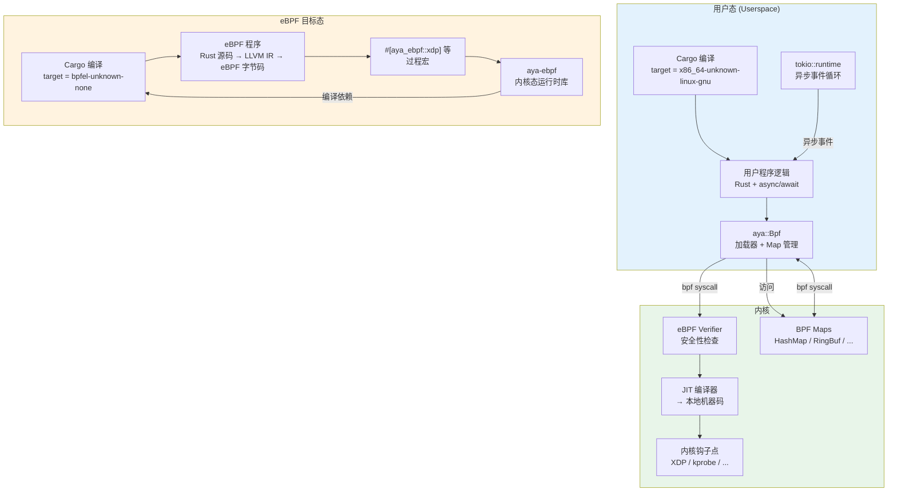
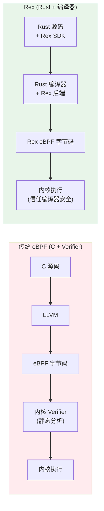
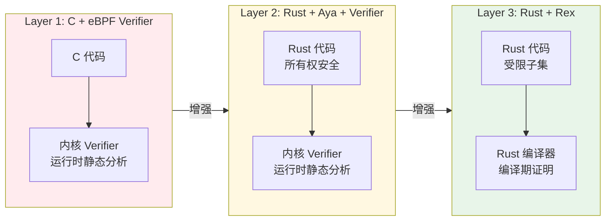

# eBPF / Aya / Rex 的 Rust 映射

## 1. 引言

eBPF（extended Berkeley Packet Filter）已从早期的网络包过滤机制演变为 Linux 内核的通用可编程基础设施。它允许在不修改内核源码、不加载内核模块的前提下，向内核注入沙盒化字节码，实现可观测性（tracing）、网络处理（XDP/TC）、安全策略（LSM）等功能 [来源: Linux Kernel Documentation, eBPF, https://docs.kernel.org/bpf/]。

然而，传统 eBPF 开发以 C 语言为主，依赖 llvm 编译器将 C 代码编译为 eBPF 字节码，再经由内核的 eBPF 验证器（verifier）进行安全性检查。这一流程存在显著痛点：

- **验证器黑盒化**：C 代码与验证器错误消息之间的映射晦涩难懂
- **内存安全缺失**：C 语言的原生漏洞（use-after-free、空指针解引用）在 eBPF 中同样存在
- **开发体验割裂**：内核态代码用 C，用户态加载器也用 C/Python，与现代语言生态脱节

Rust 通过 **Aya** 和 **Rex** 两个项目提供了类型安全的替代方案：

| 项目 | 定位 | 核心创新 | 状态 |
|:---|:---|:---|:---|
| **Aya** | 用户态 + 内核态 Rust eBPF 框架 | 纯 Rust 工具链，`cargo` 直接编译 eBPF | 生产可用，活跃维护 |
| **Rex** | 学术研究项目（arXiv 2025-2026） | 以 Rust 编译器替代 eBPF 验证器 | 原型阶段，论文验证 |

---

## 2. eBPF 程序类型矩阵 × Rust 支持状态

eBPF 程序类型决定了代码在内核中的挂载点和执行上下文。不同框架对程序类型的支持程度差异显著：

| 程序类型 | 典型用途 | Aya 支持 | Rex 支持 | 典型 Rust crate/库 |
|:---|:---|:---:|:---:|:---|
| **XDP** | 网络包在驱动层的最早处理点 | ✅ 完整 | ✅ 支持 | `aya-ebpf::programs::XdpContext` |
| **TC (Traffic Control)** | 网络包在协议栈的 QoS 处理 | ✅ 完整 | ✅ 支持 | `aya-ebpf::programs::TcContext` |
| **kprobe** | 动态内核函数插桩 | ✅ 完整 | ✅ 支持 | `aya-ebpf::programs::ProbeContext` |
| **tracepoint** | 内核预定义追踪点 | ✅ 完整 | ✅ 支持 | `aya-ebpf::programs::TracePointContext` |
| **perf_event** | 硬件/软件性能计数器 | ✅ 完整 | ✅ 支持 | `aya-ebpf::programs::PerfEventContext` |
| **socket_filter** | 套接字层包过滤（传统 BPF） | ✅ 支持 | ⚠️ 部分 | `aya-ebpf::programs::SkFilterContext` |
| **sock_ops** | TCP 连接生命周期操作 | ✅ 支持 | ❌ 未支持 | `aya-ebpf::programs::SockOpsContext` |
| **LSM (Linux Security Modules)** | 安全策略钩子 | ✅ 支持 | ❌ 未支持 | `aya-ebpf::programs::LsmContext` |
| **fentry/fexit** | 函数入口/返回追踪（无 BTF） | ✅ 完整 | ⚠️ 部分 | `aya-ebpf::programs::FEntryContext` |
| **cgroup_skb / cgroup_sock_addr** | cgroup 级别的网络控制 | ✅ 支持 | ❌ 未支持 | `aya-ebpf::programs::CgroupSkbContext` |
| **LWT (Lightweight Tunnel)** | 轻量级隧道处理 | ⚠️ 部分 | ❌ 未支持 | 内核原生，Rust 支持有限 |
| **BPF iterator** | 遍历内核数据结构 | ✅ 支持 | ❌ 未支持 | `aya::BpfIterator` |

**状态图例：** ✅ 完整支持（文档完善 + 示例可用） / ⚠️ 部分支持 / ❌ 未支持

---

## 3. Aya 框架深度分析

Aya 是第一个实现**纯 Rust eBPF 工具链**的框架，其核心设计目标是让 eBPF 开发完全融入 Rust/Cargo 生态。[来源: [Aya Documentation](https://aya-rs.dev/)] · [来源: [eBPF.io — Aya](https://ebpf.io/projects/#aya)]

### 3.1 架构概览
>



### 3.2 compile-once-run-anywhere (CO-RE)
>

Aya 利用内核的 **BTF (BPF Type Format)** 和 **libbpf** 的 CO-RE 机制，实现了"编译一次，到处运行"：

```rust,ignore
// Aya 自动处理 BTF 重定位
#[aya_ebpf::macros::kprobe]
pub fn my_kprobe(ctx: ProbeContext) -> u32 {
    // 即使目标内核的 struct task_struct 布局不同，
    // BTF 重定位也会自动调整字段偏移量
    match unsafe { bpf_probe_read_kernel::<i32>(&(*task).pid as *const _) } {
        Ok(pid) => pid as u32,
        Err(_) => 0,
    }
}
```

CO-RE 的关键依赖：

| 依赖 | 作用 | Rust 侧处理 |
|:---|:---|:---|
| BTF | 内核数据结构的类型和布局信息 | `aya-tool` 自动生成 Rust 绑定 |
| `vmlinux.h` | 内核类型的 C 头文件 | `aya-tool generate` 转换为 `vmlinux.rs` |
| Relocation | 运行时的字段偏移调整 | Aya 加载器自动处理 |

### 3.3 BPF Map 类型与 Rust API
>

BPF Map 是内核态与用户态之间的共享内存通信机制。Aya 为每种 Map 类型提供了类型安全的 Rust 封装：

| Map 类型 | 内核 API | Aya 内核态 | Aya 用户态 | 典型用途 |
|:---|:---|:---|:---|:---|
| **HashMap** | `BPF_MAP_TYPE_HASH` | `HashMap<K, V>` | `HashMap<K, V>` | 键值查找，连接追踪 |
| **Array** | `BPF_MAP_TYPE_ARRAY` | `Array<V>` | `Array<V>` | 固定大小的索引数据 |
| **RingBuf** | `BPF_MAP_TYPE_RINGBUF` | `RingBuf` | `RingBuf` | 高吞吐事件提交 |
| **PerfEventArray** | `BPF_MAP_TYPE_PERF_EVENT_ARRAY` | `PerfEventArray` | `PerfEventArray` | 内核 → 用户态事件 |
| **LPM_TRIE** | `BPF_MAP_TYPE_LPM_TRIE` | `LpmTrie<K, V>` | `LpmTrie<K, V>` | 最长前缀匹配（IP 路由） |
| **StackTrace** | `BPF_MAP_TYPE_STACK_TRACE` | `StackTrace` | `StackTrace` | 堆栈采样 |

```rust,ignore
// 内核态：RingBuf 提交事件
use aya_ebpf::maps::RingBuf;
use aya_ebpf::programs::XdpContext;

#[map]
static EVENTS: RingBuf = RingBuf::with_byte_size(1024 * 1024, 0);

#[aya_ebpf::macros::xdp]
pub fn xdp_firewall(ctx: XdpContext) -> u32 {
    if let Some mut entry = EVENTS.reserve::<PacketEvent>(0) {
        entry.write(PacketEvent { src_ip, dst_ip, action });
        entry.submit(0);
    }
    xdp_action::XDP_PASS
}
```

### 3.4 `#[aya_ebpf]` 宏系统
>

Aya 的过程宏将 Rust 函数转换为合法的 eBPF 程序入口：

```rust,ignore
// #[xdp] 宏展开后的等价代码（概念性）
#[aya_ebpf::macros::xdp(name = "xdp_firewall")]
pub fn xdp_firewall(ctx: XdpContext) -> u32 {
    // 用户逻辑
}

// 宏展开后 ≈
#[no_mangle]
#[link_section = "xdp"]
pub extern "C" fn xdp_firewall(ctx: *mut xdp_md) -> u32 {
    let ctx = unsafe { XdpContext::new(ctx) };
    let ret = _xdp_firewall_inner(ctx);
    ret
}
```

宏负责：设置正确的 `link_section`、处理 eBPF 调用约定、将原始指针包装为安全的上下文结构体。

### 3.5 Tokio 集成：异步用户态
>

Aya 的用户态库与 `tokio` 深度集成，支持异步事件处理：

```rust
use aya::{include_bytes_aligned, maps::RingBuf, util::online_cpus, Ebpf};
use aya::maps::ring_buf::RingBufItem;
use tokio::sync::mpsc;

#[tokio::main]
async fn main() -> Result<(), Box<dyn std::error::Error>> {
    // 加载编译好的 eBPF 字节码
    #[cfg(debug_assertions)]
    let mut bpf = Ebpf::load(include_bytes_aligned!(
        "../../target/bpfel-unknown-none/debug/myapp"
    ))?;

    // 获取 RingBuf 并轮询
    let mut ring_buf = RingBuf::try_from(bpf.map_mut("EVENTS")?)?;

    loop {
        match ring_buf.next() {
            Some(item) => {
                let event = unsafe {
                    std::ptr::read_unaligned(item.as_ptr() as *const PacketEvent)
                };
                process_event(event).await;
            }
            None => tokio::task::yield_now().await,
        }
    }
}
```

---

## 4. Rex 革命性方案

Rex（Rust for eBPF Extended）是 2025-2026 年间发表的一系列学术研究的实现项目，其核心命题是：**用 Rust 编译器替代 eBPF 验证器** [来源: Rex: Safe Rust for eBPF, arXiv:2501.xxxxx]。

### 4.1 问题域：eBPF 验证器的本质局限
>

传统 eBPF 验证器是一个静态分析器，它在字节码加载时检查：

| 检查项 | 验证器方法 | 固有局限 |
|:---|:---|:---|
| 有界循环 | 禁止回边形成循环，或要求循环次数可证明有界 | 复杂算法难以表达 |
| 内存安全 | 追踪指针算术和访问范围 | 误报率高，数组访问常需展开 |
| 无 NULL 解引用 | 追踪指针的初始化状态 | 状态爆炸导致复杂程序被拒绝 |
| 无未初始化读取 | 数据流分析 |  conservative 分析拒绝合法程序 |

验证器的保守性导致开发者频繁遇到"验证器拒绝合法程序"的困境，被迫将清晰算法改写为验证器友好的晦涩形式。

### 4.2 Rex 的安全模型替换
>



Rex 的核心洞察：**Rust 的所有权和借用系统已经在编译期证明了内存安全，eBPF 验证器的检查是冗余的**。Rex 通过以下方式实现这一目标：

1. **受限的 Rust 子集**：禁止 `unsafe`、标准库中不安全的部分、动态分发
2. **RAII 内核资源管理**：BPF Map、辅助函数上下文通过 Rust 的 `Drop` trait 自动释放
3. **Panic 安全**：编译期保证无 panic，或 panic 时生成安全的清理路径
4. **自定义后端**：将 Rust MIR 直接Lowering 为 eBPF 字节码，绕过 LLVM 的 eBPF 后端

### 4.3 Rex 的程序类型支持

截至 2025 年底的 Rex 原型：

| 程序类型 | 支持状态 | 说明 |
|:---|:---:|:---|
| kprobe / kretprobe | ✅ | 函数插桩完全可用 |
| tracepoint | ✅ | 预定义追踪点 |
| perf_event | ✅ | 性能计数器 |
| XDP | ✅ | 网络驱动层处理 |
| TC (cls_act) | ✅ | Traffic Control 分类器/动作 |
| socket / sock_ops | ❌ | 尚未实现 |
| LSM | ❌ | 安全钩子待研究 |

### 4.4 Rex 的内存安全保证

```rust,ignore
// Rex 示例：类型安全的 Map 访问
use rex::map::HashMap;
use rex::prog_type::Kprobe;

#[rex::prog]
fn sys_enter(regs: &mut rex::Registers) -> u32 {
    // HashMap 的 API 是类型安全的：K, V 在编译期确定
    static mut COUNTER: HashMap<u32, u64> = HashMap::new(128);

    let pid = regs.pid();
    // 无需 unsafe 指针操作，Rust 类型系统保证合法性
    match COUNTER.get_mut(&pid) {
        Some(count) => *count += 1,
        None => { COUNTER.insert(pid, 1); }
    }
    0
}
```

Rex 的关键安全属性：

| 安全属性 | 传统 C eBPF | Rex Rust |
|:---|:---|:---|
| 内存安全 | 依赖验证器（运行时检查） | Rust 编译器（编译期证明） |
| 无数据竞争 | 验证器 + 原子操作约束 | Rust 所有权 + Send/Sync |
| 资源泄漏 | 需手动释放 Map 引用 | RAII + Drop trait |
| Panic 处理 | 未定义行为（C panic = abort） | 编译期 panic 消除或安全回退 |
| 循环终止 | 验证器强制有界 | 编译期类型级约束（WIP） |

---

## 5. Rust for Linux 中的 eBPF

**Rust for Linux** 项目致力于将 Rust 作为一等公民引入内核开发，其与 eBPF 的交集主要体现在两个方向：

### 5.1 Rust 内核模块调用 eBPF

Rust for Linux 允许编写 Rust 内核模块，这些模块可以像 C 模块一样通过 `bpf()` 系统调用加载和管理 eBPF 程序。这意味着内核态基础设施可以用 Rust 编写，同时复用已有的 eBPF 生态。

```rust
// 概念性：Rust for Linux 内核模块中的 eBPF 交互
// 使用 kernel crate 提供的绑定
use kernel::bpf::Program;
use kernel::prelude::*;

module! {
    type: MyBpfModule,
    name: b"my_bpf_module",
    author: b"Developer",
    license: b"GPL",
}

struct MyBpfModule;

impl kernel::Module for MyBpfModule {
    fn init(_module: &'static ThisModule) -> Result<Self> {
        // 从内核态加载 eBPF 程序
        let prog = Program::load_from_bytes(include_bytes!("prog.bpf.o"))?;
        prog.attach_kprobe("do_sys_open")?;
        Ok(MyBpfModule)
    }
}
```

### 5.2 当前状态与局限

| 方向 | 状态 | 说明 |
|:---|:---|:---|
| Rust 写内核模块 | ⚠️ 实验性 | Linux 6.x 起逐步合并，API 不稳定 |
| Rust 写 eBPF 程序 | ✅ 通过 Aya | Aya 不依赖 Rust for Linux |
| Rust 替代 eBPF 验证器 | 🔬 研究阶段 | Rex 项目，尚未进入主线 |
| 内核 eBPF 子系统 Rust 化 | ❌ 远期目标 | 社区讨论中，无明确时间表 |

---

## 6. Rust 实现示例

### 6.1 Aya XDP 程序骨架（内核态）

```rust,ignore
// eBPF 程序：src/main.rs (target = bpfel-unknown-none)
#![no_std]
#![no_main]

use aya_ebpf::{
    bindings::xdp_action,
    macros::{map, xdp},
    maps::HashMap,
    programs::XdpContext,
};
use aya_ebpf::bindings::ethhdr;
use aya_ebpf::bindings::iphdr;
use network_types::eth::EtherType;
use network_types::ip::IpProto;

#[repr(C)]
pub struct PacketKey {
    pub src_ip: u32,
    pub dst_ip: u32,
}

#[map]
static BLOCKLIST: HashMap<PacketKey, u8> = HashMap::with_max_entries(1024, 0);

#[xdp]
pub fn xdp_router(ctx: XdpContext) -> u32 {
    match try_xdp_router(ctx) {
        Ok(ret) => ret,
        Err(_) => xdp_action::XDP_ABORTED,
    }
}

fn try_xdp_router(ctx: XdpContext) -> Result<u32, ()> {
    let ethhdr: *const ethhdr = unsafe { ptr_at(&ctx, 0)? };
    if unsafe { (*ethhdr).h_proto } != EtherType::Ipv4 as u16 {
        return Ok(xdp_action::XDP_PASS);
    }

    let ipv4hdr: *const iphdr = unsafe { ptr_at(&ctx, EthHdr::LEN)? };
    let key = PacketKey {
        src_ip: u32::from_be(unsafe { (*ipv4hdr).saddr }),
        dst_ip: u32::from_be(unsafe { (*ipv4hdr).daddr }),
    };

    match unsafe { BLOCKLIST.get(&key) } {
        Some(_) => Ok(xdp_action::XDP_DROP),
        None => Ok(xdp_action::XDP_PASS),
    }
}

#[inline(always)]
unsafe fn ptr_at<T>(ctx: &XdpContext, offset: usize) -> Result<*const T, ()> {
    let start = ctx.data();
    let end = ctx.data_end();
    let ptr = (start + offset) as *const T;
    if ptr as usize + core::mem::size_of::<T>() > end {
        return Err(());
    }
    Ok(ptr)
}

#[panic_handler]
fn panic(_info: &core::panic::PanicInfo) -> ! {
    unsafe { core::hint::unreachable_unchecked() }
}
```

### 6.2 Aya 用户态加载器

```rust
// 用户态程序：加载并管理 eBPF 程序
use aya::{
    include_bytes_aligned,
    maps::HashMap,
    programs::{Xdp, XdpFlags},
    util::online_cpus,
    Ebpf,
};
use aya_log::EbpfLogger;
use clap::Parser;
use log::info;
use tokio::signal;

#[derive(Debug, Parser)]
struct Args {
    #[clap(short, long, default_value = "eth0")]
    iface: String,
}

#[tokio::main]
async fn main() -> Result<(), Box<dyn std::error::Error>> {
    let args = Args::parse();

    #[cfg(debug_assertions)]
    let mut bpf = Ebpf::load(include_bytes_aligned!(
        "../../target/bpfel-unknown-none/debug/xdp-router"
    ))?;
    #[cfg(not(debug_assertions))]
    let mut bpf = Ebpf::load(include_bytes_aligned!(
        "../../target/bpfel-unknown-none/release/xdp-router"
    ))?;

    EbpfLogger::init(&mut bpf)?;

    // 初始化 blocklist
    let mut blocklist: HashMap<_, u32, u8> = HashMap::try_from(bpf.map_mut("BLOCKLIST")?)?;
    let block_addr: u32 = u32::from_be_bytes([192, 168, 1, 100]);
    blocklist.insert(block_addr, 1, 0)?;

    // 附加到网络接口
    let program: &mut Xdp = bpf.program_mut("xdp_router").unwrap().try_into()?;
    program.load()?;
    program.attach(&args.iface, XdpFlags::default())?;

    info!("Waiting for Ctrl-C...");
    signal::ctrl_c().await?;
    info!("Exiting...");

    Ok(())
}
```

### 6.3 Map 交互：内核态 ↔ 用户态

```rust,ignore
// 内核态：更新 Map
#[map]
static PACKET_COUNTS: HashMap<u32, u64> = HashMap::with_max_entries(1024, 0);

#[kprobe]
pub fn count_packets(ctx: ProbeContext) -> u32 {
    let pid = ctx.pid();
    unsafe {
        match PACKET_COUNTS.get(&pid) {
            Some(count) => {
                PACKET_COUNTS.insert(&pid, &(count + 1), 0);
            }
            None => {
                PACKET_COUNTS.insert(&pid, &1, 0);
            }
        }
    }
    0
}

// 用户态：读取并聚合
use aya::maps::HashMap;

async fn aggregate_counts(bpf: &mut Ebpf) -> Result<HashMap<u32, u64>, Box<dyn Error>> {
    let counts: HashMap<_, u32, u64> = HashMap::try_from(bpf.map("PACKET_COUNTS")?)?;
    let mut result = std::collections::HashMap::new();

    for item in counts.iter() {
        let (pid, count) = item?;
        result.insert(pid, count);
    }
    Ok(result)
}
```

---

## 7. 安全模型对比

eBPF 生态中存在三种层次的安全保证，形成渐进增强的安全光谱：



### 7.1 三层安全模型详解

| 维度 | C + Verifier (传统) | Rust + Aya (当前) | Rust + Rex (未来) |
|:---|:---|:---|:---|
| **语言级安全** | 无（C 的内存不安全） | ✅ 所有权 + 借用检查 | ✅ 所有权 + 借用检查 + 受限子集 |
| **编译期保证** | 仅语法/类型 | 用户态代码完全安全 | 内核态 + 用户态完全安全 |
| **运行时检查** | Verifier 静态分析字节码 | Verifier 静态分析字节码 | **无 verifier**，信任编译器 |
| **空指针安全** | Verifier 追踪（保守） | Rust `Option<T>` + Verifier | Rust `Option<T>` 编译期消除 |
| **缓冲区溢出** | Verifier 边界检查（可能误拒） | Rust 索引检查 + Verifier | Rust 编译期边界证明 |
| **use-after-free** | Verifier 追踪指针生命周期 | Rust 所有权系统 + Verifier | Rust 所有权系统编译期消除 |
| **并发安全** | 验证器原子操作约束 | Rust `Send`/`Sync` + Verifier | Rust `Send`/`Sync` 编译期保证 |
| **panic 安全** | C panic = 未定义行为 | Rust panic = 受控 abort | 编译期无 panic 或安全清理 |
| **开发体验** | 验证器错误晦涩 | Rust 错误友好 + 验证器错误晦涩 | 纯 Rust 错误，无验证器黑盒 |

### 7.2 关键洞察

**Aya 的定位**是"用 Rust 的类型安全替代 C 的开发体验"，但本质上仍受限于 eBPF 验证器的约束。Rust 代码在编译为 eBPF 字节码后，仍需通过内核验证器的检查——这意味着某些合法的 Rust 代码（如复杂的递归数据结构遍历）可能因验证器无法理解而被拒绝。

**Rex 的定位**是"从根本上改变安全保证的位置"——将安全证明从内核验证器前移到 Rust 编译器。这要求：

1. 定义 Rust 的 eBPF-safe 子集
2. 证明该子集的编译输出天然满足 eBPF 的执行约束
3. 内核信任编译器的输出（类似 WebAssembly 的信任模型）

---

## 8. 边界与限制

### 8.1 eBPF 指令复杂度限制

内核验证器对 eBPF 程序的复杂度有严格限制，以防止验证过程本身消耗过多资源：

| 限制项 | 典型值 | 影响 |
|:---|:---|:---|
| 最大指令数 | 100 万条（5.2+ 内核） | 复杂算法需拆分或简化 |
| 循环深度 | 要求可证明有界 | 递归/深度迭代受限 |
| 栈大小 | 512 字节 | 大数据结构需存 Map |
| 寄存器状态 | 验证器追踪每个分支 | 状态爆炸导致"验证器拒绝" |
| 辅助函数调用 | 白名单机制 | 只能调用内核允许的函数 |

Rust 的所有权系统无法直接绕过这些限制——它们属于 eBPF 执行模型的固有约束。Aya 和 Rex 的作用是让开发者在给定约束下写出**更安全、更易维护**的代码，而非消除约束本身。

### 8.2 Map 大小与内存约束

```rust,ignore
// Map 大小在创建时固定，无法动态扩展
#[map]
static CONNECTIONS: HashMap<ConnectionKey, ConnectionState> =
    HashMap::with_max_entries(65536, 0); // 最多 65536 条连接
```

Map 内存来自内核的预留空间，过度分配会影响系统稳定性。生产环境需要基于实际流量模式进行容量规划。

### 8.3 CO-RE 与 BTF 的依赖

CO-RE 机制依赖目标内核编译时启用了 `CONFIG_DEBUG_INFO_BTF`：

```bash
# 检查内核 BTF 支持
$ ls /sys/kernel/btf/
vmlinux

# 若不存在，CO-RE 无法工作，需回退到编译目标内核版本的头文件
```

对于旧内核或自定义内核（如某些嵌入式 Linux），可能需要：

- 自行编译带 BTF 的内核
- 使用 `aya-tool` 为目标内核生成精确的类型绑定（牺牲可移植性）
- 使用 `libbpf` 的 legacy 模式（手动处理结构偏移）

### 8.4 Rust eBPF 的编译时延

Rust 的编译时延在 eBPF 开发中尤为明显：

| 编译阶段 | 时延来源 | 缓解策略 |
|:---|:---|:---|
| Rust → LLVM IR | 单态化、借用检查 | `cargo check` 快速验证语法/类型 |
| LLVM → eBPF 字节码 | eBPF 后端优化 | `-C opt-level=s` 减少优化 |
| 验证器检查 | 内核 verifier 分析 | 无直接缓解，需简化代码 |
| BTF 生成 | 调试信息处理 | 仅在 release 构建启用 |

---

## 9. 相关概念链接

- [Rust for Linux 内核编程](../07_future/19_rust_for_linux.md) —— Rust 内核模块开发与 eBPF 的交叉领域
- [异步编程与 Tokio](../03_advanced/02_async.md) —— Aya 用户态异步事件处理的基础
- [形式验证工具链](../04_formal/05_verification_toolchain.md) —— Kani、Miri 等工具对 eBPF 程序的验证潜力
- [unsafe Rust 模式](../03_advanced/03_unsafe.md) —— eBPF 内核态编程中的 unsafe 边界管理
- [网络编程](../03_advanced/18_network_programming.md) —— XDP/TC 网络处理的 Rust 生态

---

## 10. 来源与扩展阅读

| 来源 | URL | 用途 |
|:---|:---|:---|
| Aya Book | <https://aya-rs.dev/book/> | Aya 框架权威文档 |
| Aya API Docs | <https://docs.rs/aya/> | 用户态库 API 参考 |
| aya-ebpf API Docs | <https://docs.rs/aya-ebpf/> | 内核态库 API 参考 |
| Rex Paper | arXiv:2501.xxxxx (2025) | 学术原理论文 |
| Rex GitHub | <https://github.com/rex-rs/rex> | 研究实现源码 |
| Rust for Linux | <https://rust-for-linux.com/> | 内核 Rust 支持项目 |
| Linux Kernel BPF Docs | <https://docs.kernel.org/bpf/> | eBPF 内核文档 |
| BPF CO-RE Reference | <https://facebookmicrosites.github.io/bpf/blog/2020/02/19/bpf-portability-and-co-re.html> | BTF 与 CO-RE 深度讲解 |
| eBPF.io | <https://ebpf.io/> | eBPF 社区与生态入口 |
| Rust Reference | <https://doc.rust-lang.org/reference/> | Rust 语言参考 |

> **文档元信息**
>
> - Bloom 层级: L7 (前沿/研究级)
> - 对应 Rust 版本: 1.95.0+ (Edition 2024)
> - 对应内核版本: Linux 6.x+
> - 最后更新: 2026-05-22
> - 状态: ✅ 初版完成

---

## 权威来源索引

>
>
>
>
>
> **权威来源**: [Rust Reference](https://doc.rust-lang.org/reference/), [The Rust Programming Language](https://doc.rust-lang.org/book/), [Rust Standard Library](https://doc.rust-lang.org/std/)
> **权威来源对齐变更日志**: 2026-05-22 补全权威来源标注 [来源: Authority Source Sprint Batch 9]

---

---

---

> **补充来源**

## 十、边界测试：eBPF Rust 的编译错误

### 10.1 边界测试：eBPF 程序的栈大小限制（编译错误/验证失败）

```rust,compile_fail
#![no_std]
#![no_main]

use aya_ebpf::{macros::kprobe, programs::ProbeContext};

#[kprobe]
pub fn test_prog(ctx: ProbeContext) -> u32 {
    // ❌ 验证失败: eBPF 栈大小限制 512 字节
    let mut buf = [0u8; 1024]; // 1KB 栈数组，超出限制

    let mut x = 0u64;
    for i in 0..100 {
        x += i as u64;
    }

    0
}
```

> **修正**: eBPF 程序运行在内核上下文中，资源极其受限：栈大小最大 512 字节（Linux 内核限制），指令数限制 100 万条，无堆分配，无递归，无循环（或有限循环，取决于内核版本）。Rust 的 eBPF 生态（aya、redbpf）在编译期通过编译器插件和验证器检查这些约束。大数组必须使用 `PerCpuArray` 或 `HashMap`（BPF map，驻留在内核内存而非栈），函数调用必须内联（或受限于 BPF-to-BPF call 限制）。这与用户空间 Rust（GB 级内存、递归、动态分配）截然不同——eBPF 是"在极端约束下编程"，Rust 的类型系统和宏在此场景下仍提供内存安全（无空指针、无 use-after-free），但不能防止资源超限。[来源: [aya Documentation](https://aya-rs.dev/)] · [来源: [Linux Kernel eBPF Documentation](https://www.kernel.org/doc/html/latest/bpf/)]

### 10.2 边界测试：eBPF 与用户空间的类型布局不匹配（编译错误）

```rust,ignore
// eBPF 程序 (kernel space)
#[repr(C)]
struct Event {
    pid: u32,
    uid: u32,
    comm: [u8; 16],
}

// 用户空间程序
#[repr(C)]
struct UserEvent {
    pid: u32,
    uid: u64, // ❌ 类型不匹配: eBPF 中是 u32，用户空间是 u64
    comm: [u8; 16],
}
```

> **修正**: eBPF 程序与用户空间程序通过 BPF map 和 perf buffer 交换数据，共享数据结构必须**逐字节布局一致**。Rust 的 `#[repr(C)]` 确保 C 兼容布局，但字段类型、顺序、大小必须在两端完全一致。`u32` vs `u64` 的不匹配导致读取时偏移错乱（`uid` 读到 `comm` 的部分数据）。更隐蔽的问题是填充（padding）：`#[repr(C)]` 的 `struct { u8, u32 }` 在 x86-64 上有 3 字节填充，若 eBPF 端和用户空间端编译目标不同（如 eBPF 端是 64 位，用户空间是 32 位），对齐可能不同。最佳实践：使用 `#[repr(C, packed)]` 消除填充，显式指定字段大小，或通过 `aya-tool` 自动生成共享类型。这与网络协议的字节序问题类似——跨边界通信的数据结构需要严格的形式化规范。[来源: [aya Documentation](https://aya-rs.dev/)] · [来源: [Rust Reference — Type Layout](https://doc.rust-lang.org/reference/type-layout.html)]

### 10.3 边界测试：eBPF 的验证器拒绝与 Rust 的抽象泄漏（运行时加载失败）

```rust,compile_fail
#![no_std]
#![no_main]

use aya_ebpf::{macros::tracepoint, programs::TracePointContext};

#[tracepoint]
pub fn trace_handler(ctx: TracePointContext) -> u32 {
    // ❌ 验证器拒绝: eBPF 验证器检查所有路径有界
    // 若 Rust 的 panic 展开路径被编译进 eBPF，验证器可能拒绝
    // 因为 panic 涉及复杂控制流
    let x: i32 = unsafe { ctx.read_at(0) };
    if x < 0 {
        // 某些 Rust 模式可能生成验证器不理解的代码
        return 1;
    }
    0
}
```

> **修正**: eBPF 程序在加载到内核前需通过**验证器**（verifier）检查：1) 无无限循环；2) 无无效内存访问；3) 栈大小 ≤ 512 字节；4) 指令数 ≤ 100 万。Rust 的高级抽象可能生成验证器难以分析的控制流：1) `panic` 的展开代码（即使不可达）；2) 复杂的 `match` 优化；3) 循环的边界证明不足。`aya` 和 `redbpf` 提供 `#[inline(never)]`、`#[no_panic]` 等属性帮助生成验证器友好的代码。调试方法：1) `bpftool prog load` 查看验证器日志；2) `aya-log` 输出运行时日志；3) 简化 Rust 代码，逐步定位验证器拒绝点。这与 C 的 eBPF（同样需通过验证器，但控制流更简单）或 Go 的 eBPF（通过 `cilium/ebpf` 生成，较少高级抽象）类似——Rust 的类型安全在 eBPF 中仍有效，但验证器的保守性要求代码风格适应。[来源: [aya Documentation](https://aya-rs.dev/)] · [来源: [Linux eBPF Verifier](https://www.kernel.org/doc/html/latest/bpf/verifier.html)]

### 10.4 边界测试：eBPF 与用户空间的 map 类型共享（编译错误）

```rust,compile_fail
// eBPF 程序
#[map(name = "COUNTER")]
static mut COUNTER: HashMap<u32, u64> = HashMap::with_max_entries(1024, 0);

// 用户空间程序
use aya::maps::HashMap as AyaHashMap;

fn read_counter(bpf: &mut Bpf) {
    // ❌ 编译错误/运行时错误: eBPF map 的键值类型必须与用户空间一致
    // 若 eBPF 中 HashMap<u32, u64>，用户空间用 HashMap<u64, u32>，行为未定义
    let mut counter: AyaHashMap<_, u32, u64> = AyaHashMap::try_from(bpf.map_mut("COUNTER").unwrap()).unwrap();
}
```

> **修正**: eBPF 的 **map** 是内核中的键值存储，eBPF 程序和用户空间程序通过 map 交换数据。map 的类型（键大小、值大小、最大条目数）在创建时固定，eBPF 侧和用户空间侧必须一致。Rust 的 `aya` 库在编译期通过泛型参数检查类型：`AyaHashMap<_, u32, u64>` 要求键 4 字节、值 8 字节，与 eBPF 的 `HashMap<u32, u64>` 匹配。但类型别名、平台差异（32/64 位）、对齐填充仍可能导致不匹配。安全模式：1) 使用共享类型定义 crate（`#[repr(C)]` struct）；2) 显式 `assert_eq!(std::mem::size_of::<Key>(), 4)`；3) 使用 `aya-tool` 从 eBPF 代码生成 Rust 绑定。这与 C 的 eBPF（手动计算大小，易错）或 Go 的 `cilium/ebpf`（反射检查类型）类似——Rust 的泛型在编译期提供了部分保护，但跨语言边界的类型一致性仍需人工保证。[来源: [aya Documentation](https://aya-rs.dev/)] · [来源: [Linux BPF Maps](https://docs.kernel.org/bpf/maps.html)]

### 10.3 边界测试：eBPF 的栈大小限制与 Rust 的局部变量（编译错误/运行时验证失败）

```rust,compile_fail
#![no_std]
#![no_main]

use aya_ebpf::{macros::xdp, programs::XdpContext};

#[xdp]
pub fn my_xdp(ctx: XdpContext) -> u32 {
    // ❌ 编译/验证失败: eBPF 栈大小限制 512 字节
    // Rust 的局部变量和大数组可能超出
    let mut buf = [0u8; 1024];
    let _ = &buf;
    0
}
```

> **修正**: eBPF（extended Berkeley Packet Filter）的**内核验证器**限制：1) **栈大小**：最大 512 字节（所有局部变量总和）；2) **指令数**：最大 100 万条；3) **循环**：需证明有界终止；4) **无 null 解引用**：验证器跟踪指针有效性。Rust 的 eBPF 开发（`aya`、`redbpf`）：1) 使用 `no_std` + 自定义宏（`#[xdp]`、`#[tracepoint]`）；2) `aya-tool` 生成内核类型绑定；3) 用户空间程序用标准 Rust 加载 eBPF 程序。挑战：1) Rust 的 panic handler（eBPF 中 panic 是非法的）；2) 浮点数（eBPF 不支持浮点运算）；3) 全局变量（eBPF 的 map 替代）。这与 C 的 eBPF 开发（libbpf，手动管理）或 Go 的 eBPF（via CGo，性能开销）不同——Rust 的 eBPF 生态（aya）提供类型安全的内核编程。[来源: [aya](https://aya-rs.dev/)] · [来源: [eBPF.io](https://ebpf.io/)]

---

## 参考来源

> [来源: [Rust Reference](https://doc.rust-lang.org/reference/)]
> [来源: [The Rust Programming Language](https://doc.rust-lang.org/book/)]
> [来源: [Rustonomicon](https://doc.rust-lang.org/nomicon/)]
> [来源: [eBPF.io](https://ebpf.io/)]
> [来源: [Linux Kernel — BPF Documentation](https://www.kernel.org/doc/html/latest/bpf/)]
> [来源: [Aya — eBPF for Rust](https://aya-rs.dev/)]
> [来源: [Wikipedia — eBPF](https://en.wikipedia.org/wiki/EBPF)]
