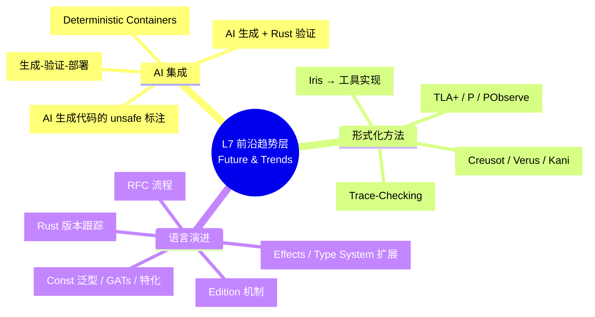
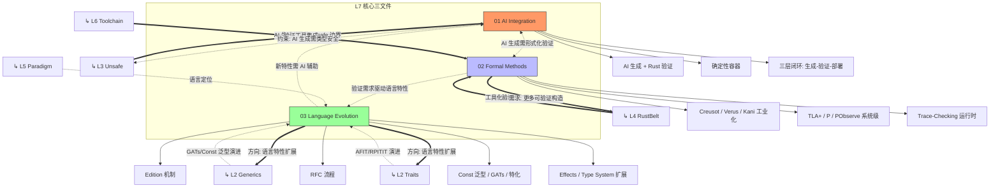

# L7 前沿趋势层（Future & Trends）

> **内容分级**: [综述级]
> **受众**: [专家]
>
> **定位**：Rust 在 AI 时代、形式化方法工业化、分布式系统形式化等前沿方向的**演进预测**与**需求驱动**。本层是知识体系的"前锋"，反向约束下层设计。
> **Bloom 层级**: 评价 → 创造
> **功能**: 预测演进方向，反向驱动 L1-L6 的更新
> **[来源: Rust RFCs - github.com/rust-lang/rfcs]** · **[来源: Rust Blog - blog.rust-lang.org]** · **[来源: Wikipedia - Artificial Intelligence]** · **[来源: Formal Methods Industry Reports 2026]**
> **定理链**: N/A — 描述性/综述性/导航性文档，不涉及形式化定理链
---

## 〇、L7 认知入口



> **认知功能**: 本 mindmap 作为 L7 层的**全景导航图**，帮助学习者建立前沿领域的顶层心智模型。
> **使用建议**: 从三大分支（AI 集成、形式化方法、语言演进）中选择切入点，再深入对应子文件。
> **关键洞察**: AI、形式化、演进并非孤立趋势，而是相互约束、共同塑造 Rust 未来形态的**协同三角**。
> [来源: 💡 原创分析]
> **认知路径**: 本 mindmap 展示 L7 层的**演进预测**。
> AI 集成反向约束 L3 Unsafe 的精确性，形式化方法工业化为 L4 RustBelt 提供工具出口，语言演进扩展 L2 的泛型和 Trait 系统。
> L7 的独特特征：**反向驱动**——不是 L1-L6 的递进，而是对下层的反馈和约束。

## 一、本层概念关系图（完整版）



> **认知功能**: 本图揭示 L7 与 L1-L6 的**反向驱动机制**——L7 不是知识终点，而是向下层输出约束的反馈源。
> **使用建议**: 关注虚线/实线箭头的语义差异（`-.->` 约束 vs `==>` 需求），理解反向依赖的强弱层级。
> **关键洞察**: L7 内部三领域（AI、形式化、演进）自身形成闭环，同时向下层扩散，构成**双层循环结构**。

### 1.1 概念间语义链接

| 关系 | 从 | 到 | 语义类型 | 说明 |
|:---|:---|:---|:---|:---|
| 1 | **AI Integration** | **L3 Unsafe** | `-.->` 反向约束 | AI 生成代码时，必须**显式标注** unsafe 边界。这要求 unsafe 概念的定义足够精确，可被 AI 理解和遵循。 |
| 2 | **Formal Methods** | **L4 RustBelt** | `==>` 需求/工具化 | 工业级验证需求推动 RustBelt 理论向工具（Kani/Verus）转化，降低形式化验证门槛。 |
| 3 | **Language Evolution** | **L2 Generics/Traits** | `==>` 扩展驱动 | 语言演进（如 GATs、AFIT、Effects）直接扩展 L2 的泛型和 Trait 系统。 |
| 4 | **L5 Paradigm** | **Evolution** | `-.->` 定位/约束 | 范式矩阵中 Rust 的定位（系统编程 + 形式化安全）约束了演进方向：不会添加 GC，但可能增强 async/Effects。 |

### 1.2 L7 的"反向驱动"特征

```text
传统知识流: L1 → L2 → L3 → L4 → L5 → L6 → L7（递进）
反向驱动流: L7 ──────────────────────────────→ L1-L6（反馈）

    AI 代码生成需求
        │
        ├──→ 要求 unsafe 契约更精确 → 影响 L3 Unsafe 文档
        ├──→ 要求类型系统更易推断 → 影响 L2 Generics 设计
        └──→ 要求错误信息更友好 → 影响 L1 编译器诊断

    形式化方法工业化
        │
        ├──→ 要求更多可验证构造 → 影响 L4 形式化范围
        ├──→ 要求验证工具集成 CI → 影响 L6 工具链
        └──→ 要求 unsafe 代码可部分验证 → 影响 L3 Unsafe 边界

    语言演进
        │
        ├──→ GATs / Effects → 影响 L2 Trait/Generics
        ├──→ Edition 机制 → 影响 L5 对比分析（向后兼容）
        └──→ 新并发模型 → 影响 L3 Concurrency
```

---

## 二、文件索引与关系

| 文件 | 概念 | 核心内容 | 状态 | 依赖的 L1-L6 | 反向驱动 |
|:---|:---|:---|:---|:---|:---|
| [01_ai_integration.md](./01_ai_integration.md) | AI × Rust | 生成-验证闭环、AI 语义安全网、确定性容器 | ✅ v1.0 | L3 Unsafe, L4 RustBelt, L6 工具链 | L3 Unsafe 契约精确化 |
| [02_formal_methods.md](./02_formal_methods.md) | 形式化方法工业化 | Code-Level + System-Level 验证、PObserve、CI 集成 | ✅ v1.0 | L4 RustBelt, L6 工具链, L3 Unsafe | L4 验证范围扩展 |
| [03_evolution.md](./03_evolution.md) | 语言演进 | Edition、RFC、Const 泛型、GATs、Effects、特化 | ✅ v1.0 | L2 Trait/Generics, L5 范式定位 | L2 特性扩展 |
| [05_rust_version_tracking.md](./05_rust_version_tracking.md) | 版本特性演进 | 1.79–1.95+ 形式模型维度跟踪、五个趋势、前沿矩阵 | ✅ v1.0 | L1-L4 全部概念 | L1-L4 概念更新驱动 |
| [25_open_enums_preview.md](./25_open_enums_preview.md) | 开放枚举预研 | `#[non_exhaustive]` 形式化语义、跨语言对比、API 设计模式 | ✅ v1.0 | L1 Type System, L2 Traits | L1 穷尽性检查语义演进 |
| [20_borrowsanitizer_preview.md](./20_borrowsanitizer_preview.md) | BorrowSanitizer 预研 | Shadow Stack、运行时借用检查、与 Miri 对比 | ✅ v1.0 | L3 Unsafe, L1 Ownership | L3 Unsafe 检测工具化 |
| [07_mcdc_coverage_preview.md](./07_mcdc_coverage_preview.md) | MC/DC Coverage 预研 | 安全关键覆盖率验证、DO-178C/ISO 26262 合规 | ✅ v1.0 | L3 Unsafe, L1 Type System | L6 安全关键应用 |
| [08_safety_tags_preview.md](./08_safety_tags_preview.md) | Safety Tags 预研 | Unsafe 契约机器可读标注、AI 生成安全边界 | ✅ v1.0 | L3 Unsafe, L1 Ownership | L3 Unsafe 契约工具化 |
| [09_parallel_frontend_preview.md](./09_parallel_frontend_preview.md) | 并行前端编译预研 | 查询系统并行化、类型检查并行化、编译时间优化 | ✅ v1.0 | L6 Toolchain, L3 Concurrency | L6 编译工具链性能演进 |
| [10_derive_coerce_pointee_preview.md](./10_derive_coerce_pointee_preview.md) | 派生 CoercePointee 预研 | 智能指针自动类型强制、零 unsafe 代码 | ✅ v1.0 | L2 Generics, L3 Unsafe | L3 Unsafe 代码消除 |
| [11_const_trait_impl_preview.md](./11_const_trait_impl_preview.md) | Const Trait Impl 预研 | 常量上下文 Trait 泛化、~const 效果限定 | ✅ v1.0 | L2 Trait, L1 Type System | L2 Trait 编译期扩展 |
| [12_return_type_notation_preview.md](./12_return_type_notation_preview.md) | Return Type Notation 预研 | use<..> 精确捕获、生命周期显式控制 | ✅ v1.0 | L2 Trait, L3 Async | L3 Async API 稳定性 |
| [13_unsafe_fields_preview.md](./13_unsafe_fields_preview.md) | Unsafe Fields 预研 | 字段级 unsafe 标记、安全边界细化 | ✅ v1.0 | L3 Unsafe, L1 Ownership | L3 Unsafe 粒度细化 |
| [14_ferrocene_preview.md](./14_ferrocene_preview.md) | Ferrocene 预研 | Rust 安全关键认证工具链、ISO 26262 / DO-178C | ✅ v1.0 | L6 Toolchain, L7 Future | L6 安全关键工具链 |
| [15_gen_blocks_preview.md](./15_gen_blocks_preview.md) | Gen Blocks 预研 | 泛化生成器、惰性迭代、异步流 | ✅ v1.0 | L3 Async, L2 Trait | L3 控制流泛化 |
| [16_cranelift_backend_preview.md](./16_cranelift_backend_preview.md) | Cranelift 后端预研 | 快速调试编译、LLVM 替代后端 | ✅ v1.0 | L6 Toolchain | L6 编译工具链扩展 |
| [17_rust_specification_preview.md](./17_rust_specification_preview.md) | Rust 语言规范预研 | 形式化规范演进、Ferrocene 先行探索 | ✅ v1.0 | L4 Formal, L7 Future | L4-L7 规范桥梁 |
| [18_async_drop_preview.md](./18_async_drop_preview.md) | Async Drop 预研 | 异步资源销毁、[RFC 3308](https://rust-lang.github.io/rfcs/3308.html)、Pin 交互、workaround 模式 | ⚠️ nightly | L3 Async, L3 Pin | 异步生态完善 |
| [26_specialization_preview.md](./26_specialization_preview.md) | Specialization 预研 | Trait 实现特化、重叠 impl、min_specialization | ⚠️ nightly | L2 Trait, L2 Generics | 泛型表达能力扩展 |
| [04_effects_system.md](./04_effects_system.md) | 效果系统预研 | Effect 类型论、Rust 现有 effect 映射、跨语言对比、演进路线 | ✅ v1.0 | L2 Trait, L3 Async, L4 Type Theory | L2-L3 效果统一化 |

---

### 补充文件索引

- [Stable ABI Preview](./11_stable_abi_preview.md)
- [Inline Const Pattern Preview](./12_inline_const_pattern_preview.md)
- [`must_not_suspend` Lint Preview](./13_must_not_suspend_preview.md)
- [Lifetime Capture in `impl Trait` Preview](./14_lifetime_capture_preview.md)
- [RPITIT Preview](./15_rpitit_preview.md)
- [TAIT Preview](./16_type_alias_impl_trait_preview.md)
- [Arbitrary Self Types 预览：自定义方法接收器](./17_arbitrary_self_types_preview.md)
- [Const Trait Preview](./17_const_trait_preview.md)
- [Field Projections 预览：安全的字段级投影](./18_field_projections_preview.md)
- [Rust 2024 Edition Preview](./19_rust_edition_preview.md)
- [Rust for Linux ：操作系统内核中的内存安全](./19_rust_for_linux.md)
- [Rust 在 AI 与机器学习中的新兴角色](./21_rust_in_ai.md)
- [Edition 2024 完全指南：新特性与迁移策略](./22_edition_guide.md)
- [Gen Blocks Preview](./22_gen_blocks_preview.md)
- [`std::autodiff`：Rust 官方自动微分前沿追踪](./22_std_autodiff_preview.md)
- [Rust Edition 机制与迁移指南](./23_rust_edition_guide.md)
- [Rust 2027 Edition 及未来路线图](./24_roadmap.md)
- [WASM Target Evolution Preview](./24_wasm_target_evolution.md)
- [cargo-semver-checks 预览：从社区工具到 Cargo 官方集成](./24_cargo_semver_checks_preview.md)
- [AArch64 SVE / SME 预览：可伸缩向量扩展](./25_aarch64_sve_sme_preview.md)
- [Rust in Space Preview](./26_rust_in_space.md)
- [编译期执行与常量求值](./27_compile_time_execution.md)
- [Rust for WebAssembly：从 wasm-bindgen 到前端框架的深度技术栈](./28_rust_for_webassembly.md)
- [eBPF / Aya / Rex 的 Rust 映射](./29_ebpf_rust.md)
- [Rust 1.97 前沿特性预览](./rust_1_97_preview.md)

## 三、前沿方向与下层关联

| L7 方向 | 关联下层 | 关联方式 | 预测 |
|:---|:---|:---|:---|
| **并行前端编译** | L6 Toolchain | 利用多核 CPU 加速编译前端 | 大型 crate 编译时间 1.5-2x 提升，2027+ 稳定化 |
| **AI 生成 + Rust 验证** | L3 Unsafe, L6 工具链 | AI 生成代码必须经过类型检查和验证 | 未来 unsafe 块将有机器可读的安全契约格式 |
| **确定性容器** | L1 Ownership, L2 Memory | 消除运行时非确定性（如 AI 推理的副作用隔离） | 可能引入 `Deterministic<T>` 类型构造 |
| **形式化 CI** | L4 RustBelt, L6 Toolchain | Kani/Verus 集成到 CI/CD | 每个 PR 自动运行形式化验证将成为标配 |
| **Effects 系统** | L2 Trait, L3 Async | 显式追踪副作用（IO、异步、异常） | 可能引入 `effect` 关键字，扩展 Trait 系统 |
| **GATs 完整化** | L2 Generics, L4 Type Theory | 泛型关联类型消除更多 boilerplate | 类型系统向 System Fω 靠拢 |
| **特化 (Specialization)** | L2 Trait, L4 Coherence | 允许重叠 impl 的特化版本 | 需要类型论上的一致性保证 |

---

## 四、认知路径

```text
直觉困惑                    具体场景                  模式抽象               形式规则              代码验证              边界测试
    │                         │                       │                     │                    │                    │
    ▼                         ▼                       ▼                     ▼                    ▼                    ▼
"AI 写 Rust                  "Copilot 生成的          "生成-验证闭环         "形式化契约          "类型检查 +          "unsafe
 代码安全吗？"               unsafe 代码怎么审？"      = AI 产出 +            作为 AI 约束"        Miri 验证"          边界标注"
                                                     Rust 验证"

"形式化验证                  "怎么在工业项目中          "验证工具链 =          "证明即代码          "Kani CI 集成"       "验证范围
 能用于生产吗？"             应用 Kani/Creusot？"      编译器 + 证明器"       (Certified Comp)"                      与成本权衡"

"Rust 未来                   "async 会改进吗？          "语言演进 =            "类型系统扩展        "RFC 社区            "向后兼容
 会怎么发展？"               GATs 有什么用？"          渐进式扩展"           (Effects)"          评审"               约束"
```

---

## 五、跨层出口

L7 的预测和反向约束影响：

- **L1-L3**: 概念定义需预留演进空间（如 Effects 对所有权的影响）
- **L4**: 形式化理论需覆盖新特性（如 async 的完整形式化）
- **L5**: 对比分析需更新（如 Rust vs Go 在 AI 时代的对比）
- **L6**: 工具链需集成新验证工具
- **实践**: 技术选型需考虑语言演进方向

---

> **权威来源**: [Rust Reference](https://doc.rust-lang.org/reference/), [The Rust Programming Language](https://doc.rust-lang.org/book/), [Rustonomicon](https://doc.rust-lang.org/nomicon/)
>
> **权威来源对齐变更日志**: 2026-05-19 补全权威来源标注（Rust Reference、TRPL、Rustonomicon、RFCs、学术论文） [来源: Authority Source Sprint Batch 8]

**文档版本**: 1.1
**对应 Rust 版本**: 1.96.0+ (Edition 2024)
**最后更新: 2026-05-21
**状态**: ✅ 权威来源对齐完成 (Batch 8)

---

## 参考来源

> [来源: [Rust Reference](https://doc.rust-lang.org/reference/)]
> [来源: [The Rust Programming Language](https://doc.rust-lang.org/book/)]
> [来源: [Rustonomicon](https://doc.rust-lang.org/nomicon/)]
> [来源: [Rust RFCs](https://rust-lang.github.io/rfcs/)]
> [来源: [Rust Blog](https://blog.rust-lang.org/)]
> [来源: [Inside Rust](https://blog.rust-lang.org/inside-rust/)]
