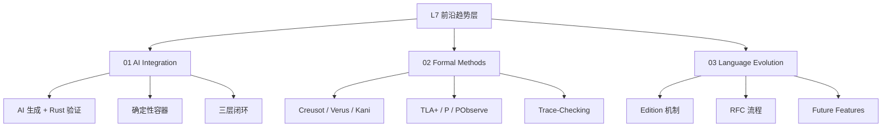

# L7 前沿趋势层（Future & Trends）

> **定位**：Rust 在 AI 时代、形式化方法工业化、分布式系统形式化等前沿方向的演进。本层内容对齐 POPL/PLDI 2024-2026 论文、Rust 语言团队博客、AWS/Microsoft 形式化实践。

---

## 一、本层概念图谱

---

## 二、文件索引

| 文件 | 概念 | 核心内容 | 状态 |
|:---|:---|:---|:---|
| `01_ai_integration.md` | AI × Rust | 生成-验证闭环、AI 语义安全网 | ✅ v1.0 |
| `02_formal_methods.md` | 形式化方法工业化 | Code-Level + System-Level 验证、PObserve | ✅ v1.0 |
| `03_evolution.md` | 语言演进 | Edition、RFC、Const 泛型、GATs、特化 | ✅ v1.0 |

---

## 三、与 L5 对比层的关系

原 `01.md` 中关于 **AI 时代的 Rust**、**五层扩展模型**、**形式化方法工业化** 的内容，将在本层得到更系统的展开和技术细节的补充。

---

## 四、待创建内容（按 Phase 4 计划）

详见 [PLAN.md](../PLAN.md) Phase 4 部分。
