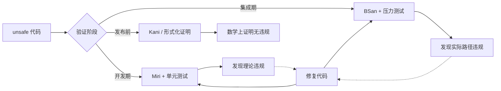

# BorrowSanitizer：动态别名规则验证工具

> **代码状态**: [综述级 — 待补充代码]
> **EN**: BorrowSanitizer (BSan) — Dynamic aliasing rule verification for Rust
> **Summary**: BorrowSanitizer (BSan) — Dynamic aliasing rule verification for Rust: emerging Rust language feature or ecosystem trend.
> **来源**: [BorrowSanitizer MCP](https://github.com/rust-lang/compiler-team/issues/958) · [Rust Project Goals 2026 — BorrowSanitizer](https://rust-lang.github.io/rust-project-goals/2026/borrowsanitizer.html) · [BorrowSanitizer 官方站点](https://borrowsanitizer.com/)
>
> **受众**: [专家]
> **内容分级**: [实验级]
> **Bloom 层级**: 分析 → 评价
> **A/S/P 标记**: **S** — Structure
> **双维定位**: S×Ana — 分析运行时别名验证机制
>
> **跟踪版本**: nightly 1.98.0
> **状态**: 🧪 Nightly 实验性 | **Rust Project Goals 2026 重点目标**（取代 "Emit Retags in Codegen"）
> **Rust 属性标记**: `#[experimental]` `#[nightly_only]`
> **RustConf 2026**: 演讲已接受（2026-09）
>
> **权威来源**:
>
> - [BorrowSanitizer MCP](https://github.com/rust-lang/compiler-team/issues/958)
> - [Rust Project Goals 2026 — BorrowSanitizer](https://rust-lang.github.io/rust-project-goals/2026/borrowsanitizer.html)
> - [BSan 官方网站](https://borrowsanitizer.com/)
> - [BSan April 2026 Update](https://borrowsanitizer.com/status/april_2026.html)
> - [BSan February 2026 Update](https://borrowsanitizer.com/status/february_2026.html)
> - [跟踪 Issue rust-lang/rust#126567](https://github.com/rust-lang/rust/issues/126567)
>
> **前置概念**:
> [Unsafe](../03_advanced/03_unsafe.md) ·
> [Miri](../04_expert/miri/...) ·
> [Tree Borrows](../04_formal/03_ownership_formal.md)
>
> **后置概念**:
> [Formal Methods](./02_formal_methods.md) ·
> [Safety Tags Preview](./08_safety_tags_preview.md)
>
> **定理链**: N/A — 描述性/综述性/工具链文档

---

## 一、核心定位：Miri 的"生产环境"互补

```text
Rust 内存安全验证工具谱系:
┌─────────────────────────────────────────────────────────────┐
│  静态验证          动态验证 (运行时)                         │
│  ───────────       ─────────────────                        │
│  • Kani (模型检查)  • Miri (解释执行, 100-1000x 开销)        │
│  • Prusti (契约)    • BorrowSanitizer (编译插桩, 2-5x 开销)  │
│  • Verus (证明)     • AddressSanitizer (LLVM, 通用)          │
│  • Creusot (Why3)   • MemorySanitizer (LLVM, 未初始化)       │
└─────────────────────────────────────────────────────────────┘
```

**BorrowSanitizer (BSan)** 的核心使命：将 **Tree Borrows** 规则从"理论验证工具"（Miri）推向"工程实践"。

| 维度 | Miri | BorrowSanitizer | AddressSanitizer |
|:---|:---|:---|:---|
| **运行方式** | 解释执行（栈机） | 编译期插桩，原生运行 | LLVM 插桩 |
| **性能开销** | 100-1000x | **2-5x** | 2-3x |
| **别名规则验证** | ✅ Tree Borrows (完整) | ✅ Tree Borrows (别名子集) | ❌ |
| **未初始化内存** | ✅ | ❌ | ❌ |
| **使用越界** | ✅ | ❌ | ✅ |
| **适用场景** | 单元测试 / CI | **压力测试 / 生产环境** | 通用测试 |
| **外部函数调用** | 需 stub | 直接调用 | 直接调用 |

> **关键洞察**: Miri 告诉你"这段代码在理论上是否违反别名规则"；BSan 告诉你"这段代码在实际运行中是否触发了别名违规"。两者互补，而非替代。 [来源: 💡 原创分析]

---

## 二、技术机制：Retag Intrinsics + Shadow Stack

### 2.1 核心设计哲学

BSan 基于 **Emit Retags in Codegen** 的演进，但采用完全不同的运行时策略：

```text
传统 Miri 策略:           BSan 策略 (2026-04 更新):
┌──────────────┐          ┌──────────────────────────┐
│ MIR 级 Retag │          │ LLVM IR 级 Retag Intrinsics│
│ ↓            │          │ ↓                        │
│ 解释器模拟权限 │          │ 编译为 __rust_retag_mem  │
│ ↓            │          │ __rust_retag_reg          │
│ 影子内存检查 │          │ ↓                        │
└──────────────┘          │ 原生代码 + Shadow Stack   │
                          │ ↓                        │
                          │ 运行时别名验证            │
                          └──────────────────────────┘
```

**2026-04 重大架构变更**（来源: BSan April Update）:

- **Shadow Stack**：BSan 使用 shadow stack 跟踪元数据，而非传统 LLVM sanitizer 的影子内存映射。这是 BSan 与其他 sanitizer 最显著的架构差异。
- **Retag Intrinsics**：`__rust_retag_mem` 和 `__rust_retag_reg` 两种形式，无需编译器插件即可通过 `-Zsanitizer=borrow` 启用。

### 2.2 与 Miri 的互补关系



**实践建议**: 对于包含 `unsafe` 的关键路径库（如 `tokio`、`std::collections`、自定义 allocator），建议建立三层验证闭环：

1. **Miri** 在 CI 中运行单元测试（`cargo miri test`）
2. **BSan** 在性能测试中验证（`RUSTFLAGS="-Zsanitizer=borrow" cargo test --release`）
3. **Kani** 对核心不变量进行证明（`#[kani::proof]`）

---

## 三、使用方法 (Nightly)

### 3.1 基本使用

```bash
# 运行测试并启用 BorrowSanitizer
RUSTFLAGS="-Zsanitizer=borrow" cargo +nightly test

# 运行二进制程序
RUSTFLAGS="-Zsanitizer=borrow" cargo +nightly run

# 仅对特定 crate 启用
RUSTFLAGS="-Zsanitizer=borrow" cargo +nightly test -p my-unsafe-crate
```

### 3.2 cargo-bsan 插件 (未来)

```bash
# 预计 2026 年下半年可用
cargo +nightly bsan test
cargo +nightly bsan run
```

> **当前状态** (2026-04): `cargo-bsan` 插件已支持多语言库，正在扩展测试套件（Miri 测试通过率 80%）。2026-04 架构更新：BSan 从"影子内存映射"切换为 **shadow stack**，这是与其他 LLVM sanitizer 最显著的架构差异；同时引入 `__rust_retag_mem` / `__rust_retag_reg` intrinsics，用于在 codegen 阶段插入 provenance 跟踪。

### 3.3 与 Miri 的对比示例

以下是一段**理论上正确但 Miri 会拒绝**的代码（因为 Miri 过于保守）：

```rust,ignore
// 假设：这段代码在实际硬件上是正确的，但 Miri 的 Tree Borrows 会标记它
unsafe fn swap_via_raw<T>(a: &mut T, b: &mut T) {
    let ptr_a = a as *mut T;
    let ptr_b = b as *mut T;
    std::ptr::swap(ptr_a, ptr_b);
}
```

**验证策略**:

```bash
# Step 1: Miri 检查（发现理论问题）
cargo miri test

# Step 2: BSan 检查（确认实际运行无违规）
RUSTFLAGS="-Zsanitizer=borrow" cargo test

# Step 3: 如果 BSan 通过而 Miri 失败，说明 Miri 过于保守，
#         考虑用 UnsafeCodeGuidelines 讨论区的意见作为参考
```

---

## 四、与 Project Goals 2026 的关联

BorrowSanitizer 是 Rust Project Goals 2026 中 **"Emit Retags in Codegen" 目标的演进和取代**。其上游化路线图：

| 里程碑 | 时间 | 状态 |
|:---|:---|:---|
| MCP 通过 | 2026-01 | ✅ 完成 |
| 月度博客 | 2026-02 ~ 2026-04 | ✅ 已发布 4 期 |
| Retag Intrinsics PR | 2026-04 | ✅ 准备发送 |
| LLVM RFC | 2026 春季 | 🔄 起草中（比预期延迟，但值得）。4 月更新确认：BSan 采用 shadow stack 架构，无需等待 LLVM sanitizer 接口完全就绪 |
| RustConf 2026 演讲 | 2026-09 | ✅ 已接受 |
| 上游合并 | 2026 H2 | 📋 目标 |

---

## 五、反命题与边界

### 5.1 BSan 不能做什么

| 限制 | 说明 |
|:---|:---|
| **不验证未初始化内存** | 使用 MemorySanitizer (`-Zsanitizer=memory`) |
| **不验证 use-after-free** | 使用 AddressSanitizer (`-Zsanitizer=address`) |
| **不验证数据竞争** | 使用 ThreadSanitizer (`-Zsanitizer=thread`) |
| **仅支持 Tree Borrows** | Stacked Borrows 用户需迁移或继续使用 Miri |
| **nightly-only** | 稳定化时间表未定，预计 2027+ |

### 5.2 与 Safety Tags 的协同

```text
Safety Tags (RFC #3842)        BorrowSanitizer
        ↓                              ↓
  机器可读的安全契约            运行时验证契约执行
        ↓                              ↓
        └──────────┬───────────────────┘
                   ↓
            形式化验证流水线
                   ↓
        ┌──────────┴──────────┐
        ↓                     ↓
    Kani (静态证明)       BSan (动态验证)
```

---

## 六、参考资源

| 资源 | URL | 类型 |
|:---|:---|:---|
| BSan 跟踪 Issue | rust-lang/rust#126567 | 官方跟踪 |
| Rust Project Goals 2026 — BorrowSanitizer | [rust-lang.github.io/rust-project-goals/2026/BorrowSanitizer.html](https://rust-lang.github.io/rust-project-goals/2026/borrowsanitizer.html) | 项目目标 |
| Miri Book | [rustc-dev-guide.rust-lang.org/miri.html](https://rustc-dev-guide.rust-lang.org/miri.html) | 互补工具 |
| Tree Borrows 论文 | [POPL 2026 / PLDI 2025](https://perso.crans.org/vanille/treebor/) | 理论基础 |
| BSan 月度更新 (Jan) | [borrowsanitizer.com/status/january_2026.html](https://borrowsanitizer.com/status/january_2026.html) | 进展博客 |
| BSan 月度更新 (Feb) | [borrowsanitizer.com/status/february_2026.html](https://borrowsanitizer.com/status/february_2026.html) | 进展博客 |
| BSan 月度更新 (Mar) | [borrowsanitizer.com/status/march_2026.html](https://borrowsanitizer.com/status/march_2026.html) | 进展博客 |
| BSan 月度更新 (Apr) | [borrowsanitizer.com/status/april_2026.html](https://borrowsanitizer.com/status/april_2026.html) | 进展博客 |

---

> **最后更新**: 2026-06-19
> **下次复核**: 2026-07-03
> **维护者**: 本项目知识库团队
> **状态**: 🧪 活跃跟踪中
> **下次复核**: 2026-06-22（BSan 月度更新发布后）

## 嵌入式测验（Embedded Quiz）

### 测验 1：BorrowSanitizer 与 Miri 在检测能力上有什么区别？（理解层）

**题目**: BorrowSanitizer 与 Miri 在检测能力上有什么区别？

<details>
<summary>✅ 答案与解析</summary>

Miri 是解释器，检测广泛的 UB（越界、未对齐、数据竞争）。BorrowSanitizer 是运行时 sanitizer，专注于借用规则违规，速度更快，适合 CI。
</details>

---

### 测验 2：BorrowSanitizer 基于什么 LLVM 基础设施？（理解层）

**题目**: BorrowSanitizer 基于什么 LLVM 基础设施？

<details>
<summary>✅ 答案与解析</summary>

基于 LLVM 的 sanitizer 框架，编译时插入检查代码，运行时通过 shadow memory 追踪引用状态，检测悬垂引用和非法别名。
</details>

---

### 测验 3：为什么需要 BorrowSanitizer 而不是仅依赖编译器借用检查？（理解层）

**题目**: 为什么需要 BorrowSanitizer 而不是仅依赖编译器借用检查？

<details>
<summary>✅ 答案与解析</summary>

借用检查器是静态分析，保守且可能拒绝合法代码。BorrowSanitizer 动态验证运行时实际行为，补充静态检查的不足。
</details>

---

### 测验 4：BorrowSanitizer 对 `unsafe` 代码审计有什么帮助？（理解层）

**题目**: BorrowSanitizer 对 `unsafe` 代码审计有什么帮助？

<details>
<summary>✅ 答案与解析</summary>

可在 CI 中自动化检测 `unsafe` 代码的借用违规，减少人工审计负担。特别适用于 FFI 边界和手动内存管理代码。
</details>

---

### 测验 5：这个工具预计何时可用？（理解层）

**题目**: 这个工具预计何时可用？

<details>
<summary>✅ 答案与解析</summary>

作为 Rust Project Goals 2026 的一部分正在开发中。预计 2026-2027 年在 nightly 中提供实验性支持。
</details>
