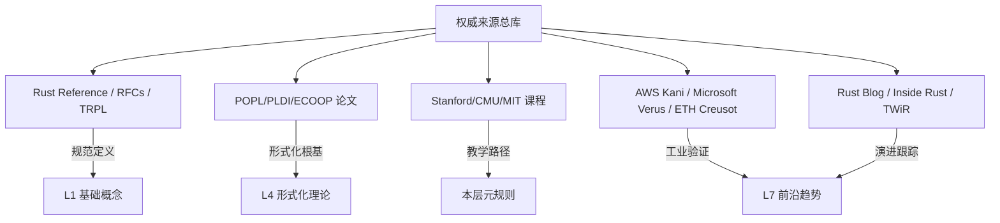

> **Summary**:
>
> Legacy meta layer index for the Rust concept knowledge system, covering authority sources, methodology, and global indexing infrastructure.
>
> Meta Layer Index Legacy. Core Rust concept.
> **内容分级**: [综述级]
> **Rust 版本**: 1.96.0+ (Edition 2024)
> **归档声明**: 本文件前部为 Rust 概念知识体系 **L0 元信息层索引**。原 PostgreSQL 18+ 形式化分析内容已折叠至文件尾部 `§[PostgreSQL 18+ 形式化分析归档]`。
> 与 Rust 相关的跨系统对比内容已提取至 [`05_comparative/04_safety_boundaries.md`](../05_comparative/03_domain_comparisons/04_safety_boundaries.md) §10。
>
> **状态**: v1.1（2026-05-13 重构索引）
>
> **来源**: [Rust RFCs](https://github.com/rust-lang/rfcs) · [Rust Blog](https://blog.rust-lang.org/)
> **前置概念**: N/A
> **后置概念**: N/A
---

# L0 元信息层索引（Meta Layer Index）
>
> **EN**: Meta Layer Index Legacy
> **受众**: [进阶]
> **定位**: 本层为 Rust 概念知识体系的**元信息层**，存放权威来源、方法论、知识来源关系、全局索引等基础设施。所有 L1-L7 文件必须遵循本层定义的元规则。
> **Bloom 层级**: —（元结构，不适用）
> **功能**: 为上层概念提供**可溯源、可审计、可演进**的基础设施
> **[来源: Wikipedia - Knowledge Organization]** · **[来源: Anderson & Krathwohl 2001 - A Taxonomy for Learning]** · **[来源: Rust Reference]**

---

## 一、L0 层核心文件速查

| 文件 | 主题 | 核心功能 | 状态 |
| :--- | :--- | :--- | :--- |
| [`00_meta/sources.md`](../00_meta/02_sources/sources.md) | 权威来源清单 | 五级来源体系（规范/学术/教学/工业/社区）+ 知识来源关系图谱 | ✅ v1.1 |
| [`00_meta/methodology.md`](../00_meta/00_framework/methodology.md) | 方法论 | 六种思维表征规范、内容质量门禁、协作流程 | ✅ v1.1 |
| [`00_meta/concept_index.md`](../00_meta/04_navigation/concept_index.md) | 全局概念索引 | 倒排索引、SSO 单一来源规范、Bloom 层级排序、交叉概念审计 | ✅ v1.1 |
| [`00_meta/inter_layer_map.md`](../00_meta/04_navigation/inter_layer_map.md) | 跨层依赖图 | L0-L7 层间语义链接 + 严格依赖路径 | ✅ v1.0 |
| [`00_meta/semantic_space.md`](../00_meta/00_framework/semantic_space.md) | 表征空间 | 能/不能/等价表达三维分析 + 跨语言表征对比 | ✅ v1.0 |
| [`00_meta/audit_checklist.md`](../00_meta/03_audit/audit_checklist.md) | 审计清单 | 概念一致性（Coherence）检查清单 + 月度审计机制 | ✅ v1.0 |
| [`00_meta/learning_guide.md`](../00_meta/04_navigation/learning_guide.md) | 学习指南 | 不同背景读者的路径推荐 | ✅ v1.0 |
| [`00_meta/quick_reference.md`](../00_meta/04_navigation/quick_reference.md) | 速查手册 | 核心概念一页纸速查 | ✅ v1.0 |
| [`00_meta/semantic_bridge_algorithms_patterns.md`](../00_meta/00_framework/semantic_bridge_algorithms_patterns.md) | 语义桥 | 算法↔设计模式↔工作流模式的三层同构坐标系 | ✅ v1.0 |

---

## 二、L0 输出的元规则（约束 L1-L7）
>

```text
L0 元规则
    │
    ├──→ 来源规范 ──────→ 所有概念文件必须标注权威来源（一级优先）
    ├──→ 表征规范 ──────→ 每文件 ≥2 种思维表征方式
    ├──→ 结构规范 ──────→ 定理一致性矩阵 + 反命题树 + 认知路径
    ├──→ 命名规范 ──────→ NN_english_name.md
    ├──→ SSO 规范 ──────→ 交叉概念必须有单一主定义文件
    └──→ 演进规范 ──────→ 版本特性跟踪 + 变更日志
```

---

## 三、快速入口指南
>

| 读者类型 | 推荐起点 | 路径 |
|:---|:---|:---|
| **Rust 初学者** | [`01_foundation/README.md`](../01_foundation/README.md) | L1 → L2 → L3 |
| **系统工程师** | [`05_comparative/01_rust_vs_cpp.md`](../05_comparative/01_systems_languages/01_rust_vs_cpp.md) | L5 → L6 → L3 |
| **形式化研究者** | [`04_formal/README.md`](../04_formal/README.md) | L4 → L1 → L7 |
| **语言设计者** | [`07_future/03_evolution.md`](../07_future/04_research_and_experimental/03_evolution.md) | L7 → L4 → L5 |
| **技术选型者** | [`05_comparative/README.md`](../05_comparative/README.md) | L5 → L6 → L7 |

---

## 四、知识来源关系图谱（简化版）
>



> **认知功能**: 本图谱将 L0-L7 知识体系的权威来源可视化，帮助读者快速定位不同层级概念的一级/二级/三级来源。建议在引入新概念或验证引用（Reference）时使用此图回溯原始出处，避免知识传递中的失真。关键洞察：Rust 的形式化理论（L4）与工业验证工具（L7）共享同一学术根基，体现了从论文到生产的知识闭环。[来源: 💡 原创分析]

---

## 五、变更日志
>

| 版本 | 日期 | 变更 |
|:---|:---|:---|
| v1.0 | 2026-05-12 | 初始创建，PostgreSQL 长文直接存放 |
| v1.1 | 2026-05-13 | 重构前部为 Rust L0 索引，PostgreSQL 内容折叠至尾部 |
| v1.2 | 2026-05-24 | **语义空间重建（Semantic Space Reconstruction）**：新增 8 个核心文件 + 5 个工程层注入 |
| v1.3 | 2026-05-24 | **Phase 1: 流处理语义空间**：新建 `20_stream_processing_semantics.md` + `36_stream_processing_ecosystem.md`，注入 4 个现有文件 |
| v1.4 | 2026-05-24 | **Phase 2: 形式化与验证深度对齐**：扩展 `05_verification_toolchain.md` + `03_unsafe.md` + `04_effects_system.md` |
| v1.5 | 2026-05-24 | **Phase 4: 质量提升**：修复死链接 1 个 + Bloom 标注补全 1 个 + 为 8 个核心文件新增 18 个 `compile_fail` 反例（01_ownership/02_borrowing/04_type_system/02_async/03_lifetimes/02_generics/04_error_handling/01_rust_vs_cpp）+ 2 个低来源文件标注补充 + 运行审计验证 |
| v1.6 | 2026-05-24 | **Phase 3: 工业系统深度对齐**：新建 `37_database_systems.md`（TiKV/Percolator/Materialize/Meilisearch/SurrealDB）+ `38_network_protocols.md`（QUIC/HTTP-3/eBPF/aya）+ `39_os_kernel.md`（Rust for Linux/Theseus/Redox），更新 L6 README 索引 |

### v1.2 语义空间重建详情

**新建文件（8 个）**:

- L1 基座层: `20_variable_model.md`（PL 通用变量模型）、`21_effects_and_purity.md`（副作用与纯度）、`22_data_abstraction_spectrum.md`（数据抽象谱系）
- L3 高级层: `19_parallel_distributed_pattern_spectrum.md`（并行-分布式谱系）
- L4 形式化层: `18_evaluation_strategies.md`（求值策略）
- L5 对比层: `02_cpp_abi_object_model.md`（C++ ABI 与对象模型）
- L6 生态层: `35_pattern_composition_algebra.md`（模式组合代数）
- L0 元信息层: `semantic_bridge_algorithms_patterns.md`（算法-模式-工作流语义桥）

**核心文件深度注入（5 个）**:

- `01_rust_vs_cpp.md`: Move 语义系统深度对比（§7.3）
- `04_error_handling.md`: C++ 异常安全 vs Rust 错误处理（Error Handling）（§10）
- `01_traits.md`: SFINAE 与 Trait Bounds 深度对比（§5.8）
- `01_ownership.md`: C++ 构造函数/析构函数 vs Rust 初始化（§8.2）
- `20_type_system_advanced.md`: C++ 运算符重载/类型转换 vs Rust Trait（§7）

**质量改进**:

- 所有新文件应用 Tier 1/2/3 定理分级体系
- 新增 `compile_fail` 反例代码块
- 各层 README.md 索引表同步更新
- 交叉引用（Reference）网络扩展至 PL 理论（TAPL、PFPL、线性逻辑）

---
---

> **权威来源**: [Rust Reference](https://doc.rust-lang.org/reference/introduction.html), [The Rust Programming Language](https://doc.rust-lang.org/book/title-page.html), [Rustonomicon](https://doc.rust-lang.org/nomicon/index.html)
> **权威来源对齐变更日志**: 2026-05-19 补全权威来源标注（Rust Reference、TRPL、Rustonomicon、RFCs、学术论文） [来源: Authority Source Sprint Batch 8]

**文档版本**: 1.3
**对应 Rust 版本**: 1.96.0+ (Edition 2024)
**最后更新**: 2026-05-24
**状态**: ✅ Phase 3 工业系统深度对齐完成

---

## 权威来源索引

>
>
>

---

## 嵌入式测验（Embedded Quiz）

### 测验 1：《L0 元信息层索引（Meta Layer Index）》是一份归档文件。归档文件在知识体系中有什么作用？（理解层）

**题目**: 《L0 元信息层索引（Meta Layer Index）》是一份归档文件。归档文件在知识体系中有什么作用？

<details>
<summary>✅ 答案与解析</summary>

保留历史版本的内容，便于追溯概念演变、对比新旧表述，同时避免活跃学习路径被过时信息干扰。
</details>

---

### 测验 2：阅读归档文件时应该注意什么？（理解层）

**题目**: 阅读归档文件时应该注意什么？

<details>
<summary>✅ 答案与解析</summary>

注意文件顶部的归档说明和最后更新日期，理解其历史上下文，不要将其中的过时信息当作当前最佳实践。
</details>

---

### 测验 3：归档文件与活跃概念文件的主要区别是什么？（理解层）

**题目**: 归档文件与活跃概念文件的主要区别是什么？

<details>
<summary>✅ 答案与解析</summary>

归档文件不再维护更新，反映的是历史状态；活跃概念文件持续迭代，包含最新的语言特性和最佳实践。
</details>
