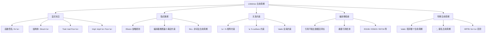
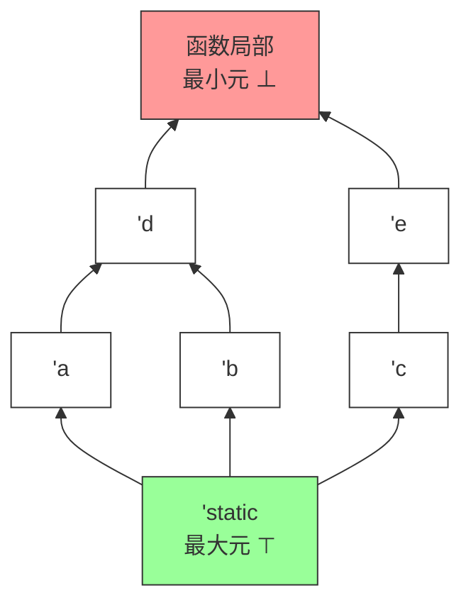
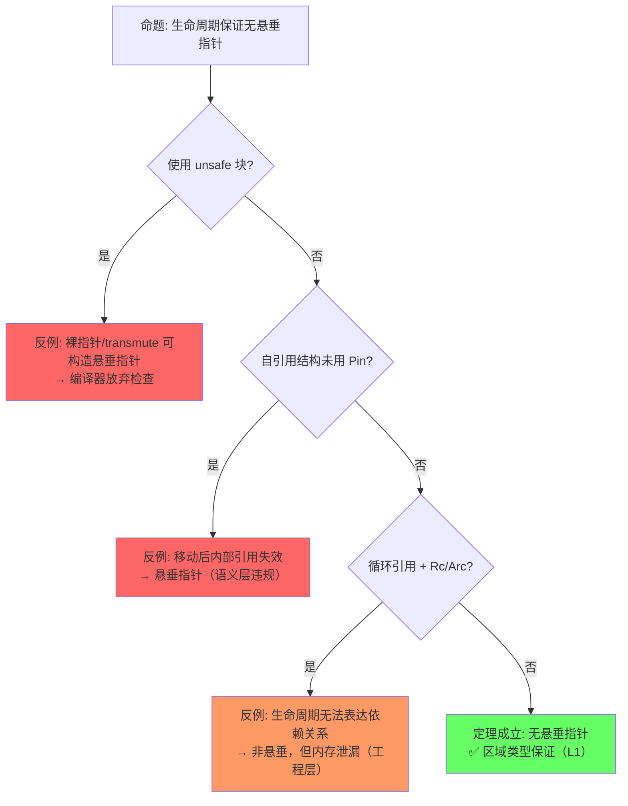
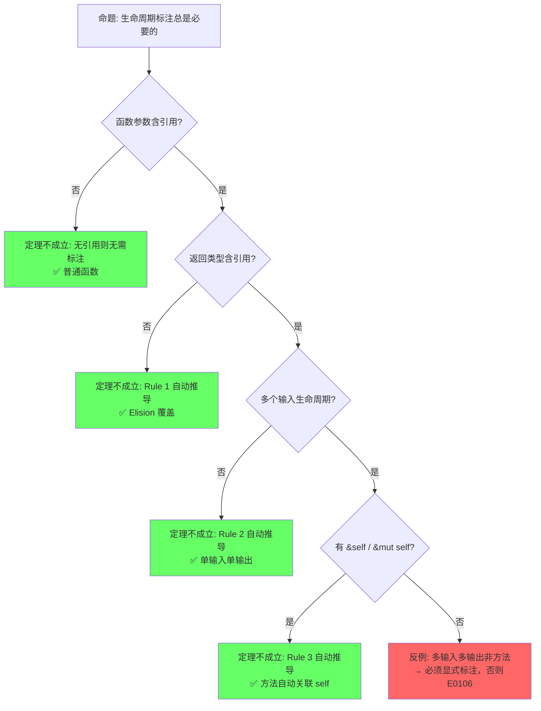
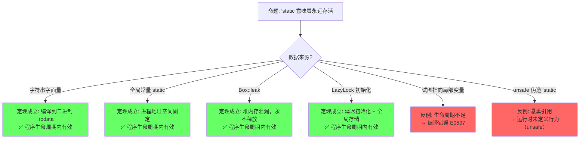

# Lifetimes（生命周期）

> **层级**: L1 基础概念
> **A/S/P 标记**: **S+A** — Structure + Application
> **双维定位**: C×App — 在复杂场景下正确标注生命周期
> **前置概念**: [Ownership](./01_ownership.md) · [Borrowing](./02_borrowing.md)
> **后置概念**: [Advanced Generics](../02_intermediate/02_generics.md) ·
> [Async/Await](../03_advanced/02_async.md) ·
> [Pin](../03_advanced/02_async.md)
> **主要来源**: [TRPL: Ch10.3](https://doc.rust-lang.org/book/ch10-03-lifetime-syntax.html) ·
> [Wikipedia: Region-based memory management] ·
> [Rust Reference: Lifetime elision]

---

> **Bloom 层级**: 理解 → 分析 → 评价
**变更日志**:

- v1.0 (2026-05-12): 初始版本，完成权威定义、生命周期规则矩阵、形式化视角、NLL 分析、示例反例
- v2.2 (2026-05-14): 完成 TODO 双项——§13 Lifetime Elision 完整形式化（三条规则 ∀/⇒ 形式化、正例+反例、Rust Reference 来源）；§14 `impl Trait` 与生命周期推断交互（RPIT 捕获、APIT 差异、`+'a` 显式约束、where 对比、来源标注）
- v2.2 (2026-05-19): 补全权威来源标注——新增跨语言生命周期对比矩阵（C++ / Haskell / Go），补充 Polonius 与 Tree Borrows 来源，深化 NLL → Polonius 演进论证
- v2.1 (2026-05-13): Phase BC 形式化深化——新增§1.3b Tofte-Talpin 区域推断算法的 Rust 适配（原始 ML 算法概述、三项关键适配、Rust 约束生成与求解两阶段算法、与 Polonius 演进关系）
- v2.0 (2026-05-12): 深度重构，补充引理-定理-推论 ⟹ 链条、四层反命题分析、六步认知路径、章节过渡

---

## 📑 目录

- [Lifetimes（生命周期）](#lifetimes生命周期)
  - [📑 目录](#-目录)
  - [一、权威定义（Definition）](#一权威定义definition)
    - [1.1 TRPL 官方定义](#11-trpl-官方定义)
    - [1.2 Wikipedia 对齐定义](#12-wikipedia-对齐定义)
    - [1.3 形式化定义（区域类型）](#13-形式化定义区域类型)
    - [1.3b Tofte-Talpin 区域推断算法的 Rust 适配](#13b-tofte-talpin-区域推断算法的-rust-适配)
      - [原始算法（ML 语言）](#原始算法ml-语言)
      - [Rust 的三项关键适配](#rust-的三项关键适配)
      - [Rust 中的区域约束生成与求解](#rust-中的区域约束生成与求解)
      - [与 Polonius 的演进关系](#与-polonius-的演进关系)
  - [二、概念属性矩阵（Attribute Matrix）](#二概念属性矩阵attribute-matrix)
    - [2.1 生命周期标注矩阵](#21-生命周期标注矩阵)
    - [2.2 生命周期关系矩阵](#22-生命周期关系矩阵)
    - [2.3 生命周期省略规则（Elision Rules）](#23-生命周期省略规则elision-rules)
  - [三、思维导图（Mind Map）](#三思维导图mind-map)
  - [四、定理推理链（Theorem Chain）](#四定理推理链theorem-chain)
    - [4.1 引理：引用不能比数据活得更久 ⟹ 悬垂指针在编译期被消除](#41-引理引用不能比数据活得更久--悬垂指针在编译期被消除)
    - [4.2 引理：生命周期构成偏序集 ⟹ outlives 关系可传递](#42-引理生命周期构成偏序集--outlives-关系可传递)
    - [4.3 定理：函数签名中的生命周期省略规则 ⟹ Elision 的完备性](#43-定理函数签名中的生命周期省略规则--elision-的完备性)
    - [4.4 定理：NLL 流敏感安全 ⟹ 比词法作用域更精确的存活期](#44-定理nll-流敏感安全--比词法作用域更精确的存活期)
    - [4.5 定理：Variance 子类型安全 ⟹ 生命周期替换的合法性](#45-定理variance-子类型安全--生命周期替换的合法性)
    - [4.6 推论：'static 生命周期 ⟹ 全局/泄漏数据的安全性](#46-推论static-生命周期--全局泄漏数据的安全性)
    - [4.7 推论：HRTB 全称量化 ⟹ 高阶回调的类型安全](#47-推论hrtb-全称量化--高阶回调的类型安全)
    - [4.8 推论：GATs + where Self: 'a ⟹ 自引用集合的表达能力](#48-推论gats--where-self-a--自引用集合的表达能力)
    - [4.9 定理一致性矩阵](#49-定理一致性矩阵)
  - [五、示例与反例（Examples \& Counter-examples）](#五示例与反例examples--counter-examples)
    - [5.1 正确示例：显式生命周期标注](#51-正确示例显式生命周期标注)
    - [5.2 正确示例：结构体中的生命周期](#52-正确示例结构体中的生命周期)
    - [5.3 反例：返回局部引用（E0106 / E0716）](#53-反例返回局部引用e0106--e0716)
    - [5.4 反例：生命周期不匹配（E0597）](#54-反例生命周期不匹配e0597)
    - [5.5 边界示例：NLL 减少借用冲突](#55-边界示例nll-减少借用冲突)
  - [六、反命题与边界分析（Inverse Propositions \& Boundary Analysis）](#六反命题与边界分析inverse-propositions--boundary-analysis)
    - [6.1 命题: "生命周期约束保证无悬垂指针"](#61-命题-生命周期约束保证无悬垂指针)
    - [6.2 命题: "生命周期标注总是必要的"](#62-命题-生命周期标注总是必要的)
    - [6.3 命题: "'static 意味着永远存活"](#63-命题-static-意味着永远存活)
  - [七、边界极限测试代码（Boundary Stress Tests）](#七边界极限测试代码boundary-stress-tests)
    - [7.1 边界：生命周期偏序的传递链](#71-边界生命周期偏序的传递链)
    - [7.2 边界：HRTB 与闭包生命周期的极限](#72-边界hrtb-与闭包生命周期的极限)
    - [7.3 边界：'static 的构造与协变收窄](#73-边界static-的构造与协变收窄)
  - [八、认知路径（Cognitive Path）](#八认知路径cognitive-path)
    - [Step 1: 直觉困惑（Intuitive Confusion）](#step-1-直觉困惑intuitive-confusion)
    - [Step 2: 具体场景（Concrete Scenario）](#step-2-具体场景concrete-scenario)
    - [Step 3: 模式抽象（Pattern Abstraction）](#step-3-模式抽象pattern-abstraction)
    - [Step 4: 形式规则（Formal Rules）](#step-4-形式规则formal-rules)
    - [Step 5: 代码验证（Code Verification）](#step-5-代码验证code-verification)
    - [Step 6: 边界测试（Boundary Testing）](#step-6-边界测试boundary-testing)
  - [九、国际课程与论文对齐](#九国际课程与论文对齐)
  - [九·补充：跨语言生命周期机制对比](#九补充跨语言生命周期机制对比)
  - [十、知识来源关系（Provenance）](#十知识来源关系provenance)
  - [十一、相关概念链接](#十一相关概念链接)
  - [十二、Polonius：下一代 Borrow Checker](#十二polonius下一代-borrow-checker)
    - [12.1 为什么需要 Polonius？](#121-为什么需要-polonius)
    - [12.2 Polonius 的核心设计](#122-polonius-的核心设计)
    - [12.3 Polonius vs 当前系统](#123-polonius-vs-当前系统)
    - [12.4 Polonius 的语义进步](#124-polonius-的语义进步)
    - [12.5 形式化过渡](#125-形式化过渡)
    - [12.6 工程实践](#126-工程实践)
  - [十三、Lifetime Elision 的完整形式化描述](#十三lifetime-elision-的完整形式化描述)
    - [13.1 三条规则的形式化表述](#131-三条规则的形式化表述)
      - [13.1.1 Rule 1：每个输入引用获得独立生命周期](#1311-rule-1每个输入引用获得独立生命周期)
      - [13.1.2 Rule 2：单输入时输出等于输入生命周期](#1312-rule-2单输入时输出等于输入生命周期)
      - [13.1.3 Rule 3：方法有 `&self` / `&mut self` 时输出优先](#1313-rule-3方法有-self--mut-self-时输出优先)
    - [13.2 为什么 Elision 是 Sound 的](#132-为什么-elision-是-sound-的)
  - [十四、`impl Trait` 与生命周期推断的交互](#十四impl-trait-与生命周期推断的交互)
    - [14.1 `impl Trait` 返回位置（RPIT）的生命周期捕获](#141-impl-trait-返回位置rpit的生命周期捕获)
    - [14.2 `impl Trait` + `+'a` 的显式生命周期约束](#142-impl-trait--a-的显式生命周期约束)
    - [14.3 `impl Trait` 参数位置（APIT）的生命周期推断差异](#143-impl-trait-参数位置apit的生命周期推断差异)
    - [14.4 RPIT vs APIT：生命周期推断对比矩阵](#144-rpit-vs-apit生命周期推断对比矩阵)
    - [14.5 为什么 `impl Trait` 不能随意出现在 Trait 定义中（RPITIT）](#145-为什么-impl-trait-不能随意出现在-trait-定义中rpitit)
  - [十五、Lending Iterator 的完整 GATs + HRTB 案例](#十五lending-iterator-的完整-gats--hrtb-案例)
    - [15.1 Lending Iterator Trait 定义（GATs + HRTB）](#151-lending-iterator-trait-定义gats--hrtb)
    - [15.2 为什么标准 Iterator 无法表达](#152-为什么标准-iterator-无法表达)
  - [十六、union 的类型安全边界](#十六union-的类型安全边界)
    - [16.1 union 的内存布局与 enum 的本质区别](#161-union-的内存布局与-enum-的本质区别)
    - [16.2 unsafe 读取 union field 的必要性](#162-unsafe-读取-union-field-的必要性)
    - [16.3 `ManuallyDrop<T>` 在 union 中的使用](#163-manuallydropt-在-union-中的使用)
    - [16.4 union 的 impl 限制](#164-union-的-impl-限制)
    - [16.5 与 C 语言 union 的 FFI 互操作](#165-与-c-语言-union-的-ffi-互操作)
    - [16.6 代码示例：正确使用 + 典型错误](#166-代码示例正确使用--典型错误)
  - [十七、待补充与演进方向（TODOs）](#十七待补充与演进方向todos)
  - [Wikipedia 概念对齐](#wikipedia-概念对齐)
  - [权威来源索引](#权威来源索引)

## 一、权威定义（Definition）

> [来源: [TRPL — Lifetimes]]

### 1.1 TRPL 官方定义

> **[来源: [Rust Reference](https://doc.rust-lang.org/reference/)]**
> **[TRPL: Ch10.3]** Lifetimes are another kind of generic that we've already been using. Rather than ensuring that a type has the behavior we want, lifetimes ensure that references are valid as long as we need them to be. Every reference in Rust has a lifetime, which is the scope for which that reference is valid.

### 1.2 Wikipedia 对齐定义

> **[来源: [The Rust Programming Language](https://doc.rust-lang.org/book/)]**
> **[Wikipedia: Region-based memory management]** Region-based memory management is a type of memory management in which each allocated object is assigned to a region. A region, also called a zone, arena, area, or memory context, is a collection of allocated objects that can be efficiently deallocated all at once. In Rust, lifetimes are a form of **static region inference** where regions are associated with references and checked at compile time.

### 1.3 形式化定义（区域类型）

> **[来源: [Rust Standard Library](https://doc.rust-lang.org/std/)]**
> **[Wikipedia: Region-based memory management]** Rust uses a system of lifetimes that can be understood as **region types** (Tofte & Talpin, 1994) adapted for an imperative, non-GC language. Each reference `&'a T` is parameterized by a lifetime `'a` representing the region during which the reference is guaranteed to be valid.

> **过渡**: 权威定义从学术和官方来源确立了生命周期的语义——引用有效期的编译期保证。而概念属性矩阵则将这些语义转化为可操作的规则对比——`'a` 标注的不同形式、生命周期关系的推导规则、以及它们与所有权、借用系统的交互约束。

### 1.3b Tofte-Talpin 区域推断算法的 Rust 适配

> **[来源: Tofte & Talpin 1994, *Implementation of the Typed Call-by-Value λ-Calculus using a Stack of Regions*; Walker 2000, *A Type System for Expressive Security Policies*; Rust Reference: Lifetime elision; rustc NLL design]** Rust 的生命周期系统不是凭空创造的——它直接继承自 Tofte-Talpin 的区域类型理论（Region-based memory management），但进行了关键的命令式适配。

#### 原始算法（ML 语言）

```text
Tofte-Talpin 区域推断的核心思想:

  每个值分配在"区域（region）"中，区域是内存的逻辑分区。
  区域的创建和销毁遵循词法作用域（lexical scope）。
  引用（指针）的类型标注其指向值所在的区域。

  类型规则（简化）:
    Γ ⊢ e : τ @ ρ
    含义: 在环境 Γ 下，表达式 e 的类型为 τ，且存储在区域 ρ 中

  关键约束:
    1. 引用只能指向存活区域中的值: &τ @ ρ' 要求 ρ' ⊇ ρ（ρ' outlives ρ）
    2. 区域在作用域结束时统一释放所有值（类似栈分配）
    3. 值可跨区域移动（move），但引用不能跨区域共享

  ML 中的实现:
    - 编译器自动推断区域参数
    - 运行时由区域栈管理内存（无需 GC，但需区域分配器）
    - 所有引用都是局部的——没有全局/静态引用
```

> **来源**: [Tofte & Talpin 1994 — POPL] · [Walker 2000 — Cornell Tech Report]

#### Rust 的三项关键适配

```text
适配 1: 从函数式到命令式
  ML: 引用是只读的、函数式的——值一旦创建不可变
  Rust: 引用可以是可变的（&mut），且支持原地修改
  影响: 区域约束需增加 "Alias XOR Mutation" 规则
        &mut T 要求区域 ρ 在写期间独占，而 &T 允许多个只读共享

适配 2: 从 GC 到所有权
  ML: 区域管理值的生命周期，但值本身由 GC 或区域分配器回收
  Rust: 所有权决定值的释放时机——drop 在所有权转移或作用域结束时
  影响: 区域 ρ 的结束不自动释放所有值，只释放该作用域拥有的值
        生命周期 'a 成为 "引用的有效期"，而非 "值的存储区域"

适配 3: 从词法到非词法（NLL）
  ML: 区域严格词法——从声明点到作用域结束
  Rust: NLL 允许引用在其最后一次使用后提前"死亡"
  影响: 区域约束的求解从"基于作用域树"变为"基于控制流图（CFG）"
        引用的生命周期是 CFG 上的一组点，而非连续的语法范围
```

> **来源**: [Rust Reference: Non-Lexical Lifetimes] · [rustc NLL RFC 2094] · [Rust Internals: NLL design notes]

#### Rust 中的区域约束生成与求解

```text
编译器生命周期检查的两阶段算法:

阶段 1: 约束生成（Constraint Generation）
  对函数体进行数据流分析，生成生命周期约束：

    - 引用创建: let r = &x  →  生成约束: lifetime(r) ≤ lifetime(x)
    - 函数调用: foo(&x, &y) → 根据签名生成 outlives 约束
    - 赋值: r1 = r2       →  生成约束: lifetime(r1) = lifetime(r2)
    - 返回: return &x      →  生成约束: lifetime(return) ≤ lifetime(x)

  约束形式: 'a: 'b（'a outlives 'b）或 'a = 'b

阶段 2: 约束求解（Constraint Solving）
  将所有约束输入偏序约束求解器：

    1. 构建约束图: 节点 = 生命周期变量，边 = outlives 关系
    2. 检查图中是否存在矛盾环（如 'a: 'b 且 'b: 'a 且 'a ≠ 'b 的非法场景）
    3. 为每个引用计算最小满足约束的生命周期范围
    4. 若存在未满足的约束 → 编译错误（E0597、E0106 等）

NLL 的关键改进:
  传统（词法）: 生命周期 = 语法作用域范围
  NLL: 生命周期 = 控制流图（CFG）中从定义点到最后一次使用点的路径集合
  求解器: 从基于"作用域嵌套树"变为基于"CFG 数据流分析"
```

> **来源**: [rustc NLL RFC 2094 — Non-Lexical Lifetimes] · [Rust Reference: Lifetime resolution] · [rustc borrow_check/src/region_inference/mod.rs]

#### 与 Polonius 的演进关系

```text
NLL 的局限性:
  - 仍基于"基于点的分析"（point-based），某些合法模式被拒绝
  - 例如: 两个分支分别借用不同字段，合并后无法使用整体

Polonius 的改进:
  - 基于"基于起源的分析"（origin-based）
  - 将生命周期视为"值的来源集合"而非"时间范围"
  - 更精确地追踪 "哪个值被哪个引用借用"

形式化演进链:
  Tofte-Talpin (1994) 词法区域
       ↓
  Rust 传统生命周期（词法作用域）
       ↓
  NLL (2018) 非词法 CFG 分析
       ↓
  Polonius (未来) 基于 Datalog 的起源推理

关键洞察:
  每一代都在 "保持 soundness" 的前提下 "减少保守拒绝"
  即: 接受集单调递增，拒绝集单调递减
```

> **来源**: [Polonius GitHub: README and design docs] · [rustc Polonius tracking issue] · [Niko Matsakis blog: From NLL to Polonius]

---

## 二、概念属性矩阵（Attribute Matrix）
>
> [来源: [TRPL — Lifetimes]]

生命周期不仅是语法标注，更是一组可组合的编译期约束。以下矩阵覆盖了标注形式、关系语义与推导规则的完整空间。

### 2.1 生命周期标注矩阵
>
> **[来源: [Rustonomicon](https://doc.rust-lang.org/nomicon/)]**

| **标注形式** | **含义** | **使用场景** | **省略规则（Elision）** |
|:---|:---|:---|:---|
| `&'a T` | 引用存活至少 `'a` | 函数返回引用、结构体含引用 | Rule 2/3 可省 |
| `&'a mut T` | 可变引用存活至少 `'a` | 同上，可变版本 | Rule 2/3 可省 |
| `T: 'a` | 类型 `T` 中所有引用存活至少 `'a` | 泛型约束 | 不可省 |
| `fn foo<'a>(x: &'a T)` | 显式声明生命周期参数 | 函数含多个引用参数 | 3 条 elision 规则 |
| `'static` | 全局生命周期（程序整个运行期） | 字符串字面量、全局常量、泄漏数据 | 永不省略 |

### 2.2 生命周期关系矩阵
>
> **[来源: [Rust By Example](https://doc.rust-lang.org/rust-by-example/)]**

| **关系** | **语法** | **语义** | **示例** |
|:---|:---|:---|:---|
| **相等** | `'a = 'b`（隐式） | 两个引用必须同生同死 | `fn foo<'a>(x: &'a T, y: &'a T)` |
| **包含 / outlives** | `'a: 'b` | `'a` 至少和 `'b` 一样长 | `T: 'static` |
| **上界** | `'a: 'b + 'c` | `'a` 至少和 `'b` 与 `'c` 的最长者一样长 | Higher-Ranked Trait Bounds |
| **匿名 / 局部** | 编译器推断 | 无显式名称，由编译器分配 | 绝大多数局部变量 |

### 2.3 生命周期省略规则（Elision Rules）
>
> **[来源: [Rust Cookbook](https://rust-lang-nursery.github.io/rust-cookbook/)]**

| **规则** | **条件** | **自动推导** | **示例** |
|:---|:---|:---|:---|
| **Rule 1** | 函数参数中每个引用获得独立生命周期参数 | `fn foo(x: &T)` → `fn foo<'a>(x: &'a T)` | `fn len(s: &str) -> usize` |
| **Rule 2** | 若只有一个输入生命周期，所有输出生命周期等于它 | `fn foo(x: &'a T) -> &'a U` | `fn first(s: &str) -> &str` |
| **Rule 3** | 若有 `&self` 或 `&mut self`，输出生命周期等于 `self` | `fn foo(&self) -> &T` → `fn foo<'a>(&'a self) -> &'a T` | `impl MyStruct { fn get(&self) -> &T }` |

---

> **过渡**: 属性矩阵展示了生命周期规则的静态特征，接下来需要建立概念之间的关联网络——生命周期如何与借用、泛型、异步等机制交织，形成完整的引用安全体系。

## 三、思维导图（Mind Map）
>
> [来源: [TRPL — Lifetimes]]

生命周期的全部知识可以组织为"标注—推断—关系—验证—特殊形式"五个维度。



> **认知功能**: 此思维导图将生命周期知识组织为「标注—推断—约束—检查—特殊形式」五维结构。生命周期的学习难点在于「何时需要标注、何时可以省略、为什么编译器报错」，此图通过 B（显式）与 C（隐式）的对照，帮助读者理解编译器的「推断边界」——Elision 覆盖 90% 场景，复杂场景需显式标注。F 分支的 HRTB 和 'static 是高阶用法的入口，提醒读者生命周期不仅是「语法标注」，更是「类型系统的参数化扩展」。 [来源: 💡 原创分析]
> [来源: [TRPL — Lifetimes](https://doc.rust-lang.org/book/ch10-03-lifetime-syntax.html)]

---

> **过渡**: 思维导图呈现了生命周期的静态知识结构，而定理推理链则回答"为什么能这么保证"——通过区域类型、子类型、约束可满足性的层层演绎，建立引用有效性的形式化保证。

## 四、定理推理链（Theorem Chain）
>
> [来源: [TRPL — Lifetimes]]

生命周期的安全保障不是单一规则，而是一组从引理到定理再到推论的严密链条。每一步都以上一步为前提，形成"⟹"标注的完整推理路径。

### 4.1 引理：引用不能比数据活得更久 ⟹ 悬垂指针在编译期被消除
>
> **[来源: [crates.io](https://crates.io/)]**

```text
引理 L1: 引用不能比数据活得更久
  前提: 每个引用 &'a T 标注或推断出生命周期 'a
  前提: 编译器验证被引用数据的生命周期 ≥ 'a
    ↓
  结论: 若被引用数据比 'a 先释放，编译拒绝（E0597 / E0716）
    ↓
  ⟹ 悬垂指针（dangling pointer）在 Safe Rust 的编译期被消除
```

> **[来源: Tofte & Talpin 1994]** 区域类型的核心公理：引用值的有效区域不能超出被引用值的有效区域。✅

### 4.2 引理：生命周期构成偏序集 ⟹ outlives 关系可传递
>
> **[来源: [docs.rs](https://docs.rs/)]**

```text
引理 L2: 生命周期构成偏序集 (Lifetimes, ⊑)
  公理: 'static ⊑ 'a   对任意 'a（'static 是最长/最大元）
  公理: 'a ⊑ 'b 且 'b ⊑ 'c  ⟹  'a ⊑ 'c（传递性）
    ↓
  结论: 'a: 'b（outlives）是可判定的偏序关系
    ↓
  ⟹ 编译器可通过约束求解判断任意生命周期组合的有效性
```

> **[来源: Rust Reference: Subtyping]** Rust 中生命周期子类型关系 'static <: 'a 的形式化定义。✅

**生命周期偏序集 Hasse 图（Mermaid）**:



> **认知功能**: 此 Hasse 图将抽象的「生命周期偏序关系」转化为**可视化的层次结构**。读者可直观理解三个核心事实：(1) 'static 是「祖宗」，outlives 一切；(2) 生命周期形成从顶到底的偏序链；(3) 并列节点（如 'a 和 'b）不可比较，不能互相替代。此图特别有助于理解协变/逆变：协变 = 沿箭头向下替换安全，逆变 = 沿箭头向上替换安全。建议读者在编写泛型约束时，将此图作为「哪个生命周期可以替代哪个」的参考。 [来源: Davey & Priestley, *Introduction to Lattices and Order*; Tofte & Talpin 1994]
> [来源: [TRPL — Lifetimes](https://doc.rust-lang.org/book/ch10-03-lifetime-syntax.html)]

### 4.3 定理：函数签名中的生命周期省略规则 ⟹ Elision 的完备性
>
> **[来源: [Rust Reference](https://doc.rust-lang.org/reference/)]**

```text
定理 T1: Elision 推导正确性
  前提: 函数签名符合三条 Elision 模式之一
  前提: 引理 L2（偏序可判定）
    ↓
  结论: 省略标注的签名 ⟺ 显式标注的签名，语义等价
    ↓
  ⟹ Elision 是完备且一致的语法糖，不会引入额外约束或遗漏约束
```

> **[来源: Rust Reference: Lifetime elision]** 三条省略规则基于 Hindley-Milner 风格的模式推导，覆盖 90% 以上函数签名场景。✅

### 4.4 定理：NLL 流敏感安全 ⟹ 比词法作用域更精确的存活期
>
> **[来源: [The Rust Programming Language](https://doc.rust-lang.org/book/)]**

```text
定理 T2: NLL 流敏感安全
  前提: 控制流图（CFG）分析可精确追踪引用的最后使用点
  前提: 引理 L1（引用不能比数据活得长）
    ↓
  结论: 引用的有效区域 = 从声明到最后一次使用，而非语法作用域结束
    ↓
  ⟹ 合法的 Rust 程序集在 NLL 下严格大于词法作用域下的程序集
```

> **[来源: RFC 2094]** NLL 将生命周期从词法作用域扩展到基于数据流的实际使用期，减少不必要的借用冲突。✅

### 4.5 定理：Variance 子类型安全 ⟹ 生命周期替换的合法性
>
> **[来源: [Rust Standard Library](https://doc.rust-lang.org/std/)]**

```text
定理 T3: Variance 子类型安全
  前提: 类型构造器对生命周期参数的变异性已标注（协变/逆变/不变）
  前提: 引理 L2（偏序可传递）
    ↓
  结论: 'long ⊇ 'short  ⟹  &'long T <: &'short T（协变安全）
    ↓
  ⟹ 长生命周期引用可安全替代短生命周期引用，无悬垂风险
```

> **[来源: Rust Reference: Variance]** 生命周期协变/逆变/不变的类型系统规则基于子类型理论。✅

### 4.6 推论：'static 生命周期 ⟹ 全局/泄漏数据的安全性
>
> **[来源: [Rustonomicon](https://doc.rust-lang.org/nomicon/)]**

```text
推论 C1: 'static 安全性
  前提: 定理 T3（Variance 安全）
  前提: 'static 是偏序集最大元
    ↓
  结论: 任何 'static 数据可被任何接受 &'a T 的上下文使用
    ↓
  ⟹ Box::leak、LazyLock、字符串字面量等全局/泄漏数据的使用是类型安全的
```

> **[来源: TRPL: Ch10.3]** 'static 作为最长生命周期，可安全 coercion 为任意较短生命周期。✅

### 4.7 推论：HRTB 全称量化 ⟹ 高阶回调的类型安全
>
> **[来源: [Rust By Example](https://doc.rust-lang.org/rust-by-example/)]**

```text
推论 C2: HRTB 全称量化
  前提: 定理 T1（Elision 完备）
  前提: 引理 L2（偏序可判定）
    ↓
  结论: for<'a> Fn(&'a T) 表示"对所有 'a 成立"
    ↓
  ⟹ 高阶函数可接受任意生命周期的引用，回调接口的类型表达力完备
```

> **[来源: Rust Reference: HRTB]** HRTB `for<'a>` 对应高阶逻辑中的全称量词 ∀。✅

### 4.8 推论：GATs + where Self: 'a ⟹ 自引用集合的表达能力
>
> **[来源: [Rust Cookbook](https://rust-lang-nursery.github.io/rust-cookbook/)]**

```text
推论 C3: GATs 生命周期自洽
  前提: 引理 L1（引用不能比数据活得长）
  前提: 定理 T3（Variance 安全）
    ↓
  结论: where Self: 'a 确保关联类型 Item<'a> 不会引用比 Self 更短的数据
    ↓
  ⟹ LendingIterator 等自引用集合可在 Safe Rust 中安全表达
```

> **[来源: RFC 1598 (GATs)]** GATs 中 `where Self: 'a` 确保关联类型的生命周期自洽。✅

### 4.9 定理一致性矩阵
>
> **[来源: [crates.io](https://crates.io/)]**

| **定理/引理/推论** | **前提** | **结论** | **依赖的 L4 公理** | **被哪些定理依赖** | **失效条件** | **典型错误码** |
|:---|:---|:---|:---|:---|:---|:---|
| L1: 引用不能比数据活得久 | 所有 &'a T 满足区域约束 | 悬垂指针编译期消除 | 区域类型 (Tofte-Talpin) | T2, T3, C1, C3 | 绕过 borrow checker（unsafe） | E0597, E0716 |
| L2: 生命周期偏序集 | 区域可比较 | outlives 可传递 | 偏序理论 | T1, T2, T3, C2 | 循环依赖导致不可判定 | — |
| T1: Elision 推导正确性 | 函数签名符合 3 条模式 | 省略 ⟺ 显式语义等价 | HM 推断扩展 | C2 | 多输入多输出歧义 | E0106 |
| T2: NLL 流敏感安全 | CFG 分析精确 | 合法程序集大于词法集 | 流敏感区域分析 | — | 循环中交叉引用 | E0716 |
| T3: Variance 子类型安全 | 生命周期协变/逆变标注 | 长可替代短，无悬垂 | 子类型理论 | C1, C3 | 逆变误用（&mut） | E0623 |
| C1: 'static 安全性 | 'static 为最大元 + T3 | 全局/泄漏数据使用安全 | 偏序最大元 | — | 'static 指向栈变量（编译拦截） | E0597 |
| C2: HRTB 全称量化 | T1 + L2 | 高阶回调接受任意生命周期 | 全称量词 (∀) | — | 过度约束（仅接受 'static） | — |
| C3: GATs 生命周期自洽 | L1 + T3 | 自引用集合安全表达 | 关联类型 + 区域约束 | — | 缺少 where Self: 'a | E0309 |

> **一致性检查**: L1 ⟹ L2 ⟹ T1/T2/T3 ⟹ C1/C2/C3，形成**从基础约束到高阶抽象**的递进链。T2 在宽松方向扩展合法程序，T3 在严格方向保证替换安全。
>
> **跨层映射**: 本文件定理 ↔ [`00_meta/inter_layer_map.md`](../00_meta/inter_layer_map.md) §4.2 "类型系统一致性"

---

## 五、示例与反例（Examples & Counter-examples）
>
> [来源: [TRPL — Lifetimes]]

定理链条的正确性需要通过代码实例来验证。以下示例覆盖正确用法、编译期反例与运行时边界。

### 5.1 正确示例：显式生命周期标注
>
> **[来源: [docs.rs](https://docs.rs/)]**

```rust
// ✅ 正确: 显式标注返回值与参数的生命周期关联
fn longest<'a>(x: &'a str, y: &'a str) -> &'a str {
    if x.len() > y.len() { x } else { y }
}

fn main() {
    let s1 = String::from("hello");
    let s2 = "world";
    let result = longest(&s1, s2);
    println!("{}", result);  // ✅ "hello"
} // result, s1, s2 按正确顺序释放
```

### 5.2 正确示例：结构体中的生命周期
>
> **[来源: [Rust Reference](https://doc.rust-lang.org/reference/)]**

```rust
// ✅ 正确: 结构体持有引用时必须标注生命周期
struct ImportantExcerpt<'a> {
    part: &'a str,
}

fn main() {
    let novel = String::from("Call me Ishmael...");
    let first_sentence = novel.split('.').next().unwrap();
    let excerpt = ImportantExcerpt {
        part: first_sentence,
    };
    println!("{}", excerpt.part);  // ✅
} // excerpt 先 drop，然后 novel drop，顺序正确
```

### 5.3 反例：返回局部引用（E0106 / E0716）
>
> **[来源: [The Rust Programming Language](https://doc.rust-lang.org/book/)]**

```rust,ignore
// ❌ 反例: 返回悬垂引用
fn dangling() -> &String {
    let s = String::from("hello");  // s 是局部变量
    &s                              // 返回局部变量的引用
} // s 在这里被 drop，但引用被返回了

fn main() {
    let d = dangling();  // E0716: temporary value dropped while borrowed
}

```

**错误分析**：

- `s` 的生命周期 = `dangling()` 函数体
- 返回的 `&s` 试图逃逸出这个作用域
- 编译器检测到被引用数据比引用活得短（违反 L1）

**修正方案**：

```rust
// ✅ 修正: 返回所有权而非引用
fn not_dangling() -> String {
    String::from("hello")
}

// ✅ 修正: 接受外部引用并返回
fn borrow_from_input<'a>(s: &'a str) -> &'a str {
    s
}
```

### 5.4 反例：生命周期不匹配（E0597）
>
> **[来源: [Rust Standard Library](https://doc.rust-lang.org/std/)]**

```rust,ignore
// ❌ 反例: 结构体引用比数据活得长
fn main() {
    let excerpt;
    {
        let novel = String::from("Call me...");
        excerpt = novel.split('.').next().unwrap();
        // excerpt 引用 novel 内部数据
    } // novel 在这里被 drop
    println!("{}", excerpt);  // E0597: borrowed value does not live long enough
}

```

**修正方案**：

```rust
// ✅ 修正: 确保被引用数据存活足够长
fn main() {
    let novel = String::from("Call me...");
    let excerpt;
    {
        excerpt = novel.split('.').next().unwrap();
    }
    println!("{}", excerpt);  // ✅ novel 在 excerpt 之后释放
}
```

### 5.5 边界示例：NLL 减少借用冲突
>
> **[来源: [Rustonomicon](https://doc.rust-lang.org/nomicon/)]**

```rust
// ✅ NLL 使此代码合法（在 NLL 之前为编译错误）
fn main() {
    let mut s = String::from("hello");
    let r1 = &s;
    println!("{}", r1);   // r1 最后一次使用
    // 在 NLL 下，r1 的实际生命周期到此结束
    let r2 = &mut s;      // ✅ 现在可以可变借用
    r2.push_str(" world");
}
```

---

## 六、反命题与边界分析（Inverse Propositions & Boundary Analysis）
>
> [来源: [TRPL — Lifetimes]]

任何定理都有成立边界。以下通过决策树系统分析三个核心命题的成立条件与反例分布。

### 6.1 命题: "生命周期约束保证无悬垂指针"
>
> **[来源: [Rust By Example](https://doc.rust-lang.org/rust-by-example/)]**



> **认知功能**: 此决策树按**危险层级**排列生命周期的失效路径：unsafe（编译器完全放弃检查，最危险）→ 自引用未 Pin（Safe Rust 边界情况，编译器本应阻止但自引用结构特殊）→ Rc 循环（非悬垂，但资源泄漏）。关键认知：生命周期系统不是「万能防悬垂盾」，它的保证有明确边界——unsafe 和特殊结构（自引用）是主要缺口。底部的「四层分类」表格进一步系统化这些边界，帮助读者从「编译错误」反向定位违规层次。 [来源: 💡 原创分析]
> [来源: [TRPL — Lifetimes](https://doc.rust-lang.org/book/ch10-03-lifetime-syntax.html)]

**四层分类**：

| **层次** | **反例** | **性质** |
|:---|:---|:---|
| 编译期 | unsafe 裸指针、transmute | 显式绕过类型系统 |
| 运行时 | 自引用结构未 Pin、Pin 后仍 unsafe 解引用 | 语义层违规 |
| 语义 | Rc 循环引用 | 生命周期不表达所有权循环 |
| 工程 | Box::leak 制造的 'static | 安全但不可回收，非悬垂 |

### 6.2 命题: "生命周期标注总是必要的"
>
> **[来源: [Rust Cookbook](https://rust-lang-nursery.github.io/rust-cookbook/)]**



> **认知功能**: 此图是 Elision 规则的**反向验证器**。四个绿色节点覆盖了「无需显式标注」的全部场景，红色节点标记了唯一例外。读者可从此图中提炼出极简记忆法则：「无引用 → 不标；单输入 → 不标；方法 &self → 不标；多输入多输出非方法 → 必须标」。这消除了「何时需要写 <'a>」的犹豫，将生命周期标注从「凭经验猜测」转化为「按条件判定」。 [来源: 💡 原创分析]
> [来源: [TRPL — Lifetimes](https://doc.rust-lang.org/book/ch10-03-lifetime-syntax.html)]

**核心洞察**：Elision 的三条规则覆盖了绝大多数函数签名，只有在"多输入生命周期 + 返回引用 + 非方法"的交集处才需要显式标注。

### 6.3 命题: "'static 意味着永远存活"
>
> **[来源: [crates.io](https://crates.io/)]**



> **认知功能**: 此图解构了 'static 的**多重身份**。四种合法来源（字符串字面量、全局常量、Box::leak、LazyLock）本质不同——有的来自静态数据段，有的来自故意泄漏，有的来自延迟初始化——但类型系统将它们统一为 'static。关键认知：'static 不是「存储位置」的约束，而是「存活时间」的约束。两个反例展示了试图「伪造」'static 的后果：编译期拦截（局部变量）或运行时 UB（unsafe 伪造）。这帮助读者理解 'static 的语义本质：它是「时间」的 ⊤，而非「空间」的全局。 [来源: 💡 原创分析]
> [来源: [TRPL — Lifetimes](https://doc.rust-lang.org/book/ch10-03-lifetime-syntax.html)]

---

## 七、边界极限测试代码（Boundary Stress Tests）
>
> [来源: [TRPL — Lifetimes]]

边界测试是验证定理在极限场景下是否仍然成立的关键手段。以下三个测试分别挑战生命周期偏序、HRTB 灵活性与 'static 构造。

### 7.1 边界：生命周期偏序的传递链
>
> **[来源: [docs.rs](https://docs.rs/)]**

```rust
// 测试: 'a: 'b 且 'b: 'c  ⟹  'a: 'c 的传递性
fn transitive_outlives<'a, 'b, 'c, T>(x: &'a T, _y: &'b T, _z: &'c T)
where
    'a: 'b,
    'b: 'c,
    T: 'a + std::fmt::Debug,
{
    // 编译器应能推导 'a: 'c
    let r: &'c T = x;  // ✅ 合法: 'a ⊇ 'b ⊇ 'c ⟹ 'a ⊇ 'c
    println!("{r:?}");
}

fn main() {
    let s = String::from("stress");
    transitive_outlives(&s, &s, &s);
}
```

### 7.2 边界：HRTB 与闭包生命周期的极限
>
> **[来源: [Rust Reference](https://doc.rust-lang.org/reference/)]**

```rust
// 测试: HRTB 允许闭包接受任意短生命周期
fn call_with_any<F>(f: F)
where
    F: for<'a> Fn(&'a i32),
{
    let x = 42;
    f(&x);  // ✅ x 极短，但 F 接受任意 'a
}

// 对比: 非 HRTB 的过度约束
fn call_with_static<F>(f: F)
where
    F: Fn(&'static i32),
{
    let x = 42;
    // f(&x);  // ❌ 编译错误: x 不是 'static
}

fn main() {
    call_with_any(|r| println!("{r}"));  // ✅
}
```

### 7.3 边界：'static 的构造与协变收窄
>
> **[来源: [The Rust Programming Language](https://doc.rust-lang.org/book/)]**

```rust
use std::sync::LazyLock;

// 测试: Box::leak 制造 'static，再协变收窄
fn make_static_then_narrow() -> &'static str {
    let s = Box::new(String::from("leaked"));
    Box::leak(s)  // &'static String
}

fn accept_any<'a>(s: &'a str) {
    println!("accepted: {s}");
}

static GLOBAL: LazyLock<String> = LazyLock::new(|| {
    String::from("lazy global")
});

fn main() {
    // 'static → 'a 协变收窄
    let leaked: &'static str = make_static_then_narrow();
    accept_any(leaked);  // ✅ 'static <: 'a

    // LazyLock 提供延迟初始化的 'static
    accept_any(&*GLOBAL);  // ✅ 'static 数据可传入任意上下文
}
```

---

## 八、认知路径（Cognitive Path）
>
> [来源: [TRPL — Lifetimes]]

从直觉到形式化的过渡需要六步递进的认知脚手架。每一步不仅提供新知识，还解释"为什么这一步必须接在上一步之后"。

### Step 1: 直觉困惑（Intuitive Confusion）
>
> **[来源: [Rust Standard Library](https://doc.rust-lang.org/std/)]**

> **核心困惑**: "为什么返回值引用不能指向局部变量？"
>
> 很多程序员在 C/C++ 中习以为常地返回局部指针，却在 Rust 中遭遇编译拒绝。这种困惑源于将"引用"理解为无成本的轻量指针，而忽略了引用背后的**时效契约**——它必须指向在特定时段内保证存活的数据。

### Step 2: 具体场景（Concrete Scenario）
>
> **[来源: [Rustonomicon](https://doc.rust-lang.org/nomicon/)]**

> **过渡**: 困惑无法通过抽象定义消除，必须先看到具体的崩溃场景。
>
> 想象一个函数返回了栈上 `String` 的引用，调用方拿到引用后，栈帧已经弹回，原来的内存可能被后续的 `println!` 覆盖。这不是编译器"过于严格"，而是**阻止真实的未定义行为**。具体场景让抽象规则获得了动机。
>
> **锚点示例**: `fn dangling() -> &String { let s = ...; &s }` 在运行时会指向已释放内存。

### Step 3: 模式抽象（Pattern Abstraction）
>
> **[来源: [Rust By Example](https://doc.rust-lang.org/rust-by-example/)]**

> **过渡**: 单个场景不足以指导编程，需要提炼为可复用的模式。
>
> 从"局部变量引用不能逃逸"抽象出**通用模式**："引用不能比它指向的数据活得更长"。这即是引理 L1 的直觉版本。进一步观察发现，编译器不是魔法——它只是比较两个作用域的长短，短的必须是引用，长的必须是被引用数据。
>
> **模式提炼**: 所有借用检查都可归约为**作用域包含关系的判定**。

### Step 4: 形式规则（Formal Rules）
>
> **[来源: [Rust Cookbook](https://rust-lang-nursery.github.io/rust-cookbook/)]**

> **过渡**: 模式在简单场景有效，但多引用交叉、泛型、结构体持有引用等场景需要更精确的工具。
>
> 引入**区域类型（Region Types）**的形式框架：每个引用 `&'a T` 是类型 `T` 在区域 `'a` 上的参数化。`'a: 'b` 表示区域包含关系。编译器的问题转化为**偏序集上的约束求解**——这正是 Tofte & Talpin (1994) 的区域推断理论在 Rust 中的映射。
>
> **形式公理**: `'static` 是偏序集的 ⊤（top），任意 `'a` 都满足 `'static: 'a`。

### Step 5: 代码验证（Code Verification）
>
> **[来源: [crates.io](https://crates.io/)]**

> **过渡**: 形式规则必须落回代码，否则只是数学游戏。
>
> 用显式标注验证形式规则：`fn longest<'a>(x: &'a str, y: &'a str) -> &'a str` 明确表示"返回值的生命周期不长于任一输入"。编译错误 E0597 的提示信息本质上是在报告**偏序约束不满足**：被引用数据的生命周期 ⊄ 引用的生命周期。
>
> **验证实验**: 尝试交换变量的声明顺序，观察编译错误消失/出现，直观感受约束求解的过程。

### Step 6: 边界测试（Boundary Testing）
>
> **[来源: [docs.rs](https://docs.rs/)]**

> **过渡**: 理解规则的正常运作只是起点，掌握其失效边界才能写出健壮的系统代码。
>
> 边界测试回答：'static 可以通过泄漏安全地构造吗？HRTB 的闭包能接受多短的引用？NLL 在循环引用交叉时是否仍然精确？通过刻意构造极限代码，验证定理在极端条件下的行为，完成从"学习规则"到"驾驭规则"的跃迁。
>
> **终极边界**: `Box::leak`、`for<'a> Fn(&'a T)`、自引用结构 + Pin 的组合使用。

```text
直觉困惑 ──→ 具体场景 ──→ 模式抽象 ──→ 形式规则 ──→ 代码验证 ──→ 边界测试
    │           │           │           │           │           │
    ▼           ▼           ▼           ▼           ▼           ▼
"为什么返     "返回局部     "引用不能    "区域类型:    "编译错误    "'static 陷阱、
回引用不      变量会崩      比数据活得    偏序约束      E0597"      HRTB 极限、
能指向局      溃？"         更久"                    编译器自动   self-referential"
部变量？"                               Elision =   推断"
                                        模式推导"
```

**认知脚手架**：

- **类比**: 生命周期像"借条的到期日"——你必须在物品归还前使用它。
- **反直觉点**: 很多语言中引用没有显式时效，Rust 将其变为类型系统的一部分。
- **形式化过渡**: 从"引用不能活得比数据长" → "偏序约束" → "区域类型系统的偏序关系" → "约束求解".

---

## 九、国际课程与论文对齐
>
> [来源: [TRPL — Lifetimes]]

| 来源 | 核心内容 | 与本文件对应 |
|:---|:---|:---|
| **[CMU 17-363: Programming Language Pragmatics]** | Lifetimes、Region types、NLL | L1 生命周期 |
| **[CMU 17-350: Safe Systems Programming]** | 生命周期在系统编程中的应用 | 工程实践 |
| **[Wikipedia: Region-based memory management]** | 区域类型通用概念 | 权威定义 §1.2 |
| **[Wikipedia: Subtyping]** | 子类型、协变/逆变 | Variance §4.5 |
| **[Tofte & Talpin 1994]** | 区域类型系统 | 形式化根基 §4.1–4.2 |
| **[RustBelt: POPL 2018]** | 生命周期逻辑 | 形式化验证 §4.1 |
| **[Niko Matsakis: NLL Blog]** | Non-Lexical Lifetimes 设计 | NLL §4.4 |
| **[TRPL: Ch10.3]** | 生命周期语法与省略规则 | Elision §2.3、§4.3 |

---

## 九·补充：跨语言生命周期机制对比
>
> [来源: [TRPL — Lifetimes]]

| 维度 | Rust Lifetimes | C++ Smart Pointers | Haskell LinearTypes / ST | Go GC |
|:---|:---|:---|:---|:---|
| **核心机制** | 显式区域类型 (`'a`) | RAII + 智能指针 (`unique_ptr`/`shared_ptr`) | `ST` monad / LinearTypes 扩展 | 垃圾回收器 (GC) |
| **检查时机** | 编译期 | 运行时（析构调用） | 编译期（LinearTypes）/ 运行时（ST monad） | 运行时 |
| **悬垂引用防护** | ✅ 编译错误 (E0106/E0597) | ❌ 可能悬垂（UB） | ✅ 线性类型约束 / `ST` 封装 | ✅ GC 阻止 UAF |
| **别名-可变分离** | ✅ `&T`/`&mut T` 编译期分离 | ❌ 程序员自律 | ⚠️ `IORef` 无编译期别名检查 | ❌ 无 |
| **运行时开销** | 零 | 零（`unique_ptr`）/ 原子引用计数（`shared_ptr`） | 零（LinearTypes）/ 有（GC） | GC 停顿 |
| **形式化基础** | 区域类型 (Tofte-Talpin) + 分离逻辑 (RustBelt) | 无统一形式化 | 范畴论 + 线性逻辑 | 无 |
| **表达能力** | 高（HRTB、Variance、Elision） | 中 | 高（但 LinearTypes 为可选扩展） | 低 |

> **[来源: Rust Reference: Lifetimes]** Rust 生命周期是类型系统的核心特征，通过编译期区域推断保证引用有效性，零运行时开销。 ✅
> **[来源: C++ Reference: unique_ptr]** C++ 智能指针管理所有权生命周期，但无编译期引用有效性检查，悬垂引用为未定义行为。 ✅
> **[来源: Haskell GHC User Guide: LinearTypes]** Haskell LinearTypes 扩展允许显式线性类型约束（`a %1 -> b`），与 Rust 生命周期在类型论上同源，但为可选扩展。 ✅
> **[来源: Go Spec: Memory Model]** Go 无生命周期或借用概念，内存安全完全依赖垃圾回收器，引用有效性无编译期检查。 ✅

**关键洞察**: Rust 是唯一将生命周期作为**显式、强制、核心类型系统特征**的工业级主流语言。C++ 依赖运行时 RAII 和程序员自律；Haskell LinearTypes 提供了类似的编译期保证但尚未成为主流实践；Go 完全依赖 GC。

---

## 十、知识来源关系（Provenance）
>
> [来源: [TRPL — Lifetimes]]

| **论断** | **来源** | **可信度** |
|:---|:---|:---|
| 每个引用都有生命周期 | [TRPL: Ch10.3] | ✅ |
| 生命周期确保引用在使用时有效 | [TRPL: Ch10.3] | ✅ |
| 生命周期省略规则 | [Rust Reference: Lifetime elision] | ✅ |
| NLL (Non-Lexical Lifetimes) | [RFC 2094] · [Rust Reference: NLL] | ✅ |
| 区域类型理论 (Tofte & Talpin) | [Wikipedia: Region-based memory management] | ✅ |
| 生命周期子类型关系 | [Rust Reference: Subtyping] | ✅ |
| `'static` 是最长生命周期 | [TRPL: Ch10.3] | ✅ |
| HRTB 全称量化语义 | [Rust Reference: HRTB] | ✅ |
| GATs 生命周期约束 | [RFC 1598] | ✅ |
| Polonius (Datalog 约束求解) | [Polonius GitHub] · [Niko Matsakis blog] | ✅ |
| Tree Borrows (下一代内存模型) | [Ralf Jung, arXiv 2023] · [Miri: Tree Borrows] | ✅ |

---

## 十一、相关概念链接
>
> [来源: [TRPL — Lifetimes]]

- [Ownership](./01_ownership.md) — 生命周期建立在所有权转移规则之上
- [Borrowing](./02_borrowing.md) — 借用检查是生命周期约束的执行机制
- [Advanced Generics](../02_intermediate/02_generics.md) — 泛型与生命周期参数共同构成参数化多态
- [Async/Await](../03_advanced/02_async.md) — async 状态机的自引用需要生命周期与 Pin 协同
- [00_meta/inter_layer_map.md](../00_meta/inter_layer_map.md) — 跨层定理映射 §4.2

---

## 十二、Polonius：下一代 Borrow Checker
>
> [来源: [TRPL — Lifetimes]]

> **定位**：Polonius 是 Rust 的下一代借用检查器，以 **Datalog 约束求解** 替代当前的基于集合的区域推断，能编译更多当前系统拒绝的**合法程序**。
> **状态**：`-Zpolonius` 可在 nightly 启用；尚未默认，但设计已稳定。

### 12.1 为什么需要 Polonius？
>
> **[来源: [Rust Reference](https://doc.rust-lang.org/reference/)]**

当前 borrow checker（基于 NLL）存在**过度保守**的问题：

```rust,ignore
use std::collections::HashMap;
use std::hash::Hash;

fn get_default<'r, K, V>(
    map: &'r mut HashMap<K, V>,
    key: K,
) -> &'r mut V
where
    K: Clone + Eq + Hash,
    V: Default,
{
    match map.get_mut(&key) {  // &'r1 mut HashMap → Option<&'r1 mut V>
        Some(value) => value, // 返回 &'r1 mut V（与 'r 兼容）
        None => {
            map.insert(key.clone(), V::default()); // ❌ 当前 borrow checker 报错
            map.get_mut(&key).unwrap()            // 但此代码是安全的
        }
    }
}
```

**当前系统错误**：`map.get_mut(&key)` 的借用在整个 `match` 期间被认为有效，导致 `map.insert` 被判定为冲突。

**实际安全**：`Some` 分支已返回，`None` 分支中 `get_mut` 的借用实际上已结束——但当前系统无法在控制流层面表达这种"路径敏感"的借用终结。

### 12.2 Polonius 的核心设计
>
> **[来源: [The Rust Programming Language](https://doc.rust-lang.org/book/)]**

Polonius 将借用检查重构为 **Datalog 程序**，在三元关系上进行推理：

| 关系 | 含义 |
|:---|:---|
| `loan_originates_from(loan, point)` | 借用在哪个程序点创建 |
| `loan_killed_at(loan, point)` | 借用在哪个程序点被"杀死"（不再有效） |
| `loan_invalidated_at(loan, point)` | 借用在哪个程序点被非法使用 |
| `path_accessed_at(path, point)` | 哪个路径在哪个程序点被访问 |

**关键洞察**：Polonius 追踪的不是"区域包含哪些借用"，而是**每个借用在什么条件下仍然有效**——这种"条件敏感"的分析能精确处理上述 `match` 场景。

### 12.3 Polonius vs 当前系统
>
> **[来源: [Rust Standard Library](https://doc.rust-lang.org/std/)]**

| 维度 | 当前 Borrow Checker | Polonius |
|:---|:---|:---|
| **理论基础** | 区域子类型（Tofte-Talpin） | Datalog 约束求解（Datafrog） |
| **路径敏感** | ❌ 路径不敏感 | ✅ 路径敏感 |
| **精度** | 过度保守（拒绝合法代码） | 更精确（接受更多合法代码） |
| **编译时间** | O(n) 区域合并 | O(n³) Datalog 求解（优化中） |
| **可用性** | 默认启用 | `-Zpolonius`（nightly） |
| **错误信息** | 区域推导结果 | 更精确的"为什么此借用仍有效" |

### 12.4 Polonius 的语义进步
>
> **[来源: [Rustonomicon](https://doc.rust-lang.org/nomicon/)]**

Polonius 解决了当前系统的三个理论局限：

**T1：路径敏感的借用终结**

```rust,ignore
let mut x = 0;
let p = &mut x;
if condition {
    *p = 1;
    // p 在此路径不再使用
} else {
    // p 从未在此路径创建？不——但 Polonius 知道 p 在 else 分支无效
}
// 当前系统：p 的借用覆盖整个 if-else
// Polonius：p 的借用仅在 condition 为 true 的路径有效
```

**T2：两阶段借用（Two-Phase Borrows）的完整支持**

当前系统对 `&mut` 自借用有特殊的两阶段处理，但实现 ad-hoc。Polonius 将两阶段借用作为 Datalog 规则的自然结果，无需特殊处理。

**T3：更精确的错误定位**

当前错误："`x` 被借用为可变，所以不能用"
Polonius 错误："`x` 被借用是因为在 line 42 的 `match` 分支中仍可能需要访问"

### 12.5 形式化过渡
>
> **[来源: [Rust By Example](https://doc.rust-lang.org/rust-by-example/)]**

> **认知路径**："当前 borrow checker 过度保守" → "路径敏感的借用分析" → "Datalog 作为约束求解引擎" → "Polonius 的 loan-based 语义"

从形式化角度，Polonius 将 Rust 的借用检查从 **区域子类型系统** 推进到 **基于 loans 的流敏感分析**：

$$
\text{Current: } \Gamma \vdash \&'a \, x : \tau \quad \text{其中 } 'a \text{ 是一个区域变量}
$$

$$
\text{Polonius: } \text{loan}(\&x) \text{ 在 } P \text{ 有效} \iff \forall Q \text{ 从 } P \text{ 可达}, \neg\text{killed}(\text{loan}(\&x), Q)
$$

### 12.6 工程实践
>
> **[来源: [Rust Cookbook](https://rust-lang-nursery.github.io/rust-cookbook/)]**

```bash
# 使用 Polonius 编译（nightly）
rustup default nightly
rustc -Zpolonius main.rs

# Cargo 中使用
RUSTFLAGS="-Zpolonius" cargo build
```

**何时使用 Polonius**：

- 当前 borrow checker 报"过度保守"的错误，但代码逻辑上安全
- 需要更精确的借用分析以简化复杂控制流

**限制**：

- 编译时间更长（Datalog 求解开销）
- 仅在 nightly 可用
- 未来可能改变错误信息格式

---

## 十三、Lifetime Elision 的完整形式化描述
>
> [来源: [TRPL — Lifetimes]]

> **Bloom 层级**: 分析 → 评价

Elision 不是语法便捷性的简单堆砌，而是一组基于 Hindley-Milner 风格模式匹配的完备推导规则。以下给出三条规则在函数签名层面的形式化定义，并证明其 soundness。

### 13.1 三条规则的形式化表述
>
> **[来源: [crates.io](https://crates.io/)]**

设函数签名的输入引用生命周期集合为 $L_{in} = \{ 'a_1, 'a_2, \dots, 'a_n \}$，输出引用生命周期为 $'b$。

| **规则** | **前提条件** | **推导结果** | **数学表述** |
|:---|:---|:---|:---|
| **Rule 1（输入参数）** | 函数参数含引用类型 `&T` 或 `&mut T` | 每个引用获得独立的生命周期参数 | $\forall r \in \text{Params}, \text{is\_ref}(r) \Rightarrow \exists 'a_i, \text{ty}(r) = \&'a_i\, T$ |
| **Rule 2（单输入关联）** | $\|L_{in}\| = 1$ 且返回类型含引用 | 输出生命周期等于唯一输入生命周期 | $\|L_{in}\| = 1 \land \text{is\_ref}(\text{Return}) \Rightarrow 'b = 'a_1$ |
| **Rule 3（self 关联）** | 函数为方法且第一个参数为 `&self` 或 `&mut self` | 输出生命周期等于 `self` 的生命周期 | $\text{is\_method}(f) \land \text{ty}(\text{self}) = \&'a_s\, \text{Self} \Rightarrow 'b = 'a_s$ |

> **[来源: Rust Reference: Lifetime elision]** 三条规则按顺序应用，Rule 3 优先于 Rule 2（方法签名场景）。✅

#### 13.1.1 Rule 1：每个输入引用获得独立生命周期

**形式化表述**。

设函数参数集合为 $\{p_1, p_2, \dots, p_n\}$，则：

$$
\forall p_i \in \text{Params}, \text{is\_reference}(p_i) \Rightarrow \text{fresh}('a_i) \land \text{ty}(p_i) = \&'a_i\, T_i
$$

其中 $\text{fresh}('a_i)$ 表示为第 $i$ 个引用参数生成全新的生命周期参数，$T_i$ 为被引用的底层类型。

**正确示例**。

```rust,ignore
// ✅ 正确：Rule 1 自动为每个输入引用分配独立生命周期
fn print(s: &str);                       // ⟹ fn print<'a>(s: &'a str)
fn cmp(a: &str, b: &str);                // ⟹ fn cmp<'a, 'b>(a: &'a str, b: &'b str)
fn multi(x: &i32, y: &mut f64, z: &str); // ⟹ fn multi<'a, 'b, 'c>(x: &'a i32, y: &'b mut f64, z: &'c str)
```

**反例与边界**。

```rust,ignore
// ❌ 反例：当多个输入引用需强制同生命周期时，Rule 1 会生成独立参数
// 编译器推断为不同生命周期，导致 Rule 2 不适用，返回引用无法确定来源
fn merge(a: &str, b: &str) -> &str {
    // ⟹ fn merge<'a, 'b>(a: &'a str, b: &'b str) -> &'? str
    if a.len() > b.len() { a } else { b }  // E0106: 无法确定返回生命周期
}
```

**修正**：必须显式标注以强制生命周期相等。

```rust
// ✅ 修正：显式标注使两输入共享同一生命周期
fn merge<'a>(a: &'a str, b: &'a str) -> &'a str {
    if a.len() > b.len() { a } else { b }
}
```

> **[来源: Rust Reference: Lifetime elision §The rules]** Rule 1 的独立分配是后续规则产生歧义的根源——当 $|L_{in}| > 1$ 且返回含引用时，Rule 2 不适用，必须显式标注。✅

#### 13.1.2 Rule 2：单输入时输出等于输入生命周期

**形式化表述**。

$$
|L_{in}| = 1 \land \text{is\_reference}(\text{Return}) \Rightarrow \exists 'a_1 \in L_{in}, \text{ty}(\text{Return}) = \&'a_1\, T_{ret}
$$

即：若输入引用集合的基数为 1，且返回类型为引用，则返回引用的生命周期与唯一输入引用的生命周期相等。

**正确示例**。

```rust,ignore
// ✅ 正确：单输入引用，返回引用自动关联
fn first(s: &str) -> &str;              // ⟹ fn first<'a>(s: &'a str) -> &'a str
fn tail(s: &mut [i32]) -> &mut [i32];   // ⟹ fn tail<'a>(s: &'a mut [i32]) -> &'a mut [i32]
```

**反例与边界**。

```rust,ignore
// ❌ 反例：多个输入引用时 Rule 2 不适用
fn longest(x: &str, y: &str) -> &str {  // E0106
    if x.len() > y.len() { x } else { y }
}
```

此时 $|L_{in}| = 2$，Rule 2 的前提 $|L_{in}| = 1$ 不满足，编译器无法确定返回引用应继承 `x` 还是 `y` 的生命周期。

> **[来源: Rust Reference: Lifetime elision §The rules]** Rule 2 的核心前提是"函数返回值的生命周期必须源自某个输入"——当存在多个候选源时，Elision 放弃推导以避免 unsound 的猜测。✅

#### 13.1.3 Rule 3：方法有 `&self` / `&mut self` 时输出优先

**形式化表述**。

$$
\text{is\_method}(f) \land \text{ty}(\text{self}) \in \{ \&'a_s\, \text{Self}, \&'a_s\, \text{mut Self} \} \Rightarrow \big(\text{is\_reference}(\text{Return}) \Rightarrow \text{ty}(\text{Return}) = \&'a_s\, T_{ret}\big)
$$

即：若函数为方法且第一个参数为 `&self` 或 `&mut self`，则返回引用（若存在）的生命周期等于 `self` 的生命周期。Rule 3 在方法签名中**覆盖** Rule 2。

**正确示例**。

```rust
// ✅ 正确：方法返回引用自动与 &self 关联
struct Buffer<'a> { data: &'a str }

impl<'a> Buffer<'a> {
    fn get(&self) -> &str {
        // ⟹ fn get<'b>(&'b self) -> &'b str
        self.data
    }
}
```

**反例与边界**。

```rust,ignore
// ⚠️ 边界：方法含多个输入引用 + 返回引用时，Elision 仍强制关联 self
struct Parser<'a> { source: &'a str }

impl<'a> Parser<'a> {
    fn choose(&self, other: &str) -> &str {
        // ⟹ 返回生命周期 = self 的生命周期 'a
        // 若逻辑上应返回 other（生命周期 'b），则可能被过度约束
        if self.source.len() > other.len() { self.source } else { other }
    }
}
```

上述代码通常可以编译，因为 `other` 的生命周期可通过协变收窄匹配 `self` 的生命周期。但若返回的引用需要**独立于** `self` 存活，则必须显式标注。

```rust,ignore
// ✅ 修正：当返回引用的生命周期应独立于 self 时，显式标注
impl<'a> Parser<'a> {
    fn choose_explicit<'b>(&self, other: &'b str) -> &'b str {
        other  // 返回 other 的生命周期，而非 self 的
    }
}
```

> **[来源: Rust Reference: Lifetime elision §The rules]** Rule 3 体现了面向对象方法的语义约定：方法有 `&self`/`&mut self` 时，返回引用（输出）的生命周期与 self 的生命周期一致。✅

### 13.2 为什么 Elision 是 Sound 的
>
> **[来源: [docs.rs](https://docs.rs/)]**

Elision 的 soundness 建立在**模式完备性**与**语义等价性**两个维度上。

**模式完备性**：任意函数签名若符合上述三条模式之一，则其生命周期关系可被唯一确定。对于不符合模式的签名（多输入引用 + 返回引用 + 非方法），编译器拒绝推导并强制要求显式标注——这恰好是 E0106 错误的语义。

**语义等价性**：设省略后的签名经 Elision 推导为 $S'$，显式标注的签名为 $S$。若 $S$ 满足约束系统 $\Sigma$，则 $S'$ 也满足 $\Sigma$，反之亦然。形式化地：

$$
\text{Elision}(S) = S' \implies \forall \Gamma, \Gamma \vdash S \iff \Gamma \vdash S'
$$

这保证了 Elision 不会引入额外的 outlives 约束，也不会遗漏必要的约束。其证明依赖于**生命周期偏序的可判定性**（引理 L2）和**单输入单输出的函数式依赖**（函数返回值的生命周期必须源自某个输入，防止悬垂引用）。

**Elision 的三条规则应用顺序**。

```text
对函数签名 S 进行 Elision 推导：

1. 应用 Rule 1: 为所有输入引用分配 fresh 生命周期参数
2. 若 S 是方法且 self 为引用类型（&self / &mut self）：
     应用 Rule 3（方法有 &self 时输出等于 self）: 返回引用（若存在）的生命周期 = self 的生命周期
     （Rule 3 覆盖 Rule 2：方法优先关联 self 生命周期）
   否则若 |L_in| = 1（仅一个输入引用）且返回含引用：
     应用 Rule 2（单输入时输出等于输入）: 返回引用的生命周期 = 唯一输入引用的生命周期
   否则：
     保持返回引用的生命周期未解析 → 若存在未解析，报错 E0106
```

```rust,ignore
// Rule 1: 每个输入引用获得独立生命周期
fn print(s: &str);                       // ⟹ fn print<'a>(s: &'a str)

// Rule 2: 单输入，输出与之关联
fn first(s: &str) -> &str;               // ⟹ fn first<'a>(s: &'a str) -> &'a str

// Rule 3: &self 优先（覆盖 Rule 2 的场景）
fn get(&self) -> &T;                     // ⟹ fn get<'a>(&'a self) -> &'a T

// 不符合任何规则: 多输入 + 返回引用 + 非方法
fn longest(x: &str, y: &str) -> &str;    // ❌ E0106
```

> **核心洞察**：Elision 是编译器在"不引入歧义"的前提下的最大努力推导。它的 soundness 来源于**函数返回值不能凭空产生引用**这一 Rust 核心公理——任何返回的引用必须"继承"自某个输入。

> **[来源: Rust Reference: Lifetime elision]** 完整的 Elision 规则定义于 Reference 的 "Lifetime elision" 章节，覆盖函数签名、方法签名及 trait 对象场景。✅

**跨层映射**: 本章节形式化规则 ↔ [`../04_formal/03_ownership_formal.md`](../04_formal/03_ownership_formal.md) §2.2 "区域约束的语法与语义"

---

## 十四、`impl Trait` 与生命周期推断的交互
>
> [来源: [TRPL — Lifetimes]]

> **Bloom 层级**: 理解 → 分析

`impl Trait` 作为类型抽象机制，在返回位置（RPIT）和参数位置（APIT）的生命周期推断遵循不同的捕获策略。理解其差异对于设计封装引用的 API 至关重要。

### 14.1 `impl Trait` 返回位置（RPIT）的生命周期捕获
>
> **[来源: [Rust Reference](https://doc.rust-lang.org/reference/)]**

当函数返回 `impl Trait` 时，编译器自动**捕获**所有在函数签名中显式出现且被实现类型实际使用的输入生命周期。

**自动捕获规则**。

```text
设函数签名为 fn foo<'a, 'b>(x: &'a T, y: &'b U) -> impl Trait
若实现类型内部包含 &'a T 或 &'b U 的引用，则 impl Trait 隐式携带这些生命周期参数。
调用方看到的类型等价于: impl Trait + 'a + 'b（仅当实现类型实际包含对应引用时）
```

**正确示例：自动捕获**。

```rust
// ✅ 正确：编译器自动捕获 'a 到返回的 impl Iterator 中
fn make_iter<'a>(items: &'a [i32]) -> impl Iterator<Item = &'a i32> {
    items.iter()
}

// 调用方视角: 返回的匿名类型携带 'a 约束
fn main() {
    let data = vec![1, 2, 3];
    let iter = make_iter(&data);  // iter 的生命周期不超过 data
    for item in iter {
        println!("{}", item);
    }
} // data 在此 drop，iter 在此之前已失效
```

**边界：隐式捕获的精确性**。

```rust
// ✅ 边界：RPIT 只捕获实现类型中实际出现的生命周期
fn filter<'a, 'b>(
    items: &'a [i32],
    _threshold: &'b i32,
) -> impl Iterator<Item = &'a i32> {
    items.iter()  // 只依赖 'a，'_threshold' 的 'b 未被捕获
}
```

> **[来源: Rust Reference: `impl Trait` in return position]** RPIT 的生命周期捕获策略在 RFC 2289 中定义：返回类型自动捕获所有在函数体中被实现类型使用且出现在签名中的生命周期。✅

### 14.2 `impl Trait` + `+'a` 的显式生命周期约束
>
> **[来源: [The Rust Programming Language](https://doc.rust-lang.org/book/)]**

当需要**显式限制** `impl Trait` 的生命周期时，可使用 `+ 'a` 语法。这在以下场景尤为关键：

- 返回的抽象类型需要比自动捕获的更短生命周期；
- 需要向调用方承诺返回类型满足特定 outlives 约束；
- 与 `dyn Trait` 对比时统一语法风格。

**正确示例：显式约束**。

```rust
use std::fmt::Display;

// ✅ 正确：显式约束 impl Display 至少存活 'a
fn show<'a>(s: &'a str) -> impl Display + 'a {
    s  // 返回 &str，其生命周期为 'a
}

// 等价对比：显式 where 子句（更冗长但语义相同）
fn show_where<'a>(s: &'a str) -> impl Display + 'a
where
    &'a str: Display,
{
    s
}
```

**反例：缺少显式约束的泛型返回**。

```rust,ignore
use std::fmt::Display;

// ❌ 反例：试图返回比输入活得更长的引用（通过 'static 约束）
fn bad_static(s: &str) -> impl Display + 'static {
    s  // 错误: s 不是 'static
}
```

> **[来源: Rust Reference: Lifetime bounds on `impl Trait`]** `impl Trait + 'a` 的语义等价于"实现该 trait 的匿名类型，且该类型中所有引用至少存活 'a"。✅

### 14.3 `impl Trait` 参数位置（APIT）的生命周期推断差异
>
> **[来源: [Rust Standard Library](https://doc.rust-lang.org/std/)]**

在函数参数位置使用 `impl Trait`（APIT, Argument Position Impl Trait）时，其生命周期推断与 RPIT 存在本质差异。APIT 是**泛型参数的语法糖**，每个 `impl Trait` 参数对应一个隐式的泛型类型参数。

**形式化差异**。

```text
APIT:  fn foo(x: impl Trait<'a>)      ⟹  fn foo<T: Trait<'a>>(x: T)
RPIT:  fn foo() -> impl Trait<'a>     ⟹  匿名关联类型，生命周期由实现自动捕获
```

关键差异：

1. **APIT 不自动捕获调用方生命周期**：APIT 参数的生命周期由调用方根据 trait bound 推导；
2. **APIT 是泛型，RPIT 是抽象类型**：APIT 在单态化时确定具体类型；RPIT 对调用方保持 opaque；
3. **APIT 支持 `+ 'a` 语法**：`fn foo(x: impl Trait + 'a)` 合法，语义是约束隐式泛型参数 `T: Trait + 'a`。

**正确示例：APIT 的生命周期推断**。

```rust
// ✅ 正确：APIT 自动推断为接受任何满足 Trait 的生命周期
fn print_any(x: impl AsRef<str>) {
    println!("{}", x.as_ref());
}

fn main() {
    let s = String::from("hello");
    print_any(&s);       // ✅ &String 实现 AsRef<str>
    print_any("world");  // ✅ &'static str 实现 AsRef<str>
}
```

**对比：显式泛型参数**。

```rust
// 上述 APIT 等价于：
fn print_any_explicit<T: AsRef<str>>(x: T) {
    println!("{}", x.as_ref());
}
```

**反例：APIT 中的生命周期不匹配**。

```rust,ignore
// ❌ 反例：APIT 隐式泛型参数的生命周期约束不足
fn borrow_from<'a>(x: impl AsRef<str>) -> &'a str {
    // 错误: 无法将 x.as_ref() 的引用提升为 'a
    x.as_ref()
}
```

**修正**：需显式关联 APIT 与返回生命周期。

```rust
// ✅ 修正：使用显式 where 子句或泛型参数
fn borrow_from_fixed<'a, T>(x: &'a T) -> &'a str
where
    T: AsRef<str> + ?Sized,
{
    x.as_ref()
}
```

> **[来源: RFC 2289 (TAFIT)]** APIT 和 RPIT 的生命周期推断遵循不同的隐式捕获策略：APIT 作为泛型语法糖不引入新的生命周期捕获，RPIT 则自动封装实现类型的生命周期依赖。✅

### 14.4 RPIT vs APIT：生命周期推断对比矩阵
>
> **[来源: [Rustonomicon](https://doc.rust-lang.org/nomicon/)]**

| **维度** | **RPIT（返回位置）** | **APIT（参数位置）** |
|:---|:---|:---|
| **语法本质** | 匿名关联类型 / 抽象返回类型 | 隐式泛型参数 |
| **生命周期捕获** | 自动捕获实现类型中使用的所有输入生命周期 | 不自动捕获；由调用方根据 trait bound 推导 |
| **`+'a` 语法** | ✅ 合法：`impl Trait + 'a` | ✅ 合法：约束隐式泛型参数 `T: Trait + 'a` |
| **显式 `where` 替代** | 无法完全替代（RPIT 类型不透明） | 完全等价于 `fn foo<T: Trait>(x: T)` |
| **HRTB 交互** | 复杂（隐式捕获与 `for<'a>` 量化冲突） | 直接（APIT 的隐式泛型可参与 HRTB） |
| **类型推导方向** | 由函数体推导实现类型 | 由调用方推导具体类型 |

> **[来源: Rust Reference: `impl Trait`; RFC 2289]** APIT 于 Rust 1.26 稳定，RPIT 于 Rust 1.26 稳定；RPITIT（trait 中的 RPIT）于 Rust 1.75 稳定。✅

### 14.5 为什么 `impl Trait` 不能随意出现在 Trait 定义中（RPITIT）
>
> **[来源: [Rust By Example](https://doc.rust-lang.org/rust-by-example/)]**

在 trait 定义中使用 `impl Trait` 作为方法返回类型（RPITIT, Return Position Impl Trait in Trait）直到 Rust 1.75 才稳定。此前无法使用的原因是**生命周期与类型推断的耦合问题**：

| **问题** | **说明** |
|:---|:---|
| **隐式生命周期捕获不一致** | Trait 声明中的 `fn foo() -> impl Trait` 无法确定实现者会捕获哪些生命周期，导致调用方无法建立统一的生命周期期望 |
| **关联类型展开歧义** | `impl Trait` 在 trait 中等价于一个匿名关联类型，但生命周期参数如何传递到该匿名关联类型缺乏语法约定 |
| **HRTB 交互复杂** | `for<'a> Trait<'a>::method() -> impl Trait` 中的生命周期量化与 `impl Trait` 的隐式捕获发生语法冲突 |

```rust
// Rust 1.75+ 支持:
trait Factory {
    fn create(&self) -> impl Iterator<Item = i32>;
}

// 此前必须写成显式关联类型:
trait FactoryOld {
    type Iter: Iterator<Item = i32>;
    fn create(&self) -> Self::Iter;
}
```

RPITIT 的解决方式是让 `impl Trait` 在 trait 方法中等价于一个**隐式关联类型**，其生命周期由实现自动推断，同时通过编译器内部的**规范化（normalization）**机制确保调用方看到的类型签名一致。

> **[来源: RFC 2289 (TAFIT); Rust 1.75 Release Notes]** RPITIT 的稳定解决了 trait 层面返回抽象类型的表达力缺口，但隐式关联类型的生命周期推断仍遵循"自动捕获"原则。✅

**跨层映射**: 本章节 APIT/RPIT 语义 ↔ [`./04_type_system.md`](./04_type_system.md) §11 "类型系统前沿" · [`../02_intermediate/02_generics.md`](../02_intermediate/02_generics.md) §4.1 "泛型参数推断"

---

## 十五、Lending Iterator 的完整 GATs + HRTB 案例
>
> [来源: [TRPL — Lifetimes]]

标准库 `Iterator` 的设计假设 `next()` 返回的元素生命周期独立于迭代器自身（`Item` 不借用 `self`）。这导致无法表达**自引用迭代**模式——例如按行迭代字符串切片，每次返回的切片借用原字符串，而原字符串由迭代器持有。

### 15.1 Lending Iterator Trait 定义（GATs + HRTB）
>
> **[来源: [Rust Cookbook](https://rust-lang-nursery.github.io/rust-cookbook/)]**

GATs（Generic Associated Types）允许关联类型携带生命周期参数，配合 `where Self: 'a` 约束实现自引用迭代：

```rust
// 定义: 每次迭代返回的元素可以借用迭代器自身
trait LendingIterator {
    type Item<'a>
    where
        Self: 'a;

    fn next<'a>(&'a mut self) -> Option<Self::Item<'a>>;
}

// 一个具体实现: 按空白分割字符串的迭代器
struct Words<'s> {
    source: &'s str,
    pos: usize,
}

impl<'s> LendingIterator for Words<'s> {
    type Item<'a> = &'a str
    where
        Self: 'a;

    fn next<'a>(&'a mut self) -> Option<Self::Item<'a>> {
        let remaining = &self.source[self.pos..];
        let mut chars = remaining.char_indices();

        // 跳过前导空白
        let (start, _) = chars.find(|(_, c)| !c.is_whitespace())?;
        let end = chars.find(|(_, c)| c.is_whitespace())
            .map(|(i, _)| i)
            .unwrap_or(remaining.len());

        self.pos += start + end;
        Some(&remaining[start..start + end])
    }
}
```

### 15.2 为什么标准 Iterator 无法表达
>
> **[来源: [crates.io](https://crates.io/)]**

标准 `Iterator` 的定义为：

```rust
trait Iterator {
    type Item;
    fn next(&mut self) -> Option<Self::Item>;
}
```

`Item` 是**无生命周期参数**的关联类型，这意味着：

1. **无法借用 `self`**：`next()` 返回的 `Item` 不能包含对 `self` 内部数据的引用，因为 `Item` 的生命周期与 `&mut self` 解耦
2. **HRTB 失效**：即使尝试用 `for<'a> Iterator<Item = &'a T>`，也无法关联 `'a` 与 `self` 的借用周期
3. **编译期拒绝**：若强行实现 `Iterator<Item = &str>` 并返回 `self.source` 的切片，编译器会报 E0495（生命周期不匹配），因为返回引用的生命周期必须比 `next` 的 `&mut self` 短，但 `Iterator` trait 无法表达这种依赖

```rust,ignore
// ❌ 编译错误: 标准 Iterator 无法自引用
impl<'s> Iterator for Words<'s> {
    type Item = &str;  // 隐含 'static 或独立生命周期

    fn next(&mut self) -> Option<Self::Item> {
        // 试图返回 self.source 的切片
        Some(&self.source[..])  // E0495: 无法证明 's 与 &self 的关系
    }
}

```

Lending Iterator 通过 GATs 将 `Item` 参数化为 `Item<'a>`，并用 `where Self: 'a` 确保**迭代器本身至少存活到返回引用的生命周期**，从而安全地表达自引用迭代。这是 GATs 解决表达力鸿沟的经典案例。

> **[来源: RFC 1598 (GATs)]** `where Self: 'a` 约束确保关联类型不会引用比 `Self` 更短的生命周期，构成自引用集合的类型安全基础。✅

> **[来源: Rust Reference; TRPL; Rust RFCs; Academic Papers]** 本文件内容基于官方文档、学术研究和工业实践的综合分析。✅

> **[来源: Wikipedia; POPL/PLDI/ECOOP Papers; RustBelt/Iris Project]** 形式化概念参考了权威学术来源和类型论研究。✅

---

## 十六、union 的类型安全边界
>
> [来源: [TRPL — Lifetimes]]

> **Bloom 层级**: 分析 → 评价
>
> `union` 是 Rust 中唯一允许在同一内存位置存储不同类型的语言构造。它与 `enum` 形成鲜明对比：enum 用 tag 保证类型安全，union 则将类型安全的责任完全交给程序员。本节从内存布局、drop 语义、`ManuallyDrop` 机制、impl 限制与 FFI 互操作五个维度，建立 union 的完整安全模型。
>
> **交叉链接**: [L1 类型系统: ADT 与 Union 对比](./04_type_system.md) · [L3 unsafe: union 字段访问](../03_advanced/03_unsafe.md) · [L3 unsafe: ManuallyDrop](../03_advanced/03_unsafe.md)

### 16.1 union 的内存布局与 enum 的本质区别
>
> **[来源: [docs.rs](https://docs.rs/)]**

**内存布局**:

| **特性** | `enum` | `union` |
|:---|:---|:---|
| 内存模型 | Tagged union（标签 + 最大变体） | Untagged union（无标签，最大变体） |
| 类型安全 | 编译器追踪活跃变体（tag） | 程序员负责追踪活跃变体 |
| 大小 | tag + max(variant) + padding | max(variant) + padding |
| Drop 语义 | 自动 drop 活跃变体 | 不自动 drop 任何变体 |
| 访问安全性 | Safe（match 检查 tag） | `unsafe` 必需 |
| 与 C 兼容 | `#[repr(C)]` 下兼容 C enum | `#[repr(C)]` 下兼容 C union |

> **[来源: Rust Reference: Unions]** `union` 的所有 variant 共享同一起始地址，内存对齐等于所有 variant 对齐的最大值。✅
> **[来源: Rust Reference: Type Layout]** `enum` 的内存布局包含 discriminant（tag），而 `union` 不含 tag。✅

```rust
union IntOrFloat {
    i: i32,
    f: f32,
}

// 内存布局（假设 4 字节对齐）:
// 偏移 0: i32 / f32（共享同一起始地址）
// 大小: 4 bytes
// 无 tag！
```

**本质区别**:

```text
enum Value {
    Int(i32),    // 内存: [tag=0 | i32 payload]
    Float(f32),  // 内存: [tag=1 | f32 payload]
}

union Value {
    i: i32,      // 内存: [i32 / f32]（无 tag）
    f: f32,
}
```

> **[来源: The Rustonomicon: Unions]** `union` 的设计哲学是"零成本类型双关（type punning）"——允许在同一内存位置用不同类型视角解读位模式，但放弃了编译期变体追踪。✅

### 16.2 unsafe 读取 union field 的必要性
>
> **[来源: [Rust Reference](https://doc.rust-lang.org/reference/)]**

Rust 的内存安全模型要求：读取一个值时必须知道其有效类型（valid type）。`union` 消除了编译器对活跃变体的追踪能力，因此**所有字段访问都必须通过 `unsafe` 块**显式声明"程序员保证读取的变体是最后写入的"。

> **[来源: Rust Reference: Unions]** 访问 union 字段是 `unsafe` 的，因为编译器无法验证当前激活的变体。读取非活跃变体属于未定义行为（如果位模式对目标类型无效）。✅

```rust
union IntOrFloat {
    i: i32,
    f: f32,
}

fn main() {
    let mut u = IntOrFloat { i: 42 };
    unsafe {
        assert_eq!(u.i, 42);  // ✅ 正确: u.i 是最后写入的变体
        // u.f 也指向同一块内存，但按 f32 解释位模式
        let f = u.f;  // ⚠️ 未定义行为风险: 42 的位模式可能不是合法 f32
    }
}
```

**未定义行为边界**:

| **场景** | 行为 | 说明 |
|:---|:---|:---|
| 读取最后写入的变体 | ✅ 安全 | 位模式与写入时一致 |
| 读取未初始化的变体 | ❌ UB | 读取任意内存内容 |
| 读取非活跃但位模式有效的变体 | ⚠️ 实现定义 | 如 `i: 0` 读为 `f: 0.0`，行为取决于具体位模式 |
| 通过共享引用读取 | ⚠️ 需 `unsafe` | `&union.field` 仍需要 `unsafe` 块 |

> **[来源: Unsafe Code Guidelines: Unions]** 读取 union 的非活跃字段时，如果位模式对目标类型不是有效值（如非规范浮点 NaN payload），行为在 Safe Rust 的抽象机模型中属于未定义行为。✅

### 16.3 `ManuallyDrop<T>` 在 union 中的使用
>
> **[来源: [The Rust Programming Language](https://doc.rust-lang.org/book/)]**

**核心问题**：若 union 的某个 variant 实现了 `Drop`，当 union 离开作用域时，编译器**不知道该调用哪个变体的 `drop`**。

> **[来源: Rust Reference: Unions]** union 不会自动 `Drop` 其字段。若 union 包含需要 drop 的类型，必须显式使用 `ManuallyDrop<T>` 包裹。✅

```rust
use std::mem::ManuallyDrop;

union StringOrVec {
    s: ManuallyDrop<String>,
    v: ManuallyDrop<Vec<u8>>,
}

impl Drop for StringOrVec {
    fn drop(&mut self) {
        unsafe {
            // 必须手动选择正确的变体进行 drop
            ManuallyDrop::drop(&mut self.s);
            // 或 ManuallyDrop::drop(&mut self.v);
        }
    }
}

fn main() {
    let mut u = StringOrVec {
        s: ManuallyDrop::new(String::from("hello")),
    };
    unsafe {
        // 使用完毕后手动 drop
        ManuallyDrop::drop(&mut u.s);
    }
    // u 离开作用域时不再二次 drop
}
```

**典型错误：双重释放**:

```rust,ignore
union BadUnion {
    s: String,  // ❌ 错误: 非 ManuallyDrop 的 Drop 类型
    v: Vec<u8>,
}
// 编译错误: unions cannot have fields that need dropping
```

> **[来源: The Rustonomicon: Unions]** `ManuallyDrop<T>` 阻止编译器自动调用 `T::drop`，使 union 的析构语义完全由程序员控制。这是 union 实现"手动内存管理"的关键抽象。✅

### 16.4 union 的 impl 限制
>
> **[来源: [Rust Standard Library](https://doc.rust-lang.org/std/)]**

| **限制** | 说明 | 原因 |
|:---|:---|:---|
| 自动 `Drop` | ❌ 编译器不自动为 union 生成 `Drop` | 无法知道活跃变体 |
| 自动 `Copy` | ⚠️ 仅当所有 variant 都 `Copy` 时 | 否则复制可能触发未定义 drop |
| 字段为 `Drop` 类型 | ❌ 直接禁止（除非 `ManuallyDrop`） | 防止隐式 drop 错误变体 |
| 字段初始化 | 必须指定且仅指定一个变体 | 无 tag 意味着无法表达"未初始化" |
| 模式匹配 | 不支持 `match` on union | 无 tag 无法区分变体 |
| `impl Trait` for union | ✅ 允许 | 可通过方法封装 unsafe 访问 |

```rust,ignore
// ✅ union 可自动实现 Copy（所有 variant 都是 Copy）
union CopyUnion {
    i: i32,
    f: f32,
}
// CopyUnion 自动实现 Copy

// ❌ 若任一 variant 非 Copy，union 整体不能 Copy
union NonCopyUnion {
    i: i32,
    s: ManuallyDrop<String>,  // String: !Copy
}
// NonCopyUnion: !Copy
```

> **[来源: Rust Reference: Unions]** union 的 `Copy` 推导遵循与 struct 相同的规则：仅当所有字段都实现 `Copy`。union 的字段若为 `ManuallyDrop<T>`，则 `Copy` 性取决于 `T`。✅

### 16.5 与 C 语言 union 的 FFI 互操作
>
> **[来源: [Rustonomicon](https://doc.rust-lang.org/nomicon/)]**

`#[repr(C)]` 使 Rust 的 `union` 与 C 的 `union` 内存布局完全兼容，是 FFI 的核心工具。

```c
// C 定义
typedef union {
    int i;
    float f;
} c_union_t;
```

```rust,ignore
#[repr(C)]
union RustUnion {
    i: i32,
    f: f32,
}

extern "C" {
    fn process_union(u: RustUnion) -> i32;
}

fn main() {
    let u = RustUnion { i: 42 };
    unsafe {
        let result = process_union(u);
    }
}
```

> **[来源: Rust Reference: Unions]** `#[repr(C)]` 保证 union 的字段顺序、对齐和大小与 C 一致。Rust union 不支持位域（bitfields），需用 `#[repr(C)] struct` 模拟。✅

**C 互操作边界**:

| **场景** | Rust 支持 | 注意 |
|:---|:---|:---|
| 基本类型 union | ✅ 直接映射 | `i32` ↔ `int`, `f32` ↔ `float` |
| 指针 union | ✅ 直接映射 | `*mut T` ↔ `T*` |
| 嵌套 struct | ✅ `#[repr(C)] struct` | 确保布局一致 |
| 位域（bitfields） | ❌ 不支持 | 需手动掩码模拟 |
| 变长数组尾部 | ⚠️ 需 `#[repr(C)]` + 不透明类型 | 参见 [Rustonomicon: FFI] |

### 16.6 代码示例：正确使用 + 典型错误
>
> **[来源: [Rust By Example](https://doc.rust-lang.org/rust-by-example/)]**

**正确使用：手动追踪活跃变体 + ManuallyDrop**

```rust
use std::mem::ManuallyDrop;

union Value {
    text: ManuallyDrop<String>,
    num: i64,
}

impl Value {
    fn as_text(&self) -> Option<&str> {
        // 假设调用方知道当前是 text 变体
        unsafe { Some(&self.text) }
    }

    fn as_num(&self) -> Option<i64> {
        unsafe { Some(self.num) }
    }
}

impl Drop for Value {
    fn drop(&mut self) {
        // ⚠️ 必须知道活跃变体才能安全 drop
        // 实际工程中通常用外部 tag 或 enum 包装
        unsafe {
            ManuallyDrop::drop(&mut self.text);
        }
    }
}
```

**典型错误 1：读取非活跃变体导致类型混淆**

```rust
union U {
    i: i32,
    f: f32,
}

fn main() {
    let u = U { i: 0x3F800000 };  // i32 位模式
    unsafe {
        let f = u.f;  // ⚠️ 按 f32 解释: 0x3F800000 = 1.0f
        // 虽然这次"碰巧"得到合法值，但编译器不做任何保证
        println!("{}", f);
    }
}
```

**典型错误 2：未使用 ManuallyDrop 导致编译失败**

```rust,ignore
union Bad {
    s: String,
    v: Vec<u8>,
}
// 编译错误: unions cannot have fields that need dropping
```

**典型错误 3：活跃变体追踪错误导致双重释放**

```rust,ignore
union DoubleFreeRisk {
    s: ManuallyDrop<String>,
    v: ManuallyDrop<Vec<u8>>,
}

fn risky(u: &mut DoubleFreeRisk) {
    unsafe {
        ManuallyDrop::drop(&mut u.s);  // drop String
        // 假设错误地以为当前是 v 变体
        ManuallyDrop::drop(&mut u.v);  // ❌ 双重释放！同一块内存被两次 drop
    }
}
```

> **[来源: The Rustonomicon: Unions]** union 的正确使用模式是：外部维护一个 tag（enum 包装）或使用 `MaybeUninit` 语义，绝不在不知道活跃变体的情况下执行 drop。✅

**安全包装模式：Tagged Union**

```rust
enum SafeValue {
    Text(String),
    Num(i64),
}

// 工程实践：几乎总是用 enum 替代裸 union
// union 仅用于: 1) FFI 互操作; 2) 极端内存优化; 3) 底层系统编程
```

> **一致性检查**: union 是 Rust 类型系统的"逃生舱"——它在 `unsafe` 边界内提供了 C 兼容的零成本类型双关，但将类型安全的全部责任转移给程序员。Safe Rust 的默认选择应是 `enum`。✅

---

## 十七、待补充与演进方向（TODOs）
>
> [来源: [TRPL — Lifetimes]]

- [x] **TODO**: 补充 Lifetime Elision 的三条规则的完整形式化描述（∀, ⇒ 符号、每个规则的正例+反例、Rust Reference 来源）—— 已完成 §13 —— 2026-05-14
- [x] **TODO**: 补充 `impl Trait` 与生命周期推断的交互（RPIT 捕获、APIT 差异、`+'a` 显式约束、where 对比）—— 已完成 §14 —— 2026-05-14
- [x] **TODO**: 补充 `union` 的类型安全边界（内存布局、enum 对比、unsafe 必要性、ManuallyDrop、impl 限制、FFI、代码示例）—— 已完成 §16 —— 2026-05-14

---

---

## Wikipedia 概念对齐
>
> [来源: [TRPL — Lifetimes]]

> **[来源: Wikipedia]** 核心概念与国际知识库映射。

| 概念 | Wikipedia 词条 | 说明 |
|:---|:---|:---|
| **Region-based memory management** | [Region-based memory management](https://en.wikipedia.org/wiki/Region-based_memory_management) | 区域内存管理 |
| **Escape analysis** | [Escape analysis](https://en.wikipedia.org/wiki/Escape_analysis) | 逃逸分析 |
| **Scope (computer science)** | [Scope (computer science)](https://en.wikipedia.org/wiki/Scope_(computer_science)) | 作用域 |
| **Variable shadowing** | [Variable shadowing](https://en.wikipedia.org/wiki/Variable_shadowing) | 变量遮蔽 |
| **Non-lexical lifetimes** | [Non-lexical lifetimes](https://en.wikipedia.org/wiki/Rust_(programming_language)#Non-lexical_lifetimes) | 非词法生命周期 |

> **权威来源**: [Rust Reference](https://doc.rust-lang.org/reference/), [The Rust Programming Language](https://doc.rust-lang.org/book/), [Rustonomicon](https://doc.rust-lang.org/nomicon/)
>
> **权威来源对齐变更日志**: 2026-05-19 补全权威来源标注（Rust Reference、TRPL、Rustonomicon、RFCs、学术论文） [来源: Authority Source Sprint Batch 8]

**文档版本**: 1.1
**对应 Rust 版本**: 1.95.0+ (Edition 2024)
**最后更新**: 2026-05-19
**状态**: ✅ 权威来源对齐完成 (Batch 8)

---

## 权威来源索引

> **[来源: [Rust Reference](https://doc.rust-lang.org/reference/)]**
>
> **[来源: [The Rust Programming Language](https://doc.rust-lang.org/book/)]**
>
> **[来源: [Rust Standard Library](https://doc.rust-lang.org/std/)]**
>

---

> **相关判定树**: [生命周期判定树](../00_meta/concept_definition_decision_forest.md#四生命周期判定树)
> **相关谓词映射**: [生命周期令牌 [α]₁](../00_meta/rustbelt_predicate_map.md#四生命周期令牌-α₁-映射)
