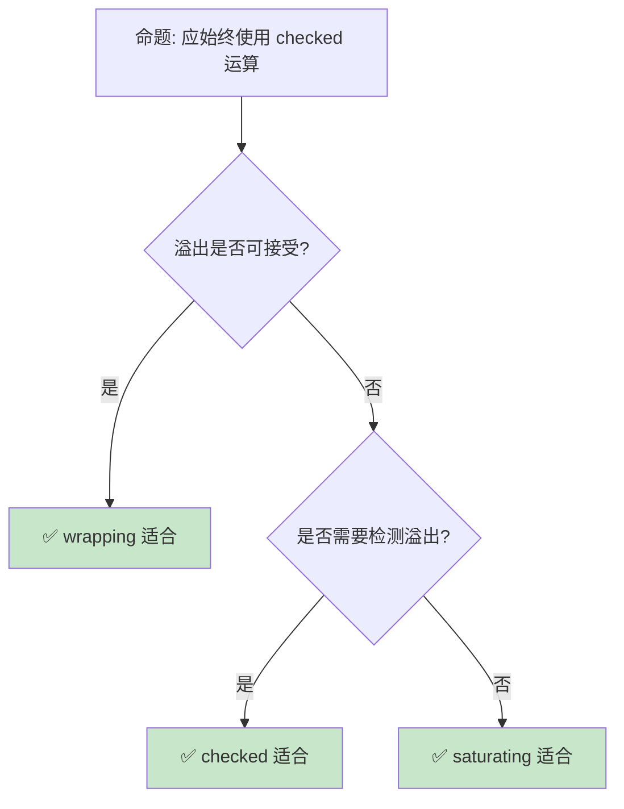

# Rust 数值类型与运算

> **受众**: [归档]
> **Bloom 层级**: 理解 → 应用
> **定位**: 系统讲解 Rust 的**数值类型**——从整数、浮点到 wrapping/saturating 运算，分析类型安全如何防止数值错误。
> **前置概念**: [Type System](04_type_system.md) · [Ownership](01_ownership.md)
> **后置概念**: [Generics](../02_intermediate/02_generics.md) · [Performance](../06_ecosystem/15_performance_optimization.md)

> **定理链**: N/A — 描述性/综述性/导航性文档，不涉及形式化定理链
---

> **来源**: [The Rust Programming Language](https://doc.rust-lang.org/book/) · [Rust Reference — Types](https://doc.rust-lang.org/reference/types.html) · [std::num](https://doc.rust-lang.org/std/num/index.html) · [Wikipedia — Integer Overflow](https://en.wikipedia.org/wiki/Integer_overflow) · [IEEE 754](https://en.wikipedia.org/wiki/IEEE_754)

## 📑 目录

- [Rust 数值类型与运算](#rust-数值类型与运算)
  - [📑 目录](#-目录)
  - [一、核心概念](#一核心概念)
    - [1.1 整数类型](#11-整数类型)
    - [1.2 浮点类型](#12-浮点类型)
    - [1.3 类型转换](#13-类型转换)
  - [二、运算模式](#二运算模式)
    - [2.1 溢出检查](#21-溢出检查)
    - [2.2 Wrapping 与 Saturating](#22-wrapping-与-saturating)
    - [2.3 SIMD](#23-simd)
  - [三、反命题与边界分析](#三反命题与边界分析)
    - [3.1 反命题树](#31-反命题树)
    - [3.2 边界极限](#32-边界极限)
  - [四、常见陷阱](#四常见陷阱)
  - [五、来源与延伸阅读](#五来源与延伸阅读)
  - [相关概念文件](#相关概念文件)
  - [权威来源索引](#权威来源索引)

---

## 一、核心概念
>
> [来源: [Rust Reference](https://doc.rust-lang.org/reference/)]
>
> [来源: [Rust Reference](https://doc.rust-lang.org/reference/)]

### 1.1 整数类型
>
> **[来源: [Rust Reference](https://doc.rust-lang.org/reference/)]**

```text
Rust 整数类型:

  有符号整数:
  ├── i8:  -128 ~ 127
  ├── i16: -32,768 ~ 32,767
  ├── i32: -2,147,483,648 ~ 2,147,483,647
  ├── i64: -9,223,372,036,854,775,808 ~ 9,223,372,036,854,775,807
  ├── i128: 更大范围
  └── isize: 指针大小（32/64 位）

  无符号整数:
  ├── u8:  0 ~ 255
  ├── u16: 0 ~ 65,535
  ├── u32: 0 ~ 4,294,967,295
  ├── u64: 0 ~ 18,446,744,073,709,551,615
  ├── u128: 更大范围
  └── usize: 指针大小，用于索引和大小

  字面量:
  ├── 十进制: 98_222
  ├── 十六进制: 0xff
  ├── 八进制: 0o77
  ├── 二进制: 0b1111_0000
  └── 后缀: 57u8, 42i64

  默认类型:
  └── 未指定类型时，整数默认 i32
```

> **认知功能**: **Rust 的显式整数类型防止了 C/C++ 中的隐式转换错误**——大小和符号在类型中明确表达。
> [来源: [Rust Reference — Integer Types](https://doc.rust-lang.org/reference/types/numeric.html#integer-types)]

---

### 1.2 浮点类型
>
> **[来源: [The Rust Programming Language](https://doc.rust-lang.org/book/)]**

```text
Rust 浮点类型:

  f32: 单精度 IEEE 754
  ├── 约 6-9 位有效数字
  ├── 范围: ~3.4 × 10³⁸
  └── 适合图形/GPU

  f64: 双精度 IEEE 754（默认）
  ├── 约 15-17 位有效数字
  ├── 范围: ~1.8 × 10³⁰⁸
  └── 默认浮点类型

  特殊值:
  ├── NaN (Not a Number): 0.0 / 0.0
  ├── Infinity: 1.0 / 0.0
  ├── -Infinity: -1.0 / 0.0
  └── -0.0: 负零

  注意事项:
  ├── 浮点比较不能用 ==
  ├── 精度损失累积
  └── 金融计算需用定点或有理数
```

> **浮点洞察**: **Rust 的 f64 默认避免了 f32 的精度陷阱**——但浮点本质上的不精确性仍需注意。
> [来源: [IEEE 754](https://en.wikipedia.org/wiki/IEEE_754)]

---

### 1.3 类型转换
>
> **[来源: [Rust Standard Library](https://doc.rust-lang.org/std/)]**

```text
类型转换:

  显式转换（as）:
  let a: i32 = 10;
  let b: i64 = a as i64;

  转换规则:
  ├── 截断: 大类型→小类型，高位丢弃
  ├── 符号扩展: 有符号扩展保留符号
  ├── 零扩展: 无符号扩展补零
  └── 浮点→整数: 向零截断

  TryInto（安全转换）:
  use std::convert::TryInto;

  let a: i64 = 300;
  let b: i8 = a.try_into().unwrap(); // 错误！溢出

  转换可能失败的情况:
  ├── 大→小可能溢出
  ├── 有符号→无符号可能改变值
  ├── 浮点→整数可能损失精度
  └── NaN → 整数未定义
```

> **转换洞察**: **as 转换是 Rust 的显式"信任我"操作**——TryInto 提供了安全的替代方案。
> [来源: [std::convert::TryInto](https://doc.rust-lang.org/std/convert/trait.TryInto.html)]

---

## 二、运算模式
>
> [来源: [Rust Reference](https://doc.rust-lang.org/reference/)]
>
> [来源: [Rust Reference](https://doc.rust-lang.org/reference/)]

### 2.1 溢出检查
>
> **[来源: [Rustonomicon](https://doc.rust-lang.org/nomicon/)]**

```text
溢出行为:

  Debug 模式:
  ├── 整数溢出 panic
  ├── 保护开发阶段
  └── 性能开销可接受

  Release 模式:
  ├── 整数溢出 wrapping（二进制补码环绕）
  ├── 性能优先
  └── 不 panic

  代码示例:

  let a: u8 = 255;
  let b = a + 1; // Debug: panic! Release: 0

  显式控制:
  ├── wrapping_add: 明确 wrapping
  ├── saturating_add: 饱和到最大值
  ├── checked_add: 返回 Option
  └── overflowing_add: 返回 (值, 是否溢出)
```

> **溢出洞察**: **Rust 的溢出行为区分了 Debug 和 Release**——开发时安全，发布时性能。
> [来源: [Rust Reference — Overflow](https://doc.rust-lang.org/reference/expressions/operator-expr.html#overflow)]

---

### 2.2 Wrapping 与 Saturating
>
> **[来源: [Rust By Example](https://doc.rust-lang.org/rust-by-example/)]**

```text
运算模式:

  Checked: 安全但需处理 None
  let sum = a.checked_add(b)?;

  Wrapping: 二进制补码环绕
  let sum = a.wrapping_add(b);
  // 255u8.wrapping_add(1) == 0

  Saturating: 饱和到边界
  let sum = a.saturating_add(b);
  // 255u8.saturating_add(1) == 255

  Overflowing: 返回是否溢出
  let (sum, overflowed) = a.overflowing_add(b);

  使用场景:
  ┌─────────────────┬─────────────────┐
  │ 场景            │ 推荐方法        │
  ├─────────────────┼─────────────────┤
  │ 通用计算        │ checked_*, ?    │
  │ 位运算/哈希     │ wrapping_*      │
  │ 图形/颜色       │ saturating_*    │
  │ 性能关键循环    │ wrapping_*      │
  │ 检测溢出        │ overflowing_*   │
  └─────────────────┴─────────────────┘
```

> **运算洞察**: **Rust 提供四种溢出策略让开发者显式选择**——而非隐藏默认行为。
> [来源: [std::num::Wrapping](https://doc.rust-lang.org/std/num/struct.Wrapping.html)]

---

### 2.3 SIMD
>
> **[来源: [Rust Cookbook](https://rust-lang-nursery.github.io/rust-cookbook/)]**

```text
SIMD (Single Instruction Multiple Data):

  std::simd ( nightly / Rust 1.64+ 实验):
  ├── 向量类型: f32x4, i32x8
  ├── 并行操作: +, -, *, /
  ├── 掩码操作: 条件选择
  └── 对齐加载/存储

  代码示例:

  use std::simd::*;

  let a = f32x4::from_array([1.0, 2.0, 3.0, 4.0]);
  let b = f32x4::from_array([5.0, 6.0, 7.0, 8.0]);
  let c = a + b; // [6.0, 8.0, 10.0, 12.0]

  第三方 crate:
  ├── packed_simd: 稳定版替代
  ├── wide: 跨平台 SIMD
  └── simdeez: 运行时选择 SIMD 宽度

  注意:
  ├── 需要平台支持
  ├── 对齐要求
  └── 边界处理
```

> **SIMD 洞察**: **SIMD 是数值计算性能的最后防线**——向量化可将吞吐量提升 4-16 倍。
> [来源: [std::simd](https://doc.rust-lang.org/std/simd/index.html)]

---

## 三、反命题与边界分析
>
> [来源: [Rust Reference](https://doc.rust-lang.org/reference/)]
>
> [来源: [Rust Reference](https://doc.rust-lang.org/reference/)]

### 3.1 反命题树
>
> **[来源: [crates.io](https://crates.io/)]**



> **认知功能**: **数值运算策略取决于溢出语义需求**——没有 universally best 的选择。
> [来源: [Rust Performance Book](https://nnethercote.github.io/perf-book/)]

---

### 3.2 边界极限
>
> **[来源: [docs.rs](https://docs.rs/)]**

```text
边界 1: 浮点精度
├── 金融计算不能用 f64
├── 累积误差严重
└── 缓解: 使用 decimal crate

边界 2: 跨平台差异
├── usize/isize 大小因平台而异
├── 序列化/协议需固定大小
└── 缓解: 显式使用 u32/u64

边界 3: 常量求值
├── const fn 中浮点比较不稳定
├── 编译期计算限制
└── 缓解: 避免 const 中的浮点比较

边界 4: 性能
├── checked 运算有分支开销
├── wrapping 是免费操作
└── 缓解: Release 模式 + 显式选择

边界 5: FFI
├── C 的 int/long 映射到 Rust 可能不清晰
├── 平台相关类型
└── 缓解: 使用 libc crate 的类型
```

> **边界要点**: 数值类型的边界与**浮点精度**、**跨平台**、**常量求值**、**性能**和**FFI**相关。
> [来源: [Rust Reference — Numeric Types](https://doc.rust-lang.org/reference/types/numeric.html)]

---

## 四、常见陷阱
>
> [来源: [Rust Reference](https://doc.rust-lang.org/reference/)]
>
> [来源: [TRPL](https://doc.rust-lang.org/book/)]

```text
陷阱 1: 默认整数类型假设
  ❌ 假设 usize 是 64 位
     let x: usize = 1 << 40; // 32 位系统溢出！

  ✅ 使用 u64 如果需要大值
     let x: u64 = 1 << 40;

陷阱 2: 浮点比较
  ❌ 直接使用 == 比较浮点
     if a == b { ... } // 危险！

  ✅ 使用 epsilon 比较
     if (a - b).abs() < f64::EPSILON { ... }

陷阱 3: as 截断
  ❌ 忽略 as 的截断风险
     let x: i32 = 1000;
     let y: i8 = x as i8; // 截断为 -24

  ✅ 使用 try_into
     let y: i8 = x.try_into()?;

陷阱 4: 除以零
  ❌ 整数除以零 panic
     let x = 1 / 0; // panic!

  ✅ 检查除数
     if divisor != 0 { result = dividend / divisor; }

陷阱 5: 位运算优先级
  ❌ 混淆 & 和 &&
     if x & 1 == 0 { ... } // 实际为 x & (1 == 0)

  ✅ 使用括号
     if (x & 1) == 0 { ... }
```

> **陷阱总结**: 数值类型的陷阱主要与**类型假设**、**浮点比较**、**截断**、**除零**和**优先级**相关。
> [来源: [Rust By Example — Types](https://doc.rust-lang.org/rust-by-example/primitives.html)]

---

## 五、来源与延伸阅读
>
> [来源: [Rust Reference](https://doc.rust-lang.org/reference/)]
>
> [来源: [TRPL](https://doc.rust-lang.org/book/)]

| 来源 | 可信度 | 说明 |
|:---|:---:|:---|
| [Rust Reference — Numeric](https://doc.rust-lang.org/reference/types/numeric.html) | ✅ 一级 | 官方参考 |
| [std::num](https://doc.rust-lang.org/std/num/index.html) | ✅ 一级 | 标准库 |
| [TRPL — Data Types](https://doc.rust-lang.org/book/ch03-02-data-types.html) | ✅ 一级 | 数据类型 |
| [IEEE 754](https://en.wikipedia.org/wiki/IEEE_754) | ✅ 二级 | 浮点标准 |
| [Rust Performance Book](https://nnethercote.github.io/perf-book/) | ✅ 二级 | 性能 |

---

```rust
fn main() {
    let a: i32 = 42;
    let b: f64 = 3.14;
    let c: u8 = 255;
    println!("{}", a + b as i32 + c as i32);
}
```

```rust
fn main() {
    let max_u8 = u8::MAX;
    println!("{}", max_u8); // 255
}
```

## 相关概念文件
>
> [来源: [Rust Reference](https://doc.rust-lang.org/reference/)]
>
> [来源: [Rust Reference](https://doc.rust-lang.org/reference/)]

- [Type System](04_type_system.md) — 类型系统
- [Generics](../02_intermediate/02_generics.md) — 泛型
- [Performance](../06_ecosystem/15_performance_optimization.md) — 性能优化
- [Error Handling](../02_intermediate/04_error_handling.md) — 错误处理

---

> **权威来源**: [Rust Reference](https://doc.rust-lang.org/reference/)
>
> **权威来源对齐变更日志**: 2026-05-22 创建 [来源: Authority Source Sprint Batch 12]

**文档版本**: 1.0
**对应 Rust 版本**: 1.96.0+ (Edition 2024)
**最后更新**: 2026-05-22
**状态**: ✅ 概念文件创建完成

---

## 权威来源索引

> **[来源: [Type Theory Research](https://en.wikipedia.org/wiki/Type_theory)]**
>
> **[来源: [Rust Reference](https://doc.rust-lang.org/reference/)]**
>
> **[来源: [The Rust Programming Language](https://doc.rust-lang.org/book/)]**
>
> **[来源: [Rust Standard Library](https://doc.rust-lang.org/std/)]**
>

---
