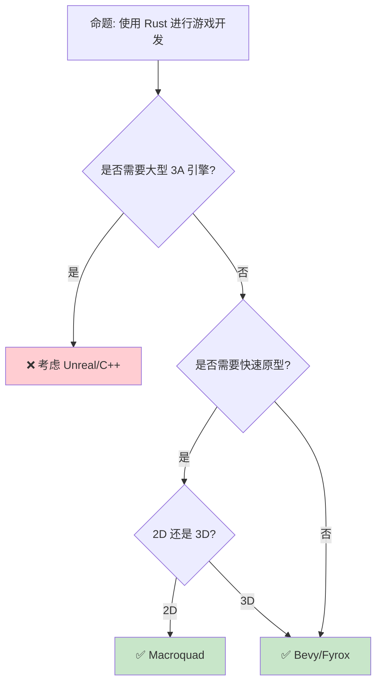

> **Summary**: Ecosystem 26 Game Development Deprecated. Core Rust concept.
>
# Rust 游戏开发
>
> **EN**: Ecosystem 26 Game Development Deprecated

> **受众**: [归档]
> **Bloom 层级**: 应用 → 评价
> **A/S/P 标记**: **A+S+P** — ApplicationStructureProcedure
> **双维定位**: P×Cre — 设计游戏开发架构
> **定位**: 探讨 Rust 在游戏开发领域的应用——从 ECS 架构到渲染引擎，分析 Rust 的性能优势和开发模式。
> **前置概念**: [ECS](07_game_ecs.md) · [Memory](../02_intermediate/03_memory_management.md) · [Concurrency](../03_advanced/01_concurrency.md) · [Ownership](../01_foundation/01_ownership.md)
> **后置概念**: [WebAssembly](11_webassembly.md) · [Performance](15_performance_optimization.md)
> **定理链**: N/A — 描述性/综述性/导航性文档，不涉及形式化定理链
>
> **来源**: [Rust RFCs](https://github.com/rust-lang/rfcs) · [Rust Blog](https://blog.rust-lang.org/)
---

> **来源**: [Bevy Engine](https://bevyengine.org/) · [wgpu](https://wgpu.rs/) · [Rust GameDev WG](https://gamedev.rs/) · [Wikipedia — Game Engine](https://en.wikipedia.org/wiki/Game_engine)

## 📑 目录

- [Rust 游戏开发](#rust-游戏开发)
  - [📑 目录](#-目录)
  - [一、核心概念](#一核心概念)
    - [1.1 游戏引擎概览](#11-游戏引擎概览)
    - [1.2 ECS 架构](#12-ecs-架构)
  - [二、渲染与图形](#二渲染与图形)
    - [2.1 wgpu 与跨平台渲染](#21-wgpu-与跨平台渲染)
    - [2.2 渲染管线](#22-渲染管线)
  - [三、音频与输入](#三音频与输入)
  - [四、性能优化](#四性能优化)
  - [五、反命题与适用场景](#五反命题与适用场景)
    - [5.1 反命题树](#51-反命题树)
    - [5.2 适用场景](#52-适用场景)
  - [六、常见陷阱](#六常见陷阱)
  - [七、来源与延伸阅读](#七来源与延伸阅读)
  - [相关概念文件](#相关概念文件)
  - [权威来源索引](#权威来源索引)
  - [嵌入式测验（Embedded Quiz）](#嵌入式测验embedded-quiz)
    - [测验 1：《Rust 游戏开发》是一份归档文件。归档文件在知识体系中有什么作用？（理解层）](#测验-1rust-游戏开发是一份归档文件归档文件在知识体系中有什么作用理解层)
    - [测验 2：阅读归档文件时应该注意什么？（理解层）](#测验-2阅读归档文件时应该注意什么理解层)
    - [测验 3：归档文件与活跃概念文件的主要区别是什么？（理解层）](#测验-3归档文件与活跃概念文件的主要区别是什么理解层)

---

## 一、核心概念
>
> [来源: [Rust Reference](https://doc.rust-lang.org/reference/)]
>
> [来源: [Rust Reference](https://doc.rust-lang.org/reference/)]

### 1.1 游戏引擎概览
>
> **[来源: [Rust Reference](https://doc.rust-lang.org/reference/)]**

```text
Rust 游戏引擎生态:

  Bevy:
  ├── 数据驱动 ECS 架构
  ├── 模块化设计
  ├── 跨平台（桌面/移动/Web）
  └── 活跃社区

  Fyrox:
  ├── 场景图 + ECS 混合
  ├── 内置编辑器
  ├── 3D 优先
  └── 面向传统 OOP 开发者

  Macroquad:
  ├── 极简 API
  ├── 快速原型
  ├── 轻量级
  └── 2D 优先

  引擎对比:
  ┌─────────────────┬─────────────────┬─────────────────┬─────────────────┐
  │ 特性            │ Bevy            │ Fyrox           │ Macroquad       │
  ├─────────────────┼─────────────────┼─────────────────┼─────────────────┤
  │ 架构            │ ECS             │ 混合            │ 传统            │
  │ 3D 支持         │ ✅              │ ✅              │ ⚠️              │
  │ 编辑器          │ 第三方          │ 内置            │ 无              │
  │ 学习曲线        │ 中              │ 中              │ 低              │
  │ 适用场景        │ 通用            │ 3D 游戏         │ 2D 原型         │
  └─────────────────┴─────────────────┴─────────────────┴─────────────────┘
> [来源: [TRPL](https://doc.rust-lang.org/book/)]

> [来源: [Bevy Engine](https://bevyengine.org/learn/book/introduction/)]
```

> **认知功能**: **Bevy 的纯 ECS 架构是 Rust 游戏开发的代表范式**——数据驱动、缓存友好、并行安全。
> [来源: [Bevy Engine](https://bevyengine.org/learn/book/introduction/)]

---

### 1.2 ECS 架构
>
> **[来源: [The Rust Programming Language](https://doc.rust-lang.org/book/)]**

```text
ECS (Entity-Component-System):

  核心概念:
  ├── Entity: 唯一 ID，无数据
  ├── Component: 纯数据（位置、速度、生命值）
  └── System: 处理逻辑（遍历组件）

  内存布局:
  ├── 组件存储为 SoA (Structure of Arrays)
  ├── 缓存友好（连续内存访问）
  └── 并行处理安全

  Bevy 示例:

  #[derive(Component)]
  struct Position { x: f32, y: f32 }

  #[derive(Component)]
  struct Velocity { x: f32, y: f32 }

  fn move_system(
      mut query: Query<(&mut Position, &Velocity)>
  ) {
      for (mut pos, vel) in query.iter_mut() {
          pos.x += vel.x;
          pos.y += vel.y;
      }
  }

  fn main() {
      App::new()
          .add_systems(Update, move_system)
          .run();
  }

  优势:
  ├── 并行安全（系统独立）
  ├── 缓存友好（连续内存）
  ├── 组合优于继承
  └── 运行时灵活
```

```rust
#[derive(Debug, Clone, Copy)]
struct Vec2 {
    x: f32,
    y: f32,
}

impl Vec2 {
    fn add(self, other: Vec2) -> Vec2 {
        Vec2 {
            x: self.x + other.x,
            y: self.y + other.y,
        }
    }
}

#[derive(Debug)]
struct Entity {
    pos: Vec2,
    vel: Vec2,
}

fn update(entities: &mut [Entity]) {
    for e in entities {
        e.pos = e.pos.add(e.vel);
    }
}

fn main() {
    let mut world = vec![
        Entity {
            pos: Vec2 { x: 0.0, y: 0.0 },
            vel: Vec2 { x: 1.0, y: 0.5 },
        },
    ];
    update(&mut world);
    println!("{:?}", world);
}
```

> **ECS 洞察**: **ECS 架构天然适合 Rust 的所有权模型**——系统之间不共享可变状态，编译期保证并行安全。
> [来源: [Bevy ECS Guide](https://bevyengine.org/learn/book/)]
> [来源: [Bevy ECS](https://bevyengine.org/learn/book/)]

---

## 二、渲染与图形
>
> [来源: [Rust Reference](https://doc.rust-lang.org/reference/)]
>
> [来源: [TRPL](https://doc.rust-lang.org/book/)]

### 2.1 wgpu 与跨平台渲染
>
> **[来源: [Rust Standard Library](https://doc.rust-lang.org/std/)]**

```text
wgpu:

  定位: WebGPU 标准的 Rust 实现
  ├── 跨平台: Vulkan/Metal/DX12/WebGPU
  ├── 现代 GPU API 抽象
  ├── 安全封装（避免内存泄漏）
  └── Rust 类型安全

  架构:
  ┌─────────────────┐
  │   wgpu API      │  ← Rust API
  ├─────────────────┤
  │  Vulkan/Metal   │  ← 后端抽象
  │  /DX12/WebGPU   │
  └─────────────────┘
> [来源: [TRPL](https://doc.rust-lang.org/book/)]

  代码示例:

  async fn run() {
      let instance = wgpu::Instance::default();
      let adapter = instance
          .request_adapter(&wgpu::RequestAdapterOptions::default())
          .await
          .unwrap();

      let (device, queue) = adapter
          .request_device(&wgpu::DeviceDescriptor::default(), None)
          .await
          .unwrap();

      // 创建渲染管线...
  }

  优势:
  ├── 一套代码多平台运行
  ├── 现代 GPU 特性（计算着色器）
  └── Rust 内存安全
```

> **wgpu 洞察**: **wgpu 让 Rust 游戏可以编译到 WebAssembly 并在浏览器运行**——真正的跨平台。
> [来源: [wgpu](https://wgpu.rs/)]

---

### 2.2 渲染管线
>
> **[来源: [Rustonomicon](https://doc.rust-lang.org/nomicon/)]**

```text
渲染管线:

  现代游戏渲染:
  ├── 几何处理（顶点着色器）
  ├── 光栅化
  ├── 片段着色器
  ├── 后处理（Bloom、SSAO）
  └── 合成输出

  Bevy 渲染:
  ├── 基于 wgpu
  ├── PBR 材质系统
  ├── 光照系统（点光/方向光/环境光）
  └── 后处理管线

  性能考量:
  ├── Draw call 批处理
  ├── GPU 实例化
  ├── LOD（细节层次）
  └── 遮挡剔除
```

> **渲染洞察**: **Rust 的零成本抽象让渲染代码既可读又高效**——无运行时开销。
> [来源: [Bevy Rendering](https://bevyengine.org/learn/book/)]

---

## 三、音频与输入
>
> [来源: [Rust Reference](https://doc.rust-lang.org/reference/)]
>
> [来源: [TRPL](https://doc.rust-lang.org/book/)]

```text
音频系统:

  rodio:
  ├── 纯 Rust 音频播放
  ├── 支持 WAV/MP3/OGG
  └── 简单 API

  输入系统:
  ├── winit: 窗口和输入事件
  ├── gilrs: 游戏手柄
  └── 跨平台抽象

  代码示例:

  use rodio::{Decoder, OutputStream, Sink};
  use std::fs::File;

  fn play_sound() {
      let (_stream, stream_handle) = OutputStream::try_default().unwrap();
      let sink = Sink::try_new(&stream_handle).unwrap();

      let file = File::open("music.mp3").unwrap();
      let source = Decoder::new(file).unwrap();
      sink.append(source);
      sink.sleep_until_end();
  }
```

> **音频洞察**: **rodio 提供简单的 Rust 音频播放**——纯 Rust 实现，无外部依赖。
> [来源: [rodio](https://github.com/RustAudio/rodio)]

---

## 四、性能优化
>
> [来源: [Rust Reference](https://doc.rust-lang.org/reference/)]
>
> [来源: [Rust Reference](https://doc.rust-lang.org/reference/)]

```text
游戏性能优化:

  Rust 优势:
  ├── 无 GC 暂停（确定性帧率）
  ├── 内存布局控制（SoA、对齐）
  ├── 并行安全（ECS 系统）
  └── SIMD 优化

  常见优化:
  ├── 对象池（避免分配）
  ├── 空间分割（四叉树、BVH）
  ├── 增量更新（减少遍历）
  └── 异步加载（资源流式）

  性能对比:
  ┌─────────────────┬─────────────────┬─────────────────┐
  │ 方面            │ Rust (Bevy)     │ C++ (Unreal)    │
  ├─────────────────┼─────────────────┼─────────────────┤
  │ GC 暂停         │ 无              │ 无              │
  │ 内存安全        │ 编译期保证      │ 手动管理        │
  │ 并行安全        │ 编译期保证      │ 手动同步        │
  │ 生态成熟度      │ 中              │ 高              │
  │ 学习曲线        │ 中              │ 陡峭            │
  └─────────────────┴─────────────────┴─────────────────┘
> [来源: [TRPL](https://doc.rust-lang.org/book/)]

> [来源: [Rust GameDev WG](https://gamedev.rs/)]
```

```rust
#[derive(Debug)]
enum GameState {
    Menu,
    Playing { score: u32 },
    GameOver,
}

fn transition(state: GameState, event: &str) -> GameState {
    match (state, event) {
        (GameState::Menu, "start") => GameState::Playing { score: 0 },
        (GameState::Playing { score }, "score") => {
            GameState::Playing { score: score + 10 }
        }
        (GameState::Playing { .. }, "end") => GameState::GameOver,
        (GameState::GameOver, "restart") => GameState::Menu,
        (s, _) => s,
    }
}

fn main() {
    let mut state = GameState::Menu;
    state = transition(state, "start");
    state = transition(state, "score");
    state = transition(state, "end");
    println!("{:?}", state);
}
```

> **性能洞察**: **Rust 的编译期保证让游戏性能优化更安全**——无数据竞争、无 use-after-free。
> [来源: [Rust GameDev WG](https://gamedev.rs/)] · [来源: [Wikipedia — Game Engine](https://en.wikipedia.org/wiki/Game_engine)]

---

## 五、反命题与适用场景
>
> [来源: [Rust Reference](https://doc.rust-lang.org/reference/)]

### 5.1 反命题树
>
> **[来源: [Rust By Example](https://doc.rust-lang.org/rust-by-example/)]**



> **选择洞察**: **独立游戏和 2D 原型首选 Rust，大型 3A 仍用成熟商业引擎**。
> [来源: [Rust GameDev](https://gamedev.rs/)]

---

### 5.2 适用场景
>
> **[来源: [Rust Cookbook](https://rust-lang-nursery.github.io/rust-cookbook/)]**

```text
适用场景:

  适合 Rust:
  ├── 独立游戏（2D/3D）
  ├── 游戏原型开发
  ├── 游戏工具链
  ├── 游戏服务器后端
  └── Web 游戏（WASM）

  不适合 Rust:
  ├── 大型 3A 游戏（生态不成熟）
  ├── 需要成熟编辑器的工作流
  ├── 主机平台首发（工具链限制）
  └── 快速外包项目

  混合使用:
  ├── Rust 做高性能模块
  ├── Unity/Unreal 做内容创作
  └── FFI 桥接
```

> **场景洞察**: **Rust 在游戏开发中更适合模块化和独立项目**——大型项目需要生态成熟度。
> [来源: [Bevy Engine](https://bevyengine.org/)]

---

## 六、常见陷阱
>
> [来源: [Rust Reference](https://doc.rust-lang.org/reference/)]

```text
陷阱 1: ECS 过度设计
  ❌ 对所有类型使用 ECS
     // 简单 UI 不需要 ECS

  ✅ 传统方式处理 UI
     // ECS 用于游戏实体

陷阱 2: 忽略资源加载
  ❌ 同步加载大量资源
     // 帧率骤降

  ✅ 异步加载 + 加载屏幕
     // AssetServer::load

陷阱 3: 系统顺序依赖
  ❌ 系统隐式依赖执行顺序
     // 导致非确定性 bug

  ✅ 显式标注系统顺序
     // .after() .before()

陷阱 4: 内存泄漏
  ❌ 循环引用实体
     // Entity 不会被释放

  ✅ 使用 commands.despawn()
     // 显式清理

陷阱 5: 过度优化
  ❌ 过早优化 ECS 查询
     // 复杂化代码

  ✅ 先实现功能，再 profile
     // 使用 tracing
```

> **陷阱总结**: 游戏开发的陷阱与**ECS 设计**、**资源加载**、**系统顺序**和**生命周期管理**相关。
> [来源: [Bevy Best Practices](https://bevyengine.org/learn/book/)]

---

## 七、来源与延伸阅读
>
> [来源: [Rust Reference](https://doc.rust-lang.org/reference/)]

| 来源 | 可信度 | 说明 |
|:---|:---:|:---|
| [Bevy Engine](https://bevyengine.org/) | ✅ 一级 | 官方 |
| [wgpu](https://wgpu.rs/) | ✅ 一级 | 官方 |
| [Rust GameDev WG](https://gamedev.rs/) | ✅ 二级 | 社区 |
| [rodio](https://github.com/RustAudio/rodio) | ✅ 二级 | 音频 |
| [Are We Game Yet](https://arewegameyet.rs/) | ✅ 二级 | 生态盘点 |
| [Rust Book](https://doc.rust-lang.org/book/) | ✅ 一级 | 官方教程 |

---

## 相关概念文件
>
> [来源: [Rust Reference](https://doc.rust-lang.org/reference/)]
>
> [来源: [Rust Reference](https://doc.rust-lang.org/reference/)]

- [ECS](07_game_ecs.md) — ECS 模式
- [WebAssembly](11_webassembly.md) — WebAssembly
- [Performance](15_performance_optimization.md) — 性能优化
- [Memory](../02_intermediate/03_memory_management.md) — 内存管理
- [Concurrency](../03_advanced/01_concurrency.md) — 并发
- [Ownership](../01_foundation/01_ownership.md) — 所有权

---

> **权威来源**: [Rust Reference](https://doc.rust-lang.org/reference/)
>
> **权威来源对齐变更日志**: 2026-05-22 创建 [来源: Authority Source Sprint Batch 12]

**文档版本**: 1.0
**对应 Rust 版本**: 1.96.0+ (Edition 2024)
**最后更新**: 2026-05-22
**状态**: ✅ 概念文件创建完成

---

## 权威来源索引

> **[来源: [crates.io](https://crates.io/)]**
>
> **[来源: [Rust By Example](https://doc.rust-lang.org/rust-by-example/)]**
>
> **[来源: [Rust Reference](https://doc.rust-lang.org/reference/)]**
>
> **[来源: [The Rust Programming Language](https://doc.rust-lang.org/book/)]**
>
> **[来源: [Rust Standard Library](https://doc.rust-lang.org/std/)]**
>

---

## 嵌入式测验（Embedded Quiz）

### 测验 1：《Rust 游戏开发》是一份归档文件。归档文件在知识体系中有什么作用？（理解层）

**题目**: 《Rust 游戏开发》是一份归档文件。归档文件在知识体系中有什么作用？

<details>
<summary>✅ 答案与解析</summary>

保留历史版本的内容，便于追溯概念演变、对比新旧表述，同时避免活跃学习路径被过时信息干扰。
</details>

---

### 测验 2：阅读归档文件时应该注意什么？（理解层）

**题目**: 阅读归档文件时应该注意什么？

<details>
<summary>✅ 答案与解析</summary>

注意文件顶部的归档说明和最后更新日期，理解其历史上下文，不要将其中的过时信息当作当前最佳实践。
</details>

---

### 测验 3：归档文件与活跃概念文件的主要区别是什么？（理解层）

**题目**: 归档文件与活跃概念文件的主要区别是什么？

<details>
<summary>✅ 答案与解析</summary>

归档文件不再维护更新，反映的是历史状态；活跃概念文件持续迭代，包含最新的语言特性和最佳实践。
</details>
