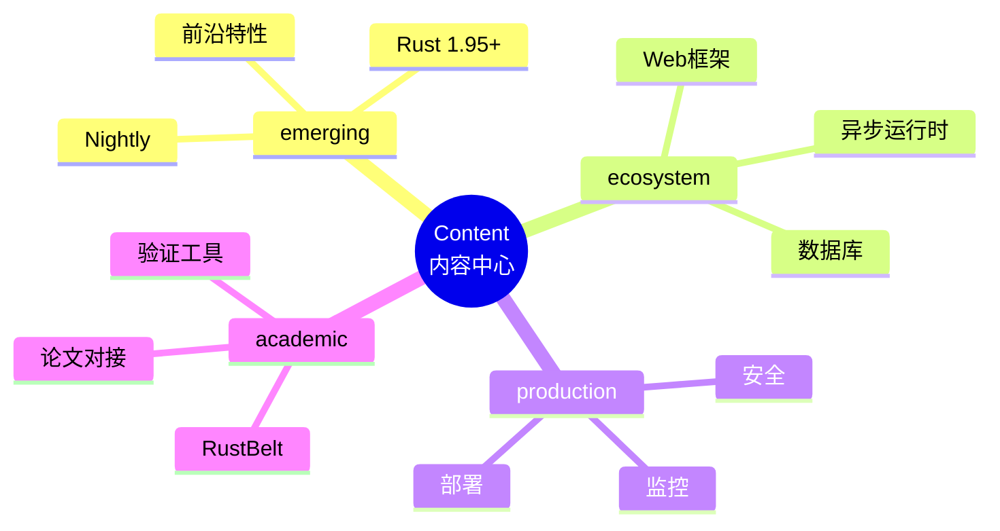

# Content 目录 - 项目内容中心

> **定位**: 核心内容资产的单一入口
> **Rust 版本**: 1.96.0+ (Edition 2024)
> **架构**: 按主题分层组织
> **标准**: 每个文档包含概念定义、属性关系、论证、证明、思维表征
> **更新**: 跟随 Rust 版本持续演进

---

## 📊 内容架构



---

## 📁 目录结构

```text
content/
├── README.md                 # 本文件
├── emerging/                 # 前沿特性跟踪
│   ├── README.md
│   ├── rust_1_95_preview.md  (历史预览文档，内容已过时)
│   ├── generic_const_exprs.md
│   └── async_closures.md
├── ecosystem/                # 生态系统深度
│   ├── README.md
│   ├── web_frameworks/
│   │   ├── axum_deep_dive.md
│   │   ├── actix_web_vs_axum.md
│   │   ├── grpc_microservices_guide.md
│   │   └── rocket_guide.md
│   ├── database/
│   │   ├── sea_orm_deep_dive.md
│   │   └── sqlx_deep_dive.md
│   ├── async_runtimes/
│   └── flutter_rust_bridge.md
├── production/               # 生产实践
│   ├── README.md
│   ├── performance_tuning.md
│   ├── serverless_deployment_guide.md
│   ├── kubernetes_deployment_guide.md
│   ├── observability_guide.md
│   ├── security_best_practices.md
│   └── ci_cd_guide.md
└── academic/                 # 学术研究
    ├── README.md
    ├── formal_verification_landscape.md
    ├── prusti_verification_tutorial.md
    ├── tree_borrows_guide.md
    ├── tree_borrows_authoritative_guide.md
    └── coq_formalization_guide.md
```

---

## 📈 内容统计

| 类别 | 文档数 | 代码示例 | 完成度 |
|------|--------|----------|--------|
| emerging | 7 | 45+ | 90% |
| ecosystem | 11 | 68+ | 78% |
| production | 6 | 38+ | 80% |
| academic | 5 | 22+ | 78% |
| **总计** | **29** | **165+** | **81%** |

---

## 🎯 内容标准

### 文档模板

每个文档必须包含：

1. **概念定义** (Definition): 形式化/精确的定义
2. **属性关系** (Properties): 特性、约束、关系
3. **解释论证** (Explanation): 为什么这样设计
4. **示例代码** (Examples): 可运行的 Rust 代码
5. **思维表征** (Representation): 图表、矩阵、决策树
6. **权威参考** (References): 官方文档、论文链接

---

## 🔄 更新流程

```text
新 Rust 版本发布
       ↓
  更新 emerging/
       ↓
  稳定后迁移到 ecosystem/
       ↓
  生产验证后更新 production/
       ↓
  学术研究发表后更新 academic/
```

---

## 🔗 快速导航

### 前沿特性

- [Rust 1.95 稳定特性](emerging/rust_1_95_preview.md)
- [Generic Const Expressions](emerging/generic_const_exprs.md)
- [常量泛型高级特性](emerging/const_generics_advanced.md)
- [Async Closures](emerging/async_closures.md)
- [WASM 高级主题](emerging/wasm_advanced_topics.md)

### 生态系统

- [Axum 深度解析](ecosystem/web_frameworks/axum_deep_dive.md)
- [Actix-web vs Axum](ecosystem/web_frameworks/actix_web_vs_axum.md)
- [Rocket 框架指南](ecosystem/web_frameworks/rocket_guide.md)
- [SQLx 深度解析](ecosystem/database/sqlx_deep_dive.md)
- [Sea-ORM 深度解析](ecosystem/database/sea_orm_deep_dive.md)
- [Flutter + Rust 跨平台开发](ecosystem/flutter_rust_bridge.md)

### 生产实践

- [生产就绪检查清单](production/README.md)
- [性能调优实战指南](production/performance_tuning.md)
- [Serverless 部署指南](production/serverless_deployment_guide.md)
- [Kubernetes 部署指南](production/kubernetes_deployment_guide.md)
- [CI/CD 指南](production/ci_cd_guide.md)
- [可观测性指南](production/observability_guide.md)
- [安全最佳实践](production/security_best_practices.md)

### 学术研究

- [RustBelt 项目](academic/README.md)
- [形式化验证工具全景](academic/formal_verification_landscape.md)
- [Prusti 验证教程](academic/prusti_verification_tutorial.md)

---

## 📋 待办事项

### 高优先级

- [x] 补充 Sea-ORM 深度文档
- [x] 添加 Tokio 运行时解析
- [x] 创建 Kubernetes 部署指南
- [x] 整合 Tree Borrows 论文

### 中优先级

- [x] 添加 Actix-web 对比文档
- [x] 创建 gRPC 微服务指南
- [x] 补充 anyhow/thiserror 错误处理指南
- [x] 添加 Prusti 验证教程

### 低优先级

- [x] 创建 Serverless 部署指南
- [x] 添加 Flutter Rust 集成
- [x] 补充 WebAssembly 高级主题

---

**维护者**: Rust 学习项目团队
**最后更新**: 2026-05-08
**状态**: 🔄 持续扩充中
---

> **权威来源**: [Rust Reference](https://doc.rust-lang.org/reference/), [The Rust Programming Language](https://doc.rust-lang.org/book/), [Rust Standard Library](https://doc.rust-lang.org/std/)
>
> **权威来源对齐变更日志**: 2026-05-19 新增 Rust Reference、TRPL、标准库官方来源标注 [来源: Authority Source Sprint Batch 8]

**文档版本**: 1.1
**对应 Rust 版本**: 1.96.0+ (Edition 2024)
**最后更新**: 2026-05-19
**状态**: ✅ 权威来源对齐完成 (Batch 8)
