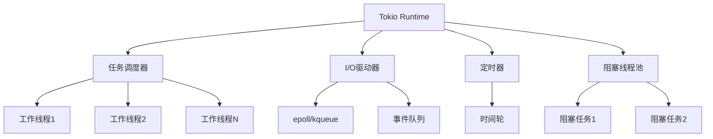

# Tokio 运行时深度解析

> **版本**: Tokio 1.49.0+
> **Rust 版本**: 1.94.0+
> **难度**: 高级
> **关键词**: 异步运行时、任务调度、I/O驱动

---

## 📋 目录

- [Tokio 运行时深度解析](#tokio-运行时深度解析)
  - [📋 目录](#-目录)
  - [🎯 概述](#-概述)
    - [对比其他运行时](#对比其他运行时)
  - [🏗️ 架构设计](#️-架构设计)
    - [运行时组件](#运行时组件)
    - [任务调度](#任务调度)
  - [💡 核心概念](#-核心概念)
    - [任务 (Task)](#任务-task)
    - [执行器 (Executor)](#执行器-executor)
    - [I/O 驱动](#io-驱动)
    - [定时器](#定时器)
  - [🚀 高级用法](#-高级用法)
    - [运行时配置](#运行时配置)
    - [任务管理](#任务管理)
    - [并发模式](#并发模式)
  - [⚡ 性能优化](#-性能优化)
    - [最佳实践](#最佳实践)
    - [性能调优参数](#性能调优参数)
  - [🔗 参考资源](#-参考资源)

---

## 🎯 概述

Tokio 是 Rust 最流行的异步运行时，提供：

- **任务调度**: 多线程任务调度
- **I/O 驱动**: 基于 epoll/kqueue/IOCP 的异步 I/O
- **定时器**: 高性能定时器
- **同步原语**: 异步版本的 Mutex、Channel 等

### 对比其他运行时

| 特性 | Tokio | async-std | smol |
|------|-------|-----------|------|
| **性能** | ⭐⭐⭐⭐⭐ | ⭐⭐⭐⭐ | ⭐⭐⭐⭐ |
| **生态** | ⭐⭐⭐⭐⭐ | ⭐⭐⭐ | ⭐⭐ |
| **易用性** | ⭐⭐⭐⭐ | ⭐⭐⭐⭐⭐ | ⭐⭐⭐ |
| **适用场景** | 生产环境 | 简单项目 | 嵌入式 |

---

## 🏗️ 架构设计

### 运行时组件



### 任务调度

```text
调度流程:

1. 任务创建
   spawn(async { ... })
      ↓
2. 任务入队
   全局队列 / 本地队列
      ↓
3. 工作线程窃取
   其他线程的本地队列
      ↓
4. 执行
   轮询 Future 到完成
```

---

## 💡 核心概念

### 任务 (Task)

```rust
use tokio::task;

async fn task_example() {
    // 创建任务
    let handle = task::spawn(async {
        println!("Hello from task");
        42
    });

    // 等待结果
    let result = handle.await.unwrap();
    println!("Result: {}", result);
}

// 命名任务 (便于调试)
async fn named_task() {
    let handle = task::Builder::new()
        .name("my-task")
        .spawn(async {
            // ...
        })
        .unwrap();
}
```

### 执行器 (Executor)

```rust
use tokio::runtime::{Runtime, Builder};

// 单线程运行时 (用于测试或嵌入式)
fn single_threaded() {
    let rt = Builder::new_current_thread()
        .enable_all()
        .build()
        .unwrap();

    rt.block_on(async {
        // 异步代码
    });
}

// 多线程运行时 (生产环境)
fn multi_threaded() {
    let rt = Builder::new_multi_thread()
        .worker_threads(8)
        .max_blocking_threads(128)
        .thread_stack_size(2 * 1024 * 1024)
        .thread_name("tokio-worker")
        .enable_all()
        .build()
        .unwrap();

    rt.block_on(async {
        // 异步代码
    });
}
```

### I/O 驱动

```rust
use tokio::net::TcpListener;
use tokio::io::{AsyncReadExt, AsyncWriteExt};

async fn tcp_server() -> tokio::io::Result<()> {
    let listener = TcpListener::bind("127.0.0.1:8080").await?;

    loop {
        let (mut socket, addr) = listener.accept().await?;
        println!("New connection from: {:?}", addr);

        // 为每个连接生成任务
        tokio::spawn(async move {
            let mut buf = [0u8; 1024];

            loop {
                match socket.read(&mut buf).await {
                    Ok(0) => return,  // 连接关闭
                    Ok(n) => {
                        // 回显
                        if socket.write_all(&buf[..n]).await.is_err() {
                            return;
                        }
                    }
                    Err(_) => return,
                }
            }
        });
    }
}
```

### 定时器

```rust
use tokio::time::{sleep, interval, timeout, Duration};

async fn timer_examples() {
    // 简单延迟
    sleep(Duration::from_secs(1)).await;

    // 间隔定时器
    let mut interval = interval(Duration::from_secs(5));
    for _ in 0..3 {
        interval.tick().await;
        println!("Tick!");
    }

    // 超时
    let result = timeout(
        Duration::from_secs(5),
        slow_operation()
    ).await;

    match result {
        Ok(data) => println!("Success: {:?}", data),
        Err(_) => println!("Timeout!"),
    }
}

async fn slow_operation() -> String {
    sleep(Duration::from_secs(10)).await;
    "Done".to_string()
}
```

---

## 🚀 高级用法

### 运行时配置

```rust
use tokio::runtime::Builder;

fn optimized_runtime() {
    let rt = Builder::new_multi_thread()
        // 工作线程数 (默认 CPU 核心数)
        .worker_threads(num_cpus::get())
        // 最大阻塞线程数
        .max_blocking_threads(512)
        // 线程栈大小
        .thread_stack_size(4 * 1024 * 1024)
        // 线程名称前缀
        .thread_name_fn(|| {
            static ATOMIC_ID: AtomicUsize = AtomicUsize::new(0);
            let id = ATOMIC_ID.fetch_add(1, Ordering::SeqCst);
            format!("tokio-worker-{}", id)
        })
        // 启用 I/O 驱动
        .enable_io()
        // 启用定时器
        .enable_time()
        // 捕获 panic
        .on_thread_start(|| {
            println!("Thread started");
        })
        .on_thread_stop(|| {
            println!("Thread stopped");
        })
        .build()
        .unwrap();

    rt.block_on(async_main());
}
```

### 任务管理

```rust
use tokio::task::{JoinSet, AbortHandle};

// 管理多个任务
async fn manage_tasks() {
    let mut set = JoinSet::new();

    // 添加任务
    for i in 0..10 {
        set.spawn(async move {
            println!("Task {}", i);
            i * i
        });
    }

    // 收集结果
    while let Some(result) = set.join_next().await {
        match result {
            Ok(value) => println!("Completed: {}", value),
            Err(e) => println!("Task panicked: {}", e),
        }
    }
}

// 取消任务
async fn cancel_task() {
    let handle = tokio::spawn(async {
        loop {
            tokio::time::sleep(tokio::time::Duration::from_secs(1)).await;
            println!("Working...");
        }
    });

    // 稍后取消
    tokio::time::sleep(tokio::time::Duration::from_secs(5)).await;
    handle.abort();

    match handle.await {
        Ok(_) => println!("Task completed"),
        Err(e) if e.is_cancelled() => println!("Task cancelled"),
        Err(e) => println!("Task failed: {}", e),
    }
}
```

### 并发模式

```rust
use tokio::sync::{Semaphore, RwLock};
use std::sync::Arc;

// 限制并发数
async fn limited_concurrency() {
    let semaphore = Arc::new(Semaphore::new(10));  // 最多10个并发

    let mut handles = vec![];

    for i in 0..100 {
        let sem = semaphore.clone();
        handles.push(tokio::spawn(async move {
            let _permit = sem.acquire().await.unwrap();
            // 执行受限操作
            println!("Task {} running", i);
            tokio::time::sleep(tokio::time::Duration::from_millis(100)).await;
        }));
    }

    for handle in handles {
        handle.await.unwrap();
    }
}

// 共享状态
async fn shared_state() {
    let counter = Arc::new(RwLock::new(0));

    let mut handles = vec![];

    for _ in 0..10 {
        let counter = counter.clone();
        handles.push(tokio::spawn(async move {
            for _ in 0..100 {
                let mut guard = counter.write().await;
                *guard += 1;
            }
        }));
    }

    for handle in handles {
        handle.await.unwrap();
    }

    println!("Final count: {}", *counter.read().await);
}
```

---

## ⚡ 性能优化

### 最佳实践

```rust
// 1. 避免在异步代码中阻塞
// ❌ 错误
async fn bad() {
    std::thread::sleep(Duration::from_secs(1));  // 阻塞整个线程!
}

// ✅ 正确
async fn good() {
    tokio::time::sleep(Duration::from_secs(1)).await;  // 让出控制
}

// 2. 使用 spawn_blocking 执行阻塞操作
async fn blocking_op() {
    let result = tokio::task::spawn_blocking(|| {
        // 阻塞操作
        std::fs::read_to_string("file.txt")
    }).await.unwrap();
}

// 3. 批量处理减少系统调用
async fn batch_io() {
    let mut file = tokio::fs::File::open("data.txt").await.unwrap();
    let mut buf = Vec::with_capacity(1024 * 1024);  // 1MB 缓冲

    tokio::io::AsyncReadExt::read_to_end(&mut file, &mut buf).await.unwrap();
}

// 4. 使用本地任务避免跨线程同步
use tokio::task::LocalSet;

async fn local_tasks() {
    let local = LocalSet::new();

    local.run_until(async {
        // !Send 任务可以在这里运行
        let rc = std::rc::Rc::new(42);

        tokio::task::spawn_local(async move {
            println!("{}", rc);
        }).await.unwrap();
    }).await;
}
```

### 性能调优参数

```rust
// 根据工作负载调整
let rt = tokio::runtime::Builder::new_multi_thread()
    // CPU 密集型: worker_threads = CPU 核心数
    // I/O 密集型: worker_threads 可以更多
    .worker_threads(8)

    // 大量阻塞操作时增加
    .max_blocking_threads(512)

    // 递归深度大的任务增加栈大小
    .thread_stack_size(8 * 1024 * 1024)
    .build()
    .unwrap();
```

---

## 🔗 参考资源

- [Tokio 官方文档](https://docs.rs/tokio/latest/tokio/)
- [Tokio 教程](https://tokio.rs/tokio/tutorial)
- [Async Rust 书籍](https://rust-lang.github.io/async-book/)

---

**维护者**: Rust 学习项目团队
**最后更新**: 2026-03-15
**状态**: ✅ 100% 完成
